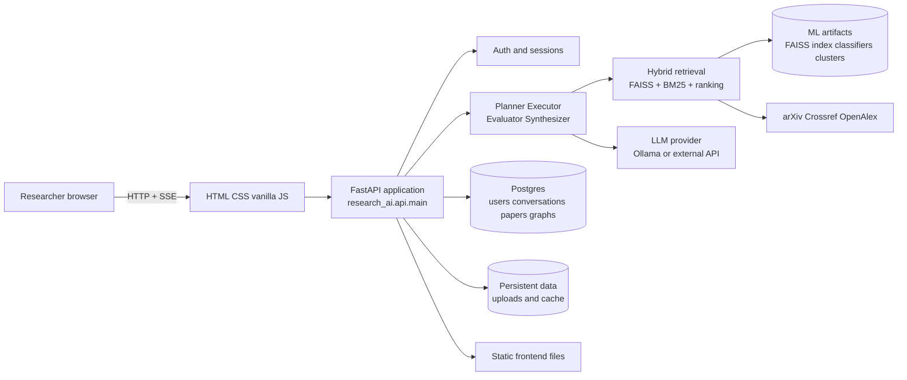
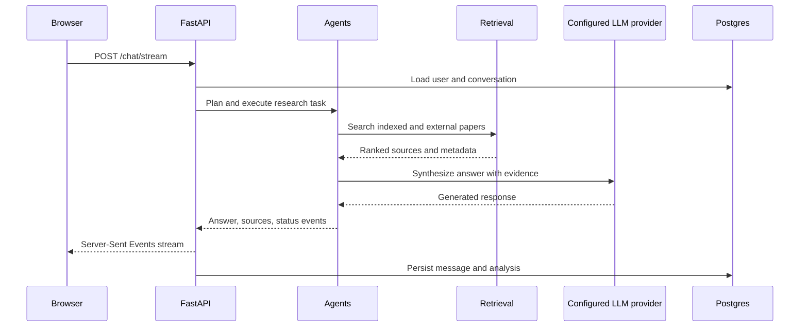

# ResearchAI

Local ML + GenAI research intelligence platform for arXiv-style paper discovery, retrieval, analysis, and persistent research chat. The browser UI, FastAPI application, retrieval/ML pipeline, database, and LLM provider are designed to run locally with Docker Compose or on Kubernetes.

## Application Architecture

The browser calls one FastAPI service. That service owns authentication, conversations, agent orchestration, hybrid retrieval, paper analysis, and the static frontend. Postgres stores durable state; the ML artifacts and embedding model are runtime data; the LLM layer can use Ollama or any configured cloud/OpenAI-compatible API.



The same topology is represented as containers in Compose and as Kubernetes Deployments and Services in `k8s/`. See [the deployment diagram](docs/architecture.md) for the runtime and storage details.

### Request flow



### Application components

- `frontend/`: accessible single-page browser UI using vanilla JavaScript and SSE.
- `src/research_ai/api/`: FastAPI routes, probes, uploads, streaming, and static-file serving.
- `src/research_ai/agents/` and `execution/`: plan, execute, evaluate, and synthesize workflows.
- `src/research_ai/retrieval/` and `ml_models/`: semantic embeddings, FAISS, BM25, ranking, classification, and clustering.
- `src/research_ai/database/` and `memory/`: SQLAlchemy persistence, conversation state, and knowledge graph data.
- `artifacts/`: runtime indexes and trained model files. Large files are downloaded from Hugging Face rather than committed to Git.
- `app.py`: Hugging Face Spaces launcher that downloads missing artifacts and starts Uvicorn.

## Tools And DevOps

### Development and runtime tools

- Python 3.11, FastAPI, Uvicorn, Pydantic, SQLAlchemy, and Psycopg.
- NumPy, Pandas, Polars, SciPy, scikit-learn, SentenceTransformers, FAISS, PyTorch CPU, and Joblib.
- HTML, CSS, and vanilla JavaScript in the frontend; Server-Sent Events for streamed responses.
- Docker and Docker Compose for reproducible local services.
- PostgreSQL for durable production-like local persistence, with SQLite as the no-`DATABASE_URL` development fallback.
- Ollama is an optional local LLM provider; cloud and OpenAI-compatible APIs are also supported.

### DevOps and operations

- Git and GitHub for source control and collaboration.
- Dockerfile and Compose for image builds, service wiring, health checks, and local orchestration.
- Kubernetes manifests with Kustomize under `k8s/` for Deployments, Services, PVCs, Secrets, ConfigMaps, and Ingress.
- Kubernetes probes use `/health` for liveness/startup and `/ready` for traffic readiness.
- `pytest` is the automated test runner; `kubectl`, Kustomize, and an ingress controller are used for cluster deployment.
- Hugging Face Spaces is supported as an alternative Docker deployment target through `app.py`.

## Kubernetes Deployment

The manifests deploy one backend replica and one Postgres instance. LLM inference is external by default and is configured through the provider variables below; Ollama is not required by the Kubernetes profile. Persistent volume claims retain database data, application data, and runtime artifacts across pod restarts. This is a practical single-node deployment baseline; production HA needs managed Postgres, a production-grade LLM endpoint, replicated storage, TLS, and external secret management.

1. Build the image and make it available to the cluster:

```bash
docker build -t research-ai:latest .
# For kind: kind load docker-image research-ai:latest
# For a remote cluster: tag and push to your registry, then edit k8s/backend.yaml.
```

2. Create a private copy of the secret template, replace every placeholder, and apply it:

```bash
kubectl create namespace research-ai
kubectl -n research-ai create secret generic research-ai-secrets \
  --from-literal=DATABASE_URL='postgresql+psycopg://researchai:<password>@postgres:5432/researchai' \
  --from-literal=POSTGRES_DB='researchai' \
  --from-literal=POSTGRES_USER='researchai' \
  --from-literal=POSTGRES_PASSWORD='<password>' \
  --from-literal=SECRET_KEY='<long-random-value>' \
  --from-literal=LLM_API_KEY='<provider-api-key>'
```

Do not apply `k8s/secret.example.yaml` unchanged. It is a documented placeholder only.

3. Apply the platform:

```bash
kubectl apply -k k8s/
kubectl -n research-ai rollout status deployment/research-ai-backend
kubectl -n research-ai get pods,svc,ingress
```

The Kubernetes profile does not download model or artifact packages during pod startup. Mount or provision the required runtime artifacts separately; unavailable optional retrieval features are reported by the health endpoints. For local testing without an ingress controller, use:

```bash
kubectl -n research-ai port-forward svc/research-ai-backend 7860:7860
```

Then open `http://localhost:7860`. The bundled Ingress uses host `research-ai.local` and the `nginx` ingress class; change both for the target cluster.

## What Runs Locally

ResearchAI is now wired for a local Docker architecture:

- `backend`: FastAPI app, agent orchestrator, auth, database access, local ML services
- `postgres`: persistent users, sessions, conversations, messages, papers, analysis records, saved papers, graph records
- `ollama`: optional local LLM provider in Docker Compose
- `/artifacts`: canonical runtime ML artifact directory
- `/data`: runtime cache, uploads, and SQLite fallback data

The LLM is the synthesis layer. Paper discovery stays ML/retrieval-first:

```text
query -> classifier -> FAISS + BM25 -> ranking -> paper analysis -> configured LLM synthesis -> database

## LLM Providers

The application uses an OpenAI-compatible chat-completions contract for generic providers. Configure any compatible service, including OpenAI-compatible gateways and hosted APIs, with:

```env
CLOUD_LLM_PROVIDER=custom
LLM_API_BASE_URL=https://api.openai.com/v1
LLM_API_KEY=replace-me
LLM_MODEL=gpt-4o-mini
```

Provider-specific integrations for Groq, OpenRouter, OmniRouter, Google/Gemini, and Ollama remain available. Ollama is optional; selecting it requires `CLOUD_LLM_PROVIDER=ollama`, `OLLAMA_BASE_URL`, and `OLLAMA_MODEL`.
```

## Install Docker

1. Install Docker Desktop from https://www.docker.com/products/docker-desktop/
2. Start Docker Desktop.
3. Wait until Docker says the Linux engine is running.
4. Verify:

```bash
docker version
docker compose version
```

## Start The App

Copy the environment file and edit secrets if needed:

```bash
cp .env.example .env
```

Start services:

```bash
docker compose up --build
```

Open:

```text
http://localhost:7860
```

Create an account in the UI, then log in. Conversations are stored in the database and survive container restarts.

## Ollama

Docker Compose uses:

```env
CLOUD_LLM_PROVIDER=ollama
OLLAMA_BASE_URL=http://ollama:11434/v1
OLLAMA_MODEL=qwen3:8b
```

Recommended models:

- `qwen3:8b`
- `qwen3:4b`
- `llama3.1:8b`

Pull a model:

```bash
docker compose exec ollama ollama pull qwen3:8b
```

If Ollama is offline or the model is missing, retrieval and persistence still work; LLM synthesis reports the issue instead of pretending it ran.

## ML Artifacts

Canonical layout:

```text
artifacts/
  classification/
    classifier.joblib
    tfidf_vectorizer.joblib
  similarity/
    paper_index.faiss
    paper_metadata.parquet
    embedding_model_name.joblib
  clustering/
    kmeans.joblib
    cluster_assignments.parquet
```

Startup validates artifacts and exposes status at:

```text
GET /system/artifacts
GET /health
```

If large artifacts are hosted in a Hugging Face Dataset repo, configure:

```env
HF_ARTIFACTS_REPO=owner/research-ai-artifacts
HF_TOKEN=optional_private_repo_token
```

Then run:

```bash
python download_artifacts.py
```

The downloader stores files under `ARTIFACTS_ROOT`. It does not silently replace valid files.

## Current Artifact Status

In this workspace, FAISS and metadata validate successfully:

```text
paper_index.faiss: 8000 vectors, dim=384
paper_metadata.parquet: 8000 rows
```

Missing or unavailable artifacts are reported honestly:

```text
classifier.joblib: missing
kmeans.joblib: missing
cluster_assignments.parquet: missing
```

That means search works locally when the SentenceTransformer model is available, while classification and clustering remain unavailable until the real artifacts are restored.

## API Highlights

Auth:

```text
POST /api/auth/signup
POST /api/auth/login
POST /api/auth/logout
GET  /api/auth/me
PATCH /api/auth/profile
```

Research and chat:

```text
POST /chat/message
POST /chat/stream
GET  /conversations
GET  /conversations/{id}
PATCH /conversations/{id}
POST /conversations/{id}/clear
DELETE /conversations/{id}
POST /search
POST /classify
POST /summarize
POST /chat/upload
POST /chat/load-arxiv
POST /chat/ask
```

Diagnostics:

```text
GET /health
GET /stats
GET /system/artifacts
GET /models/list
```

## Local Development Without Docker

```powershell
$env:PYTHONPATH="src"
python -m uvicorn research_ai.api.main:app --host 127.0.0.1 --port 8000 --reload
```

The app uses `DATABASE_URL` if set. Without it, it falls back to:

```text
data/researchai.sqlite3
```

## Tests

Run:

```bash
pytest -q
```

Current local result:

```text
138 passed, 8 deselected
```

Docker image build was not completed in this session because Docker Desktop was not running:

```text
failed to connect to the docker API at npipe:////./pipe/dockerDesktopLinuxEngine
```

Start Docker Desktop and rerun:

```bash
docker compose config --quiet
docker compose build backend
docker compose up
```

## Interview Demo Flow

1. Start Docker Compose.
2. Pull the configured Ollama model.
3. Open `http://localhost:7860`.
4. Sign up and log in.
5. Ask: `Find recent transformer research for crop disease detection.`
6. Show `/system/artifacts` and `/health` to explain which ML features are ready.
7. Show FAISS + BM25 search results and source cards.
8. Open a conversation from the history panel after restart to demonstrate persistence.
9. If classifier/clustering artifacts are restored, show those pipeline steps too.

## Troubleshooting

- `classifier.joblib missing`: set `HF_ARTIFACTS_REPO` or copy the real file into `artifacts/classification/`.
- `Embedding model unavailable`: pre-download `all-MiniLM-L6-v2` into the model cache, or set `MODEL_LOCAL_FILES_ONLY=false` when network is available.
- `Ollama not reachable`: start the `ollama` service and pull the configured model.
- `Docker API not found`: start Docker Desktop and wait for the Linux engine.
- `Database connection failed`: check `DATABASE_URL` and Postgres container health.
