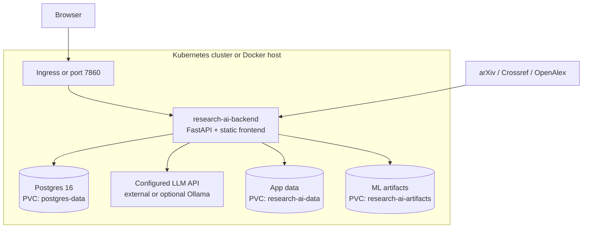

# Research AI Architecture

## Runtime topology

## Deployment responsibilities

| Component | Responsibility | Kubernetes resource |
| --- | --- | --- |
| Backend | API, frontend, agents, retrieval, persistence integration | Deployment + ClusterIP Service |
| Postgres | Users, sessions, conversations, papers, graphs | Deployment + PVC + Service |
| LLM provider | Chat completion for planning and synthesis; external by default | Provider API configured through Secret/ConfigMap; Ollama is optional |
| Artifacts | FAISS index, metadata, classifiers, clustering files | PVC or separately provisioned runtime files |
| Ingress | Optional external HTTP entrypoint | Ingress |

## Health model

- `/health` returns component and artifact status and is used for startup/liveness checks.
- `/ready` reports whether the database and at least one paper search provider are configured.
- A ready pod can still report degraded optional ML features when large artifacts are unavailable.