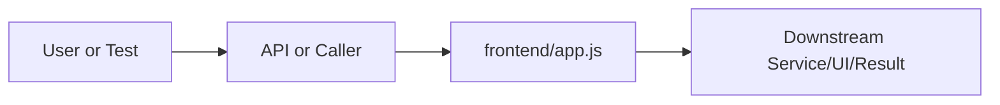

# app.js Explained

Generated educational companion for `frontend/app.js`. This file is intentionally detailed so a developer can understand the code, architecture role, production tradeoffs, and ML/backend concepts behind the implementation.

## File Overview

`frontend/app.js` is the browser-side controller for the static UI. It binds DOM events, calls FastAPI endpoints, renders results, and manages chat/search interaction state.

## Why This File Exists

This file isolates one responsibility in the codebase: Frontend layer: static UI, styling, and browser behavior. Separation matters because AI systems are easier to test, scale, debug, and explain when retrieval, orchestration, ML services, memory, UI, and deployment scripts have clear boundaries.

## Workflow Position

**Layer:** Frontend layer: static UI, styling, and browser behavior.

**Previous step:** caller code, an API request, a browser event, a test fixture, an import, or a startup script prepares inputs.

**Current step:** `frontend/app.js` performs its local responsibility.

**Next step:** downstream services, API responses, rendered UI, tests, or process execution consume the result.



## Inputs and Outputs

- **Inputs:** function arguments, class constructor dependencies, HTTP payloads, environment variables, filesystem artifacts, DOM events, or test fixtures.
- **Outputs:** return values, dictionaries, Pydantic models, rendered DOM state, API responses, logs, process startup, assertions, or side effects.
- **Serialization:** this project uses JSON for APIs/LLM planning, parquet/joblib/faiss for ML artifacts, and HTML/CSS/JS for the browser surface.

## Imports Explained

This file has no explicit imports. That usually means it is declarative, a package marker, or uses only runtime/browser/shell primitives.

## Global Variables and Config

| Variable/helper | Role |
|---|---|
| `state` | DOM reference, state variable, endpoint constant, renderer helper, or event workflow variable. |
| `$` | DOM reference, state variable, endpoint constant, renderer helper, or event workflow variable. |
| `welcome` | DOM reference, state variable, endpoint constant, renderer helper, or event workflow variable. |
| `chatArea` | DOM reference, state variable, endpoint constant, renderer helper, or event workflow variable. |
| `chatInput` | DOM reference, state variable, endpoint constant, renderer helper, or event workflow variable. |
| `sendBtn` | DOM reference, state variable, endpoint constant, renderer helper, or event workflow variable. |
| `historyList` | DOM reference, state variable, endpoint constant, renderer helper, or event workflow variable. |
| `topKSlider` | DOM reference, state variable, endpoint constant, renderer helper, or event workflow variable. |
| `topKVal` | DOM reference, state variable, endpoint constant, renderer helper, or event workflow variable. |
| `debugToggle` | DOM reference, state variable, endpoint constant, renderer helper, or event workflow variable. |
| `statusDot` | DOM reference, state variable, endpoint constant, renderer helper, or event workflow variable. |
| `statusText` | DOM reference, state variable, endpoint constant, renderer helper, or event workflow variable. |
| `pdfUpload` | DOM reference, state variable, endpoint constant, renderer helper, or event workflow variable. |
| `arxivInput` | DOM reference, state variable, endpoint constant, renderer helper, or event workflow variable. |
| `loadArxivBtn` | DOM reference, state variable, endpoint constant, renderer helper, or event workflow variable. |
| `loadedDocs` | DOM reference, state variable, endpoint constant, renderer helper, or event workflow variable. |
| `modelsSection` | DOM reference, state variable, endpoint constant, renderer helper, or event workflow variable. |
| `modelsList` | DOM reference, state variable, endpoint constant, renderer helper, or event workflow variable. |
| `themeToggle` | DOM reference, state variable, endpoint constant, renderer helper, or event workflow variable. |
| `themeIcon` | DOM reference, state variable, endpoint constant, renderer helper, or event workflow variable. |
| `modalOverlay` | DOM reference, state variable, endpoint constant, renderer helper, or event workflow variable. |
| `paperModal` | DOM reference, state variable, endpoint constant, renderer helper, or event workflow variable. |
| `modalTitle` | DOM reference, state variable, endpoint constant, renderer helper, or event workflow variable. |
| `modalBody` | DOM reference, state variable, endpoint constant, renderer helper, or event workflow variable. |
| `modalClose` | DOM reference, state variable, endpoint constant, renderer helper, or event workflow variable. |
| `composerAttach` | DOM reference, state variable, endpoint constant, renderer helper, or event workflow variable. |
| `composerFile` | DOM reference, state variable, endpoint constant, renderer helper, or event workflow variable. |
| `out` | DOM reference, state variable, endpoint constant, renderer helper, or event workflow variable. |
| `lines` | DOM reference, state variable, endpoint constant, renderer helper, or event workflow variable. |
| `html` | DOM reference, state variable, endpoint constant, renderer helper, or event workflow variable. |
| `raw` | DOM reference, state variable, endpoint constant, renderer helper, or event workflow variable. |
| `line` | DOM reference, state variable, endpoint constant, renderer helper, or event workflow variable. |
| `el` | DOM reference, state variable, endpoint constant, renderer helper, or event workflow variable. |
| `res` | DOM reference, state variable, endpoint constant, renderer helper, or event workflow variable. |
| `detail` | DOM reference, state variable, endpoint constant, renderer helper, or event workflow variable. |
| `err` | DOM reference, state variable, endpoint constant, renderer helper, or event workflow variable. |
| `wrap` | DOM reference, state variable, endpoint constant, renderer helper, or event workflow variable. |
| `wrap` | DOM reference, state variable, endpoint constant, renderer helper, or event workflow variable. |
| `bubble` | DOM reference, state variable, endpoint constant, renderer helper, or event workflow variable. |
| `meta` | DOM reference, state variable, endpoint constant, renderer helper, or event workflow variable. |
| `timeEl` | DOM reference, state variable, endpoint constant, renderer helper, or event workflow variable. |
| `confBadge` | DOM reference, state variable, endpoint constant, renderer helper, or event workflow variable. |
| `intentBadge` | DOM reference, state variable, endpoint constant, renderer helper, or event workflow variable. |
| `srcSection` | DOM reference, state variable, endpoint constant, renderer helper, or event workflow variable. |
| `srcToggle` | DOM reference, state variable, endpoint constant, renderer helper, or event workflow variable. |
| `srcList` | DOM reference, state variable, endpoint constant, renderer helper, or event workflow variable. |
| `open` | DOM reference, state variable, endpoint constant, renderer helper, or event workflow variable. |
| `card` | DOM reference, state variable, endpoint constant, renderer helper, or event workflow variable. |
| `pid` | DOM reference, state variable, endpoint constant, renderer helper, or event workflow variable. |
| `url` | DOM reference, state variable, endpoint constant, renderer helper, or event workflow variable. |
| `score` | DOM reference, state variable, endpoint constant, renderer helper, or event workflow variable. |
| `chatBtn` | DOM reference, state variable, endpoint constant, renderer helper, or event workflow variable. |
| `pct` | DOM reference, state variable, endpoint constant, renderer helper, or event workflow variable. |
| `confClass` | DOM reference, state variable, endpoint constant, renderer helper, or event workflow variable. |
| `label` | DOM reference, state variable, endpoint constant, renderer helper, or event workflow variable. |
| `shell` | DOM reference, state variable, endpoint constant, renderer helper, or event workflow variable. |
| `sessionId` | DOM reference, state variable, endpoint constant, renderer helper, or event workflow variable. |
| `accumulated` | DOM reference, state variable, endpoint constant, renderer helper, or event workflow variable. |
| `streamDone` | DOM reference, state variable, endpoint constant, renderer helper, or event workflow variable. |
| `timeout` | DOM reference, state variable, endpoint constant, renderer helper, or event workflow variable. |
| `res` | DOM reference, state variable, endpoint constant, renderer helper, or event workflow variable. |
| `err` | DOM reference, state variable, endpoint constant, renderer helper, or event workflow variable. |
| `reader` | DOM reference, state variable, endpoint constant, renderer helper, or event workflow variable. |
| `decoder` | DOM reference, state variable, endpoint constant, renderer helper, or event workflow variable. |
| `buf` | DOM reference, state variable, endpoint constant, renderer helper, or event workflow variable. |
| `pendingData` | DOM reference, state variable, endpoint constant, renderer helper, or event workflow variable. |
| `parts` | DOM reference, state variable, endpoint constant, renderer helper, or event workflow variable. |
| `part` | DOM reference, state variable, endpoint constant, renderer helper, or event workflow variable. |
| `line` | DOM reference, state variable, endpoint constant, renderer helper, or event workflow variable. |
| `obj` | DOM reference, state variable, endpoint constant, renderer helper, or event workflow variable. |
| `entry` | DOM reference, state variable, endpoint constant, renderer helper, or event workflow variable. |
| `item` | DOM reference, state variable, endpoint constant, renderer helper, or event workflow variable. |
| `btn` | DOM reference, state variable, endpoint constant, renderer helper, or event workflow variable. |
| `raw` | DOM reference, state variable, endpoint constant, renderer helper, or event workflow variable. |
| `fd` | DOM reference, state variable, endpoint constant, renderer helper, or event workflow variable. |
| `res` | DOM reference, state variable, endpoint constant, renderer helper, or event workflow variable. |
| `e` | DOM reference, state variable, endpoint constant, renderer helper, or event workflow variable. |
| `data` | DOM reference, state variable, endpoint constant, renderer helper, or event workflow variable. |
| `msg` | DOM reference, state variable, endpoint constant, renderer helper, or event workflow variable. |
| `data` | DOM reference, state variable, endpoint constant, renderer helper, or event workflow variable. |
| `s` | DOM reference, state variable, endpoint constant, renderer helper, or event workflow variable. |
| `row` | DOM reference, state variable, endpoint constant, renderer helper, or event workflow variable. |
| `label` | DOM reference, state variable, endpoint constant, renderer helper, or event workflow variable. |
| `f` | DOM reference, state variable, endpoint constant, renderer helper, or event workflow variable. |
| `f` | DOM reference, state variable, endpoint constant, renderer helper, or event workflow variable. |
| `data` | DOM reference, state variable, endpoint constant, renderer helper, or event workflow variable. |
| `data` | DOM reference, state variable, endpoint constant, renderer helper, or event workflow variable. |
| `c` | DOM reference, state variable, endpoint constant, renderer helper, or event workflow variable. |
| `ready` | DOM reference, state variable, endpoint constant, renderer helper, or event workflow variable. |
| `parts` | DOM reference, state variable, endpoint constant, renderer helper, or event workflow variable. |
| `sidebar` | DOM reference, state variable, endpoint constant, renderer helper, or event workflow variable. |
| `sidebarOv` | DOM reference, state variable, endpoint constant, renderer helper, or event workflow variable. |

## Step-by-Step Workflow

1. Load dependencies and runtime constants.
2. Accept input from the previous layer.
3. Validate, transform, route, score, render, or execute according to this file's role.
4. Return a structured output or perform a controlled side effect.
5. Let caller layers handle presentation, persistence, retries, or fallback.

## Function-by-Function Breakdown

| Function/helper | Line | Role |
|---|---:|---|
| `applyTheme` | 65 | Event handler, API helper, DOM renderer, parser, or UI state transition. |
| `esc` | 77 | Event handler, API helper, DOM renderer, parser, or UI state transition. |
| `mdToHtml` | 83 | Event handler, API helper, DOM renderer, parser, or UI state transition. |
| `nowStr` | 129 | Event handler, API helper, DOM renderer, parser, or UI state transition. |
| `toast` | 134 | Event handler, API helper, DOM renderer, parser, or UI state transition. |
| `callApi` | 144 | Event handler, API helper, DOM renderer, parser, or UI state transition. |
| `showChat` | 164 | Event handler, API helper, DOM renderer, parser, or UI state transition. |
| `showWelcome` | 168 | Event handler, API helper, DOM renderer, parser, or UI state transition. |
| `appendUserMessage` | 176 | Event handler, API helper, DOM renderer, parser, or UI state transition. |
| `createAssistantShell` | 191 | Event handler, API helper, DOM renderer, parser, or UI state transition. |
| `renderSources` | 241 | Event handler, API helper, DOM renderer, parser, or UI state transition. |
| `finalizeAssistantBubble` | 278 | Event handler, API helper, DOM renderer, parser, or UI state transition. |
| `sendMessage` | 315 | Event handler, API helper, DOM renderer, parser, or UI state transition. |
| `finishStreaming` | 349 | Event handler, API helper, DOM renderer, parser, or UI state transition. |
| `autoGrow` | 441 | Event handler, API helper, DOM renderer, parser, or UI state transition. |
| `startNewChat` | 480 | Event handler, API helper, DOM renderer, parser, or UI state transition. |
| `addToHistory` | 492 | Event handler, API helper, DOM renderer, parser, or UI state transition. |
| `renderHistory` | 504 | Event handler, API helper, DOM renderer, parser, or UI state transition. |
| `loadHistory` | 529 | Event handler, API helper, DOM renderer, parser, or UI state transition. |
| `uploadFile` | 538 | Event handler, API helper, DOM renderer, parser, or UI state transition. |
| `loadArxivPaper` | 559 | Event handler, API helper, DOM renderer, parser, or UI state transition. |
| `renderLoadedDocs` | 574 | Event handler, API helper, DOM renderer, parser, or UI state transition. |
| `loadModels` | 606 | Event handler, API helper, DOM renderer, parser, or UI state transition. |
| `checkHealth` | 621 | Event handler, API helper, DOM renderer, parser, or UI state transition. |
| `openSidebar` | 645 | Event handler, API helper, DOM renderer, parser, or UI state transition. |
| `closeSidebar` | 646 | Event handler, API helper, DOM renderer, parser, or UI state transition. |

## Class-by-Class Breakdown

No Python classes apply. The comparable contracts are DOM nodes, CSS classes, shell variables, or configuration sections.

## Important Algorithms Used

- **Hybrid Retrieval**: Hybrid retrieval combines semantic vectors with lexical/keyword evidence, improving scientific search where exact terms matter.
- **RAG**: Retrieval-Augmented Generation retrieves evidence first and asks an LLM to answer from that evidence, reducing hallucination.
- **LLM Inference**: LLM inference sends prompts or chat messages to a model provider and receives generated text under token, latency, and cost constraints.
- **Transformers**: Transformers use tokenization and attention layers for language understanding/generation. They are powerful but memory and latency sensitive.
- **Classification**: Classification maps text or features to discrete labels, supporting category prediction and routing.
- **Calibration**: Calibration makes predicted probabilities better match real correctness rates, which matters for user-facing confidence.
- **Streaming**: Streaming improves perceived latency by sending incremental output instead of waiting for full completion.
- **Sandboxing**: Sandboxing validates and constrains user code before execution, reducing security and stability risk.
- **Event-driven UI orchestration**: browser events trigger HTTP requests, DOM updates, loading states, and error rendering.

## Libraries Used

This file has no explicit imports. That usually means it is declarative, a package marker, or uses only runtime/browser/shell primitives.

## ML Concepts Used

- **Hybrid Retrieval**: Hybrid retrieval combines semantic vectors with lexical/keyword evidence, improving scientific search where exact terms matter.
- **RAG**: Retrieval-Augmented Generation retrieves evidence first and asks an LLM to answer from that evidence, reducing hallucination.
- **LLM Inference**: LLM inference sends prompts or chat messages to a model provider and receives generated text under token, latency, and cost constraints.
- **Transformers**: Transformers use tokenization and attention layers for language understanding/generation. They are powerful but memory and latency sensitive.
- **Classification**: Classification maps text or features to discrete labels, supporting category prediction and routing.
- **Calibration**: Calibration makes predicted probabilities better match real correctness rates, which matters for user-facing confidence.
- **Streaming**: Streaming improves perceived latency by sending incremental output instead of waiting for full completion.
- **Sandboxing**: Sandboxing validates and constrains user code before execution, reducing security and stability risk.

## Performance and Memory Notes

- Avoid eager loading of heavy ML models unless startup latency is acceptable.
- Cache expensive clients, tokenizers, vector stores, and embeddings carefully.
- Use float32 for embedding vectors because it halves memory compared with float64 and matches FAISS/neural inference expectations.
- Bound prompt length, uploaded content, result counts, and token budgets to control latency and memory.
- Watch copies of large metadata frames, embedding matrices, and file buffers.

## Scalability Notes

- In-memory state works for local demos but needs Redis/database/object storage for multi-worker cloud deployment.
- CPU/GPU inference should often be separated from the web API when traffic grows.
- Retrieval can start exact and move to approximate indexes as corpus size grows.
- Batch operations and cache repeated work to improve throughput.
- Add metrics for latency, errors, fallback frequency, retrieval hit rate, and token usage.

## Production Engineering Notes

- Keep interfaces stable because other files may import this module or depend on its response shape.
- Prefer typed/structured data over free-form strings at service boundaries.
- Log operational context without secrets or huge payloads.
- Make fallback behavior explicit so users get useful output even when LLMs or artifacts fail.
- Keep provider-specific logic behind adapters so Groq/OpenRouter/Google/Ollama can be swapped.

## Common Bugs and Failure Cases

- Missing `.env` values, model artifacts, or Ollama models can trigger degraded behavior.
- Type mismatches occur when LLM-generated tool arguments cross into strict Python code.
- Empty retrieval results must not become hallucinated answers.
- Network calls need timeouts and careful retry behavior.
- Frontend IDs/classes and API schemas are contracts; changing one side without the other breaks workflows.

## Security Considerations

- Handles credentials or environment configuration. Keep secrets in environment variables and redact them from logs.
- Touches files or paths. Validate filenames, restrict upload size/type, and prevent traversal.
- Deals with execution or subprocesses. Maintain AST validation, isolated mode, timeouts, and least privilege.
- Performs network I/O. Use timeouts, validate responses, and keep private services such as Ollama off the public internet.
- Browser-facing code must avoid injecting unsanitized model output. Prefer textContent or deliberate sanitization.

## Real Industry Usage

- This pattern appears in enterprise RAG assistants, scientific search tools, internal research copilots, and ML platform demos.
- The layered design mirrors production systems: API facade, orchestration, retrieval, evaluation, synthesis, UI, and deployment.
- Clear separation lets teams replace model providers, improve retrieval, harden security, or redesign UI independently.

## Optimization Opportunities

- Add tracing around each workflow step.
- Strengthen schema validation at boundaries.
- Persist conversation/session state outside process memory.
- Add load tests and adversarial tests for prompt injection, empty evidence, and large uploads.
- Consider approximate vector indexes, reranker models, or batching when corpus/traffic grows.

## How This Connects To Other Files

- `frontend/app.js` is connected through imports, startup scripts, API routes, frontend selectors, tests, or artifact paths.
- `src/research_ai/platform.py` is the backend composition root.
- `src/research_ai/api/main.py` exposes backend behavior over HTTP.
- Retrieval modules depend on artifacts under `artifacts/`.
- Frontend files depend on stable endpoint and DOM contracts.

## End-to-End Flow Summary

- A user/browser/test/startup event enters the system.
- The relevant layer validates or normalizes input.
- Retrieval, ML, orchestration, execution, or UI rendering happens.
- A structured result, visual state, or process side effect is produced.
- Fallbacks and tests keep behavior understandable when dependencies are unavailable.

## Interview Questions

1. What responsibility does this file own?
2. What inputs and outputs define its contract?
3. Which dependencies are expensive or operationally risky?
4. What breaks if this file changes shape?
5. How would you scale or test this behavior in production?

## Key Takeaways

- `frontend/app.js` should be understood as part of a layered AI research platform.
- Trace data flow from inputs to transformations to outputs.
- Production readiness comes from explicit contracts, bounded resources, observability, secure defaults, and graceful fallback.

## Fully Commented Source

This section repeats the original source with an explanatory comment before every line. The comments are educational only; they are not inserted into the production source file.

```javascript
// L0001: Runs browser-side logic that updates state, communicates with the backend, or renders the interface.
'use strict';
// L0002: Frontend comment explaining UI behavior, sectioning, or implementation reasoning.
/**
// L0003: Frontend comment explaining UI behavior, sectioning, or implementation reasoning.
 * Research AI — Unified Chat Frontend
// L0004: Frontend comment explaining UI behavior, sectioning, or implementation reasoning.
 *
// L0005: Frontend comment explaining UI behavior, sectioning, or implementation reasoning.
 * ARCHITECTURE
// L0006: Frontend comment explaining UI behavior, sectioning, or implementation reasoning.
 * ────────────
// L0007: Frontend comment explaining UI behavior, sectioning, or implementation reasoning.
 * The user types a message and hits Enter. That's it. The AI orchestrator
// L0008: Frontend comment explaining UI behavior, sectioning, or implementation reasoning.
 * on the backend automatically decides:
// L0009: Frontend comment explaining UI behavior, sectioning, or implementation reasoning.
 *   - Whether to retrieve, classify, summarize, or chain tools
// L0010: Frontend comment explaining UI behavior, sectioning, or implementation reasoning.
 *   - Which local/cloud model to use
// L0011: Frontend comment explaining UI behavior, sectioning, or implementation reasoning.
 *   - How to synthesize and cite evidence
// L0012: Frontend comment explaining UI behavior, sectioning, or implementation reasoning.
 *
// L0013: Frontend comment explaining UI behavior, sectioning, or implementation reasoning.
 * The frontend responsibility is purely UX:
// L0014: Frontend comment explaining UI behavior, sectioning, or implementation reasoning.
 *   1. Send query to /chat/stream (Server-Sent Events)
// L0015: Frontend comment explaining UI behavior, sectioning, or implementation reasoning.
 *   2. Render streaming answer token-by-token
// L0016: Frontend comment explaining UI behavior, sectioning, or implementation reasoning.
 *   3. Render source cards when the 'sources' event arrives
// L0017: Frontend comment explaining UI behavior, sectioning, or implementation reasoning.
 *   4. Show confidence badge
// L0018: Frontend comment explaining UI behavior, sectioning, or implementation reasoning.
 *   5. Maintain conversation history in UI
// L0019: Frontend comment explaining UI behavior, sectioning, or implementation reasoning.
 *   6. Handle document uploads → paper chat sessions
// L0020: Frontend comment explaining UI behavior, sectioning, or implementation reasoning.
 *
// L0021: Frontend comment explaining UI behavior, sectioning, or implementation reasoning.
 * No mode selector. No manual tool picking. Just chat.
// L0022: Frontend comment explaining UI behavior, sectioning, or implementation reasoning.
 */
// L0023: Blank line that visually separates logical sections and improves readability.

// L0024: Frontend comment explaining UI behavior, sectioning, or implementation reasoning.
// ── State ──────────────────────────────────────────────────────────────────
// L0025: Declares frontend state, a DOM reference, helper, endpoint payload, or local computation result.
const state = {
// L0026: Runs browser-side logic that updates state, communicates with the backend, or renders the interface.
  conversationId: null,       // UUID from server — enables multi-turn memory
// L0027: Runs browser-side logic that updates state, communicates with the backend, or renders the interface.
  loadedSessions: [],         // [{session_id, source, arxiv_id, chunk_count}]
// L0028: Runs browser-side logic that updates state, communicates with the backend, or renders the interface.
  topK: 5,
// L0029: Runs browser-side logic that updates state, communicates with the backend, or renders the interface.
  debug: false,
// L0030: Runs browser-side logic that updates state, communicates with the backend, or renders the interface.
  streaming: false,
// L0031: Runs browser-side logic that updates state, communicates with the backend, or renders the interface.
  theme: localStorage.getItem('theme') || 'dark',
// L0032: Runs browser-side logic that updates state, communicates with the backend, or renders the interface.
  history: [],                // [{id, title, conversationId}]
// L0033: Runs browser-side logic that updates state, communicates with the backend, or renders the interface.
};
// L0034: Blank line that visually separates logical sections and improves readability.

// L0035: Frontend comment explaining UI behavior, sectioning, or implementation reasoning.
// ── DOM refs ───────────────────────────────────────────────────────────────
// L0036: Declares frontend state, a DOM reference, helper, endpoint payload, or local computation result.
const $ = id => document.getElementById(id);
// L0037: Blank line that visually separates logical sections and improves readability.

// L0038: Declares frontend state, a DOM reference, helper, endpoint payload, or local computation result.
const welcome        = $('welcome');
// L0039: Declares frontend state, a DOM reference, helper, endpoint payload, or local computation result.
const chatArea       = $('chatArea');
// L0040: Declares frontend state, a DOM reference, helper, endpoint payload, or local computation result.
const chatInput      = $('chatInput');
// L0041: Declares frontend state, a DOM reference, helper, endpoint payload, or local computation result.
const sendBtn        = $('sendBtn');
// L0042: Declares frontend state, a DOM reference, helper, endpoint payload, or local computation result.
const historyList    = $('historyList');
// L0043: Declares frontend state, a DOM reference, helper, endpoint payload, or local computation result.
const topKSlider     = $('topKSlider');
// L0044: Declares frontend state, a DOM reference, helper, endpoint payload, or local computation result.
const topKVal        = $('topKVal');
// L0045: Declares frontend state, a DOM reference, helper, endpoint payload, or local computation result.
const debugToggle    = $('debugToggle');
// L0046: Declares frontend state, a DOM reference, helper, endpoint payload, or local computation result.
const statusDot      = $('statusDot');
// L0047: Declares frontend state, a DOM reference, helper, endpoint payload, or local computation result.
const statusText     = $('statusText');
// L0048: Declares frontend state, a DOM reference, helper, endpoint payload, or local computation result.
const pdfUpload      = $('pdfUpload');
// L0049: Declares frontend state, a DOM reference, helper, endpoint payload, or local computation result.
const arxivInput     = $('arxivInput');
// L0050: Declares frontend state, a DOM reference, helper, endpoint payload, or local computation result.
const loadArxivBtn   = $('loadArxivBtn');
// L0051: Declares frontend state, a DOM reference, helper, endpoint payload, or local computation result.
const loadedDocs     = $('loadedDocs');
// L0052: Declares frontend state, a DOM reference, helper, endpoint payload, or local computation result.
const modelsSection  = $('modelsSection');
// L0053: Declares frontend state, a DOM reference, helper, endpoint payload, or local computation result.
const modelsList     = $('modelsList');
// L0054: Declares frontend state, a DOM reference, helper, endpoint payload, or local computation result.
const themeToggle    = $('themeToggle');
// L0055: Declares frontend state, a DOM reference, helper, endpoint payload, or local computation result.
const themeIcon      = $('themeIcon');
// L0056: Declares frontend state, a DOM reference, helper, endpoint payload, or local computation result.
const modalOverlay   = $('modalOverlay');
// L0057: Declares frontend state, a DOM reference, helper, endpoint payload, or local computation result.
const paperModal     = $('paperModal');
// L0058: Declares frontend state, a DOM reference, helper, endpoint payload, or local computation result.
const modalTitle     = $('modalTitle');
// L0059: Declares frontend state, a DOM reference, helper, endpoint payload, or local computation result.
const modalBody      = $('modalBody');
// L0060: Declares frontend state, a DOM reference, helper, endpoint payload, or local computation result.
const modalClose     = $('modalClose');
// L0061: Declares frontend state, a DOM reference, helper, endpoint payload, or local computation result.
const composerAttach = $('composerAttach');
// L0062: Declares frontend state, a DOM reference, helper, endpoint payload, or local computation result.
const composerFile   = $('composerFile');
// L0063: Blank line that visually separates logical sections and improves readability.

// L0064: Frontend comment explaining UI behavior, sectioning, or implementation reasoning.
// ── Theme ──────────────────────────────────────────────────────────────────
// L0065: Defines a JavaScript function/callback used for UI events, API calls, or DOM rendering.
function applyTheme(t) {
// L0066: Runs browser-side logic that updates state, communicates with the backend, or renders the interface.
  state.theme = t;
// L0067: Runs browser-side logic that updates state, communicates with the backend, or renders the interface.
  document.documentElement.dataset.theme = t;
// L0068: Safely writes plain text into the DOM without interpreting it as HTML.
  themeIcon.textContent = t === 'dark' ? '☀' : '☾';
// L0069: Runs browser-side logic that updates state, communicates with the backend, or renders the interface.
  localStorage.setItem('theme', t);
// L0070: Runs browser-side logic that updates state, communicates with the backend, or renders the interface.
}
// L0071: Runs browser-side logic that updates state, communicates with the backend, or renders the interface.
applyTheme(state.theme);
// L0072: Defines a JavaScript function/callback used for UI events, API calls, or DOM rendering.
themeToggle.addEventListener('click', () =>
// L0073: Runs browser-side logic that updates state, communicates with the backend, or renders the interface.
  applyTheme(state.theme === 'dark' ? 'light' : 'dark')
// L0074: Runs browser-side logic that updates state, communicates with the backend, or renders the interface.
);
// L0075: Blank line that visually separates logical sections and improves readability.

// L0076: Frontend comment explaining UI behavior, sectioning, or implementation reasoning.
// ── Escape / markdown helpers ──────────────────────────────────────────────
// L0077: Defines a JavaScript function/callback used for UI events, API calls, or DOM rendering.
function esc(s) {
// L0078: Returns a value from a helper or exits early from a UI workflow.
  return String(s == null ? '' : s)
// L0079: Runs browser-side logic that updates state, communicates with the backend, or renders the interface.
    .replace(/&/g, '&amp;').replace(/</g, '&lt;')
// L0080: Runs browser-side logic that updates state, communicates with the backend, or renders the interface.
    .replace(/>/g, '&gt;').replace(/"/g, '&quot;').replace(/'/g, '&#39;');
// L0081: Runs browser-side logic that updates state, communicates with the backend, or renders the interface.
}
// L0082: Blank line that visually separates logical sections and improves readability.

// L0083: Defines a JavaScript function/callback used for UI events, API calls, or DOM rendering.
function mdToHtml(text) {
// L0084: Declares frontend state, a DOM reference, helper, endpoint payload, or local computation result.
  let out = esc(text || '');
// L0085: Frontend comment explaining UI behavior, sectioning, or implementation reasoning.
  // Fenced code blocks
// L0086: Runs browser-side logic that updates state, communicates with the backend, or renders the interface.
  out = out.replace(/```[\w]*\n?([\s\S]*?)```/g, '<pre><code>$1</code></pre>');
// L0087: Frontend comment explaining UI behavior, sectioning, or implementation reasoning.
  // Inline code
// L0088: Runs browser-side logic that updates state, communicates with the backend, or renders the interface.
  out = out.replace(/`([^`\n]+)`/g, '<code>$1</code>');
// L0089: Frontend comment explaining UI behavior, sectioning, or implementation reasoning.
  // Markdown links
// L0090: Runs browser-side logic that updates state, communicates with the backend, or renders the interface.
  out = out.replace(/\[([^\]]+)\]\((https?:\/\/[^)]+)\)/g,
// L0091: Runs browser-side logic that updates state, communicates with the backend, or renders the interface.
    '<a href="$2" target="_blank" rel="noopener noreferrer">$1</a>');
// L0092: Frontend comment explaining UI behavior, sectioning, or implementation reasoning.
  // Bare URLs
// L0093: Runs browser-side logic that updates state, communicates with the backend, or renders the interface.
  out = out.replace(/(^|[\s>])(https?:\/\/[^\s<"&]+)/g,
// L0094: Runs browser-side logic that updates state, communicates with the backend, or renders the interface.
    '$1<a href="$2" target="_blank" rel="noopener noreferrer">$2</a>');
// L0095: Frontend comment explaining UI behavior, sectioning, or implementation reasoning.
  // Bold / italic
// L0096: Runs browser-side logic that updates state, communicates with the backend, or renders the interface.
  out = out.replace(/\*\*\*(.+?)\*\*\*/g, '<strong><em>$1</em></strong>');
// L0097: Runs browser-side logic that updates state, communicates with the backend, or renders the interface.
  out = out.replace(/\*\*(.+?)\*\*/g, '<strong>$1</strong>');
// L0098: Runs browser-side logic that updates state, communicates with the backend, or renders the interface.
  out = out.replace(/\*([^*\n]+)\*/g, '<em>$1</em>');
// L0099: Frontend comment explaining UI behavior, sectioning, or implementation reasoning.
  // Headers
// L0100: Runs browser-side logic that updates state, communicates with the backend, or renders the interface.
  out = out.replace(/^### (.+)$/gm, '<h3>$1</h3>');
// L0101: Runs browser-side logic that updates state, communicates with the backend, or renders the interface.
  out = out.replace(/^## (.+)$/gm, '<h3>$1</h3>');
// L0102: Runs browser-side logic that updates state, communicates with the backend, or renders the interface.
  out = out.replace(/^# (.+)$/gm, '<h3>$1</h3>');
// L0103: Frontend comment explaining UI behavior, sectioning, or implementation reasoning.
  // Lists
// L0104: Declares frontend state, a DOM reference, helper, endpoint payload, or local computation result.
  const lines = out.split('\n');
// L0105: Declares frontend state, a DOM reference, helper, endpoint payload, or local computation result.
  let html = '', inUl = false, inOl = false;
// L0106: Runs browser-side logic that updates state, communicates with the backend, or renders the interface.
  for (const raw of lines) {
// L0107: Declares frontend state, a DOM reference, helper, endpoint payload, or local computation result.
    const line = raw.trim();
// L0108: Branches UI or API behavior based on state, validation, or response data.
    if (/^[-*•]\s+/.test(line)) {
// L0109: Branches UI or API behavior based on state, validation, or response data.
      if (inOl) { html += '</ol>'; inOl = false; }
// L0110: Branches UI or API behavior based on state, validation, or response data.
      if (!inUl) { html += '<ul>'; inUl = true; }
// L0111: Runs browser-side logic that updates state, communicates with the backend, or renders the interface.
      html += `<li>${line.replace(/^[-*•]\s+/, '')}</li>`;
// L0112: Runs browser-side logic that updates state, communicates with the backend, or renders the interface.
    } else if (/^\d+\.\s+/.test(line)) {
// L0113: Branches UI or API behavior based on state, validation, or response data.
      if (inUl) { html += '</ul>'; inUl = false; }
// L0114: Branches UI or API behavior based on state, validation, or response data.
      if (!inOl) { html += '<ol>'; inOl = true; }
// L0115: Runs browser-side logic that updates state, communicates with the backend, or renders the interface.
      html += `<li>${line.replace(/^\d+\.\s+/, '')}</li>`;
// L0116: Runs browser-side logic that updates state, communicates with the backend, or renders the interface.
    } else {
// L0117: Branches UI or API behavior based on state, validation, or response data.
      if (inUl) { html += '</ul>'; inUl = false; }
// L0118: Branches UI or API behavior based on state, validation, or response data.
      if (inOl) { html += '</ol>'; inOl = false; }
// L0119: Branches UI or API behavior based on state, validation, or response data.
      if (line === '') html += '<br/>';
// L0120: Runs browser-side logic that updates state, communicates with the backend, or renders the interface.
      else if (/^<(h[1-6]|ul|ol|pre|div|blockquote)/i.test(line)) html += line;
// L0121: Runs browser-side logic that updates state, communicates with the backend, or renders the interface.
      else html += `<p>${line}</p>`;
// L0122: Runs browser-side logic that updates state, communicates with the backend, or renders the interface.
    }
// L0123: Runs browser-side logic that updates state, communicates with the backend, or renders the interface.
  }
// L0124: Branches UI or API behavior based on state, validation, or response data.
  if (inUl) html += '</ul>';
// L0125: Branches UI or API behavior based on state, validation, or response data.
  if (inOl) html += '</ol>';
// L0126: Returns a value from a helper or exits early from a UI workflow.
  return html;
// L0127: Runs browser-side logic that updates state, communicates with the backend, or renders the interface.
}
// L0128: Blank line that visually separates logical sections and improves readability.

// L0129: Defines a JavaScript function/callback used for UI events, API calls, or DOM rendering.
function nowStr() {
// L0130: Returns a value from a helper or exits early from a UI workflow.
  return new Date().toLocaleTimeString([], { hour: '2-digit', minute: '2-digit' });
// L0131: Runs browser-side logic that updates state, communicates with the backend, or renders the interface.
}
// L0132: Blank line that visually separates logical sections and improves readability.

// L0133: Frontend comment explaining UI behavior, sectioning, or implementation reasoning.
// ── Toast ──────────────────────────────────────────────────────────────────
// L0134: Defines a JavaScript function/callback used for UI events, API calls, or DOM rendering.
function toast(msg, type = 'info', dur = 4000) {
// L0135: Declares frontend state, a DOM reference, helper, endpoint payload, or local computation result.
  const el = document.createElement('div');
// L0136: Runs browser-side logic that updates state, communicates with the backend, or renders the interface.
  el.className = `toast toast-${type}`;
// L0137: Safely writes plain text into the DOM without interpreting it as HTML.
  el.textContent = msg;
// L0138: Runs browser-side logic that updates state, communicates with the backend, or renders the interface.
  document.body.appendChild(el);
// L0139: Defines a JavaScript function/callback used for UI events, API calls, or DOM rendering.
  setTimeout(() => el.classList.add('toast-visible'), 10);
// L0140: Defines a JavaScript function/callback used for UI events, API calls, or DOM rendering.
  setTimeout(() => { el.classList.remove('toast-visible'); setTimeout(() => el.remove(), 300); }, dur);
// L0141: Runs browser-side logic that updates state, communicates with the backend, or renders the interface.
}
// L0142: Blank line that visually separates logical sections and improves readability.

// L0143: Frontend comment explaining UI behavior, sectioning, or implementation reasoning.
// ── API helpers ─────────────────────────────────────────────────────────────
// L0144: Runs browser-side logic that updates state, communicates with the backend, or renders the interface.
async function callApi(endpoint, body, method = 'POST') {
// L0145: Declares frontend state, a DOM reference, helper, endpoint payload, or local computation result.
  const res = await fetch(endpoint, {
// L0146: Runs browser-side logic that updates state, communicates with the backend, or renders the interface.
    method,
// L0147: Runs browser-side logic that updates state, communicates with the backend, or renders the interface.
    headers: { 'Content-Type': 'application/json' },
// L0148: Runs browser-side logic that updates state, communicates with the backend, or renders the interface.
    body: JSON.stringify(body),
// L0149: Runs browser-side logic that updates state, communicates with the backend, or renders the interface.
  });
// L0150: Branches UI or API behavior based on state, validation, or response data.
  if (!res.ok) {
// L0151: Declares frontend state, a DOM reference, helper, endpoint payload, or local computation result.
    let detail = `HTTP ${res.status}`;
// L0152: Runs browser-side logic that updates state, communicates with the backend, or renders the interface.
    try {
// L0153: Declares frontend state, a DOM reference, helper, endpoint payload, or local computation result.
      const err = await res.json();
// L0154: Runs browser-side logic that updates state, communicates with the backend, or renders the interface.
      detail = Array.isArray(err.detail)
// L0155: Defines a JavaScript function/callback used for UI events, API calls, or DOM rendering.
        ? err.detail.map(i => i.msg || JSON.stringify(i)).join('; ')
// L0156: Runs browser-side logic that updates state, communicates with the backend, or renders the interface.
        : String(err.detail || detail);
// L0157: Runs browser-side logic that updates state, communicates with the backend, or renders the interface.
    } catch (_) {}
// L0158: Runs browser-side logic that updates state, communicates with the backend, or renders the interface.
    throw new Error(detail);
// L0159: Runs browser-side logic that updates state, communicates with the backend, or renders the interface.
  }
// L0160: Returns a value from a helper or exits early from a UI workflow.
  return res.json();
// L0161: Runs browser-side logic that updates state, communicates with the backend, or renders the interface.
}
// L0162: Blank line that visually separates logical sections and improves readability.

// L0163: Frontend comment explaining UI behavior, sectioning, or implementation reasoning.
// ── Welcome / Chat visibility ──────────────────────────────────────────────
// L0164: Defines a JavaScript function/callback used for UI events, API calls, or DOM rendering.
function showChat() {
// L0165: Runs browser-side logic that updates state, communicates with the backend, or renders the interface.
  welcome.style.display = 'none';
// L0166: Runs browser-side logic that updates state, communicates with the backend, or renders the interface.
  chatArea.style.display = 'flex';
// L0167: Runs browser-side logic that updates state, communicates with the backend, or renders the interface.
}
// L0168: Defines a JavaScript function/callback used for UI events, API calls, or DOM rendering.
function showWelcome() {
// L0169: Runs browser-side logic that updates state, communicates with the backend, or renders the interface.
  welcome.style.display = '';
// L0170: Runs browser-side logic that updates state, communicates with the backend, or renders the interface.
  chatArea.style.display = 'none';
// L0171: Runs browser-side logic that updates state, communicates with the backend, or renders the interface.
}
// L0172: Blank line that visually separates logical sections and improves readability.

// L0173: Frontend comment explaining UI behavior, sectioning, or implementation reasoning.
// ── Message construction ───────────────────────────────────────────────────
// L0174: Blank line that visually separates logical sections and improves readability.

// L0175: Frontend comment explaining UI behavior, sectioning, or implementation reasoning.
/** Build a user message bubble */
// L0176: Defines a JavaScript function/callback used for UI events, API calls, or DOM rendering.
function appendUserMessage(text) {
// L0177: Declares frontend state, a DOM reference, helper, endpoint payload, or local computation result.
  const wrap = document.createElement('div');
// L0178: Runs browser-side logic that updates state, communicates with the backend, or renders the interface.
  wrap.className = 'msg user';
// L0179: Updates HTML content in the DOM; model/user data should be sanitized before insertion.
  wrap.innerHTML = `
// L0180: Runs browser-side logic that updates state, communicates with the backend, or renders the interface.
    <div class="msg-avatar user-avatar">You</div>
// L0181: Runs browser-side logic that updates state, communicates with the backend, or renders the interface.
    <div class="msg-content">
// L0182: Runs browser-side logic that updates state, communicates with the backend, or renders the interface.
      <div class="msg-bubble user-bubble">${mdToHtml(text)}</div>
// L0183: Runs browser-side logic that updates state, communicates with the backend, or renders the interface.
      <div class="msg-time">${nowStr()}</div>
// L0184: Runs browser-side logic that updates state, communicates with the backend, or renders the interface.
    </div>`;
// L0185: Runs browser-side logic that updates state, communicates with the backend, or renders the interface.
  chatArea.appendChild(wrap);
// L0186: Runs browser-side logic that updates state, communicates with the backend, or renders the interface.
  chatArea.scrollTop = chatArea.scrollHeight;
// L0187: Returns a value from a helper or exits early from a UI workflow.
  return wrap;
// L0188: Runs browser-side logic that updates state, communicates with the backend, or renders the interface.
}
// L0189: Blank line that visually separates logical sections and improves readability.

// L0190: Frontend comment explaining UI behavior, sectioning, or implementation reasoning.
/** Build an AI message bubble shell (answer filled in later via streaming) */
// L0191: Defines a JavaScript function/callback used for UI events, API calls, or DOM rendering.
function createAssistantShell() {
// L0192: Declares frontend state, a DOM reference, helper, endpoint payload, or local computation result.
  const wrap = document.createElement('div');
// L0193: Runs browser-side logic that updates state, communicates with the backend, or renders the interface.
  wrap.className = 'msg assistant';
// L0194: Updates HTML content in the DOM; model/user data should be sanitized before insertion.
  wrap.innerHTML = `
// L0195: Runs browser-side logic that updates state, communicates with the backend, or renders the interface.
    <div class="msg-avatar ai-avatar">AI</div>
// L0196: Runs browser-side logic that updates state, communicates with the backend, or renders the interface.
    <div class="msg-content">
// L0197: Runs browser-side logic that updates state, communicates with the backend, or renders the interface.
      <div class="msg-bubble ai-bubble" id="streamTarget">
// L0198: Runs browser-side logic that updates state, communicates with the backend, or renders the interface.
        <div class="typing-indicator">
// L0199: Runs browser-side logic that updates state, communicates with the backend, or renders the interface.
          <span></span><span></span><span></span>
// L0200: Runs browser-side logic that updates state, communicates with the backend, or renders the interface.
        </div>
// L0201: Runs browser-side logic that updates state, communicates with the backend, or renders the interface.
      </div>
// L0202: Runs browser-side logic that updates state, communicates with the backend, or renders the interface.
      <div class="msg-meta" style="display:none">
// L0203: Runs browser-side logic that updates state, communicates with the backend, or renders the interface.
        <span class="msg-time"></span>
// L0204: Runs browser-side logic that updates state, communicates with the backend, or renders the interface.
        <span class="confidence-badge" title="Evidence confidence"></span>
// L0205: Runs browser-side logic that updates state, communicates with the backend, or renders the interface.
        <span class="intent-badge"></span>
// L0206: Runs browser-side logic that updates state, communicates with the backend, or renders the interface.
      </div>
// L0207: Runs browser-side logic that updates state, communicates with the backend, or renders the interface.
      <div class="sources-section" style="display:none">
// L0208: Runs browser-side logic that updates state, communicates with the backend, or renders the interface.
        <button class="sources-toggle">
// L0209: Runs browser-side logic that updates state, communicates with the backend, or renders the interface.
          <svg width="11" height="11" viewBox="0 0 11 11" fill="none">
// L0210: Runs browser-side logic that updates state, communicates with the backend, or renders the interface.
            <path d="M2 4l3.5 3.5L9 4" stroke="currentColor" stroke-width="1.3" stroke-linecap="round"/>
// L0211: Runs browser-side logic that updates state, communicates with the backend, or renders the interface.
          </svg>
// L0212: Runs browser-side logic that updates state, communicates with the backend, or renders the interface.
          Sources
// L0213: Runs browser-side logic that updates state, communicates with the backend, or renders the interface.
        </button>
// L0214: Runs browser-side logic that updates state, communicates with the backend, or renders the interface.
        <div class="sources-list"></div>
// L0215: Runs browser-side logic that updates state, communicates with the backend, or renders the interface.
      </div>
// L0216: Runs browser-side logic that updates state, communicates with the backend, or renders the interface.
    </div>`;
// L0217: Runs browser-side logic that updates state, communicates with the backend, or renders the interface.
  chatArea.appendChild(wrap);
// L0218: Runs browser-side logic that updates state, communicates with the backend, or renders the interface.
  chatArea.scrollTop = chatArea.scrollHeight;
// L0219: Blank line that visually separates logical sections and improves readability.

// L0220: Declares frontend state, a DOM reference, helper, endpoint payload, or local computation result.
  const bubble    = wrap.querySelector('#streamTarget');
// L0221: Runs browser-side logic that updates state, communicates with the backend, or renders the interface.
  bubble.removeAttribute('id');
// L0222: Declares frontend state, a DOM reference, helper, endpoint payload, or local computation result.
  const meta      = wrap.querySelector('.msg-meta');
// L0223: Declares frontend state, a DOM reference, helper, endpoint payload, or local computation result.
  const timeEl    = wrap.querySelector('.msg-time');
// L0224: Declares frontend state, a DOM reference, helper, endpoint payload, or local computation result.
  const confBadge = wrap.querySelector('.confidence-badge');
// L0225: Declares frontend state, a DOM reference, helper, endpoint payload, or local computation result.
  const intentBadge = wrap.querySelector('.intent-badge');
// L0226: Declares frontend state, a DOM reference, helper, endpoint payload, or local computation result.
  const srcSection = wrap.querySelector('.sources-section');
// L0227: Declares frontend state, a DOM reference, helper, endpoint payload, or local computation result.
  const srcToggle  = wrap.querySelector('.sources-toggle');
// L0228: Declares frontend state, a DOM reference, helper, endpoint payload, or local computation result.
  const srcList    = wrap.querySelector('.sources-list');
// L0229: Blank line that visually separates logical sections and improves readability.

// L0230: Frontend comment explaining UI behavior, sectioning, or implementation reasoning.
  // Toggle sources accordion
// L0231: Defines a JavaScript function/callback used for UI events, API calls, or DOM rendering.
  srcToggle.addEventListener('click', () => {
// L0232: Declares frontend state, a DOM reference, helper, endpoint payload, or local computation result.
    const open = srcList.style.display !== 'none';
// L0233: Runs browser-side logic that updates state, communicates with the backend, or renders the interface.
    srcList.style.display = open ? 'none' : '';
// L0234: Runs browser-side logic that updates state, communicates with the backend, or renders the interface.
    srcToggle.classList.toggle('open', !open);
// L0235: Runs browser-side logic that updates state, communicates with the backend, or renders the interface.
  });
// L0236: Blank line that visually separates logical sections and improves readability.

// L0237: Returns a value from a helper or exits early from a UI workflow.
  return { wrap, bubble, meta, timeEl, confBadge, intentBadge, srcSection, srcList };
// L0238: Runs browser-side logic that updates state, communicates with the backend, or renders the interface.
}
// L0239: Blank line that visually separates logical sections and improves readability.

// L0240: Frontend comment explaining UI behavior, sectioning, or implementation reasoning.
/** Render source cards into the sources list element */
// L0241: Defines a JavaScript function/callback used for UI events, API calls, or DOM rendering.
function renderSources(srcList, sources) {
// L0242: Updates HTML content in the DOM; model/user data should be sanitized before insertion.
  srcList.innerHTML = '';
// L0243: Branches UI or API behavior based on state, validation, or response data.
  if (!sources || !sources.length) return;
// L0244: Defines a JavaScript function/callback used for UI events, API calls, or DOM rendering.
  sources.forEach((src, i) => {
// L0245: Declares frontend state, a DOM reference, helper, endpoint payload, or local computation result.
    const card = document.createElement('div');
// L0246: Runs browser-side logic that updates state, communicates with the backend, or renders the interface.
    card.className = 'source-card';
// L0247: Declares frontend state, a DOM reference, helper, endpoint payload, or local computation result.
    const pid = src.paper_id || '';
// L0248: Declares frontend state, a DOM reference, helper, endpoint payload, or local computation result.
    const url = src.arxiv_url || (pid ? `https://arxiv.org/abs/${pid}` : '');
// L0249: Declares frontend state, a DOM reference, helper, endpoint payload, or local computation result.
    const score = src.score ? `${(src.score * 100).toFixed(0)}%` : '';
// L0250: Updates HTML content in the DOM; model/user data should be sanitized before insertion.
    card.innerHTML = `
// L0251: Runs browser-side logic that updates state, communicates with the backend, or renders the interface.
      <div class="source-num">[${i + 1}]</div>
// L0252: Runs browser-side logic that updates state, communicates with the backend, or renders the interface.
      <div class="source-body">
// L0253: Runs browser-side logic that updates state, communicates with the backend, or renders the interface.
        <div class="source-title">${esc(src.title || 'Untitled')}</div>
// L0254: Runs browser-side logic that updates state, communicates with the backend, or renders the interface.
        <div class="source-meta">
// L0255: Runs browser-side logic that updates state, communicates with the backend, or renders the interface.
          ${src.year ? `<span class="source-tag">${esc(src.year)}</span>` : ''}
// L0256: Runs browser-side logic that updates state, communicates with the backend, or renders the interface.
          ${src.category ? `<span class="source-tag">${esc(src.category)}</span>` : ''}
// L0257: Runs browser-side logic that updates state, communicates with the backend, or renders the interface.
          ${score ? `<span class="source-tag source-score">${score}</span>` : ''}
// L0258: Runs browser-side logic that updates state, communicates with the backend, or renders the interface.
        </div>
// L0259: Runs browser-side logic that updates state, communicates with the backend, or renders the interface.
        ${src.abstract_snippet
// L0260: Runs browser-side logic that updates state, communicates with the backend, or renders the interface.
          ? `<div class="source-snippet">${esc(src.abstract_snippet)}</div>`
// L0261: Runs browser-side logic that updates state, communicates with the backend, or renders the interface.
          : ''}
// L0262: Runs browser-side logic that updates state, communicates with the backend, or renders the interface.
        <div class="source-actions">
// L0263: Runs browser-side logic that updates state, communicates with the backend, or renders the interface.
          ${url ? `<a href="${esc(url)}" target="_blank" rel="noopener noreferrer" class="source-link">arXiv ↗</a>` : ''}
// L0264: Runs browser-side logic that updates state, communicates with the backend, or renders the interface.
          ${pid ? `<button class="source-link chat-btn" data-arxiv="${esc(pid)}">Chat with paper</button>` : ''}
// L0265: Runs browser-side logic that updates state, communicates with the backend, or renders the interface.
        </div>
// L0266: Runs browser-side logic that updates state, communicates with the backend, or renders the interface.
      </div>`;
// L0267: Blank line that visually separates logical sections and improves readability.

// L0268: Frontend comment explaining UI behavior, sectioning, or implementation reasoning.
    // Wire "Chat with paper" to load the paper into session
// L0269: Declares frontend state, a DOM reference, helper, endpoint payload, or local computation result.
    const chatBtn = card.querySelector('.chat-btn');
// L0270: Branches UI or API behavior based on state, validation, or response data.
    if (chatBtn) {
// L0271: Defines a JavaScript function/callback used for UI events, API calls, or DOM rendering.
      chatBtn.addEventListener('click', () => loadArxivPaper(chatBtn.dataset.arxiv));
// L0272: Runs browser-side logic that updates state, communicates with the backend, or renders the interface.
    }
// L0273: Runs browser-side logic that updates state, communicates with the backend, or renders the interface.
    srcList.appendChild(card);
// L0274: Runs browser-side logic that updates state, communicates with the backend, or renders the interface.
  });
// L0275: Runs browser-side logic that updates state, communicates with the backend, or renders the interface.
}
// L0276: Blank line that visually separates logical sections and improves readability.

// L0277: Frontend comment explaining UI behavior, sectioning, or implementation reasoning.
/** Finalize an assistant bubble after streaming completes */
// L0278: Defines a JavaScript function/callback used for UI events, API calls, or DOM rendering.
function finalizeAssistantBubble({ bubble, meta, timeEl, confBadge, intentBadge, srcSection, srcList }, data) {
// L0279: Declares frontend state, a DOM reference, helper, endpoint payload, or local computation result.
  const { sources = [], confidence = 0, intent = '', tools_used = [] } = data;
// L0280: Blank line that visually separates logical sections and improves readability.

// L0281: Frontend comment explaining UI behavior, sectioning, or implementation reasoning.
  // Timestamp
// L0282: Safely writes plain text into the DOM without interpreting it as HTML.
  timeEl.textContent = nowStr();
// L0283: Blank line that visually separates logical sections and improves readability.

// L0284: Frontend comment explaining UI behavior, sectioning, or implementation reasoning.
  // Confidence badge
// L0285: Declares frontend state, a DOM reference, helper, endpoint payload, or local computation result.
  const pct = Math.round(confidence * 100);
// L0286: Declares frontend state, a DOM reference, helper, endpoint payload, or local computation result.
  const confClass = pct >= 70 ? 'conf-high' : pct >= 40 ? 'conf-mid' : 'conf-low';
// L0287: Safely writes plain text into the DOM without interpreting it as HTML.
  confBadge.textContent = `${pct}% confidence`;
// L0288: Runs browser-side logic that updates state, communicates with the backend, or renders the interface.
  confBadge.className = `confidence-badge ${confClass}`;
// L0289: Runs browser-side logic that updates state, communicates with the backend, or renders the interface.
  confBadge.title = `Evidence confidence: ${pct}% (tools: ${tools_used.join(', ')})`;
// L0290: Blank line that visually separates logical sections and improves readability.

// L0291: Frontend comment explaining UI behavior, sectioning, or implementation reasoning.
  // Intent badge (only shown in debug mode or for non-trivial intents)
// L0292: Branches UI or API behavior based on state, validation, or response data.
  if (intent && intent !== 'research_analysis') {
// L0293: Safely writes plain text into the DOM without interpreting it as HTML.
    intentBadge.textContent = intent.replace(/_/g, ' ');
// L0294: Runs browser-side logic that updates state, communicates with the backend, or renders the interface.
    intentBadge.className = 'intent-badge';
// L0295: Runs browser-side logic that updates state, communicates with the backend, or renders the interface.
  }
// L0296: Blank line that visually separates logical sections and improves readability.

// L0297: Runs browser-side logic that updates state, communicates with the backend, or renders the interface.
  meta.style.display = '';
// L0298: Blank line that visually separates logical sections and improves readability.

// L0299: Frontend comment explaining UI behavior, sectioning, or implementation reasoning.
  // Sources
// L0300: Branches UI or API behavior based on state, validation, or response data.
  if (sources.length) {
// L0301: Runs browser-side logic that updates state, communicates with the backend, or renders the interface.
    renderSources(srcList, sources);
// L0302: Declares frontend state, a DOM reference, helper, endpoint payload, or local computation result.
    const label = `Sources (${sources.length})`;
// L0303: Safely writes plain text into the DOM without interpreting it as HTML.
    srcSection.querySelector('.sources-toggle').childNodes[1].textContent = ' ' + label;
// L0304: Runs browser-side logic that updates state, communicates with the backend, or renders the interface.
    srcSection.style.display = '';
// L0305: Frontend comment explaining UI behavior, sectioning, or implementation reasoning.
    // Auto-expand sources if 3 or fewer
// L0306: Branches UI or API behavior based on state, validation, or response data.
    if (sources.length <= 3) {
// L0307: Runs browser-side logic that updates state, communicates with the backend, or renders the interface.
      srcList.style.display = '';
// L0308: Runs browser-side logic that updates state, communicates with the backend, or renders the interface.
      srcSection.querySelector('.sources-toggle').classList.add('open');
// L0309: Runs browser-side logic that updates state, communicates with the backend, or renders the interface.
    }
// L0310: Runs browser-side logic that updates state, communicates with the backend, or renders the interface.
  }
// L0311: Runs browser-side logic that updates state, communicates with the backend, or renders the interface.
}
// L0312: Blank line that visually separates logical sections and improves readability.

// L0313: Frontend comment explaining UI behavior, sectioning, or implementation reasoning.
// ── Core send flow ──────────────────────────────────────────────────────────
// L0314: Blank line that visually separates logical sections and improves readability.

// L0315: Runs browser-side logic that updates state, communicates with the backend, or renders the interface.
async function sendMessage(query) {
// L0316: Branches UI or API behavior based on state, validation, or response data.
  if (state.streaming) return;
// L0317: Runs browser-side logic that updates state, communicates with the backend, or renders the interface.
  query = (query || '').trim();
// L0318: Branches UI or API behavior based on state, validation, or response data.
  if (!query) return;
// L0319: Blank line that visually separates logical sections and improves readability.

// L0320: Frontend comment explaining UI behavior, sectioning, or implementation reasoning.
  // Transition to chat view
// L0321: Runs browser-side logic that updates state, communicates with the backend, or renders the interface.
  showChat();
// L0322: Runs browser-side logic that updates state, communicates with the backend, or renders the interface.
  appendUserMessage(query);
// L0323: Runs browser-side logic that updates state, communicates with the backend, or renders the interface.
  chatInput.value = '';
// L0324: Runs browser-side logic that updates state, communicates with the backend, or renders the interface.
  autoGrow();
// L0325: Runs browser-side logic that updates state, communicates with the backend, or renders the interface.
  sendBtn.disabled = true;
// L0326: Runs browser-side logic that updates state, communicates with the backend, or renders the interface.
  state.streaming = true;
// L0327: Blank line that visually separates logical sections and improves readability.

// L0328: Declares frontend state, a DOM reference, helper, endpoint payload, or local computation result.
  const shell = createAssistantShell();
// L0329: Runs browser-side logic that updates state, communicates with the backend, or renders the interface.
  chatArea.scrollTop = chatArea.scrollHeight;
// L0330: Blank line that visually separates logical sections and improves readability.

// L0331: Frontend comment explaining UI behavior, sectioning, or implementation reasoning.
  // Session IDs for paper-chat context
// L0332: Declares frontend state, a DOM reference, helper, endpoint payload, or local computation result.
  const sessionId = state.loadedSessions.length
// L0333: Defines a JavaScript function/callback used for UI events, API calls, or DOM rendering.
    ? state.loadedSessions.map(s => s.session_id).join(',')
// L0334: Runs browser-side logic that updates state, communicates with the backend, or renders the interface.
    : null;
// L0335: Blank line that visually separates logical sections and improves readability.

// L0336: Declares frontend state, a DOM reference, helper, endpoint payload, or local computation result.
  let accumulated = '';
// L0337: Declares frontend state, a DOM reference, helper, endpoint payload, or local computation result.
  let streamDone = false;
// L0338: Blank line that visually separates logical sections and improves readability.

// L0339: Frontend comment explaining UI behavior, sectioning, or implementation reasoning.
  // 90-second hard timeout
// L0340: Declares frontend state, a DOM reference, helper, endpoint payload, or local computation result.
  const timeout = setTimeout(() => {
// L0341: Branches UI or API behavior based on state, validation, or response data.
    if (!streamDone) {
// L0342: Branches UI or API behavior based on state, validation, or response data.
      if (!accumulated) {
// L0343: Updates HTML content in the DOM; model/user data should be sanitized before insertion.
        shell.bubble.innerHTML = '<em>Response timed out. Please try again.</em>';
// L0344: Runs browser-side logic that updates state, communicates with the backend, or renders the interface.
      }
// L0345: Runs browser-side logic that updates state, communicates with the backend, or renders the interface.
      finishStreaming();
// L0346: Runs browser-side logic that updates state, communicates with the backend, or renders the interface.
    }
// L0347: Runs browser-side logic that updates state, communicates with the backend, or renders the interface.
  }, 90_000);
// L0348: Blank line that visually separates logical sections and improves readability.

// L0349: Defines a JavaScript function/callback used for UI events, API calls, or DOM rendering.
  function finishStreaming() {
// L0350: Runs browser-side logic that updates state, communicates with the backend, or renders the interface.
    streamDone = true;
// L0351: Runs browser-side logic that updates state, communicates with the backend, or renders the interface.
    clearTimeout(timeout);
// L0352: Runs browser-side logic that updates state, communicates with the backend, or renders the interface.
    state.streaming = false;
// L0353: Runs browser-side logic that updates state, communicates with the backend, or renders the interface.
    sendBtn.disabled = false;
// L0354: Runs browser-side logic that updates state, communicates with the backend, or renders the interface.
    chatArea.scrollTop = chatArea.scrollHeight;
// L0355: Runs browser-side logic that updates state, communicates with the backend, or renders the interface.
  }
// L0356: Blank line that visually separates logical sections and improves readability.

// L0357: Runs browser-side logic that updates state, communicates with the backend, or renders the interface.
  try {
// L0358: Declares frontend state, a DOM reference, helper, endpoint payload, or local computation result.
    const res = await fetch('/chat/stream', {
// L0359: Runs browser-side logic that updates state, communicates with the backend, or renders the interface.
      method: 'POST',
// L0360: Runs browser-side logic that updates state, communicates with the backend, or renders the interface.
      headers: { 'Content-Type': 'application/json' },
// L0361: Runs browser-side logic that updates state, communicates with the backend, or renders the interface.
      body: JSON.stringify({
// L0362: Runs browser-side logic that updates state, communicates with the backend, or renders the interface.
        query,
// L0363: Runs browser-side logic that updates state, communicates with the backend, or renders the interface.
        conversation_id: state.conversationId,
// L0364: Runs browser-side logic that updates state, communicates with the backend, or renders the interface.
        session_id: sessionId || undefined,
// L0365: Runs browser-side logic that updates state, communicates with the backend, or renders the interface.
        top_k: state.topK,
// L0366: Runs browser-side logic that updates state, communicates with the backend, or renders the interface.
        debug: state.debug,
// L0367: Runs browser-side logic that updates state, communicates with the backend, or renders the interface.
      }),
// L0368: Runs browser-side logic that updates state, communicates with the backend, or renders the interface.
    });
// L0369: Blank line that visually separates logical sections and improves readability.

// L0370: Branches UI or API behavior based on state, validation, or response data.
    if (!res.ok) {
// L0371: Declares frontend state, a DOM reference, helper, endpoint payload, or local computation result.
      const err = await res.json().catch(() => ({}));
// L0372: Runs browser-side logic that updates state, communicates with the backend, or renders the interface.
      throw new Error(err.detail || `HTTP ${res.status}`);
// L0373: Runs browser-side logic that updates state, communicates with the backend, or renders the interface.
    }
// L0374: Blank line that visually separates logical sections and improves readability.

// L0375: Declares frontend state, a DOM reference, helper, endpoint payload, or local computation result.
    const reader = res.body.getReader();
// L0376: Declares frontend state, a DOM reference, helper, endpoint payload, or local computation result.
    const decoder = new TextDecoder();
// L0377: Declares frontend state, a DOM reference, helper, endpoint payload, or local computation result.
    let buf = '';
// L0378: Declares frontend state, a DOM reference, helper, endpoint payload, or local computation result.
    let pendingData = {};   // accumulates sources, confidence, etc. from events
// L0379: Blank line that visually separates logical sections and improves readability.

// L0380: Runs browser-side logic that updates state, communicates with the backend, or renders the interface.
    while (true) {
// L0381: Declares frontend state, a DOM reference, helper, endpoint payload, or local computation result.
      const { done, value } = await reader.read();
// L0382: Branches UI or API behavior based on state, validation, or response data.
      if (done) break;
// L0383: Runs browser-side logic that updates state, communicates with the backend, or renders the interface.
      buf += decoder.decode(value, { stream: true });
// L0384: Declares frontend state, a DOM reference, helper, endpoint payload, or local computation result.
      const parts = buf.split('\n\n');
// L0385: Runs browser-side logic that updates state, communicates with the backend, or renders the interface.
      buf = parts.pop() || '';
// L0386: Blank line that visually separates logical sections and improves readability.

// L0387: Runs browser-side logic that updates state, communicates with the backend, or renders the interface.
      for (const part of parts) {
// L0388: Declares frontend state, a DOM reference, helper, endpoint payload, or local computation result.
        const line = part.replace(/^data: /, '').trim();
// L0389: Branches UI or API behavior based on state, validation, or response data.
        if (line === '[DONE]') { break; }
// L0390: Branches UI or API behavior based on state, validation, or response data.
        if (!line) continue;
// L0391: Runs browser-side logic that updates state, communicates with the backend, or renders the interface.
        try {
// L0392: Declares frontend state, a DOM reference, helper, endpoint payload, or local computation result.
          const obj = JSON.parse(line);
// L0393: Blank line that visually separates logical sections and improves readability.

// L0394: Branches UI or API behavior based on state, validation, or response data.
          if (obj.delta !== undefined) {
// L0395: Frontend comment explaining UI behavior, sectioning, or implementation reasoning.
            // Streaming text delta
// L0396: Updates HTML content in the DOM; model/user data should be sanitized before insertion.
            if (!accumulated) shell.bubble.innerHTML = '';  // clear typing dots
// L0397: Runs browser-side logic that updates state, communicates with the backend, or renders the interface.
            accumulated += obj.delta;
// L0398: Updates HTML content in the DOM; model/user data should be sanitized before insertion.
            shell.bubble.innerHTML = mdToHtml(accumulated);
// L0399: Runs browser-side logic that updates state, communicates with the backend, or renders the interface.
            chatArea.scrollTop = chatArea.scrollHeight;
// L0400: Blank line that visually separates logical sections and improves readability.

// L0401: Runs browser-side logic that updates state, communicates with the backend, or renders the interface.
          } else if (obj.event === 'start') {
// L0402: Frontend comment explaining UI behavior, sectioning, or implementation reasoning.
            // Record conversation_id for multi-turn continuity
// L0403: Branches UI or API behavior based on state, validation, or response data.
            if (obj.conversation_id) state.conversationId = obj.conversation_id;
// L0404: Blank line that visually separates logical sections and improves readability.

// L0405: Runs browser-side logic that updates state, communicates with the backend, or renders the interface.
          } else if (obj.event === 'sources') {
// L0406: Runs browser-side logic that updates state, communicates with the backend, or renders the interface.
            pendingData.sources = obj.sources || [];
// L0407: Blank line that visually separates logical sections and improves readability.

// L0408: Runs browser-side logic that updates state, communicates with the backend, or renders the interface.
          } else if (obj.event === 'done') {
// L0409: Branches UI or API behavior based on state, validation, or response data.
            if (obj.conversation_id) state.conversationId = obj.conversation_id;
// L0410: Runs browser-side logic that updates state, communicates with the backend, or renders the interface.
            pendingData.confidence = obj.confidence || 0;
// L0411: Runs browser-side logic that updates state, communicates with the backend, or renders the interface.
            pendingData.latency_ms = obj.latency_ms || 0;
// L0412: Blank line that visually separates logical sections and improves readability.

// L0413: Runs browser-side logic that updates state, communicates with the backend, or renders the interface.
          } else if (obj.event === 'error') {
// L0414: Updates HTML content in the DOM; model/user data should be sanitized before insertion.
            shell.bubble.innerHTML = `<span class="error-text">Error: ${esc(obj.message || 'Unknown error')}</span>`;
// L0415: Runs browser-side logic that updates state, communicates with the backend, or renders the interface.
          }
// L0416: Runs browser-side logic that updates state, communicates with the backend, or renders the interface.
        } catch (_) { /* ignore malformed SSE frame */ }
// L0417: Runs browser-side logic that updates state, communicates with the backend, or renders the interface.
      }
// L0418: Runs browser-side logic that updates state, communicates with the backend, or renders the interface.
    }
// L0419: Blank line that visually separates logical sections and improves readability.

// L0420: Frontend comment explaining UI behavior, sectioning, or implementation reasoning.
    // If no text was streamed (very short response), ensure something shows
// L0421: Branches UI or API behavior based on state, validation, or response data.
    if (!accumulated && !shell.bubble.querySelector('.error-text')) {
// L0422: Updates HTML content in the DOM; model/user data should be sanitized before insertion.
      shell.bubble.innerHTML = '<em>No response received.</em>';
// L0423: Runs browser-side logic that updates state, communicates with the backend, or renders the interface.
    }
// L0424: Blank line that visually separates logical sections and improves readability.

// L0425: Frontend comment explaining UI behavior, sectioning, or implementation reasoning.
    // Finalize the bubble with sources, confidence, etc.
// L0426: Runs browser-side logic that updates state, communicates with the backend, or renders the interface.
    finalizeAssistantBubble(shell, pendingData);
// L0427: Blank line that visually separates logical sections and improves readability.

// L0428: Frontend comment explaining UI behavior, sectioning, or implementation reasoning.
    // Save to history
// L0429: Runs browser-side logic that updates state, communicates with the backend, or renders the interface.
    addToHistory(query);
// L0430: Blank line that visually separates logical sections and improves readability.

// L0431: Runs browser-side logic that updates state, communicates with the backend, or renders the interface.
  } catch (err) {
// L0432: Updates HTML content in the DOM; model/user data should be sanitized before insertion.
    shell.bubble.innerHTML = `<span class="error-text">${esc(err.message)}</span>`;
// L0433: Runs browser-side logic that updates state, communicates with the backend, or renders the interface.
    shell.meta.style.display = '';
// L0434: Safely writes plain text into the DOM without interpreting it as HTML.
    shell.timeEl.textContent = nowStr();
// L0435: Runs browser-side logic that updates state, communicates with the backend, or renders the interface.
  } finally {
// L0436: Runs browser-side logic that updates state, communicates with the backend, or renders the interface.
    finishStreaming();
// L0437: Runs browser-side logic that updates state, communicates with the backend, or renders the interface.
  }
// L0438: Runs browser-side logic that updates state, communicates with the backend, or renders the interface.
}
// L0439: Blank line that visually separates logical sections and improves readability.

// L0440: Frontend comment explaining UI behavior, sectioning, or implementation reasoning.
// ── Composer ────────────────────────────────────────────────────────────────
// L0441: Defines a JavaScript function/callback used for UI events, API calls, or DOM rendering.
function autoGrow() {
// L0442: Runs browser-side logic that updates state, communicates with the backend, or renders the interface.
  chatInput.style.height = 'auto';
// L0443: Runs browser-side logic that updates state, communicates with the backend, or renders the interface.
  chatInput.style.height = Math.min(chatInput.scrollHeight, 160) + 'px';
// L0444: Runs browser-side logic that updates state, communicates with the backend, or renders the interface.
}
// L0445: Blank line that visually separates logical sections and improves readability.

// L0446: Defines a JavaScript function/callback used for UI events, API calls, or DOM rendering.
chatInput.addEventListener('input', () => {
// L0447: Runs browser-side logic that updates state, communicates with the backend, or renders the interface.
  autoGrow();
// L0448: Runs browser-side logic that updates state, communicates with the backend, or renders the interface.
  sendBtn.disabled = !chatInput.value.trim() || state.streaming;
// L0449: Runs browser-side logic that updates state, communicates with the backend, or renders the interface.
});
// L0450: Blank line that visually separates logical sections and improves readability.

// L0451: Defines a JavaScript function/callback used for UI events, API calls, or DOM rendering.
chatInput.addEventListener('keydown', e => {
// L0452: Branches UI or API behavior based on state, validation, or response data.
  if (e.key === 'Enter' && !e.shiftKey) {
// L0453: Runs browser-side logic that updates state, communicates with the backend, or renders the interface.
    e.preventDefault();
// L0454: Runs browser-side logic that updates state, communicates with the backend, or renders the interface.
    sendMessage(chatInput.value);
// L0455: Runs browser-side logic that updates state, communicates with the backend, or renders the interface.
  }
// L0456: Runs browser-side logic that updates state, communicates with the backend, or renders the interface.
});
// L0457: Blank line that visually separates logical sections and improves readability.

// L0458: Defines a JavaScript function/callback used for UI events, API calls, or DOM rendering.
sendBtn.addEventListener('click', () => sendMessage(chatInput.value));
// L0459: Blank line that visually separates logical sections and improves readability.

// L0460: Frontend comment explaining UI behavior, sectioning, or implementation reasoning.
// ── Settings controls ───────────────────────────────────────────────────────
// L0461: Defines a JavaScript function/callback used for UI events, API calls, or DOM rendering.
topKSlider.addEventListener('input', () => {
// L0462: Runs browser-side logic that updates state, communicates with the backend, or renders the interface.
  state.topK = parseInt(topKSlider.value, 10);
// L0463: Safely writes plain text into the DOM without interpreting it as HTML.
  topKVal.textContent = state.topK;
// L0464: Runs browser-side logic that updates state, communicates with the backend, or renders the interface.
});
// L0465: Defines a JavaScript function/callback used for UI events, API calls, or DOM rendering.
debugToggle.addEventListener('change', () => {
// L0466: Runs browser-side logic that updates state, communicates with the backend, or renders the interface.
  state.debug = debugToggle.checked;
// L0467: Runs browser-side logic that updates state, communicates with the backend, or renders the interface.
});
// L0468: Blank line that visually separates logical sections and improves readability.

// L0469: Frontend comment explaining UI behavior, sectioning, or implementation reasoning.
// ── Example chips ───────────────────────────────────────────────────────────
// L0470: Defines a JavaScript function/callback used for UI events, API calls, or DOM rendering.
document.querySelectorAll('.example-chip').forEach(chip => {
// L0471: Defines a JavaScript function/callback used for UI events, API calls, or DOM rendering.
  chip.addEventListener('click', () => {
// L0472: Safely writes plain text into the DOM without interpreting it as HTML.
    chatInput.value = chip.textContent.trim();
// L0473: Runs browser-side logic that updates state, communicates with the backend, or renders the interface.
    autoGrow();
// L0474: Runs browser-side logic that updates state, communicates with the backend, or renders the interface.
    sendBtn.disabled = false;
// L0475: Runs browser-side logic that updates state, communicates with the backend, or renders the interface.
    sendMessage(chatInput.value);
// L0476: Runs browser-side logic that updates state, communicates with the backend, or renders the interface.
  });
// L0477: Runs browser-side logic that updates state, communicates with the backend, or renders the interface.
});
// L0478: Blank line that visually separates logical sections and improves readability.

// L0479: Frontend comment explaining UI behavior, sectioning, or implementation reasoning.
// ── New chat ────────────────────────────────────────────────────────────────
// L0480: Defines a JavaScript function/callback used for UI events, API calls, or DOM rendering.
function startNewChat() {
// L0481: Runs browser-side logic that updates state, communicates with the backend, or renders the interface.
  state.conversationId = null;
// L0482: Updates HTML content in the DOM; model/user data should be sanitized before insertion.
  chatArea.innerHTML = '';
// L0483: Runs browser-side logic that updates state, communicates with the backend, or renders the interface.
  chatInput.value = '';
// L0484: Runs browser-side logic that updates state, communicates with the backend, or renders the interface.
  autoGrow();
// L0485: Runs browser-side logic that updates state, communicates with the backend, or renders the interface.
  sendBtn.disabled = true;
// L0486: Runs browser-side logic that updates state, communicates with the backend, or renders the interface.
  showWelcome();
// L0487: Runs browser-side logic that updates state, communicates with the backend, or renders the interface.
}
// L0488: Registers an event listener so browser/user actions trigger application behavior.
$('newChatBtn').addEventListener('click', startNewChat);
// L0489: Registers an event listener so browser/user actions trigger application behavior.
$('topbarNewChat').addEventListener('click', startNewChat);
// L0490: Blank line that visually separates logical sections and improves readability.

// L0491: Frontend comment explaining UI behavior, sectioning, or implementation reasoning.
// ── History ─────────────────────────────────────────────────────────────────
// L0492: Defines a JavaScript function/callback used for UI events, API calls, or DOM rendering.
function addToHistory(title) {
// L0493: Declares frontend state, a DOM reference, helper, endpoint payload, or local computation result.
  const entry = {
// L0494: Runs browser-side logic that updates state, communicates with the backend, or renders the interface.
    id: Date.now().toString(),
// L0495: Runs browser-side logic that updates state, communicates with the backend, or renders the interface.
    title: title.slice(0, 60),
// L0496: Runs browser-side logic that updates state, communicates with the backend, or renders the interface.
    conversationId: state.conversationId,
// L0497: Runs browser-side logic that updates state, communicates with the backend, or renders the interface.
  };
// L0498: Runs browser-side logic that updates state, communicates with the backend, or renders the interface.
  state.history.unshift(entry);
// L0499: Branches UI or API behavior based on state, validation, or response data.
  if (state.history.length > 50) state.history.pop();
// L0500: Runs browser-side logic that updates state, communicates with the backend, or renders the interface.
  renderHistory();
// L0501: Runs browser-side logic that updates state, communicates with the backend, or renders the interface.
  try { localStorage.setItem('rai-history', JSON.stringify(state.history.slice(0, 30))); } catch (_) {}
// L0502: Runs browser-side logic that updates state, communicates with the backend, or renders the interface.
}
// L0503: Blank line that visually separates logical sections and improves readability.

// L0504: Defines a JavaScript function/callback used for UI events, API calls, or DOM rendering.
function renderHistory() {
// L0505: Updates HTML content in the DOM; model/user data should be sanitized before insertion.
  historyList.innerHTML = '';
// L0506: Branches UI or API behavior based on state, validation, or response data.
  if (!state.history.length) {
// L0507: Updates HTML content in the DOM; model/user data should be sanitized before insertion.
    historyList.innerHTML = '<div class="history-empty">No conversations yet</div>';
// L0508: Returns a value from a helper or exits early from a UI workflow.
    return;
// L0509: Runs browser-side logic that updates state, communicates with the backend, or renders the interface.
  }
// L0510: Runs browser-side logic that updates state, communicates with the backend, or renders the interface.
  for (const item of state.history) {
// L0511: Declares frontend state, a DOM reference, helper, endpoint payload, or local computation result.
    const btn = document.createElement('button');
// L0512: Runs browser-side logic that updates state, communicates with the backend, or renders the interface.
    btn.className = 'history-item';
// L0513: Runs browser-side logic that updates state, communicates with the backend, or renders the interface.
    btn.title = item.title;
// L0514: Updates HTML content in the DOM; model/user data should be sanitized before insertion.
    btn.innerHTML = `
// L0515: Runs browser-side logic that updates state, communicates with the backend, or renders the interface.
      <svg width="11" height="11" viewBox="0 0 11 11" fill="none" style="flex-shrink:0">
// L0516: Runs browser-side logic that updates state, communicates with the backend, or renders the interface.
        <path d="M5.5 1a4.5 4.5 0 1 1 0 9 4.5 4.5 0 0 1 0-9zM5.5 3v3l2 1" stroke="currentColor" stroke-width="1.1" stroke-linecap="round"/>
// L0517: Runs browser-side logic that updates state, communicates with the backend, or renders the interface.
      </svg>
// L0518: Runs browser-side logic that updates state, communicates with the backend, or renders the interface.
      <span>${esc(item.title)}</span>`;
// L0519: Defines a JavaScript function/callback used for UI events, API calls, or DOM rendering.
    btn.addEventListener('click', () => {
// L0520: Frontend comment explaining UI behavior, sectioning, or implementation reasoning.
      // Restore conversation context (new messages will continue the thread)
// L0521: Runs browser-side logic that updates state, communicates with the backend, or renders the interface.
      state.conversationId = item.conversationId;
// L0522: Runs browser-side logic that updates state, communicates with the backend, or renders the interface.
      chatInput.focus();
// L0523: Runs browser-side logic that updates state, communicates with the backend, or renders the interface.
      toast(`Continuing conversation: "${item.title.slice(0, 40)}"`, 'info');
// L0524: Runs browser-side logic that updates state, communicates with the backend, or renders the interface.
    });
// L0525: Runs browser-side logic that updates state, communicates with the backend, or renders the interface.
    historyList.appendChild(btn);
// L0526: Runs browser-side logic that updates state, communicates with the backend, or renders the interface.
  }
// L0527: Runs browser-side logic that updates state, communicates with the backend, or renders the interface.
}
// L0528: Blank line that visually separates logical sections and improves readability.

// L0529: Defines a JavaScript function/callback used for UI events, API calls, or DOM rendering.
function loadHistory() {
// L0530: Runs browser-side logic that updates state, communicates with the backend, or renders the interface.
  try {
// L0531: Declares frontend state, a DOM reference, helper, endpoint payload, or local computation result.
    const raw = localStorage.getItem('rai-history');
// L0532: Branches UI or API behavior based on state, validation, or response data.
    if (raw) state.history = JSON.parse(raw);
// L0533: Runs browser-side logic that updates state, communicates with the backend, or renders the interface.
    renderHistory();
// L0534: Runs browser-side logic that updates state, communicates with the backend, or renders the interface.
  } catch (_) {}
// L0535: Runs browser-side logic that updates state, communicates with the backend, or renders the interface.
}
// L0536: Blank line that visually separates logical sections and improves readability.

// L0537: Frontend comment explaining UI behavior, sectioning, or implementation reasoning.
// ── Document upload ──────────────────────────────────────────────────────────
// L0538: Runs browser-side logic that updates state, communicates with the backend, or renders the interface.
async function uploadFile(file) {
// L0539: Branches UI or API behavior based on state, validation, or response data.
  if (!file) return;
// L0540: Runs browser-side logic that updates state, communicates with the backend, or renders the interface.
  toast(`Uploading ${file.name}…`, 'info');
// L0541: Declares frontend state, a DOM reference, helper, endpoint payload, or local computation result.
  const fd = new FormData();
// L0542: Runs browser-side logic that updates state, communicates with the backend, or renders the interface.
  fd.append('file', file);
// L0543: Runs browser-side logic that updates state, communicates with the backend, or renders the interface.
  try {
// L0544: Declares frontend state, a DOM reference, helper, endpoint payload, or local computation result.
    const res = await fetch('/chat/upload', { method: 'POST', body: fd });
// L0545: Defines a JavaScript function/callback used for UI events, API calls, or DOM rendering.
    if (!res.ok) { const e = await res.json().catch(() => ({})); throw new Error(e.detail || `HTTP ${res.status}`); }
// L0546: Declares frontend state, a DOM reference, helper, endpoint payload, or local computation result.
    const data = await res.json();
// L0547: Runs browser-side logic that updates state, communicates with the backend, or renders the interface.
    state.loadedSessions.push({ session_id: data.session_id, source: data.source || file.name, arxiv_id: null, chunk_count: data.chunk_count || 0 });
// L0548: Runs browser-side logic that updates state, communicates with the backend, or renders the interface.
    renderLoadedDocs();
// L0549: Runs browser-side logic that updates state, communicates with the backend, or renders the interface.
    toast(`✓ ${file.name} loaded (${data.chunk_count} chunks)`, 'ok');
// L0550: Blank line that visually separates logical sections and improves readability.

// L0551: Frontend comment explaining UI behavior, sectioning, or implementation reasoning.
    // Show a system message in chat if chat is already open
// L0552: Branches UI or API behavior based on state, validation, or response data.
    if (chatArea.style.display !== 'none') {
// L0553: Runs browser-side logic that updates state, communicates with the backend, or renders the interface.
      showChat();
// L0554: Declares frontend state, a DOM reference, helper, endpoint payload, or local computation result.
      const msg = appendUserMessage(`📄 Uploaded: ${file.name}`);
// L0555: Runs browser-side logic that updates state, communicates with the backend, or renders the interface.
    }
// L0556: Runs browser-side logic that updates state, communicates with the backend, or renders the interface.
  } catch (err) { toast(`Upload failed: ${err.message}`, 'error'); }
// L0557: Runs browser-side logic that updates state, communicates with the backend, or renders the interface.
}
// L0558: Blank line that visually separates logical sections and improves readability.

// L0559: Runs browser-side logic that updates state, communicates with the backend, or renders the interface.
async function loadArxivPaper(arxivId) {
// L0560: Runs browser-side logic that updates state, communicates with the backend, or renders the interface.
  arxivId = (arxivId || '').trim();
// L0561: Branches UI or API behavior based on state, validation, or response data.
  if (!arxivId) return;
// L0562: Runs browser-side logic that updates state, communicates with the backend, or renders the interface.
  toast(`Loading ${arxivId}…`, 'info');
// L0563: Runs browser-side logic that updates state, communicates with the backend, or renders the interface.
  try {
// L0564: Declares frontend state, a DOM reference, helper, endpoint payload, or local computation result.
    const data = await callApi('/chat/load-arxiv', { arxiv_id: arxivId });
// L0565: Defines a JavaScript function/callback used for UI events, API calls, or DOM rendering.
    if (!state.loadedSessions.find(s => s.session_id === data.session_id)) {
// L0566: Runs browser-side logic that updates state, communicates with the backend, or renders the interface.
      state.loadedSessions.push({ session_id: data.session_id, source: data.source || arxivId, arxiv_id: arxivId, chunk_count: data.chunk_count || 0 });
// L0567: Runs browser-side logic that updates state, communicates with the backend, or renders the interface.
    }
// L0568: Runs browser-side logic that updates state, communicates with the backend, or renders the interface.
    renderLoadedDocs();
// L0569: Runs browser-side logic that updates state, communicates with the backend, or renders the interface.
    toast(`✓ ${arxivId} loaded (${data.chunk_count} chunks)`, 'ok');
// L0570: Runs browser-side logic that updates state, communicates with the backend, or renders the interface.
    arxivInput.value = '';
// L0571: Runs browser-side logic that updates state, communicates with the backend, or renders the interface.
  } catch (err) { toast(`Could not load ${arxivId}: ${err.message}`, 'error'); }
// L0572: Runs browser-side logic that updates state, communicates with the backend, or renders the interface.
}
// L0573: Blank line that visually separates logical sections and improves readability.

// L0574: Defines a JavaScript function/callback used for UI events, API calls, or DOM rendering.
function renderLoadedDocs() {
// L0575: Updates HTML content in the DOM; model/user data should be sanitized before insertion.
  loadedDocs.innerHTML = '';
// L0576: Branches UI or API behavior based on state, validation, or response data.
  if (!state.loadedSessions.length) return;
// L0577: Runs browser-side logic that updates state, communicates with the backend, or renders the interface.
  for (const s of state.loadedSessions) {
// L0578: Declares frontend state, a DOM reference, helper, endpoint payload, or local computation result.
    const row = document.createElement('div');
// L0579: Runs browser-side logic that updates state, communicates with the backend, or renders the interface.
    row.className = 'doc-item';
// L0580: Declares frontend state, a DOM reference, helper, endpoint payload, or local computation result.
    const label = s.arxiv_id || s.source || s.session_id.slice(0, 12);
// L0581: Updates HTML content in the DOM; model/user data should be sanitized before insertion.
    row.innerHTML = `
// L0582: Runs browser-side logic that updates state, communicates with the backend, or renders the interface.
      <svg width="11" height="11" viewBox="0 0 11 11" fill="none" style="flex-shrink:0">
// L0583: Runs browser-side logic that updates state, communicates with the backend, or renders the interface.
        <rect x="1" y="1" width="9" height="9" rx="1.5" stroke="currentColor" stroke-width="1.1"/>
// L0584: Runs browser-side logic that updates state, communicates with the backend, or renders the interface.
        <path d="M3 4h5M3 6h3" stroke="currentColor" stroke-width="1.1" stroke-linecap="round"/>
// L0585: Runs browser-side logic that updates state, communicates with the backend, or renders the interface.
      </svg>
// L0586: Runs browser-side logic that updates state, communicates with the backend, or renders the interface.
      <span title="${esc(s.source || label)}">${esc(label)}</span>
// L0587: Runs browser-side logic that updates state, communicates with the backend, or renders the interface.
      <span class="doc-chunks">${s.chunk_count}ch</span>`;
// L0588: Runs browser-side logic that updates state, communicates with the backend, or renders the interface.
    loadedDocs.appendChild(row);
// L0589: Runs browser-side logic that updates state, communicates with the backend, or renders the interface.
  }
// L0590: Runs browser-side logic that updates state, communicates with the backend, or renders the interface.
}
// L0591: Blank line that visually separates logical sections and improves readability.

// L0592: Frontend comment explaining UI behavior, sectioning, or implementation reasoning.
// Wire upload triggers
// L0593: Defines a JavaScript function/callback used for UI events, API calls, or DOM rendering.
pdfUpload.addEventListener('change', async () => {
// L0594: Runs browser-side logic that updates state, communicates with the backend, or renders the interface.
  for (const f of Array.from(pdfUpload.files || [])) await uploadFile(f);
// L0595: Runs browser-side logic that updates state, communicates with the backend, or renders the interface.
  pdfUpload.value = '';
// L0596: Runs browser-side logic that updates state, communicates with the backend, or renders the interface.
});
// L0597: Defines a JavaScript function/callback used for UI events, API calls, or DOM rendering.
composerFile.addEventListener('change', async () => {
// L0598: Runs browser-side logic that updates state, communicates with the backend, or renders the interface.
  for (const f of Array.from(composerFile.files || [])) await uploadFile(f);
// L0599: Runs browser-side logic that updates state, communicates with the backend, or renders the interface.
  composerFile.value = '';
// L0600: Runs browser-side logic that updates state, communicates with the backend, or renders the interface.
});
// L0601: Defines a JavaScript function/callback used for UI events, API calls, or DOM rendering.
composerAttach.addEventListener('click', () => composerFile.click());
// L0602: Defines a JavaScript function/callback used for UI events, API calls, or DOM rendering.
loadArxivBtn.addEventListener('click', () => loadArxivPaper(arxivInput.value));
// L0603: Defines a JavaScript function/callback used for UI events, API calls, or DOM rendering.
arxivInput.addEventListener('keydown', e => { if (e.key === 'Enter') loadArxivPaper(arxivInput.value); });
// L0604: Blank line that visually separates logical sections and improves readability.

// L0605: Frontend comment explaining UI behavior, sectioning, or implementation reasoning.
// ── Ollama model list ────────────────────────────────────────────────────────
// L0606: Runs browser-side logic that updates state, communicates with the backend, or renders the interface.
async function loadModels() {
// L0607: Runs browser-side logic that updates state, communicates with the backend, or renders the interface.
  try {
// L0608: Declares frontend state, a DOM reference, helper, endpoint payload, or local computation result.
    const data = await callApi('/models/list', {}, 'GET').catch(() => null);
// L0609: Branches UI or API behavior based on state, validation, or response data.
    if (!data || !data.available || !data.models.length) return;
// L0610: Runs browser-side logic that updates state, communicates with the backend, or renders the interface.
    modelsSection.style.display = '';
// L0611: Defines a JavaScript function/callback used for UI events, API calls, or DOM rendering.
    modelsList.innerHTML = data.models.map(m => `
// L0612: Runs browser-side logic that updates state, communicates with the backend, or renders the interface.
      <div class="model-item">
// L0613: Runs browser-side logic that updates state, communicates with the backend, or renders the interface.
        <span class="model-name">${esc(m.name)}</span>
// L0614: Runs browser-side logic that updates state, communicates with the backend, or renders the interface.
        <span class="model-tier tier-${m.tier}">${esc(m.tier_label)}</span>
// L0615: Runs browser-side logic that updates state, communicates with the backend, or renders the interface.
        ${m.size_gb ? `<span class="model-size">${m.size_gb}GB</span>` : ''}
// L0616: Runs browser-side logic that updates state, communicates with the backend, or renders the interface.
      </div>`).join('');
// L0617: Runs browser-side logic that updates state, communicates with the backend, or renders the interface.
  } catch (_) { /* Ollama offline — hide section */ }
// L0618: Runs browser-side logic that updates state, communicates with the backend, or renders the interface.
}
// L0619: Blank line that visually separates logical sections and improves readability.

// L0620: Frontend comment explaining UI behavior, sectioning, or implementation reasoning.
// ── Health check ────────────────────────────────────────────────────────────
// L0621: Runs browser-side logic that updates state, communicates with the backend, or renders the interface.
async function checkHealth() {
// L0622: Runs browser-side logic that updates state, communicates with the backend, or renders the interface.
  statusDot.className = 'status-dot loading';
// L0623: Safely writes plain text into the DOM without interpreting it as HTML.
  statusText.textContent = 'Connecting…';
// L0624: Runs browser-side logic that updates state, communicates with the backend, or renders the interface.
  try {
// L0625: Declares frontend state, a DOM reference, helper, endpoint payload, or local computation result.
    const data = await fetch('/health').then(r => r.json());
// L0626: Declares frontend state, a DOM reference, helper, endpoint payload, or local computation result.
    const c = data.components || {};
// L0627: Declares frontend state, a DOM reference, helper, endpoint payload, or local computation result.
    const ready = c.hybrid_retrieval || c.classifier || c.paper_chat;
// L0628: Runs browser-side logic that updates state, communicates with the backend, or renders the interface.
    statusDot.className = `status-dot ${ready ? 'ok' : 'warn'}`;
// L0629: Declares frontend state, a DOM reference, helper, endpoint payload, or local computation result.
    const parts = [];
// L0630: Branches UI or API behavior based on state, validation, or response data.
    if (c.hybrid_retrieval) parts.push('Search');
// L0631: Branches UI or API behavior based on state, validation, or response data.
    if (c.classifier) parts.push('Classify');
// L0632: Branches UI or API behavior based on state, validation, or response data.
    if (c.summarizer) parts.push('Summarize');
// L0633: Branches UI or API behavior based on state, validation, or response data.
    if (c.paper_chat) parts.push('Chat');
// L0634: Safely writes plain text into the DOM without interpreting it as HTML.
    statusText.textContent = parts.length ? parts.join(' · ') : data.version || 'Online';
// L0635: Runs browser-side logic that updates state, communicates with the backend, or renders the interface.
  } catch (_) {
// L0636: Runs browser-side logic that updates state, communicates with the backend, or renders the interface.
    statusDot.className = 'status-dot err';
// L0637: Safely writes plain text into the DOM without interpreting it as HTML.
    statusText.textContent = 'API offline';
// L0638: Runs browser-side logic that updates state, communicates with the backend, or renders the interface.
  }
// L0639: Runs browser-side logic that updates state, communicates with the backend, or renders the interface.
}
// L0640: Blank line that visually separates logical sections and improves readability.

// L0641: Frontend comment explaining UI behavior, sectioning, or implementation reasoning.
// ── Mobile sidebar ───────────────────────────────────────────────────────────
// L0642: Declares frontend state, a DOM reference, helper, endpoint payload, or local computation result.
const sidebar   = document.querySelector('.sidebar');
// L0643: Declares frontend state, a DOM reference, helper, endpoint payload, or local computation result.
const sidebarOv = $('sidebarOverlay');
// L0644: Blank line that visually separates logical sections and improves readability.

// L0645: Defines a JavaScript function/callback used for UI events, API calls, or DOM rendering.
function openSidebar() { sidebar.classList.add('open'); sidebarOv.classList.add('visible'); }
// L0646: Defines a JavaScript function/callback used for UI events, API calls, or DOM rendering.
function closeSidebar() { sidebar.classList.remove('open'); sidebarOv.classList.remove('visible'); }
// L0647: Blank line that visually separates logical sections and improves readability.

// L0648: Defines a JavaScript function/callback used for UI events, API calls, or DOM rendering.
$('mobileSidebarToggle').addEventListener('click', () =>
// L0649: Runs browser-side logic that updates state, communicates with the backend, or renders the interface.
  sidebar.classList.contains('open') ? closeSidebar() : openSidebar()
// L0650: Runs browser-side logic that updates state, communicates with the backend, or renders the interface.
);
// L0651: Registers an event listener so browser/user actions trigger application behavior.
sidebarOv.addEventListener('click', closeSidebar);
// L0652: Blank line that visually separates logical sections and improves readability.

// L0653: Frontend comment explaining UI behavior, sectioning, or implementation reasoning.
// ── Paper modal ─────────────────────────────────────────────────────────────
// L0654: Defines a JavaScript function/callback used for UI events, API calls, or DOM rendering.
modalClose.addEventListener('click', () => { modalOverlay.style.display = 'none'; });
// L0655: Defines a JavaScript function/callback used for UI events, API calls, or DOM rendering.
modalOverlay.addEventListener('click', e => { if (e.target === modalOverlay) modalOverlay.style.display = 'none'; });
// L0656: Blank line that visually separates logical sections and improves readability.

// L0657: Frontend comment explaining UI behavior, sectioning, or implementation reasoning.
// ── Init ────────────────────────────────────────────────────────────────────
// L0658: Runs browser-side logic that updates state, communicates with the backend, or renders the interface.
loadHistory();
// L0659: Runs browser-side logic that updates state, communicates with the backend, or renders the interface.
showWelcome();
// L0660: Runs browser-side logic that updates state, communicates with the backend, or renders the interface.
checkHealth();
// L0661: Runs browser-side logic that updates state, communicates with the backend, or renders the interface.
loadModels();
// L0662: Runs browser-side logic that updates state, communicates with the backend, or renders the interface.
setInterval(checkHealth, 60_000);
```

## Source Walkthrough

This file is large, so the opening and closing sections are included here. Use the class/function breakdown above to navigate the middle of the file.

### Opening Section

```javascript
'use strict';
/**
 * Research AI — Unified Chat Frontend
 *
 * ARCHITECTURE
 * ────────────
 * The user types a message and hits Enter. That's it. The AI orchestrator
 * on the backend automatically decides:
 *   - Whether to retrieve, classify, summarize, or chain tools
 *   - Which local/cloud model to use
 *   - How to synthesize and cite evidence
 *
 * The frontend responsibility is purely UX:
 *   1. Send query to /chat/stream (Server-Sent Events)
 *   2. Render streaming answer token-by-token
 *   3. Render source cards when the 'sources' event arrives
 *   4. Show confidence badge
 *   5. Maintain conversation history in UI
 *   6. Handle document uploads → paper chat sessions
 *
 * No mode selector. No manual tool picking. Just chat.
 */

// ── State ──────────────────────────────────────────────────────────────────
const state = {
  conversationId: null,       // UUID from server — enables multi-turn memory
  loadedSessions: [],         // [{session_id, source, arxiv_id, chunk_count}]
  topK: 5,
  debug: false,
  streaming: false,
  theme: localStorage.getItem('theme') || 'dark',
  history: [],                // [{id, title, conversationId}]
};

// ── DOM refs ───────────────────────────────────────────────────────────────
const $ = id => document.getElementById(id);

const welcome        = $('welcome');
const chatArea       = $('chatArea');
const chatInput      = $('chatInput');
const sendBtn        = $('sendBtn');
const historyList    = $('historyList');
const topKSlider     = $('topKSlider');
const topKVal        = $('topKVal');
const debugToggle    = $('debugToggle');
const statusDot      = $('statusDot');
const statusText     = $('statusText');
const pdfUpload      = $('pdfUpload');
const arxivInput     = $('arxivInput');
const loadArxivBtn   = $('loadArxivBtn');
const loadedDocs     = $('loadedDocs');
const modelsSection  = $('modelsSection');
const modelsList     = $('modelsList');
const themeToggle    = $('themeToggle');
const themeIcon      = $('themeIcon');
const modalOverlay   = $('modalOverlay');
const paperModal     = $('paperModal');
const modalTitle     = $('modalTitle');
const modalBody      = $('modalBody');
const modalClose     = $('modalClose');
const composerAttach = $('composerAttach');
const composerFile   = $('composerFile');

// ── Theme ──────────────────────────────────────────────────────────────────
function applyTheme(t) {
  state.theme = t;
  document.documentElement.dataset.theme = t;
  themeIcon.textContent = t === 'dark' ? '☀' : '☾';
  localStorage.setItem('theme', t);
}
applyTheme(state.theme);
themeToggle.addEventListener('click', () =>
  applyTheme(state.theme === 'dark' ? 'light' : 'dark')
);

// ── Escape / markdown helpers ──────────────────────────────────────────────
function esc(s) {
  return String(s == null ? '' : s)
    .replace(/&/g, '&amp;').replace(/</g, '&lt;')
    .replace(/>/g, '&gt;').replace(/"/g, '&quot;').replace(/'/g, '&#39;');
}

function mdToHtml(text) {
  let out = esc(text || '');
  // Fenced code blocks
  out = out.replace(/`` `[\w]*\n?([\s\S]*?)`` `/g, '<pre><code>$1</code></pre>');
  // Inline code
  out = out.replace(/`([^`\n]+)`/g, '<code>$1</code>');
  // Markdown links
  out = out.replace(/\[([^\]]+)\]\((https?:\/\/[^)]+)\)/g,
    '<a href="$2" target="_blank" rel="noopener noreferrer">$1</a>');
  // Bare URLs
  out = out.replace(/(^|[\s>])(https?:\/\/[^\s<"&]+)/g,
    '$1<a href="$2" target="_blank" rel="noopener noreferrer">$2</a>');
  // Bold / italic
  out = out.replace(/\*\*\*(.+?)\*\*\*/g, '<strong><em>$1</em></strong>');
  out = out.replace(/\*\*(.+?)\*\*/g, '<strong>$1</strong>');
  out = out.replace(/\*([^*\n]+)\*/g, '<em>$1</em>');
  // Headers
  out = out.replace(/^### (.+)$/gm, '<h3>$1</h3>');
  out = out.replace(/^## (.+)$/gm, '<h3>$1</h3>');
  out = out.replace(/^# (.+)$/gm, '<h3>$1</h3>');
  // Lists
  const lines = out.split('\n');
  let html = '', inUl = false, inOl = false;
  for (const raw of lines) {
    const line = raw.trim();
    if (/^[-*•]\s+/.test(line)) {
      if (inOl) { html += '</ol>'; inOl = false; }
      if (!inUl) { html += '<ul>'; inUl = true; }
      html += `<li>${line.replace(/^[-*•]\s+/, '')}</li>`;
    } else if (/^\d+\.\s+/.test(line)) {
      if (inUl) { html += '</ul>'; inUl = false; }
      if (!inOl) { html += '<ol>'; inOl = true; }
      html += `<li>${line.replace(/^\d+\.\s+/, '')}</li>`;
    } else {
      if (inUl) { html += '</ul>'; inUl = false; }
      if (inOl) { html += '</ol>'; inOl = false; }
      if (line === '') html += '<br/>';
      else if (/^<(h[1-6]|ul|ol|pre|div|blockquote)/i.test(line)) html += line;
```

### Closing Section

```javascript
        <rect x="1" y="1" width="9" height="9" rx="1.5" stroke="currentColor" stroke-width="1.1"/>
        <path d="M3 4h5M3 6h3" stroke="currentColor" stroke-width="1.1" stroke-linecap="round"/>
      </svg>
      <span title="${esc(s.source || label)}">${esc(label)}</span>
      <span class="doc-chunks">${s.chunk_count}ch</span>`;
    loadedDocs.appendChild(row);
  }
}

// Wire upload triggers
pdfUpload.addEventListener('change', async () => {
  for (const f of Array.from(pdfUpload.files || [])) await uploadFile(f);
  pdfUpload.value = '';
});
composerFile.addEventListener('change', async () => {
  for (const f of Array.from(composerFile.files || [])) await uploadFile(f);
  composerFile.value = '';
});
composerAttach.addEventListener('click', () => composerFile.click());
loadArxivBtn.addEventListener('click', () => loadArxivPaper(arxivInput.value));
arxivInput.addEventListener('keydown', e => { if (e.key === 'Enter') loadArxivPaper(arxivInput.value); });

// ── Ollama model list ────────────────────────────────────────────────────────
async function loadModels() {
  try {
    const data = await callApi('/models/list', {}, 'GET').catch(() => null);
    if (!data || !data.available || !data.models.length) return;
    modelsSection.style.display = '';
    modelsList.innerHTML = data.models.map(m => `
      <div class="model-item">
        <span class="model-name">${esc(m.name)}</span>
        <span class="model-tier tier-${m.tier}">${esc(m.tier_label)}</span>
        ${m.size_gb ? `<span class="model-size">${m.size_gb}GB</span>` : ''}
      </div>`).join('');
  } catch (_) { /* Ollama offline — hide section */ }
}

// ── Health check ────────────────────────────────────────────────────────────
async function checkHealth() {
  statusDot.className = 'status-dot loading';
  statusText.textContent = 'Connecting…';
  try {
    const data = await fetch('/health').then(r => r.json());
    const c = data.components || {};
    const ready = c.hybrid_retrieval || c.classifier || c.paper_chat;
    statusDot.className = `status-dot ${ready ? 'ok' : 'warn'}`;
    const parts = [];
    if (c.hybrid_retrieval) parts.push('Search');
    if (c.classifier) parts.push('Classify');
    if (c.summarizer) parts.push('Summarize');
    if (c.paper_chat) parts.push('Chat');
    statusText.textContent = parts.length ? parts.join(' · ') : data.version || 'Online';
  } catch (_) {
    statusDot.className = 'status-dot err';
    statusText.textContent = 'API offline';
  }
}

// ── Mobile sidebar ───────────────────────────────────────────────────────────
const sidebar   = document.querySelector('.sidebar');
const sidebarOv = $('sidebarOverlay');

function openSidebar() { sidebar.classList.add('open'); sidebarOv.classList.add('visible'); }
function closeSidebar() { sidebar.classList.remove('open'); sidebarOv.classList.remove('visible'); }

$('mobileSidebarToggle').addEventListener('click', () =>
  sidebar.classList.contains('open') ? closeSidebar() : openSidebar()
);
sidebarOv.addEventListener('click', closeSidebar);

// ── Paper modal ─────────────────────────────────────────────────────────────
modalClose.addEventListener('click', () => { modalOverlay.style.display = 'none'; });
modalOverlay.addEventListener('click', e => { if (e.target === modalOverlay) modalOverlay.style.display = 'none'; });

// ── Init ────────────────────────────────────────────────────────────────────
loadHistory();
showWelcome();
checkHealth();
loadModels();
setInterval(checkHealth, 60_000);
```
