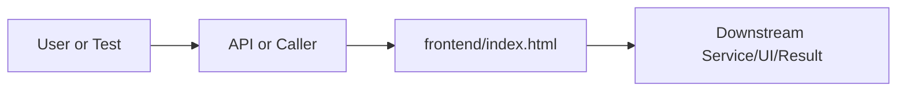

# index.html Explained

Generated educational companion for `frontend/index.html`. This file is intentionally detailed so a developer can understand the code, architecture role, production tradeoffs, and ML/backend concepts behind the implementation.

## File Overview

`frontend/index.html` defines the DOM shell served by FastAPI. IDs and classes are contracts for `app.js` and `styles.css`.

## Why This File Exists

This file isolates one responsibility in the codebase: Frontend layer: static UI, styling, and browser behavior. Separation matters because AI systems are easier to test, scale, debug, and explain when retrieval, orchestration, ML services, memory, UI, and deployment scripts have clear boundaries.

## Workflow Position

**Layer:** Frontend layer: static UI, styling, and browser behavior.

**Previous step:** caller code, an API request, a browser event, a test fixture, an import, or a startup script prepares inputs.

**Current step:** `frontend/index.html` performs its local responsibility.

**Next step:** downstream services, API responses, rendered UI, tests, or process execution consume the result.



## Inputs and Outputs

- **Inputs:** function arguments, class constructor dependencies, HTTP payloads, environment variables, filesystem artifacts, DOM events, or test fixtures.
- **Outputs:** return values, dictionaries, Pydantic models, rendered DOM state, API responses, logs, process startup, assertions, or side effects.
- **Serialization:** this project uses JSON for APIs/LLM planning, parquet/joblib/faiss for ML artifacts, and HTML/CSS/JS for the browser surface.

## Imports Explained

This file has no explicit imports. That usually means it is declarative, a package marker, or uses only runtime/browser/shell primitives.

## Global Variables and Config

Configuration is declarative. Treat these values/selectors/commands as runtime contracts because other tools or browser code depend on them.

## Step-by-Step Workflow

1. Load dependencies and runtime constants.
2. Accept input from the previous layer.
3. Validate, transform, route, score, render, or execute according to this file's role.
4. Return a structured output or perform a controlled side effect.
5. Let caller layers handle presentation, persistence, retries, or fallback.

## Function-by-Function Breakdown

This file is not primarily function-oriented. Behavior is expressed through markup, selectors, shell commands, or configuration keys.

## Class-by-Class Breakdown

No Python classes apply. The comparable contracts are DOM nodes, CSS classes, shell variables, or configuration sections.

## Important Algorithms Used

- **FAISS Indexing**: FAISS indexes dense vectors for nearest-neighbor search. Exact flat indexes trade speed at huge scale for simplicity and correctness.
- **Hybrid Retrieval**: Hybrid retrieval combines semantic vectors with lexical/keyword evidence, improving scientific search where exact terms matter.
- **RAG**: Retrieval-Augmented Generation retrieves evidence first and asks an LLM to answer from that evidence, reducing hallucination.
- **LLM Inference**: LLM inference sends prompts or chat messages to a model provider and receives generated text under token, latency, and cost constraints.
- **Transformers**: Transformers use tokenization and attention layers for language understanding/generation. They are powerful but memory and latency sensitive.
- **Classification**: Classification maps text or features to discrete labels, supporting category prediction and routing.
- **Streaming**: Streaming improves perceived latency by sending incremental output instead of waiting for full completion.
- **Sandboxing**: Sandboxing validates and constrains user code before execution, reducing security and stability risk.
- **DOM contract design**: IDs/classes form an API consumed by CSS and JavaScript.

## Libraries Used

This file has no explicit imports. That usually means it is declarative, a package marker, or uses only runtime/browser/shell primitives.

## ML Concepts Used

- **FAISS Indexing**: FAISS indexes dense vectors for nearest-neighbor search. Exact flat indexes trade speed at huge scale for simplicity and correctness.
- **Hybrid Retrieval**: Hybrid retrieval combines semantic vectors with lexical/keyword evidence, improving scientific search where exact terms matter.
- **RAG**: Retrieval-Augmented Generation retrieves evidence first and asks an LLM to answer from that evidence, reducing hallucination.
- **LLM Inference**: LLM inference sends prompts or chat messages to a model provider and receives generated text under token, latency, and cost constraints.
- **Transformers**: Transformers use tokenization and attention layers for language understanding/generation. They are powerful but memory and latency sensitive.
- **Classification**: Classification maps text or features to discrete labels, supporting category prediction and routing.
- **Streaming**: Streaming improves perceived latency by sending incremental output instead of waiting for full completion.
- **Sandboxing**: Sandboxing validates and constrains user code before execution, reducing security and stability risk.

## Performance and Memory Notes

- Avoid eager loading of heavy ML models unless startup latency is acceptable.
- Cache expensive clients, tokenizers, vector stores, and embeddings carefully.
- Use float32 for embedding vectors because it halves memory compared with float64 and matches FAISS/neural inference expectations.
- Bound prompt length, uploaded content, result counts, and token budgets to control latency and memory.
- Watch copies of large metadata frames, embedding matrices, and file buffers.

## Scalability Notes

- In-memory state works for local demos but needs Redis/database/object storage for multi-worker cloud deployment.
- CPU/GPU inference should often be separated from the web API when traffic grows.
- Retrieval can start exact and move to approximate indexes as corpus size grows.
- Batch operations and cache repeated work to improve throughput.
- Add metrics for latency, errors, fallback frequency, retrieval hit rate, and token usage.

## Production Engineering Notes

- Keep interfaces stable because other files may import this module or depend on its response shape.
- Prefer typed/structured data over free-form strings at service boundaries.
- Log operational context without secrets or huge payloads.
- Make fallback behavior explicit so users get useful output even when LLMs or artifacts fail.
- Keep provider-specific logic behind adapters so Groq/OpenRouter/Google/Ollama can be swapped.

## Common Bugs and Failure Cases

- Missing `.env` values, model artifacts, or Ollama models can trigger degraded behavior.
- Type mismatches occur when LLM-generated tool arguments cross into strict Python code.
- Empty retrieval results must not become hallucinated answers.
- Network calls need timeouts and careful retry behavior.
- Frontend IDs/classes and API schemas are contracts; changing one side without the other breaks workflows.

## Security Considerations

- Touches files or paths. Validate filenames, restrict upload size/type, and prevent traversal.
- Performs network I/O. Use timeouts, validate responses, and keep private services such as Ollama off the public internet.
- Browser-facing code must avoid injecting unsanitized model output. Prefer textContent or deliberate sanitization.

## Real Industry Usage

- This pattern appears in enterprise RAG assistants, scientific search tools, internal research copilots, and ML platform demos.
- The layered design mirrors production systems: API facade, orchestration, retrieval, evaluation, synthesis, UI, and deployment.
- Clear separation lets teams replace model providers, improve retrieval, harden security, or redesign UI independently.

## Optimization Opportunities

- Add tracing around each workflow step.
- Strengthen schema validation at boundaries.
- Persist conversation/session state outside process memory.
- Add load tests and adversarial tests for prompt injection, empty evidence, and large uploads.
- Consider approximate vector indexes, reranker models, or batching when corpus/traffic grows.

## How This Connects To Other Files

- `frontend/index.html` is connected through imports, startup scripts, API routes, frontend selectors, tests, or artifact paths.
- `src/research_ai/platform.py` is the backend composition root.
- `src/research_ai/api/main.py` exposes backend behavior over HTTP.
- Retrieval modules depend on artifacts under `artifacts/`.
- Frontend files depend on stable endpoint and DOM contracts.

## End-to-End Flow Summary

- A user/browser/test/startup event enters the system.
- The relevant layer validates or normalizes input.
- Retrieval, ML, orchestration, execution, or UI rendering happens.
- A structured result, visual state, or process side effect is produced.
- Fallbacks and tests keep behavior understandable when dependencies are unavailable.

## Interview Questions

1. What responsibility does this file own?
2. What inputs and outputs define its contract?
3. Which dependencies are expensive or operationally risky?
4. What breaks if this file changes shape?
5. How would you scale or test this behavior in production?

## Key Takeaways

- `frontend/index.html` should be understood as part of a layered AI research platform.
- Trace data flow from inputs to transformations to outputs.
- Production readiness comes from explicit contracts, bounded resources, observability, secure defaults, and graceful fallback.

## Fully Commented Source

This section repeats the original source with an explanatory comment before every line. The comments are educational only; they are not inserted into the production source file.

```html
<!-- L0001: Declares HTML5 document mode so browsers render consistently. -->
<!DOCTYPE html>
<!-- L0002: Starts the root HTML element and declares document language/context. -->
<html lang="en" data-theme="dark">
<!-- L0003: Opens or closes metadata/resource section used by the browser before rendering body content. -->
<head>
<!-- L0004: Defines static document structure rendered by the browser. -->
  <meta charset="UTF-8" />
<!-- L0005: Defines static document structure rendered by the browser. -->
  <meta name="viewport" content="width=device-width, initial-scale=1.0" />
<!-- L0006: Defines static document structure rendered by the browser. -->
  <title>Research AI — Intelligent Research Assistant</title>
<!-- L0007: Links external resources such as stylesheets or icons. -->
  <link rel="preconnect" href="https://fonts.googleapis.com" />
<!-- L0008: Links external resources such as stylesheets or icons. -->
  <link rel="preconnect" href="https://fonts.gstatic.com" crossorigin />
<!-- L0009: Links external resources such as stylesheets or icons. -->
  <link href="https://fonts.googleapis.com/css2?family=Inter:wght@400;500;600&family=JetBrains+Mono:wght@400;500&display=swap" rel="stylesheet" />
<!-- L0010: Links external resources such as stylesheets or icons. -->
  <link rel="stylesheet" href="/static/styles.css" />
<!-- L0011: Opens or closes metadata/resource section used by the browser before rendering body content. -->
</head>
<!-- L0012: Opens or closes the visible document body. -->
<body>
<!-- L0013: Blank line that visually separates logical sections and improves readability. -->

<!-- L0014: HTML comment marking a UI section or explaining document structure. -->
  <!-- ═══════════════════════════════════════════════════════════════
<!-- L0015: Defines static document structure rendered by the browser. -->
       SIDEBAR — history, upload, settings (not mode selection)
<!-- L0016: Defines static document structure rendered by the browser. -->
       The user never picks a mode; the AI decides internally.
<!-- L0017: Defines static document structure rendered by the browser. -->
  ═══════════════════════════════════════════════════════════════ -->
<!-- L0018: Defines DOM structure with identifiers/classes consumed by CSS and JavaScript. -->
  <div id="sidebarOverlay" class="sidebar-overlay"></div>
<!-- L0019: Blank line that visually separates logical sections and improves readability. -->

<!-- L0020: Defines DOM structure with identifiers/classes consumed by CSS and JavaScript. -->
  <aside class="sidebar" id="sidebar">
<!-- L0021: Blank line that visually separates logical sections and improves readability. -->

<!-- L0022: HTML comment marking a UI section or explaining document structure. -->
    <!-- Logo + new chat -->
<!-- L0023: Defines DOM structure with identifiers/classes consumed by CSS and JavaScript. -->
    <div class="sidebar-top">
<!-- L0024: Defines DOM structure with identifiers/classes consumed by CSS and JavaScript. -->
      <div class="logo">
<!-- L0025: Defines DOM structure with identifiers/classes consumed by CSS and JavaScript. -->
        <div class="logo-mark">
<!-- L0026: Defines static document structure rendered by the browser. -->
          <svg width="20" height="20" viewBox="0 0 20 20" fill="none">
<!-- L0027: Defines static document structure rendered by the browser. -->
            <circle cx="10" cy="10" r="9" stroke="currentColor" stroke-width="1.5"/>
<!-- L0028: Defines static document structure rendered by the browser. -->
            <path d="M10 5v10M5 10h10" stroke="currentColor" stroke-width="1.5" stroke-linecap="round"/>
<!-- L0029: Closes an HTML element, preserving valid DOM nesting. -->
          </svg>
<!-- L0030: Closes an HTML element, preserving valid DOM nesting. -->
        </div>
<!-- L0031: Defines DOM structure with identifiers/classes consumed by CSS and JavaScript. -->
        <span class="logo-text">Research<strong>AI</strong></span>
<!-- L0032: Closes an HTML element, preserving valid DOM nesting. -->
      </div>
<!-- L0033: Defines DOM structure with identifiers/classes consumed by CSS and JavaScript. -->
      <button class="new-chat-btn" id="newChatBtn" title="New conversation">
<!-- L0034: Defines static document structure rendered by the browser. -->
        <svg width="14" height="14" viewBox="0 0 14 14" fill="none">
<!-- L0035: Defines static document structure rendered by the browser. -->
          <path d="M7 1v12M1 7h12" stroke="currentColor" stroke-width="1.5" stroke-linecap="round"/>
<!-- L0036: Closes an HTML element, preserving valid DOM nesting. -->
        </svg>
<!-- L0037: Defines static document structure rendered by the browser. -->
        New chat
<!-- L0038: Closes an HTML element, preserving valid DOM nesting. -->
      </button>
<!-- L0039: Closes an HTML element, preserving valid DOM nesting. -->
    </div>
<!-- L0040: Blank line that visually separates logical sections and improves readability. -->

<!-- L0041: HTML comment marking a UI section or explaining document structure. -->
    <!-- Conversation history -->
<!-- L0042: Defines DOM structure with identifiers/classes consumed by CSS and JavaScript. -->
    <div class="sidebar-section">
<!-- L0043: Defines DOM structure with identifiers/classes consumed by CSS and JavaScript. -->
      <div class="sidebar-section-label">Recent</div>
<!-- L0044: Defines DOM structure with identifiers/classes consumed by CSS and JavaScript. -->
      <div id="historyList" class="history-list"></div>
<!-- L0045: Closes an HTML element, preserving valid DOM nesting. -->
    </div>
<!-- L0046: Blank line that visually separates logical sections and improves readability. -->

<!-- L0047: HTML comment marking a UI section or explaining document structure. -->
    <!-- Upload documents -->
<!-- L0048: Defines DOM structure with identifiers/classes consumed by CSS and JavaScript. -->
    <div class="sidebar-section">
<!-- L0049: Defines DOM structure with identifiers/classes consumed by CSS and JavaScript. -->
      <div class="sidebar-section-label">Documents</div>
<!-- L0050: Defines DOM structure with identifiers/classes consumed by CSS and JavaScript. -->
      <div class="upload-area" id="uploadArea">
<!-- L0051: Defines DOM structure with identifiers/classes consumed by CSS and JavaScript. -->
        <label class="upload-trigger" for="pdfUpload">
<!-- L0052: Defines static document structure rendered by the browser. -->
          <svg width="14" height="14" viewBox="0 0 14 14" fill="none">
<!-- L0053: Defines static document structure rendered by the browser. -->
            <path d="M7 1v8M4 4l3-3 3 3M1 11h12" stroke="currentColor" stroke-width="1.3" stroke-linecap="round" stroke-linejoin="round"/>
<!-- L0054: Closes an HTML element, preserving valid DOM nesting. -->
          </svg>
<!-- L0055: Defines static document structure rendered by the browser. -->
          Upload PDF / TXT
<!-- L0056: Defines DOM structure with identifiers/classes consumed by CSS and JavaScript. -->
          <input type="file" id="pdfUpload" accept=".pdf,.txt" hidden multiple />
<!-- L0057: Closes an HTML element, preserving valid DOM nesting. -->
        </label>
<!-- L0058: Defines DOM structure with identifiers/classes consumed by CSS and JavaScript. -->
        <div class="arxiv-row">
<!-- L0059: Defines DOM structure with identifiers/classes consumed by CSS and JavaScript. -->
          <input type="text" id="arxivInput" placeholder="arXiv ID e.g. 2303.08774" class="arxiv-input" />
<!-- L0060: Defines DOM structure with identifiers/classes consumed by CSS and JavaScript. -->
          <button id="loadArxivBtn" class="arxiv-load-btn">Load</button>
<!-- L0061: Closes an HTML element, preserving valid DOM nesting. -->
        </div>
<!-- L0062: Defines DOM structure with identifiers/classes consumed by CSS and JavaScript. -->
        <div id="loadedDocs" class="loaded-docs"></div>
<!-- L0063: Closes an HTML element, preserving valid DOM nesting. -->
      </div>
<!-- L0064: Closes an HTML element, preserving valid DOM nesting. -->
    </div>
<!-- L0065: Blank line that visually separates logical sections and improves readability. -->

<!-- L0066: HTML comment marking a UI section or explaining document structure. -->
    <!-- Available models (shown when Ollama is detected) -->
<!-- L0067: Defines DOM structure with identifiers/classes consumed by CSS and JavaScript. -->
    <div class="sidebar-section" id="modelsSection" style="display:none">
<!-- L0068: Defines DOM structure with identifiers/classes consumed by CSS and JavaScript. -->
      <div class="sidebar-section-label">Local Models</div>
<!-- L0069: Defines DOM structure with identifiers/classes consumed by CSS and JavaScript. -->
      <div id="modelsList" class="models-list"></div>
<!-- L0070: Closes an HTML element, preserving valid DOM nesting. -->
    </div>
<!-- L0071: Blank line that visually separates logical sections and improves readability. -->

<!-- L0072: HTML comment marking a UI section or explaining document structure. -->
    <!-- Settings -->
<!-- L0073: Defines DOM structure with identifiers/classes consumed by CSS and JavaScript. -->
    <div class="sidebar-section sidebar-settings">
<!-- L0074: Defines DOM structure with identifiers/classes consumed by CSS and JavaScript. -->
      <div class="sidebar-section-label">Settings</div>
<!-- L0075: Defines DOM structure with identifiers/classes consumed by CSS and JavaScript. -->
      <div class="setting-row">
<!-- L0076: Defines DOM structure with identifiers/classes consumed by CSS and JavaScript. -->
        <label for="topKSlider">Sources <span id="topKVal">5</span></label>
<!-- L0077: Defines DOM structure with identifiers/classes consumed by CSS and JavaScript. -->
        <input type="range" id="topKSlider" min="1" max="15" value="5" class="slider" />
<!-- L0078: Closes an HTML element, preserving valid DOM nesting. -->
      </div>
<!-- L0079: Defines DOM structure with identifiers/classes consumed by CSS and JavaScript. -->
      <div class="setting-row">
<!-- L0080: Defines static document structure rendered by the browser. -->
        <label for="debugToggle">Debug mode</label>
<!-- L0081: Defines DOM structure with identifiers/classes consumed by CSS and JavaScript. -->
        <input type="checkbox" id="debugToggle" class="toggle-check" />
<!-- L0082: Closes an HTML element, preserving valid DOM nesting. -->
      </div>
<!-- L0083: Defines DOM structure with identifiers/classes consumed by CSS and JavaScript. -->
      <div class="setting-row">
<!-- L0084: Defines static document structure rendered by the browser. -->
        <label>Theme</label>
<!-- L0085: Defines DOM structure with identifiers/classes consumed by CSS and JavaScript. -->
        <button id="themeToggle" class="theme-btn">
<!-- L0086: Defines DOM structure with identifiers/classes consumed by CSS and JavaScript. -->
          <span id="themeIcon">☀</span>
<!-- L0087: Closes an HTML element, preserving valid DOM nesting. -->
        </button>
<!-- L0088: Closes an HTML element, preserving valid DOM nesting. -->
      </div>
<!-- L0089: Closes an HTML element, preserving valid DOM nesting. -->
    </div>
<!-- L0090: Blank line that visually separates logical sections and improves readability. -->

<!-- L0091: HTML comment marking a UI section or explaining document structure. -->
    <!-- Status -->
<!-- L0092: Defines DOM structure with identifiers/classes consumed by CSS and JavaScript. -->
    <div class="sidebar-status" id="statusBar">
<!-- L0093: Defines DOM structure with identifiers/classes consumed by CSS and JavaScript. -->
      <div class="status-dot" id="statusDot"></div>
<!-- L0094: Defines DOM structure with identifiers/classes consumed by CSS and JavaScript. -->
      <span id="statusText">Connecting…</span>
<!-- L0095: Closes an HTML element, preserving valid DOM nesting. -->
    </div>
<!-- L0096: Closes an HTML element, preserving valid DOM nesting. -->
  </aside>
<!-- L0097: Blank line that visually separates logical sections and improves readability. -->

<!-- L0098: HTML comment marking a UI section or explaining document structure. -->
  <!-- ═══════════════════════════════════════════════════════════════
<!-- L0099: Defines static document structure rendered by the browser. -->
       MAIN — pure chat area (no mode selector)
<!-- L0100: Defines static document structure rendered by the browser. -->
  ═══════════════════════════════════════════════════════════════ -->
<!-- L0101: Defines DOM structure with identifiers/classes consumed by CSS and JavaScript. -->
  <main class="main" id="main">
<!-- L0102: Blank line that visually separates logical sections and improves readability. -->

<!-- L0103: HTML comment marking a UI section or explaining document structure. -->
    <!-- Mobile topbar -->
<!-- L0104: Defines DOM structure with identifiers/classes consumed by CSS and JavaScript. -->
    <div class="topbar">
<!-- L0105: Defines DOM structure with identifiers/classes consumed by CSS and JavaScript. -->
      <button class="topbar-btn" id="mobileSidebarToggle">
<!-- L0106: Defines static document structure rendered by the browser. -->
        <svg width="16" height="16" viewBox="0 0 16 16" fill="none">
<!-- L0107: Defines static document structure rendered by the browser. -->
          <path d="M2 4h12M2 8h12M2 12h12" stroke="currentColor" stroke-width="1.4" stroke-linecap="round"/>
<!-- L0108: Closes an HTML element, preserving valid DOM nesting. -->
        </svg>
<!-- L0109: Closes an HTML element, preserving valid DOM nesting. -->
      </button>
<!-- L0110: Defines DOM structure with identifiers/classes consumed by CSS and JavaScript. -->
      <span class="topbar-title" id="topbarTitle">Research Assistant</span>
<!-- L0111: Defines DOM structure with identifiers/classes consumed by CSS and JavaScript. -->
      <button class="topbar-btn" id="topbarNewChat" title="New conversation">
<!-- L0112: Defines static document structure rendered by the browser. -->
        <svg width="14" height="14" viewBox="0 0 14 14" fill="none">
<!-- L0113: Defines static document structure rendered by the browser. -->
          <path d="M7 1v12M1 7h12" stroke="currentColor" stroke-width="1.5" stroke-linecap="round"/>
<!-- L0114: Closes an HTML element, preserving valid DOM nesting. -->
        </svg>
<!-- L0115: Closes an HTML element, preserving valid DOM nesting. -->
      </button>
<!-- L0116: Closes an HTML element, preserving valid DOM nesting. -->
    </div>
<!-- L0117: Blank line that visually separates logical sections and improves readability. -->

<!-- L0118: HTML comment marking a UI section or explaining document structure. -->
    <!-- Welcome screen (shown when no messages) -->
<!-- L0119: Defines DOM structure with identifiers/classes consumed by CSS and JavaScript. -->
    <div class="welcome" id="welcome">
<!-- L0120: Defines DOM structure with identifiers/classes consumed by CSS and JavaScript. -->
      <div class="welcome-icon">
<!-- L0121: Defines static document structure rendered by the browser. -->
        <svg width="56" height="56" viewBox="0 0 56 56" fill="none">
<!-- L0122: Defines static document structure rendered by the browser. -->
          <circle cx="28" cy="28" r="27" stroke="currentColor" stroke-width="1" opacity="0.2"/>
<!-- L0123: Defines static document structure rendered by the browser. -->
          <circle cx="28" cy="28" r="18" stroke="currentColor" stroke-width="1" opacity="0.4"/>
<!-- L0124: Defines static document structure rendered by the browser. -->
          <circle cx="28" cy="28" r="10" stroke="currentColor" stroke-width="1.5"/>
<!-- L0125: Defines static document structure rendered by the browser. -->
          <path d="M21 28h14M28 21v14" stroke="currentColor" stroke-width="1.5" stroke-linecap="round"/>
<!-- L0126: Closes an HTML element, preserving valid DOM nesting. -->
        </svg>
<!-- L0127: Closes an HTML element, preserving valid DOM nesting. -->
      </div>
<!-- L0128: Defines DOM structure with identifiers/classes consumed by CSS and JavaScript. -->
      <h1 class="welcome-title">Research Intelligence Platform</h1>
<!-- L0129: Defines DOM structure with identifiers/classes consumed by CSS and JavaScript. -->
      <p class="welcome-sub">Ask anything. I'll automatically search papers, extract evidence,<br/>and synthesize a grounded answer — no manual tool selection needed.</p>
<!-- L0130: Blank line that visually separates logical sections and improves readability. -->

<!-- L0131: Defines DOM structure with identifiers/classes consumed by CSS and JavaScript. -->
      <div class="capability-grid">
<!-- L0132: Defines DOM structure with identifiers/classes consumed by CSS and JavaScript. -->
        <div class="capability-card">
<!-- L0133: Defines DOM structure with identifiers/classes consumed by CSS and JavaScript. -->
          <div class="cap-icon">🔍</div>
<!-- L0134: Defines DOM structure with identifiers/classes consumed by CSS and JavaScript. -->
          <div class="cap-label">Semantic Search</div>
<!-- L0135: Defines DOM structure with identifiers/classes consumed by CSS and JavaScript. -->
          <div class="cap-desc">FAISS + BM25 hybrid over indexed arXiv papers</div>
<!-- L0136: Closes an HTML element, preserving valid DOM nesting. -->
        </div>
<!-- L0137: Defines DOM structure with identifiers/classes consumed by CSS and JavaScript. -->
        <div class="capability-card">
<!-- L0138: Defines DOM structure with identifiers/classes consumed by CSS and JavaScript. -->
          <div class="cap-icon">🧠</div>
<!-- L0139: Defines DOM structure with identifiers/classes consumed by CSS and JavaScript. -->
          <div class="cap-label">AI Orchestration</div>
<!-- L0140: Defines DOM structure with identifiers/classes consumed by CSS and JavaScript. -->
          <div class="cap-desc">Planner decides which tools to invoke automatically</div>
<!-- L0141: Closes an HTML element, preserving valid DOM nesting. -->
        </div>
<!-- L0142: Defines DOM structure with identifiers/classes consumed by CSS and JavaScript. -->
        <div class="capability-card">
<!-- L0143: Defines DOM structure with identifiers/classes consumed by CSS and JavaScript. -->
          <div class="cap-icon">📚</div>
<!-- L0144: Defines DOM structure with identifiers/classes consumed by CSS and JavaScript. -->
          <div class="cap-label">Grounded Answers</div>
<!-- L0145: Defines DOM structure with identifiers/classes consumed by CSS and JavaScript. -->
          <div class="cap-desc">Every claim backed by retrieved evidence with citations</div>
<!-- L0146: Closes an HTML element, preserving valid DOM nesting. -->
        </div>
<!-- L0147: Defines DOM structure with identifiers/classes consumed by CSS and JavaScript. -->
        <div class="capability-card">
<!-- L0148: Defines DOM structure with identifiers/classes consumed by CSS and JavaScript. -->
          <div class="cap-icon">💬</div>
<!-- L0149: Defines DOM structure with identifiers/classes consumed by CSS and JavaScript. -->
          <div class="cap-label">Conversational</div>
<!-- L0150: Defines DOM structure with identifiers/classes consumed by CSS and JavaScript. -->
          <div class="cap-desc">Follow-up questions with full conversation memory</div>
<!-- L0151: Closes an HTML element, preserving valid DOM nesting. -->
        </div>
<!-- L0152: Closes an HTML element, preserving valid DOM nesting. -->
      </div>
<!-- L0153: Blank line that visually separates logical sections and improves readability. -->

<!-- L0154: Defines DOM structure with identifiers/classes consumed by CSS and JavaScript. -->
      <div class="example-queries" id="exampleQueries">
<!-- L0155: Defines DOM structure with identifiers/classes consumed by CSS and JavaScript. -->
        <button class="example-chip">What are recent advances in graph neural networks for drug discovery?</button>
<!-- L0156: Defines DOM structure with identifiers/classes consumed by CSS and JavaScript. -->
        <button class="example-chip">How has diffusion model research evolved since 2020?</button>
<!-- L0157: Defines DOM structure with identifiers/classes consumed by CSS and JavaScript. -->
        <button class="example-chip">Which papers on BERT used attention for NLP classification?</button>
<!-- L0158: Defines DOM structure with identifiers/classes consumed by CSS and JavaScript. -->
        <button class="example-chip">Explain the methodology behind AlphaFold's structure prediction</button>
<!-- L0159: Defines DOM structure with identifiers/classes consumed by CSS and JavaScript. -->
        <button class="example-chip">Find papers on reinforcement learning from human feedback</button>
<!-- L0160: Defines DOM structure with identifiers/classes consumed by CSS and JavaScript. -->
        <button class="example-chip">What are the most cited papers on transformer attention mechanisms?</button>
<!-- L0161: Closes an HTML element, preserving valid DOM nesting. -->
      </div>
<!-- L0162: Closes an HTML element, preserving valid DOM nesting. -->
    </div>
<!-- L0163: Blank line that visually separates logical sections and improves readability. -->

<!-- L0164: HTML comment marking a UI section or explaining document structure. -->
    <!-- Chat messages area -->
<!-- L0165: Defines DOM structure with identifiers/classes consumed by CSS and JavaScript. -->
    <div class="chat-area" id="chatArea" style="display:none"></div>
<!-- L0166: Blank line that visually separates logical sections and improves readability. -->

<!-- L0167: HTML comment marking a UI section or explaining document structure. -->
    <!-- Input composer -->
<!-- L0168: Defines DOM structure with identifiers/classes consumed by CSS and JavaScript. -->
    <div class="composer-wrap" id="composerWrap">
<!-- L0169: Defines DOM structure with identifiers/classes consumed by CSS and JavaScript. -->
      <div class="composer" id="composer">
<!-- L0170: Defines DOM structure with identifiers/classes consumed by CSS and JavaScript. -->
        <div class="composer-left">
<!-- L0171: HTML comment marking a UI section or explaining document structure. -->
          <!-- File attach button -->
<!-- L0172: Defines DOM structure with identifiers/classes consumed by CSS and JavaScript. -->
          <button class="composer-attach" id="composerAttach" title="Upload document">
<!-- L0173: Defines static document structure rendered by the browser. -->
            <svg width="15" height="15" viewBox="0 0 15 15" fill="none">
<!-- L0174: Defines static document structure rendered by the browser. -->
              <path d="M13 7.5a5.5 5.5 0 0 1-5.5 5.5H4A3.5 3.5 0 0 1 4 6h7" stroke="currentColor" stroke-width="1.3" stroke-linecap="round"/>
<!-- L0175: Defines static document structure rendered by the browser. -->
              <path d="M9 3v7M7 5l2-2 2 2" stroke="currentColor" stroke-width="1.3" stroke-linecap="round" stroke-linejoin="round"/>
<!-- L0176: Closes an HTML element, preserving valid DOM nesting. -->
            </svg>
<!-- L0177: Closes an HTML element, preserving valid DOM nesting. -->
          </button>
<!-- L0178: Defines DOM structure with identifiers/classes consumed by CSS and JavaScript. -->
          <input type="file" id="composerFile" accept=".pdf,.txt" hidden multiple />
<!-- L0179: Closes an HTML element, preserving valid DOM nesting. -->
        </div>
<!-- L0180: Defines static document structure rendered by the browser. -->
        <textarea
<!-- L0181: Defines DOM structure with identifiers/classes consumed by CSS and JavaScript. -->
          id="chatInput"
<!-- L0182: Defines static document structure rendered by the browser. -->
          rows="1"
<!-- L0183: Defines static document structure rendered by the browser. -->
          placeholder="Ask a research question… (Enter to send, Shift+Enter for newline)"
<!-- L0184: Defines static document structure rendered by the browser. -->
          aria-label="Message"
<!-- L0185: Defines static document structure rendered by the browser. -->
        ></textarea>
<!-- L0186: Defines DOM structure with identifiers/classes consumed by CSS and JavaScript. -->
        <button class="send-btn" id="sendBtn" title="Send" disabled>
<!-- L0187: Defines static document structure rendered by the browser. -->
          <svg width="15" height="15" viewBox="0 0 15 15" fill="none">
<!-- L0188: Defines static document structure rendered by the browser. -->
            <path d="M14 1L1 7l5 2.5L8 14l6-13z" fill="currentColor"/>
<!-- L0189: Closes an HTML element, preserving valid DOM nesting. -->
          </svg>
<!-- L0190: Closes an HTML element, preserving valid DOM nesting. -->
        </button>
<!-- L0191: Closes an HTML element, preserving valid DOM nesting. -->
      </div>
<!-- L0192: Defines DOM structure with identifiers/classes consumed by CSS and JavaScript. -->
      <p class="composer-hint">Research AI may make mistakes. Always verify critical information.</p>
<!-- L0193: Closes an HTML element, preserving valid DOM nesting. -->
    </div>
<!-- L0194: Blank line that visually separates logical sections and improves readability. -->

<!-- L0195: Closes an HTML element, preserving valid DOM nesting. -->
  </main>
<!-- L0196: Blank line that visually separates logical sections and improves readability. -->

<!-- L0197: HTML comment marking a UI section or explaining document structure. -->
  <!-- ═══════════════════════════════════════════════════════════════
<!-- L0198: Defines static document structure rendered by the browser. -->
       PAPER VIEWER MODAL — shown when user clicks "View" on a source
<!-- L0199: Defines static document structure rendered by the browser. -->
  ═══════════════════════════════════════════════════════════════ -->
<!-- L0200: Defines DOM structure with identifiers/classes consumed by CSS and JavaScript. -->
  <div class="modal-overlay" id="modalOverlay" style="display:none">
<!-- L0201: Defines DOM structure with identifiers/classes consumed by CSS and JavaScript. -->
    <div class="modal" id="paperModal">
<!-- L0202: Defines DOM structure with identifiers/classes consumed by CSS and JavaScript. -->
      <div class="modal-header">
<!-- L0203: Defines DOM structure with identifiers/classes consumed by CSS and JavaScript. -->
        <div class="modal-title" id="modalTitle"></div>
<!-- L0204: Defines DOM structure with identifiers/classes consumed by CSS and JavaScript. -->
        <button class="modal-close" id="modalClose">✕</button>
<!-- L0205: Closes an HTML element, preserving valid DOM nesting. -->
      </div>
<!-- L0206: Defines DOM structure with identifiers/classes consumed by CSS and JavaScript. -->
      <div class="modal-body" id="modalBody"></div>
<!-- L0207: Closes an HTML element, preserving valid DOM nesting. -->
    </div>
<!-- L0208: Closes an HTML element, preserving valid DOM nesting. -->
  </div>
<!-- L0209: Blank line that visually separates logical sections and improves readability. -->

<!-- L0210: Loads JavaScript that makes the static DOM interactive. -->
  <script src="/static/app.js"></script>
<!-- L0211: Opens or closes the visible document body. -->
</body>
<!-- L0212: Closes an HTML element, preserving valid DOM nesting. -->
</html>
```

## Source Walkthrough

The complete source is included because the file is short enough to study directly.

```html
<!DOCTYPE html>
<html lang="en" data-theme="dark">
<head>
  <meta charset="UTF-8" />
  <meta name="viewport" content="width=device-width, initial-scale=1.0" />
  <title>Research AI — Intelligent Research Assistant</title>
  <link rel="preconnect" href="https://fonts.googleapis.com" />
  <link rel="preconnect" href="https://fonts.gstatic.com" crossorigin />
  <link href="https://fonts.googleapis.com/css2?family=Inter:wght@400;500;600&family=JetBrains+Mono:wght@400;500&display=swap" rel="stylesheet" />
  <link rel="stylesheet" href="/static/styles.css" />
</head>
<body>

  <!-- ═══════════════════════════════════════════════════════════════
       SIDEBAR — history, upload, settings (not mode selection)
       The user never picks a mode; the AI decides internally.
  ═══════════════════════════════════════════════════════════════ -->
  <div id="sidebarOverlay" class="sidebar-overlay"></div>

  <aside class="sidebar" id="sidebar">

    <!-- Logo + new chat -->
    <div class="sidebar-top">
      <div class="logo">
        <div class="logo-mark">
          <svg width="20" height="20" viewBox="0 0 20 20" fill="none">
            <circle cx="10" cy="10" r="9" stroke="currentColor" stroke-width="1.5"/>
            <path d="M10 5v10M5 10h10" stroke="currentColor" stroke-width="1.5" stroke-linecap="round"/>
          </svg>
        </div>
        <span class="logo-text">Research<strong>AI</strong></span>
      </div>
      <button class="new-chat-btn" id="newChatBtn" title="New conversation">
        <svg width="14" height="14" viewBox="0 0 14 14" fill="none">
          <path d="M7 1v12M1 7h12" stroke="currentColor" stroke-width="1.5" stroke-linecap="round"/>
        </svg>
        New chat
      </button>
    </div>

    <!-- Conversation history -->
    <div class="sidebar-section">
      <div class="sidebar-section-label">Recent</div>
      <div id="historyList" class="history-list"></div>
    </div>

    <!-- Upload documents -->
    <div class="sidebar-section">
      <div class="sidebar-section-label">Documents</div>
      <div class="upload-area" id="uploadArea">
        <label class="upload-trigger" for="pdfUpload">
          <svg width="14" height="14" viewBox="0 0 14 14" fill="none">
            <path d="M7 1v8M4 4l3-3 3 3M1 11h12" stroke="currentColor" stroke-width="1.3" stroke-linecap="round" stroke-linejoin="round"/>
          </svg>
          Upload PDF / TXT
          <input type="file" id="pdfUpload" accept=".pdf,.txt" hidden multiple />
        </label>
        <div class="arxiv-row">
          <input type="text" id="arxivInput" placeholder="arXiv ID e.g. 2303.08774" class="arxiv-input" />
          <button id="loadArxivBtn" class="arxiv-load-btn">Load</button>
        </div>
        <div id="loadedDocs" class="loaded-docs"></div>
      </div>
    </div>

    <!-- Available models (shown when Ollama is detected) -->
    <div class="sidebar-section" id="modelsSection" style="display:none">
      <div class="sidebar-section-label">Local Models</div>
      <div id="modelsList" class="models-list"></div>
    </div>

    <!-- Settings -->
    <div class="sidebar-section sidebar-settings">
      <div class="sidebar-section-label">Settings</div>
      <div class="setting-row">
        <label for="topKSlider">Sources <span id="topKVal">5</span></label>
        <input type="range" id="topKSlider" min="1" max="15" value="5" class="slider" />
      </div>
      <div class="setting-row">
        <label for="debugToggle">Debug mode</label>
        <input type="checkbox" id="debugToggle" class="toggle-check" />
      </div>
      <div class="setting-row">
        <label>Theme</label>
        <button id="themeToggle" class="theme-btn">
          <span id="themeIcon">☀</span>
        </button>
      </div>
    </div>

    <!-- Status -->
    <div class="sidebar-status" id="statusBar">
      <div class="status-dot" id="statusDot"></div>
      <span id="statusText">Connecting…</span>
    </div>
  </aside>

  <!-- ═══════════════════════════════════════════════════════════════
       MAIN — pure chat area (no mode selector)
  ═══════════════════════════════════════════════════════════════ -->
  <main class="main" id="main">

    <!-- Mobile topbar -->
    <div class="topbar">
      <button class="topbar-btn" id="mobileSidebarToggle">
        <svg width="16" height="16" viewBox="0 0 16 16" fill="none">
          <path d="M2 4h12M2 8h12M2 12h12" stroke="currentColor" stroke-width="1.4" stroke-linecap="round"/>
        </svg>
      </button>
      <span class="topbar-title" id="topbarTitle">Research Assistant</span>
      <button class="topbar-btn" id="topbarNewChat" title="New conversation">
        <svg width="14" height="14" viewBox="0 0 14 14" fill="none">
          <path d="M7 1v12M1 7h12" stroke="currentColor" stroke-width="1.5" stroke-linecap="round"/>
        </svg>
      </button>
    </div>

    <!-- Welcome screen (shown when no messages) -->
    <div class="welcome" id="welcome">
      <div class="welcome-icon">
        <svg width="56" height="56" viewBox="0 0 56 56" fill="none">
          <circle cx="28" cy="28" r="27" stroke="currentColor" stroke-width="1" opacity="0.2"/>
          <circle cx="28" cy="28" r="18" stroke="currentColor" stroke-width="1" opacity="0.4"/>
          <circle cx="28" cy="28" r="10" stroke="currentColor" stroke-width="1.5"/>
          <path d="M21 28h14M28 21v14" stroke="currentColor" stroke-width="1.5" stroke-linecap="round"/>
        </svg>
      </div>
      <h1 class="welcome-title">Research Intelligence Platform</h1>
      <p class="welcome-sub">Ask anything. I'll automatically search papers, extract evidence,<br/>and synthesize a grounded answer — no manual tool selection needed.</p>

      <div class="capability-grid">
        <div class="capability-card">
          <div class="cap-icon">🔍</div>
          <div class="cap-label">Semantic Search</div>
          <div class="cap-desc">FAISS + BM25 hybrid over indexed arXiv papers</div>
        </div>
        <div class="capability-card">
          <div class="cap-icon">🧠</div>
          <div class="cap-label">AI Orchestration</div>
          <div class="cap-desc">Planner decides which tools to invoke automatically</div>
        </div>
        <div class="capability-card">
          <div class="cap-icon">📚</div>
          <div class="cap-label">Grounded Answers</div>
          <div class="cap-desc">Every claim backed by retrieved evidence with citations</div>
        </div>
        <div class="capability-card">
          <div class="cap-icon">💬</div>
          <div class="cap-label">Conversational</div>
          <div class="cap-desc">Follow-up questions with full conversation memory</div>
        </div>
      </div>

      <div class="example-queries" id="exampleQueries">
        <button class="example-chip">What are recent advances in graph neural networks for drug discovery?</button>
        <button class="example-chip">How has diffusion model research evolved since 2020?</button>
        <button class="example-chip">Which papers on BERT used attention for NLP classification?</button>
        <button class="example-chip">Explain the methodology behind AlphaFold's structure prediction</button>
        <button class="example-chip">Find papers on reinforcement learning from human feedback</button>
        <button class="example-chip">What are the most cited papers on transformer attention mechanisms?</button>
      </div>
    </div>

    <!-- Chat messages area -->
    <div class="chat-area" id="chatArea" style="display:none"></div>

    <!-- Input composer -->
    <div class="composer-wrap" id="composerWrap">
      <div class="composer" id="composer">
        <div class="composer-left">
          <!-- File attach button -->
          <button class="composer-attach" id="composerAttach" title="Upload document">
            <svg width="15" height="15" viewBox="0 0 15 15" fill="none">
              <path d="M13 7.5a5.5 5.5 0 0 1-5.5 5.5H4A3.5 3.5 0 0 1 4 6h7" stroke="currentColor" stroke-width="1.3" stroke-linecap="round"/>
              <path d="M9 3v7M7 5l2-2 2 2" stroke="currentColor" stroke-width="1.3" stroke-linecap="round" stroke-linejoin="round"/>
            </svg>
          </button>
          <input type="file" id="composerFile" accept=".pdf,.txt" hidden multiple />
        </div>
        <textarea
          id="chatInput"
          rows="1"
          placeholder="Ask a research question… (Enter to send, Shift+Enter for newline)"
          aria-label="Message"
        ></textarea>
        <button class="send-btn" id="sendBtn" title="Send" disabled>
          <svg width="15" height="15" viewBox="0 0 15 15" fill="none">
            <path d="M14 1L1 7l5 2.5L8 14l6-13z" fill="currentColor"/>
          </svg>
        </button>
      </div>
      <p class="composer-hint">Research AI may make mistakes. Always verify critical information.</p>
    </div>

  </main>

  <!-- ═══════════════════════════════════════════════════════════════
       PAPER VIEWER MODAL — shown when user clicks "View" on a source
  ═══════════════════════════════════════════════════════════════ -->
  <div class="modal-overlay" id="modalOverlay" style="display:none">
    <div class="modal" id="paperModal">
      <div class="modal-header">
        <div class="modal-title" id="modalTitle"></div>
        <button class="modal-close" id="modalClose">✕</button>
      </div>
      <div class="modal-body" id="modalBody"></div>
    </div>
  </div>

  <script src="/static/app.js"></script>
</body>
</html>
```
