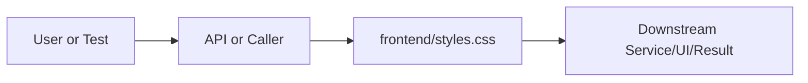

# styles.css Explained

Generated educational companion for `frontend/styles.css`. This file is intentionally detailed so a developer can understand the code, architecture role, production tradeoffs, and ML/backend concepts behind the implementation.

## File Overview

`frontend/styles.css` defines the frontend visual system: theme tokens, layout, responsiveness, component states, and readability for research outputs.

## Why This File Exists

This file isolates one responsibility in the codebase: Frontend layer: static UI, styling, and browser behavior. Separation matters because AI systems are easier to test, scale, debug, and explain when retrieval, orchestration, ML services, memory, UI, and deployment scripts have clear boundaries.

## Workflow Position

**Layer:** Frontend layer: static UI, styling, and browser behavior.

**Previous step:** caller code, an API request, a browser event, a test fixture, an import, or a startup script prepares inputs.

**Current step:** `frontend/styles.css` performs its local responsibility.

**Next step:** downstream services, API responses, rendered UI, tests, or process execution consume the result.



## Inputs and Outputs

- **Inputs:** function arguments, class constructor dependencies, HTTP payloads, environment variables, filesystem artifacts, DOM events, or test fixtures.
- **Outputs:** return values, dictionaries, Pydantic models, rendered DOM state, API responses, logs, process startup, assertions, or side effects.
- **Serialization:** this project uses JSON for APIs/LLM planning, parquet/joblib/faiss for ML artifacts, and HTML/CSS/JS for the browser surface.

## Imports Explained

This file has no explicit imports. That usually means it is declarative, a package marker, or uses only runtime/browser/shell primitives.

## Global Variables and Config

Configuration is declarative. Treat these values/selectors/commands as runtime contracts because other tools or browser code depend on them.

## Step-by-Step Workflow

1. Load dependencies and runtime constants.
2. Accept input from the previous layer.
3. Validate, transform, route, score, render, or execute according to this file's role.
4. Return a structured output or perform a controlled side effect.
5. Let caller layers handle presentation, persistence, retries, or fallback.

## Function-by-Function Breakdown

This file is not primarily function-oriented. Behavior is expressed through markup, selectors, shell commands, or configuration keys.

## Class-by-Class Breakdown

No Python classes apply. The comparable contracts are DOM nodes, CSS classes, shell variables, or configuration sections.

## Important Algorithms Used

- **LLM Inference**: LLM inference sends prompts or chat messages to a model provider and receives generated text under token, latency, and cost constraints.
- **Calibration**: Calibration makes predicted probabilities better match real correctness rates, which matters for user-facing confidence.
- **Streaming**: Streaming improves perceived latency by sending incremental output instead of waiting for full completion.
- **Sandboxing**: Sandboxing validates and constrains user code before execution, reducing security and stability risk.
- **Responsive layout algorithm**: selectors, custom properties, grid/flex rules, and media queries control layout across screen sizes.

## Libraries Used

This file has no explicit imports. That usually means it is declarative, a package marker, or uses only runtime/browser/shell primitives.

## ML Concepts Used

- **LLM Inference**: LLM inference sends prompts or chat messages to a model provider and receives generated text under token, latency, and cost constraints.
- **Calibration**: Calibration makes predicted probabilities better match real correctness rates, which matters for user-facing confidence.
- **Streaming**: Streaming improves perceived latency by sending incremental output instead of waiting for full completion.
- **Sandboxing**: Sandboxing validates and constrains user code before execution, reducing security and stability risk.

## Performance and Memory Notes

- Avoid eager loading of heavy ML models unless startup latency is acceptable.
- Cache expensive clients, tokenizers, vector stores, and embeddings carefully.
- Use float32 for embedding vectors because it halves memory compared with float64 and matches FAISS/neural inference expectations.
- Bound prompt length, uploaded content, result counts, and token budgets to control latency and memory.
- Watch copies of large metadata frames, embedding matrices, and file buffers.

## Scalability Notes

- In-memory state works for local demos but needs Redis/database/object storage for multi-worker cloud deployment.
- CPU/GPU inference should often be separated from the web API when traffic grows.
- Retrieval can start exact and move to approximate indexes as corpus size grows.
- Batch operations and cache repeated work to improve throughput.
- Add metrics for latency, errors, fallback frequency, retrieval hit rate, and token usage.

## Production Engineering Notes

- Keep interfaces stable because other files may import this module or depend on its response shape.
- Prefer typed/structured data over free-form strings at service boundaries.
- Log operational context without secrets or huge payloads.
- Make fallback behavior explicit so users get useful output even when LLMs or artifacts fail.
- Keep provider-specific logic behind adapters so Groq/OpenRouter/Google/Ollama can be swapped.

## Common Bugs and Failure Cases

- Missing `.env` values, model artifacts, or Ollama models can trigger degraded behavior.
- Type mismatches occur when LLM-generated tool arguments cross into strict Python code.
- Empty retrieval results must not become hallucinated answers.
- Network calls need timeouts and careful retry behavior.
- Frontend IDs/classes and API schemas are contracts; changing one side without the other breaks workflows.

## Security Considerations

- Handles credentials or environment configuration. Keep secrets in environment variables and redact them from logs.

## Real Industry Usage

- This pattern appears in enterprise RAG assistants, scientific search tools, internal research copilots, and ML platform demos.
- The layered design mirrors production systems: API facade, orchestration, retrieval, evaluation, synthesis, UI, and deployment.
- Clear separation lets teams replace model providers, improve retrieval, harden security, or redesign UI independently.

## Optimization Opportunities

- Add tracing around each workflow step.
- Strengthen schema validation at boundaries.
- Persist conversation/session state outside process memory.
- Add load tests and adversarial tests for prompt injection, empty evidence, and large uploads.
- Consider approximate vector indexes, reranker models, or batching when corpus/traffic grows.

## How This Connects To Other Files

- `frontend/styles.css` is connected through imports, startup scripts, API routes, frontend selectors, tests, or artifact paths.
- `src/research_ai/platform.py` is the backend composition root.
- `src/research_ai/api/main.py` exposes backend behavior over HTTP.
- Retrieval modules depend on artifacts under `artifacts/`.
- Frontend files depend on stable endpoint and DOM contracts.

## End-to-End Flow Summary

- A user/browser/test/startup event enters the system.
- The relevant layer validates or normalizes input.
- Retrieval, ML, orchestration, execution, or UI rendering happens.
- A structured result, visual state, or process side effect is produced.
- Fallbacks and tests keep behavior understandable when dependencies are unavailable.

## Interview Questions

1. What responsibility does this file own?
2. What inputs and outputs define its contract?
3. Which dependencies are expensive or operationally risky?
4. What breaks if this file changes shape?
5. How would you scale or test this behavior in production?

## Key Takeaways

- `frontend/styles.css` should be understood as part of a layered AI research platform.
- Trace data flow from inputs to transformations to outputs.
- Production readiness comes from explicit contracts, bounded resources, observability, secure defaults, and graceful fallback.

## Fully Commented Source

This section repeats the original source with an explanatory comment before every line. The comments are educational only; they are not inserted into the production source file.

```css
/* L0001: CSS comment documenting a visual section or design decision. */
/* ═══════════════════════════════════════════════════════════════════════════
/* L0002: CSS syntax participating in layout, theme, responsiveness, or component styling. */
   Research AI — ChatGPT-like Interface
/* L0003: CSS declaration setting a visual/layout property such as color, spacing, sizing, or interaction state. */
   Design: clean dark/light chat UI with source panels, confidence badges,
/* L0004: CSS syntax participating in layout, theme, responsiveness, or component styling. */
   and streaming text. No mode selector — the AI decides everything.
/* L0005: CSS syntax participating in layout, theme, responsiveness, or component styling. */
   ═══════════════════════════════════════════════════════════════════════════ */
/* L0006: Blank line that visually separates logical sections and improves readability. */

/* L0007: CSS comment documenting a visual section or design decision. */
/* ── Design tokens ─────────────────────────────────────────────────────────── */
/* L0008: Starts a selector block; subsequent declarations style matching DOM elements. */
:root {
/* L0009: CSS declaration setting a visual/layout property such as color, spacing, sizing, or interaction state. */
  --font-ui:    'Inter', system-ui, -apple-system, sans-serif;
/* L0010: CSS declaration setting a visual/layout property such as color, spacing, sizing, or interaction state. */
  --font-mono:  'JetBrains Mono', 'Cascadia Code', monospace;
/* L0011: CSS declaration setting a visual/layout property such as color, spacing, sizing, or interaction state. */
  --sidebar-w:  260px;
/* L0012: CSS declaration setting a visual/layout property such as color, spacing, sizing, or interaction state. */
  --tx:         0.18s ease;
/* L0013: Closes the current CSS rule block. */
}
/* L0014: Blank line that visually separates logical sections and improves readability. */

/* L0015: CSS comment documenting a visual section or design decision. */
/* Dark theme (default) */
/* L0016: Starts a selector block; subsequent declarations style matching DOM elements. */
[data-theme="dark"] {
/* L0017: CSS declaration setting a visual/layout property such as color, spacing, sizing, or interaction state. */
  --bg:            #0f0f0f;
/* L0018: CSS declaration setting a visual/layout property such as color, spacing, sizing, or interaction state. */
  --bg-2:          #161616;
/* L0019: CSS declaration setting a visual/layout property such as color, spacing, sizing, or interaction state. */
  --bg-3:          #1e1e1e;
/* L0020: CSS declaration setting a visual/layout property such as color, spacing, sizing, or interaction state. */
  --bg-4:          #242424;
/* L0021: CSS declaration setting a visual/layout property such as color, spacing, sizing, or interaction state. */
  --bg-hover:      #2a2a2a;
/* L0022: CSS declaration setting a visual/layout property such as color, spacing, sizing, or interaction state. */
  --sidebar-bg:    #111111;
/* L0023: CSS declaration setting a visual/layout property such as color, spacing, sizing, or interaction state. */
  --border:        #2e2e2e;
/* L0024: CSS declaration setting a visual/layout property such as color, spacing, sizing, or interaction state. */
  --border-light:  #232323;
/* L0025: CSS declaration setting a visual/layout property such as color, spacing, sizing, or interaction state. */
  --text:          #e8e8e8;
/* L0026: CSS declaration setting a visual/layout property such as color, spacing, sizing, or interaction state. */
  --text-2:        #a0a0a0;
/* L0027: CSS declaration setting a visual/layout property such as color, spacing, sizing, or interaction state. */
  --text-3:        #666666;
/* L0028: CSS declaration setting a visual/layout property such as color, spacing, sizing, or interaction state. */
  --accent:        #4f9cf6;
/* L0029: CSS declaration setting a visual/layout property such as color, spacing, sizing, or interaction state. */
  --accent-dim:    rgba(79,156,246,0.15);
/* L0030: CSS declaration setting a visual/layout property such as color, spacing, sizing, or interaction state. */
  --accent-hover:  #6badf8;
/* L0031: CSS declaration setting a visual/layout property such as color, spacing, sizing, or interaction state. */
  --user-bubble:   #1a2535;
/* L0032: CSS declaration setting a visual/layout property such as color, spacing, sizing, or interaction state. */
  --user-border:   #2a3f5a;
/* L0033: CSS declaration setting a visual/layout property such as color, spacing, sizing, or interaction state. */
  --ai-bubble:     #161616;
/* L0034: CSS declaration setting a visual/layout property such as color, spacing, sizing, or interaction state. */
  --conf-high:     #22c55e;
/* L0035: CSS declaration setting a visual/layout property such as color, spacing, sizing, or interaction state. */
  --conf-mid:      #f59e0b;
/* L0036: CSS declaration setting a visual/layout property such as color, spacing, sizing, or interaction state. */
  --conf-low:      #ef4444;
/* L0037: CSS declaration setting a visual/layout property such as color, spacing, sizing, or interaction state. */
  --source-bg:     #1a1a1a;
/* L0038: CSS declaration setting a visual/layout property such as color, spacing, sizing, or interaction state. */
  --source-border: #282828;
/* L0039: CSS declaration setting a visual/layout property such as color, spacing, sizing, or interaction state. */
  --code-bg:       #1a1a1a;
/* L0040: CSS declaration setting a visual/layout property such as color, spacing, sizing, or interaction state. */
  --code-border:   #303030;
/* L0041: CSS declaration setting a visual/layout property such as color, spacing, sizing, or interaction state. */
  --scrollbar:     #1e1e1e;
/* L0042: CSS declaration setting a visual/layout property such as color, spacing, sizing, or interaction state. */
  --scrollbar-thumb: #3a3a3a;
/* L0043: CSS declaration setting a visual/layout property such as color, spacing, sizing, or interaction state. */
  --shadow:        0 4px 24px rgba(0,0,0,0.5);
/* L0044: CSS declaration setting a visual/layout property such as color, spacing, sizing, or interaction state. */
  --shadow-sm:     0 2px 8px rgba(0,0,0,0.3);
/* L0045: Closes the current CSS rule block. */
}
/* L0046: Blank line that visually separates logical sections and improves readability. */

/* L0047: CSS comment documenting a visual section or design decision. */
/* Light theme */
/* L0048: Starts a selector block; subsequent declarations style matching DOM elements. */
[data-theme="light"] {
/* L0049: CSS declaration setting a visual/layout property such as color, spacing, sizing, or interaction state. */
  --bg:            #ffffff;
/* L0050: CSS declaration setting a visual/layout property such as color, spacing, sizing, or interaction state. */
  --bg-2:          #f9f9f9;
/* L0051: CSS declaration setting a visual/layout property such as color, spacing, sizing, or interaction state. */
  --bg-3:          #f3f3f3;
/* L0052: CSS declaration setting a visual/layout property such as color, spacing, sizing, or interaction state. */
  --bg-4:          #ebebeb;
/* L0053: CSS declaration setting a visual/layout property such as color, spacing, sizing, or interaction state. */
  --bg-hover:      #e8e8e8;
/* L0054: CSS declaration setting a visual/layout property such as color, spacing, sizing, or interaction state. */
  --sidebar-bg:    #f5f5f5;
/* L0055: CSS declaration setting a visual/layout property such as color, spacing, sizing, or interaction state. */
  --border:        #e0e0e0;
/* L0056: CSS declaration setting a visual/layout property such as color, spacing, sizing, or interaction state. */
  --border-light:  #eeeeee;
/* L0057: CSS declaration setting a visual/layout property such as color, spacing, sizing, or interaction state. */
  --text:          #111111;
/* L0058: CSS declaration setting a visual/layout property such as color, spacing, sizing, or interaction state. */
  --text-2:        #555555;
/* L0059: CSS declaration setting a visual/layout property such as color, spacing, sizing, or interaction state. */
  --text-3:        #999999;
/* L0060: CSS declaration setting a visual/layout property such as color, spacing, sizing, or interaction state. */
  --accent:        #2563eb;
/* L0061: CSS declaration setting a visual/layout property such as color, spacing, sizing, or interaction state. */
  --accent-dim:    rgba(37,99,235,0.1);
/* L0062: CSS declaration setting a visual/layout property such as color, spacing, sizing, or interaction state. */
  --accent-hover:  #1d4ed8;
/* L0063: CSS declaration setting a visual/layout property such as color, spacing, sizing, or interaction state. */
  --user-bubble:   #eff6ff;
/* L0064: CSS declaration setting a visual/layout property such as color, spacing, sizing, or interaction state. */
  --user-border:   #bfdbfe;
/* L0065: CSS declaration setting a visual/layout property such as color, spacing, sizing, or interaction state. */
  --ai-bubble:     #ffffff;
/* L0066: CSS declaration setting a visual/layout property such as color, spacing, sizing, or interaction state. */
  --conf-high:     #16a34a;
/* L0067: CSS declaration setting a visual/layout property such as color, spacing, sizing, or interaction state. */
  --conf-mid:      #d97706;
/* L0068: CSS declaration setting a visual/layout property such as color, spacing, sizing, or interaction state. */
  --conf-low:      #dc2626;
/* L0069: CSS declaration setting a visual/layout property such as color, spacing, sizing, or interaction state. */
  --source-bg:     #fafafa;
/* L0070: CSS declaration setting a visual/layout property such as color, spacing, sizing, or interaction state. */
  --source-border: #e8e8e8;
/* L0071: CSS declaration setting a visual/layout property such as color, spacing, sizing, or interaction state. */
  --code-bg:       #f4f4f4;
/* L0072: CSS declaration setting a visual/layout property such as color, spacing, sizing, or interaction state. */
  --code-border:   #e0e0e0;
/* L0073: CSS declaration setting a visual/layout property such as color, spacing, sizing, or interaction state. */
  --scrollbar:     #f0f0f0;
/* L0074: CSS declaration setting a visual/layout property such as color, spacing, sizing, or interaction state. */
  --scrollbar-thumb: #c8c8c8;
/* L0075: CSS declaration setting a visual/layout property such as color, spacing, sizing, or interaction state. */
  --shadow:        0 4px 24px rgba(0,0,0,0.12);
/* L0076: CSS declaration setting a visual/layout property such as color, spacing, sizing, or interaction state. */
  --shadow-sm:     0 2px 8px rgba(0,0,0,0.08);
/* L0077: Closes the current CSS rule block. */
}
/* L0078: Blank line that visually separates logical sections and improves readability. */

/* L0079: CSS comment documenting a visual section or design decision. */
/* ── Reset & base ──────────────────────────────────────────────────────────── */
/* L0080: CSS declaration setting a visual/layout property such as color, spacing, sizing, or interaction state. */
*, *::before, *::after { box-sizing: border-box; margin: 0; padding: 0; }
/* L0081: CSS declaration setting a visual/layout property such as color, spacing, sizing, or interaction state. */
html { font-size: 15px; height: 100%; }
/* L0082: Starts a selector block; subsequent declarations style matching DOM elements. */
body {
/* L0083: CSS declaration setting a visual/layout property such as color, spacing, sizing, or interaction state. */
  font-family: var(--font-ui);
/* L0084: CSS declaration setting a visual/layout property such as color, spacing, sizing, or interaction state. */
  background: var(--bg);
/* L0085: CSS declaration setting a visual/layout property such as color, spacing, sizing, or interaction state. */
  color: var(--text);
/* L0086: CSS declaration setting a visual/layout property such as color, spacing, sizing, or interaction state. */
  height: 100%;
/* L0087: CSS declaration setting a visual/layout property such as color, spacing, sizing, or interaction state. */
  display: flex;
/* L0088: CSS declaration setting a visual/layout property such as color, spacing, sizing, or interaction state. */
  overflow: hidden;
/* L0089: CSS declaration setting a visual/layout property such as color, spacing, sizing, or interaction state. */
  line-height: 1.6;
/* L0090: CSS declaration setting a visual/layout property such as color, spacing, sizing, or interaction state. */
  -webkit-font-smoothing: antialiased;
/* L0091: Closes the current CSS rule block. */
}
/* L0092: CSS declaration setting a visual/layout property such as color, spacing, sizing, or interaction state. */
::-webkit-scrollbar { width: 5px; height: 5px; }
/* L0093: CSS declaration setting a visual/layout property such as color, spacing, sizing, or interaction state. */
::-webkit-scrollbar-track { background: var(--scrollbar); }
/* L0094: CSS declaration setting a visual/layout property such as color, spacing, sizing, or interaction state. */
::-webkit-scrollbar-thumb { background: var(--scrollbar-thumb); border-radius: 3px; }
/* L0095: Blank line that visually separates logical sections and improves readability. */

/* L0096: CSS comment documenting a visual section or design decision. */
/* ════════════════════════════════════════════════════════════════════════════
/* L0097: CSS syntax participating in layout, theme, responsiveness, or component styling. */
   SIDEBAR
/* L0098: CSS syntax participating in layout, theme, responsiveness, or component styling. */
   ════════════════════════════════════════════════════════════════════════════ */
/* L0099: Starts a selector block; subsequent declarations style matching DOM elements. */
.sidebar {
/* L0100: CSS declaration setting a visual/layout property such as color, spacing, sizing, or interaction state. */
  width: var(--sidebar-w);
/* L0101: CSS declaration setting a visual/layout property such as color, spacing, sizing, or interaction state. */
  flex-shrink: 0;
/* L0102: CSS declaration setting a visual/layout property such as color, spacing, sizing, or interaction state. */
  background: var(--sidebar-bg);
/* L0103: CSS declaration setting a visual/layout property such as color, spacing, sizing, or interaction state. */
  border-right: 1px solid var(--border);
/* L0104: CSS declaration setting a visual/layout property such as color, spacing, sizing, or interaction state. */
  display: flex;
/* L0105: CSS declaration setting a visual/layout property such as color, spacing, sizing, or interaction state. */
  flex-direction: column;
/* L0106: CSS declaration setting a visual/layout property such as color, spacing, sizing, or interaction state. */
  height: 100vh;
/* L0107: CSS declaration setting a visual/layout property such as color, spacing, sizing, or interaction state. */
  overflow-y: auto;
/* L0108: CSS declaration setting a visual/layout property such as color, spacing, sizing, or interaction state. */
  overflow-x: hidden;
/* L0109: CSS declaration setting a visual/layout property such as color, spacing, sizing, or interaction state. */
  z-index: 100;
/* L0110: CSS declaration setting a visual/layout property such as color, spacing, sizing, or interaction state. */
  transition: transform var(--tx);
/* L0111: Closes the current CSS rule block. */
}
/* L0112: Blank line that visually separates logical sections and improves readability. */

/* L0113: Starts a selector block; subsequent declarations style matching DOM elements. */
.sidebar-top {
/* L0114: CSS declaration setting a visual/layout property such as color, spacing, sizing, or interaction state. */
  padding: 16px 14px 12px;
/* L0115: CSS declaration setting a visual/layout property such as color, spacing, sizing, or interaction state. */
  border-bottom: 1px solid var(--border-light);
/* L0116: CSS declaration setting a visual/layout property such as color, spacing, sizing, or interaction state. */
  display: flex;
/* L0117: CSS declaration setting a visual/layout property such as color, spacing, sizing, or interaction state. */
  flex-direction: column;
/* L0118: CSS declaration setting a visual/layout property such as color, spacing, sizing, or interaction state. */
  gap: 10px;
/* L0119: Closes the current CSS rule block. */
}
/* L0120: Blank line that visually separates logical sections and improves readability. */

/* L0121: CSS declaration setting a visual/layout property such as color, spacing, sizing, or interaction state. */
.logo { display: flex; align-items: center; gap: 9px; }
/* L0122: Starts a selector block; subsequent declarations style matching DOM elements. */
.logo-mark {
/* L0123: CSS declaration setting a visual/layout property such as color, spacing, sizing, or interaction state. */
  width: 30px; height: 30px;
/* L0124: CSS declaration setting a visual/layout property such as color, spacing, sizing, or interaction state. */
  background: var(--accent-dim);
/* L0125: CSS declaration setting a visual/layout property such as color, spacing, sizing, or interaction state. */
  border: 1px solid var(--accent);
/* L0126: CSS declaration setting a visual/layout property such as color, spacing, sizing, or interaction state. */
  border-radius: 8px;
/* L0127: CSS declaration setting a visual/layout property such as color, spacing, sizing, or interaction state. */
  display: flex; align-items: center; justify-content: center;
/* L0128: CSS declaration setting a visual/layout property such as color, spacing, sizing, or interaction state. */
  color: var(--accent);
/* L0129: CSS declaration setting a visual/layout property such as color, spacing, sizing, or interaction state. */
  flex-shrink: 0;
/* L0130: Closes the current CSS rule block. */
}
/* L0131: CSS declaration setting a visual/layout property such as color, spacing, sizing, or interaction state. */
.logo-text { font-size: 14px; font-weight: 500; color: var(--text); letter-spacing: -0.2px; }
/* L0132: CSS declaration setting a visual/layout property such as color, spacing, sizing, or interaction state. */
.logo-text strong { color: var(--accent); }
/* L0133: Blank line that visually separates logical sections and improves readability. */

/* L0134: Starts a selector block; subsequent declarations style matching DOM elements. */
.new-chat-btn {
/* L0135: CSS declaration setting a visual/layout property such as color, spacing, sizing, or interaction state. */
  display: flex; align-items: center; gap: 7px;
/* L0136: CSS declaration setting a visual/layout property such as color, spacing, sizing, or interaction state. */
  padding: 7px 10px;
/* L0137: CSS declaration setting a visual/layout property such as color, spacing, sizing, or interaction state. */
  background: var(--accent-dim);
/* L0138: CSS declaration setting a visual/layout property such as color, spacing, sizing, or interaction state. */
  color: var(--accent);
/* L0139: CSS declaration setting a visual/layout property such as color, spacing, sizing, or interaction state. */
  border: 1px solid var(--accent);
/* L0140: CSS declaration setting a visual/layout property such as color, spacing, sizing, or interaction state. */
  border-radius: 7px;
/* L0141: CSS declaration setting a visual/layout property such as color, spacing, sizing, or interaction state. */
  font-size: 12.5px; font-weight: 500;
/* L0142: CSS declaration setting a visual/layout property such as color, spacing, sizing, or interaction state. */
  cursor: pointer;
/* L0143: CSS declaration setting a visual/layout property such as color, spacing, sizing, or interaction state. */
  transition: background var(--tx), color var(--tx);
/* L0144: CSS declaration setting a visual/layout property such as color, spacing, sizing, or interaction state. */
  width: 100%; justify-content: center;
/* L0145: Closes the current CSS rule block. */
}
/* L0146: CSS declaration setting a visual/layout property such as color, spacing, sizing, or interaction state. */
.new-chat-btn:hover { background: var(--accent); color: #fff; }
/* L0147: Blank line that visually separates logical sections and improves readability. */

/* L0148: Starts a selector block; subsequent declarations style matching DOM elements. */
.sidebar-section {
/* L0149: CSS declaration setting a visual/layout property such as color, spacing, sizing, or interaction state. */
  padding: 14px 14px 10px;
/* L0150: CSS declaration setting a visual/layout property such as color, spacing, sizing, or interaction state. */
  border-bottom: 1px solid var(--border-light);
/* L0151: Closes the current CSS rule block. */
}
/* L0152: Starts a selector block; subsequent declarations style matching DOM elements. */
.sidebar-section-label {
/* L0153: CSS declaration setting a visual/layout property such as color, spacing, sizing, or interaction state. */
  font-size: 10.5px; font-weight: 600;
/* L0154: CSS declaration setting a visual/layout property such as color, spacing, sizing, or interaction state. */
  text-transform: uppercase; letter-spacing: 0.8px;
/* L0155: CSS declaration setting a visual/layout property such as color, spacing, sizing, or interaction state. */
  color: var(--text-3); margin-bottom: 8px;
/* L0156: Closes the current CSS rule block. */
}
/* L0157: Blank line that visually separates logical sections and improves readability. */

/* L0158: CSS comment documenting a visual section or design decision. */
/* History */
/* L0159: CSS declaration setting a visual/layout property such as color, spacing, sizing, or interaction state. */
.history-list { display: flex; flex-direction: column; gap: 2px; }
/* L0160: CSS declaration setting a visual/layout property such as color, spacing, sizing, or interaction state. */
.history-empty { font-size: 12px; color: var(--text-3); padding: 4px 0; }
/* L0161: Starts a selector block; subsequent declarations style matching DOM elements. */
.history-item {
/* L0162: CSS declaration setting a visual/layout property such as color, spacing, sizing, or interaction state. */
  display: flex; align-items: center; gap: 7px;
/* L0163: CSS declaration setting a visual/layout property such as color, spacing, sizing, or interaction state. */
  padding: 6px 8px; border-radius: 6px;
/* L0164: CSS declaration setting a visual/layout property such as color, spacing, sizing, or interaction state. */
  background: none; border: none;
/* L0165: CSS declaration setting a visual/layout property such as color, spacing, sizing, or interaction state. */
  color: var(--text-2); font-size: 12.5px;
/* L0166: CSS declaration setting a visual/layout property such as color, spacing, sizing, or interaction state. */
  text-align: left; cursor: pointer;
/* L0167: CSS declaration setting a visual/layout property such as color, spacing, sizing, or interaction state. */
  transition: background var(--tx), color var(--tx);
/* L0168: CSS declaration setting a visual/layout property such as color, spacing, sizing, or interaction state. */
  width: 100%; overflow: hidden;
/* L0169: Closes the current CSS rule block. */
}
/* L0170: CSS declaration setting a visual/layout property such as color, spacing, sizing, or interaction state. */
.history-item:hover { background: var(--bg-hover); color: var(--text); }
/* L0171: CSS declaration setting a visual/layout property such as color, spacing, sizing, or interaction state. */
.history-item span { white-space: nowrap; overflow: hidden; text-overflow: ellipsis; }
/* L0172: Blank line that visually separates logical sections and improves readability. */

/* L0173: CSS comment documenting a visual section or design decision. */
/* Upload */
/* L0174: CSS declaration setting a visual/layout property such as color, spacing, sizing, or interaction state. */
.upload-area { display: flex; flex-direction: column; gap: 7px; }
/* L0175: Starts a selector block; subsequent declarations style matching DOM elements. */
.upload-trigger {
/* L0176: CSS declaration setting a visual/layout property such as color, spacing, sizing, or interaction state. */
  display: flex; align-items: center; gap: 7px;
/* L0177: CSS declaration setting a visual/layout property such as color, spacing, sizing, or interaction state. */
  padding: 7px 10px;
/* L0178: CSS declaration setting a visual/layout property such as color, spacing, sizing, or interaction state. */
  border: 1px dashed var(--border); border-radius: 7px;
/* L0179: CSS declaration setting a visual/layout property such as color, spacing, sizing, or interaction state. */
  font-size: 12.5px; color: var(--text-2);
/* L0180: CSS declaration setting a visual/layout property such as color, spacing, sizing, or interaction state. */
  cursor: pointer;
/* L0181: CSS declaration setting a visual/layout property such as color, spacing, sizing, or interaction state. */
  transition: border-color var(--tx), color var(--tx), background var(--tx);
/* L0182: CSS declaration setting a visual/layout property such as color, spacing, sizing, or interaction state. */
  justify-content: center;
/* L0183: Closes the current CSS rule block. */
}
/* L0184: CSS declaration setting a visual/layout property such as color, spacing, sizing, or interaction state. */
.upload-trigger:hover { border-color: var(--accent); color: var(--accent); background: var(--accent-dim); }
/* L0185: Blank line that visually separates logical sections and improves readability. */

/* L0186: CSS declaration setting a visual/layout property such as color, spacing, sizing, or interaction state. */
.arxiv-row { display: flex; gap: 5px; }
/* L0187: Starts a selector block; subsequent declarations style matching DOM elements. */
.arxiv-input {
/* L0188: CSS declaration setting a visual/layout property such as color, spacing, sizing, or interaction state. */
  flex: 1; padding: 6px 8px;
/* L0189: CSS declaration setting a visual/layout property such as color, spacing, sizing, or interaction state. */
  background: var(--bg-3); border: 1px solid var(--border);
/* L0190: CSS declaration setting a visual/layout property such as color, spacing, sizing, or interaction state. */
  border-radius: 6px; font-size: 12px;
/* L0191: CSS declaration setting a visual/layout property such as color, spacing, sizing, or interaction state. */
  font-family: var(--font-mono); color: var(--text); min-width: 0;
/* L0192: Closes the current CSS rule block. */
}
/* L0193: CSS declaration setting a visual/layout property such as color, spacing, sizing, or interaction state. */
.arxiv-input:focus { outline: none; border-color: var(--accent); }
/* L0194: Starts a selector block; subsequent declarations style matching DOM elements. */
.arxiv-load-btn {
/* L0195: CSS declaration setting a visual/layout property such as color, spacing, sizing, or interaction state. */
  padding: 6px 10px; background: var(--accent); color: #fff;
/* L0196: CSS declaration setting a visual/layout property such as color, spacing, sizing, or interaction state. */
  border: none; border-radius: 6px; font-size: 12px; font-weight: 500;
/* L0197: CSS declaration setting a visual/layout property such as color, spacing, sizing, or interaction state. */
  cursor: pointer; white-space: nowrap; transition: background var(--tx);
/* L0198: Closes the current CSS rule block. */
}
/* L0199: CSS declaration setting a visual/layout property such as color, spacing, sizing, or interaction state. */
.arxiv-load-btn:hover { background: var(--accent-hover); }
/* L0200: Blank line that visually separates logical sections and improves readability. */

/* L0201: CSS declaration setting a visual/layout property such as color, spacing, sizing, or interaction state. */
.loaded-docs { display: flex; flex-direction: column; gap: 3px; }
/* L0202: Starts a selector block; subsequent declarations style matching DOM elements. */
.doc-item {
/* L0203: CSS declaration setting a visual/layout property such as color, spacing, sizing, or interaction state. */
  display: flex; align-items: center; gap: 6px;
/* L0204: CSS declaration setting a visual/layout property such as color, spacing, sizing, or interaction state. */
  padding: 5px 7px; background: var(--bg-3); border-radius: 5px;
/* L0205: CSS declaration setting a visual/layout property such as color, spacing, sizing, or interaction state. */
  font-size: 11.5px; color: var(--text-2);
/* L0206: Closes the current CSS rule block. */
}
/* L0207: CSS declaration setting a visual/layout property such as color, spacing, sizing, or interaction state. */
.doc-item span { white-space: nowrap; overflow: hidden; text-overflow: ellipsis; flex: 1; }
/* L0208: CSS declaration setting a visual/layout property such as color, spacing, sizing, or interaction state. */
.doc-chunks { color: var(--text-3); font-size: 10.5px; font-family: var(--font-mono); flex-shrink: 0; }
/* L0209: Blank line that visually separates logical sections and improves readability. */

/* L0210: CSS comment documenting a visual section or design decision. */
/* Models */
/* L0211: CSS declaration setting a visual/layout property such as color, spacing, sizing, or interaction state. */
.models-list { display: flex; flex-direction: column; gap: 4px; }
/* L0212: Starts a selector block; subsequent declarations style matching DOM elements. */
.model-item {
/* L0213: CSS declaration setting a visual/layout property such as color, spacing, sizing, or interaction state. */
  display: flex; align-items: center; gap: 6px;
/* L0214: CSS declaration setting a visual/layout property such as color, spacing, sizing, or interaction state. */
  padding: 5px 7px; background: var(--bg-3); border-radius: 5px; font-size: 11.5px;
/* L0215: Closes the current CSS rule block. */
}
/* L0216: CSS declaration setting a visual/layout property such as color, spacing, sizing, or interaction state. */
.model-name { flex: 1; font-family: var(--font-mono); color: var(--text); white-space: nowrap; overflow: hidden; text-overflow: ellipsis; }
/* L0217: Starts a selector block; subsequent declarations style matching DOM elements. */
.model-tier {
/* L0218: CSS declaration setting a visual/layout property such as color, spacing, sizing, or interaction state. */
  font-size: 10px; font-weight: 600; padding: 1px 5px;
/* L0219: CSS declaration setting a visual/layout property such as color, spacing, sizing, or interaction state. */
  border-radius: 4px; text-transform: uppercase; letter-spacing: 0.4px; flex-shrink: 0;
/* L0220: Closes the current CSS rule block. */
}
/* L0221: CSS declaration setting a visual/layout property such as color, spacing, sizing, or interaction state. */
.tier-1 { background: rgba(34,197,94,0.15); color: #22c55e; }
/* L0222: CSS declaration setting a visual/layout property such as color, spacing, sizing, or interaction state. */
.tier-2 { background: rgba(245,158,11,0.15); color: #f59e0b; }
/* L0223: CSS declaration setting a visual/layout property such as color, spacing, sizing, or interaction state. */
.tier-3 { background: rgba(79,156,246,0.15); color: var(--accent); }
/* L0224: CSS declaration setting a visual/layout property such as color, spacing, sizing, or interaction state. */
.model-size { font-size: 10.5px; color: var(--text-3); font-family: var(--font-mono); flex-shrink: 0; }
/* L0225: Blank line that visually separates logical sections and improves readability. */

/* L0226: CSS comment documenting a visual section or design decision. */
/* Settings */
/* L0227: CSS declaration setting a visual/layout property such as color, spacing, sizing, or interaction state. */
.sidebar-settings { margin-top: auto; }
/* L0228: Starts a selector block; subsequent declarations style matching DOM elements. */
.setting-row {
/* L0229: CSS declaration setting a visual/layout property such as color, spacing, sizing, or interaction state. */
  display: flex; align-items: center; justify-content: space-between;
/* L0230: CSS declaration setting a visual/layout property such as color, spacing, sizing, or interaction state. */
  padding: 5px 0; font-size: 12.5px; color: var(--text-2);
/* L0231: Closes the current CSS rule block. */
}
/* L0232: CSS declaration setting a visual/layout property such as color, spacing, sizing, or interaction state. */
.setting-row label { user-select: none; }
/* L0233: CSS declaration setting a visual/layout property such as color, spacing, sizing, or interaction state. */
.slider { width: 80px; accent-color: var(--accent); cursor: pointer; }
/* L0234: CSS declaration setting a visual/layout property such as color, spacing, sizing, or interaction state. */
.toggle-check { accent-color: var(--accent); cursor: pointer; }
/* L0235: Starts a selector block; subsequent declarations style matching DOM elements. */
.theme-btn {
/* L0236: CSS declaration setting a visual/layout property such as color, spacing, sizing, or interaction state. */
  background: var(--bg-3); border: 1px solid var(--border); border-radius: 5px;
/* L0237: CSS declaration setting a visual/layout property such as color, spacing, sizing, or interaction state. */
  padding: 3px 9px; font-size: 14px; cursor: pointer; color: var(--text);
/* L0238: CSS declaration setting a visual/layout property such as color, spacing, sizing, or interaction state. */
  transition: background var(--tx);
/* L0239: Closes the current CSS rule block. */
}
/* L0240: CSS declaration setting a visual/layout property such as color, spacing, sizing, or interaction state. */
.theme-btn:hover { background: var(--bg-hover); }
/* L0241: Blank line that visually separates logical sections and improves readability. */

/* L0242: CSS comment documenting a visual section or design decision. */
/* Status */
/* L0243: Starts a selector block; subsequent declarations style matching DOM elements. */
.sidebar-status {
/* L0244: CSS declaration setting a visual/layout property such as color, spacing, sizing, or interaction state. */
  padding: 10px 14px; display: flex; align-items: center; gap: 7px;
/* L0245: CSS declaration setting a visual/layout property such as color, spacing, sizing, or interaction state. */
  font-size: 11.5px; color: var(--text-3); border-top: 1px solid var(--border-light);
/* L0246: Closes the current CSS rule block. */
}
/* L0247: Starts a selector block; subsequent declarations style matching DOM elements. */
.status-dot {
/* L0248: CSS declaration setting a visual/layout property such as color, spacing, sizing, or interaction state. */
  width: 7px; height: 7px; border-radius: 50%; flex-shrink: 0; background: var(--text-3);
/* L0249: Closes the current CSS rule block. */
}
/* L0250: CSS declaration setting a visual/layout property such as color, spacing, sizing, or interaction state. */
.status-dot.ok   { background: #22c55e; box-shadow: 0 0 6px rgba(34,197,94,0.4); }
/* L0251: CSS declaration setting a visual/layout property such as color, spacing, sizing, or interaction state. */
.status-dot.warn { background: #f59e0b; }
/* L0252: CSS declaration setting a visual/layout property such as color, spacing, sizing, or interaction state. */
.status-dot.err  { background: #ef4444; }
/* L0253: CSS declaration setting a visual/layout property such as color, spacing, sizing, or interaction state. */
.status-dot.loading { background: var(--accent); animation: pulse 1.2s ease-in-out infinite; }
/* L0254: Blank line that visually separates logical sections and improves readability. */

/* L0255: Starts a CSS at-rule such as imports, keyframes, or media behavior. */
@keyframes pulse { 0%,100% { opacity: 1; } 50% { opacity: 0.3; } }
/* L0256: Blank line that visually separates logical sections and improves readability. */

/* L0257: Starts a selector block; subsequent declarations style matching DOM elements. */
.sidebar-overlay {
/* L0258: CSS declaration setting a visual/layout property such as color, spacing, sizing, or interaction state. */
  display: none; position: fixed; inset: 0;
/* L0259: CSS declaration setting a visual/layout property such as color, spacing, sizing, or interaction state. */
  background: rgba(0,0,0,0.5); z-index: 90;
/* L0260: Closes the current CSS rule block. */
}
/* L0261: CSS declaration setting a visual/layout property such as color, spacing, sizing, or interaction state. */
.sidebar-overlay.visible { display: block; }
/* L0262: Blank line that visually separates logical sections and improves readability. */

/* L0263: CSS comment documenting a visual section or design decision. */
/* ════════════════════════════════════════════════════════════════════════════
/* L0264: CSS syntax participating in layout, theme, responsiveness, or component styling. */
   MAIN AREA
/* L0265: CSS syntax participating in layout, theme, responsiveness, or component styling. */
   ════════════════════════════════════════════════════════════════════════════ */
/* L0266: Starts a selector block; subsequent declarations style matching DOM elements. */
.main {
/* L0267: CSS declaration setting a visual/layout property such as color, spacing, sizing, or interaction state. */
  flex: 1; display: flex; flex-direction: column;
/* L0268: CSS declaration setting a visual/layout property such as color, spacing, sizing, or interaction state. */
  height: 100vh; overflow: hidden; background: var(--bg);
/* L0269: Closes the current CSS rule block. */
}
/* L0270: Blank line that visually separates logical sections and improves readability. */

/* L0271: Starts a selector block; subsequent declarations style matching DOM elements. */
.topbar {
/* L0272: CSS declaration setting a visual/layout property such as color, spacing, sizing, or interaction state. */
  display: none; align-items: center; justify-content: space-between;
/* L0273: CSS declaration setting a visual/layout property such as color, spacing, sizing, or interaction state. */
  padding: 10px 14px; border-bottom: 1px solid var(--border);
/* L0274: CSS declaration setting a visual/layout property such as color, spacing, sizing, or interaction state. */
  background: var(--bg-2); flex-shrink: 0;
/* L0275: Closes the current CSS rule block. */
}
/* L0276: CSS declaration setting a visual/layout property such as color, spacing, sizing, or interaction state. */
.topbar-title { font-size: 14px; font-weight: 500; color: var(--text); }
/* L0277: Starts a selector block; subsequent declarations style matching DOM elements. */
.topbar-btn {
/* L0278: CSS declaration setting a visual/layout property such as color, spacing, sizing, or interaction state. */
  width: 32px; height: 32px;
/* L0279: CSS declaration setting a visual/layout property such as color, spacing, sizing, or interaction state. */
  display: flex; align-items: center; justify-content: center;
/* L0280: CSS declaration setting a visual/layout property such as color, spacing, sizing, or interaction state. */
  background: none; border: none; border-radius: 6px;
/* L0281: CSS declaration setting a visual/layout property such as color, spacing, sizing, or interaction state. */
  color: var(--text-2); cursor: pointer; transition: background var(--tx), color var(--tx);
/* L0282: Closes the current CSS rule block. */
}
/* L0283: CSS declaration setting a visual/layout property such as color, spacing, sizing, or interaction state. */
.topbar-btn:hover { background: var(--bg-hover); color: var(--text); }
/* L0284: Blank line that visually separates logical sections and improves readability. */

/* L0285: CSS comment documenting a visual section or design decision. */
/* ── Welcome ────────────────────────────────────────────────────────────────── */
/* L0286: Starts a selector block; subsequent declarations style matching DOM elements. */
.welcome {
/* L0287: CSS declaration setting a visual/layout property such as color, spacing, sizing, or interaction state. */
  flex: 1; display: flex; flex-direction: column;
/* L0288: CSS declaration setting a visual/layout property such as color, spacing, sizing, or interaction state. */
  align-items: center; justify-content: center;
/* L0289: CSS declaration setting a visual/layout property such as color, spacing, sizing, or interaction state. */
  padding: 40px 24px; overflow-y: auto; gap: 24px;
/* L0290: Closes the current CSS rule block. */
}
/* L0291: CSS declaration setting a visual/layout property such as color, spacing, sizing, or interaction state. */
.welcome-icon { color: var(--accent); opacity: 0.7; }
/* L0292: Starts a selector block; subsequent declarations style matching DOM elements. */
.welcome-title {
/* L0293: CSS declaration setting a visual/layout property such as color, spacing, sizing, or interaction state. */
  font-size: 24px; font-weight: 600; color: var(--text);
/* L0294: CSS declaration setting a visual/layout property such as color, spacing, sizing, or interaction state. */
  text-align: center; letter-spacing: -0.5px;
/* L0295: Closes the current CSS rule block. */
}
/* L0296: Starts a selector block; subsequent declarations style matching DOM elements. */
.welcome-sub {
/* L0297: CSS declaration setting a visual/layout property such as color, spacing, sizing, or interaction state. */
  font-size: 14px; color: var(--text-2); text-align: center;
/* L0298: CSS declaration setting a visual/layout property such as color, spacing, sizing, or interaction state. */
  max-width: 520px; line-height: 1.65;
/* L0299: Closes the current CSS rule block. */
}
/* L0300: Blank line that visually separates logical sections and improves readability. */

/* L0301: Starts a selector block; subsequent declarations style matching DOM elements. */
.capability-grid {
/* L0302: CSS declaration setting a visual/layout property such as color, spacing, sizing, or interaction state. */
  display: grid; grid-template-columns: repeat(2, 1fr);
/* L0303: CSS declaration setting a visual/layout property such as color, spacing, sizing, or interaction state. */
  gap: 12px; max-width: 520px; width: 100%;
/* L0304: Closes the current CSS rule block. */
}
/* L0305: Starts a selector block; subsequent declarations style matching DOM elements. */
.capability-card {
/* L0306: CSS declaration setting a visual/layout property such as color, spacing, sizing, or interaction state. */
  background: var(--bg-2); border: 1px solid var(--border); border-radius: 10px;
/* L0307: CSS declaration setting a visual/layout property such as color, spacing, sizing, or interaction state. */
  padding: 14px; display: flex; flex-direction: column; gap: 5px;
/* L0308: CSS declaration setting a visual/layout property such as color, spacing, sizing, or interaction state. */
  transition: border-color var(--tx), background var(--tx);
/* L0309: Closes the current CSS rule block. */
}
/* L0310: CSS declaration setting a visual/layout property such as color, spacing, sizing, or interaction state. */
.capability-card:hover { border-color: var(--accent); background: var(--bg-3); }
/* L0311: CSS declaration setting a visual/layout property such as color, spacing, sizing, or interaction state. */
.cap-icon { font-size: 18px; }
/* L0312: CSS declaration setting a visual/layout property such as color, spacing, sizing, or interaction state. */
.cap-label { font-size: 13px; font-weight: 600; color: var(--text); }
/* L0313: CSS declaration setting a visual/layout property such as color, spacing, sizing, or interaction state. */
.cap-desc { font-size: 11.5px; color: var(--text-3); line-height: 1.5; }
/* L0314: Blank line that visually separates logical sections and improves readability. */

/* L0315: Starts a selector block; subsequent declarations style matching DOM elements. */
.example-queries {
/* L0316: CSS declaration setting a visual/layout property such as color, spacing, sizing, or interaction state. */
  display: flex; flex-wrap: wrap; gap: 8px;
/* L0317: CSS declaration setting a visual/layout property such as color, spacing, sizing, or interaction state. */
  justify-content: center; max-width: 600px;
/* L0318: Closes the current CSS rule block. */
}
/* L0319: Starts a selector block; subsequent declarations style matching DOM elements. */
.example-chip {
/* L0320: CSS declaration setting a visual/layout property such as color, spacing, sizing, or interaction state. */
  padding: 7px 13px;
/* L0321: CSS declaration setting a visual/layout property such as color, spacing, sizing, or interaction state. */
  background: var(--bg-2); border: 1px solid var(--border); border-radius: 20px;
/* L0322: CSS declaration setting a visual/layout property such as color, spacing, sizing, or interaction state. */
  font-size: 12.5px; color: var(--text-2); cursor: pointer;
/* L0323: CSS declaration setting a visual/layout property such as color, spacing, sizing, or interaction state. */
  transition: border-color var(--tx), color var(--tx), background var(--tx);
/* L0324: CSS declaration setting a visual/layout property such as color, spacing, sizing, or interaction state. */
  text-align: left; white-space: nowrap; overflow: hidden; text-overflow: ellipsis; max-width: 280px;
/* L0325: Closes the current CSS rule block. */
}
/* L0326: CSS declaration setting a visual/layout property such as color, spacing, sizing, or interaction state. */
.example-chip:hover { border-color: var(--accent); color: var(--accent); background: var(--accent-dim); }
/* L0327: Blank line that visually separates logical sections and improves readability. */

/* L0328: CSS comment documenting a visual section or design decision. */
/* ── Chat area ──────────────────────────────────────────────────────────────── */
/* L0329: Starts a selector block; subsequent declarations style matching DOM elements. */
.chat-area {
/* L0330: CSS declaration setting a visual/layout property such as color, spacing, sizing, or interaction state. */
  flex: 1; overflow-y: auto;
/* L0331: CSS declaration setting a visual/layout property such as color, spacing, sizing, or interaction state. */
  display: flex; flex-direction: column;
/* L0332: CSS declaration setting a visual/layout property such as color, spacing, sizing, or interaction state. */
  padding: 24px 0 8px; gap: 4px;
/* L0333: Closes the current CSS rule block. */
}
/* L0334: Blank line that visually separates logical sections and improves readability. */

/* L0335: CSS comment documenting a visual section or design decision. */
/* ── Messages ────────────────────────────────────────────────────────────────── */
/* L0336: Starts a selector block; subsequent declarations style matching DOM elements. */
.msg {
/* L0337: CSS declaration setting a visual/layout property such as color, spacing, sizing, or interaction state. */
  display: flex; gap: 14px;
/* L0338: CSS declaration setting a visual/layout property such as color, spacing, sizing, or interaction state. */
  padding: 12px 28px;
/* L0339: CSS declaration setting a visual/layout property such as color, spacing, sizing, or interaction state. */
  max-width: 860px; width: 100%; margin: 0 auto;
/* L0340: CSS declaration setting a visual/layout property such as color, spacing, sizing, or interaction state. */
  align-items: flex-start;
/* L0341: Closes the current CSS rule block. */
}
/* L0342: Starts a selector block; subsequent declarations style matching DOM elements. */
.msg-avatar {
/* L0343: CSS declaration setting a visual/layout property such as color, spacing, sizing, or interaction state. */
  width: 30px; height: 30px; border-radius: 8px;
/* L0344: CSS declaration setting a visual/layout property such as color, spacing, sizing, or interaction state. */
  display: flex; align-items: center; justify-content: center;
/* L0345: CSS declaration setting a visual/layout property such as color, spacing, sizing, or interaction state. */
  font-size: 11px; font-weight: 700; flex-shrink: 0; letter-spacing: 0.2px;
/* L0346: Closes the current CSS rule block. */
}
/* L0347: CSS declaration setting a visual/layout property such as color, spacing, sizing, or interaction state. */
.user-avatar { background: var(--accent-dim); color: var(--accent); border: 1px solid var(--accent); }
/* L0348: CSS declaration setting a visual/layout property such as color, spacing, sizing, or interaction state. */
.ai-avatar   { background: linear-gradient(135deg, var(--accent) 0%, #8b5cf6 100%); color: #fff; border: none; }
/* L0349: Blank line that visually separates logical sections and improves readability. */

/* L0350: CSS declaration setting a visual/layout property such as color, spacing, sizing, or interaction state. */
.msg-content { flex: 1; min-width: 0; display: flex; flex-direction: column; gap: 6px; }
/* L0351: Blank line that visually separates logical sections and improves readability. */

/* L0352: Starts a selector block; subsequent declarations style matching DOM elements. */
.msg-bubble {
/* L0353: CSS declaration setting a visual/layout property such as color, spacing, sizing, or interaction state. */
  border-radius: 10px; padding: 12px 15px;
/* L0354: CSS declaration setting a visual/layout property such as color, spacing, sizing, or interaction state. */
  font-size: 14px; line-height: 1.7; word-break: break-word;
/* L0355: Closes the current CSS rule block. */
}
/* L0356: CSS declaration setting a visual/layout property such as color, spacing, sizing, or interaction state. */
.user-bubble { background: var(--user-bubble); border: 1px solid var(--user-border); color: var(--text); }
/* L0357: CSS declaration setting a visual/layout property such as color, spacing, sizing, or interaction state. */
.ai-bubble   { background: var(--ai-bubble); border: 1px solid var(--border-light); color: var(--text); }
/* L0358: Blank line that visually separates logical sections and improves readability. */

/* L0359: CSS comment documenting a visual section or design decision. */
/* Markdown */
/* L0360: CSS declaration setting a visual/layout property such as color, spacing, sizing, or interaction state. */
.msg-bubble p              { margin-bottom: 8px; }
/* L0361: CSS declaration setting a visual/layout property such as color, spacing, sizing, or interaction state. */
.msg-bubble p:last-child   { margin-bottom: 0; }
/* L0362: CSS declaration setting a visual/layout property such as color, spacing, sizing, or interaction state. */
.msg-bubble h3             { font-size: 15px; font-weight: 600; margin: 12px 0 6px; color: var(--text); }
/* L0363: CSS declaration setting a visual/layout property such as color, spacing, sizing, or interaction state. */
.msg-bubble ul, .msg-bubble ol { padding-left: 20px; margin-bottom: 8px; }
/* L0364: CSS declaration setting a visual/layout property such as color, spacing, sizing, or interaction state. */
.msg-bubble li             { margin-bottom: 3px; }
/* L0365: CSS declaration setting a visual/layout property such as color, spacing, sizing, or interaction state. */
.msg-bubble strong         { font-weight: 600; color: var(--text); }
/* L0366: CSS declaration setting a visual/layout property such as color, spacing, sizing, or interaction state. */
.msg-bubble em             { font-style: italic; color: var(--text-2); }
/* L0367: CSS declaration setting a visual/layout property such as color, spacing, sizing, or interaction state. */
.msg-bubble a              { color: var(--accent); text-decoration: none; }
/* L0368: CSS declaration setting a visual/layout property such as color, spacing, sizing, or interaction state. */
.msg-bubble a:hover        { text-decoration: underline; }
/* L0369: Starts a selector block; subsequent declarations style matching DOM elements. */
.msg-bubble code {
/* L0370: CSS declaration setting a visual/layout property such as color, spacing, sizing, or interaction state. */
  font-family: var(--font-mono); font-size: 12.5px;
/* L0371: CSS declaration setting a visual/layout property such as color, spacing, sizing, or interaction state. */
  background: var(--code-bg); border: 1px solid var(--code-border);
/* L0372: CSS declaration setting a visual/layout property such as color, spacing, sizing, or interaction state. */
  border-radius: 4px; padding: 1px 5px; color: var(--text);
/* L0373: Closes the current CSS rule block. */
}
/* L0374: Starts a selector block; subsequent declarations style matching DOM elements. */
.msg-bubble pre {
/* L0375: CSS declaration setting a visual/layout property such as color, spacing, sizing, or interaction state. */
  background: var(--code-bg); border: 1px solid var(--code-border);
/* L0376: CSS declaration setting a visual/layout property such as color, spacing, sizing, or interaction state. */
  border-radius: 7px; padding: 12px 14px; overflow-x: auto; margin: 8px 0;
/* L0377: Closes the current CSS rule block. */
}
/* L0378: CSS declaration setting a visual/layout property such as color, spacing, sizing, or interaction state. */
.msg-bubble pre code { background: none; border: none; padding: 0; font-size: 12.5px; }
/* L0379: Blank line that visually separates logical sections and improves readability. */

/* L0380: CSS comment documenting a visual section or design decision. */
/* Meta row */
/* L0381: CSS declaration setting a visual/layout property such as color, spacing, sizing, or interaction state. */
.msg-meta { display: flex; align-items: center; gap: 8px; flex-wrap: wrap; }
/* L0382: CSS declaration setting a visual/layout property such as color, spacing, sizing, or interaction state. */
.msg-time  { font-size: 11px; color: var(--text-3); }
/* L0383: Blank line that visually separates logical sections and improves readability. */

/* L0384: CSS comment documenting a visual section or design decision. */
/* Confidence badge */
/* L0385: Starts a selector block; subsequent declarations style matching DOM elements. */
.confidence-badge {
/* L0386: CSS declaration setting a visual/layout property such as color, spacing, sizing, or interaction state. */
  font-size: 10.5px; font-weight: 600; padding: 2px 7px; border-radius: 10px; cursor: default;
/* L0387: Closes the current CSS rule block. */
}
/* L0388: CSS declaration setting a visual/layout property such as color, spacing, sizing, or interaction state. */
.conf-high { background: rgba(34,197,94,0.15);  color: var(--conf-high); }
/* L0389: CSS declaration setting a visual/layout property such as color, spacing, sizing, or interaction state. */
.conf-mid  { background: rgba(245,158,11,0.15); color: var(--conf-mid); }
/* L0390: CSS declaration setting a visual/layout property such as color, spacing, sizing, or interaction state. */
.conf-low  { background: rgba(239,68,68,0.15);  color: var(--conf-low); }
/* L0391: Blank line that visually separates logical sections and improves readability. */

/* L0392: CSS comment documenting a visual section or design decision. */
/* Intent badge */
/* L0393: Starts a selector block; subsequent declarations style matching DOM elements. */
.intent-badge {
/* L0394: CSS declaration setting a visual/layout property such as color, spacing, sizing, or interaction state. */
  font-size: 10px; padding: 2px 6px; border-radius: 4px;
/* L0395: CSS declaration setting a visual/layout property such as color, spacing, sizing, or interaction state. */
  background: var(--bg-4); color: var(--text-3); text-transform: capitalize;
/* L0396: Closes the current CSS rule block. */
}
/* L0397: Blank line that visually separates logical sections and improves readability. */

/* L0398: CSS declaration setting a visual/layout property such as color, spacing, sizing, or interaction state. */
.error-text { color: var(--conf-low); }
/* L0399: Blank line that visually separates logical sections and improves readability. */

/* L0400: CSS comment documenting a visual section or design decision. */
/* ── Typing indicator ────────────────────────────────────────────────────────── */
/* L0401: CSS declaration setting a visual/layout property such as color, spacing, sizing, or interaction state. */
.typing-indicator { display: flex; align-items: center; gap: 5px; padding: 4px 0; }
/* L0402: Starts a selector block; subsequent declarations style matching DOM elements. */
.typing-indicator span {
/* L0403: CSS declaration setting a visual/layout property such as color, spacing, sizing, or interaction state. */
  width: 7px; height: 7px; background: var(--text-3); border-radius: 50%;
/* L0404: CSS declaration setting a visual/layout property such as color, spacing, sizing, or interaction state. */
  animation: bounce 1.2s ease-in-out infinite;
/* L0405: Closes the current CSS rule block. */
}
/* L0406: CSS declaration setting a visual/layout property such as color, spacing, sizing, or interaction state. */
.typing-indicator span:nth-child(1) { animation-delay: 0s; }
/* L0407: CSS declaration setting a visual/layout property such as color, spacing, sizing, or interaction state. */
.typing-indicator span:nth-child(2) { animation-delay: 0.2s; }
/* L0408: CSS declaration setting a visual/layout property such as color, spacing, sizing, or interaction state. */
.typing-indicator span:nth-child(3) { animation-delay: 0.4s; }
/* L0409: Blank line that visually separates logical sections and improves readability. */

/* L0410: Starts a CSS at-rule such as imports, keyframes, or media behavior. */
@keyframes bounce {
/* L0411: CSS declaration setting a visual/layout property such as color, spacing, sizing, or interaction state. */
  0%, 60%, 100% { transform: translateY(0); opacity: 0.4; }
/* L0412: CSS declaration setting a visual/layout property such as color, spacing, sizing, or interaction state. */
  30%            { transform: translateY(-6px); opacity: 1; }
/* L0413: Closes the current CSS rule block. */
}
/* L0414: Blank line that visually separates logical sections and improves readability. */

/* L0415: CSS comment documenting a visual section or design decision. */
/* ── Sources ─────────────────────────────────────────────────────────────────── */
/* L0416: CSS declaration setting a visual/layout property such as color, spacing, sizing, or interaction state. */
.sources-section { display: flex; flex-direction: column; gap: 6px; }
/* L0417: Blank line that visually separates logical sections and improves readability. */

/* L0418: Starts a selector block; subsequent declarations style matching DOM elements. */
.sources-toggle {
/* L0419: CSS declaration setting a visual/layout property such as color, spacing, sizing, or interaction state. */
  display: inline-flex; align-items: center; gap: 5px;
/* L0420: CSS declaration setting a visual/layout property such as color, spacing, sizing, or interaction state. */
  padding: 4px 9px;
/* L0421: CSS declaration setting a visual/layout property such as color, spacing, sizing, or interaction state. */
  background: var(--bg-3); border: 1px solid var(--border); border-radius: 5px;
/* L0422: CSS declaration setting a visual/layout property such as color, spacing, sizing, or interaction state. */
  font-size: 12px; color: var(--text-2); cursor: pointer;
/* L0423: CSS declaration setting a visual/layout property such as color, spacing, sizing, or interaction state. */
  transition: background var(--tx), color var(--tx), border-color var(--tx);
/* L0424: CSS declaration setting a visual/layout property such as color, spacing, sizing, or interaction state. */
  align-self: flex-start;
/* L0425: Closes the current CSS rule block. */
}
/* L0426: CSS declaration setting a visual/layout property such as color, spacing, sizing, or interaction state. */
.sources-toggle:hover { border-color: var(--accent); color: var(--accent); background: var(--accent-dim); }
/* L0427: CSS declaration setting a visual/layout property such as color, spacing, sizing, or interaction state. */
.sources-toggle svg { transition: transform var(--tx); flex-shrink: 0; }
/* L0428: CSS declaration setting a visual/layout property such as color, spacing, sizing, or interaction state. */
.sources-toggle.open svg { transform: rotate(180deg); }
/* L0429: Blank line that visually separates logical sections and improves readability. */

/* L0430: CSS declaration setting a visual/layout property such as color, spacing, sizing, or interaction state. */
.sources-list { display: none; flex-direction: column; gap: 8px; }
/* L0431: Blank line that visually separates logical sections and improves readability. */

/* L0432: Starts a selector block; subsequent declarations style matching DOM elements. */
.source-card {
/* L0433: CSS declaration setting a visual/layout property such as color, spacing, sizing, or interaction state. */
  display: flex; gap: 10px;
/* L0434: CSS declaration setting a visual/layout property such as color, spacing, sizing, or interaction state. */
  background: var(--source-bg); border: 1px solid var(--source-border);
/* L0435: CSS declaration setting a visual/layout property such as color, spacing, sizing, or interaction state. */
  border-radius: 8px; padding: 10px 12px; transition: border-color var(--tx);
/* L0436: Closes the current CSS rule block. */
}
/* L0437: CSS declaration setting a visual/layout property such as color, spacing, sizing, or interaction state. */
.source-card:hover { border-color: var(--accent); }
/* L0438: Blank line that visually separates logical sections and improves readability. */

/* L0439: Starts a selector block; subsequent declarations style matching DOM elements. */
.source-num {
/* L0440: CSS declaration setting a visual/layout property such as color, spacing, sizing, or interaction state. */
  font-size: 11px; font-weight: 700; color: var(--accent);
/* L0441: CSS declaration setting a visual/layout property such as color, spacing, sizing, or interaction state. */
  font-family: var(--font-mono); flex-shrink: 0; padding-top: 1px; min-width: 20px;
/* L0442: Closes the current CSS rule block. */
}
/* L0443: CSS declaration setting a visual/layout property such as color, spacing, sizing, or interaction state. */
.source-body { flex: 1; min-width: 0; display: flex; flex-direction: column; gap: 4px; }
/* L0444: CSS declaration setting a visual/layout property such as color, spacing, sizing, or interaction state. */
.source-title { font-size: 13px; font-weight: 600; color: var(--text); line-height: 1.4; }
/* L0445: CSS declaration setting a visual/layout property such as color, spacing, sizing, or interaction state. */
.source-meta { display: flex; align-items: center; gap: 5px; flex-wrap: wrap; }
/* L0446: Starts a selector block; subsequent declarations style matching DOM elements. */
.source-tag {
/* L0447: CSS declaration setting a visual/layout property such as color, spacing, sizing, or interaction state. */
  font-size: 10.5px; padding: 1px 6px; background: var(--bg-4);
/* L0448: CSS declaration setting a visual/layout property such as color, spacing, sizing, or interaction state. */
  border-radius: 4px; color: var(--text-2); font-family: var(--font-mono);
/* L0449: Closes the current CSS rule block. */
}
/* L0450: CSS declaration setting a visual/layout property such as color, spacing, sizing, or interaction state. */
.source-score { background: var(--accent-dim); color: var(--accent); }
/* L0451: Starts a selector block; subsequent declarations style matching DOM elements. */
.source-snippet {
/* L0452: CSS declaration setting a visual/layout property such as color, spacing, sizing, or interaction state. */
  font-size: 12px; color: var(--text-2); line-height: 1.55;
/* L0453: CSS declaration setting a visual/layout property such as color, spacing, sizing, or interaction state. */
  display: -webkit-box; -webkit-line-clamp: 3; -webkit-box-orient: vertical; overflow: hidden;
/* L0454: Closes the current CSS rule block. */
}
/* L0455: CSS declaration setting a visual/layout property such as color, spacing, sizing, or interaction state. */
.source-actions { display: flex; gap: 8px; flex-wrap: wrap; }
/* L0456: Starts a selector block; subsequent declarations style matching DOM elements. */
.source-link {
/* L0457: CSS declaration setting a visual/layout property such as color, spacing, sizing, or interaction state. */
  font-size: 11.5px; color: var(--accent); text-decoration: none;
/* L0458: CSS declaration setting a visual/layout property such as color, spacing, sizing, or interaction state. */
  background: none; border: none; cursor: pointer; padding: 0;
/* L0459: CSS declaration setting a visual/layout property such as color, spacing, sizing, or interaction state. */
  transition: color var(--tx); font-family: var(--font-ui);
/* L0460: Closes the current CSS rule block. */
}
/* L0461: CSS declaration setting a visual/layout property such as color, spacing, sizing, or interaction state. */
.source-link:hover { color: var(--accent-hover); text-decoration: underline; }
/* L0462: CSS declaration setting a visual/layout property such as color, spacing, sizing, or interaction state. */
.chat-btn { color: var(--text-2); }
/* L0463: CSS declaration setting a visual/layout property such as color, spacing, sizing, or interaction state. */
.chat-btn:hover { color: var(--text); }
/* L0464: Blank line that visually separates logical sections and improves readability. */

/* L0465: CSS comment documenting a visual section or design decision. */
/* ── Composer ────────────────────────────────────────────────────────────────── */
/* L0466: Starts a selector block; subsequent declarations style matching DOM elements. */
.composer-wrap {
/* L0467: CSS declaration setting a visual/layout property such as color, spacing, sizing, or interaction state. */
  padding: 14px 28px 16px; background: var(--bg);
/* L0468: CSS declaration setting a visual/layout property such as color, spacing, sizing, or interaction state. */
  border-top: 1px solid var(--border-light);
/* L0469: CSS declaration setting a visual/layout property such as color, spacing, sizing, or interaction state. */
  display: flex; flex-direction: column; gap: 6px;
/* L0470: CSS declaration setting a visual/layout property such as color, spacing, sizing, or interaction state. */
  flex-shrink: 0; max-width: 860px; width: 100%; margin: 0 auto;
/* L0471: Closes the current CSS rule block. */
}
/* L0472: Starts a selector block; subsequent declarations style matching DOM elements. */
.composer {
/* L0473: CSS declaration setting a visual/layout property such as color, spacing, sizing, or interaction state. */
  display: flex; align-items: flex-end; gap: 8px;
/* L0474: CSS declaration setting a visual/layout property such as color, spacing, sizing, or interaction state. */
  background: var(--bg-2); border: 1px solid var(--border);
/* L0475: CSS declaration setting a visual/layout property such as color, spacing, sizing, or interaction state. */
  border-radius: 12px; padding: 8px 10px;
/* L0476: CSS declaration setting a visual/layout property such as color, spacing, sizing, or interaction state. */
  transition: border-color var(--tx), box-shadow var(--tx);
/* L0477: Closes the current CSS rule block. */
}
/* L0478: CSS declaration setting a visual/layout property such as color, spacing, sizing, or interaction state. */
.composer:focus-within { border-color: var(--accent); box-shadow: 0 0 0 3px var(--accent-dim); }
/* L0479: Blank line that visually separates logical sections and improves readability. */

/* L0480: CSS declaration setting a visual/layout property such as color, spacing, sizing, or interaction state. */
.composer-left { display: flex; align-items: flex-end; padding-bottom: 1px; }
/* L0481: Starts a selector block; subsequent declarations style matching DOM elements. */
.composer-attach {
/* L0482: CSS declaration setting a visual/layout property such as color, spacing, sizing, or interaction state. */
  width: 30px; height: 30px;
/* L0483: CSS declaration setting a visual/layout property such as color, spacing, sizing, or interaction state. */
  display: flex; align-items: center; justify-content: center;
/* L0484: CSS declaration setting a visual/layout property such as color, spacing, sizing, or interaction state. */
  background: none; border: none; border-radius: 6px;
/* L0485: CSS declaration setting a visual/layout property such as color, spacing, sizing, or interaction state. */
  color: var(--text-3); cursor: pointer; flex-shrink: 0;
/* L0486: CSS declaration setting a visual/layout property such as color, spacing, sizing, or interaction state. */
  transition: color var(--tx), background var(--tx);
/* L0487: Closes the current CSS rule block. */
}
/* L0488: CSS declaration setting a visual/layout property such as color, spacing, sizing, or interaction state. */
.composer-attach:hover { color: var(--accent); background: var(--accent-dim); }
/* L0489: Blank line that visually separates logical sections and improves readability. */

/* L0490: Starts a selector block; subsequent declarations style matching DOM elements. */
#chatInput {
/* L0491: CSS declaration setting a visual/layout property such as color, spacing, sizing, or interaction state. */
  flex: 1; background: none; border: none; resize: none;
/* L0492: CSS declaration setting a visual/layout property such as color, spacing, sizing, or interaction state. */
  font-family: var(--font-ui); font-size: 14px; color: var(--text);
/* L0493: CSS declaration setting a visual/layout property such as color, spacing, sizing, or interaction state. */
  line-height: 1.55; max-height: 160px; min-height: 24px;
/* L0494: CSS declaration setting a visual/layout property such as color, spacing, sizing, or interaction state. */
  outline: none; padding: 3px 0; overflow-y: auto;
/* L0495: Closes the current CSS rule block. */
}
/* L0496: CSS declaration setting a visual/layout property such as color, spacing, sizing, or interaction state. */
#chatInput::placeholder { color: var(--text-3); }
/* L0497: Blank line that visually separates logical sections and improves readability. */

/* L0498: Starts a selector block; subsequent declarations style matching DOM elements. */
.send-btn {
/* L0499: CSS declaration setting a visual/layout property such as color, spacing, sizing, or interaction state. */
  width: 32px; height: 32px;
/* L0500: CSS declaration setting a visual/layout property such as color, spacing, sizing, or interaction state. */
  background: var(--accent); border: none; border-radius: 8px;
/* L0501: CSS declaration setting a visual/layout property such as color, spacing, sizing, or interaction state. */
  display: flex; align-items: center; justify-content: center;
/* L0502: CSS declaration setting a visual/layout property such as color, spacing, sizing, or interaction state. */
  cursor: pointer; flex-shrink: 0; color: #fff;
/* L0503: CSS declaration setting a visual/layout property such as color, spacing, sizing, or interaction state. */
  transition: background var(--tx), transform var(--tx), opacity var(--tx);
/* L0504: Closes the current CSS rule block. */
}
/* L0505: CSS declaration setting a visual/layout property such as color, spacing, sizing, or interaction state. */
.send-btn:hover:not(:disabled) { background: var(--accent-hover); transform: scale(1.05); }
/* L0506: CSS declaration setting a visual/layout property such as color, spacing, sizing, or interaction state. */
.send-btn:disabled { opacity: 0.35; cursor: not-allowed; transform: none; }
/* L0507: Blank line that visually separates logical sections and improves readability. */

/* L0508: CSS declaration setting a visual/layout property such as color, spacing, sizing, or interaction state. */
.composer-hint { font-size: 11px; color: var(--text-3); text-align: center; padding: 0 4px; }
/* L0509: Blank line that visually separates logical sections and improves readability. */

/* L0510: CSS comment documenting a visual section or design decision. */
/* ── Toasts ──────────────────────────────────────────────────────────────────── */
/* L0511: Starts a selector block; subsequent declarations style matching DOM elements. */
.toast {
/* L0512: CSS declaration setting a visual/layout property such as color, spacing, sizing, or interaction state. */
  position: fixed; bottom: 24px; left: 50%;
/* L0513: CSS declaration setting a visual/layout property such as color, spacing, sizing, or interaction state. */
  transform: translateX(-50%) translateY(8px);
/* L0514: CSS declaration setting a visual/layout property such as color, spacing, sizing, or interaction state. */
  padding: 9px 18px; border-radius: 8px; font-size: 13px; font-weight: 500;
/* L0515: CSS declaration setting a visual/layout property such as color, spacing, sizing, or interaction state. */
  z-index: 9999; pointer-events: none; opacity: 0;
/* L0516: CSS declaration setting a visual/layout property such as color, spacing, sizing, or interaction state. */
  transition: opacity 0.25s ease, transform 0.25s ease;
/* L0517: CSS declaration setting a visual/layout property such as color, spacing, sizing, or interaction state. */
  max-width: 420px; text-align: center; box-shadow: var(--shadow-sm);
/* L0518: Closes the current CSS rule block. */
}
/* L0519: CSS declaration setting a visual/layout property such as color, spacing, sizing, or interaction state. */
.toast-visible { opacity: 1; transform: translateX(-50%) translateY(0); }
/* L0520: CSS declaration setting a visual/layout property such as color, spacing, sizing, or interaction state. */
.toast-info  { background: var(--bg-4); color: var(--text); border: 1px solid var(--border); }
/* L0521: CSS declaration setting a visual/layout property such as color, spacing, sizing, or interaction state. */
.toast-ok    { background: rgba(34,197,94,0.15); color: var(--conf-high); border: 1px solid rgba(34,197,94,0.3); }
/* L0522: CSS declaration setting a visual/layout property such as color, spacing, sizing, or interaction state. */
.toast-error { background: rgba(239,68,68,0.12); color: var(--conf-low); border: 1px solid rgba(239,68,68,0.3); }
/* L0523: Blank line that visually separates logical sections and improves readability. */

/* L0524: CSS comment documenting a visual section or design decision. */
/* ── Modal ───────────────────────────────────────────────────────────────────── */
/* L0525: Starts a selector block; subsequent declarations style matching DOM elements. */
.modal-overlay {
/* L0526: CSS declaration setting a visual/layout property such as color, spacing, sizing, or interaction state. */
  position: fixed; inset: 0; background: rgba(0,0,0,0.6); z-index: 999;
/* L0527: CSS declaration setting a visual/layout property such as color, spacing, sizing, or interaction state. */
  display: flex; align-items: center; justify-content: center; padding: 24px;
/* L0528: Closes the current CSS rule block. */
}
/* L0529: Starts a selector block; subsequent declarations style matching DOM elements. */
.modal {
/* L0530: CSS declaration setting a visual/layout property such as color, spacing, sizing, or interaction state. */
  background: var(--bg-2); border: 1px solid var(--border); border-radius: 12px;
/* L0531: CSS declaration setting a visual/layout property such as color, spacing, sizing, or interaction state. */
  width: 100%; max-width: 620px; max-height: 80vh;
/* L0532: CSS declaration setting a visual/layout property such as color, spacing, sizing, or interaction state. */
  display: flex; flex-direction: column; box-shadow: var(--shadow);
/* L0533: Closes the current CSS rule block. */
}
/* L0534: Starts a selector block; subsequent declarations style matching DOM elements. */
.modal-header {
/* L0535: CSS declaration setting a visual/layout property such as color, spacing, sizing, or interaction state. */
  padding: 16px 18px; border-bottom: 1px solid var(--border);
/* L0536: CSS declaration setting a visual/layout property such as color, spacing, sizing, or interaction state. */
  display: flex; align-items: flex-start; gap: 12px;
/* L0537: Closes the current CSS rule block. */
}
/* L0538: CSS declaration setting a visual/layout property such as color, spacing, sizing, or interaction state. */
.modal-title { flex: 1; font-size: 14px; font-weight: 600; color: var(--text); line-height: 1.4; }
/* L0539: Starts a selector block; subsequent declarations style matching DOM elements. */
.modal-close {
/* L0540: CSS declaration setting a visual/layout property such as color, spacing, sizing, or interaction state. */
  background: none; border: none; color: var(--text-3);
/* L0541: CSS declaration setting a visual/layout property such as color, spacing, sizing, or interaction state. */
  cursor: pointer; font-size: 16px; padding: 0 4px; transition: color var(--tx); flex-shrink: 0;
/* L0542: Closes the current CSS rule block. */
}
/* L0543: CSS declaration setting a visual/layout property such as color, spacing, sizing, or interaction state. */
.modal-close:hover { color: var(--text); }
/* L0544: CSS declaration setting a visual/layout property such as color, spacing, sizing, or interaction state. */
.modal-body { padding: 16px 18px; overflow-y: auto; font-size: 13.5px; color: var(--text-2); line-height: 1.65; }
/* L0545: Blank line that visually separates logical sections and improves readability. */

/* L0546: CSS comment documenting a visual section or design decision. */
/* ════════════════════════════════════════════════════════════════════════════
/* L0547: CSS syntax participating in layout, theme, responsiveness, or component styling. */
   RESPONSIVE — Mobile
/* L0548: CSS syntax participating in layout, theme, responsiveness, or component styling. */
   ════════════════════════════════════════════════════════════════════════════ */
/* L0549: Starts a responsive rule block for a specific viewport/device condition. */
@media (max-width: 680px) {
/* L0550: Starts a selector block; subsequent declarations style matching DOM elements. */
  .sidebar {
/* L0551: CSS declaration setting a visual/layout property such as color, spacing, sizing, or interaction state. */
    position: fixed; top: 0; left: 0; bottom: 0;
/* L0552: CSS declaration setting a visual/layout property such as color, spacing, sizing, or interaction state. */
    transform: translateX(-100%); box-shadow: var(--shadow);
/* L0553: Closes the current CSS rule block. */
  }
/* L0554: CSS declaration setting a visual/layout property such as color, spacing, sizing, or interaction state. */
  .sidebar.open { transform: translateX(0); }
/* L0555: CSS declaration setting a visual/layout property such as color, spacing, sizing, or interaction state. */
  .topbar { display: flex; }
/* L0556: CSS declaration setting a visual/layout property such as color, spacing, sizing, or interaction state. */
  .msg { padding: 10px 14px; gap: 10px; }
/* L0557: CSS declaration setting a visual/layout property such as color, spacing, sizing, or interaction state. */
  .msg-avatar { width: 26px; height: 26px; font-size: 10px; }
/* L0558: CSS declaration setting a visual/layout property such as color, spacing, sizing, or interaction state. */
  .msg-bubble { font-size: 13.5px; }
/* L0559: CSS declaration setting a visual/layout property such as color, spacing, sizing, or interaction state. */
  .composer-wrap { padding: 10px 14px 14px; }
/* L0560: CSS declaration setting a visual/layout property such as color, spacing, sizing, or interaction state. */
  .welcome { padding: 24px 16px; gap: 18px; }
/* L0561: CSS declaration setting a visual/layout property such as color, spacing, sizing, or interaction state. */
  .welcome-title { font-size: 19px; }
/* L0562: CSS declaration setting a visual/layout property such as color, spacing, sizing, or interaction state. */
  .capability-grid { grid-template-columns: 1fr; }
/* L0563: CSS declaration setting a visual/layout property such as color, spacing, sizing, or interaction state. */
  .example-chip { max-width: 100%; white-space: normal; }
/* L0564: Closes the current CSS rule block. */
}
/* L0565: Blank line that visually separates logical sections and improves readability. */

/* L0566: Starts a responsive rule block for a specific viewport/device condition. */
@media (max-width: 400px) {
/* L0567: CSS declaration setting a visual/layout property such as color, spacing, sizing, or interaction state. */
  .source-card { flex-direction: column; }
/* L0568: Closes the current CSS rule block. */
}
```

## Source Walkthrough

This file is large, so the opening and closing sections are included here. Use the class/function breakdown above to navigate the middle of the file.

### Opening Section

```css
/* ═══════════════════════════════════════════════════════════════════════════
   Research AI — ChatGPT-like Interface
   Design: clean dark/light chat UI with source panels, confidence badges,
   and streaming text. No mode selector — the AI decides everything.
   ═══════════════════════════════════════════════════════════════════════════ */

/* ── Design tokens ─────────────────────────────────────────────────────────── */
:root {
  --font-ui:    'Inter', system-ui, -apple-system, sans-serif;
  --font-mono:  'JetBrains Mono', 'Cascadia Code', monospace;
  --sidebar-w:  260px;
  --tx:         0.18s ease;
}

/* Dark theme (default) */
[data-theme="dark"] {
  --bg:            #0f0f0f;
  --bg-2:          #161616;
  --bg-3:          #1e1e1e;
  --bg-4:          #242424;
  --bg-hover:      #2a2a2a;
  --sidebar-bg:    #111111;
  --border:        #2e2e2e;
  --border-light:  #232323;
  --text:          #e8e8e8;
  --text-2:        #a0a0a0;
  --text-3:        #666666;
  --accent:        #4f9cf6;
  --accent-dim:    rgba(79,156,246,0.15);
  --accent-hover:  #6badf8;
  --user-bubble:   #1a2535;
  --user-border:   #2a3f5a;
  --ai-bubble:     #161616;
  --conf-high:     #22c55e;
  --conf-mid:      #f59e0b;
  --conf-low:      #ef4444;
  --source-bg:     #1a1a1a;
  --source-border: #282828;
  --code-bg:       #1a1a1a;
  --code-border:   #303030;
  --scrollbar:     #1e1e1e;
  --scrollbar-thumb: #3a3a3a;
  --shadow:        0 4px 24px rgba(0,0,0,0.5);
  --shadow-sm:     0 2px 8px rgba(0,0,0,0.3);
}

/* Light theme */
[data-theme="light"] {
  --bg:            #ffffff;
  --bg-2:          #f9f9f9;
  --bg-3:          #f3f3f3;
  --bg-4:          #ebebeb;
  --bg-hover:      #e8e8e8;
  --sidebar-bg:    #f5f5f5;
  --border:        #e0e0e0;
  --border-light:  #eeeeee;
  --text:          #111111;
  --text-2:        #555555;
  --text-3:        #999999;
  --accent:        #2563eb;
  --accent-dim:    rgba(37,99,235,0.1);
  --accent-hover:  #1d4ed8;
  --user-bubble:   #eff6ff;
  --user-border:   #bfdbfe;
  --ai-bubble:     #ffffff;
  --conf-high:     #16a34a;
  --conf-mid:      #d97706;
  --conf-low:      #dc2626;
  --source-bg:     #fafafa;
  --source-border: #e8e8e8;
  --code-bg:       #f4f4f4;
  --code-border:   #e0e0e0;
  --scrollbar:     #f0f0f0;
  --scrollbar-thumb: #c8c8c8;
  --shadow:        0 4px 24px rgba(0,0,0,0.12);
  --shadow-sm:     0 2px 8px rgba(0,0,0,0.08);
}

/* ── Reset & base ──────────────────────────────────────────────────────────── */
*, *::before, *::after { box-sizing: border-box; margin: 0; padding: 0; }
html { font-size: 15px; height: 100%; }
body {
  font-family: var(--font-ui);
  background: var(--bg);
  color: var(--text);
  height: 100%;
  display: flex;
  overflow: hidden;
  line-height: 1.6;
  -webkit-font-smoothing: antialiased;
}
::-webkit-scrollbar { width: 5px; height: 5px; }
::-webkit-scrollbar-track { background: var(--scrollbar); }
::-webkit-scrollbar-thumb { background: var(--scrollbar-thumb); border-radius: 3px; }

/* ════════════════════════════════════════════════════════════════════════════
   SIDEBAR
   ════════════════════════════════════════════════════════════════════════════ */
.sidebar {
  width: var(--sidebar-w);
  flex-shrink: 0;
  background: var(--sidebar-bg);
  border-right: 1px solid var(--border);
  display: flex;
  flex-direction: column;
  height: 100vh;
  overflow-y: auto;
  overflow-x: hidden;
  z-index: 100;
  transition: transform var(--tx);
}

.sidebar-top {
  padding: 16px 14px 12px;
  border-bottom: 1px solid var(--border-light);
  display: flex;
  flex-direction: column;
  gap: 10px;
}
```

### Closing Section

```css

#chatInput {
  flex: 1; background: none; border: none; resize: none;
  font-family: var(--font-ui); font-size: 14px; color: var(--text);
  line-height: 1.55; max-height: 160px; min-height: 24px;
  outline: none; padding: 3px 0; overflow-y: auto;
}
#chatInput::placeholder { color: var(--text-3); }

.send-btn {
  width: 32px; height: 32px;
  background: var(--accent); border: none; border-radius: 8px;
  display: flex; align-items: center; justify-content: center;
  cursor: pointer; flex-shrink: 0; color: #fff;
  transition: background var(--tx), transform var(--tx), opacity var(--tx);
}
.send-btn:hover:not(:disabled) { background: var(--accent-hover); transform: scale(1.05); }
.send-btn:disabled { opacity: 0.35; cursor: not-allowed; transform: none; }

.composer-hint { font-size: 11px; color: var(--text-3); text-align: center; padding: 0 4px; }

/* ── Toasts ──────────────────────────────────────────────────────────────────── */
.toast {
  position: fixed; bottom: 24px; left: 50%;
  transform: translateX(-50%) translateY(8px);
  padding: 9px 18px; border-radius: 8px; font-size: 13px; font-weight: 500;
  z-index: 9999; pointer-events: none; opacity: 0;
  transition: opacity 0.25s ease, transform 0.25s ease;
  max-width: 420px; text-align: center; box-shadow: var(--shadow-sm);
}
.toast-visible { opacity: 1; transform: translateX(-50%) translateY(0); }
.toast-info  { background: var(--bg-4); color: var(--text); border: 1px solid var(--border); }
.toast-ok    { background: rgba(34,197,94,0.15); color: var(--conf-high); border: 1px solid rgba(34,197,94,0.3); }
.toast-error { background: rgba(239,68,68,0.12); color: var(--conf-low); border: 1px solid rgba(239,68,68,0.3); }

/* ── Modal ───────────────────────────────────────────────────────────────────── */
.modal-overlay {
  position: fixed; inset: 0; background: rgba(0,0,0,0.6); z-index: 999;
  display: flex; align-items: center; justify-content: center; padding: 24px;
}
.modal {
  background: var(--bg-2); border: 1px solid var(--border); border-radius: 12px;
  width: 100%; max-width: 620px; max-height: 80vh;
  display: flex; flex-direction: column; box-shadow: var(--shadow);
}
.modal-header {
  padding: 16px 18px; border-bottom: 1px solid var(--border);
  display: flex; align-items: flex-start; gap: 12px;
}
.modal-title { flex: 1; font-size: 14px; font-weight: 600; color: var(--text); line-height: 1.4; }
.modal-close {
  background: none; border: none; color: var(--text-3);
  cursor: pointer; font-size: 16px; padding: 0 4px; transition: color var(--tx); flex-shrink: 0;
}
.modal-close:hover { color: var(--text); }
.modal-body { padding: 16px 18px; overflow-y: auto; font-size: 13.5px; color: var(--text-2); line-height: 1.65; }

/* ════════════════════════════════════════════════════════════════════════════
   RESPONSIVE — Mobile
   ════════════════════════════════════════════════════════════════════════════ */
@media (max-width: 680px) {
  .sidebar {
    position: fixed; top: 0; left: 0; bottom: 0;
    transform: translateX(-100%); box-shadow: var(--shadow);
  }
  .sidebar.open { transform: translateX(0); }
  .topbar { display: flex; }
  .msg { padding: 10px 14px; gap: 10px; }
  .msg-avatar { width: 26px; height: 26px; font-size: 10px; }
  .msg-bubble { font-size: 13.5px; }
  .composer-wrap { padding: 10px 14px 14px; }
  .welcome { padding: 24px 16px; gap: 18px; }
  .welcome-title { font-size: 19px; }
  .capability-grid { grid-template-columns: 1fr; }
  .example-chip { max-width: 100%; white-space: normal; }
}

@media (max-width: 400px) {
  .source-card { flex-direction: column; }
}
```
