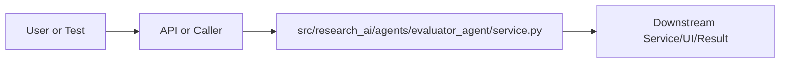

# service.py Explained

Generated educational companion for `src/research_ai/agents/evaluator_agent/service.py`. This file is intentionally detailed so a developer can understand the code, architecture role, production tradeoffs, and ML/backend concepts behind the implementation.

## File Overview

`src/research_ai/agents/evaluator_agent/service.py` is a Python module in the Evaluation layer: scores quality and evidence. It defines EvaluatorAgent and no top-level functions.

## Why This File Exists

This file isolates one responsibility in the codebase: Evaluation layer: scores quality and evidence. Separation matters because AI systems are easier to test, scale, debug, and explain when retrieval, orchestration, ML services, memory, UI, and deployment scripts have clear boundaries.

## Workflow Position

**Layer:** Evaluation layer: scores quality and evidence.

**Previous step:** caller code, an API request, a browser event, a test fixture, an import, or a startup script prepares inputs.

**Current step:** `src/research_ai/agents/evaluator_agent/service.py` performs its local responsibility.

**Next step:** downstream services, API responses, rendered UI, tests, or process execution consume the result.



## Inputs and Outputs

- **Inputs:** function arguments, class constructor dependencies, HTTP payloads, environment variables, filesystem artifacts, DOM events, or test fixtures.
- **Outputs:** return values, dictionaries, Pydantic models, rendered DOM state, API responses, logs, process startup, assertions, or side effects.
- **Serialization:** this project uses JSON for APIs/LLM planning, parquet/joblib/faiss for ML artifacts, and HTML/CSS/JS for the browser surface.

## Imports Explained

| Import | Explanation |
|---|---|
| `__future__` | Project or standard-library dependency used to import a service, type, helper, or runtime capability. Imports affect startup time, packaging, and test isolation. |
| `logging` | logging provides structured operational visibility without using print statements. |

## Global Variables and Config

| Name | Line | Why it matters |
|---|---:|---|
| `logger` | 39 | Module-level value, constant, prompt, cache, registry, or configuration point. Check mutability and startup cost. |
| `_RETRIEVAL_TOOLS` | 44 | Module-level value, constant, prompt, cache, registry, or configuration point. Check mutability and startup cost. |

## Step-by-Step Workflow

1. Load dependencies and runtime constants.
2. Accept input from the previous layer.
3. Validate, transform, route, score, render, or execute according to this file's role.
4. Return a structured output or perform a controlled side effect.
5. Let caller layers handle presentation, persistence, retries, or fallback.

## Function-by-Function Breakdown

No top-level functions are defined. Behavior is class-based, declarative, or provided through package exports.

## Class-by-Class Breakdown

### `EvaluatorAgent`

- **Line:** 47
- **Base classes:** `object`
- **Docstring:** Evaluates tool output quality and decides whether a retry is warranted.

Scoring model (0–1):
  - Retrieval hit-rate:    results present and relevant          (0.4)
  - Answer completeness:   final_answer / synthesis present      (0.3)
  - Evidence grounding:    methodology or citation signals found (0.2)
  - Error absence:         no error keys in critical tools       (0.1)

A score below RETRY_THRESHOLD triggers a retry with a wider search.

**Methods:**
- `evaluate` at line 62: Score the tool outputs and return evaluation metadata.

Returns a dict with:
  quality_score   — float in [0, 1]
  needs_retry     — bool: score below RETRY_THRESHOLD
  needs_escalation— bool: score below ESCALATE_THRESHOLD (very bad)
  breakdown       — per-dimension subscores
  retry_top_k_multiplier — how much to expand search on retry
  reason          — human-readable retry reason or "sufficient_evidence"
  tool_errors     — dict of tool→error message for any erroring tools
- `_score` at line 109: Compute a composite quality score from tool outputs.

Returns (score: float, breakdown: dict) where score ∈ [0, 1].
Each dimension's weight is documented in the module docstring.
- `_retry_reason` at line 205: Return the primary reason for triggering a retry (for logging and UI).

```python
class EvaluatorAgent:
    """Evaluates tool output quality and decides whether a retry is warranted.

    Scoring model (0–1):
      - Retrieval hit-rate:    results present and relevant          (0.4)
      - Answer completeness:   final_answer / synthesis present      (0.3)
      - Evidence grounding:    methodology or citation signals found (0.2)
      - Error absence:         no error keys in critical tools       (0.1)

    A score below RETRY_THRESHOLD triggers a retry with a wider search.
    """

    RETRY_THRESHOLD = 0.35
    ESCALATE_THRESHOLD = 0.10

    def evaluate(self, outputs: dict) -> dict:
        """Score the tool outputs and return evaluation metadata.

        Returns a dict with:
          quality_score   — float in [0, 1]
          needs_retry     — bool: score below RETRY_THRESHOLD
          needs_escalation— bool: score below ESCALATE_THRESHOLD (very bad)
          breakdown       — per-dimension subscores
          retry_top_k_multiplier — how much to expand search on retry
          reason          — human-readable retry reason or "sufficient_evidence"
          tool_errors     — dict of tool→error message for any erroring tools
        """
        score, breakdown = self._score(outputs)
        needs_retry = score < self.RETRY_THRESHOLD
        needs_escalation = score < self.ESCALATE_THRESHOLD

        result: dict = {
            "quality_score": round(score, 3),
            "needs_retry": needs_retry,
            "needs_escalation": needs_escalation,
            "breakdown": breakdown,
        }

        if needs_retry:
            # x3 expansion for catastrophic failure (single paper or less),
            # x2 for marginal failure. Both capped at max_top_k=20 in the orchestrator.
            multiplier = 3 if score < 0.15 else 2
            result["retry_top_k_multiplier"] = multiplier
            result["reason"] = self._retry_reason(outputs, breakdown)
            logger.info(
                "EvaluatorAgent: score=%.2f -> retry (x%d) reason=%s",
                score, multiplier, result["reason"],
            )
        else:
            result["reason"] = "sufficient_evidence"

        # Surface all tool errors so the orchestrator can log/expose them
        errors = {
            tool: info["error"]
            for tool, info in outputs.items()
            if isinstance(info, dict) and info.get("error")
        }
        if errors:
            result["tool_errors"] = errors

        return result

    def _score(self, outputs: dict) -> tuple[float, dict]:
        """Compute a composite quality score from tool outputs.

        Returns (score: float, breakdown: dict) where score ∈ [0, 1].
        Each dimension's weight is documented in the module docstring.
        """
        breakdown: dict = {}
        total = 0.0

        # ------------------------------------------------------------------
        # 1. Retrieval hit-rate (max 0.40)
        #
        # BUG FIX: previously only checked outputs["hybrid_search"].
        # When the planner chose smart_retrieve (RetrievalAgent path), this
        # sub-score was always 0, triggering a spurious retry on every single
        # smart_retrieve call.
        #
        # Fix: check BOTH retrieval tools; take whichever produced more results.
        # This is correct because exactly one of the two tools runs per plan.
        # ------------------------------------------------------------------
        retrieval_count = 0
        for tool_name in _RETRIEVAL_TOOLS:
            candidate = outputs.get(tool_name, {})
            if isinstance(candidate, dict) and not candidate.get("error"):
                count = candidate.get("count", 0)
                if count > retrieval_count:
                    retrieval_count = count

        # Saturates at 5 results: 0.08×5 = 0.40 (full marks).
        # Rationale: 5 papers is enough evidence for a grounded answer.
        retrieval_score = min(0.4, 0.08 * retrieval_count) if retrieval_count > 0 else 0.0
        breakdown["retrieval"] = round(retrieval_score, 3)
        total += retrieval_score

        # ------------------------------------------------------------------
        # 2. Answer completeness (max 0.30)
        #
        # Full credit if any synthesis tool produced ≥20 words.
        # Half credit for any non-empty text (e.g., very short summary).
```

This class packages state and behavior behind a service-style interface. Constructor dependencies show what the class needs; public methods show what the rest of the system can ask it to do. In production, this boundary is where caching, model loading, artifact access, and error handling must be controlled.


## Method-by-Method Deep Dive

### Class `EvaluatorAgent` Methods

#### `EvaluatorAgent.evaluate`

- **Line:** 62
- **Kind:** synchronous method
- **Arguments:** self, outputs
- **Docstring:** Score the tool outputs and return evaluation metadata.

Returns a dict with:
  quality_score   — float in [0, 1]
  needs_retry     — bool: score below RETRY_THRESHOLD
  needs_escalation— bool: score below ESCALATE_THRESHOLD (very bad)
  breakdown       — per-dimension subscores
  retry_top_k_multiplier — how much to expand search on retry
  reason          — human-readable retry reason or "sufficient_evidence"
  tool_errors     — dict of tool→error message for any erroring tools

```python
    def evaluate(self, outputs: dict) -> dict:
        """Score the tool outputs and return evaluation metadata.

        Returns a dict with:
          quality_score   — float in [0, 1]
          needs_retry     — bool: score below RETRY_THRESHOLD
          needs_escalation— bool: score below ESCALATE_THRESHOLD (very bad)
          breakdown       — per-dimension subscores
          retry_top_k_multiplier — how much to expand search on retry
          reason          — human-readable retry reason or "sufficient_evidence"
          tool_errors     — dict of tool→error message for any erroring tools
        """
        score, breakdown = self._score(outputs)
        needs_retry = score < self.RETRY_THRESHOLD
        needs_escalation = score < self.ESCALATE_THRESHOLD

        result: dict = {
            "quality_score": round(score, 3),
            "needs_retry": needs_retry,
            "needs_escalation": needs_escalation,
            "breakdown": breakdown,
        }

        if needs_retry:
            # x3 expansion for catastrophic failure (single paper or less),
            # x2 for marginal failure. Both capped at max_top_k=20 in the orchestrator.
            multiplier = 3 if score < 0.15 else 2
            result["retry_top_k_multiplier"] = multiplier
            result["reason"] = self._retry_reason(outputs, breakdown)
            logger.info(
                "EvaluatorAgent: score=%.2f -> retry (x%d) reason=%s",
                score, multiplier, result["reason"],
            )
        else:
            result["reason"] = "sufficient_evidence"

        # Surface all tool errors so the orchestrator can log/expose them
        errors = {
            tool: info["error"]
            for tool, info in outputs.items()
            if isinstance(info, dict) and info.get("error")
        }
        if errors:
            result["tool_errors"] = errors

        return result
```

This method is part of the class contract. Its inputs show what state or caller data it consumes; its body shows whether it performs pure transformation, model/artifact access, retrieval, I/O, caching, validation, or orchestration. In production review, pay attention to error handling, mutation of `self`, repeated expensive work, and whether return shapes stay stable for downstream callers.

#### `EvaluatorAgent._score`

- **Line:** 109
- **Kind:** synchronous method
- **Arguments:** self, outputs
- **Docstring:** Compute a composite quality score from tool outputs.

Returns (score: float, breakdown: dict) where score ∈ [0, 1].
Each dimension's weight is documented in the module docstring.

```python
    def _score(self, outputs: dict) -> tuple[float, dict]:
        """Compute a composite quality score from tool outputs.

        Returns (score: float, breakdown: dict) where score ∈ [0, 1].
        Each dimension's weight is documented in the module docstring.
        """
        breakdown: dict = {}
        total = 0.0

        # ------------------------------------------------------------------
        # 1. Retrieval hit-rate (max 0.40)
        #
        # BUG FIX: previously only checked outputs["hybrid_search"].
        # When the planner chose smart_retrieve (RetrievalAgent path), this
        # sub-score was always 0, triggering a spurious retry on every single
        # smart_retrieve call.
        #
        # Fix: check BOTH retrieval tools; take whichever produced more results.
        # This is correct because exactly one of the two tools runs per plan.
        # ------------------------------------------------------------------
        retrieval_count = 0
        for tool_name in _RETRIEVAL_TOOLS:
            candidate = outputs.get(tool_name, {})
            if isinstance(candidate, dict) and not candidate.get("error"):
                count = candidate.get("count", 0)
                if count > retrieval_count:
                    retrieval_count = count

        # Saturates at 5 results: 0.08×5 = 0.40 (full marks).
        # Rationale: 5 papers is enough evidence for a grounded answer.
        retrieval_score = min(0.4, 0.08 * retrieval_count) if retrieval_count > 0 else 0.0
        breakdown["retrieval"] = round(retrieval_score, 3)
        total += retrieval_score

        # ------------------------------------------------------------------
        # 2. Answer completeness (max 0.30)
        #
        # Full credit if any synthesis tool produced ≥20 words.
        # Half credit for any non-empty text (e.g., very short summary).
        # WHY: a ≥20-word answer is the minimum viable researcher response.
        # ------------------------------------------------------------------
        answer_score = 0.0
        for key in ("metadata_rag", "paper_chat", "summarize", "conversation"):
            item = outputs.get(key, {})
            if isinstance(item, dict):
                text = item.get("answer") or item.get("summary") or ""
                if isinstance(text, str) and len(text.split()) >= 20:
                    answer_score = 0.3
                    break
                elif isinstance(text, str) and text.strip():
                    answer_score = 0.15  # short but non-empty
        breakdown["answer_completeness"] = round(answer_score, 3)
        total += answer_score

        # ------------------------------------------------------------------
        # 3. Evidence grounding (max 0.20)
        #
        # Methodology signals (+0.10): specific methods/datasets were extracted,
        #   meaning the retrieval was specific enough to contain method text.
        # Citation co-occurrence (+0.05): category patterns found across papers,
        #   meaning multiple papers share a research area.
        # Classification (+0.05): the query was mapped to an arXiv category,
        #   confirming the topic is within the indexed domain.
        # ------------------------------------------------------------------
        evidence_score = 0.0
        methodology = outputs.get("methodology_extract", {})
        if isinstance(methodology, dict) and methodology.get("count", 0) > 0:
            evidence_score += 0.1
        citation = outputs.get("citation_signals", {})
        if isinstance(citation, dict) and citation.get("category_cooccurrence"):
            evidence_score += 0.05
```

This method is part of the class contract. Its inputs show what state or caller data it consumes; its body shows whether it performs pure transformation, model/artifact access, retrieval, I/O, caching, validation, or orchestration. In production review, pay attention to error handling, mutation of `self`, repeated expensive work, and whether return shapes stay stable for downstream callers.

#### `EvaluatorAgent._retry_reason`

- **Line:** 205
- **Kind:** synchronous method
- **Arguments:** outputs, breakdown
- **Docstring:** Return the primary reason for triggering a retry (for logging and UI).

```python
    def _retry_reason(outputs: dict, breakdown: dict) -> str:
        """Return the primary reason for triggering a retry (for logging and UI)."""
        if breakdown.get("retrieval", 0) == 0:
            return "no_retrieval_hits"
        if breakdown.get("answer_completeness", 0) == 0:
            return "no_answer_generated"
        if breakdown.get("evidence_grounding", 0) == 0:
            return "insufficient_evidence"
        return "low_overall_quality"
```

This method is part of the class contract. Its inputs show what state or caller data it consumes; its body shows whether it performs pure transformation, model/artifact access, retrieval, I/O, caching, validation, or orchestration. In production review, pay attention to error handling, mutation of `self`, repeated expensive work, and whether return shapes stay stable for downstream callers.

## Important Algorithms Used

- **Hybrid Retrieval**: Hybrid retrieval combines semantic vectors with lexical/keyword evidence, improving scientific search where exact terms matter.
- **RAG**: Retrieval-Augmented Generation retrieves evidence first and asks an LLM to answer from that evidence, reducing hallucination.
- **LLM Inference**: LLM inference sends prompts or chat messages to a model provider and receives generated text under token, latency, and cost constraints.
- **Transformers**: Transformers use tokenization and attention layers for language understanding/generation. They are powerful but memory and latency sensitive.
- **Classification**: Classification maps text or features to discrete labels, supporting category prediction and routing.
- **Streaming**: Streaming improves perceived latency by sending incremental output instead of waiting for full completion.
- **Sandboxing**: Sandboxing validates and constrains user code before execution, reducing security and stability risk.

## Libraries Used

| Import | Explanation |
|---|---|
| `__future__` | Project or standard-library dependency used to import a service, type, helper, or runtime capability. Imports affect startup time, packaging, and test isolation. |
| `logging` | logging provides structured operational visibility without using print statements. |

## ML Concepts Used

- **Hybrid Retrieval**: Hybrid retrieval combines semantic vectors with lexical/keyword evidence, improving scientific search where exact terms matter.
- **RAG**: Retrieval-Augmented Generation retrieves evidence first and asks an LLM to answer from that evidence, reducing hallucination.
- **LLM Inference**: LLM inference sends prompts or chat messages to a model provider and receives generated text under token, latency, and cost constraints.
- **Transformers**: Transformers use tokenization and attention layers for language understanding/generation. They are powerful but memory and latency sensitive.
- **Classification**: Classification maps text or features to discrete labels, supporting category prediction and routing.
- **Streaming**: Streaming improves perceived latency by sending incremental output instead of waiting for full completion.
- **Sandboxing**: Sandboxing validates and constrains user code before execution, reducing security and stability risk.

## Performance and Memory Notes

- Avoid eager loading of heavy ML models unless startup latency is acceptable.
- Cache expensive clients, tokenizers, vector stores, and embeddings carefully.
- Use float32 for embedding vectors because it halves memory compared with float64 and matches FAISS/neural inference expectations.
- Bound prompt length, uploaded content, result counts, and token budgets to control latency and memory.
- Watch copies of large metadata frames, embedding matrices, and file buffers.

## Scalability Notes

- In-memory state works for local demos but needs Redis/database/object storage for multi-worker cloud deployment.
- CPU/GPU inference should often be separated from the web API when traffic grows.
- Retrieval can start exact and move to approximate indexes as corpus size grows.
- Batch operations and cache repeated work to improve throughput.
- Add metrics for latency, errors, fallback frequency, retrieval hit rate, and token usage.

## Production Engineering Notes

- Keep interfaces stable because other files may import this module or depend on its response shape.
- Prefer typed/structured data over free-form strings at service boundaries.
- Log operational context without secrets or huge payloads.
- Make fallback behavior explicit so users get useful output even when LLMs or artifacts fail.
- Keep provider-specific logic behind adapters so Groq/OpenRouter/Google/Ollama can be swapped.

## Common Bugs and Failure Cases

- Missing `.env` values, model artifacts, or Ollama models can trigger degraded behavior.
- Type mismatches occur when LLM-generated tool arguments cross into strict Python code.
- Empty retrieval results must not become hallucinated answers.
- Network calls need timeouts and careful retry behavior.
- Frontend IDs/classes and API schemas are contracts; changing one side without the other breaks workflows.

## Security Considerations

- Deals with execution or subprocesses. Maintain AST validation, isolated mode, timeouts, and least privilege.

## Real Industry Usage

- This pattern appears in enterprise RAG assistants, scientific search tools, internal research copilots, and ML platform demos.
- The layered design mirrors production systems: API facade, orchestration, retrieval, evaluation, synthesis, UI, and deployment.
- Clear separation lets teams replace model providers, improve retrieval, harden security, or redesign UI independently.

## Optimization Opportunities

- Add tracing around each workflow step.
- Strengthen schema validation at boundaries.
- Persist conversation/session state outside process memory.
- Add load tests and adversarial tests for prompt injection, empty evidence, and large uploads.
- Consider approximate vector indexes, reranker models, or batching when corpus/traffic grows.

## How This Connects To Other Files

- `src/research_ai/agents/evaluator_agent/service.py` is connected through imports, startup scripts, API routes, frontend selectors, tests, or artifact paths.
- `src/research_ai/platform.py` is the backend composition root.
- `src/research_ai/api/main.py` exposes backend behavior over HTTP.
- Retrieval modules depend on artifacts under `artifacts/`.
- Frontend files depend on stable endpoint and DOM contracts.

## End-to-End Flow Summary

- A user/browser/test/startup event enters the system.
- The relevant layer validates or normalizes input.
- Retrieval, ML, orchestration, execution, or UI rendering happens.
- A structured result, visual state, or process side effect is produced.
- Fallbacks and tests keep behavior understandable when dependencies are unavailable.

## Interview Questions

1. What responsibility does this file own?
2. What inputs and outputs define its contract?
3. Which dependencies are expensive or operationally risky?
4. What breaks if this file changes shape?
5. How would you scale or test this behavior in production?

## Key Takeaways

- `src/research_ai/agents/evaluator_agent/service.py` should be understood as part of a layered AI research platform.
- Trace data flow from inputs to transformations to outputs.
- Production readiness comes from explicit contracts, bounded resources, observability, secure defaults, and graceful fallback.

## Fully Commented Source

This section repeats the original source with an explanatory comment before every line. The comments are educational only; they are not inserted into the production source file.

```python
# L0001: Starts, ends, or continues a docstring that documents module, class, or function intent.
"""Evaluator agent — assesses output quality and decides on retry/escalation.
# L0002: Blank line that visually separates logical sections and improves readability.

# L0003: Executes Python logic as part of this file's workflow; read surrounding lines for data flow and side effects.
The evaluator is the quality gate in the Plan→Execute→Evaluate→Synthesize loop.
# L0004: Executes Python logic as part of this file's workflow; read surrounding lines for data flow and side effects.
It scores tool outputs across four orthogonal dimensions and triggers a wider
# L0005: Executes Python logic as part of this file's workflow; read surrounding lines for data flow and side effects.
search retry when the score falls below RETRY_THRESHOLD.
# L0006: Blank line that visually separates logical sections and improves readability.

# L0007: Executes Python logic as part of this file's workflow; read surrounding lines for data flow and side effects.
SCORING MODEL (weights sum to 1.0):
# L0008: Executes Python logic as part of this file's workflow; read surrounding lines for data flow and side effects.
  1. Retrieval hit-rate (0.40) — are there actual paper results?
# L0009: Executes Python logic as part of this file's workflow; read surrounding lines for data flow and side effects.
     Saturates at 5 results (0.08 × count, capped at 0.40).
# L0010: Executes Python logic as part of this file's workflow; read surrounding lines for data flow and side effects.
     WHY 0.40: retrieval quality is the single biggest predictor of answer quality
# L0011: Executes Python logic as part of this file's workflow; read surrounding lines for data flow and side effects.
     in a RAG system. No evidence → no grounded answer → always retry.
# L0012: Blank line that visually separates logical sections and improves readability.

# L0013: Executes Python logic as part of this file's workflow; read surrounding lines for data flow and side effects.
  2. Answer completeness (0.30) — does any tool produce a substantive answer?
# L0014: Executes Python logic as part of this file's workflow; read surrounding lines for data flow and side effects.
     Full credit (0.30) if ≥20 words; half credit (0.15) if any text at all.
# L0015: Executes Python logic as part of this file's workflow; read surrounding lines for data flow and side effects.
     WHY 0.30: a short or missing answer is the second-most common failure mode.
# L0016: Blank line that visually separates logical sections and improves readability.

# L0017: Executes Python logic as part of this file's workflow; read surrounding lines for data flow and side effects.
  3. Evidence grounding (0.20) — are there methodology signals, citation patterns,
# L0018: Executes Python logic as part of this file's workflow; read surrounding lines for data flow and side effects.
     or a confirmed classification?
# L0019: Executes Python logic as part of this file's workflow; read surrounding lines for data flow and side effects.
     WHY 0.20: rewards depth of evidence, not just raw retrieval.
# L0020: Blank line that visually separates logical sections and improves readability.

# L0021: Executes Python logic as part of this file's workflow; read surrounding lines for data flow and side effects.
  4. Error absence (0.10) — did critical tools run without errors?
# L0022: Executes Python logic as part of this file's workflow; read surrounding lines for data flow and side effects.
     WHY 0.10: an error in a critical tool is a signal to retry, but not as
# L0023: Executes Python logic as part of this file's workflow; read surrounding lines for data flow and side effects.
     serious as zero retrieval; a failed classify still leaves hybrid_search.
# L0024: Blank line that visually separates logical sections and improves readability.

# L0025: Assigns or updates a value used later in the workflow; check mutability and data shape.
RETRY_THRESHOLD = 0.35: at this point the retrieval sub-score alone contributes
# L0026: Executes Python logic as part of this file's workflow; read surrounding lines for data flow and side effects.
0 (no results) or at most 0.08 (one paper), suggesting the first pass missed
# L0027: Executes Python logic as part of this file's workflow; read surrounding lines for data flow and side effects.
the corpus almost entirely. A wider top_k search is warranted.
# L0028: Blank line that visually separates logical sections and improves readability.

# L0029: Executes Python logic as part of this file's workflow; read surrounding lines for data flow and side effects.
BUG FIX (v3.1.1): the original code only checked outputs["hybrid_search"] for
# L0030: Executes Python logic as part of this file's workflow; read surrounding lines for data flow and side effects.
retrieval quality. When the planner chose smart_retrieve instead of hybrid_search
# L0031: Executes Python logic as part of this file's workflow; read surrounding lines for data flow and side effects.
(e.g., for citation-aware or short queries), the retrieval sub-score was always
# L0032: Executes Python logic as part of this file's workflow; read surrounding lines for data flow and side effects.
0, falsely triggering a retry every time. The fix checks BOTH retrieval tools
# L0033: Executes Python logic as part of this file's workflow; read surrounding lines for data flow and side effects.
and takes the better score.
# L0034: Starts, ends, or continues a docstring that documents module, class, or function intent.
"""
# L0035: Enables future Python behavior so annotations/import semantics stay modern and predictable.
from __future__ import annotations
# L0036: Blank line that visually separates logical sections and improves readability.

# L0037: Imports a dependency, type, or project module needed by later code in this file.
import logging
# L0038: Blank line that visually separates logical sections and improves readability.

# L0039: Assigns or updates a value used later in the workflow; check mutability and data shape.
logger = logging.getLogger(__name__)
# L0040: Blank line that visually separates logical sections and improves readability.

# L0041: Developer comment explaining intent, caveat, section boundary, or operational reasoning.
# Both tools that perform retrieval — the evaluator must consider either one.
# L0042: Developer comment explaining intent, caveat, section boundary, or operational reasoning.
# smart_retrieve is the RetrievalAgent wrapper around HybridSearchService;
# L0043: Developer comment explaining intent, caveat, section boundary, or operational reasoning.
# it returns results in the same {"results": [...], "count": N} structure.
# L0044: Assigns or updates a value used later in the workflow; check mutability and data shape.
_RETRIEVAL_TOOLS = ("hybrid_search", "smart_retrieve")
# L0045: Blank line that visually separates logical sections and improves readability.

# L0046: Blank line that visually separates logical sections and improves readability.

# L0047: Defines a class that groups related state and behavior behind a reusable interface.
class EvaluatorAgent:
# L0048: Starts, ends, or continues a docstring that documents module, class, or function intent.
    """Evaluates tool output quality and decides whether a retry is warranted.
# L0049: Blank line that visually separates logical sections and improves readability.

# L0050: Executes Python logic as part of this file's workflow; read surrounding lines for data flow and side effects.
    Scoring model (0–1):
# L0051: Executes Python logic as part of this file's workflow; read surrounding lines for data flow and side effects.
      - Retrieval hit-rate:    results present and relevant          (0.4)
# L0052: Executes Python logic as part of this file's workflow; read surrounding lines for data flow and side effects.
      - Answer completeness:   final_answer / synthesis present      (0.3)
# L0053: Executes Python logic as part of this file's workflow; read surrounding lines for data flow and side effects.
      - Evidence grounding:    methodology or citation signals found (0.2)
# L0054: Executes Python logic as part of this file's workflow; read surrounding lines for data flow and side effects.
      - Error absence:         no error keys in critical tools       (0.1)
# L0055: Blank line that visually separates logical sections and improves readability.

# L0056: Executes Python logic as part of this file's workflow; read surrounding lines for data flow and side effects.
    A score below RETRY_THRESHOLD triggers a retry with a wider search.
# L0057: Starts, ends, or continues a docstring that documents module, class, or function intent.
    """
# L0058: Blank line that visually separates logical sections and improves readability.

# L0059: Assigns or updates a value used later in the workflow; check mutability and data shape.
    RETRY_THRESHOLD = 0.35
# L0060: Assigns or updates a value used later in the workflow; check mutability and data shape.
    ESCALATE_THRESHOLD = 0.10
# L0061: Blank line that visually separates logical sections and improves readability.

# L0062: Defines a function or method; parameters are the input contract and the body implements the workflow.
    def evaluate(self, outputs: dict) -> dict:
# L0063: Starts, ends, or continues a docstring that documents module, class, or function intent.
        """Score the tool outputs and return evaluation metadata.
# L0064: Blank line that visually separates logical sections and improves readability.

# L0065: Executes Python logic as part of this file's workflow; read surrounding lines for data flow and side effects.
        Returns a dict with:
# L0066: Executes Python logic as part of this file's workflow; read surrounding lines for data flow and side effects.
          quality_score   — float in [0, 1]
# L0067: Executes Python logic as part of this file's workflow; read surrounding lines for data flow and side effects.
          needs_retry     — bool: score below RETRY_THRESHOLD
# L0068: Executes Python logic as part of this file's workflow; read surrounding lines for data flow and side effects.
          needs_escalation— bool: score below ESCALATE_THRESHOLD (very bad)
# L0069: Executes Python logic as part of this file's workflow; read surrounding lines for data flow and side effects.
          breakdown       — per-dimension subscores
# L0070: Executes Python logic as part of this file's workflow; read surrounding lines for data flow and side effects.
          retry_top_k_multiplier — how much to expand search on retry
# L0071: Executes Python logic as part of this file's workflow; read surrounding lines for data flow and side effects.
          reason          — human-readable retry reason or "sufficient_evidence"
# L0072: Executes Python logic as part of this file's workflow; read surrounding lines for data flow and side effects.
          tool_errors     — dict of tool→error message for any erroring tools
# L0073: Starts, ends, or continues a docstring that documents module, class, or function intent.
        """
# L0074: Assigns or updates a value used later in the workflow; check mutability and data shape.
        score, breakdown = self._score(outputs)
# L0075: Assigns or updates a value used later in the workflow; check mutability and data shape.
        needs_retry = score < self.RETRY_THRESHOLD
# L0076: Assigns or updates a value used later in the workflow; check mutability and data shape.
        needs_escalation = score < self.ESCALATE_THRESHOLD
# L0077: Blank line that visually separates logical sections and improves readability.

# L0078: Assigns or updates a value used later in the workflow; check mutability and data shape.
        result: dict = {
# L0079: Executes Python logic as part of this file's workflow; read surrounding lines for data flow and side effects.
            "quality_score": round(score, 3),
# L0080: Executes Python logic as part of this file's workflow; read surrounding lines for data flow and side effects.
            "needs_retry": needs_retry,
# L0081: Executes Python logic as part of this file's workflow; read surrounding lines for data flow and side effects.
            "needs_escalation": needs_escalation,
# L0082: Executes Python logic as part of this file's workflow; read surrounding lines for data flow and side effects.
            "breakdown": breakdown,
# L0083: Executes Python logic as part of this file's workflow; read surrounding lines for data flow and side effects.
        }
# L0084: Blank line that visually separates logical sections and improves readability.

# L0085: Branches execution based on a condition, usually for validation, fallback, or mode-specific behavior.
        if needs_retry:
# L0086: Developer comment explaining intent, caveat, section boundary, or operational reasoning.
            # x3 expansion for catastrophic failure (single paper or less),
# L0087: Developer comment explaining intent, caveat, section boundary, or operational reasoning.
            # x2 for marginal failure. Both capped at max_top_k=20 in the orchestrator.
# L0088: Assigns or updates a value used later in the workflow; check mutability and data shape.
            multiplier = 3 if score < 0.15 else 2
# L0089: Assigns or updates a value used later in the workflow; check mutability and data shape.
            result["retry_top_k_multiplier"] = multiplier
# L0090: Assigns or updates a value used later in the workflow; check mutability and data shape.
            result["reason"] = self._retry_reason(outputs, breakdown)
# L0091: Emits structured operational information for debugging, monitoring, or failure diagnosis.
            logger.info(
# L0092: Assigns or updates a value used later in the workflow; check mutability and data shape.
                "EvaluatorAgent: score=%.2f -> retry (x%d) reason=%s",
# L0093: Executes Python logic as part of this file's workflow; read surrounding lines for data flow and side effects.
                score, multiplier, result["reason"],
# L0094: Executes Python logic as part of this file's workflow; read surrounding lines for data flow and side effects.
            )
# L0095: Continues conditional control flow for alternate cases or default fallback behavior.
        else:
# L0096: Assigns or updates a value used later in the workflow; check mutability and data shape.
            result["reason"] = "sufficient_evidence"
# L0097: Blank line that visually separates logical sections and improves readability.

# L0098: Developer comment explaining intent, caveat, section boundary, or operational reasoning.
        # Surface all tool errors so the orchestrator can log/expose them
# L0099: Assigns or updates a value used later in the workflow; check mutability and data shape.
        errors = {
# L0100: Executes Python logic as part of this file's workflow; read surrounding lines for data flow and side effects.
            tool: info["error"]
# L0101: Iterates over data, retry attempts, files, results, or workflow steps.
            for tool, info in outputs.items()
# L0102: Branches execution based on a condition, usually for validation, fallback, or mode-specific behavior.
            if isinstance(info, dict) and info.get("error")
# L0103: Executes Python logic as part of this file's workflow; read surrounding lines for data flow and side effects.
        }
# L0104: Branches execution based on a condition, usually for validation, fallback, or mode-specific behavior.
        if errors:
# L0105: Assigns or updates a value used later in the workflow; check mutability and data shape.
            result["tool_errors"] = errors
# L0106: Blank line that visually separates logical sections and improves readability.

# L0107: Returns the computed result to the caller; this shape becomes part of the downstream contract.
        return result
# L0108: Blank line that visually separates logical sections and improves readability.

# L0109: Defines a function or method; parameters are the input contract and the body implements the workflow.
    def _score(self, outputs: dict) -> tuple[float, dict]:
# L0110: Starts, ends, or continues a docstring that documents module, class, or function intent.
        """Compute a composite quality score from tool outputs.
# L0111: Blank line that visually separates logical sections and improves readability.

# L0112: Executes Python logic as part of this file's workflow; read surrounding lines for data flow and side effects.
        Returns (score: float, breakdown: dict) where score ∈ [0, 1].
# L0113: Executes Python logic as part of this file's workflow; read surrounding lines for data flow and side effects.
        Each dimension's weight is documented in the module docstring.
# L0114: Starts, ends, or continues a docstring that documents module, class, or function intent.
        """
# L0115: Assigns or updates a value used later in the workflow; check mutability and data shape.
        breakdown: dict = {}
# L0116: Assigns or updates a value used later in the workflow; check mutability and data shape.
        total = 0.0
# L0117: Blank line that visually separates logical sections and improves readability.

# L0118: Developer comment explaining intent, caveat, section boundary, or operational reasoning.
        # ------------------------------------------------------------------
# L0119: Developer comment explaining intent, caveat, section boundary, or operational reasoning.
        # 1. Retrieval hit-rate (max 0.40)
# L0120: Developer comment explaining intent, caveat, section boundary, or operational reasoning.
        #
# L0121: Developer comment explaining intent, caveat, section boundary, or operational reasoning.
        # BUG FIX: previously only checked outputs["hybrid_search"].
# L0122: Developer comment explaining intent, caveat, section boundary, or operational reasoning.
        # When the planner chose smart_retrieve (RetrievalAgent path), this
# L0123: Developer comment explaining intent, caveat, section boundary, or operational reasoning.
        # sub-score was always 0, triggering a spurious retry on every single
# L0124: Developer comment explaining intent, caveat, section boundary, or operational reasoning.
        # smart_retrieve call.
# L0125: Developer comment explaining intent, caveat, section boundary, or operational reasoning.
        #
# L0126: Developer comment explaining intent, caveat, section boundary, or operational reasoning.
        # Fix: check BOTH retrieval tools; take whichever produced more results.
# L0127: Developer comment explaining intent, caveat, section boundary, or operational reasoning.
        # This is correct because exactly one of the two tools runs per plan.
# L0128: Developer comment explaining intent, caveat, section boundary, or operational reasoning.
        # ------------------------------------------------------------------
# L0129: Assigns or updates a value used later in the workflow; check mutability and data shape.
        retrieval_count = 0
# L0130: Iterates over data, retry attempts, files, results, or workflow steps.
        for tool_name in _RETRIEVAL_TOOLS:
# L0131: Assigns or updates a value used later in the workflow; check mutability and data shape.
            candidate = outputs.get(tool_name, {})
# L0132: Branches execution based on a condition, usually for validation, fallback, or mode-specific behavior.
            if isinstance(candidate, dict) and not candidate.get("error"):
# L0133: Assigns or updates a value used later in the workflow; check mutability and data shape.
                count = candidate.get("count", 0)
# L0134: Branches execution based on a condition, usually for validation, fallback, or mode-specific behavior.
                if count > retrieval_count:
# L0135: Assigns or updates a value used later in the workflow; check mutability and data shape.
                    retrieval_count = count
# L0136: Blank line that visually separates logical sections and improves readability.

# L0137: Developer comment explaining intent, caveat, section boundary, or operational reasoning.
        # Saturates at 5 results: 0.08×5 = 0.40 (full marks).
# L0138: Developer comment explaining intent, caveat, section boundary, or operational reasoning.
        # Rationale: 5 papers is enough evidence for a grounded answer.
# L0139: Assigns or updates a value used later in the workflow; check mutability and data shape.
        retrieval_score = min(0.4, 0.08 * retrieval_count) if retrieval_count > 0 else 0.0
# L0140: Assigns or updates a value used later in the workflow; check mutability and data shape.
        breakdown["retrieval"] = round(retrieval_score, 3)
# L0141: Assigns or updates a value used later in the workflow; check mutability and data shape.
        total += retrieval_score
# L0142: Blank line that visually separates logical sections and improves readability.

# L0143: Developer comment explaining intent, caveat, section boundary, or operational reasoning.
        # ------------------------------------------------------------------
# L0144: Developer comment explaining intent, caveat, section boundary, or operational reasoning.
        # 2. Answer completeness (max 0.30)
# L0145: Developer comment explaining intent, caveat, section boundary, or operational reasoning.
        #
# L0146: Developer comment explaining intent, caveat, section boundary, or operational reasoning.
        # Full credit if any synthesis tool produced ≥20 words.
# L0147: Developer comment explaining intent, caveat, section boundary, or operational reasoning.
        # Half credit for any non-empty text (e.g., very short summary).
# L0148: Developer comment explaining intent, caveat, section boundary, or operational reasoning.
        # WHY: a ≥20-word answer is the minimum viable researcher response.
# L0149: Developer comment explaining intent, caveat, section boundary, or operational reasoning.
        # ------------------------------------------------------------------
# L0150: Assigns or updates a value used later in the workflow; check mutability and data shape.
        answer_score = 0.0
# L0151: Iterates over data, retry attempts, files, results, or workflow steps.
        for key in ("metadata_rag", "paper_chat", "summarize", "conversation"):
# L0152: Assigns or updates a value used later in the workflow; check mutability and data shape.
            item = outputs.get(key, {})
# L0153: Branches execution based on a condition, usually for validation, fallback, or mode-specific behavior.
            if isinstance(item, dict):
# L0154: Assigns or updates a value used later in the workflow; check mutability and data shape.
                text = item.get("answer") or item.get("summary") or ""
# L0155: Branches execution based on a condition, usually for validation, fallback, or mode-specific behavior.
                if isinstance(text, str) and len(text.split()) >= 20:
# L0156: Assigns or updates a value used later in the workflow; check mutability and data shape.
                    answer_score = 0.3
# L0157: Executes Python logic as part of this file's workflow; read surrounding lines for data flow and side effects.
                    break
# L0158: Continues conditional control flow for alternate cases or default fallback behavior.
                elif isinstance(text, str) and text.strip():
# L0159: Assigns or updates a value used later in the workflow; check mutability and data shape.
                    answer_score = 0.15  # short but non-empty
# L0160: Assigns or updates a value used later in the workflow; check mutability and data shape.
        breakdown["answer_completeness"] = round(answer_score, 3)
# L0161: Assigns or updates a value used later in the workflow; check mutability and data shape.
        total += answer_score
# L0162: Blank line that visually separates logical sections and improves readability.

# L0163: Developer comment explaining intent, caveat, section boundary, or operational reasoning.
        # ------------------------------------------------------------------
# L0164: Developer comment explaining intent, caveat, section boundary, or operational reasoning.
        # 3. Evidence grounding (max 0.20)
# L0165: Developer comment explaining intent, caveat, section boundary, or operational reasoning.
        #
# L0166: Developer comment explaining intent, caveat, section boundary, or operational reasoning.
        # Methodology signals (+0.10): specific methods/datasets were extracted,
# L0167: Developer comment explaining intent, caveat, section boundary, or operational reasoning.
        #   meaning the retrieval was specific enough to contain method text.
# L0168: Developer comment explaining intent, caveat, section boundary, or operational reasoning.
        # Citation co-occurrence (+0.05): category patterns found across papers,
# L0169: Developer comment explaining intent, caveat, section boundary, or operational reasoning.
        #   meaning multiple papers share a research area.
# L0170: Developer comment explaining intent, caveat, section boundary, or operational reasoning.
        # Classification (+0.05): the query was mapped to an arXiv category,
# L0171: Developer comment explaining intent, caveat, section boundary, or operational reasoning.
        #   confirming the topic is within the indexed domain.
# L0172: Developer comment explaining intent, caveat, section boundary, or operational reasoning.
        # ------------------------------------------------------------------
# L0173: Assigns or updates a value used later in the workflow; check mutability and data shape.
        evidence_score = 0.0
# L0174: Assigns or updates a value used later in the workflow; check mutability and data shape.
        methodology = outputs.get("methodology_extract", {})
# L0175: Branches execution based on a condition, usually for validation, fallback, or mode-specific behavior.
        if isinstance(methodology, dict) and methodology.get("count", 0) > 0:
# L0176: Assigns or updates a value used later in the workflow; check mutability and data shape.
            evidence_score += 0.1
# L0177: Assigns or updates a value used later in the workflow; check mutability and data shape.
        citation = outputs.get("citation_signals", {})
# L0178: Branches execution based on a condition, usually for validation, fallback, or mode-specific behavior.
        if isinstance(citation, dict) and citation.get("category_cooccurrence"):
# L0179: Assigns or updates a value used later in the workflow; check mutability and data shape.
            evidence_score += 0.05
# L0180: Assigns or updates a value used later in the workflow; check mutability and data shape.
        classify = outputs.get("classify_query", {})
# L0181: Branches execution based on a condition, usually for validation, fallback, or mode-specific behavior.
        if isinstance(classify, dict) and classify.get("predicted_category"):
# L0182: Assigns or updates a value used later in the workflow; check mutability and data shape.
            evidence_score += 0.05
# L0183: Assigns or updates a value used later in the workflow; check mutability and data shape.
        breakdown["evidence_grounding"] = round(evidence_score, 3)
# L0184: Assigns or updates a value used later in the workflow; check mutability and data shape.
        total += evidence_score
# L0185: Blank line that visually separates logical sections and improves readability.

# L0186: Developer comment explaining intent, caveat, section boundary, or operational reasoning.
        # ------------------------------------------------------------------
# L0187: Developer comment explaining intent, caveat, section boundary, or operational reasoning.
        # 4. Error absence (max 0.10)
# L0188: Developer comment explaining intent, caveat, section boundary, or operational reasoning.
        #
# L0189: Developer comment explaining intent, caveat, section boundary, or operational reasoning.
        # Only critical tools are penalised: hybrid_search, smart_retrieve,
# L0190: Developer comment explaining intent, caveat, section boundary, or operational reasoning.
        # metadata_rag, classify_query. Optional tools (methodology, citation)
# L0191: Developer comment explaining intent, caveat, section boundary, or operational reasoning.
        # can fail without triggering a retry.
# L0192: Developer comment explaining intent, caveat, section boundary, or operational reasoning.
        # ------------------------------------------------------------------
# L0193: Assigns or updates a value used later in the workflow; check mutability and data shape.
        critical_tools = ("hybrid_search", "smart_retrieve", "metadata_rag", "classify_query")
# L0194: Assigns or updates a value used later in the workflow; check mutability and data shape.
        error_free = all(
# L0195: Executes Python logic as part of this file's workflow; read surrounding lines for data flow and side effects.
            not isinstance(outputs.get(t, {}), dict) or not outputs.get(t, {}).get("error")
# L0196: Iterates over data, retry attempts, files, results, or workflow steps.
            for t in critical_tools
# L0197: Executes Python logic as part of this file's workflow; read surrounding lines for data flow and side effects.
        )
# L0198: Assigns or updates a value used later in the workflow; check mutability and data shape.
        error_score = 0.1 if error_free else 0.0
# L0199: Assigns or updates a value used later in the workflow; check mutability and data shape.
        breakdown["error_absence"] = error_score
# L0200: Assigns or updates a value used later in the workflow; check mutability and data shape.
        total += error_score
# L0201: Blank line that visually separates logical sections and improves readability.

# L0202: Returns the computed result to the caller; this shape becomes part of the downstream contract.
        return min(total, 1.0), breakdown
# L0203: Blank line that visually separates logical sections and improves readability.

# L0204: Decorator that modifies the function/class below, commonly for routing, dataclasses, caching, or properties.
    @staticmethod
# L0205: Defines a function or method; parameters are the input contract and the body implements the workflow.
    def _retry_reason(outputs: dict, breakdown: dict) -> str:
# L0206: Starts, ends, or continues a docstring that documents module, class, or function intent.
        """Return the primary reason for triggering a retry (for logging and UI)."""
# L0207: Branches execution based on a condition, usually for validation, fallback, or mode-specific behavior.
        if breakdown.get("retrieval", 0) == 0:
# L0208: Returns the computed result to the caller; this shape becomes part of the downstream contract.
            return "no_retrieval_hits"
# L0209: Branches execution based on a condition, usually for validation, fallback, or mode-specific behavior.
        if breakdown.get("answer_completeness", 0) == 0:
# L0210: Returns the computed result to the caller; this shape becomes part of the downstream contract.
            return "no_answer_generated"
# L0211: Branches execution based on a condition, usually for validation, fallback, or mode-specific behavior.
        if breakdown.get("evidence_grounding", 0) == 0:
# L0212: Returns the computed result to the caller; this shape becomes part of the downstream contract.
            return "insufficient_evidence"
# L0213: Returns the computed result to the caller; this shape becomes part of the downstream contract.
        return "low_overall_quality"
```

## Source Walkthrough

The complete source is included because the file is short enough to study directly.

```python
"""Evaluator agent — assesses output quality and decides on retry/escalation.

The evaluator is the quality gate in the Plan→Execute→Evaluate→Synthesize loop.
It scores tool outputs across four orthogonal dimensions and triggers a wider
search retry when the score falls below RETRY_THRESHOLD.

SCORING MODEL (weights sum to 1.0):
  1. Retrieval hit-rate (0.40) — are there actual paper results?
     Saturates at 5 results (0.08 × count, capped at 0.40).
     WHY 0.40: retrieval quality is the single biggest predictor of answer quality
     in a RAG system. No evidence → no grounded answer → always retry.

  2. Answer completeness (0.30) — does any tool produce a substantive answer?
     Full credit (0.30) if ≥20 words; half credit (0.15) if any text at all.
     WHY 0.30: a short or missing answer is the second-most common failure mode.

  3. Evidence grounding (0.20) — are there methodology signals, citation patterns,
     or a confirmed classification?
     WHY 0.20: rewards depth of evidence, not just raw retrieval.

  4. Error absence (0.10) — did critical tools run without errors?
     WHY 0.10: an error in a critical tool is a signal to retry, but not as
     serious as zero retrieval; a failed classify still leaves hybrid_search.

RETRY_THRESHOLD = 0.35: at this point the retrieval sub-score alone contributes
0 (no results) or at most 0.08 (one paper), suggesting the first pass missed
the corpus almost entirely. A wider top_k search is warranted.

BUG FIX (v3.1.1): the original code only checked outputs["hybrid_search"] for
retrieval quality. When the planner chose smart_retrieve instead of hybrid_search
(e.g., for citation-aware or short queries), the retrieval sub-score was always
0, falsely triggering a retry every time. The fix checks BOTH retrieval tools
and takes the better score.
"""
from __future__ import annotations

import logging

logger = logging.getLogger(__name__)

# Both tools that perform retrieval — the evaluator must consider either one.
# smart_retrieve is the RetrievalAgent wrapper around HybridSearchService;
# it returns results in the same {"results": [...], "count": N} structure.
_RETRIEVAL_TOOLS = ("hybrid_search", "smart_retrieve")


class EvaluatorAgent:
    """Evaluates tool output quality and decides whether a retry is warranted.

    Scoring model (0–1):
      - Retrieval hit-rate:    results present and relevant          (0.4)
      - Answer completeness:   final_answer / synthesis present      (0.3)
      - Evidence grounding:    methodology or citation signals found (0.2)
      - Error absence:         no error keys in critical tools       (0.1)

    A score below RETRY_THRESHOLD triggers a retry with a wider search.
    """

    RETRY_THRESHOLD = 0.35
    ESCALATE_THRESHOLD = 0.10

    def evaluate(self, outputs: dict) -> dict:
        """Score the tool outputs and return evaluation metadata.

        Returns a dict with:
          quality_score   — float in [0, 1]
          needs_retry     — bool: score below RETRY_THRESHOLD
          needs_escalation— bool: score below ESCALATE_THRESHOLD (very bad)
          breakdown       — per-dimension subscores
          retry_top_k_multiplier — how much to expand search on retry
          reason          — human-readable retry reason or "sufficient_evidence"
          tool_errors     — dict of tool→error message for any erroring tools
        """
        score, breakdown = self._score(outputs)
        needs_retry = score < self.RETRY_THRESHOLD
        needs_escalation = score < self.ESCALATE_THRESHOLD

        result: dict = {
            "quality_score": round(score, 3),
            "needs_retry": needs_retry,
            "needs_escalation": needs_escalation,
            "breakdown": breakdown,
        }

        if needs_retry:
            # x3 expansion for catastrophic failure (single paper or less),
            # x2 for marginal failure. Both capped at max_top_k=20 in the orchestrator.
            multiplier = 3 if score < 0.15 else 2
            result["retry_top_k_multiplier"] = multiplier
            result["reason"] = self._retry_reason(outputs, breakdown)
            logger.info(
                "EvaluatorAgent: score=%.2f -> retry (x%d) reason=%s",
                score, multiplier, result["reason"],
            )
        else:
            result["reason"] = "sufficient_evidence"

        # Surface all tool errors so the orchestrator can log/expose them
        errors = {
            tool: info["error"]
            for tool, info in outputs.items()
            if isinstance(info, dict) and info.get("error")
        }
        if errors:
            result["tool_errors"] = errors

        return result

    def _score(self, outputs: dict) -> tuple[float, dict]:
        """Compute a composite quality score from tool outputs.

        Returns (score: float, breakdown: dict) where score ∈ [0, 1].
        Each dimension's weight is documented in the module docstring.
        """
        breakdown: dict = {}
        total = 0.0

        # ------------------------------------------------------------------
        # 1. Retrieval hit-rate (max 0.40)
        #
        # BUG FIX: previously only checked outputs["hybrid_search"].
        # When the planner chose smart_retrieve (RetrievalAgent path), this
        # sub-score was always 0, triggering a spurious retry on every single
        # smart_retrieve call.
        #
        # Fix: check BOTH retrieval tools; take whichever produced more results.
        # This is correct because exactly one of the two tools runs per plan.
        # ------------------------------------------------------------------
        retrieval_count = 0
        for tool_name in _RETRIEVAL_TOOLS:
            candidate = outputs.get(tool_name, {})
            if isinstance(candidate, dict) and not candidate.get("error"):
                count = candidate.get("count", 0)
                if count > retrieval_count:
                    retrieval_count = count

        # Saturates at 5 results: 0.08×5 = 0.40 (full marks).
        # Rationale: 5 papers is enough evidence for a grounded answer.
        retrieval_score = min(0.4, 0.08 * retrieval_count) if retrieval_count > 0 else 0.0
        breakdown["retrieval"] = round(retrieval_score, 3)
        total += retrieval_score

        # ------------------------------------------------------------------
        # 2. Answer completeness (max 0.30)
        #
        # Full credit if any synthesis tool produced ≥20 words.
        # Half credit for any non-empty text (e.g., very short summary).
        # WHY: a ≥20-word answer is the minimum viable researcher response.
        # ------------------------------------------------------------------
        answer_score = 0.0
        for key in ("metadata_rag", "paper_chat", "summarize", "conversation"):
            item = outputs.get(key, {})
            if isinstance(item, dict):
                text = item.get("answer") or item.get("summary") or ""
                if isinstance(text, str) and len(text.split()) >= 20:
                    answer_score = 0.3
                    break
                elif isinstance(text, str) and text.strip():
                    answer_score = 0.15  # short but non-empty
        breakdown["answer_completeness"] = round(answer_score, 3)
        total += answer_score

        # ------------------------------------------------------------------
        # 3. Evidence grounding (max 0.20)
        #
        # Methodology signals (+0.10): specific methods/datasets were extracted,
        #   meaning the retrieval was specific enough to contain method text.
        # Citation co-occurrence (+0.05): category patterns found across papers,
        #   meaning multiple papers share a research area.
        # Classification (+0.05): the query was mapped to an arXiv category,
        #   confirming the topic is within the indexed domain.
        # ------------------------------------------------------------------
        evidence_score = 0.0
        methodology = outputs.get("methodology_extract", {})
        if isinstance(methodology, dict) and methodology.get("count", 0) > 0:
            evidence_score += 0.1
        citation = outputs.get("citation_signals", {})
        if isinstance(citation, dict) and citation.get("category_cooccurrence"):
            evidence_score += 0.05
        classify = outputs.get("classify_query", {})
        if isinstance(classify, dict) and classify.get("predicted_category"):
            evidence_score += 0.05
        breakdown["evidence_grounding"] = round(evidence_score, 3)
        total += evidence_score

        # ------------------------------------------------------------------
        # 4. Error absence (max 0.10)
        #
        # Only critical tools are penalised: hybrid_search, smart_retrieve,
        # metadata_rag, classify_query. Optional tools (methodology, citation)
        # can fail without triggering a retry.
        # ------------------------------------------------------------------
        critical_tools = ("hybrid_search", "smart_retrieve", "metadata_rag", "classify_query")
        error_free = all(
            not isinstance(outputs.get(t, {}), dict) or not outputs.get(t, {}).get("error")
            for t in critical_tools
        )
        error_score = 0.1 if error_free else 0.0
        breakdown["error_absence"] = error_score
        total += error_score

        return min(total, 1.0), breakdown

    @staticmethod
    def _retry_reason(outputs: dict, breakdown: dict) -> str:
        """Return the primary reason for triggering a retry (for logging and UI)."""
        if breakdown.get("retrieval", 0) == 0:
            return "no_retrieval_hits"
        if breakdown.get("answer_completeness", 0) == 0:
            return "no_answer_generated"
        if breakdown.get("evidence_grounding", 0) == 0:
            return "insufficient_evidence"
        return "low_overall_quality"
```
