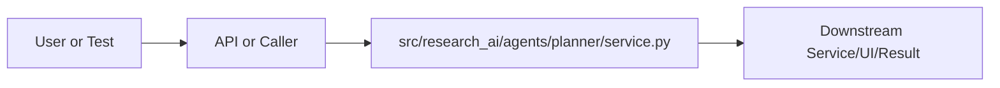

# service.py Explained

Generated educational companion for `src/research_ai/agents/planner/service.py`. This file is intentionally detailed so a developer can understand the code, architecture role, production tradeoffs, and ML/backend concepts behind the implementation.

## File Overview

`src/research_ai/agents/planner/service.py` is a Python module in the Planner layer: converts user intent into tool calls. It defines ToolCall, ResearchPlan, PlannerAgent and no top-level functions.

## Why This File Exists

This file isolates one responsibility in the codebase: Planner layer: converts user intent into tool calls. Separation matters because AI systems are easier to test, scale, debug, and explain when retrieval, orchestration, ML services, memory, UI, and deployment scripts have clear boundaries.

## Workflow Position

**Layer:** Planner layer: converts user intent into tool calls.

**Previous step:** caller code, an API request, a browser event, a test fixture, an import, or a startup script prepares inputs.

**Current step:** `src/research_ai/agents/planner/service.py` performs its local responsibility.

**Next step:** downstream services, API responses, rendered UI, tests, or process execution consume the result.



## Inputs and Outputs

- **Inputs:** function arguments, class constructor dependencies, HTTP payloads, environment variables, filesystem artifacts, DOM events, or test fixtures.
- **Outputs:** return values, dictionaries, Pydantic models, rendered DOM state, API responses, logs, process startup, assertions, or side effects.
- **Serialization:** this project uses JSON for APIs/LLM planning, parquet/joblib/faiss for ML artifacts, and HTML/CSS/JS for the browser surface.

## Imports Explained

| Import | Explanation |
|---|---|
| `__future__` | Project or standard-library dependency used to import a service, type, helper, or runtime capability. Imports affect startup time, packaging, and test isolation. |
| `dataclasses` | dataclasses reduce boilerplate for typed configuration/result containers. |
| `json` | json serializes/deserializes API payloads, LLM planning output, and artifact metadata. |
| `logging` | logging provides structured operational visibility without using print statements. |

## Global Variables and Config

| Name | Line | Why it matters |
|---|---:|---|
| `logger` | 14 | Module-level value, constant, prompt, cache, registry, or configuration point. Check mutability and startup cost. |
| `TOOL_CATALOG` | 38 | Module-level value, constant, prompt, cache, registry, or configuration point. Check mutability and startup cost. |
| `FEW_SHOT` | 114 | Module-level value, constant, prompt, cache, registry, or configuration point. Check mutability and startup cost. |
| `SYSTEM_PROMPT` | 192 | Module-level value, constant, prompt, cache, registry, or configuration point. Check mutability and startup cost. |
| `_OLLAMA_SYSTEM_PROMPT` | 201 | Module-level value, constant, prompt, cache, registry, or configuration point. Check mutability and startup cost. |

## Step-by-Step Workflow

1. Load dependencies and runtime constants.
2. Accept input from the previous layer.
3. Validate, transform, route, score, render, or execute according to this file's role.
4. Return a structured output or perform a controlled side effect.
5. Let caller layers handle presentation, persistence, retries, or fallback.

## Function-by-Function Breakdown

No top-level functions are defined. Behavior is class-based, declarative, or provided through package exports.

## Class-by-Class Breakdown

### `ToolCall`

- **Line:** 18
- **Base classes:** `object`
- **Docstring:** No explicit class docstring.

**Methods:**
- No methods beyond inherited behavior.

```python
class ToolCall:
    name: str
    args: dict = field(default_factory=dict)
    reason: str = ""
```

This class packages state and behavior behind a service-style interface. Constructor dependencies show what the class needs; public methods show what the rest of the system can ask it to do. In production, this boundary is where caching, model loading, artifact access, and error handling must be controlled.

### `ResearchPlan`

- **Line:** 25
- **Base classes:** `object`
- **Docstring:** No explicit class docstring.

**Methods:**
- No methods beyond inherited behavior.

```python
class ResearchPlan:
    intent: str
    query: str
    top_k: int
    calls: list[ToolCall]
    reason: str
    used_fallback: bool = False
```

This class packages state and behavior behind a service-style interface. Constructor dependencies show what the class needs; public methods show what the rest of the system can ask it to do. In production, this boundary is where caching, model loading, artifact access, and error handling must be controlled.

### `PlannerAgent`

- **Line:** 211
- **Base classes:** `object`
- **Docstring:** LLM-powered intent planner with deterministic heuristic fallback.

**Methods:**
- `__init__` at line 214: method behavior is described by its body and name
- `plan` at line 218: method behavior is described by its body and name
- `_cloud` at line 300: method behavior is described by its body and name
- `_parse_json` at line 309: method behavior is described by its body and name
- `_parse_calls` at line 321: method behavior is described by its body and name
- `_clamp` at line 332: method behavior is described by its body and name
- `_is_conversation` at line 339: method behavior is described by its body and name
- `_fallback_plan` at line 357: Deterministic heuristic planner used when cloud LLM is unavailable.

```python
class PlannerAgent:
    """LLM-powered intent planner with deterministic heuristic fallback."""

    def __init__(self, cloud_factory=None, max_top_k: int = 20) -> None:
        self.cloud_factory = cloud_factory
        self.max_top_k = max_top_k

    def plan(
        self,
        mode: str,
        query: str,
        top_k: int,
        title: str | None = None,
        abstract: str | None = None,
        text: str | None = None,
        session_id: str | None = None,
        conversation_history: str | None = None,
    ) -> ResearchPlan:
        mode_hint = (mode or "auto").strip().lower()

        # Hard-gate: conversational input never reaches the tool chain.
        # EXCEPTION: if there's conversation history, the "short greeting" might
        # actually be a follow-up ("yes", "ok", "more please") — let those through.
        if self._is_conversation(query) and not conversation_history:
            return ResearchPlan(
                intent="conversation",
                query=(query or "").strip(),
                top_k=self._clamp(top_k),
                calls=[ToolCall("conversation", {"query": (query or "").strip()})],
                reason="conversational_input",
                used_fallback=True,
            )

        # Explicit mode bypass → heuristic planner
        if mode_hint != "auto":
            return self._fallback_plan(mode_hint, query, top_k, title, abstract, text, session_id)

        # Cloud LLM planning
        cloud = self._cloud()
        if cloud is None:
            return self._fallback_plan(mode_hint, query, top_k, title, abstract, text, session_id)

        # Build the planning prompt. Conversation history is injected here so the
        # LLM planner can resolve pronouns and follow-up references automatically.
        # Example: if prior turn retrieved GNN papers, and user says "which of these
        # use attention?", the planner can reformulate the query as
        # "GNN papers with attention mechanisms" instead of treating it as standalone.
        history_block = (
            f"\nConversation history (last few turns):\n{conversation_history}\n"
            if conversation_history else ""
        )
        prompt = (
            f"User query: {query}\n"
            f"Requested mode: {mode}\n"
            f"Requested top_k: {top_k}\n"
            + (f"Title context: {title}\n" if title else "")
            + (f"Abstract context: {abstract}\n" if abstract else "")
            + (f"Text context (first 400 chars): {(text or '')[:400]}\n" if text else "")
            + (f"Session ID: {session_id}\n" if session_id else "")
            + history_block
        )

        # Local Ollama models can't handle the full 2800-token system prompt in time
        # Use a minimal prompt variant that still produces valid JSON plans
        is_ollama = getattr(cloud, "provider", "") == "ollama"
        sys = _OLLAMA_SYSTEM_PROMPT if is_ollama else SYSTEM_PROMPT
        max_tok = 200 if is_ollama else 600
        try:
            raw = cloud.generate(prompt, max_tokens=max_tok, system=sys)
            parsed = self._parse_json(raw)
            calls = self._parse_calls(parsed)
            if not calls:
                raise ValueError("LLM planner produced zero valid tool calls.")
            return ResearchPlan(
                intent=str(parsed.get("intent") or "research_analysis"),
                query=str(parsed.get("query") or query),
                top_k=self._clamp(parsed.get("top_k") or top_k),
                calls=calls,
                reason=str(parsed.get("reason") or "llm_planner"),
                used_fallback=False,
            )
        except Exception as exc:
            logger.warning("LLM planner failed (%s) — using heuristic fallback.", exc)
            return self._fallback_plan(mode_hint, query, top_k, title, abstract, text, session_id)

    # ------------------------------------------------------------------
    # Private
    # ------------------------------------------------------------------

    def _cloud(self):
        if self.cloud_factory is None:
            return None
        try:
            return self.cloud_factory()
        except Exception:
            return None

    @staticmethod
    def _parse_json(text: str) -> dict:
        payload = (text or "").strip().replace("`` `json", "").replace("`` `", "").strip()
        start = payload.find("{")
```

This class packages state and behavior behind a service-style interface. Constructor dependencies show what the class needs; public methods show what the rest of the system can ask it to do. In production, this boundary is where caching, model loading, artifact access, and error handling must be controlled.


## Method-by-Method Deep Dive

### Class `PlannerAgent` Methods

#### `PlannerAgent.__init__`

- **Line:** 214
- **Kind:** synchronous method
- **Arguments:** self, cloud_factory, max_top_k
- **Docstring:** No explicit docstring; behavior is inferred from the implementation and call sites.

```python
    def __init__(self, cloud_factory=None, max_top_k: int = 20) -> None:
        self.cloud_factory = cloud_factory
        self.max_top_k = max_top_k
```

This method is part of the class contract. Its inputs show what state or caller data it consumes; its body shows whether it performs pure transformation, model/artifact access, retrieval, I/O, caching, validation, or orchestration. In production review, pay attention to error handling, mutation of `self`, repeated expensive work, and whether return shapes stay stable for downstream callers.

#### `PlannerAgent.plan`

- **Line:** 218
- **Kind:** synchronous method
- **Arguments:** self, mode, query, top_k, title, abstract, text, session_id, conversation_history
- **Docstring:** No explicit docstring; behavior is inferred from the implementation and call sites.

```python
    def plan(
        self,
        mode: str,
        query: str,
        top_k: int,
        title: str | None = None,
        abstract: str | None = None,
        text: str | None = None,
        session_id: str | None = None,
        conversation_history: str | None = None,
    ) -> ResearchPlan:
        mode_hint = (mode or "auto").strip().lower()

        # Hard-gate: conversational input never reaches the tool chain.
        # EXCEPTION: if there's conversation history, the "short greeting" might
        # actually be a follow-up ("yes", "ok", "more please") — let those through.
        if self._is_conversation(query) and not conversation_history:
            return ResearchPlan(
                intent="conversation",
                query=(query or "").strip(),
                top_k=self._clamp(top_k),
                calls=[ToolCall("conversation", {"query": (query or "").strip()})],
                reason="conversational_input",
                used_fallback=True,
            )

        # Explicit mode bypass → heuristic planner
        if mode_hint != "auto":
            return self._fallback_plan(mode_hint, query, top_k, title, abstract, text, session_id)

        # Cloud LLM planning
        cloud = self._cloud()
        if cloud is None:
            return self._fallback_plan(mode_hint, query, top_k, title, abstract, text, session_id)

        # Build the planning prompt. Conversation history is injected here so the
        # LLM planner can resolve pronouns and follow-up references automatically.
        # Example: if prior turn retrieved GNN papers, and user says "which of these
        # use attention?", the planner can reformulate the query as
        # "GNN papers with attention mechanisms" instead of treating it as standalone.
        history_block = (
            f"\nConversation history (last few turns):\n{conversation_history}\n"
            if conversation_history else ""
        )
        prompt = (
            f"User query: {query}\n"
            f"Requested mode: {mode}\n"
            f"Requested top_k: {top_k}\n"
            + (f"Title context: {title}\n" if title else "")
            + (f"Abstract context: {abstract}\n" if abstract else "")
            + (f"Text context (first 400 chars): {(text or '')[:400]}\n" if text else "")
            + (f"Session ID: {session_id}\n" if session_id else "")
            + history_block
        )

        # Local Ollama models can't handle the full 2800-token system prompt in time
        # Use a minimal prompt variant that still produces valid JSON plans
        is_ollama = getattr(cloud, "provider", "") == "ollama"
        sys = _OLLAMA_SYSTEM_PROMPT if is_ollama else SYSTEM_PROMPT
        max_tok = 200 if is_ollama else 600
        try:
            raw = cloud.generate(prompt, max_tokens=max_tok, system=sys)
            parsed = self._parse_json(raw)
            calls = self._parse_calls(parsed)
            if not calls:
                raise ValueError("LLM planner produced zero valid tool calls.")
            return ResearchPlan(
                intent=str(parsed.get("intent") or "research_analysis"),
                query=str(parsed.get("query") or query),
                top_k=self._clamp(parsed.get("top_k") or top_k),
                calls=calls,
```

This method is part of the class contract. Its inputs show what state or caller data it consumes; its body shows whether it performs pure transformation, model/artifact access, retrieval, I/O, caching, validation, or orchestration. In production review, pay attention to error handling, mutation of `self`, repeated expensive work, and whether return shapes stay stable for downstream callers.

#### `PlannerAgent._cloud`

- **Line:** 300
- **Kind:** synchronous method
- **Arguments:** self
- **Docstring:** No explicit docstring; behavior is inferred from the implementation and call sites.

```python
    def _cloud(self):
        if self.cloud_factory is None:
            return None
        try:
            return self.cloud_factory()
        except Exception:
            return None
```

This method is part of the class contract. Its inputs show what state or caller data it consumes; its body shows whether it performs pure transformation, model/artifact access, retrieval, I/O, caching, validation, or orchestration. In production review, pay attention to error handling, mutation of `self`, repeated expensive work, and whether return shapes stay stable for downstream callers.

#### `PlannerAgent._parse_json`

- **Line:** 309
- **Kind:** synchronous method
- **Arguments:** text
- **Docstring:** No explicit docstring; behavior is inferred from the implementation and call sites.

```python
    def _parse_json(text: str) -> dict:
        payload = (text or "").strip().replace("`` `json", "").replace("`` `", "").strip()
        start = payload.find("{")
        end = payload.rfind("}")
        if start == -1 or end <= start:
            raise ValueError("No JSON object found in LLM response.")
        parsed = json.loads(payload[start: end + 1])
        if not isinstance(parsed, dict):
            raise ValueError("Planner JSON must be a dict.")
        return parsed
```

This method is part of the class contract. Its inputs show what state or caller data it consumes; its body shows whether it performs pure transformation, model/artifact access, retrieval, I/O, caching, validation, or orchestration. In production review, pay attention to error handling, mutation of `self`, repeated expensive work, and whether return shapes stay stable for downstream callers.

#### `PlannerAgent._parse_calls`

- **Line:** 321
- **Kind:** synchronous method
- **Arguments:** parsed
- **Docstring:** No explicit docstring; behavior is inferred from the implementation and call sites.

```python
    def _parse_calls(parsed: dict) -> list[ToolCall]:
        return [
            ToolCall(
                name=str(item.get("name", "")),
                args=dict(item.get("args", {})),
                reason=str(item.get("reason", "")),
            )
            for item in parsed.get("calls", [])
            if isinstance(item, dict) and item.get("name")
        ]
```

This method is part of the class contract. Its inputs show what state or caller data it consumes; its body shows whether it performs pure transformation, model/artifact access, retrieval, I/O, caching, validation, or orchestration. In production review, pay attention to error handling, mutation of `self`, repeated expensive work, and whether return shapes stay stable for downstream callers.

#### `PlannerAgent._clamp`

- **Line:** 332
- **Kind:** synchronous method
- **Arguments:** self, value
- **Docstring:** No explicit docstring; behavior is inferred from the implementation and call sites.

```python
    def _clamp(self, value) -> int:
        try:
            return max(1, min(self.max_top_k, int(value)))
        except Exception:
            return 5
```

This method is part of the class contract. Its inputs show what state or caller data it consumes; its body shows whether it performs pure transformation, model/artifact access, retrieval, I/O, caching, validation, or orchestration. In production review, pay attention to error handling, mutation of `self`, repeated expensive work, and whether return shapes stay stable for downstream callers.

#### `PlannerAgent._is_conversation`

- **Line:** 339
- **Kind:** synchronous method
- **Arguments:** query
- **Docstring:** No explicit docstring; behavior is inferred from the implementation and call sites.

```python
    def _is_conversation(query: str) -> bool:
        import re
        raw = " ".join((query or "").strip().lower().split())
        # Strip punctuation for matching ("Hello!" -> "hello")
        q = re.sub(r"[^\w\s]", "", raw).strip()
        if not q:
            return True
        greetings = {
            "hi", "hello", "hey", "hii", "hiii", "yo", "sup", "thanks",
            "thank you", "ok", "okay", "good morning", "good afternoon",
            "good evening", "cheers", "bye", "goodbye",
        }
        if q in greetings:
            return True
        return len(q.split()) <= 3 and any(
            q.startswith(p) for p in ("hi ", "hello ", "hey ", "thanks ")
        )
```

This method is part of the class contract. Its inputs show what state or caller data it consumes; its body shows whether it performs pure transformation, model/artifact access, retrieval, I/O, caching, validation, or orchestration. In production review, pay attention to error handling, mutation of `self`, repeated expensive work, and whether return shapes stay stable for downstream callers.

#### `PlannerAgent._fallback_plan`

- **Line:** 357
- **Kind:** synchronous method
- **Arguments:** self, mode, query, top_k, title, abstract, text, session_id
- **Docstring:** Deterministic heuristic planner used when cloud LLM is unavailable.

```python
    def _fallback_plan(
        self,
        mode: str,
        query: str,
        top_k: int,
        title: str | None,
        abstract: str | None,
        text: str | None,
        session_id: str | None,
    ) -> ResearchPlan:
        """Deterministic heuristic planner used when cloud LLM is unavailable."""
        q = (query or "").strip()
        lower = q.lower()
        k = self._clamp(top_k)

        if mode == "classify":
            return ResearchPlan(
                intent="classification",
                query=q, top_k=k,
                calls=[ToolCall("classify_query", {"title": title or q, "abstract": abstract or q})],
                reason="heuristic_classify", used_fallback=True,
            )
        if mode == "search":
            return ResearchPlan(
                intent="search",
                query=q, top_k=k,
                calls=[ToolCall("hybrid_search", {"query": q, "top_k": k})],
                reason="heuristic_search", used_fallback=True,
            )
        if mode == "summarize":
            return ResearchPlan(
                intent="summarization",
                query=q, top_k=k,
                calls=[ToolCall("summarize", {"text": text or q})],
                reason="heuristic_summarize", used_fallback=True,
            )
        if mode == "paper_chat" or session_id:
            return ResearchPlan(
                intent="paper_chat",
                query=q, top_k=k,
                calls=[ToolCall("paper_chat", {"session_id": session_id or "", "question": q, "top_k": k})],
                reason="heuristic_paper_chat", used_fallback=True,
            )

        # Default: full research analysis pipeline
        calls: list[ToolCall] = [
            ToolCall("classify_query", {"title": title or q, "abstract": abstract or q}),
            ToolCall("hybrid_search", {"query": q, "top_k": k}),
            ToolCall("methodology_extract", {"from": "search_results"}),
            ToolCall("citation_signals", {"from": "search_results"}),
        ]
        if any(t in lower for t in ("trend", "recent", "over time", "year", "evolved", "history")):
            calls.append(ToolCall("trend_analysis", {"from": "search_results"}))
        if any(t in lower for t in ("who", "author", "wrote", "researcher", "group")):
            calls.append(ToolCall("metadata_analyse", {"from": "search_results"}))
        if any(t in lower for t in ("citation", "influence", "cited", "reference", "related work")):
            calls.append(ToolCall("citation_proxy", {"from": "search_results"}))
        if any(t in lower for t in ("calculate", "compute", "statistic", "plot", "simulate", "run code")):
            calls.append(ToolCall("python_execute", {"code": text or ""}))
        calls.append(ToolCall("metadata_rag", {"query": q, "top_k": k}))

        return ResearchPlan(
            intent="research_analysis",
            query=q, top_k=k,
            calls=calls,
            reason="heuristic_auto_plan",
            used_fallback=True,
        )
```

This method is part of the class contract. Its inputs show what state or caller data it consumes; its body shows whether it performs pure transformation, model/artifact access, retrieval, I/O, caching, validation, or orchestration. In production review, pay attention to error handling, mutation of `self`, repeated expensive work, and whether return shapes stay stable for downstream callers.

## Important Algorithms Used

- **Hybrid Retrieval**: Hybrid retrieval combines semantic vectors with lexical/keyword evidence, improving scientific search where exact terms matter.
- **RAG**: Retrieval-Augmented Generation retrieves evidence first and asks an LLM to answer from that evidence, reducing hallucination.
- **LLM Inference**: LLM inference sends prompts or chat messages to a model provider and receives generated text under token, latency, and cost constraints.
- **Transformers**: Transformers use tokenization and attention layers for language understanding/generation. They are powerful but memory and latency sensitive.
- **Classification**: Classification maps text or features to discrete labels, supporting category prediction and routing.
- **Streaming**: Streaming improves perceived latency by sending incremental output instead of waiting for full completion.
- **Sandboxing**: Sandboxing validates and constrains user code before execution, reducing security and stability risk.

## Libraries Used

| Import | Explanation |
|---|---|
| `__future__` | Project or standard-library dependency used to import a service, type, helper, or runtime capability. Imports affect startup time, packaging, and test isolation. |
| `dataclasses` | dataclasses reduce boilerplate for typed configuration/result containers. |
| `json` | json serializes/deserializes API payloads, LLM planning output, and artifact metadata. |
| `logging` | logging provides structured operational visibility without using print statements. |

## ML Concepts Used

- **Hybrid Retrieval**: Hybrid retrieval combines semantic vectors with lexical/keyword evidence, improving scientific search where exact terms matter.
- **RAG**: Retrieval-Augmented Generation retrieves evidence first and asks an LLM to answer from that evidence, reducing hallucination.
- **LLM Inference**: LLM inference sends prompts or chat messages to a model provider and receives generated text under token, latency, and cost constraints.
- **Transformers**: Transformers use tokenization and attention layers for language understanding/generation. They are powerful but memory and latency sensitive.
- **Classification**: Classification maps text or features to discrete labels, supporting category prediction and routing.
- **Streaming**: Streaming improves perceived latency by sending incremental output instead of waiting for full completion.
- **Sandboxing**: Sandboxing validates and constrains user code before execution, reducing security and stability risk.

## Performance and Memory Notes

- Avoid eager loading of heavy ML models unless startup latency is acceptable.
- Cache expensive clients, tokenizers, vector stores, and embeddings carefully.
- Use float32 for embedding vectors because it halves memory compared with float64 and matches FAISS/neural inference expectations.
- Bound prompt length, uploaded content, result counts, and token budgets to control latency and memory.
- Watch copies of large metadata frames, embedding matrices, and file buffers.

## Scalability Notes

- In-memory state works for local demos but needs Redis/database/object storage for multi-worker cloud deployment.
- CPU/GPU inference should often be separated from the web API when traffic grows.
- Retrieval can start exact and move to approximate indexes as corpus size grows.
- Batch operations and cache repeated work to improve throughput.
- Add metrics for latency, errors, fallback frequency, retrieval hit rate, and token usage.

## Production Engineering Notes

- Keep interfaces stable because other files may import this module or depend on its response shape.
- Prefer typed/structured data over free-form strings at service boundaries.
- Log operational context without secrets or huge payloads.
- Make fallback behavior explicit so users get useful output even when LLMs or artifacts fail.
- Keep provider-specific logic behind adapters so Groq/OpenRouter/Google/Ollama can be swapped.

## Common Bugs and Failure Cases

- Missing `.env` values, model artifacts, or Ollama models can trigger degraded behavior.
- Type mismatches occur when LLM-generated tool arguments cross into strict Python code.
- Empty retrieval results must not become hallucinated answers.
- Network calls need timeouts and careful retry behavior.
- Frontend IDs/classes and API schemas are contracts; changing one side without the other breaks workflows.

## Security Considerations

- Handles credentials or environment configuration. Keep secrets in environment variables and redact them from logs.
- Deals with execution or subprocesses. Maintain AST validation, isolated mode, timeouts, and least privilege.

## Real Industry Usage

- This pattern appears in enterprise RAG assistants, scientific search tools, internal research copilots, and ML platform demos.
- The layered design mirrors production systems: API facade, orchestration, retrieval, evaluation, synthesis, UI, and deployment.
- Clear separation lets teams replace model providers, improve retrieval, harden security, or redesign UI independently.

## Optimization Opportunities

- Add tracing around each workflow step.
- Strengthen schema validation at boundaries.
- Persist conversation/session state outside process memory.
- Add load tests and adversarial tests for prompt injection, empty evidence, and large uploads.
- Consider approximate vector indexes, reranker models, or batching when corpus/traffic grows.

## How This Connects To Other Files

- `src/research_ai/agents/planner/service.py` is connected through imports, startup scripts, API routes, frontend selectors, tests, or artifact paths.
- `src/research_ai/platform.py` is the backend composition root.
- `src/research_ai/api/main.py` exposes backend behavior over HTTP.
- Retrieval modules depend on artifacts under `artifacts/`.
- Frontend files depend on stable endpoint and DOM contracts.

## End-to-End Flow Summary

- A user/browser/test/startup event enters the system.
- The relevant layer validates or normalizes input.
- Retrieval, ML, orchestration, execution, or UI rendering happens.
- A structured result, visual state, or process side effect is produced.
- Fallbacks and tests keep behavior understandable when dependencies are unavailable.

## Interview Questions

1. What responsibility does this file own?
2. What inputs and outputs define its contract?
3. Which dependencies are expensive or operationally risky?
4. What breaks if this file changes shape?
5. How would you scale or test this behavior in production?

## Key Takeaways

- `src/research_ai/agents/planner/service.py` should be understood as part of a layered AI research platform.
- Trace data flow from inputs to transformations to outputs.
- Production readiness comes from explicit contracts, bounded resources, observability, secure defaults, and graceful fallback.

## Fully Commented Source

This section repeats the original source with an explanatory comment before every line. The comments are educational only; they are not inserted into the production source file.

```python
# L0001: Starts, ends, or continues a docstring that documents module, class, or function intent.
"""PlannerAgent — converts a user query into a concrete, executable tool plan.
# L0002: Blank line that visually separates logical sections and improves readability.

# L0003: Executes Python logic as part of this file's workflow; read surrounding lines for data flow and side effects.
The planner first tries the cloud LLM with a rich system prompt that includes
# L0004: Executes Python logic as part of this file's workflow; read surrounding lines for data flow and side effects.
a full tool catalog (names + argument schemas + purpose) and a few-shot JSON
# L0005: Executes Python logic as part of this file's workflow; read surrounding lines for data flow and side effects.
example. If the cloud LLM is unavailable or produces invalid JSON it falls
# L0006: Executes Python logic as part of this file's workflow; read surrounding lines for data flow and side effects.
back to a deterministic heuristic planner that covers the most common modes.
# L0007: Starts, ends, or continues a docstring that documents module, class, or function intent.
"""
# L0008: Enables future Python behavior so annotations/import semantics stay modern and predictable.
from __future__ import annotations
# L0009: Blank line that visually separates logical sections and improves readability.

# L0010: Imports a dependency, type, or project module needed by later code in this file.
import json
# L0011: Imports a dependency, type, or project module needed by later code in this file.
import logging
# L0012: Imports a dependency, type, or project module needed by later code in this file.
from dataclasses import dataclass, field
# L0013: Blank line that visually separates logical sections and improves readability.

# L0014: Assigns or updates a value used later in the workflow; check mutability and data shape.
logger = logging.getLogger(__name__)
# L0015: Blank line that visually separates logical sections and improves readability.

# L0016: Blank line that visually separates logical sections and improves readability.

# L0017: Decorator that modifies the function/class below, commonly for routing, dataclasses, caching, or properties.
@dataclass
# L0018: Defines a class that groups related state and behavior behind a reusable interface.
class ToolCall:
# L0019: Executes Python logic as part of this file's workflow; read surrounding lines for data flow and side effects.
    name: str
# L0020: Assigns or updates a value used later in the workflow; check mutability and data shape.
    args: dict = field(default_factory=dict)
# L0021: Assigns or updates a value used later in the workflow; check mutability and data shape.
    reason: str = ""
# L0022: Blank line that visually separates logical sections and improves readability.

# L0023: Blank line that visually separates logical sections and improves readability.

# L0024: Decorator that modifies the function/class below, commonly for routing, dataclasses, caching, or properties.
@dataclass
# L0025: Defines a class that groups related state and behavior behind a reusable interface.
class ResearchPlan:
# L0026: Executes Python logic as part of this file's workflow; read surrounding lines for data flow and side effects.
    intent: str
# L0027: Executes Python logic as part of this file's workflow; read surrounding lines for data flow and side effects.
    query: str
# L0028: Executes Python logic as part of this file's workflow; read surrounding lines for data flow and side effects.
    top_k: int
# L0029: Executes Python logic as part of this file's workflow; read surrounding lines for data flow and side effects.
    calls: list[ToolCall]
# L0030: Executes Python logic as part of this file's workflow; read surrounding lines for data flow and side effects.
    reason: str
# L0031: Assigns or updates a value used later in the workflow; check mutability and data shape.
    used_fallback: bool = False
# L0032: Blank line that visually separates logical sections and improves readability.

# L0033: Blank line that visually separates logical sections and improves readability.

# L0034: Developer comment explaining intent, caveat, section boundary, or operational reasoning.
# ---------------------------------------------------------------------------
# L0035: Developer comment explaining intent, caveat, section boundary, or operational reasoning.
# Tool catalog — the LLM reads this to know exactly what to call and how
# L0036: Developer comment explaining intent, caveat, section boundary, or operational reasoning.
# ---------------------------------------------------------------------------
# L0037: Blank line that visually separates logical sections and improves readability.

# L0038: Assigns or updates a value used later in the workflow; check mutability and data shape.
TOOL_CATALOG = """
# L0039: Executes Python logic as part of this file's workflow; read surrounding lines for data flow and side effects.
AVAILABLE TOOLS (use ONLY these names):
# L0040: Blank line that visually separates logical sections and improves readability.

# L0041: Executes Python logic as part of this file's workflow; read surrounding lines for data flow and side effects.
1.  classify_query
# L0042: Executes Python logic as part of this file's workflow; read surrounding lines for data flow and side effects.
    Purpose : Predict the arXiv category of a paper (cs.LG, cs.CV, cs.NLP, etc.)
# L0043: Executes Python logic as part of this file's workflow; read surrounding lines for data flow and side effects.
    Args    : {"title": "<string>", "abstract": "<string>"}
# L0044: Executes Python logic as part of this file's workflow; read surrounding lines for data flow and side effects.
    When    : User asks what field/category a topic belongs to, or as a first step before search.
# L0045: Blank line that visually separates logical sections and improves readability.

# L0046: Executes Python logic as part of this file's workflow; read surrounding lines for data flow and side effects.
2.  hybrid_search
# L0047: Executes Python logic as part of this file's workflow; read surrounding lines for data flow and side effects.
    Purpose : Semantic + BM25 keyword search over the indexed arXiv paper database.
# L0048: Executes Python logic as part of this file's workflow; read surrounding lines for data flow and side effects.
    Args    : {"query": "<string>", "top_k": <int 1-20>, "filters": {"category": "<optional>", "year": "<optional>"}}
# L0049: Executes Python logic as part of this file's workflow; read surrounding lines for data flow and side effects.
    When    : User wants to find papers on a topic. ALWAYS include this for any research question.
# L0050: Blank line that visually separates logical sections and improves readability.

# L0051: Executes Python logic as part of this file's workflow; read surrounding lines for data flow and side effects.
3.  smart_retrieve
# L0052: Executes Python logic as part of this file's workflow; read surrounding lines for data flow and side effects.
    Purpose : Like hybrid_search but auto-selects strategy (hybrid / filtered / citation-aware).
# L0053: Executes Python logic as part of this file's workflow; read surrounding lines for data flow and side effects.
              Also expands short acronym queries (e.g. "rl" → full term).
# L0054: Executes Python logic as part of this file's workflow; read surrounding lines for data flow and side effects.
    Args    : {"query": "<string>", "top_k": <int>, "strategy_hint": "auto|filtered|citation_aware"}
# L0055: Executes Python logic as part of this file's workflow; read surrounding lines for data flow and side effects.
    When    : Use instead of hybrid_search when the query is short/ambiguous or citation-focused.
# L0056: Blank line that visually separates logical sections and improves readability.

# L0057: Executes Python logic as part of this file's workflow; read surrounding lines for data flow and side effects.
4.  methodology_extract
# L0058: Executes Python logic as part of this file's workflow; read surrounding lines for data flow and side effects.
    Purpose : Extract method names, datasets, metrics, and experiment types from paper abstracts.
# L0059: Executes Python logic as part of this file's workflow; read surrounding lines for data flow and side effects.
    Args    : {"papers": [<list of paper dicts from a prior search result>]}
# L0060: Executes Python logic as part of this file's workflow; read surrounding lines for data flow and side effects.
    When    : User asks how something works, what method was used, or wants methodology details.
# L0061: Executes Python logic as part of this file's workflow; read surrounding lines for data flow and side effects.
              IMPORTANT: Pass the "results" list from a prior hybrid_search output.
# L0062: Blank line that visually separates logical sections and improves readability.

# L0063: Executes Python logic as part of this file's workflow; read surrounding lines for data flow and side effects.
5.  citation_signals
# L0064: Executes Python logic as part of this file's workflow; read surrounding lines for data flow and side effects.
    Purpose : Category and year co-occurrence signals — a lightweight proxy citation graph.
# L0065: Executes Python logic as part of this file's workflow; read surrounding lines for data flow and side effects.
    Args    : {"papers": [<list of paper dicts>]}
# L0066: Executes Python logic as part of this file's workflow; read surrounding lines for data flow and side effects.
    When    : User asks about related work, references, or citation relationships.
# L0067: Blank line that visually separates logical sections and improves readability.

# L0068: Executes Python logic as part of this file's workflow; read surrounding lines for data flow and side effects.
6.  citation_proxy
# L0069: Executes Python logic as part of this file's workflow; read surrounding lines for data flow and side effects.
    Purpose : Full proxy citation graph with keyword overlap and temporal proximity scoring.
# L0070: Executes Python logic as part of this file's workflow; read surrounding lines for data flow and side effects.
    Args    : {"papers": [<list of paper dicts>]}
# L0071: Executes Python logic as part of this file's workflow; read surrounding lines for data flow and side effects.
    When    : User asks for a deeper citation or influence analysis.
# L0072: Blank line that visually separates logical sections and improves readability.

# L0073: Executes Python logic as part of this file's workflow; read surrounding lines for data flow and side effects.
7.  trend_analysis
# L0074: Executes Python logic as part of this file's workflow; read surrounding lines for data flow and side effects.
    Purpose : Year and category distribution statistics over a set of papers.
# L0075: Executes Python logic as part of this file's workflow; read surrounding lines for data flow and side effects.
    Args    : {"papers": [<list of paper dicts>]}
# L0076: Executes Python logic as part of this file's workflow; read surrounding lines for data flow and side effects.
    When    : User asks about trends, recent work, how a field evolved over time.
# L0077: Blank line that visually separates logical sections and improves readability.

# L0078: Executes Python logic as part of this file's workflow; read surrounding lines for data flow and side effects.
8.  metadata_analyse
# L0079: Executes Python logic as part of this file's workflow; read surrounding lines for data flow and side effects.
    Purpose : Author network, abstract quality scores, metadata completeness.
# L0080: Executes Python logic as part of this file's workflow; read surrounding lines for data flow and side effects.
    Args    : {"papers": [<list of paper dicts>]}
# L0081: Executes Python logic as part of this file's workflow; read surrounding lines for data flow and side effects.
    When    : User asks who the key authors are, or wants structural metadata analysis.
# L0082: Blank line that visually separates logical sections and improves readability.

# L0083: Executes Python logic as part of this file's workflow; read surrounding lines for data flow and side effects.
9.  summarize
# L0084: Executes Python logic as part of this file's workflow; read surrounding lines for data flow and side effects.
    Purpose : Summarise a block of text using a scientific summariser.
# L0085: Executes Python logic as part of this file's workflow; read surrounding lines for data flow and side effects.
    Args    : {"text": "<string to summarize>"}
# L0086: Executes Python logic as part of this file's workflow; read surrounding lines for data flow and side effects.
    When    : User provides text or an abstract and wants a condensed version.
# L0087: Blank line that visually separates logical sections and improves readability.

# L0088: Executes Python logic as part of this file's workflow; read surrounding lines for data flow and side effects.
10. paper_chat
# L0089: Executes Python logic as part of this file's workflow; read surrounding lines for data flow and side effects.
    Purpose : Ask a question about a specific paper that has been loaded into a session.
# L0090: Executes Python logic as part of this file's workflow; read surrounding lines for data flow and side effects.
    Args    : {"session_id": "<string>", "question": "<string>", "top_k": <int>}
# L0091: Executes Python logic as part of this file's workflow; read surrounding lines for data flow and side effects.
    When    : A session_id is present in the request context.
# L0092: Blank line that visually separates logical sections and improves readability.

# L0093: Executes Python logic as part of this file's workflow; read surrounding lines for data flow and side effects.
11. metadata_rag
# L0094: Executes Python logic as part of this file's workflow; read surrounding lines for data flow and side effects.
    Purpose : Retrieval-augmented generation — searches papers then generates an LLM answer.
# L0095: Executes Python logic as part of this file's workflow; read surrounding lines for data flow and side effects.
    Args    : {"query": "<string>", "top_k": <int>}
# L0096: Executes Python logic as part of this file's workflow; read surrounding lines for data flow and side effects.
    When    : User wants a direct answer grounded in the paper database. Use as FINAL step.
# L0097: Blank line that visually separates logical sections and improves readability.

# L0098: Executes Python logic as part of this file's workflow; read surrounding lines for data flow and side effects.
12. run_pipeline
# L0099: Executes Python logic as part of this file's workflow; read surrounding lines for data flow and side effects.
    Purpose : Run a pre-built multi-step analysis pipeline in one call.
# L0100: Executes Python logic as part of this file's workflow; read surrounding lines for data flow and side effects.
    Args    : {"pipeline_name": "full_research_analysis|quick_search_and_summarize|trend_report", "query": "<string>"}
# L0101: Executes Python logic as part of this file's workflow; read surrounding lines for data flow and side effects.
    When    : User wants a comprehensive report — avoids having to plan each step manually.
# L0102: Blank line that visually separates logical sections and improves readability.

# L0103: Executes Python logic as part of this file's workflow; read surrounding lines for data flow and side effects.
13. python_execute
# L0104: Executes Python logic as part of this file's workflow; read surrounding lines for data flow and side effects.
    Purpose : Execute a small sandboxed Python script for computation or statistics.
# L0105: Executes Python logic as part of this file's workflow; read surrounding lines for data flow and side effects.
    Args    : {"code": "<python code string>"}
# L0106: Executes Python logic as part of this file's workflow; read surrounding lines for data flow and side effects.
    When    : User explicitly asks to calculate, simulate, or run code.
# L0107: Blank line that visually separates logical sections and improves readability.

# L0108: Executes Python logic as part of this file's workflow; read surrounding lines for data flow and side effects.
14. conversation
# L0109: Executes Python logic as part of this file's workflow; read surrounding lines for data flow and side effects.
    Purpose : Respond to greetings, small talk, and non-research queries.
# L0110: Executes Python logic as part of this file's workflow; read surrounding lines for data flow and side effects.
    Args    : {"query": "<string>"}
# L0111: Executes Python logic as part of this file's workflow; read surrounding lines for data flow and side effects.
    When    : Query is a greeting, thanks, or clearly non-research.
# L0112: Starts, ends, or continues a docstring that documents module, class, or function intent.
"""
# L0113: Blank line that visually separates logical sections and improves readability.

# L0114: Assigns or updates a value used later in the workflow; check mutability and data shape.
FEW_SHOT = """
# L0115: Executes Python logic as part of this file's workflow; read surrounding lines for data flow and side effects.
EXAMPLE 1 — Research question:
# L0116: Executes Python logic as part of this file's workflow; read surrounding lines for data flow and side effects.
User: "What are the latest transformer architectures for NLP?"
# L0117: Executes Python logic as part of this file's workflow; read surrounding lines for data flow and side effects.
{
# L0118: Executes Python logic as part of this file's workflow; read surrounding lines for data flow and side effects.
  "intent": "research_analysis",
# L0119: Executes Python logic as part of this file's workflow; read surrounding lines for data flow and side effects.
  "query": "transformer architectures NLP",
# L0120: Executes Python logic as part of this file's workflow; read surrounding lines for data flow and side effects.
  "top_k": 8,
# L0121: Executes Python logic as part of this file's workflow; read surrounding lines for data flow and side effects.
  "reason": "search then extract methodology and answer",
# L0122: Executes Python logic as part of this file's workflow; read surrounding lines for data flow and side effects.
  "calls": [
# L0123: Executes Python logic as part of this file's workflow; read surrounding lines for data flow and side effects.
    {"name": "classify_query", "args": {"title": "transformer architectures NLP", "abstract": "transformer architectures NLP"}, "reason": "identify field"},
# L0124: Executes Python logic as part of this file's workflow; read surrounding lines for data flow and side effects.
    {"name": "hybrid_search",  "args": {"query": "transformer architectures NLP", "top_k": 8}, "reason": "find relevant papers"},
# L0125: Executes Python logic as part of this file's workflow; read surrounding lines for data flow and side effects.
    {"name": "methodology_extract", "args": {"from": "search_results"}, "reason": "extract methods from results"},
# L0126: Executes Python logic as part of this file's workflow; read surrounding lines for data flow and side effects.
    {"name": "trend_analysis", "args": {"from": "search_results"}, "reason": "show recent trend"},
# L0127: Executes Python logic as part of this file's workflow; read surrounding lines for data flow and side effects.
    {"name": "metadata_rag",   "args": {"query": "transformer architectures NLP", "top_k": 5}, "reason": "grounded LLM answer"}
# L0128: Executes Python logic as part of this file's workflow; read surrounding lines for data flow and side effects.
  ]
# L0129: Executes Python logic as part of this file's workflow; read surrounding lines for data flow and side effects.
}
# L0130: Blank line that visually separates logical sections and improves readability.

# L0131: Executes Python logic as part of this file's workflow; read surrounding lines for data flow and side effects.
EXAMPLE 2 — Citation / influence:
# L0132: Executes Python logic as part of this file's workflow; read surrounding lines for data flow and side effects.
User: "Which papers influenced BERT?"
# L0133: Executes Python logic as part of this file's workflow; read surrounding lines for data flow and side effects.
{
# L0134: Executes Python logic as part of this file's workflow; read surrounding lines for data flow and side effects.
  "intent": "citation_analysis",
# L0135: Executes Python logic as part of this file's workflow; read surrounding lines for data flow and side effects.
  "query": "BERT influential papers",
# L0136: Executes Python logic as part of this file's workflow; read surrounding lines for data flow and side effects.
  "top_k": 10,
# L0137: Executes Python logic as part of this file's workflow; read surrounding lines for data flow and side effects.
  "reason": "citation-aware retrieval then proxy graph",
# L0138: Executes Python logic as part of this file's workflow; read surrounding lines for data flow and side effects.
  "calls": [
# L0139: Executes Python logic as part of this file's workflow; read surrounding lines for data flow and side effects.
    {"name": "smart_retrieve",  "args": {"query": "BERT influential papers", "top_k": 10, "strategy_hint": "citation_aware"}, "reason": "citation-aware search"},
# L0140: Executes Python logic as part of this file's workflow; read surrounding lines for data flow and side effects.
    {"name": "citation_signals","args": {"from": "search_results"}, "reason": "co-occurrence signals"},
# L0141: Executes Python logic as part of this file's workflow; read surrounding lines for data flow and side effects.
    {"name": "citation_proxy",  "args": {"from": "search_results"}, "reason": "full proxy citation graph"},
# L0142: Executes Python logic as part of this file's workflow; read surrounding lines for data flow and side effects.
    {"name": "metadata_rag",    "args": {"query": "papers that influenced BERT", "top_k": 5}, "reason": "synthesis"}
# L0143: Executes Python logic as part of this file's workflow; read surrounding lines for data flow and side effects.
  ]
# L0144: Executes Python logic as part of this file's workflow; read surrounding lines for data flow and side effects.
}
# L0145: Blank line that visually separates logical sections and improves readability.

# L0146: Executes Python logic as part of this file's workflow; read surrounding lines for data flow and side effects.
EXAMPLE 3 — Trends:
# L0147: Executes Python logic as part of this file's workflow; read surrounding lines for data flow and side effects.
User: "How has diffusion model research evolved since 2020?"
# L0148: Executes Python logic as part of this file's workflow; read surrounding lines for data flow and side effects.
{
# L0149: Executes Python logic as part of this file's workflow; read surrounding lines for data flow and side effects.
  "intent": "trend_analysis",
# L0150: Executes Python logic as part of this file's workflow; read surrounding lines for data flow and side effects.
  "query": "diffusion model research evolution 2020",
# L0151: Executes Python logic as part of this file's workflow; read surrounding lines for data flow and side effects.
  "top_k": 15,
# L0152: Executes Python logic as part of this file's workflow; read surrounding lines for data flow and side effects.
  "reason": "wide search then trend stats",
# L0153: Executes Python logic as part of this file's workflow; read surrounding lines for data flow and side effects.
  "calls": [
# L0154: Executes Python logic as part of this file's workflow; read surrounding lines for data flow and side effects.
    {"name": "hybrid_search",  "args": {"query": "diffusion model generative", "top_k": 15}, "reason": "broad search"},
# L0155: Executes Python logic as part of this file's workflow; read surrounding lines for data flow and side effects.
    {"name": "trend_analysis", "args": {"from": "search_results"}, "reason": "year/category trends"},
# L0156: Executes Python logic as part of this file's workflow; read surrounding lines for data flow and side effects.
    {"name": "metadata_analyse","args": {"from": "search_results"}, "reason": "author stats"},
# L0157: Executes Python logic as part of this file's workflow; read surrounding lines for data flow and side effects.
    {"name": "metadata_rag",   "args": {"query": "diffusion model research evolution", "top_k": 8}, "reason": "narrative answer"}
# L0158: Executes Python logic as part of this file's workflow; read surrounding lines for data flow and side effects.
  ]
# L0159: Executes Python logic as part of this file's workflow; read surrounding lines for data flow and side effects.
}
# L0160: Blank line that visually separates logical sections and improves readability.

# L0161: Executes Python logic as part of this file's workflow; read surrounding lines for data flow and side effects.
EXAMPLE 4 — Summarize:
# L0162: Executes Python logic as part of this file's workflow; read surrounding lines for data flow and side effects.
User: "Summarize this abstract: ..."
# L0163: Executes Python logic as part of this file's workflow; read surrounding lines for data flow and side effects.
{
# L0164: Executes Python logic as part of this file's workflow; read surrounding lines for data flow and side effects.
  "intent": "summarization",
# L0165: Executes Python logic as part of this file's workflow; read surrounding lines for data flow and side effects.
  "query": "summarize abstract",
# L0166: Executes Python logic as part of this file's workflow; read surrounding lines for data flow and side effects.
  "top_k": 5,
# L0167: Executes Python logic as part of this file's workflow; read surrounding lines for data flow and side effects.
  "reason": "direct summarization",
# L0168: Executes Python logic as part of this file's workflow; read surrounding lines for data flow and side effects.
  "calls": [
# L0169: Executes Python logic as part of this file's workflow; read surrounding lines for data flow and side effects.
    {"name": "summarize", "args": {"text": "<the abstract text>"}, "reason": "condense"}
# L0170: Executes Python logic as part of this file's workflow; read surrounding lines for data flow and side effects.
  ]
# L0171: Executes Python logic as part of this file's workflow; read surrounding lines for data flow and side effects.
}
# L0172: Blank line that visually separates logical sections and improves readability.

# L0173: Executes Python logic as part of this file's workflow; read surrounding lines for data flow and side effects.
EXAMPLE 5 — Greeting:
# L0174: Executes Python logic as part of this file's workflow; read surrounding lines for data flow and side effects.
User: "Hello!"
# L0175: Executes Python logic as part of this file's workflow; read surrounding lines for data flow and side effects.
{
# L0176: Executes Python logic as part of this file's workflow; read surrounding lines for data flow and side effects.
  "intent": "conversation",
# L0177: Executes Python logic as part of this file's workflow; read surrounding lines for data flow and side effects.
  "query": "Hello!",
# L0178: Executes Python logic as part of this file's workflow; read surrounding lines for data flow and side effects.
  "top_k": 5,
# L0179: Executes Python logic as part of this file's workflow; read surrounding lines for data flow and side effects.
  "reason": "greeting",
# L0180: Executes Python logic as part of this file's workflow; read surrounding lines for data flow and side effects.
  "calls": [
# L0181: Executes Python logic as part of this file's workflow; read surrounding lines for data flow and side effects.
    {"name": "conversation", "args": {"query": "Hello!"}, "reason": "respond to greeting"}
# L0182: Executes Python logic as part of this file's workflow; read surrounding lines for data flow and side effects.
  ]
# L0183: Executes Python logic as part of this file's workflow; read surrounding lines for data flow and side effects.
}
# L0184: Blank line that visually separates logical sections and improves readability.

# L0185: Executes Python logic as part of this file's workflow; read surrounding lines for data flow and side effects.
IMPORTANT RULES:
# L0186: Executes Python logic as part of this file's workflow; read surrounding lines for data flow and side effects.
- Use "from": "search_results" as the ONLY arg when a tool should receive results from the immediately preceding hybrid_search or smart_retrieve call.
# L0187: Executes Python logic as part of this file's workflow; read surrounding lines for data flow and side effects.
- Always end a research flow with metadata_rag for a synthesized answer, OR use run_pipeline for a comprehensive one-shot analysis.
# L0188: Executes Python logic as part of this file's workflow; read surrounding lines for data flow and side effects.
- Return ONLY the JSON object. No explanation text outside the JSON.
# L0189: Executes Python logic as part of this file's workflow; read surrounding lines for data flow and side effects.
- Do not invent tool names not listed above.
# L0190: Starts, ends, or continues a docstring that documents module, class, or function intent.
"""
# L0191: Blank line that visually separates logical sections and improves readability.

# L0192: Assigns or updates a value used later in the workflow; check mutability and data shape.
SYSTEM_PROMPT = (
# L0193: Executes Python logic as part of this file's workflow; read surrounding lines for data flow and side effects.
    "You are the planning agent for an AI Research Intelligence Platform. "
# L0194: Executes Python logic as part of this file's workflow; read surrounding lines for data flow and side effects.
    "Your job is to analyse the user's query and return a JSON tool-execution plan.\n\n"
# L0195: Executes Python logic as part of this file's workflow; read surrounding lines for data flow and side effects.
    + TOOL_CATALOG
# L0196: Executes Python logic as part of this file's workflow; read surrounding lines for data flow and side effects.
    + "\n" + FEW_SHOT
# L0197: Executes Python logic as part of this file's workflow; read surrounding lines for data flow and side effects.
    + "\nReturn ONLY a single valid JSON object. No markdown, no extra text."
# L0198: Executes Python logic as part of this file's workflow; read surrounding lines for data flow and side effects.
)
# L0199: Blank line that visually separates logical sections and improves readability.

# L0200: Developer comment explaining intent, caveat, section boundary, or operational reasoning.
# Compact variant for local Ollama — minimal prompt to fit small context windows quickly
# L0201: Assigns or updates a value used later in the workflow; check mutability and data shape.
_OLLAMA_SYSTEM_PROMPT = (
# L0202: Executes Python logic as part of this file's workflow; read surrounding lines for data flow and side effects.
    "You are a research query planner. Return ONLY a JSON object like:\n"
# L0203: Executes Python logic as part of this file's workflow; read surrounding lines for data flow and side effects.
    '{"intent":"research_analysis","query":"<user query>","top_k":5,"reason":"search","calls":['
# L0204: Executes Python logic as part of this file's workflow; read surrounding lines for data flow and side effects.
    '{"name":"hybrid_search","args":{"query":"<user query>","top_k":5},"reason":"find papers"},'
# L0205: Executes Python logic as part of this file's workflow; read surrounding lines for data flow and side effects.
    '{"name":"metadata_rag","args":{"query":"<user query>","top_k":5},"reason":"answer"}]}\n'
# L0206: Executes Python logic as part of this file's workflow; read surrounding lines for data flow and side effects.
    "Tools: hybrid_search, metadata_rag, classify_query, summarize, methodology_extract.\n"
# L0207: Executes Python logic as part of this file's workflow; read surrounding lines for data flow and side effects.
    "Return ONLY valid JSON. No explanation."
# L0208: Executes Python logic as part of this file's workflow; read surrounding lines for data flow and side effects.
)
# L0209: Blank line that visually separates logical sections and improves readability.

# L0210: Blank line that visually separates logical sections and improves readability.

# L0211: Defines a class that groups related state and behavior behind a reusable interface.
class PlannerAgent:
# L0212: Starts, ends, or continues a docstring that documents module, class, or function intent.
    """LLM-powered intent planner with deterministic heuristic fallback."""
# L0213: Blank line that visually separates logical sections and improves readability.

# L0214: Defines a function or method; parameters are the input contract and the body implements the workflow.
    def __init__(self, cloud_factory=None, max_top_k: int = 20) -> None:
# L0215: Assigns or updates a value used later in the workflow; check mutability and data shape.
        self.cloud_factory = cloud_factory
# L0216: Assigns or updates a value used later in the workflow; check mutability and data shape.
        self.max_top_k = max_top_k
# L0217: Blank line that visually separates logical sections and improves readability.

# L0218: Defines a function or method; parameters are the input contract and the body implements the workflow.
    def plan(
# L0219: Executes Python logic as part of this file's workflow; read surrounding lines for data flow and side effects.
        self,
# L0220: Executes Python logic as part of this file's workflow; read surrounding lines for data flow and side effects.
        mode: str,
# L0221: Executes Python logic as part of this file's workflow; read surrounding lines for data flow and side effects.
        query: str,
# L0222: Executes Python logic as part of this file's workflow; read surrounding lines for data flow and side effects.
        top_k: int,
# L0223: Assigns or updates a value used later in the workflow; check mutability and data shape.
        title: str | None = None,
# L0224: Assigns or updates a value used later in the workflow; check mutability and data shape.
        abstract: str | None = None,
# L0225: Assigns or updates a value used later in the workflow; check mutability and data shape.
        text: str | None = None,
# L0226: Assigns or updates a value used later in the workflow; check mutability and data shape.
        session_id: str | None = None,
# L0227: Assigns or updates a value used later in the workflow; check mutability and data shape.
        conversation_history: str | None = None,
# L0228: Executes Python logic as part of this file's workflow; read surrounding lines for data flow and side effects.
    ) -> ResearchPlan:
# L0229: Assigns or updates a value used later in the workflow; check mutability and data shape.
        mode_hint = (mode or "auto").strip().lower()
# L0230: Blank line that visually separates logical sections and improves readability.

# L0231: Developer comment explaining intent, caveat, section boundary, or operational reasoning.
        # Hard-gate: conversational input never reaches the tool chain.
# L0232: Developer comment explaining intent, caveat, section boundary, or operational reasoning.
        # EXCEPTION: if there's conversation history, the "short greeting" might
# L0233: Developer comment explaining intent, caveat, section boundary, or operational reasoning.
        # actually be a follow-up ("yes", "ok", "more please") — let those through.
# L0234: Branches execution based on a condition, usually for validation, fallback, or mode-specific behavior.
        if self._is_conversation(query) and not conversation_history:
# L0235: Returns the computed result to the caller; this shape becomes part of the downstream contract.
            return ResearchPlan(
# L0236: Assigns or updates a value used later in the workflow; check mutability and data shape.
                intent="conversation",
# L0237: Assigns or updates a value used later in the workflow; check mutability and data shape.
                query=(query or "").strip(),
# L0238: Assigns or updates a value used later in the workflow; check mutability and data shape.
                top_k=self._clamp(top_k),
# L0239: Assigns or updates a value used later in the workflow; check mutability and data shape.
                calls=[ToolCall("conversation", {"query": (query or "").strip()})],
# L0240: Assigns or updates a value used later in the workflow; check mutability and data shape.
                reason="conversational_input",
# L0241: Assigns or updates a value used later in the workflow; check mutability and data shape.
                used_fallback=True,
# L0242: Executes Python logic as part of this file's workflow; read surrounding lines for data flow and side effects.
            )
# L0243: Blank line that visually separates logical sections and improves readability.

# L0244: Developer comment explaining intent, caveat, section boundary, or operational reasoning.
        # Explicit mode bypass → heuristic planner
# L0245: Branches execution based on a condition, usually for validation, fallback, or mode-specific behavior.
        if mode_hint != "auto":
# L0246: Returns the computed result to the caller; this shape becomes part of the downstream contract.
            return self._fallback_plan(mode_hint, query, top_k, title, abstract, text, session_id)
# L0247: Blank line that visually separates logical sections and improves readability.

# L0248: Developer comment explaining intent, caveat, section boundary, or operational reasoning.
        # Cloud LLM planning
# L0249: Assigns or updates a value used later in the workflow; check mutability and data shape.
        cloud = self._cloud()
# L0250: Branches execution based on a condition, usually for validation, fallback, or mode-specific behavior.
        if cloud is None:
# L0251: Returns the computed result to the caller; this shape becomes part of the downstream contract.
            return self._fallback_plan(mode_hint, query, top_k, title, abstract, text, session_id)
# L0252: Blank line that visually separates logical sections and improves readability.

# L0253: Developer comment explaining intent, caveat, section boundary, or operational reasoning.
        # Build the planning prompt. Conversation history is injected here so the
# L0254: Developer comment explaining intent, caveat, section boundary, or operational reasoning.
        # LLM planner can resolve pronouns and follow-up references automatically.
# L0255: Developer comment explaining intent, caveat, section boundary, or operational reasoning.
        # Example: if prior turn retrieved GNN papers, and user says "which of these
# L0256: Developer comment explaining intent, caveat, section boundary, or operational reasoning.
        # use attention?", the planner can reformulate the query as
# L0257: Developer comment explaining intent, caveat, section boundary, or operational reasoning.
        # "GNN papers with attention mechanisms" instead of treating it as standalone.
# L0258: Assigns or updates a value used later in the workflow; check mutability and data shape.
        history_block = (
# L0259: Executes Python logic as part of this file's workflow; read surrounding lines for data flow and side effects.
            f"\nConversation history (last few turns):\n{conversation_history}\n"
# L0260: Branches execution based on a condition, usually for validation, fallback, or mode-specific behavior.
            if conversation_history else ""
# L0261: Executes Python logic as part of this file's workflow; read surrounding lines for data flow and side effects.
        )
# L0262: Assigns or updates a value used later in the workflow; check mutability and data shape.
        prompt = (
# L0263: Executes Python logic as part of this file's workflow; read surrounding lines for data flow and side effects.
            f"User query: {query}\n"
# L0264: Executes Python logic as part of this file's workflow; read surrounding lines for data flow and side effects.
            f"Requested mode: {mode}\n"
# L0265: Executes Python logic as part of this file's workflow; read surrounding lines for data flow and side effects.
            f"Requested top_k: {top_k}\n"
# L0266: Executes Python logic as part of this file's workflow; read surrounding lines for data flow and side effects.
            + (f"Title context: {title}\n" if title else "")
# L0267: Executes Python logic as part of this file's workflow; read surrounding lines for data flow and side effects.
            + (f"Abstract context: {abstract}\n" if abstract else "")
# L0268: Executes Python logic as part of this file's workflow; read surrounding lines for data flow and side effects.
            + (f"Text context (first 400 chars): {(text or '')[:400]}\n" if text else "")
# L0269: Executes Python logic as part of this file's workflow; read surrounding lines for data flow and side effects.
            + (f"Session ID: {session_id}\n" if session_id else "")
# L0270: Executes Python logic as part of this file's workflow; read surrounding lines for data flow and side effects.
            + history_block
# L0271: Executes Python logic as part of this file's workflow; read surrounding lines for data flow and side effects.
        )
# L0272: Blank line that visually separates logical sections and improves readability.

# L0273: Developer comment explaining intent, caveat, section boundary, or operational reasoning.
        # Local Ollama models can't handle the full 2800-token system prompt in time
# L0274: Developer comment explaining intent, caveat, section boundary, or operational reasoning.
        # Use a minimal prompt variant that still produces valid JSON plans
# L0275: Assigns or updates a value used later in the workflow; check mutability and data shape.
        is_ollama = getattr(cloud, "provider", "") == "ollama"
# L0276: Assigns or updates a value used later in the workflow; check mutability and data shape.
        sys = _OLLAMA_SYSTEM_PROMPT if is_ollama else SYSTEM_PROMPT
# L0277: Assigns or updates a value used later in the workflow; check mutability and data shape.
        max_tok = 200 if is_ollama else 600
# L0278: Begins protected execution so failures can be handled without crashing the whole request path.
        try:
# L0279: Assigns or updates a value used later in the workflow; check mutability and data shape.
            raw = cloud.generate(prompt, max_tokens=max_tok, system=sys)
# L0280: Assigns or updates a value used later in the workflow; check mutability and data shape.
            parsed = self._parse_json(raw)
# L0281: Assigns or updates a value used later in the workflow; check mutability and data shape.
            calls = self._parse_calls(parsed)
# L0282: Branches execution based on a condition, usually for validation, fallback, or mode-specific behavior.
            if not calls:
# L0283: Raises an explicit error when the function cannot safely continue.
                raise ValueError("LLM planner produced zero valid tool calls.")
# L0284: Returns the computed result to the caller; this shape becomes part of the downstream contract.
            return ResearchPlan(
# L0285: Assigns or updates a value used later in the workflow; check mutability and data shape.
                intent=str(parsed.get("intent") or "research_analysis"),
# L0286: Assigns or updates a value used later in the workflow; check mutability and data shape.
                query=str(parsed.get("query") or query),
# L0287: Assigns or updates a value used later in the workflow; check mutability and data shape.
                top_k=self._clamp(parsed.get("top_k") or top_k),
# L0288: Assigns or updates a value used later in the workflow; check mutability and data shape.
                calls=calls,
# L0289: Assigns or updates a value used later in the workflow; check mutability and data shape.
                reason=str(parsed.get("reason") or "llm_planner"),
# L0290: Assigns or updates a value used later in the workflow; check mutability and data shape.
                used_fallback=False,
# L0291: Executes Python logic as part of this file's workflow; read surrounding lines for data flow and side effects.
            )
# L0292: Handles an expected failure path, often converting exceptions into fallback behavior or API errors.
        except Exception as exc:
# L0293: Emits structured operational information for debugging, monitoring, or failure diagnosis.
            logger.warning("LLM planner failed (%s) — using heuristic fallback.", exc)
# L0294: Returns the computed result to the caller; this shape becomes part of the downstream contract.
            return self._fallback_plan(mode_hint, query, top_k, title, abstract, text, session_id)
# L0295: Blank line that visually separates logical sections and improves readability.

# L0296: Developer comment explaining intent, caveat, section boundary, or operational reasoning.
    # ------------------------------------------------------------------
# L0297: Developer comment explaining intent, caveat, section boundary, or operational reasoning.
    # Private
# L0298: Developer comment explaining intent, caveat, section boundary, or operational reasoning.
    # ------------------------------------------------------------------
# L0299: Blank line that visually separates logical sections and improves readability.

# L0300: Defines a function or method; parameters are the input contract and the body implements the workflow.
    def _cloud(self):
# L0301: Branches execution based on a condition, usually for validation, fallback, or mode-specific behavior.
        if self.cloud_factory is None:
# L0302: Returns the computed result to the caller; this shape becomes part of the downstream contract.
            return None
# L0303: Begins protected execution so failures can be handled without crashing the whole request path.
        try:
# L0304: Returns the computed result to the caller; this shape becomes part of the downstream contract.
            return self.cloud_factory()
# L0305: Handles an expected failure path, often converting exceptions into fallback behavior or API errors.
        except Exception:
# L0306: Returns the computed result to the caller; this shape becomes part of the downstream contract.
            return None
# L0307: Blank line that visually separates logical sections and improves readability.

# L0308: Decorator that modifies the function/class below, commonly for routing, dataclasses, caching, or properties.
    @staticmethod
# L0309: Defines a function or method; parameters are the input contract and the body implements the workflow.
    def _parse_json(text: str) -> dict:
# L0310: Assigns or updates a value used later in the workflow; check mutability and data shape.
        payload = (text or "").strip().replace("```json", "").replace("```", "").strip()
# L0311: Assigns or updates a value used later in the workflow; check mutability and data shape.
        start = payload.find("{")
# L0312: Assigns or updates a value used later in the workflow; check mutability and data shape.
        end = payload.rfind("}")
# L0313: Branches execution based on a condition, usually for validation, fallback, or mode-specific behavior.
        if start == -1 or end <= start:
# L0314: Raises an explicit error when the function cannot safely continue.
            raise ValueError("No JSON object found in LLM response.")
# L0315: Assigns or updates a value used later in the workflow; check mutability and data shape.
        parsed = json.loads(payload[start: end + 1])
# L0316: Branches execution based on a condition, usually for validation, fallback, or mode-specific behavior.
        if not isinstance(parsed, dict):
# L0317: Raises an explicit error when the function cannot safely continue.
            raise ValueError("Planner JSON must be a dict.")
# L0318: Returns the computed result to the caller; this shape becomes part of the downstream contract.
        return parsed
# L0319: Blank line that visually separates logical sections and improves readability.

# L0320: Decorator that modifies the function/class below, commonly for routing, dataclasses, caching, or properties.
    @staticmethod
# L0321: Defines a function or method; parameters are the input contract and the body implements the workflow.
    def _parse_calls(parsed: dict) -> list[ToolCall]:
# L0322: Returns the computed result to the caller; this shape becomes part of the downstream contract.
        return [
# L0323: Executes Python logic as part of this file's workflow; read surrounding lines for data flow and side effects.
            ToolCall(
# L0324: Assigns or updates a value used later in the workflow; check mutability and data shape.
                name=str(item.get("name", "")),
# L0325: Assigns or updates a value used later in the workflow; check mutability and data shape.
                args=dict(item.get("args", {})),
# L0326: Assigns or updates a value used later in the workflow; check mutability and data shape.
                reason=str(item.get("reason", "")),
# L0327: Executes Python logic as part of this file's workflow; read surrounding lines for data flow and side effects.
            )
# L0328: Iterates over data, retry attempts, files, results, or workflow steps.
            for item in parsed.get("calls", [])
# L0329: Branches execution based on a condition, usually for validation, fallback, or mode-specific behavior.
            if isinstance(item, dict) and item.get("name")
# L0330: Executes Python logic as part of this file's workflow; read surrounding lines for data flow and side effects.
        ]
# L0331: Blank line that visually separates logical sections and improves readability.

# L0332: Defines a function or method; parameters are the input contract and the body implements the workflow.
    def _clamp(self, value) -> int:
# L0333: Begins protected execution so failures can be handled without crashing the whole request path.
        try:
# L0334: Returns the computed result to the caller; this shape becomes part of the downstream contract.
            return max(1, min(self.max_top_k, int(value)))
# L0335: Handles an expected failure path, often converting exceptions into fallback behavior or API errors.
        except Exception:
# L0336: Returns the computed result to the caller; this shape becomes part of the downstream contract.
            return 5
# L0337: Blank line that visually separates logical sections and improves readability.

# L0338: Decorator that modifies the function/class below, commonly for routing, dataclasses, caching, or properties.
    @staticmethod
# L0339: Defines a function or method; parameters are the input contract and the body implements the workflow.
    def _is_conversation(query: str) -> bool:
# L0340: Imports a dependency, type, or project module needed by later code in this file.
        import re
# L0341: Assigns or updates a value used later in the workflow; check mutability and data shape.
        raw = " ".join((query or "").strip().lower().split())
# L0342: Developer comment explaining intent, caveat, section boundary, or operational reasoning.
        # Strip punctuation for matching ("Hello!" -> "hello")
# L0343: Assigns or updates a value used later in the workflow; check mutability and data shape.
        q = re.sub(r"[^\w\s]", "", raw).strip()
# L0344: Branches execution based on a condition, usually for validation, fallback, or mode-specific behavior.
        if not q:
# L0345: Returns the computed result to the caller; this shape becomes part of the downstream contract.
            return True
# L0346: Assigns or updates a value used later in the workflow; check mutability and data shape.
        greetings = {
# L0347: Executes Python logic as part of this file's workflow; read surrounding lines for data flow and side effects.
            "hi", "hello", "hey", "hii", "hiii", "yo", "sup", "thanks",
# L0348: Executes Python logic as part of this file's workflow; read surrounding lines for data flow and side effects.
            "thank you", "ok", "okay", "good morning", "good afternoon",
# L0349: Executes Python logic as part of this file's workflow; read surrounding lines for data flow and side effects.
            "good evening", "cheers", "bye", "goodbye",
# L0350: Executes Python logic as part of this file's workflow; read surrounding lines for data flow and side effects.
        }
# L0351: Branches execution based on a condition, usually for validation, fallback, or mode-specific behavior.
        if q in greetings:
# L0352: Returns the computed result to the caller; this shape becomes part of the downstream contract.
            return True
# L0353: Returns the computed result to the caller; this shape becomes part of the downstream contract.
        return len(q.split()) <= 3 and any(
# L0354: Executes Python logic as part of this file's workflow; read surrounding lines for data flow and side effects.
            q.startswith(p) for p in ("hi ", "hello ", "hey ", "thanks ")
# L0355: Executes Python logic as part of this file's workflow; read surrounding lines for data flow and side effects.
        )
# L0356: Blank line that visually separates logical sections and improves readability.

# L0357: Defines a function or method; parameters are the input contract and the body implements the workflow.
    def _fallback_plan(
# L0358: Executes Python logic as part of this file's workflow; read surrounding lines for data flow and side effects.
        self,
# L0359: Executes Python logic as part of this file's workflow; read surrounding lines for data flow and side effects.
        mode: str,
# L0360: Executes Python logic as part of this file's workflow; read surrounding lines for data flow and side effects.
        query: str,
# L0361: Executes Python logic as part of this file's workflow; read surrounding lines for data flow and side effects.
        top_k: int,
# L0362: Executes Python logic as part of this file's workflow; read surrounding lines for data flow and side effects.
        title: str | None,
# L0363: Executes Python logic as part of this file's workflow; read surrounding lines for data flow and side effects.
        abstract: str | None,
# L0364: Executes Python logic as part of this file's workflow; read surrounding lines for data flow and side effects.
        text: str | None,
# L0365: Executes Python logic as part of this file's workflow; read surrounding lines for data flow and side effects.
        session_id: str | None,
# L0366: Executes Python logic as part of this file's workflow; read surrounding lines for data flow and side effects.
    ) -> ResearchPlan:
# L0367: Starts, ends, or continues a docstring that documents module, class, or function intent.
        """Deterministic heuristic planner used when cloud LLM is unavailable."""
# L0368: Assigns or updates a value used later in the workflow; check mutability and data shape.
        q = (query or "").strip()
# L0369: Assigns or updates a value used later in the workflow; check mutability and data shape.
        lower = q.lower()
# L0370: Assigns or updates a value used later in the workflow; check mutability and data shape.
        k = self._clamp(top_k)
# L0371: Blank line that visually separates logical sections and improves readability.

# L0372: Branches execution based on a condition, usually for validation, fallback, or mode-specific behavior.
        if mode == "classify":
# L0373: Returns the computed result to the caller; this shape becomes part of the downstream contract.
            return ResearchPlan(
# L0374: Assigns or updates a value used later in the workflow; check mutability and data shape.
                intent="classification",
# L0375: Assigns or updates a value used later in the workflow; check mutability and data shape.
                query=q, top_k=k,
# L0376: Assigns or updates a value used later in the workflow; check mutability and data shape.
                calls=[ToolCall("classify_query", {"title": title or q, "abstract": abstract or q})],
# L0377: Assigns or updates a value used later in the workflow; check mutability and data shape.
                reason="heuristic_classify", used_fallback=True,
# L0378: Executes Python logic as part of this file's workflow; read surrounding lines for data flow and side effects.
            )
# L0379: Branches execution based on a condition, usually for validation, fallback, or mode-specific behavior.
        if mode == "search":
# L0380: Returns the computed result to the caller; this shape becomes part of the downstream contract.
            return ResearchPlan(
# L0381: Assigns or updates a value used later in the workflow; check mutability and data shape.
                intent="search",
# L0382: Assigns or updates a value used later in the workflow; check mutability and data shape.
                query=q, top_k=k,
# L0383: Assigns or updates a value used later in the workflow; check mutability and data shape.
                calls=[ToolCall("hybrid_search", {"query": q, "top_k": k})],
# L0384: Assigns or updates a value used later in the workflow; check mutability and data shape.
                reason="heuristic_search", used_fallback=True,
# L0385: Executes Python logic as part of this file's workflow; read surrounding lines for data flow and side effects.
            )
# L0386: Branches execution based on a condition, usually for validation, fallback, or mode-specific behavior.
        if mode == "summarize":
# L0387: Returns the computed result to the caller; this shape becomes part of the downstream contract.
            return ResearchPlan(
# L0388: Assigns or updates a value used later in the workflow; check mutability and data shape.
                intent="summarization",
# L0389: Assigns or updates a value used later in the workflow; check mutability and data shape.
                query=q, top_k=k,
# L0390: Assigns or updates a value used later in the workflow; check mutability and data shape.
                calls=[ToolCall("summarize", {"text": text or q})],
# L0391: Assigns or updates a value used later in the workflow; check mutability and data shape.
                reason="heuristic_summarize", used_fallback=True,
# L0392: Executes Python logic as part of this file's workflow; read surrounding lines for data flow and side effects.
            )
# L0393: Branches execution based on a condition, usually for validation, fallback, or mode-specific behavior.
        if mode == "paper_chat" or session_id:
# L0394: Returns the computed result to the caller; this shape becomes part of the downstream contract.
            return ResearchPlan(
# L0395: Assigns or updates a value used later in the workflow; check mutability and data shape.
                intent="paper_chat",
# L0396: Assigns or updates a value used later in the workflow; check mutability and data shape.
                query=q, top_k=k,
# L0397: Assigns or updates a value used later in the workflow; check mutability and data shape.
                calls=[ToolCall("paper_chat", {"session_id": session_id or "", "question": q, "top_k": k})],
# L0398: Assigns or updates a value used later in the workflow; check mutability and data shape.
                reason="heuristic_paper_chat", used_fallback=True,
# L0399: Executes Python logic as part of this file's workflow; read surrounding lines for data flow and side effects.
            )
# L0400: Blank line that visually separates logical sections and improves readability.

# L0401: Developer comment explaining intent, caveat, section boundary, or operational reasoning.
        # Default: full research analysis pipeline
# L0402: Assigns or updates a value used later in the workflow; check mutability and data shape.
        calls: list[ToolCall] = [
# L0403: Executes Python logic as part of this file's workflow; read surrounding lines for data flow and side effects.
            ToolCall("classify_query", {"title": title or q, "abstract": abstract or q}),
# L0404: Executes Python logic as part of this file's workflow; read surrounding lines for data flow and side effects.
            ToolCall("hybrid_search", {"query": q, "top_k": k}),
# L0405: Executes Python logic as part of this file's workflow; read surrounding lines for data flow and side effects.
            ToolCall("methodology_extract", {"from": "search_results"}),
# L0406: Executes Python logic as part of this file's workflow; read surrounding lines for data flow and side effects.
            ToolCall("citation_signals", {"from": "search_results"}),
# L0407: Executes Python logic as part of this file's workflow; read surrounding lines for data flow and side effects.
        ]
# L0408: Branches execution based on a condition, usually for validation, fallback, or mode-specific behavior.
        if any(t in lower for t in ("trend", "recent", "over time", "year", "evolved", "history")):
# L0409: Executes Python logic as part of this file's workflow; read surrounding lines for data flow and side effects.
            calls.append(ToolCall("trend_analysis", {"from": "search_results"}))
# L0410: Branches execution based on a condition, usually for validation, fallback, or mode-specific behavior.
        if any(t in lower for t in ("who", "author", "wrote", "researcher", "group")):
# L0411: Executes Python logic as part of this file's workflow; read surrounding lines for data flow and side effects.
            calls.append(ToolCall("metadata_analyse", {"from": "search_results"}))
# L0412: Branches execution based on a condition, usually for validation, fallback, or mode-specific behavior.
        if any(t in lower for t in ("citation", "influence", "cited", "reference", "related work")):
# L0413: Executes Python logic as part of this file's workflow; read surrounding lines for data flow and side effects.
            calls.append(ToolCall("citation_proxy", {"from": "search_results"}))
# L0414: Branches execution based on a condition, usually for validation, fallback, or mode-specific behavior.
        if any(t in lower for t in ("calculate", "compute", "statistic", "plot", "simulate", "run code")):
# L0415: Executes Python logic as part of this file's workflow; read surrounding lines for data flow and side effects.
            calls.append(ToolCall("python_execute", {"code": text or ""}))
# L0416: Executes Python logic as part of this file's workflow; read surrounding lines for data flow and side effects.
        calls.append(ToolCall("metadata_rag", {"query": q, "top_k": k}))
# L0417: Blank line that visually separates logical sections and improves readability.

# L0418: Returns the computed result to the caller; this shape becomes part of the downstream contract.
        return ResearchPlan(
# L0419: Assigns or updates a value used later in the workflow; check mutability and data shape.
            intent="research_analysis",
# L0420: Assigns or updates a value used later in the workflow; check mutability and data shape.
            query=q, top_k=k,
# L0421: Assigns or updates a value used later in the workflow; check mutability and data shape.
            calls=calls,
# L0422: Assigns or updates a value used later in the workflow; check mutability and data shape.
            reason="heuristic_auto_plan",
# L0423: Assigns or updates a value used later in the workflow; check mutability and data shape.
            used_fallback=True,
# L0424: Executes Python logic as part of this file's workflow; read surrounding lines for data flow and side effects.
        )
```

## Source Walkthrough

This file is large, so the opening and closing sections are included here. Use the class/function breakdown above to navigate the middle of the file.

### Opening Section

```python
"""PlannerAgent — converts a user query into a concrete, executable tool plan.

The planner first tries the cloud LLM with a rich system prompt that includes
a full tool catalog (names + argument schemas + purpose) and a few-shot JSON
example. If the cloud LLM is unavailable or produces invalid JSON it falls
back to a deterministic heuristic planner that covers the most common modes.
"""
from __future__ import annotations

import json
import logging
from dataclasses import dataclass, field

logger = logging.getLogger(__name__)


@dataclass
class ToolCall:
    name: str
    args: dict = field(default_factory=dict)
    reason: str = ""


@dataclass
class ResearchPlan:
    intent: str
    query: str
    top_k: int
    calls: list[ToolCall]
    reason: str
    used_fallback: bool = False


# ---------------------------------------------------------------------------
# Tool catalog — the LLM reads this to know exactly what to call and how
# ---------------------------------------------------------------------------

TOOL_CATALOG = """
AVAILABLE TOOLS (use ONLY these names):

1.  classify_query
    Purpose : Predict the arXiv category of a paper (cs.LG, cs.CV, cs.NLP, etc.)
    Args    : {"title": "<string>", "abstract": "<string>"}
    When    : User asks what field/category a topic belongs to, or as a first step before search.

2.  hybrid_search
    Purpose : Semantic + BM25 keyword search over the indexed arXiv paper database.
    Args    : {"query": "<string>", "top_k": <int 1-20>, "filters": {"category": "<optional>", "year": "<optional>"}}
    When    : User wants to find papers on a topic. ALWAYS include this for any research question.

3.  smart_retrieve
    Purpose : Like hybrid_search but auto-selects strategy (hybrid / filtered / citation-aware).
              Also expands short acronym queries (e.g. "rl" → full term).
    Args    : {"query": "<string>", "top_k": <int>, "strategy_hint": "auto|filtered|citation_aware"}
    When    : Use instead of hybrid_search when the query is short/ambiguous or citation-focused.

4.  methodology_extract
    Purpose : Extract method names, datasets, metrics, and experiment types from paper abstracts.
    Args    : {"papers": [<list of paper dicts from a prior search result>]}
    When    : User asks how something works, what method was used, or wants methodology details.
              IMPORTANT: Pass the "results" list from a prior hybrid_search output.

5.  citation_signals
    Purpose : Category and year co-occurrence signals — a lightweight proxy citation graph.
    Args    : {"papers": [<list of paper dicts>]}
    When    : User asks about related work, references, or citation relationships.

6.  citation_proxy
    Purpose : Full proxy citation graph with keyword overlap and temporal proximity scoring.
    Args    : {"papers": [<list of paper dicts>]}
    When    : User asks for a deeper citation or influence analysis.

7.  trend_analysis
    Purpose : Year and category distribution statistics over a set of papers.
    Args    : {"papers": [<list of paper dicts>]}
    When    : User asks about trends, recent work, how a field evolved over time.

8.  metadata_analyse
    Purpose : Author network, abstract quality scores, metadata completeness.
    Args    : {"papers": [<list of paper dicts>]}
    When    : User asks who the key authors are, or wants structural metadata analysis.

9.  summarize
    Purpose : Summarise a block of text using a scientific summariser.
    Args    : {"text": "<string to summarize>"}
    When    : User provides text or an abstract and wants a condensed version.

10. paper_chat
    Purpose : Ask a question about a specific paper that has been loaded into a session.
    Args    : {"session_id": "<string>", "question": "<string>", "top_k": <int>}
    When    : A session_id is present in the request context.

11. metadata_rag
    Purpose : Retrieval-augmented generation — searches papers then generates an LLM answer.
    Args    : {"query": "<string>", "top_k": <int>}
    When    : User wants a direct answer grounded in the paper database. Use as FINAL step.

12. run_pipeline
    Purpose : Run a pre-built multi-step analysis pipeline in one call.
    Args    : {"pipeline_name": "full_research_analysis|quick_search_and_summarize|trend_report", "query": "<string>"}
    When    : User wants a comprehensive report — avoids having to plan each step manually.

13. python_execute
    Purpose : Execute a small sandboxed Python script for computation or statistics.
    Args    : {"code": "<python code string>"}
    When    : User explicitly asks to calculate, simulate, or run code.

14. conversation
    Purpose : Respond to greetings, small talk, and non-research queries.
    Args    : {"query": "<string>"}
    When    : Query is a greeting, thanks, or clearly non-research.
"""

FEW_SHOT = """
EXAMPLE 1 — Research question:
User: "What are the latest transformer architectures for NLP?"
{
  "intent": "research_analysis",
  "query": "transformer architectures NLP",
  "top_k": 8,
```

### Closing Section

```python
            return True
        greetings = {
            "hi", "hello", "hey", "hii", "hiii", "yo", "sup", "thanks",
            "thank you", "ok", "okay", "good morning", "good afternoon",
            "good evening", "cheers", "bye", "goodbye",
        }
        if q in greetings:
            return True
        return len(q.split()) <= 3 and any(
            q.startswith(p) for p in ("hi ", "hello ", "hey ", "thanks ")
        )

    def _fallback_plan(
        self,
        mode: str,
        query: str,
        top_k: int,
        title: str | None,
        abstract: str | None,
        text: str | None,
        session_id: str | None,
    ) -> ResearchPlan:
        """Deterministic heuristic planner used when cloud LLM is unavailable."""
        q = (query or "").strip()
        lower = q.lower()
        k = self._clamp(top_k)

        if mode == "classify":
            return ResearchPlan(
                intent="classification",
                query=q, top_k=k,
                calls=[ToolCall("classify_query", {"title": title or q, "abstract": abstract or q})],
                reason="heuristic_classify", used_fallback=True,
            )
        if mode == "search":
            return ResearchPlan(
                intent="search",
                query=q, top_k=k,
                calls=[ToolCall("hybrid_search", {"query": q, "top_k": k})],
                reason="heuristic_search", used_fallback=True,
            )
        if mode == "summarize":
            return ResearchPlan(
                intent="summarization",
                query=q, top_k=k,
                calls=[ToolCall("summarize", {"text": text or q})],
                reason="heuristic_summarize", used_fallback=True,
            )
        if mode == "paper_chat" or session_id:
            return ResearchPlan(
                intent="paper_chat",
                query=q, top_k=k,
                calls=[ToolCall("paper_chat", {"session_id": session_id or "", "question": q, "top_k": k})],
                reason="heuristic_paper_chat", used_fallback=True,
            )

        # Default: full research analysis pipeline
        calls: list[ToolCall] = [
            ToolCall("classify_query", {"title": title or q, "abstract": abstract or q}),
            ToolCall("hybrid_search", {"query": q, "top_k": k}),
            ToolCall("methodology_extract", {"from": "search_results"}),
            ToolCall("citation_signals", {"from": "search_results"}),
        ]
        if any(t in lower for t in ("trend", "recent", "over time", "year", "evolved", "history")):
            calls.append(ToolCall("trend_analysis", {"from": "search_results"}))
        if any(t in lower for t in ("who", "author", "wrote", "researcher", "group")):
            calls.append(ToolCall("metadata_analyse", {"from": "search_results"}))
        if any(t in lower for t in ("citation", "influence", "cited", "reference", "related work")):
            calls.append(ToolCall("citation_proxy", {"from": "search_results"}))
        if any(t in lower for t in ("calculate", "compute", "statistic", "plot", "simulate", "run code")):
            calls.append(ToolCall("python_execute", {"code": text or ""}))
        calls.append(ToolCall("metadata_rag", {"query": q, "top_k": k}))

        return ResearchPlan(
            intent="research_analysis",
            query=q, top_k=k,
            calls=calls,
            reason="heuristic_auto_plan",
            used_fallback=True,
        )
```
