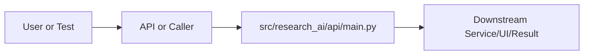

# main.py Explained

Generated educational companion for `src/research_ai/api/main.py`. This file is intentionally detailed so a developer can understand the code, architecture role, production tradeoffs, and ML/backend concepts behind the implementation.

## File Overview

`src/research_ai/api/main.py` is a Python module in the API layer: validates HTTP payloads, exposes endpoints, and serializes responses. It defines no classes and log_requests, _primary_text, home, favicon, health, stats, classify, search, summarize, summarize_paper, similarity, metadata_analyse, citation_proxy, citation_clusters, citation_timeline, knowledge_graph_summary, top_concepts, run_pipeline, list_pipelines, ask, run_agent, run_agent_stream, chat_message, chat_stream, list_models, get_conversation, delete_conversation, upload_paper, load_arxiv, chat_ask, chat_multi_ask, bulk_load, chat_session_info, execute_python.

## Why This File Exists

This file isolates one responsibility in the codebase: API layer: validates HTTP payloads, exposes endpoints, and serializes responses. Separation matters because AI systems are easier to test, scale, debug, and explain when retrieval, orchestration, ML services, memory, UI, and deployment scripts have clear boundaries.

## Workflow Position

**Layer:** API layer: validates HTTP payloads, exposes endpoints, and serializes responses.

**Previous step:** caller code, an API request, a browser event, a test fixture, an import, or a startup script prepares inputs.

**Current step:** `src/research_ai/api/main.py` performs its local responsibility.

**Next step:** downstream services, API responses, rendered UI, tests, or process execution consume the result.



## Inputs and Outputs

- **Inputs:** function arguments, class constructor dependencies, HTTP payloads, environment variables, filesystem artifacts, DOM events, or test fixtures.
- **Outputs:** return values, dictionaries, Pydantic models, rendered DOM state, API responses, logs, process startup, assertions, or side effects.
- **Serialization:** this project uses JSON for APIs/LLM planning, parquet/joblib/faiss for ML artifacts, and HTML/CSS/JS for the browser surface.

## Imports Explained

| Import | Explanation |
|---|---|
| `__future__` | Project or standard-library dependency used to import a service, type, helper, or runtime capability. Imports affect startup time, packaging, and test isolation. |
| `asyncio` | asyncio provides event-loop primitives for non-blocking coordination and streaming endpoints. |
| `fastapi` | FastAPI is the ASGI web framework used for typed HTTP endpoints, uploads, streaming responses, middleware, and automatic OpenAPI documentation. It is a strong fit for ML APIs because validation, routing, and docs are built in. |
| `json` | json serializes/deserializes API payloads, LLM planning output, and artifact metadata. |
| `logging` | logging provides structured operational visibility without using print statements. |
| `os` | os reads environment variables and process/runtime configuration. |
| `pathlib` | pathlib gives object-oriented paths and reduces path-concatenation bugs across local and cloud deployments. |
| `research_ai` | Project or standard-library dependency used to import a service, type, helper, or runtime capability. Imports affect startup time, packaging, and test isolation. |
| `time` | time measures latency, retry delays, and elapsed operation duration. |
| `uuid` | uuid creates unique IDs for sessions, conversations, and uploaded-document references. |

## Global Variables and Config

| Name | Line | Why it matters |
|---|---:|---|
| `_env_path` | 48 | Module-level value, constant, prompt, cache, registry, or configuration point. Check mutability and startup cost. |
| `logger` | 93 | Module-level value, constant, prompt, cache, registry, or configuration point. Check mutability and startup cost. |
| `settings` | 95 | Module-level value, constant, prompt, cache, registry, or configuration point. Check mutability and startup cost. |
| `platform` | 96 | Module-level value, constant, prompt, cache, registry, or configuration point. Check mutability and startup cost. |
| `_MAX_UPLOAD_MB` | 103 | Module-level value, constant, prompt, cache, registry, or configuration point. Check mutability and startup cost. |
| `MAX_UPLOAD_BYTES` | 104 | Module-level value, constant, prompt, cache, registry, or configuration point. Check mutability and startup cost. |
| `_raw_origins` | 111 | Module-level value, constant, prompt, cache, registry, or configuration point. Check mutability and startup cost. |
| `_allowed_origins` | 112 | Module-level value, constant, prompt, cache, registry, or configuration point. Check mutability and startup cost. |
| `app` | 121 | Module-level value, constant, prompt, cache, registry, or configuration point. Check mutability and startup cost. |

## Step-by-Step Workflow

1. Load dependencies and runtime constants.
2. Accept input from the previous layer.
3. Validate, transform, route, score, render, or execute according to this file's role.
4. Return a structured output or perform a controlled side effect.
5. Let caller layers handle presentation, persistence, retries, or fallback.

## Function-by-Function Breakdown

### `log_requests`

- **Line:** 148
- **Kind:** async function
- **Arguments:** request, call_next
- **Docstring:** No explicit docstring; infer behavior from call sites and body.

```python
async def log_requests(request: Request, call_next):
    request_id = str(uuid.uuid4())[:8]
    started = time.perf_counter()
    response = await call_next(request)
    latency_ms = round((time.perf_counter() - started) * 1000, 1)
    logger.info(
        "[%s] %s %s → %d  (%.1fms)",
        request_id, request.method, request.url.path,
        response.status_code, latency_ms,
    )
    response.headers["X-Request-ID"] = request_id
    return response
```

This function's parameters define its input contract. Its return value or side effect defines how downstream code uses it. Review error handling, resource usage, and whether the function performs CPU work, I/O, model inference, or pure transformation.

### `_primary_text`

- **Line:** 166
- **Kind:** synchronous function
- **Arguments:** payload
- **Docstring:** No explicit docstring; infer behavior from call sites and body.

```python
def _primary_text(payload: object) -> str:
    if isinstance(payload, dict):
        for key in ("final_answer", "answer", "summary"):
            value = payload.get(key)
            if isinstance(value, str) and value.strip():
                return value
        executor = payload.get("executor_output")
        if isinstance(executor, dict):
            for value in executor.values():
                if isinstance(value, dict):
                    text = value.get("answer") or value.get("summary") or value.get("final_answer")
                    if isinstance(text, str) and text.strip():
                        return text
        return json.dumps(payload, ensure_ascii=False, indent=2)
    return str(payload)
```

This function's parameters define its input contract. Its return value or side effect defines how downstream code uses it. Review error handling, resource usage, and whether the function performs CPU work, I/O, model inference, or pure transformation.

### `home`

- **Line:** 188
- **Kind:** synchronous function
- **Arguments:** none
- **Docstring:** No explicit docstring; infer behavior from call sites and body.

```python
def home():
    index_path = settings.paths.frontend_dir / "index.html"
    if index_path.exists():
        return FileResponse(index_path)
    return {"message": "Frontend not found. Visit /docs for API reference."}
```

This function's parameters define its input contract. Its return value or side effect defines how downstream code uses it. Review error handling, resource usage, and whether the function performs CPU work, I/O, model inference, or pure transformation.

### `favicon`

- **Line:** 196
- **Kind:** synchronous function
- **Arguments:** none
- **Docstring:** No explicit docstring; infer behavior from call sites and body.

```python
def favicon():
    path = settings.paths.frontend_dir / "favicon.ico"
    return FileResponse(path) if path.exists() else Response(status_code=204)
```

This function's parameters define its input contract. Its return value or side effect defines how downstream code uses it. Review error handling, resource usage, and whether the function performs CPU work, I/O, model inference, or pure transformation.

### `health`

- **Line:** 202
- **Kind:** synchronous function
- **Arguments:** none
- **Docstring:** No explicit docstring; infer behavior from call sites and body.

```python
def health():
    return {
        "status": "ok",
        "version": "3.1.0",
        "architecture": "research_ai_agentic_platform",
        "components": {
            "classifier": platform.classifier.ready,
            "hybrid_retrieval": platform.retriever.ready,
            "summarizer": platform.summarizer.ready,
            "paper_chat": True,
            "python_execution": settings.execution.enabled,
            "knowledge_graph": True,
            "citation_engine": True,
            "pipeline_runner": True,
        },
        "llm_backend": settings.llm.backend,
        "llm_provider": settings.llm.provider,
    }
```

This function's parameters define its input contract. Its return value or side effect defines how downstream code uses it. Review error handling, resource usage, and whether the function performs CPU work, I/O, model inference, or pure transformation.

### `stats`

- **Line:** 223
- **Kind:** synchronous function
- **Arguments:** none
- **Docstring:** No explicit docstring; infer behavior from call sites and body.

```python
def stats():
    return {
        "indexed_papers": platform.indexed_paper_count,
        "active_chat_sessions": len(platform.paper_chat.sessions),
        "active_conversations": platform.conversation_store.count,
        "classifier_ready": platform.classifier.ready,
        "retrieval_ready": platform.retriever.ready,
        "embedding_model": platform.embedding_service.model_name,
        "knowledge_graph": platform.knowledge_graph.summary(),
        "available_pipelines": platform.pipeline_runner.available_pipelines(),
        "ollama": platform.ollama_manager.health_check(),
    }
```

This function's parameters define its input contract. Its return value or side effect defines how downstream code uses it. Review error handling, resource usage, and whether the function performs CPU work, I/O, model inference, or pure transformation.

### `classify`

- **Line:** 242
- **Kind:** synchronous function
- **Arguments:** req
- **Docstring:** No explicit docstring; infer behavior from call sites and body.

```python
def classify(req: ClassifyRequest):
    title = req.title or req.abstract
    abstract = req.abstract or req.title
    if not (title or "").strip():
        raise HTTPException(status_code=422, detail="Provide at least a title or abstract.")
    result = platform.classifier.classify(title, abstract)
    if result.get("error"):
        raise HTTPException(status_code=503, detail=result["error"])
    return result
```

This function's parameters define its input contract. Its return value or side effect defines how downstream code uses it. Review error handling, resource usage, and whether the function performs CPU work, I/O, model inference, or pure transformation.

### `search`

- **Line:** 254
- **Kind:** synchronous function
- **Arguments:** req
- **Docstring:** No explicit docstring; infer behavior from call sites and body.

```python
def search(req: SearchRequest):
    result = platform.retriever.search(req.query, top_k=req.top_k, filters=req.filters)
    if result.get("error"):
        raise HTTPException(status_code=503, detail=result["error"])
    return result
```

This function's parameters define its input contract. Its return value or side effect defines how downstream code uses it. Review error handling, resource usage, and whether the function performs CPU work, I/O, model inference, or pure transformation.

### `summarize`

- **Line:** 262
- **Kind:** synchronous function
- **Arguments:** req
- **Docstring:** No explicit docstring; infer behavior from call sites and body.

```python
def summarize(req: SummarizeRequest):
    try:
        summary = platform.summarizer.summarize(req.text)
        return {"summary": summary, "word_count": len(summary.split())}
    except Exception as exc:
        raise HTTPException(status_code=503, detail=f"Summarization failed: {redact_secrets(str(exc))}")
```

This function's parameters define its input contract. Its return value or side effect defines how downstream code uses it. Review error handling, resource usage, and whether the function performs CPU work, I/O, model inference, or pure transformation.

### `summarize_paper`

- **Line:** 271
- **Kind:** synchronous function
- **Arguments:** req
- **Docstring:** No explicit docstring; infer behavior from call sites and body.

```python
def summarize_paper(req: ArxivLoadRequest):
    try:
        clean_id = req.arxiv_id.strip().lower().replace("arxiv:", "")
        if platform.retriever.ready:
            docs = platform.retriever.search(clean_id, top_k=10).get("results", [])
            for doc in docs:
                pid = str(doc.get("paper_id", "")).lower()
                if pid == clean_id or pid.endswith(clean_id):
                    text = f"Title: {doc.get('title', '')}\n\nAbstract: {doc.get('abstract', '')}"
                    return {
                        "arxiv_id": req.arxiv_id,
                        "title": doc.get("title", ""),
                        "summary": platform.summarizer.summarize(text),
                    }
        meta = platform.paper_chat.create_or_get_session_from_arxiv_id(req.arxiv_id)
        session = platform.paper_chat.sessions.get(meta["session_id"])
        if session and session.chunks:
            return {
                "arxiv_id": req.arxiv_id,
                "session_id": meta["session_id"],
                "summary": platform.summarizer.summarize(" ".join(session.chunks[:3])),
            }
        raise HTTPException(status_code=404, detail="Could not retrieve paper content.")
    except HTTPException:
        raise
    except Exception as exc:
        raise HTTPException(status_code=400, detail=f"Summarize paper failed: {redact_secrets(str(exc))}")
```

This function's parameters define its input contract. Its return value or side effect defines how downstream code uses it. Review error handling, resource usage, and whether the function performs CPU work, I/O, model inference, or pure transformation.

### `similarity`

- **Line:** 301
- **Kind:** synchronous function
- **Arguments:** req
- **Docstring:** No explicit docstring; infer behavior from call sites and body.

```python
def similarity(req: SimilarityRequest):
    result = platform.similarity.compare(req.text_a, req.text_b)
    if result.get("error"):
        raise HTTPException(status_code=503, detail=result["error"])
    return result
```

This function's parameters define its input contract. Its return value or side effect defines how downstream code uses it. Review error handling, resource usage, and whether the function performs CPU work, I/O, model inference, or pure transformation.

### `metadata_analyse`

- **Line:** 313
- **Kind:** synchronous function
- **Arguments:** req
- **Docstring:** Analyse author, category, year, and abstract quality of a paper list.

```python
def metadata_analyse(req: MetadataAnalyseRequest):
    """Analyse author, category, year, and abstract quality of a paper list."""
    return platform.metadata_service.analyse(req.papers)
```

This function's parameters define its input contract. Its return value or side effect defines how downstream code uses it. Review error handling, resource usage, and whether the function performs CPU work, I/O, model inference, or pure transformation.

### `citation_proxy`

- **Line:** 319
- **Kind:** synchronous function
- **Arguments:** req
- **Docstring:** Derive proxy citation relations from paper metadata.

```python
def citation_proxy(req: CitationProxyRequest):
    """Derive proxy citation relations from paper metadata."""
    return platform.citation_engine.proxy_citations(req.papers)
```

This function's parameters define its input contract. Its return value or side effect defines how downstream code uses it. Review error handling, resource usage, and whether the function performs CPU work, I/O, model inference, or pure transformation.

### `citation_clusters`

- **Line:** 325
- **Kind:** synchronous function
- **Arguments:** req
- **Docstring:** Group papers into co-citation topic clusters.

```python
def citation_clusters(req: CitationProxyRequest):
    """Group papers into co-citation topic clusters."""
    return platform.citation_engine.co_citation_clusters(req.papers)
```

This function's parameters define its input contract. Its return value or side effect defines how downstream code uses it. Review error handling, resource usage, and whether the function performs CPU work, I/O, model inference, or pure transformation.

### `citation_timeline`

- **Line:** 331
- **Kind:** synchronous function
- **Arguments:** req
- **Docstring:** Return papers ordered by year as an influence timeline.

```python
def citation_timeline(req: CitationProxyRequest):
    """Return papers ordered by year as an influence timeline."""
    return platform.citation_engine.influence_timeline(req.papers)
```

This function's parameters define its input contract. Its return value or side effect defines how downstream code uses it. Review error handling, resource usage, and whether the function performs CPU work, I/O, model inference, or pure transformation.

### `knowledge_graph_summary`

- **Line:** 337
- **Kind:** synchronous function
- **Arguments:** none
- **Docstring:** Return current knowledge graph concept summary.

```python
def knowledge_graph_summary():
    """Return current knowledge graph concept summary."""
    return platform.knowledge_graph.summary()
```

This function's parameters define its input contract. Its return value or side effect defines how downstream code uses it. Review error handling, resource usage, and whether the function performs CPU work, I/O, model inference, or pure transformation.

### `top_concepts`

- **Line:** 343
- **Kind:** synchronous function
- **Arguments:** n
- **Docstring:** Return the top N concepts tracked across sessions.

```python
def top_concepts(n: int = 20):
    """Return the top N concepts tracked across sessions."""
    return {"concepts": platform.knowledge_graph.top_concepts(n)}
```

This function's parameters define its input contract. Its return value or side effect defines how downstream code uses it. Review error handling, resource usage, and whether the function performs CPU work, I/O, model inference, or pure transformation.

### `run_pipeline`

- **Line:** 353
- **Kind:** synchronous function
- **Arguments:** req
- **Docstring:** Execute a named research analysis pipeline.

```python
def run_pipeline(req: PipelineRequest):
    """Execute a named research analysis pipeline."""
    result = platform.pipeline_runner.run(req.pipeline_name, req.query)
    if result.errors and not result.steps_ok:
        raise HTTPException(status_code=503, detail=result.errors[0])
    return result.to_dict()
```

This function's parameters define its input contract. Its return value or side effect defines how downstream code uses it. Review error handling, resource usage, and whether the function performs CPU work, I/O, model inference, or pure transformation.

### `list_pipelines`

- **Line:** 362
- **Kind:** synchronous function
- **Arguments:** none
- **Docstring:** List all available named research analysis pipelines.

```python
def list_pipelines():
    """List all available named research analysis pipelines."""
    return {"pipelines": platform.pipeline_runner.available_pipelines()}
```

This function's parameters define its input contract. Its return value or side effect defines how downstream code uses it. Review error handling, resource usage, and whether the function performs CPU work, I/O, model inference, or pure transformation.

### `ask`

- **Line:** 372
- **Kind:** synchronous function
- **Arguments:** req
- **Docstring:** No explicit docstring; infer behavior from call sites and body.

```python
def ask(req: AskRequest):
    return platform.orchestrator.run(mode="auto", query=req.query, top_k=req.top_k)
```

This function's parameters define its input contract. Its return value or side effect defines how downstream code uses it. Review error handling, resource usage, and whether the function performs CPU work, I/O, model inference, or pure transformation.

### `run_agent`

- **Line:** 377
- **Kind:** synchronous function
- **Arguments:** req
- **Docstring:** No explicit docstring; infer behavior from call sites and body.

```python
def run_agent(req: AgentRequest):
    return platform.orchestrator.run(
        mode=req.mode,
        query=req.query,
        title=req.title,
        abstract=req.abstract,
        top_k=req.top_k,
        text=req.text,
        session_id=req.session_id,
    )
```

This function's parameters define its input contract. Its return value or side effect defines how downstream code uses it. Review error handling, resource usage, and whether the function performs CPU work, I/O, model inference, or pure transformation.

### `run_agent_stream`

- **Line:** 390
- **Kind:** async function
- **Arguments:** req
- **Docstring:** No explicit docstring; infer behavior from call sites and body.

```python
async def run_agent_stream(req: AgentRequest):
    out = run_agent(req)
    text = _primary_text(out)
    request_id = out.get("request_id", "")
    mode = out.get("mode", req.mode)

    async def event_generator():
        yield f"data: {json.dumps({'event': 'start', 'request_id': request_id, 'mode': mode})}\n\n"
        step = max(1, len(text) // 100)
        for i in range(0, len(text), step):
            yield f"data: {json.dumps({'delta': text[i:i + step]}, ensure_ascii=False)}\n\n"
            await asyncio.sleep(0.008)
        yield (
            f"data: {json.dumps({'event': 'end', 'request_id': request_id, 'mode': mode, 'latency_ms': out.get('latency_ms')})}\n\n"
        )
        yield "data: [DONE]\n\n"

    return StreamingResponse(
        event_generator(),
        media_type="text/event-stream",
        headers={"Cache-Control": "no-cache", "Connection": "keep-alive", "X-Accel-Buffering": "no"},
    )
```

This function's parameters define its input contract. Its return value or side effect defines how downstream code uses it. Review error handling, resource usage, and whether the function performs CPU work, I/O, model inference, or pure transformation.

### `chat_message`

- **Line:** 429
- **Kind:** synchronous function
- **Arguments:** req
- **Docstring:** Unified conversational AI endpoint — the primary user interface.

Orchestrates the full pipeline automatically:
  intent detection → retrieval → reranking → synthesis → validation → citation

Returns a structured response with answer text, source papers, confidence
score, and conversation ID for multi-turn continuity.

```python
def chat_message(req: ChatMessageRequest):
    """Unified conversational AI endpoint — the primary user interface.

    Orchestrates the full pipeline automatically:
      intent detection → retrieval → reranking → synthesis → validation → citation

    Returns a structured response with answer text, source papers, confidence
    score, and conversation ID for multi-turn continuity.
    """
    try:
        result = platform.chat(
            query=req.query,
            conversation_id=req.conversation_id,
            session_id=req.session_id,
            top_k=req.top_k,
            debug=req.debug,
        )
        # Build structured source list for the response model
        from research_ai.api.schemas import SourcePaper
        sources = [
            SourcePaper(
                title=s.get("title", ""),
                paper_id=s.get("paper_id", ""),
                year=s.get("year", ""),
                category=s.get("category", ""),
                abstract_snippet=s.get("abstract_snippet", ""),
                score=float(s.get("score", 0.0)),
                arxiv_url=s.get("arxiv_url", ""),
            )
            for s in result.get("sources", [])
        ]
        return ChatMessageResponse(
            answer=result["answer"],
            sources=sources,
            confidence=float(result.get("confidence", 0.0)),
            conversation_id=result["conversation_id"],
            intent=result.get("intent", "research_analysis"),
            tools_used=result.get("tools_used", []),
            model_used=result.get("model_used", ""),
            latency_ms=float(result.get("latency_ms", 0.0)),
            debug_trace=result.get("debug_trace") if req.debug else None,
        )
    except Exception as exc:
        raise HTTPException(status_code=500, detail=redact_secrets(str(exc)))
```

This function's parameters define its input contract. Its return value or side effect defines how downstream code uses it. Review error handling, resource usage, and whether the function performs CPU work, I/O, model inference, or pure transformation.

### `chat_stream`

- **Line:** 476
- **Kind:** async function
- **Arguments:** req
- **Docstring:** Streaming version of /chat/message using Server-Sent Events.

Delivers the answer token-by-token for a responsive streaming UI.
Also emits structured metadata (sources, confidence) as a final event.

SSE event format:
  data: {"delta": "<text chunk>"}              — incremental text
  data: {"event": "sources", "sources": [...]} — final sources list
  data: {"event": "done", "confidence": 0.85, "conversation_id": "..."}
  data: [DONE]

```python
async def chat_stream(req: ChatMessageRequest):
    """Streaming version of /chat/message using Server-Sent Events.

    Delivers the answer token-by-token for a responsive streaming UI.
    Also emits structured metadata (sources, confidence) as a final event.

    SSE event format:
      data: {"delta": "<text chunk>"}              — incremental text
      data: {"event": "sources", "sources": [...]} — final sources list
      data: {"event": "done", "confidence": 0.85, "conversation_id": "..."}
      data: [DONE]
    """
    try:
        result = platform.chat(
            query=req.query,
            conversation_id=req.conversation_id,
            session_id=req.session_id,
            top_k=req.top_k,
            debug=False,
        )
    except Exception as exc:
        async def error_gen():
            err = json.dumps({"event": "error", "message": redact_secrets(str(exc))})
            yield f"data: {err}\n\n"
            yield "data: [DONE]\n\n"
        return StreamingResponse(error_gen(), media_type="text/event-stream",
                                 headers={"Cache-Control": "no-cache", "X-Accel-Buffering": "no"})

    text = result.get("answer", "")
    sources = result.get("sources", [])
    confidence = result.get("confidence", 0.0)
    conversation_id = result.get("conversation_id", "")
    intent = result.get("intent", "research_analysis")
    latency_ms = result.get("latency_ms", 0.0)

    async def event_generator():
        # Start event
        yield f"data: {json.dumps({'event': 'start', 'intent': intent, 'conversation_id': conversation_id})}\n\n"

        # Stream answer in small chunks to simulate real-time generation
        # Real streaming requires Ollama's streaming API — this simulates it
        # for compatibility with both cloud and local providers.
        chunk_size = max(1, len(text) // 80)
        for i in range(0, len(text), chunk_size):
            yield f"data: {json.dumps({'delta': text[i:i + chunk_size]}, ensure_ascii=False)}\n\n"
            await asyncio.sleep(0.006)

        # Send structured sources as a separate event
        yield f"data: {json.dumps({'event': 'sources', 'sources': sources}, ensure_ascii=False)}\n\n"

        # Done event with metadata
        yield f"data: {json.dumps({'event': 'done', 'confidence': confidence, 'conversation_id': conversation_id, 'latency_ms': latency_ms})}\n\n"
        yield "data: [DONE]\n\n"

    return StreamingResponse(
        event_generator(),
        media_type="text/event-stream",
        headers={"Cache-Control": "no-cache", "Connection": "keep-alive", "X-Accel-Buffering": "no"},
    )
```

This function's parameters define its input contract. Its return value or side effect defines how downstream code uses it. Review error handling, resource usage, and whether the function performs CPU work, I/O, model inference, or pure transformation.

### `list_models`

- **Line:** 542
- **Kind:** synchronous function
- **Arguments:** none
- **Docstring:** List locally available Ollama models with their speed tier.

Tier 1 = fastest (<4B params), Tier 2 = balanced, Tier 3 = most capable.
Returns empty list if Ollama is not running.

```python
def list_models():
    """List locally available Ollama models with their speed tier.

    Tier 1 = fastest (<4B params), Tier 2 = balanced, Tier 3 = most capable.
    Returns empty list if Ollama is not running.
    """
    mgr = platform.ollama_manager
    # Refresh model list on each call so newly pulled models appear immediately
    mgr.discover()
    from research_ai.api.schemas import ModelInfo as ModelInfoSchema
    return ModelsListResponse(
        available=mgr.available,
        models=[ModelInfoSchema(**m) for m in mgr.models_list()],
        default_model=os.getenv("OLLAMA_MODEL", "qwen2.5:3b"),
    )
```

This function's parameters define its input contract. Its return value or side effect defines how downstream code uses it. Review error handling, resource usage, and whether the function performs CPU work, I/O, model inference, or pure transformation.

### `get_conversation`

- **Line:** 560
- **Kind:** synchronous function
- **Arguments:** conversation_id
- **Docstring:** Return the turn history for a conversation (for history panel rendering).

```python
def get_conversation(conversation_id: str):
    """Return the turn history for a conversation (for history panel rendering)."""
    conv = platform.conversation_store.get(conversation_id)
    if conv is None:
        raise HTTPException(status_code=404, detail="Conversation not found.")
    return {
        "conversation_id": conversation_id,
        "turn_count": conv.turn_count,
        "created_at": conv.created_at,
        "last_active": conv.last_active,
        "turns": [{"role": t.role, "content": t.content} for t in conv.turns],
    }
```

This function's parameters define its input contract. Its return value or side effect defines how downstream code uses it. Review error handling, resource usage, and whether the function performs CPU work, I/O, model inference, or pure transformation.

### `delete_conversation`

- **Line:** 575
- **Kind:** synchronous function
- **Arguments:** conversation_id
- **Docstring:** Delete a conversation from memory.

```python
def delete_conversation(conversation_id: str):
    """Delete a conversation from memory."""
    deleted = platform.conversation_store.delete(conversation_id)
    if not deleted:
        raise HTTPException(status_code=404, detail="Conversation not found.")
    return {"deleted": conversation_id}
```

This function's parameters define its input contract. Its return value or side effect defines how downstream code uses it. Review error handling, resource usage, and whether the function performs CPU work, I/O, model inference, or pure transformation.

### `upload_paper`

- **Line:** 588
- **Kind:** async function
- **Arguments:** file
- **Docstring:** Ingest a paper from an uploaded PDF or text file and create a chat session.

Size limit: MAX_UPLOAD_BYTES (default 50 MB, configurable via MAX_UPLOAD_MB).
Without a size limit, a 500 MB PDF would be read entirely into memory,
potentially exhausting RAM on a CPU-only server.

Returns: {"session_id": "...", "chunk_count": N, "source": "upload:filename"}

```python
async def upload_paper(file: UploadFile = File(...)):
    """Ingest a paper from an uploaded PDF or text file and create a chat session.

    Size limit: MAX_UPLOAD_BYTES (default 50 MB, configurable via MAX_UPLOAD_MB).
    Without a size limit, a 500 MB PDF would be read entirely into memory,
    potentially exhausting RAM on a CPU-only server.

    Returns: {"session_id": "...", "chunk_count": N, "source": "upload:filename"}
    """
    try:
        # Read with explicit size guard.
        # UploadFile.read() has no built-in limit — we impose one here.
        content = await file.read(MAX_UPLOAD_BYTES + 1)
        if len(content) > MAX_UPLOAD_BYTES:
            raise HTTPException(
                status_code=413,
                detail=f"File too large. Maximum upload size is {_MAX_UPLOAD_MB} MB.",
            )
        filename = file.filename or "uploaded_file"
        if filename.lower().endswith(".pdf"):
            return platform.paper_chat.create_session_from_pdf_bytes(content, source=f"upload:{filename}")
        return platform.paper_chat.create_session_from_text(
            text=content.decode("utf-8", errors="ignore"),
            source=f"upload:{filename}",
        )
    except HTTPException:
        raise
    except Exception as exc:
        raise HTTPException(status_code=400, detail=f"Upload failed: {redact_secrets(str(exc))}")
```

This function's parameters define its input contract. Its return value or side effect defines how downstream code uses it. Review error handling, resource usage, and whether the function performs CPU work, I/O, model inference, or pure transformation.

### `load_arxiv`

- **Line:** 620
- **Kind:** synchronous function
- **Arguments:** req
- **Docstring:** No explicit docstring; infer behavior from call sites and body.

```python
def load_arxiv(req: ArxivLoadRequest):
    try:
        return platform.paper_chat.create_or_get_session_from_arxiv_id(req.arxiv_id)
    except Exception as exc:
        raise HTTPException(status_code=400, detail=f"arXiv load failed: {redact_secrets(str(exc))}")
```

This function's parameters define its input contract. Its return value or side effect defines how downstream code uses it. Review error handling, resource usage, and whether the function performs CPU work, I/O, model inference, or pure transformation.

### `chat_ask`

- **Line:** 628
- **Kind:** synchronous function
- **Arguments:** req
- **Docstring:** No explicit docstring; infer behavior from call sites and body.

```python
def chat_ask(req: PaperChatRequest):
    try:
        return platform.paper_chat.ask(req.session_id, req.question, top_k=req.top_k)
    except KeyError as exc:
        raise HTTPException(status_code=404, detail=str(exc))
    except Exception as exc:
        raise HTTPException(status_code=400, detail=f"Chat failed: {redact_secrets(str(exc))}")
```

This function's parameters define its input contract. Its return value or side effect defines how downstream code uses it. Review error handling, resource usage, and whether the function performs CPU work, I/O, model inference, or pure transformation.

### `chat_multi_ask`

- **Line:** 638
- **Kind:** synchronous function
- **Arguments:** req
- **Docstring:** No explicit docstring; infer behavior from call sites and body.

```python
def chat_multi_ask(req: PaperChatRequest):
    try:
        session_ids = [item.strip() for item in req.session_id.split(",") if item.strip()]
        if not session_ids:
            raise HTTPException(status_code=422, detail="No valid session IDs provided.")
        return platform.paper_chat.ask_multi(session_ids, req.question, top_k_per_session=req.top_k)
    except HTTPException:
        raise
    except Exception as exc:
        raise HTTPException(status_code=400, detail=f"Multi-chat failed: {redact_secrets(str(exc))}")
```

This function's parameters define its input contract. Its return value or side effect defines how downstream code uses it. Review error handling, resource usage, and whether the function performs CPU work, I/O, model inference, or pure transformation.

### `bulk_load`

- **Line:** 651
- **Kind:** synchronous function
- **Arguments:** req
- **Docstring:** No explicit docstring; infer behavior from call sites and body.

```python
def bulk_load(req: BulkChatRequest):
    results: list[dict] = []
    for arxiv_id in req.arxiv_ids[:5]:
        try:
            meta = platform.paper_chat.create_or_get_session_from_arxiv_id(arxiv_id)
            results.append({
                "arxiv_id": arxiv_id,
                "session_id": meta["session_id"],
                "chunk_count": meta.get("chunk_count", 0),
                "cached": meta.get("cached", False),
                "status": "ok",
            })
        except Exception as exc:
            results.append({"arxiv_id": arxiv_id, "status": "error", "error": redact_secrets(str(exc))})
    session_ids = [item["session_id"] for item in results if item.get("status") == "ok"]
    first_answer = None
    if req.question.strip() and session_ids:
        try:
            first_answer = platform.paper_chat.ask_multi(session_ids, req.question, top_k_per_session=3)
        except Exception as exc:
            first_answer = {"error": redact_secrets(str(exc))}
    return {
        "papers": results,
        "session_ids": session_ids,
        "total_loaded": len(session_ids),
        "answer": first_answer,
    }
```

This function's parameters define its input contract. Its return value or side effect defines how downstream code uses it. Review error handling, resource usage, and whether the function performs CPU work, I/O, model inference, or pure transformation.

### `chat_session_info`

- **Line:** 681
- **Kind:** synchronous function
- **Arguments:** session_id
- **Docstring:** No explicit docstring; infer behavior from call sites and body.

```python
def chat_session_info(session_id: str):
    try:
        return platform.paper_chat.session_info(session_id)
    except KeyError as exc:
        raise HTTPException(status_code=404, detail=str(exc))
```

This function's parameters define its input contract. Its return value or side effect defines how downstream code uses it. Review error handling, resource usage, and whether the function performs CPU work, I/O, model inference, or pure transformation.

### `execute_python`

- **Line:** 693
- **Kind:** synchronous function
- **Arguments:** req
- **Docstring:** No explicit docstring; infer behavior from call sites and body.

```python
def execute_python(req: PythonExecutionRequest):
    result = platform.python_runner.run(req.code).to_dict()
    if not result["ok"]:
        raise HTTPException(status_code=400, detail=result.get("error", "Execution failed."))
    return result
```

This function's parameters define its input contract. Its return value or side effect defines how downstream code uses it. Review error handling, resource usage, and whether the function performs CPU work, I/O, model inference, or pure transformation.


## Class-by-Class Breakdown

No classes are defined. The module relies on functions, constants, imports, or package exports.

## Important Algorithms Used

- **Embeddings**: Embeddings map text into dense semantic vectors so conceptual similarity becomes geometric similarity.
- **FAISS Indexing**: FAISS indexes dense vectors for nearest-neighbor search. Exact flat indexes trade speed at huge scale for simplicity and correctness.
- **Hybrid Retrieval**: Hybrid retrieval combines semantic vectors with lexical/keyword evidence, improving scientific search where exact terms matter.
- **LLM Inference**: LLM inference sends prompts or chat messages to a model provider and receives generated text under token, latency, and cost constraints.
- **Transformers**: Transformers use tokenization and attention layers for language understanding/generation. They are powerful but memory and latency sensitive.
- **Classification**: Classification maps text or features to discrete labels, supporting category prediction and routing.
- **Calibration**: Calibration makes predicted probabilities better match real correctness rates, which matters for user-facing confidence.
- **Caching**: Caching avoids repeating expensive work such as model loading, embedding generation, or client initialization.
- **Streaming**: Streaming improves perceived latency by sending incremental output instead of waiting for full completion.
- **Sandboxing**: Sandboxing validates and constrains user code before execution, reducing security and stability risk.

## Libraries Used

| Import | Explanation |
|---|---|
| `__future__` | Project or standard-library dependency used to import a service, type, helper, or runtime capability. Imports affect startup time, packaging, and test isolation. |
| `asyncio` | asyncio provides event-loop primitives for non-blocking coordination and streaming endpoints. |
| `fastapi` | FastAPI is the ASGI web framework used for typed HTTP endpoints, uploads, streaming responses, middleware, and automatic OpenAPI documentation. It is a strong fit for ML APIs because validation, routing, and docs are built in. |
| `json` | json serializes/deserializes API payloads, LLM planning output, and artifact metadata. |
| `logging` | logging provides structured operational visibility without using print statements. |
| `os` | os reads environment variables and process/runtime configuration. |
| `pathlib` | pathlib gives object-oriented paths and reduces path-concatenation bugs across local and cloud deployments. |
| `research_ai` | Project or standard-library dependency used to import a service, type, helper, or runtime capability. Imports affect startup time, packaging, and test isolation. |
| `time` | time measures latency, retry delays, and elapsed operation duration. |
| `uuid` | uuid creates unique IDs for sessions, conversations, and uploaded-document references. |

## ML Concepts Used

- **Embeddings**: Embeddings map text into dense semantic vectors so conceptual similarity becomes geometric similarity.
- **FAISS Indexing**: FAISS indexes dense vectors for nearest-neighbor search. Exact flat indexes trade speed at huge scale for simplicity and correctness.
- **Hybrid Retrieval**: Hybrid retrieval combines semantic vectors with lexical/keyword evidence, improving scientific search where exact terms matter.
- **LLM Inference**: LLM inference sends prompts or chat messages to a model provider and receives generated text under token, latency, and cost constraints.
- **Transformers**: Transformers use tokenization and attention layers for language understanding/generation. They are powerful but memory and latency sensitive.
- **Classification**: Classification maps text or features to discrete labels, supporting category prediction and routing.
- **Calibration**: Calibration makes predicted probabilities better match real correctness rates, which matters for user-facing confidence.
- **Caching**: Caching avoids repeating expensive work such as model loading, embedding generation, or client initialization.
- **Streaming**: Streaming improves perceived latency by sending incremental output instead of waiting for full completion.
- **Sandboxing**: Sandboxing validates and constrains user code before execution, reducing security and stability risk.

## Performance and Memory Notes

- Avoid eager loading of heavy ML models unless startup latency is acceptable.
- Cache expensive clients, tokenizers, vector stores, and embeddings carefully.
- Use float32 for embedding vectors because it halves memory compared with float64 and matches FAISS/neural inference expectations.
- Bound prompt length, uploaded content, result counts, and token budgets to control latency and memory.
- Watch copies of large metadata frames, embedding matrices, and file buffers.

## Scalability Notes

- In-memory state works for local demos but needs Redis/database/object storage for multi-worker cloud deployment.
- CPU/GPU inference should often be separated from the web API when traffic grows.
- Retrieval can start exact and move to approximate indexes as corpus size grows.
- Batch operations and cache repeated work to improve throughput.
- Add metrics for latency, errors, fallback frequency, retrieval hit rate, and token usage.

## Production Engineering Notes

- Keep interfaces stable because other files may import this module or depend on its response shape.
- Prefer typed/structured data over free-form strings at service boundaries.
- Log operational context without secrets or huge payloads.
- Make fallback behavior explicit so users get useful output even when LLMs or artifacts fail.
- Keep provider-specific logic behind adapters so Groq/OpenRouter/Google/Ollama can be swapped.

## Common Bugs and Failure Cases

- Missing `.env` values, model artifacts, or Ollama models can trigger degraded behavior.
- Type mismatches occur when LLM-generated tool arguments cross into strict Python code.
- Empty retrieval results must not become hallucinated answers.
- Network calls need timeouts and careful retry behavior.
- Frontend IDs/classes and API schemas are contracts; changing one side without the other breaks workflows.

## Security Considerations

- Handles credentials or environment configuration. Keep secrets in environment variables and redact them from logs.
- Touches files or paths. Validate filenames, restrict upload size/type, and prevent traversal.
- Deals with execution or subprocesses. Maintain AST validation, isolated mode, timeouts, and least privilege.
- Performs network I/O. Use timeouts, validate responses, and keep private services such as Ollama off the public internet.

## Real Industry Usage

- This pattern appears in enterprise RAG assistants, scientific search tools, internal research copilots, and ML platform demos.
- The layered design mirrors production systems: API facade, orchestration, retrieval, evaluation, synthesis, UI, and deployment.
- Clear separation lets teams replace model providers, improve retrieval, harden security, or redesign UI independently.

## Optimization Opportunities

- Add tracing around each workflow step.
- Strengthen schema validation at boundaries.
- Persist conversation/session state outside process memory.
- Add load tests and adversarial tests for prompt injection, empty evidence, and large uploads.
- Consider approximate vector indexes, reranker models, or batching when corpus/traffic grows.

## How This Connects To Other Files

- `src/research_ai/api/main.py` is connected through imports, startup scripts, API routes, frontend selectors, tests, or artifact paths.
- `src/research_ai/platform.py` is the backend composition root.
- `src/research_ai/api/main.py` exposes backend behavior over HTTP.
- Retrieval modules depend on artifacts under `artifacts/`.
- Frontend files depend on stable endpoint and DOM contracts.

## End-to-End Flow Summary

- A user/browser/test/startup event enters the system.
- The relevant layer validates or normalizes input.
- Retrieval, ML, orchestration, execution, or UI rendering happens.
- A structured result, visual state, or process side effect is produced.
- Fallbacks and tests keep behavior understandable when dependencies are unavailable.

## Interview Questions

1. What responsibility does this file own?
2. What inputs and outputs define its contract?
3. Which dependencies are expensive or operationally risky?
4. What breaks if this file changes shape?
5. How would you scale or test this behavior in production?

## Key Takeaways

- `src/research_ai/api/main.py` should be understood as part of a layered AI research platform.
- Trace data flow from inputs to transformations to outputs.
- Production readiness comes from explicit contracts, bounded resources, observability, secure defaults, and graceful fallback.

## Fully Commented Source

This section repeats the original source with an explanatory comment before every line. The comments are educational only; they are not inserted into the production source file.

```python
# L0001: Starts, ends, or continues a docstring that documents module, class, or function intent.
"""FastAPI application — Research AI Intelligence Platform v3.1.
# L0002: Blank line that visually separates logical sections and improves readability.

# L0003: Executes Python logic as part of this file's workflow; read surrounding lines for data flow and side effects.
API STRUCTURE
# L0004: Executes Python logic as part of this file's workflow; read surrounding lines for data flow and side effects.
-------------
# L0005: Executes Python logic as part of this file's workflow; read surrounding lines for data flow and side effects.
/health, /stats          — Operational health and index statistics
# L0006: Executes Python logic as part of this file's workflow; read surrounding lines for data flow and side effects.
/classify, /search,      — Direct ML model endpoints (no orchestrator)
# L0007: Executes Python logic as part of this file's workflow; read surrounding lines for data flow and side effects.
/summarize, /similarity
# L0008: Executes Python logic as part of this file's workflow; read surrounding lines for data flow and side effects.
/metadata/*, /citation/* — Research intelligence (metadata, citation graphs)
# L0009: Executes Python logic as part of this file's workflow; read surrounding lines for data flow and side effects.
/knowledge-graph/*       — Session-scoped concept tracking
# L0010: Executes Python logic as part of this file's workflow; read surrounding lines for data flow and side effects.
/pipeline/*              — Pre-built multi-step analysis pipelines
# L0011: Executes Python logic as part of this file's workflow; read surrounding lines for data flow and side effects.
/ask, /agent/run,        — Orchestrated agentic endpoints (Plan→Execute→Evaluate→Synthesize)
# L0012: Executes Python logic as part of this file's workflow; read surrounding lines for data flow and side effects.
/agent/run/stream
# L0013: Executes Python logic as part of this file's workflow; read surrounding lines for data flow and side effects.
/chat/*                  — Full-paper ingestion and per-session chat
# L0014: Executes Python logic as part of this file's workflow; read surrounding lines for data flow and side effects.
/execution/python        — Sandboxed Python code execution (disabled by default)
# L0015: Blank line that visually separates logical sections and improves readability.

# L0016: Executes Python logic as part of this file's workflow; read surrounding lines for data flow and side effects.
PRODUCTION HARDENING NOTES
# L0017: Executes Python logic as part of this file's workflow; read surrounding lines for data flow and side effects.
--------------------------
# L0018: Executes Python logic as part of this file's workflow; read surrounding lines for data flow and side effects.
CORS:
# L0019: Assigns or updates a value used later in the workflow; check mutability and data shape.
  allow_origins=["*"] is safe for a local development server but MUST be
# L0020: Executes Python logic as part of this file's workflow; read surrounding lines for data flow and side effects.
  restricted in production to your specific frontend domain(s).
# L0021: Executes Python logic as part of this file's workflow; read surrounding lines for data flow and side effects.
  Set ALLOWED_ORIGINS env var to a comma-separated list, e.g.:
# L0022: Assigns or updates a value used later in the workflow; check mutability and data shape.
    ALLOWED_ORIGINS=https://yourapp.com,https://api.yourapp.com
# L0023: Blank line that visually separates logical sections and improves readability.

# L0024: Executes Python logic as part of this file's workflow; read surrounding lines for data flow and side effects.
PDF UPLOAD SIZE LIMIT:
# L0025: Executes Python logic as part of this file's workflow; read surrounding lines for data flow and side effects.
  The /chat/upload endpoint now enforces a MAX_UPLOAD_BYTES limit (default 50 MB).
# L0026: Executes Python logic as part of this file's workflow; read surrounding lines for data flow and side effects.
  Without this limit, a 500 MB PDF upload would be read entirely into memory,
# L0027: Executes Python logic as part of this file's workflow; read surrounding lines for data flow and side effects.
  potentially exhausting the server's RAM.  Set via MAX_UPLOAD_MB env var.
# L0028: Blank line that visually separates logical sections and improves readability.

# L0029: Executes Python logic as part of this file's workflow; read surrounding lines for data flow and side effects.
RATE LIMITING:
# L0030: Executes Python logic as part of this file's workflow; read surrounding lines for data flow and side effects.
  No rate limiting is implemented here.  For production, add slowapi or a
# L0031: Executes Python logic as part of this file's workflow; read surrounding lines for data flow and side effects.
  reverse-proxy-level limiter (nginx, Cloudflare) in front of this service.
# L0032: Blank line that visually separates logical sections and improves readability.

# L0033: Executes Python logic as part of this file's workflow; read surrounding lines for data flow and side effects.
AUTHENTICATION:
# L0034: Executes Python logic as part of this file's workflow; read surrounding lines for data flow and side effects.
  No authentication is implemented.  For production, add OAuth2/API-key
# L0035: Executes Python logic as part of this file's workflow; read surrounding lines for data flow and side effects.
  middleware or use a gateway (Kong, AWS API Gateway) in front of this service.
# L0036: Starts, ends, or continues a docstring that documents module, class, or function intent.
"""
# L0037: Enables future Python behavior so annotations/import semantics stay modern and predictable.
from __future__ import annotations
# L0038: Blank line that visually separates logical sections and improves readability.

# L0039: Imports a dependency, type, or project module needed by later code in this file.
import asyncio
# L0040: Imports a dependency, type, or project module needed by later code in this file.
import json
# L0041: Imports a dependency, type, or project module needed by later code in this file.
import logging
# L0042: Imports a dependency, type, or project module needed by later code in this file.
import os
# L0043: Imports a dependency, type, or project module needed by later code in this file.
import time
# L0044: Imports a dependency, type, or project module needed by later code in this file.
import uuid
# L0045: Imports a dependency, type, or project module needed by later code in this file.
from pathlib import Path
# L0046: Blank line that visually separates logical sections and improves readability.

# L0047: Developer comment explaining intent, caveat, section boundary, or operational reasoning.
# Load .env from project root before any settings are read
# L0048: Assigns or updates a value used later in the workflow; check mutability and data shape.
_env_path = Path(__file__).resolve().parents[3] / ".env"
# L0049: Branches execution based on a condition, usually for validation, fallback, or mode-specific behavior.
if _env_path.exists():
# L0050: Begins protected execution so failures can be handled without crashing the whole request path.
    try:
# L0051: Imports a dependency, type, or project module needed by later code in this file.
        from dotenv import load_dotenv
# L0052: Assigns or updates a value used later in the workflow; check mutability and data shape.
        load_dotenv(_env_path, override=True)
# L0053: Handles an expected failure path, often converting exceptions into fallback behavior or API errors.
    except ImportError:
# L0054: Developer comment explaining intent, caveat, section boundary, or operational reasoning.
        # dotenv not installed — parse manually
# L0055: Iterates over data, retry attempts, files, results, or workflow steps.
        for _line in _env_path.read_text().splitlines():
# L0056: Assigns or updates a value used later in the workflow; check mutability and data shape.
            _line = _line.strip()
# L0057: Branches execution based on a condition, usually for validation, fallback, or mode-specific behavior.
            if _line and not _line.startswith("#") and "=" in _line:
# L0058: Assigns or updates a value used later in the workflow; check mutability and data shape.
                _k, _v = _line.split("=", 1)
# L0059: Executes Python logic as part of this file's workflow; read surrounding lines for data flow and side effects.
                os.environ.setdefault(_k.strip(), _v.strip())
# L0060: Blank line that visually separates logical sections and improves readability.

# L0061: Imports a dependency, type, or project module needed by later code in this file.
from fastapi import FastAPI, File, HTTPException, Request, UploadFile
# L0062: Imports a dependency, type, or project module needed by later code in this file.
from fastapi.middleware.cors import CORSMiddleware
# L0063: Imports a dependency, type, or project module needed by later code in this file.
from fastapi.responses import FileResponse, Response, StreamingResponse
# L0064: Imports a dependency, type, or project module needed by later code in this file.
from fastapi.staticfiles import StaticFiles
# L0065: Blank line that visually separates logical sections and improves readability.

# L0066: Imports a dependency, type, or project module needed by later code in this file.
from research_ai.api.schemas import (
# L0067: Executes Python logic as part of this file's workflow; read surrounding lines for data flow and side effects.
    AgentRequest,
# L0068: Executes Python logic as part of this file's workflow; read surrounding lines for data flow and side effects.
    ArxivLoadRequest,
# L0069: Executes Python logic as part of this file's workflow; read surrounding lines for data flow and side effects.
    AskRequest,
# L0070: Executes Python logic as part of this file's workflow; read surrounding lines for data flow and side effects.
    BulkChatRequest,
# L0071: Executes Python logic as part of this file's workflow; read surrounding lines for data flow and side effects.
    ChatMessageRequest,
# L0072: Executes Python logic as part of this file's workflow; read surrounding lines for data flow and side effects.
    ChatMessageResponse,
# L0073: Executes Python logic as part of this file's workflow; read surrounding lines for data flow and side effects.
    CitationProxyRequest,
# L0074: Executes Python logic as part of this file's workflow; read surrounding lines for data flow and side effects.
    ClassifyRequest,
# L0075: Executes Python logic as part of this file's workflow; read surrounding lines for data flow and side effects.
    MediatedAgentResponse,
# L0076: Executes Python logic as part of this file's workflow; read surrounding lines for data flow and side effects.
    MetadataAnalyseRequest,
# L0077: Executes Python logic as part of this file's workflow; read surrounding lines for data flow and side effects.
    ModelsListResponse,
# L0078: Executes Python logic as part of this file's workflow; read surrounding lines for data flow and side effects.
    PaperChatRequest,
# L0079: Executes Python logic as part of this file's workflow; read surrounding lines for data flow and side effects.
    PipelineRequest,
# L0080: Executes Python logic as part of this file's workflow; read surrounding lines for data flow and side effects.
    PythonExecutionRequest,
# L0081: Executes Python logic as part of this file's workflow; read surrounding lines for data flow and side effects.
    SearchRequest,
# L0082: Executes Python logic as part of this file's workflow; read surrounding lines for data flow and side effects.
    SimilarityRequest,
# L0083: Executes Python logic as part of this file's workflow; read surrounding lines for data flow and side effects.
    SummarizeRequest,
# L0084: Executes Python logic as part of this file's workflow; read surrounding lines for data flow and side effects.
)
# L0085: Imports a dependency, type, or project module needed by later code in this file.
from research_ai.common.text import redact_secrets
# L0086: Imports a dependency, type, or project module needed by later code in this file.
from research_ai.configs.settings import load_settings
# L0087: Imports a dependency, type, or project module needed by later code in this file.
from research_ai.platform import ResearchAIPlatform
# L0088: Blank line that visually separates logical sections and improves readability.

# L0089: Executes Python logic as part of this file's workflow; read surrounding lines for data flow and side effects.
logging.basicConfig(
# L0090: Assigns or updates a value used later in the workflow; check mutability and data shape.
    level=logging.INFO,
# L0091: Assigns or updates a value used later in the workflow; check mutability and data shape.
    format="%(asctime)s  %(levelname)-8s  %(name)s - %(message)s",
# L0092: Executes Python logic as part of this file's workflow; read surrounding lines for data flow and side effects.
)
# L0093: Assigns or updates a value used later in the workflow; check mutability and data shape.
logger = logging.getLogger(__name__)
# L0094: Blank line that visually separates logical sections and improves readability.

# L0095: Assigns or updates a value used later in the workflow; check mutability and data shape.
settings = load_settings()
# L0096: Assigns or updates a value used later in the workflow; check mutability and data shape.
platform = ResearchAIPlatform(settings)
# L0097: Blank line that visually separates logical sections and improves readability.

# L0098: Developer comment explaining intent, caveat, section boundary, or operational reasoning.
# ---------------------------------------------------------------------------
# L0099: Developer comment explaining intent, caveat, section boundary, or operational reasoning.
# Upload size limit
# L0100: Developer comment explaining intent, caveat, section boundary, or operational reasoning.
# Protects against memory exhaustion from very large PDF uploads.
# L0101: Developer comment explaining intent, caveat, section boundary, or operational reasoning.
# Default: 50 MB.  Override with MAX_UPLOAD_MB environment variable.
# L0102: Developer comment explaining intent, caveat, section boundary, or operational reasoning.
# ---------------------------------------------------------------------------
# L0103: Assigns or updates a value used later in the workflow; check mutability and data shape.
_MAX_UPLOAD_MB = int(os.getenv("MAX_UPLOAD_MB", "50"))
# L0104: Assigns or updates a value used later in the workflow; check mutability and data shape.
MAX_UPLOAD_BYTES = _MAX_UPLOAD_MB * 1024 * 1024
# L0105: Blank line that visually separates logical sections and improves readability.

# L0106: Developer comment explaining intent, caveat, section boundary, or operational reasoning.
# ---------------------------------------------------------------------------
# L0107: Developer comment explaining intent, caveat, section boundary, or operational reasoning.
# CORS allowed origins
# L0108: Developer comment explaining intent, caveat, section boundary, or operational reasoning.
# In development, allow all origins for convenience.
# L0109: Developer comment explaining intent, caveat, section boundary, or operational reasoning.
# In production, set ALLOWED_ORIGINS to restrict access.
# L0110: Developer comment explaining intent, caveat, section boundary, or operational reasoning.
# ---------------------------------------------------------------------------
# L0111: Assigns or updates a value used later in the workflow; check mutability and data shape.
_raw_origins = os.getenv("ALLOWED_ORIGINS", "*").strip()
# L0112: Assigns or updates a value used later in the workflow; check mutability and data shape.
_allowed_origins: list[str] = (
# L0113: Assigns or updates a value used later in the workflow; check mutability and data shape.
    ["*"] if _raw_origins == "*" else [o.strip() for o in _raw_origins.split(",") if o.strip()]
# L0114: Executes Python logic as part of this file's workflow; read surrounding lines for data flow and side effects.
)
# L0115: Branches execution based on a condition, usually for validation, fallback, or mode-specific behavior.
if "*" in _allowed_origins:
# L0116: Emits structured operational information for debugging, monitoring, or failure diagnosis.
    logger.warning(
# L0117: Assigns or updates a value used later in the workflow; check mutability and data shape.
        "CORS is open to ALL origins (ALLOWED_ORIGINS=*). "
# L0118: Assigns or updates a value used later in the workflow; check mutability and data shape.
        "Set ALLOWED_ORIGINS=https://yourapp.com in production."
# L0119: Executes Python logic as part of this file's workflow; read surrounding lines for data flow and side effects.
    )
# L0120: Blank line that visually separates logical sections and improves readability.

# L0121: Assigns or updates a value used later in the workflow; check mutability and data shape.
app = FastAPI(
# L0122: Assigns or updates a value used later in the workflow; check mutability and data shape.
    title="Research AI Intelligence Platform",
# L0123: Assigns or updates a value used later in the workflow; check mutability and data shape.
    version="3.1.0",
# L0124: Assigns or updates a value used later in the workflow; check mutability and data shape.
    description=(
# L0125: Executes Python logic as part of this file's workflow; read surrounding lines for data flow and side effects.
        "Agentic scientific research intelligence platform with local ML, "
# L0126: Executes Python logic as part of this file's workflow; read surrounding lines for data flow and side effects.
        "BM25+FAISS hybrid retrieval, citation intelligence, and sandboxed execution."
# L0127: Executes Python logic as part of this file's workflow; read surrounding lines for data flow and side effects.
    ),
# L0128: Executes Python logic as part of this file's workflow; read surrounding lines for data flow and side effects.
)
# L0129: Blank line that visually separates logical sections and improves readability.

# L0130: Executes Python logic as part of this file's workflow; read surrounding lines for data flow and side effects.
app.add_middleware(
# L0131: Executes Python logic as part of this file's workflow; read surrounding lines for data flow and side effects.
    CORSMiddleware,
# L0132: Assigns or updates a value used later in the workflow; check mutability and data shape.
    allow_origins=_allowed_origins,
# L0133: Assigns or updates a value used later in the workflow; check mutability and data shape.
    allow_credentials=True,
# L0134: Assigns or updates a value used later in the workflow; check mutability and data shape.
    allow_methods=["*"],
# L0135: Assigns or updates a value used later in the workflow; check mutability and data shape.
    allow_headers=["*"],
# L0136: Executes Python logic as part of this file's workflow; read surrounding lines for data flow and side effects.
)
# L0137: Blank line that visually separates logical sections and improves readability.

# L0138: Branches execution based on a condition, usually for validation, fallback, or mode-specific behavior.
if settings.paths.frontend_dir.exists():
# L0139: Assigns or updates a value used later in the workflow; check mutability and data shape.
    app.mount("/static", StaticFiles(directory=settings.paths.frontend_dir), name="static")
# L0140: Blank line that visually separates logical sections and improves readability.

# L0141: Blank line that visually separates logical sections and improves readability.

# L0142: Developer comment explaining intent, caveat, section boundary, or operational reasoning.
# ---------------------------------------------------------------------------
# L0143: Developer comment explaining intent, caveat, section boundary, or operational reasoning.
# Request logging middleware
# L0144: Developer comment explaining intent, caveat, section boundary, or operational reasoning.
# Logs method, path, status code, and latency for every request.
# L0145: Developer comment explaining intent, caveat, section boundary, or operational reasoning.
# Production: replace with a proper structured logging library (structlog).
# L0146: Developer comment explaining intent, caveat, section boundary, or operational reasoning.
# ---------------------------------------------------------------------------
# L0147: Decorator that modifies the function/class below, commonly for routing, dataclasses, caching, or properties.
@app.middleware("http")
# L0148: Defines a function or method; parameters are the input contract and the body implements the workflow.
async def log_requests(request: Request, call_next):
# L0149: Assigns or updates a value used later in the workflow; check mutability and data shape.
    request_id = str(uuid.uuid4())[:8]
# L0150: Assigns or updates a value used later in the workflow; check mutability and data shape.
    started = time.perf_counter()
# L0151: Assigns or updates a value used later in the workflow; check mutability and data shape.
    response = await call_next(request)
# L0152: Assigns or updates a value used later in the workflow; check mutability and data shape.
    latency_ms = round((time.perf_counter() - started) * 1000, 1)
# L0153: Emits structured operational information for debugging, monitoring, or failure diagnosis.
    logger.info(
# L0154: Executes Python logic as part of this file's workflow; read surrounding lines for data flow and side effects.
        "[%s] %s %s → %d  (%.1fms)",
# L0155: Executes Python logic as part of this file's workflow; read surrounding lines for data flow and side effects.
        request_id, request.method, request.url.path,
# L0156: Executes Python logic as part of this file's workflow; read surrounding lines for data flow and side effects.
        response.status_code, latency_ms,
# L0157: Executes Python logic as part of this file's workflow; read surrounding lines for data flow and side effects.
    )
# L0158: Assigns or updates a value used later in the workflow; check mutability and data shape.
    response.headers["X-Request-ID"] = request_id
# L0159: Returns the computed result to the caller; this shape becomes part of the downstream contract.
    return response
# L0160: Blank line that visually separates logical sections and improves readability.

# L0161: Blank line that visually separates logical sections and improves readability.

# L0162: Developer comment explaining intent, caveat, section boundary, or operational reasoning.
# ---------------------------------------------------------------------------
# L0163: Developer comment explaining intent, caveat, section boundary, or operational reasoning.
# Helpers
# L0164: Developer comment explaining intent, caveat, section boundary, or operational reasoning.
# ---------------------------------------------------------------------------
# L0165: Blank line that visually separates logical sections and improves readability.

# L0166: Defines a function or method; parameters are the input contract and the body implements the workflow.
def _primary_text(payload: object) -> str:
# L0167: Branches execution based on a condition, usually for validation, fallback, or mode-specific behavior.
    if isinstance(payload, dict):
# L0168: Iterates over data, retry attempts, files, results, or workflow steps.
        for key in ("final_answer", "answer", "summary"):
# L0169: Assigns or updates a value used later in the workflow; check mutability and data shape.
            value = payload.get(key)
# L0170: Branches execution based on a condition, usually for validation, fallback, or mode-specific behavior.
            if isinstance(value, str) and value.strip():
# L0171: Returns the computed result to the caller; this shape becomes part of the downstream contract.
                return value
# L0172: Assigns or updates a value used later in the workflow; check mutability and data shape.
        executor = payload.get("executor_output")
# L0173: Branches execution based on a condition, usually for validation, fallback, or mode-specific behavior.
        if isinstance(executor, dict):
# L0174: Iterates over data, retry attempts, files, results, or workflow steps.
            for value in executor.values():
# L0175: Branches execution based on a condition, usually for validation, fallback, or mode-specific behavior.
                if isinstance(value, dict):
# L0176: Assigns or updates a value used later in the workflow; check mutability and data shape.
                    text = value.get("answer") or value.get("summary") or value.get("final_answer")
# L0177: Branches execution based on a condition, usually for validation, fallback, or mode-specific behavior.
                    if isinstance(text, str) and text.strip():
# L0178: Returns the computed result to the caller; this shape becomes part of the downstream contract.
                        return text
# L0179: Returns the computed result to the caller; this shape becomes part of the downstream contract.
        return json.dumps(payload, ensure_ascii=False, indent=2)
# L0180: Returns the computed result to the caller; this shape becomes part of the downstream contract.
    return str(payload)
# L0181: Blank line that visually separates logical sections and improves readability.

# L0182: Blank line that visually separates logical sections and improves readability.

# L0183: Developer comment explaining intent, caveat, section boundary, or operational reasoning.
# ---------------------------------------------------------------------------
# L0184: Developer comment explaining intent, caveat, section boundary, or operational reasoning.
# Utility routes
# L0185: Developer comment explaining intent, caveat, section boundary, or operational reasoning.
# ---------------------------------------------------------------------------
# L0186: Blank line that visually separates logical sections and improves readability.

# L0187: Decorator that modifies the function/class below, commonly for routing, dataclasses, caching, or properties.
@app.get("/", include_in_schema=False)
# L0188: Defines a function or method; parameters are the input contract and the body implements the workflow.
def home():
# L0189: Assigns or updates a value used later in the workflow; check mutability and data shape.
    index_path = settings.paths.frontend_dir / "index.html"
# L0190: Branches execution based on a condition, usually for validation, fallback, or mode-specific behavior.
    if index_path.exists():
# L0191: Returns the computed result to the caller; this shape becomes part of the downstream contract.
        return FileResponse(index_path)
# L0192: Returns the computed result to the caller; this shape becomes part of the downstream contract.
    return {"message": "Frontend not found. Visit /docs for API reference."}
# L0193: Blank line that visually separates logical sections and improves readability.

# L0194: Blank line that visually separates logical sections and improves readability.

# L0195: Decorator that modifies the function/class below, commonly for routing, dataclasses, caching, or properties.
@app.get("/favicon.ico", include_in_schema=False)
# L0196: Defines a function or method; parameters are the input contract and the body implements the workflow.
def favicon():
# L0197: Assigns or updates a value used later in the workflow; check mutability and data shape.
    path = settings.paths.frontend_dir / "favicon.ico"
# L0198: Returns the computed result to the caller; this shape becomes part of the downstream contract.
    return FileResponse(path) if path.exists() else Response(status_code=204)
# L0199: Blank line that visually separates logical sections and improves readability.

# L0200: Blank line that visually separates logical sections and improves readability.

# L0201: Decorator that modifies the function/class below, commonly for routing, dataclasses, caching, or properties.
@app.get("/health")
# L0202: Defines a function or method; parameters are the input contract and the body implements the workflow.
def health():
# L0203: Returns the computed result to the caller; this shape becomes part of the downstream contract.
    return {
# L0204: Executes Python logic as part of this file's workflow; read surrounding lines for data flow and side effects.
        "status": "ok",
# L0205: Executes Python logic as part of this file's workflow; read surrounding lines for data flow and side effects.
        "version": "3.1.0",
# L0206: Executes Python logic as part of this file's workflow; read surrounding lines for data flow and side effects.
        "architecture": "research_ai_agentic_platform",
# L0207: Executes Python logic as part of this file's workflow; read surrounding lines for data flow and side effects.
        "components": {
# L0208: Executes Python logic as part of this file's workflow; read surrounding lines for data flow and side effects.
            "classifier": platform.classifier.ready,
# L0209: Executes Python logic as part of this file's workflow; read surrounding lines for data flow and side effects.
            "hybrid_retrieval": platform.retriever.ready,
# L0210: Executes Python logic as part of this file's workflow; read surrounding lines for data flow and side effects.
            "summarizer": platform.summarizer.ready,
# L0211: Executes Python logic as part of this file's workflow; read surrounding lines for data flow and side effects.
            "paper_chat": True,
# L0212: Executes Python logic as part of this file's workflow; read surrounding lines for data flow and side effects.
            "python_execution": settings.execution.enabled,
# L0213: Executes Python logic as part of this file's workflow; read surrounding lines for data flow and side effects.
            "knowledge_graph": True,
# L0214: Executes Python logic as part of this file's workflow; read surrounding lines for data flow and side effects.
            "citation_engine": True,
# L0215: Executes Python logic as part of this file's workflow; read surrounding lines for data flow and side effects.
            "pipeline_runner": True,
# L0216: Executes Python logic as part of this file's workflow; read surrounding lines for data flow and side effects.
        },
# L0217: Executes Python logic as part of this file's workflow; read surrounding lines for data flow and side effects.
        "llm_backend": settings.llm.backend,
# L0218: Executes Python logic as part of this file's workflow; read surrounding lines for data flow and side effects.
        "llm_provider": settings.llm.provider,
# L0219: Executes Python logic as part of this file's workflow; read surrounding lines for data flow and side effects.
    }
# L0220: Blank line that visually separates logical sections and improves readability.

# L0221: Blank line that visually separates logical sections and improves readability.

# L0222: Decorator that modifies the function/class below, commonly for routing, dataclasses, caching, or properties.
@app.get("/stats")
# L0223: Defines a function or method; parameters are the input contract and the body implements the workflow.
def stats():
# L0224: Returns the computed result to the caller; this shape becomes part of the downstream contract.
    return {
# L0225: Executes Python logic as part of this file's workflow; read surrounding lines for data flow and side effects.
        "indexed_papers": platform.indexed_paper_count,
# L0226: Executes Python logic as part of this file's workflow; read surrounding lines for data flow and side effects.
        "active_chat_sessions": len(platform.paper_chat.sessions),
# L0227: Executes Python logic as part of this file's workflow; read surrounding lines for data flow and side effects.
        "active_conversations": platform.conversation_store.count,
# L0228: Executes Python logic as part of this file's workflow; read surrounding lines for data flow and side effects.
        "classifier_ready": platform.classifier.ready,
# L0229: Executes Python logic as part of this file's workflow; read surrounding lines for data flow and side effects.
        "retrieval_ready": platform.retriever.ready,
# L0230: Executes Python logic as part of this file's workflow; read surrounding lines for data flow and side effects.
        "embedding_model": platform.embedding_service.model_name,
# L0231: Executes Python logic as part of this file's workflow; read surrounding lines for data flow and side effects.
        "knowledge_graph": platform.knowledge_graph.summary(),
# L0232: Executes Python logic as part of this file's workflow; read surrounding lines for data flow and side effects.
        "available_pipelines": platform.pipeline_runner.available_pipelines(),
# L0233: Executes Python logic as part of this file's workflow; read surrounding lines for data flow and side effects.
        "ollama": platform.ollama_manager.health_check(),
# L0234: Executes Python logic as part of this file's workflow; read surrounding lines for data flow and side effects.
    }
# L0235: Blank line that visually separates logical sections and improves readability.

# L0236: Blank line that visually separates logical sections and improves readability.

# L0237: Developer comment explaining intent, caveat, section boundary, or operational reasoning.
# ---------------------------------------------------------------------------
# L0238: Developer comment explaining intent, caveat, section boundary, or operational reasoning.
# ML model routes
# L0239: Developer comment explaining intent, caveat, section boundary, or operational reasoning.
# ---------------------------------------------------------------------------
# L0240: Blank line that visually separates logical sections and improves readability.

# L0241: Decorator that modifies the function/class below, commonly for routing, dataclasses, caching, or properties.
@app.post("/classify")
# L0242: Defines a function or method; parameters are the input contract and the body implements the workflow.
def classify(req: ClassifyRequest):
# L0243: Assigns or updates a value used later in the workflow; check mutability and data shape.
    title = req.title or req.abstract
# L0244: Assigns or updates a value used later in the workflow; check mutability and data shape.
    abstract = req.abstract or req.title
# L0245: Branches execution based on a condition, usually for validation, fallback, or mode-specific behavior.
    if not (title or "").strip():
# L0246: Raises an explicit error when the function cannot safely continue.
        raise HTTPException(status_code=422, detail="Provide at least a title or abstract.")
# L0247: Assigns or updates a value used later in the workflow; check mutability and data shape.
    result = platform.classifier.classify(title, abstract)
# L0248: Branches execution based on a condition, usually for validation, fallback, or mode-specific behavior.
    if result.get("error"):
# L0249: Raises an explicit error when the function cannot safely continue.
        raise HTTPException(status_code=503, detail=result["error"])
# L0250: Returns the computed result to the caller; this shape becomes part of the downstream contract.
    return result
# L0251: Blank line that visually separates logical sections and improves readability.

# L0252: Blank line that visually separates logical sections and improves readability.

# L0253: Decorator that modifies the function/class below, commonly for routing, dataclasses, caching, or properties.
@app.post("/search")
# L0254: Defines a function or method; parameters are the input contract and the body implements the workflow.
def search(req: SearchRequest):
# L0255: Assigns or updates a value used later in the workflow; check mutability and data shape.
    result = platform.retriever.search(req.query, top_k=req.top_k, filters=req.filters)
# L0256: Branches execution based on a condition, usually for validation, fallback, or mode-specific behavior.
    if result.get("error"):
# L0257: Raises an explicit error when the function cannot safely continue.
        raise HTTPException(status_code=503, detail=result["error"])
# L0258: Returns the computed result to the caller; this shape becomes part of the downstream contract.
    return result
# L0259: Blank line that visually separates logical sections and improves readability.

# L0260: Blank line that visually separates logical sections and improves readability.

# L0261: Decorator that modifies the function/class below, commonly for routing, dataclasses, caching, or properties.
@app.post("/summarize")
# L0262: Defines a function or method; parameters are the input contract and the body implements the workflow.
def summarize(req: SummarizeRequest):
# L0263: Begins protected execution so failures can be handled without crashing the whole request path.
    try:
# L0264: Assigns or updates a value used later in the workflow; check mutability and data shape.
        summary = platform.summarizer.summarize(req.text)
# L0265: Returns the computed result to the caller; this shape becomes part of the downstream contract.
        return {"summary": summary, "word_count": len(summary.split())}
# L0266: Handles an expected failure path, often converting exceptions into fallback behavior or API errors.
    except Exception as exc:
# L0267: Raises an explicit error when the function cannot safely continue.
        raise HTTPException(status_code=503, detail=f"Summarization failed: {redact_secrets(str(exc))}")
# L0268: Blank line that visually separates logical sections and improves readability.

# L0269: Blank line that visually separates logical sections and improves readability.

# L0270: Decorator that modifies the function/class below, commonly for routing, dataclasses, caching, or properties.
@app.post("/summarize-paper")
# L0271: Defines a function or method; parameters are the input contract and the body implements the workflow.
def summarize_paper(req: ArxivLoadRequest):
# L0272: Begins protected execution so failures can be handled without crashing the whole request path.
    try:
# L0273: Assigns or updates a value used later in the workflow; check mutability and data shape.
        clean_id = req.arxiv_id.strip().lower().replace("arxiv:", "")
# L0274: Branches execution based on a condition, usually for validation, fallback, or mode-specific behavior.
        if platform.retriever.ready:
# L0275: Assigns or updates a value used later in the workflow; check mutability and data shape.
            docs = platform.retriever.search(clean_id, top_k=10).get("results", [])
# L0276: Iterates over data, retry attempts, files, results, or workflow steps.
            for doc in docs:
# L0277: Assigns or updates a value used later in the workflow; check mutability and data shape.
                pid = str(doc.get("paper_id", "")).lower()
# L0278: Branches execution based on a condition, usually for validation, fallback, or mode-specific behavior.
                if pid == clean_id or pid.endswith(clean_id):
# L0279: Assigns or updates a value used later in the workflow; check mutability and data shape.
                    text = f"Title: {doc.get('title', '')}\n\nAbstract: {doc.get('abstract', '')}"
# L0280: Returns the computed result to the caller; this shape becomes part of the downstream contract.
                    return {
# L0281: Executes Python logic as part of this file's workflow; read surrounding lines for data flow and side effects.
                        "arxiv_id": req.arxiv_id,
# L0282: Executes Python logic as part of this file's workflow; read surrounding lines for data flow and side effects.
                        "title": doc.get("title", ""),
# L0283: Executes Python logic as part of this file's workflow; read surrounding lines for data flow and side effects.
                        "summary": platform.summarizer.summarize(text),
# L0284: Executes Python logic as part of this file's workflow; read surrounding lines for data flow and side effects.
                    }
# L0285: Assigns or updates a value used later in the workflow; check mutability and data shape.
        meta = platform.paper_chat.create_or_get_session_from_arxiv_id(req.arxiv_id)
# L0286: Assigns or updates a value used later in the workflow; check mutability and data shape.
        session = platform.paper_chat.sessions.get(meta["session_id"])
# L0287: Branches execution based on a condition, usually for validation, fallback, or mode-specific behavior.
        if session and session.chunks:
# L0288: Returns the computed result to the caller; this shape becomes part of the downstream contract.
            return {
# L0289: Executes Python logic as part of this file's workflow; read surrounding lines for data flow and side effects.
                "arxiv_id": req.arxiv_id,
# L0290: Executes Python logic as part of this file's workflow; read surrounding lines for data flow and side effects.
                "session_id": meta["session_id"],
# L0291: Executes Python logic as part of this file's workflow; read surrounding lines for data flow and side effects.
                "summary": platform.summarizer.summarize(" ".join(session.chunks[:3])),
# L0292: Executes Python logic as part of this file's workflow; read surrounding lines for data flow and side effects.
            }
# L0293: Raises an explicit error when the function cannot safely continue.
        raise HTTPException(status_code=404, detail="Could not retrieve paper content.")
# L0294: Handles an expected failure path, often converting exceptions into fallback behavior or API errors.
    except HTTPException:
# L0295: Executes Python logic as part of this file's workflow; read surrounding lines for data flow and side effects.
        raise
# L0296: Handles an expected failure path, often converting exceptions into fallback behavior or API errors.
    except Exception as exc:
# L0297: Raises an explicit error when the function cannot safely continue.
        raise HTTPException(status_code=400, detail=f"Summarize paper failed: {redact_secrets(str(exc))}")
# L0298: Blank line that visually separates logical sections and improves readability.

# L0299: Blank line that visually separates logical sections and improves readability.

# L0300: Decorator that modifies the function/class below, commonly for routing, dataclasses, caching, or properties.
@app.post("/similarity")
# L0301: Defines a function or method; parameters are the input contract and the body implements the workflow.
def similarity(req: SimilarityRequest):
# L0302: Assigns or updates a value used later in the workflow; check mutability and data shape.
    result = platform.similarity.compare(req.text_a, req.text_b)
# L0303: Branches execution based on a condition, usually for validation, fallback, or mode-specific behavior.
    if result.get("error"):
# L0304: Raises an explicit error when the function cannot safely continue.
        raise HTTPException(status_code=503, detail=result["error"])
# L0305: Returns the computed result to the caller; this shape becomes part of the downstream contract.
    return result
# L0306: Blank line that visually separates logical sections and improves readability.

# L0307: Blank line that visually separates logical sections and improves readability.

# L0308: Developer comment explaining intent, caveat, section boundary, or operational reasoning.
# ---------------------------------------------------------------------------
# L0309: Developer comment explaining intent, caveat, section boundary, or operational reasoning.
# Research intelligence routes
# L0310: Developer comment explaining intent, caveat, section boundary, or operational reasoning.
# ---------------------------------------------------------------------------
# L0311: Blank line that visually separates logical sections and improves readability.

# L0312: Decorator that modifies the function/class below, commonly for routing, dataclasses, caching, or properties.
@app.post("/metadata/analyse")
# L0313: Defines a function or method; parameters are the input contract and the body implements the workflow.
def metadata_analyse(req: MetadataAnalyseRequest):
# L0314: Starts, ends, or continues a docstring that documents module, class, or function intent.
    """Analyse author, category, year, and abstract quality of a paper list."""
# L0315: Returns the computed result to the caller; this shape becomes part of the downstream contract.
    return platform.metadata_service.analyse(req.papers)
# L0316: Blank line that visually separates logical sections and improves readability.

# L0317: Blank line that visually separates logical sections and improves readability.

# L0318: Decorator that modifies the function/class below, commonly for routing, dataclasses, caching, or properties.
@app.post("/citation/proxy")
# L0319: Defines a function or method; parameters are the input contract and the body implements the workflow.
def citation_proxy(req: CitationProxyRequest):
# L0320: Starts, ends, or continues a docstring that documents module, class, or function intent.
    """Derive proxy citation relations from paper metadata."""
# L0321: Returns the computed result to the caller; this shape becomes part of the downstream contract.
    return platform.citation_engine.proxy_citations(req.papers)
# L0322: Blank line that visually separates logical sections and improves readability.

# L0323: Blank line that visually separates logical sections and improves readability.

# L0324: Decorator that modifies the function/class below, commonly for routing, dataclasses, caching, or properties.
@app.post("/citation/clusters")
# L0325: Defines a function or method; parameters are the input contract and the body implements the workflow.
def citation_clusters(req: CitationProxyRequest):
# L0326: Starts, ends, or continues a docstring that documents module, class, or function intent.
    """Group papers into co-citation topic clusters."""
# L0327: Returns the computed result to the caller; this shape becomes part of the downstream contract.
    return platform.citation_engine.co_citation_clusters(req.papers)
# L0328: Blank line that visually separates logical sections and improves readability.

# L0329: Blank line that visually separates logical sections and improves readability.

# L0330: Decorator that modifies the function/class below, commonly for routing, dataclasses, caching, or properties.
@app.post("/citation/timeline")
# L0331: Defines a function or method; parameters are the input contract and the body implements the workflow.
def citation_timeline(req: CitationProxyRequest):
# L0332: Starts, ends, or continues a docstring that documents module, class, or function intent.
    """Return papers ordered by year as an influence timeline."""
# L0333: Returns the computed result to the caller; this shape becomes part of the downstream contract.
    return platform.citation_engine.influence_timeline(req.papers)
# L0334: Blank line that visually separates logical sections and improves readability.

# L0335: Blank line that visually separates logical sections and improves readability.

# L0336: Decorator that modifies the function/class below, commonly for routing, dataclasses, caching, or properties.
@app.get("/knowledge-graph")
# L0337: Defines a function or method; parameters are the input contract and the body implements the workflow.
def knowledge_graph_summary():
# L0338: Starts, ends, or continues a docstring that documents module, class, or function intent.
    """Return current knowledge graph concept summary."""
# L0339: Returns the computed result to the caller; this shape becomes part of the downstream contract.
    return platform.knowledge_graph.summary()
# L0340: Blank line that visually separates logical sections and improves readability.

# L0341: Blank line that visually separates logical sections and improves readability.

# L0342: Decorator that modifies the function/class below, commonly for routing, dataclasses, caching, or properties.
@app.get("/knowledge-graph/concepts")
# L0343: Defines a function or method; parameters are the input contract and the body implements the workflow.
def top_concepts(n: int = 20):
# L0344: Starts, ends, or continues a docstring that documents module, class, or function intent.
    """Return the top N concepts tracked across sessions."""
# L0345: Returns the computed result to the caller; this shape becomes part of the downstream contract.
    return {"concepts": platform.knowledge_graph.top_concepts(n)}
# L0346: Blank line that visually separates logical sections and improves readability.

# L0347: Blank line that visually separates logical sections and improves readability.

# L0348: Developer comment explaining intent, caveat, section boundary, or operational reasoning.
# ---------------------------------------------------------------------------
# L0349: Developer comment explaining intent, caveat, section boundary, or operational reasoning.
# Pipeline routes
# L0350: Developer comment explaining intent, caveat, section boundary, or operational reasoning.
# ---------------------------------------------------------------------------
# L0351: Blank line that visually separates logical sections and improves readability.

# L0352: Decorator that modifies the function/class below, commonly for routing, dataclasses, caching, or properties.
@app.post("/pipeline/run")
# L0353: Defines a function or method; parameters are the input contract and the body implements the workflow.
def run_pipeline(req: PipelineRequest):
# L0354: Starts, ends, or continues a docstring that documents module, class, or function intent.
    """Execute a named research analysis pipeline."""
# L0355: Assigns or updates a value used later in the workflow; check mutability and data shape.
    result = platform.pipeline_runner.run(req.pipeline_name, req.query)
# L0356: Branches execution based on a condition, usually for validation, fallback, or mode-specific behavior.
    if result.errors and not result.steps_ok:
# L0357: Raises an explicit error when the function cannot safely continue.
        raise HTTPException(status_code=503, detail=result.errors[0])
# L0358: Returns the computed result to the caller; this shape becomes part of the downstream contract.
    return result.to_dict()
# L0359: Blank line that visually separates logical sections and improves readability.

# L0360: Blank line that visually separates logical sections and improves readability.

# L0361: Decorator that modifies the function/class below, commonly for routing, dataclasses, caching, or properties.
@app.get("/pipeline/list")
# L0362: Defines a function or method; parameters are the input contract and the body implements the workflow.
def list_pipelines():
# L0363: Starts, ends, or continues a docstring that documents module, class, or function intent.
    """List all available named research analysis pipelines."""
# L0364: Returns the computed result to the caller; this shape becomes part of the downstream contract.
    return {"pipelines": platform.pipeline_runner.available_pipelines()}
# L0365: Blank line that visually separates logical sections and improves readability.

# L0366: Blank line that visually separates logical sections and improves readability.

# L0367: Developer comment explaining intent, caveat, section boundary, or operational reasoning.
# ---------------------------------------------------------------------------
# L0368: Developer comment explaining intent, caveat, section boundary, or operational reasoning.
# Orchestrator / agent routes
# L0369: Developer comment explaining intent, caveat, section boundary, or operational reasoning.
# ---------------------------------------------------------------------------
# L0370: Blank line that visually separates logical sections and improves readability.

# L0371: Decorator that modifies the function/class below, commonly for routing, dataclasses, caching, or properties.
@app.post("/ask")
# L0372: Defines a function or method; parameters are the input contract and the body implements the workflow.
def ask(req: AskRequest):
# L0373: Returns the computed result to the caller; this shape becomes part of the downstream contract.
    return platform.orchestrator.run(mode="auto", query=req.query, top_k=req.top_k)
# L0374: Blank line that visually separates logical sections and improves readability.

# L0375: Blank line that visually separates logical sections and improves readability.

# L0376: Decorator that modifies the function/class below, commonly for routing, dataclasses, caching, or properties.
@app.post("/agent/run", response_model=MediatedAgentResponse)
# L0377: Defines a function or method; parameters are the input contract and the body implements the workflow.
def run_agent(req: AgentRequest):
# L0378: Returns the computed result to the caller; this shape becomes part of the downstream contract.
    return platform.orchestrator.run(
# L0379: Assigns or updates a value used later in the workflow; check mutability and data shape.
        mode=req.mode,
# L0380: Assigns or updates a value used later in the workflow; check mutability and data shape.
        query=req.query,
# L0381: Assigns or updates a value used later in the workflow; check mutability and data shape.
        title=req.title,
# L0382: Assigns or updates a value used later in the workflow; check mutability and data shape.
        abstract=req.abstract,
# L0383: Assigns or updates a value used later in the workflow; check mutability and data shape.
        top_k=req.top_k,
# L0384: Assigns or updates a value used later in the workflow; check mutability and data shape.
        text=req.text,
# L0385: Assigns or updates a value used later in the workflow; check mutability and data shape.
        session_id=req.session_id,
# L0386: Executes Python logic as part of this file's workflow; read surrounding lines for data flow and side effects.
    )
# L0387: Blank line that visually separates logical sections and improves readability.

# L0388: Blank line that visually separates logical sections and improves readability.

# L0389: Decorator that modifies the function/class below, commonly for routing, dataclasses, caching, or properties.
@app.post("/agent/run/stream")
# L0390: Defines a function or method; parameters are the input contract and the body implements the workflow.
async def run_agent_stream(req: AgentRequest):
# L0391: Assigns or updates a value used later in the workflow; check mutability and data shape.
    out = run_agent(req)
# L0392: Assigns or updates a value used later in the workflow; check mutability and data shape.
    text = _primary_text(out)
# L0393: Assigns or updates a value used later in the workflow; check mutability and data shape.
    request_id = out.get("request_id", "")
# L0394: Assigns or updates a value used later in the workflow; check mutability and data shape.
    mode = out.get("mode", req.mode)
# L0395: Blank line that visually separates logical sections and improves readability.

# L0396: Defines a function or method; parameters are the input contract and the body implements the workflow.
    async def event_generator():
# L0397: Executes Python logic as part of this file's workflow; read surrounding lines for data flow and side effects.
        yield f"data: {json.dumps({'event': 'start', 'request_id': request_id, 'mode': mode})}\n\n"
# L0398: Assigns or updates a value used later in the workflow; check mutability and data shape.
        step = max(1, len(text) // 100)
# L0399: Iterates over data, retry attempts, files, results, or workflow steps.
        for i in range(0, len(text), step):
# L0400: Assigns or updates a value used later in the workflow; check mutability and data shape.
            yield f"data: {json.dumps({'delta': text[i:i + step]}, ensure_ascii=False)}\n\n"
# L0401: Executes Python logic as part of this file's workflow; read surrounding lines for data flow and side effects.
            await asyncio.sleep(0.008)
# L0402: Executes Python logic as part of this file's workflow; read surrounding lines for data flow and side effects.
        yield (
# L0403: Executes Python logic as part of this file's workflow; read surrounding lines for data flow and side effects.
            f"data: {json.dumps({'event': 'end', 'request_id': request_id, 'mode': mode, 'latency_ms': out.get('latency_ms')})}\n\n"
# L0404: Executes Python logic as part of this file's workflow; read surrounding lines for data flow and side effects.
        )
# L0405: Executes Python logic as part of this file's workflow; read surrounding lines for data flow and side effects.
        yield "data: [DONE]\n\n"
# L0406: Blank line that visually separates logical sections and improves readability.

# L0407: Returns the computed result to the caller; this shape becomes part of the downstream contract.
    return StreamingResponse(
# L0408: Executes Python logic as part of this file's workflow; read surrounding lines for data flow and side effects.
        event_generator(),
# L0409: Assigns or updates a value used later in the workflow; check mutability and data shape.
        media_type="text/event-stream",
# L0410: Assigns or updates a value used later in the workflow; check mutability and data shape.
        headers={"Cache-Control": "no-cache", "Connection": "keep-alive", "X-Accel-Buffering": "no"},
# L0411: Executes Python logic as part of this file's workflow; read surrounding lines for data flow and side effects.
    )
# L0412: Blank line that visually separates logical sections and improves readability.

# L0413: Blank line that visually separates logical sections and improves readability.

# L0414: Developer comment explaining intent, caveat, section boundary, or operational reasoning.
# ---------------------------------------------------------------------------
# L0415: Developer comment explaining intent, caveat, section boundary, or operational reasoning.
# Unified AI chat endpoint — the main user-facing interface
# L0416: Developer comment explaining intent, caveat, section boundary, or operational reasoning.
#
# L0417: Developer comment explaining intent, caveat, section boundary, or operational reasoning.
# This is the "ChatGPT-like" endpoint. The user sends a natural-language
# L0418: Developer comment explaining intent, caveat, section boundary, or operational reasoning.
# query; the AI orchestrator automatically decides:
# L0419: Developer comment explaining intent, caveat, section boundary, or operational reasoning.
#   - Which tools to invoke (retrieval, classification, summarization, etc.)
# L0420: Developer comment explaining intent, caveat, section boundary, or operational reasoning.
#   - Which model to use (fast for simple tasks, stronger for complex ones)
# L0421: Developer comment explaining intent, caveat, section boundary, or operational reasoning.
#   - How to retrieve, rerank, and synthesize evidence
# L0422: Developer comment explaining intent, caveat, section boundary, or operational reasoning.
#   - How to cite sources and express confidence
# L0423: Developer comment explaining intent, caveat, section boundary, or operational reasoning.
#
# L0424: Developer comment explaining intent, caveat, section boundary, or operational reasoning.
# The user NEVER needs to know about /search, /classify, /summarize, etc.
# L0425: Developer comment explaining intent, caveat, section boundary, or operational reasoning.
# Those endpoints remain for direct access but the AI handles them internally.
# L0426: Developer comment explaining intent, caveat, section boundary, or operational reasoning.
# ---------------------------------------------------------------------------
# L0427: Blank line that visually separates logical sections and improves readability.

# L0428: Decorator that modifies the function/class below, commonly for routing, dataclasses, caching, or properties.
@app.post("/chat/message", response_model=ChatMessageResponse)
# L0429: Defines a function or method; parameters are the input contract and the body implements the workflow.
def chat_message(req: ChatMessageRequest):
# L0430: Starts, ends, or continues a docstring that documents module, class, or function intent.
    """Unified conversational AI endpoint — the primary user interface.
# L0431: Blank line that visually separates logical sections and improves readability.

# L0432: Executes Python logic as part of this file's workflow; read surrounding lines for data flow and side effects.
    Orchestrates the full pipeline automatically:
# L0433: Executes Python logic as part of this file's workflow; read surrounding lines for data flow and side effects.
      intent detection → retrieval → reranking → synthesis → validation → citation
# L0434: Blank line that visually separates logical sections and improves readability.

# L0435: Executes Python logic as part of this file's workflow; read surrounding lines for data flow and side effects.
    Returns a structured response with answer text, source papers, confidence
# L0436: Executes Python logic as part of this file's workflow; read surrounding lines for data flow and side effects.
    score, and conversation ID for multi-turn continuity.
# L0437: Starts, ends, or continues a docstring that documents module, class, or function intent.
    """
# L0438: Begins protected execution so failures can be handled without crashing the whole request path.
    try:
# L0439: Assigns or updates a value used later in the workflow; check mutability and data shape.
        result = platform.chat(
# L0440: Assigns or updates a value used later in the workflow; check mutability and data shape.
            query=req.query,
# L0441: Assigns or updates a value used later in the workflow; check mutability and data shape.
            conversation_id=req.conversation_id,
# L0442: Assigns or updates a value used later in the workflow; check mutability and data shape.
            session_id=req.session_id,
# L0443: Assigns or updates a value used later in the workflow; check mutability and data shape.
            top_k=req.top_k,
# L0444: Assigns or updates a value used later in the workflow; check mutability and data shape.
            debug=req.debug,
# L0445: Executes Python logic as part of this file's workflow; read surrounding lines for data flow and side effects.
        )
# L0446: Developer comment explaining intent, caveat, section boundary, or operational reasoning.
        # Build structured source list for the response model
# L0447: Imports a dependency, type, or project module needed by later code in this file.
        from research_ai.api.schemas import SourcePaper
# L0448: Assigns or updates a value used later in the workflow; check mutability and data shape.
        sources = [
# L0449: Executes Python logic as part of this file's workflow; read surrounding lines for data flow and side effects.
            SourcePaper(
# L0450: Assigns or updates a value used later in the workflow; check mutability and data shape.
                title=s.get("title", ""),
# L0451: Assigns or updates a value used later in the workflow; check mutability and data shape.
                paper_id=s.get("paper_id", ""),
# L0452: Assigns or updates a value used later in the workflow; check mutability and data shape.
                year=s.get("year", ""),
# L0453: Assigns or updates a value used later in the workflow; check mutability and data shape.
                category=s.get("category", ""),
# L0454: Assigns or updates a value used later in the workflow; check mutability and data shape.
                abstract_snippet=s.get("abstract_snippet", ""),
# L0455: Assigns or updates a value used later in the workflow; check mutability and data shape.
                score=float(s.get("score", 0.0)),
# L0456: Assigns or updates a value used later in the workflow; check mutability and data shape.
                arxiv_url=s.get("arxiv_url", ""),
# L0457: Executes Python logic as part of this file's workflow; read surrounding lines for data flow and side effects.
            )
# L0458: Iterates over data, retry attempts, files, results, or workflow steps.
            for s in result.get("sources", [])
# L0459: Executes Python logic as part of this file's workflow; read surrounding lines for data flow and side effects.
        ]
# L0460: Returns the computed result to the caller; this shape becomes part of the downstream contract.
        return ChatMessageResponse(
# L0461: Assigns or updates a value used later in the workflow; check mutability and data shape.
            answer=result["answer"],
# L0462: Assigns or updates a value used later in the workflow; check mutability and data shape.
            sources=sources,
# L0463: Assigns or updates a value used later in the workflow; check mutability and data shape.
            confidence=float(result.get("confidence", 0.0)),
# L0464: Assigns or updates a value used later in the workflow; check mutability and data shape.
            conversation_id=result["conversation_id"],
# L0465: Assigns or updates a value used later in the workflow; check mutability and data shape.
            intent=result.get("intent", "research_analysis"),
# L0466: Assigns or updates a value used later in the workflow; check mutability and data shape.
            tools_used=result.get("tools_used", []),
# L0467: Assigns or updates a value used later in the workflow; check mutability and data shape.
            model_used=result.get("model_used", ""),
# L0468: Assigns or updates a value used later in the workflow; check mutability and data shape.
            latency_ms=float(result.get("latency_ms", 0.0)),
# L0469: Assigns or updates a value used later in the workflow; check mutability and data shape.
            debug_trace=result.get("debug_trace") if req.debug else None,
# L0470: Executes Python logic as part of this file's workflow; read surrounding lines for data flow and side effects.
        )
# L0471: Handles an expected failure path, often converting exceptions into fallback behavior or API errors.
    except Exception as exc:
# L0472: Raises an explicit error when the function cannot safely continue.
        raise HTTPException(status_code=500, detail=redact_secrets(str(exc)))
# L0473: Blank line that visually separates logical sections and improves readability.

# L0474: Blank line that visually separates logical sections and improves readability.

# L0475: Decorator that modifies the function/class below, commonly for routing, dataclasses, caching, or properties.
@app.post("/chat/stream")
# L0476: Defines a function or method; parameters are the input contract and the body implements the workflow.
async def chat_stream(req: ChatMessageRequest):
# L0477: Starts, ends, or continues a docstring that documents module, class, or function intent.
    """Streaming version of /chat/message using Server-Sent Events.
# L0478: Blank line that visually separates logical sections and improves readability.

# L0479: Executes Python logic as part of this file's workflow; read surrounding lines for data flow and side effects.
    Delivers the answer token-by-token for a responsive streaming UI.
# L0480: Executes Python logic as part of this file's workflow; read surrounding lines for data flow and side effects.
    Also emits structured metadata (sources, confidence) as a final event.
# L0481: Blank line that visually separates logical sections and improves readability.

# L0482: Executes Python logic as part of this file's workflow; read surrounding lines for data flow and side effects.
    SSE event format:
# L0483: Executes Python logic as part of this file's workflow; read surrounding lines for data flow and side effects.
      data: {"delta": "<text chunk>"}              — incremental text
# L0484: Executes Python logic as part of this file's workflow; read surrounding lines for data flow and side effects.
      data: {"event": "sources", "sources": [...]} — final sources list
# L0485: Executes Python logic as part of this file's workflow; read surrounding lines for data flow and side effects.
      data: {"event": "done", "confidence": 0.85, "conversation_id": "..."}
# L0486: Executes Python logic as part of this file's workflow; read surrounding lines for data flow and side effects.
      data: [DONE]
# L0487: Starts, ends, or continues a docstring that documents module, class, or function intent.
    """
# L0488: Begins protected execution so failures can be handled without crashing the whole request path.
    try:
# L0489: Assigns or updates a value used later in the workflow; check mutability and data shape.
        result = platform.chat(
# L0490: Assigns or updates a value used later in the workflow; check mutability and data shape.
            query=req.query,
# L0491: Assigns or updates a value used later in the workflow; check mutability and data shape.
            conversation_id=req.conversation_id,
# L0492: Assigns or updates a value used later in the workflow; check mutability and data shape.
            session_id=req.session_id,
# L0493: Assigns or updates a value used later in the workflow; check mutability and data shape.
            top_k=req.top_k,
# L0494: Assigns or updates a value used later in the workflow; check mutability and data shape.
            debug=False,
# L0495: Executes Python logic as part of this file's workflow; read surrounding lines for data flow and side effects.
        )
# L0496: Handles an expected failure path, often converting exceptions into fallback behavior or API errors.
    except Exception as exc:
# L0497: Defines a function or method; parameters are the input contract and the body implements the workflow.
        async def error_gen():
# L0498: Assigns or updates a value used later in the workflow; check mutability and data shape.
            err = json.dumps({"event": "error", "message": redact_secrets(str(exc))})
# L0499: Executes Python logic as part of this file's workflow; read surrounding lines for data flow and side effects.
            yield f"data: {err}\n\n"
# L0500: Executes Python logic as part of this file's workflow; read surrounding lines for data flow and side effects.
            yield "data: [DONE]\n\n"
# L0501: Returns the computed result to the caller; this shape becomes part of the downstream contract.
        return StreamingResponse(error_gen(), media_type="text/event-stream",
# L0502: Assigns or updates a value used later in the workflow; check mutability and data shape.
                                 headers={"Cache-Control": "no-cache", "X-Accel-Buffering": "no"})
# L0503: Blank line that visually separates logical sections and improves readability.

# L0504: Assigns or updates a value used later in the workflow; check mutability and data shape.
    text = result.get("answer", "")
# L0505: Assigns or updates a value used later in the workflow; check mutability and data shape.
    sources = result.get("sources", [])
# L0506: Assigns or updates a value used later in the workflow; check mutability and data shape.
    confidence = result.get("confidence", 0.0)
# L0507: Assigns or updates a value used later in the workflow; check mutability and data shape.
    conversation_id = result.get("conversation_id", "")
# L0508: Assigns or updates a value used later in the workflow; check mutability and data shape.
    intent = result.get("intent", "research_analysis")
# L0509: Assigns or updates a value used later in the workflow; check mutability and data shape.
    latency_ms = result.get("latency_ms", 0.0)
# L0510: Blank line that visually separates logical sections and improves readability.

# L0511: Defines a function or method; parameters are the input contract and the body implements the workflow.
    async def event_generator():
# L0512: Developer comment explaining intent, caveat, section boundary, or operational reasoning.
        # Start event
# L0513: Executes Python logic as part of this file's workflow; read surrounding lines for data flow and side effects.
        yield f"data: {json.dumps({'event': 'start', 'intent': intent, 'conversation_id': conversation_id})}\n\n"
# L0514: Blank line that visually separates logical sections and improves readability.

# L0515: Developer comment explaining intent, caveat, section boundary, or operational reasoning.
        # Stream answer in small chunks to simulate real-time generation
# L0516: Developer comment explaining intent, caveat, section boundary, or operational reasoning.
        # Real streaming requires Ollama's streaming API — this simulates it
# L0517: Developer comment explaining intent, caveat, section boundary, or operational reasoning.
        # for compatibility with both cloud and local providers.
# L0518: Assigns or updates a value used later in the workflow; check mutability and data shape.
        chunk_size = max(1, len(text) // 80)
# L0519: Iterates over data, retry attempts, files, results, or workflow steps.
        for i in range(0, len(text), chunk_size):
# L0520: Assigns or updates a value used later in the workflow; check mutability and data shape.
            yield f"data: {json.dumps({'delta': text[i:i + chunk_size]}, ensure_ascii=False)}\n\n"
# L0521: Executes Python logic as part of this file's workflow; read surrounding lines for data flow and side effects.
            await asyncio.sleep(0.006)
# L0522: Blank line that visually separates logical sections and improves readability.

# L0523: Developer comment explaining intent, caveat, section boundary, or operational reasoning.
        # Send structured sources as a separate event
# L0524: Assigns or updates a value used later in the workflow; check mutability and data shape.
        yield f"data: {json.dumps({'event': 'sources', 'sources': sources}, ensure_ascii=False)}\n\n"
# L0525: Blank line that visually separates logical sections and improves readability.

# L0526: Developer comment explaining intent, caveat, section boundary, or operational reasoning.
        # Done event with metadata
# L0527: Executes Python logic as part of this file's workflow; read surrounding lines for data flow and side effects.
        yield f"data: {json.dumps({'event': 'done', 'confidence': confidence, 'conversation_id': conversation_id, 'latency_ms': latency_ms})}\n\n"
# L0528: Executes Python logic as part of this file's workflow; read surrounding lines for data flow and side effects.
        yield "data: [DONE]\n\n"
# L0529: Blank line that visually separates logical sections and improves readability.

# L0530: Returns the computed result to the caller; this shape becomes part of the downstream contract.
    return StreamingResponse(
# L0531: Executes Python logic as part of this file's workflow; read surrounding lines for data flow and side effects.
        event_generator(),
# L0532: Assigns or updates a value used later in the workflow; check mutability and data shape.
        media_type="text/event-stream",
# L0533: Assigns or updates a value used later in the workflow; check mutability and data shape.
        headers={"Cache-Control": "no-cache", "Connection": "keep-alive", "X-Accel-Buffering": "no"},
# L0534: Executes Python logic as part of this file's workflow; read surrounding lines for data flow and side effects.
    )
# L0535: Blank line that visually separates logical sections and improves readability.

# L0536: Blank line that visually separates logical sections and improves readability.

# L0537: Developer comment explaining intent, caveat, section boundary, or operational reasoning.
# ---------------------------------------------------------------------------
# L0538: Developer comment explaining intent, caveat, section boundary, or operational reasoning.
# Ollama model management
# L0539: Developer comment explaining intent, caveat, section boundary, or operational reasoning.
# ---------------------------------------------------------------------------
# L0540: Blank line that visually separates logical sections and improves readability.

# L0541: Decorator that modifies the function/class below, commonly for routing, dataclasses, caching, or properties.
@app.get("/models/list", response_model=ModelsListResponse)
# L0542: Defines a function or method; parameters are the input contract and the body implements the workflow.
def list_models():
# L0543: Starts, ends, or continues a docstring that documents module, class, or function intent.
    """List locally available Ollama models with their speed tier.
# L0544: Blank line that visually separates logical sections and improves readability.

# L0545: Assigns or updates a value used later in the workflow; check mutability and data shape.
    Tier 1 = fastest (<4B params), Tier 2 = balanced, Tier 3 = most capable.
# L0546: Executes Python logic as part of this file's workflow; read surrounding lines for data flow and side effects.
    Returns empty list if Ollama is not running.
# L0547: Starts, ends, or continues a docstring that documents module, class, or function intent.
    """
# L0548: Assigns or updates a value used later in the workflow; check mutability and data shape.
    mgr = platform.ollama_manager
# L0549: Developer comment explaining intent, caveat, section boundary, or operational reasoning.
    # Refresh model list on each call so newly pulled models appear immediately
# L0550: Executes Python logic as part of this file's workflow; read surrounding lines for data flow and side effects.
    mgr.discover()
# L0551: Imports a dependency, type, or project module needed by later code in this file.
    from research_ai.api.schemas import ModelInfo as ModelInfoSchema
# L0552: Returns the computed result to the caller; this shape becomes part of the downstream contract.
    return ModelsListResponse(
# L0553: Assigns or updates a value used later in the workflow; check mutability and data shape.
        available=mgr.available,
# L0554: Assigns or updates a value used later in the workflow; check mutability and data shape.
        models=[ModelInfoSchema(**m) for m in mgr.models_list()],
# L0555: Assigns or updates a value used later in the workflow; check mutability and data shape.
        default_model=os.getenv("OLLAMA_MODEL", "qwen2.5:3b"),
# L0556: Executes Python logic as part of this file's workflow; read surrounding lines for data flow and side effects.
    )
# L0557: Blank line that visually separates logical sections and improves readability.

# L0558: Blank line that visually separates logical sections and improves readability.

# L0559: Decorator that modifies the function/class below, commonly for routing, dataclasses, caching, or properties.
@app.get("/conversations/{conversation_id}")
# L0560: Defines a function or method; parameters are the input contract and the body implements the workflow.
def get_conversation(conversation_id: str):
# L0561: Starts, ends, or continues a docstring that documents module, class, or function intent.
    """Return the turn history for a conversation (for history panel rendering)."""
# L0562: Assigns or updates a value used later in the workflow; check mutability and data shape.
    conv = platform.conversation_store.get(conversation_id)
# L0563: Branches execution based on a condition, usually for validation, fallback, or mode-specific behavior.
    if conv is None:
# L0564: Raises an explicit error when the function cannot safely continue.
        raise HTTPException(status_code=404, detail="Conversation not found.")
# L0565: Returns the computed result to the caller; this shape becomes part of the downstream contract.
    return {
# L0566: Executes Python logic as part of this file's workflow; read surrounding lines for data flow and side effects.
        "conversation_id": conversation_id,
# L0567: Executes Python logic as part of this file's workflow; read surrounding lines for data flow and side effects.
        "turn_count": conv.turn_count,
# L0568: Executes Python logic as part of this file's workflow; read surrounding lines for data flow and side effects.
        "created_at": conv.created_at,
# L0569: Executes Python logic as part of this file's workflow; read surrounding lines for data flow and side effects.
        "last_active": conv.last_active,
# L0570: Executes Python logic as part of this file's workflow; read surrounding lines for data flow and side effects.
        "turns": [{"role": t.role, "content": t.content} for t in conv.turns],
# L0571: Executes Python logic as part of this file's workflow; read surrounding lines for data flow and side effects.
    }
# L0572: Blank line that visually separates logical sections and improves readability.

# L0573: Blank line that visually separates logical sections and improves readability.

# L0574: Decorator that modifies the function/class below, commonly for routing, dataclasses, caching, or properties.
@app.delete("/conversations/{conversation_id}")
# L0575: Defines a function or method; parameters are the input contract and the body implements the workflow.
def delete_conversation(conversation_id: str):
# L0576: Starts, ends, or continues a docstring that documents module, class, or function intent.
    """Delete a conversation from memory."""
# L0577: Assigns or updates a value used later in the workflow; check mutability and data shape.
    deleted = platform.conversation_store.delete(conversation_id)
# L0578: Branches execution based on a condition, usually for validation, fallback, or mode-specific behavior.
    if not deleted:
# L0579: Raises an explicit error when the function cannot safely continue.
        raise HTTPException(status_code=404, detail="Conversation not found.")
# L0580: Returns the computed result to the caller; this shape becomes part of the downstream contract.
    return {"deleted": conversation_id}
# L0581: Blank line that visually separates logical sections and improves readability.

# L0582: Blank line that visually separates logical sections and improves readability.

# L0583: Developer comment explaining intent, caveat, section boundary, or operational reasoning.
# ---------------------------------------------------------------------------
# L0584: Developer comment explaining intent, caveat, section boundary, or operational reasoning.
# Paper chat routes
# L0585: Developer comment explaining intent, caveat, section boundary, or operational reasoning.
# ---------------------------------------------------------------------------
# L0586: Blank line that visually separates logical sections and improves readability.

# L0587: Decorator that modifies the function/class below, commonly for routing, dataclasses, caching, or properties.
@app.post("/chat/upload")
# L0588: Defines a function or method; parameters are the input contract and the body implements the workflow.
async def upload_paper(file: UploadFile = File(...)):
# L0589: Starts, ends, or continues a docstring that documents module, class, or function intent.
    """Ingest a paper from an uploaded PDF or text file and create a chat session.
# L0590: Blank line that visually separates logical sections and improves readability.

# L0591: Executes Python logic as part of this file's workflow; read surrounding lines for data flow and side effects.
    Size limit: MAX_UPLOAD_BYTES (default 50 MB, configurable via MAX_UPLOAD_MB).
# L0592: Executes Python logic as part of this file's workflow; read surrounding lines for data flow and side effects.
    Without a size limit, a 500 MB PDF would be read entirely into memory,
# L0593: Executes Python logic as part of this file's workflow; read surrounding lines for data flow and side effects.
    potentially exhausting RAM on a CPU-only server.
# L0594: Blank line that visually separates logical sections and improves readability.

# L0595: Executes Python logic as part of this file's workflow; read surrounding lines for data flow and side effects.
    Returns: {"session_id": "...", "chunk_count": N, "source": "upload:filename"}
# L0596: Starts, ends, or continues a docstring that documents module, class, or function intent.
    """
# L0597: Begins protected execution so failures can be handled without crashing the whole request path.
    try:
# L0598: Developer comment explaining intent, caveat, section boundary, or operational reasoning.
        # Read with explicit size guard.
# L0599: Developer comment explaining intent, caveat, section boundary, or operational reasoning.
        # UploadFile.read() has no built-in limit — we impose one here.
# L0600: Assigns or updates a value used later in the workflow; check mutability and data shape.
        content = await file.read(MAX_UPLOAD_BYTES + 1)
# L0601: Branches execution based on a condition, usually for validation, fallback, or mode-specific behavior.
        if len(content) > MAX_UPLOAD_BYTES:
# L0602: Raises an explicit error when the function cannot safely continue.
            raise HTTPException(
# L0603: Assigns or updates a value used later in the workflow; check mutability and data shape.
                status_code=413,
# L0604: Assigns or updates a value used later in the workflow; check mutability and data shape.
                detail=f"File too large. Maximum upload size is {_MAX_UPLOAD_MB} MB.",
# L0605: Executes Python logic as part of this file's workflow; read surrounding lines for data flow and side effects.
            )
# L0606: Assigns or updates a value used later in the workflow; check mutability and data shape.
        filename = file.filename or "uploaded_file"
# L0607: Branches execution based on a condition, usually for validation, fallback, or mode-specific behavior.
        if filename.lower().endswith(".pdf"):
# L0608: Returns the computed result to the caller; this shape becomes part of the downstream contract.
            return platform.paper_chat.create_session_from_pdf_bytes(content, source=f"upload:{filename}")
# L0609: Returns the computed result to the caller; this shape becomes part of the downstream contract.
        return platform.paper_chat.create_session_from_text(
# L0610: Assigns or updates a value used later in the workflow; check mutability and data shape.
            text=content.decode("utf-8", errors="ignore"),
# L0611: Assigns or updates a value used later in the workflow; check mutability and data shape.
            source=f"upload:{filename}",
# L0612: Executes Python logic as part of this file's workflow; read surrounding lines for data flow and side effects.
        )
# L0613: Handles an expected failure path, often converting exceptions into fallback behavior or API errors.
    except HTTPException:
# L0614: Executes Python logic as part of this file's workflow; read surrounding lines for data flow and side effects.
        raise
# L0615: Handles an expected failure path, often converting exceptions into fallback behavior or API errors.
    except Exception as exc:
# L0616: Raises an explicit error when the function cannot safely continue.
        raise HTTPException(status_code=400, detail=f"Upload failed: {redact_secrets(str(exc))}")
# L0617: Blank line that visually separates logical sections and improves readability.

# L0618: Blank line that visually separates logical sections and improves readability.

# L0619: Decorator that modifies the function/class below, commonly for routing, dataclasses, caching, or properties.
@app.post("/chat/load-arxiv")
# L0620: Defines a function or method; parameters are the input contract and the body implements the workflow.
def load_arxiv(req: ArxivLoadRequest):
# L0621: Begins protected execution so failures can be handled without crashing the whole request path.
    try:
# L0622: Returns the computed result to the caller; this shape becomes part of the downstream contract.
        return platform.paper_chat.create_or_get_session_from_arxiv_id(req.arxiv_id)
# L0623: Handles an expected failure path, often converting exceptions into fallback behavior or API errors.
    except Exception as exc:
# L0624: Raises an explicit error when the function cannot safely continue.
        raise HTTPException(status_code=400, detail=f"arXiv load failed: {redact_secrets(str(exc))}")
# L0625: Blank line that visually separates logical sections and improves readability.

# L0626: Blank line that visually separates logical sections and improves readability.

# L0627: Decorator that modifies the function/class below, commonly for routing, dataclasses, caching, or properties.
@app.post("/chat/ask")
# L0628: Defines a function or method; parameters are the input contract and the body implements the workflow.
def chat_ask(req: PaperChatRequest):
# L0629: Begins protected execution so failures can be handled without crashing the whole request path.
    try:
# L0630: Returns the computed result to the caller; this shape becomes part of the downstream contract.
        return platform.paper_chat.ask(req.session_id, req.question, top_k=req.top_k)
# L0631: Handles an expected failure path, often converting exceptions into fallback behavior or API errors.
    except KeyError as exc:
# L0632: Raises an explicit error when the function cannot safely continue.
        raise HTTPException(status_code=404, detail=str(exc))
# L0633: Handles an expected failure path, often converting exceptions into fallback behavior or API errors.
    except Exception as exc:
# L0634: Raises an explicit error when the function cannot safely continue.
        raise HTTPException(status_code=400, detail=f"Chat failed: {redact_secrets(str(exc))}")
# L0635: Blank line that visually separates logical sections and improves readability.

# L0636: Blank line that visually separates logical sections and improves readability.

# L0637: Decorator that modifies the function/class below, commonly for routing, dataclasses, caching, or properties.
@app.post("/chat/multi-ask")
# L0638: Defines a function or method; parameters are the input contract and the body implements the workflow.
def chat_multi_ask(req: PaperChatRequest):
# L0639: Begins protected execution so failures can be handled without crashing the whole request path.
    try:
# L0640: Assigns or updates a value used later in the workflow; check mutability and data shape.
        session_ids = [item.strip() for item in req.session_id.split(",") if item.strip()]
# L0641: Branches execution based on a condition, usually for validation, fallback, or mode-specific behavior.
        if not session_ids:
# L0642: Raises an explicit error when the function cannot safely continue.
            raise HTTPException(status_code=422, detail="No valid session IDs provided.")
# L0643: Returns the computed result to the caller; this shape becomes part of the downstream contract.
        return platform.paper_chat.ask_multi(session_ids, req.question, top_k_per_session=req.top_k)
# L0644: Handles an expected failure path, often converting exceptions into fallback behavior or API errors.
    except HTTPException:
# L0645: Executes Python logic as part of this file's workflow; read surrounding lines for data flow and side effects.
        raise
# L0646: Handles an expected failure path, often converting exceptions into fallback behavior or API errors.
    except Exception as exc:
# L0647: Raises an explicit error when the function cannot safely continue.
        raise HTTPException(status_code=400, detail=f"Multi-chat failed: {redact_secrets(str(exc))}")
# L0648: Blank line that visually separates logical sections and improves readability.

# L0649: Blank line that visually separates logical sections and improves readability.

# L0650: Decorator that modifies the function/class below, commonly for routing, dataclasses, caching, or properties.
@app.post("/chat/bulk-load")
# L0651: Defines a function or method; parameters are the input contract and the body implements the workflow.
def bulk_load(req: BulkChatRequest):
# L0652: Assigns or updates a value used later in the workflow; check mutability and data shape.
    results: list[dict] = []
# L0653: Iterates over data, retry attempts, files, results, or workflow steps.
    for arxiv_id in req.arxiv_ids[:5]:
# L0654: Begins protected execution so failures can be handled without crashing the whole request path.
        try:
# L0655: Assigns or updates a value used later in the workflow; check mutability and data shape.
            meta = platform.paper_chat.create_or_get_session_from_arxiv_id(arxiv_id)
# L0656: Executes Python logic as part of this file's workflow; read surrounding lines for data flow and side effects.
            results.append({
# L0657: Executes Python logic as part of this file's workflow; read surrounding lines for data flow and side effects.
                "arxiv_id": arxiv_id,
# L0658: Executes Python logic as part of this file's workflow; read surrounding lines for data flow and side effects.
                "session_id": meta["session_id"],
# L0659: Executes Python logic as part of this file's workflow; read surrounding lines for data flow and side effects.
                "chunk_count": meta.get("chunk_count", 0),
# L0660: Executes Python logic as part of this file's workflow; read surrounding lines for data flow and side effects.
                "cached": meta.get("cached", False),
# L0661: Executes Python logic as part of this file's workflow; read surrounding lines for data flow and side effects.
                "status": "ok",
# L0662: Executes Python logic as part of this file's workflow; read surrounding lines for data flow and side effects.
            })
# L0663: Handles an expected failure path, often converting exceptions into fallback behavior or API errors.
        except Exception as exc:
# L0664: Executes Python logic as part of this file's workflow; read surrounding lines for data flow and side effects.
            results.append({"arxiv_id": arxiv_id, "status": "error", "error": redact_secrets(str(exc))})
# L0665: Assigns or updates a value used later in the workflow; check mutability and data shape.
    session_ids = [item["session_id"] for item in results if item.get("status") == "ok"]
# L0666: Assigns or updates a value used later in the workflow; check mutability and data shape.
    first_answer = None
# L0667: Branches execution based on a condition, usually for validation, fallback, or mode-specific behavior.
    if req.question.strip() and session_ids:
# L0668: Begins protected execution so failures can be handled without crashing the whole request path.
        try:
# L0669: Assigns or updates a value used later in the workflow; check mutability and data shape.
            first_answer = platform.paper_chat.ask_multi(session_ids, req.question, top_k_per_session=3)
# L0670: Handles an expected failure path, often converting exceptions into fallback behavior or API errors.
        except Exception as exc:
# L0671: Assigns or updates a value used later in the workflow; check mutability and data shape.
            first_answer = {"error": redact_secrets(str(exc))}
# L0672: Returns the computed result to the caller; this shape becomes part of the downstream contract.
    return {
# L0673: Executes Python logic as part of this file's workflow; read surrounding lines for data flow and side effects.
        "papers": results,
# L0674: Executes Python logic as part of this file's workflow; read surrounding lines for data flow and side effects.
        "session_ids": session_ids,
# L0675: Executes Python logic as part of this file's workflow; read surrounding lines for data flow and side effects.
        "total_loaded": len(session_ids),
# L0676: Executes Python logic as part of this file's workflow; read surrounding lines for data flow and side effects.
        "answer": first_answer,
# L0677: Executes Python logic as part of this file's workflow; read surrounding lines for data flow and side effects.
    }
# L0678: Blank line that visually separates logical sections and improves readability.

# L0679: Blank line that visually separates logical sections and improves readability.

# L0680: Decorator that modifies the function/class below, commonly for routing, dataclasses, caching, or properties.
@app.get("/chat/session/{session_id}")
# L0681: Defines a function or method; parameters are the input contract and the body implements the workflow.
def chat_session_info(session_id: str):
# L0682: Begins protected execution so failures can be handled without crashing the whole request path.
    try:
# L0683: Returns the computed result to the caller; this shape becomes part of the downstream contract.
        return platform.paper_chat.session_info(session_id)
# L0684: Handles an expected failure path, often converting exceptions into fallback behavior or API errors.
    except KeyError as exc:
# L0685: Raises an explicit error when the function cannot safely continue.
        raise HTTPException(status_code=404, detail=str(exc))
# L0686: Blank line that visually separates logical sections and improves readability.

# L0687: Blank line that visually separates logical sections and improves readability.

# L0688: Developer comment explaining intent, caveat, section boundary, or operational reasoning.
# ---------------------------------------------------------------------------
# L0689: Developer comment explaining intent, caveat, section boundary, or operational reasoning.
# Execution routes
# L0690: Developer comment explaining intent, caveat, section boundary, or operational reasoning.
# ---------------------------------------------------------------------------
# L0691: Blank line that visually separates logical sections and improves readability.

# L0692: Decorator that modifies the function/class below, commonly for routing, dataclasses, caching, or properties.
@app.post("/execution/python")
# L0693: Defines a function or method; parameters are the input contract and the body implements the workflow.
def execute_python(req: PythonExecutionRequest):
# L0694: Assigns or updates a value used later in the workflow; check mutability and data shape.
    result = platform.python_runner.run(req.code).to_dict()
# L0695: Branches execution based on a condition, usually for validation, fallback, or mode-specific behavior.
    if not result["ok"]:
# L0696: Raises an explicit error when the function cannot safely continue.
        raise HTTPException(status_code=400, detail=result.get("error", "Execution failed."))
# L0697: Returns the computed result to the caller; this shape becomes part of the downstream contract.
    return result
```

## Source Walkthrough

This file is large, so the opening and closing sections are included here. Use the class/function breakdown above to navigate the middle of the file.

### Opening Section

```python
"""FastAPI application — Research AI Intelligence Platform v3.1.

API STRUCTURE
-------------
/health, /stats          — Operational health and index statistics
/classify, /search,      — Direct ML model endpoints (no orchestrator)
/summarize, /similarity
/metadata/*, /citation/* — Research intelligence (metadata, citation graphs)
/knowledge-graph/*       — Session-scoped concept tracking
/pipeline/*              — Pre-built multi-step analysis pipelines
/ask, /agent/run,        — Orchestrated agentic endpoints (Plan→Execute→Evaluate→Synthesize)
/agent/run/stream
/chat/*                  — Full-paper ingestion and per-session chat
/execution/python        — Sandboxed Python code execution (disabled by default)

PRODUCTION HARDENING NOTES
--------------------------
CORS:
  allow_origins=["*"] is safe for a local development server but MUST be
  restricted in production to your specific frontend domain(s).
  Set ALLOWED_ORIGINS env var to a comma-separated list, e.g.:
    ALLOWED_ORIGINS=https://yourapp.com,https://api.yourapp.com

PDF UPLOAD SIZE LIMIT:
  The /chat/upload endpoint now enforces a MAX_UPLOAD_BYTES limit (default 50 MB).
  Without this limit, a 500 MB PDF upload would be read entirely into memory,
  potentially exhausting the server's RAM.  Set via MAX_UPLOAD_MB env var.

RATE LIMITING:
  No rate limiting is implemented here.  For production, add slowapi or a
  reverse-proxy-level limiter (nginx, Cloudflare) in front of this service.

AUTHENTICATION:
  No authentication is implemented.  For production, add OAuth2/API-key
  middleware or use a gateway (Kong, AWS API Gateway) in front of this service.
"""
from __future__ import annotations

import asyncio
import json
import logging
import os
import time
import uuid
from pathlib import Path

# Load .env from project root before any settings are read
_env_path = Path(__file__).resolve().parents[3] / ".env"
if _env_path.exists():
    try:
        from dotenv import load_dotenv
        load_dotenv(_env_path, override=True)
    except ImportError:
        # dotenv not installed — parse manually
        for _line in _env_path.read_text().splitlines():
            _line = _line.strip()
            if _line and not _line.startswith("#") and "=" in _line:
                _k, _v = _line.split("=", 1)
                os.environ.setdefault(_k.strip(), _v.strip())

from fastapi import FastAPI, File, HTTPException, Request, UploadFile
from fastapi.middleware.cors import CORSMiddleware
from fastapi.responses import FileResponse, Response, StreamingResponse
from fastapi.staticfiles import StaticFiles

from research_ai.api.schemas import (
    AgentRequest,
    ArxivLoadRequest,
    AskRequest,
    BulkChatRequest,
    ChatMessageRequest,
    ChatMessageResponse,
    CitationProxyRequest,
    ClassifyRequest,
    MediatedAgentResponse,
    MetadataAnalyseRequest,
    ModelsListResponse,
    PaperChatRequest,
    PipelineRequest,
    PythonExecutionRequest,
    SearchRequest,
    SimilarityRequest,
    SummarizeRequest,
)
from research_ai.common.text import redact_secrets
from research_ai.configs.settings import load_settings
from research_ai.platform import ResearchAIPlatform

logging.basicConfig(
    level=logging.INFO,
    format="%(asctime)s  %(levelname)-8s  %(name)s - %(message)s",
)
logger = logging.getLogger(__name__)

settings = load_settings()
platform = ResearchAIPlatform(settings)

# ---------------------------------------------------------------------------
# Upload size limit
# Protects against memory exhaustion from very large PDF uploads.
# Default: 50 MB.  Override with MAX_UPLOAD_MB environment variable.
# ---------------------------------------------------------------------------
_MAX_UPLOAD_MB = int(os.getenv("MAX_UPLOAD_MB", "50"))
MAX_UPLOAD_BYTES = _MAX_UPLOAD_MB * 1024 * 1024

# ---------------------------------------------------------------------------
# CORS allowed origins
# In development, allow all origins for convenience.
# In production, set ALLOWED_ORIGINS to restrict access.
# ---------------------------------------------------------------------------
_raw_origins = os.getenv("ALLOWED_ORIGINS", "*").strip()
_allowed_origins: list[str] = (
    ["*"] if _raw_origins == "*" else [o.strip() for o in _raw_origins.split(",") if o.strip()]
)
if "*" in _allowed_origins:
    logger.warning(
        "CORS is open to ALL origins (ALLOWED_ORIGINS=*). "
        "Set ALLOWED_ORIGINS=https://yourapp.com in production."
    )
```

### Closing Section

```python

@app.post("/chat/load-arxiv")
def load_arxiv(req: ArxivLoadRequest):
    try:
        return platform.paper_chat.create_or_get_session_from_arxiv_id(req.arxiv_id)
    except Exception as exc:
        raise HTTPException(status_code=400, detail=f"arXiv load failed: {redact_secrets(str(exc))}")


@app.post("/chat/ask")
def chat_ask(req: PaperChatRequest):
    try:
        return platform.paper_chat.ask(req.session_id, req.question, top_k=req.top_k)
    except KeyError as exc:
        raise HTTPException(status_code=404, detail=str(exc))
    except Exception as exc:
        raise HTTPException(status_code=400, detail=f"Chat failed: {redact_secrets(str(exc))}")


@app.post("/chat/multi-ask")
def chat_multi_ask(req: PaperChatRequest):
    try:
        session_ids = [item.strip() for item in req.session_id.split(",") if item.strip()]
        if not session_ids:
            raise HTTPException(status_code=422, detail="No valid session IDs provided.")
        return platform.paper_chat.ask_multi(session_ids, req.question, top_k_per_session=req.top_k)
    except HTTPException:
        raise
    except Exception as exc:
        raise HTTPException(status_code=400, detail=f"Multi-chat failed: {redact_secrets(str(exc))}")


@app.post("/chat/bulk-load")
def bulk_load(req: BulkChatRequest):
    results: list[dict] = []
    for arxiv_id in req.arxiv_ids[:5]:
        try:
            meta = platform.paper_chat.create_or_get_session_from_arxiv_id(arxiv_id)
            results.append({
                "arxiv_id": arxiv_id,
                "session_id": meta["session_id"],
                "chunk_count": meta.get("chunk_count", 0),
                "cached": meta.get("cached", False),
                "status": "ok",
            })
        except Exception as exc:
            results.append({"arxiv_id": arxiv_id, "status": "error", "error": redact_secrets(str(exc))})
    session_ids = [item["session_id"] for item in results if item.get("status") == "ok"]
    first_answer = None
    if req.question.strip() and session_ids:
        try:
            first_answer = platform.paper_chat.ask_multi(session_ids, req.question, top_k_per_session=3)
        except Exception as exc:
            first_answer = {"error": redact_secrets(str(exc))}
    return {
        "papers": results,
        "session_ids": session_ids,
        "total_loaded": len(session_ids),
        "answer": first_answer,
    }


@app.get("/chat/session/{session_id}")
def chat_session_info(session_id: str):
    try:
        return platform.paper_chat.session_info(session_id)
    except KeyError as exc:
        raise HTTPException(status_code=404, detail=str(exc))


# ---------------------------------------------------------------------------
# Execution routes
# ---------------------------------------------------------------------------

@app.post("/execution/python")
def execute_python(req: PythonExecutionRequest):
    result = platform.python_runner.run(req.code).to_dict()
    if not result["ok"]:
        raise HTTPException(status_code=400, detail=result.get("error", "Execution failed."))
    return result
```
