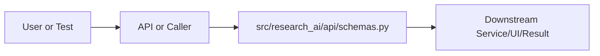

# schemas.py Explained

Generated educational companion for `src/research_ai/api/schemas.py`. This file is intentionally detailed so a developer can understand the code, architecture role, production tradeoffs, and ML/backend concepts behind the implementation.

## File Overview

`src/research_ai/api/schemas.py` is a Python module in the API layer: validates HTTP payloads, exposes endpoints, and serializes responses. It defines ClassifyRequest, SearchRequest, SummarizeRequest, AskRequest, AgentRequest, MediatorMeta, MediatedAgentResponse, ArxivLoadRequest, PaperChatRequest, SimilarityRequest, BulkChatRequest, PythonExecutionRequest, MetadataAnalyseRequest, CitationProxyRequest, PipelineRequest, ChatMessageRequest, SourcePaper, ChatMessageResponse, ModelInfo, ModelsListResponse and no top-level functions.

## Why This File Exists

This file isolates one responsibility in the codebase: API layer: validates HTTP payloads, exposes endpoints, and serializes responses. Separation matters because AI systems are easier to test, scale, debug, and explain when retrieval, orchestration, ML services, memory, UI, and deployment scripts have clear boundaries.

## Workflow Position

**Layer:** API layer: validates HTTP payloads, exposes endpoints, and serializes responses.

**Previous step:** caller code, an API request, a browser event, a test fixture, an import, or a startup script prepares inputs.

**Current step:** `src/research_ai/api/schemas.py` performs its local responsibility.

**Next step:** downstream services, API responses, rendered UI, tests, or process execution consume the result.



## Inputs and Outputs

- **Inputs:** function arguments, class constructor dependencies, HTTP payloads, environment variables, filesystem artifacts, DOM events, or test fixtures.
- **Outputs:** return values, dictionaries, Pydantic models, rendered DOM state, API responses, logs, process startup, assertions, or side effects.
- **Serialization:** this project uses JSON for APIs/LLM planning, parquet/joblib/faiss for ML artifacts, and HTML/CSS/JS for the browser surface.

## Imports Explained

| Import | Explanation |
|---|---|
| `__future__` | Project or standard-library dependency used to import a service, type, helper, or runtime capability. Imports affect startup time, packaging, and test isolation. |
| `pydantic` | Pydantic validates and serializes request/response schemas. It protects service code from malformed JSON and documents API contracts. |

## Global Variables and Config

No major module-level variables are declared. This reduces hidden state and keeps imports lightweight.

## Step-by-Step Workflow

1. Load dependencies and runtime constants.
2. Accept input from the previous layer.
3. Validate, transform, route, score, render, or execute according to this file's role.
4. Return a structured output or perform a controlled side effect.
5. Let caller layers handle presentation, persistence, retries, or fallback.

## Function-by-Function Breakdown

No top-level functions are defined. Behavior is class-based, declarative, or provided through package exports.

## Class-by-Class Breakdown

### `ClassifyRequest`

- **Line:** 7
- **Base classes:** `BaseModel`
- **Docstring:** No explicit class docstring.

**Methods:**
- `coerce_str` at line 13: method behavior is described by its body and name

```python
class ClassifyRequest(BaseModel):
    title: str = Field(default="")
    abstract: str = Field(default="")

    @field_validator("title", "abstract", mode="before")
    @classmethod
    def coerce_str(cls, value):
        return str(value) if value is not None else ""
```

This class packages state and behavior behind a service-style interface. Constructor dependencies show what the class needs; public methods show what the rest of the system can ask it to do. In production, this boundary is where caching, model loading, artifact access, and error handling must be controlled.

### `SearchRequest`

- **Line:** 17
- **Base classes:** `BaseModel`
- **Docstring:** No explicit class docstring.

**Methods:**
- No methods beyond inherited behavior.

```python
class SearchRequest(BaseModel):
    query: str = Field(..., min_length=2)
    top_k: int = Field(default=5, ge=1, le=20)
    filters: dict = Field(default_factory=dict)
```

This class packages state and behavior behind a service-style interface. Constructor dependencies show what the class needs; public methods show what the rest of the system can ask it to do. In production, this boundary is where caching, model loading, artifact access, and error handling must be controlled.

### `SummarizeRequest`

- **Line:** 23
- **Base classes:** `BaseModel`
- **Docstring:** No explicit class docstring.

**Methods:**
- No methods beyond inherited behavior.

```python
class SummarizeRequest(BaseModel):
    text: str = Field(..., min_length=5)
```

This class packages state and behavior behind a service-style interface. Constructor dependencies show what the class needs; public methods show what the rest of the system can ask it to do. In production, this boundary is where caching, model loading, artifact access, and error handling must be controlled.

### `AskRequest`

- **Line:** 27
- **Base classes:** `BaseModel`
- **Docstring:** No explicit class docstring.

**Methods:**
- No methods beyond inherited behavior.

```python
class AskRequest(BaseModel):
    query: str = Field(..., min_length=2)
    top_k: int = Field(default=5, ge=1, le=20)
```

This class packages state and behavior behind a service-style interface. Constructor dependencies show what the class needs; public methods show what the rest of the system can ask it to do. In production, this boundary is where caching, model loading, artifact access, and error handling must be controlled.

### `AgentRequest`

- **Line:** 32
- **Base classes:** `BaseModel`
- **Docstring:** No explicit class docstring.

**Methods:**
- No methods beyond inherited behavior.

```python
class AgentRequest(BaseModel):
    query: str = Field(..., min_length=1)
    mode: str = Field(default="auto")
    title: str | None = None
    abstract: str | None = None
    top_k: int = Field(default=5, ge=1, le=20)
    text: str | None = None
    session_id: str | None = None
```

This class packages state and behavior behind a service-style interface. Constructor dependencies show what the class needs; public methods show what the rest of the system can ask it to do. In production, this boundary is where caching, model loading, artifact access, and error handling must be controlled.

### `MediatorMeta`

- **Line:** 42
- **Base classes:** `BaseModel`
- **Docstring:** No explicit class docstring.

**Methods:**
- No methods beyond inherited behavior.

```python
class MediatorMeta(BaseModel):
    reason: str = ""
    used_fallback: bool = False
```

This class packages state and behavior behind a service-style interface. Constructor dependencies show what the class needs; public methods show what the rest of the system can ask it to do. In production, this boundary is where caching, model loading, artifact access, and error handling must be controlled.

### `MediatedAgentResponse`

- **Line:** 47
- **Base classes:** `BaseModel`
- **Docstring:** No explicit class docstring.

**Methods:**
- No methods beyond inherited behavior.

```python
class MediatedAgentResponse(BaseModel):
    request_id: str
    mode: str
    mediator: MediatorMeta
    executor_output: dict
    final_answer: str
    latency_ms: float
```

This class packages state and behavior behind a service-style interface. Constructor dependencies show what the class needs; public methods show what the rest of the system can ask it to do. In production, this boundary is where caching, model loading, artifact access, and error handling must be controlled.

### `ArxivLoadRequest`

- **Line:** 56
- **Base classes:** `BaseModel`
- **Docstring:** No explicit class docstring.

**Methods:**
- No methods beyond inherited behavior.

```python
class ArxivLoadRequest(BaseModel):
    arxiv_id: str = Field(..., min_length=3)
```

This class packages state and behavior behind a service-style interface. Constructor dependencies show what the class needs; public methods show what the rest of the system can ask it to do. In production, this boundary is where caching, model loading, artifact access, and error handling must be controlled.

### `PaperChatRequest`

- **Line:** 60
- **Base classes:** `BaseModel`
- **Docstring:** No explicit class docstring.

**Methods:**
- No methods beyond inherited behavior.

```python
class PaperChatRequest(BaseModel):
    session_id: str = Field(..., min_length=1)
    question: str = Field(..., min_length=1)
    top_k: int = Field(default=5, ge=1, le=20)
```

This class packages state and behavior behind a service-style interface. Constructor dependencies show what the class needs; public methods show what the rest of the system can ask it to do. In production, this boundary is where caching, model loading, artifact access, and error handling must be controlled.

### `SimilarityRequest`

- **Line:** 66
- **Base classes:** `BaseModel`
- **Docstring:** No explicit class docstring.

**Methods:**
- No methods beyond inherited behavior.

```python
class SimilarityRequest(BaseModel):
    text_a: str = Field(..., min_length=5)
    text_b: str = Field(..., min_length=5)
```

This class packages state and behavior behind a service-style interface. Constructor dependencies show what the class needs; public methods show what the rest of the system can ask it to do. In production, this boundary is where caching, model loading, artifact access, and error handling must be controlled.

### `BulkChatRequest`

- **Line:** 71
- **Base classes:** `BaseModel`
- **Docstring:** No explicit class docstring.

**Methods:**
- `non_empty_ids` at line 77: method behavior is described by its body and name

```python
class BulkChatRequest(BaseModel):
    arxiv_ids: list[str] = Field(..., min_length=1)
    question: str = Field(default="")

    @field_validator("arxiv_ids")
    @classmethod
    def non_empty_ids(cls, value: list[str]) -> list[str]:
        cleaned = [item.strip() for item in value if item.strip()]
        if not cleaned:
            raise ValueError("arxiv_ids must contain at least one non-empty ID.")
        return cleaned
```

This class packages state and behavior behind a service-style interface. Constructor dependencies show what the class needs; public methods show what the rest of the system can ask it to do. In production, this boundary is where caching, model loading, artifact access, and error handling must be controlled.

### `PythonExecutionRequest`

- **Line:** 84
- **Base classes:** `BaseModel`
- **Docstring:** No explicit class docstring.

**Methods:**
- No methods beyond inherited behavior.

```python
class PythonExecutionRequest(BaseModel):
    code: str = Field(..., min_length=1, max_length=4000)
```

This class packages state and behavior behind a service-style interface. Constructor dependencies show what the class needs; public methods show what the rest of the system can ask it to do. In production, this boundary is where caching, model loading, artifact access, and error handling must be controlled.

### `MetadataAnalyseRequest`

- **Line:** 88
- **Base classes:** `BaseModel`
- **Docstring:** Request body for /metadata/analyse — accepts a list of paper dicts.

**Methods:**
- No methods beyond inherited behavior.

```python
class MetadataAnalyseRequest(BaseModel):
    """Request body for /metadata/analyse — accepts a list of paper dicts."""
    papers: list[dict] = Field(..., min_length=1)
```

This class packages state and behavior behind a service-style interface. Constructor dependencies show what the class needs; public methods show what the rest of the system can ask it to do. In production, this boundary is where caching, model loading, artifact access, and error handling must be controlled.

### `CitationProxyRequest`

- **Line:** 93
- **Base classes:** `BaseModel`
- **Docstring:** Request body for citation intelligence endpoints.

**Methods:**
- No methods beyond inherited behavior.

```python
class CitationProxyRequest(BaseModel):
    """Request body for citation intelligence endpoints."""
    papers: list[dict] = Field(..., min_length=1)
```

This class packages state and behavior behind a service-style interface. Constructor dependencies show what the class needs; public methods show what the rest of the system can ask it to do. In production, this boundary is where caching, model loading, artifact access, and error handling must be controlled.

### `PipelineRequest`

- **Line:** 98
- **Base classes:** `BaseModel`
- **Docstring:** Request body for /pipeline/run.

**Methods:**
- No methods beyond inherited behavior.

```python
class PipelineRequest(BaseModel):
    """Request body for /pipeline/run."""
    pipeline_name: str = Field(default="full_research_analysis")
    query: str = Field(..., min_length=2)
    extra_args: dict = Field(default_factory=dict)
```

This class packages state and behavior behind a service-style interface. Constructor dependencies show what the class needs; public methods show what the rest of the system can ask it to do. In production, this boundary is where caching, model loading, artifact access, and error handling must be controlled.

### `ChatMessageRequest`

- **Line:** 113
- **Base classes:** `BaseModel`
- **Docstring:** Request for the unified /chat/message endpoint.

The user only needs to send their natural-language query. All tool
selection, retrieval strategy, model choice, and synthesis is handled
internally by the AI orchestrator.

Fields:
    query           — The user's question or instruction (required)
    conversation_id — Continue an existing conversation (optional).
                      If absent or unknown, a new conversation is started
                      and the ID is returned in the response.
    session_id      — Paper chat session to query against (optional).
                      If provided, the orchestrator will include per-paper
                      context in its reasoning.
    top_k           — Max results to retrieve (optional, default 5).
    debug           — If True, include orchestration trace in response.

**Methods:**
- No methods beyond inherited behavior.

```python
class ChatMessageRequest(BaseModel):
    """Request for the unified /chat/message endpoint.

    The user only needs to send their natural-language query. All tool
    selection, retrieval strategy, model choice, and synthesis is handled
    internally by the AI orchestrator.

    Fields:
        query           — The user's question or instruction (required)
        conversation_id — Continue an existing conversation (optional).
                          If absent or unknown, a new conversation is started
                          and the ID is returned in the response.
        session_id      — Paper chat session to query against (optional).
                          If provided, the orchestrator will include per-paper
                          context in its reasoning.
        top_k           — Max results to retrieve (optional, default 5).
        debug           — If True, include orchestration trace in response.
    """
    query: str = Field(..., min_length=1)
    conversation_id: str | None = Field(default=None)
    session_id: str | None = Field(default=None)
    top_k: int = Field(default=5, ge=1, le=20)
    debug: bool = Field(default=False)
```

This class packages state and behavior behind a service-style interface. Constructor dependencies show what the class needs; public methods show what the rest of the system can ask it to do. In production, this boundary is where caching, model loading, artifact access, and error handling must be controlled.

### `SourcePaper`

- **Line:** 138
- **Base classes:** `BaseModel`
- **Docstring:** A single retrieved paper cited in the response.

**Methods:**
- No methods beyond inherited behavior.

```python
class SourcePaper(BaseModel):
    """A single retrieved paper cited in the response."""
    title: str = Field(default="")
    paper_id: str = Field(default="")
    year: str = Field(default="")
    category: str = Field(default="")
    abstract_snippet: str = Field(default="")
    score: float = Field(default=0.0)
    arxiv_url: str = Field(default="")
```

This class packages state and behavior behind a service-style interface. Constructor dependencies show what the class needs; public methods show what the rest of the system can ask it to do. In production, this boundary is where caching, model loading, artifact access, and error handling must be controlled.

### `ChatMessageResponse`

- **Line:** 149
- **Base classes:** `BaseModel`
- **Docstring:** Response from the unified /chat/message endpoint.

The response bundles:
  - answer         : The AI's conversational response text
  - sources        : List of retrieved papers that grounded the answer
  - confidence     : How well-evidenced the answer is (0–1)
  - conversation_id: The session ID to send back in the next message
  - tools_used     : Which internal tools the orchestrator invoked
  - model_used     : Which Ollama/cloud model generated the synthesis
  - latency_ms     : End-to-end request latency
  - debug_trace    : Full orchestration trace (only if debug=True)

**Methods:**
- No methods beyond inherited behavior.

```python
class ChatMessageResponse(BaseModel):
    """Response from the unified /chat/message endpoint.

    The response bundles:
      - answer         : The AI's conversational response text
      - sources        : List of retrieved papers that grounded the answer
      - confidence     : How well-evidenced the answer is (0–1)
      - conversation_id: The session ID to send back in the next message
      - tools_used     : Which internal tools the orchestrator invoked
      - model_used     : Which Ollama/cloud model generated the synthesis
      - latency_ms     : End-to-end request latency
      - debug_trace    : Full orchestration trace (only if debug=True)
    """
    answer: str
    sources: list[SourcePaper] = Field(default_factory=list)
    confidence: float = Field(default=0.0, ge=0.0, le=1.0)
    conversation_id: str
    intent: str = Field(default="research_analysis")
    tools_used: list[str] = Field(default_factory=list)
    model_used: str = Field(default="")
    latency_ms: float = Field(default=0.0)
    debug_trace: dict | None = Field(default=None)
```

This class packages state and behavior behind a service-style interface. Constructor dependencies show what the class needs; public methods show what the rest of the system can ask it to do. In production, this boundary is where caching, model loading, artifact access, and error handling must be controlled.

### `ModelInfo`

- **Line:** 173
- **Base classes:** `BaseModel`
- **Docstring:** Information about a locally available Ollama model.

**Methods:**
- No methods beyond inherited behavior.

```python
class ModelInfo(BaseModel):
    """Information about a locally available Ollama model."""
    name: str
    tier: int
    tier_label: str
    size_gb: float = Field(default=0.0)
```

This class packages state and behavior behind a service-style interface. Constructor dependencies show what the class needs; public methods show what the rest of the system can ask it to do. In production, this boundary is where caching, model loading, artifact access, and error handling must be controlled.

### `ModelsListResponse`

- **Line:** 181
- **Base classes:** `BaseModel`
- **Docstring:** Response from /models/list.

**Methods:**
- No methods beyond inherited behavior.

```python
class ModelsListResponse(BaseModel):
    """Response from /models/list."""
    available: bool
    models: list[ModelInfo] = Field(default_factory=list)
    default_model: str = Field(default="")
```

This class packages state and behavior behind a service-style interface. Constructor dependencies show what the class needs; public methods show what the rest of the system can ask it to do. In production, this boundary is where caching, model loading, artifact access, and error handling must be controlled.


## Method-by-Method Deep Dive

### Class `ClassifyRequest` Methods

#### `ClassifyRequest.coerce_str`

- **Line:** 13
- **Kind:** synchronous method
- **Arguments:** cls, value
- **Docstring:** No explicit docstring; behavior is inferred from the implementation and call sites.

```python
    def coerce_str(cls, value):
        return str(value) if value is not None else ""
```

This method is part of the class contract. Its inputs show what state or caller data it consumes; its body shows whether it performs pure transformation, model/artifact access, retrieval, I/O, caching, validation, or orchestration. In production review, pay attention to error handling, mutation of `self`, repeated expensive work, and whether return shapes stay stable for downstream callers.

### Class `BulkChatRequest` Methods

#### `BulkChatRequest.non_empty_ids`

- **Line:** 77
- **Kind:** synchronous method
- **Arguments:** cls, value
- **Docstring:** No explicit docstring; behavior is inferred from the implementation and call sites.

```python
    def non_empty_ids(cls, value: list[str]) -> list[str]:
        cleaned = [item.strip() for item in value if item.strip()]
        if not cleaned:
            raise ValueError("arxiv_ids must contain at least one non-empty ID.")
        return cleaned
```

This method is part of the class contract. Its inputs show what state or caller data it consumes; its body shows whether it performs pure transformation, model/artifact access, retrieval, I/O, caching, validation, or orchestration. In production review, pay attention to error handling, mutation of `self`, repeated expensive work, and whether return shapes stay stable for downstream callers.

## Important Algorithms Used

- **RAG**: Retrieval-Augmented Generation retrieves evidence first and asks an LLM to answer from that evidence, reducing hallucination.
- **LLM Inference**: LLM inference sends prompts or chat messages to a model provider and receives generated text under token, latency, and cost constraints.
- **Transformers**: Transformers use tokenization and attention layers for language understanding/generation. They are powerful but memory and latency sensitive.
- **Classification**: Classification maps text or features to discrete labels, supporting category prediction and routing.
- **Calibration**: Calibration makes predicted probabilities better match real correctness rates, which matters for user-facing confidence.
- **Streaming**: Streaming improves perceived latency by sending incremental output instead of waiting for full completion.
- **Sandboxing**: Sandboxing validates and constrains user code before execution, reducing security and stability risk.

## Libraries Used

| Import | Explanation |
|---|---|
| `__future__` | Project or standard-library dependency used to import a service, type, helper, or runtime capability. Imports affect startup time, packaging, and test isolation. |
| `pydantic` | Pydantic validates and serializes request/response schemas. It protects service code from malformed JSON and documents API contracts. |

## ML Concepts Used

- **RAG**: Retrieval-Augmented Generation retrieves evidence first and asks an LLM to answer from that evidence, reducing hallucination.
- **LLM Inference**: LLM inference sends prompts or chat messages to a model provider and receives generated text under token, latency, and cost constraints.
- **Transformers**: Transformers use tokenization and attention layers for language understanding/generation. They are powerful but memory and latency sensitive.
- **Classification**: Classification maps text or features to discrete labels, supporting category prediction and routing.
- **Calibration**: Calibration makes predicted probabilities better match real correctness rates, which matters for user-facing confidence.
- **Streaming**: Streaming improves perceived latency by sending incremental output instead of waiting for full completion.
- **Sandboxing**: Sandboxing validates and constrains user code before execution, reducing security and stability risk.

## Performance and Memory Notes

- Avoid eager loading of heavy ML models unless startup latency is acceptable.
- Cache expensive clients, tokenizers, vector stores, and embeddings carefully.
- Use float32 for embedding vectors because it halves memory compared with float64 and matches FAISS/neural inference expectations.
- Bound prompt length, uploaded content, result counts, and token budgets to control latency and memory.
- Watch copies of large metadata frames, embedding matrices, and file buffers.

## Scalability Notes

- In-memory state works for local demos but needs Redis/database/object storage for multi-worker cloud deployment.
- CPU/GPU inference should often be separated from the web API when traffic grows.
- Retrieval can start exact and move to approximate indexes as corpus size grows.
- Batch operations and cache repeated work to improve throughput.
- Add metrics for latency, errors, fallback frequency, retrieval hit rate, and token usage.

## Production Engineering Notes

- Keep interfaces stable because other files may import this module or depend on its response shape.
- Prefer typed/structured data over free-form strings at service boundaries.
- Log operational context without secrets or huge payloads.
- Make fallback behavior explicit so users get useful output even when LLMs or artifacts fail.
- Keep provider-specific logic behind adapters so Groq/OpenRouter/Google/Ollama can be swapped.

## Common Bugs and Failure Cases

- Missing `.env` values, model artifacts, or Ollama models can trigger degraded behavior.
- Type mismatches occur when LLM-generated tool arguments cross into strict Python code.
- Empty retrieval results must not become hallucinated answers.
- Network calls need timeouts and careful retry behavior.
- Frontend IDs/classes and API schemas are contracts; changing one side without the other breaks workflows.

## Security Considerations

- Deals with execution or subprocesses. Maintain AST validation, isolated mode, timeouts, and least privilege.

## Real Industry Usage

- This pattern appears in enterprise RAG assistants, scientific search tools, internal research copilots, and ML platform demos.
- The layered design mirrors production systems: API facade, orchestration, retrieval, evaluation, synthesis, UI, and deployment.
- Clear separation lets teams replace model providers, improve retrieval, harden security, or redesign UI independently.

## Optimization Opportunities

- Add tracing around each workflow step.
- Strengthen schema validation at boundaries.
- Persist conversation/session state outside process memory.
- Add load tests and adversarial tests for prompt injection, empty evidence, and large uploads.
- Consider approximate vector indexes, reranker models, or batching when corpus/traffic grows.

## How This Connects To Other Files

- `src/research_ai/api/schemas.py` is connected through imports, startup scripts, API routes, frontend selectors, tests, or artifact paths.
- `src/research_ai/platform.py` is the backend composition root.
- `src/research_ai/api/main.py` exposes backend behavior over HTTP.
- Retrieval modules depend on artifacts under `artifacts/`.
- Frontend files depend on stable endpoint and DOM contracts.

## End-to-End Flow Summary

- A user/browser/test/startup event enters the system.
- The relevant layer validates or normalizes input.
- Retrieval, ML, orchestration, execution, or UI rendering happens.
- A structured result, visual state, or process side effect is produced.
- Fallbacks and tests keep behavior understandable when dependencies are unavailable.

## Interview Questions

1. What responsibility does this file own?
2. What inputs and outputs define its contract?
3. Which dependencies are expensive or operationally risky?
4. What breaks if this file changes shape?
5. How would you scale or test this behavior in production?

## Key Takeaways

- `src/research_ai/api/schemas.py` should be understood as part of a layered AI research platform.
- Trace data flow from inputs to transformations to outputs.
- Production readiness comes from explicit contracts, bounded resources, observability, secure defaults, and graceful fallback.

## Fully Commented Source

This section repeats the original source with an explanatory comment before every line. The comments are educational only; they are not inserted into the production source file.

```python
# L0001: Starts, ends, or continues a docstring that documents module, class, or function intent.
"""Pydantic request/response schemas for the Research AI Platform API."""
# L0002: Enables future Python behavior so annotations/import semantics stay modern and predictable.
from __future__ import annotations
# L0003: Blank line that visually separates logical sections and improves readability.

# L0004: Imports a dependency, type, or project module needed by later code in this file.
from pydantic import BaseModel, Field, field_validator
# L0005: Blank line that visually separates logical sections and improves readability.

# L0006: Blank line that visually separates logical sections and improves readability.

# L0007: Defines a class that groups related state and behavior behind a reusable interface.
class ClassifyRequest(BaseModel):
# L0008: Assigns or updates a value used later in the workflow; check mutability and data shape.
    title: str = Field(default="")
# L0009: Assigns or updates a value used later in the workflow; check mutability and data shape.
    abstract: str = Field(default="")
# L0010: Blank line that visually separates logical sections and improves readability.

# L0011: Decorator that modifies the function/class below, commonly for routing, dataclasses, caching, or properties.
    @field_validator("title", "abstract", mode="before")
# L0012: Decorator that modifies the function/class below, commonly for routing, dataclasses, caching, or properties.
    @classmethod
# L0013: Defines a function or method; parameters are the input contract and the body implements the workflow.
    def coerce_str(cls, value):
# L0014: Returns the computed result to the caller; this shape becomes part of the downstream contract.
        return str(value) if value is not None else ""
# L0015: Blank line that visually separates logical sections and improves readability.

# L0016: Blank line that visually separates logical sections and improves readability.

# L0017: Defines a class that groups related state and behavior behind a reusable interface.
class SearchRequest(BaseModel):
# L0018: Assigns or updates a value used later in the workflow; check mutability and data shape.
    query: str = Field(..., min_length=2)
# L0019: Assigns or updates a value used later in the workflow; check mutability and data shape.
    top_k: int = Field(default=5, ge=1, le=20)
# L0020: Assigns or updates a value used later in the workflow; check mutability and data shape.
    filters: dict = Field(default_factory=dict)
# L0021: Blank line that visually separates logical sections and improves readability.

# L0022: Blank line that visually separates logical sections and improves readability.

# L0023: Defines a class that groups related state and behavior behind a reusable interface.
class SummarizeRequest(BaseModel):
# L0024: Assigns or updates a value used later in the workflow; check mutability and data shape.
    text: str = Field(..., min_length=5)
# L0025: Blank line that visually separates logical sections and improves readability.

# L0026: Blank line that visually separates logical sections and improves readability.

# L0027: Defines a class that groups related state and behavior behind a reusable interface.
class AskRequest(BaseModel):
# L0028: Assigns or updates a value used later in the workflow; check mutability and data shape.
    query: str = Field(..., min_length=2)
# L0029: Assigns or updates a value used later in the workflow; check mutability and data shape.
    top_k: int = Field(default=5, ge=1, le=20)
# L0030: Blank line that visually separates logical sections and improves readability.

# L0031: Blank line that visually separates logical sections and improves readability.

# L0032: Defines a class that groups related state and behavior behind a reusable interface.
class AgentRequest(BaseModel):
# L0033: Assigns or updates a value used later in the workflow; check mutability and data shape.
    query: str = Field(..., min_length=1)
# L0034: Assigns or updates a value used later in the workflow; check mutability and data shape.
    mode: str = Field(default="auto")
# L0035: Assigns or updates a value used later in the workflow; check mutability and data shape.
    title: str | None = None
# L0036: Assigns or updates a value used later in the workflow; check mutability and data shape.
    abstract: str | None = None
# L0037: Assigns or updates a value used later in the workflow; check mutability and data shape.
    top_k: int = Field(default=5, ge=1, le=20)
# L0038: Assigns or updates a value used later in the workflow; check mutability and data shape.
    text: str | None = None
# L0039: Assigns or updates a value used later in the workflow; check mutability and data shape.
    session_id: str | None = None
# L0040: Blank line that visually separates logical sections and improves readability.

# L0041: Blank line that visually separates logical sections and improves readability.

# L0042: Defines a class that groups related state and behavior behind a reusable interface.
class MediatorMeta(BaseModel):
# L0043: Assigns or updates a value used later in the workflow; check mutability and data shape.
    reason: str = ""
# L0044: Assigns or updates a value used later in the workflow; check mutability and data shape.
    used_fallback: bool = False
# L0045: Blank line that visually separates logical sections and improves readability.

# L0046: Blank line that visually separates logical sections and improves readability.

# L0047: Defines a class that groups related state and behavior behind a reusable interface.
class MediatedAgentResponse(BaseModel):
# L0048: Executes Python logic as part of this file's workflow; read surrounding lines for data flow and side effects.
    request_id: str
# L0049: Executes Python logic as part of this file's workflow; read surrounding lines for data flow and side effects.
    mode: str
# L0050: Executes Python logic as part of this file's workflow; read surrounding lines for data flow and side effects.
    mediator: MediatorMeta
# L0051: Executes Python logic as part of this file's workflow; read surrounding lines for data flow and side effects.
    executor_output: dict
# L0052: Executes Python logic as part of this file's workflow; read surrounding lines for data flow and side effects.
    final_answer: str
# L0053: Executes Python logic as part of this file's workflow; read surrounding lines for data flow and side effects.
    latency_ms: float
# L0054: Blank line that visually separates logical sections and improves readability.

# L0055: Blank line that visually separates logical sections and improves readability.

# L0056: Defines a class that groups related state and behavior behind a reusable interface.
class ArxivLoadRequest(BaseModel):
# L0057: Assigns or updates a value used later in the workflow; check mutability and data shape.
    arxiv_id: str = Field(..., min_length=3)
# L0058: Blank line that visually separates logical sections and improves readability.

# L0059: Blank line that visually separates logical sections and improves readability.

# L0060: Defines a class that groups related state and behavior behind a reusable interface.
class PaperChatRequest(BaseModel):
# L0061: Assigns or updates a value used later in the workflow; check mutability and data shape.
    session_id: str = Field(..., min_length=1)
# L0062: Assigns or updates a value used later in the workflow; check mutability and data shape.
    question: str = Field(..., min_length=1)
# L0063: Assigns or updates a value used later in the workflow; check mutability and data shape.
    top_k: int = Field(default=5, ge=1, le=20)
# L0064: Blank line that visually separates logical sections and improves readability.

# L0065: Blank line that visually separates logical sections and improves readability.

# L0066: Defines a class that groups related state and behavior behind a reusable interface.
class SimilarityRequest(BaseModel):
# L0067: Assigns or updates a value used later in the workflow; check mutability and data shape.
    text_a: str = Field(..., min_length=5)
# L0068: Assigns or updates a value used later in the workflow; check mutability and data shape.
    text_b: str = Field(..., min_length=5)
# L0069: Blank line that visually separates logical sections and improves readability.

# L0070: Blank line that visually separates logical sections and improves readability.

# L0071: Defines a class that groups related state and behavior behind a reusable interface.
class BulkChatRequest(BaseModel):
# L0072: Assigns or updates a value used later in the workflow; check mutability and data shape.
    arxiv_ids: list[str] = Field(..., min_length=1)
# L0073: Assigns or updates a value used later in the workflow; check mutability and data shape.
    question: str = Field(default="")
# L0074: Blank line that visually separates logical sections and improves readability.

# L0075: Decorator that modifies the function/class below, commonly for routing, dataclasses, caching, or properties.
    @field_validator("arxiv_ids")
# L0076: Decorator that modifies the function/class below, commonly for routing, dataclasses, caching, or properties.
    @classmethod
# L0077: Defines a function or method; parameters are the input contract and the body implements the workflow.
    def non_empty_ids(cls, value: list[str]) -> list[str]:
# L0078: Assigns or updates a value used later in the workflow; check mutability and data shape.
        cleaned = [item.strip() for item in value if item.strip()]
# L0079: Branches execution based on a condition, usually for validation, fallback, or mode-specific behavior.
        if not cleaned:
# L0080: Raises an explicit error when the function cannot safely continue.
            raise ValueError("arxiv_ids must contain at least one non-empty ID.")
# L0081: Returns the computed result to the caller; this shape becomes part of the downstream contract.
        return cleaned
# L0082: Blank line that visually separates logical sections and improves readability.

# L0083: Blank line that visually separates logical sections and improves readability.

# L0084: Defines a class that groups related state and behavior behind a reusable interface.
class PythonExecutionRequest(BaseModel):
# L0085: Assigns or updates a value used later in the workflow; check mutability and data shape.
    code: str = Field(..., min_length=1, max_length=4000)
# L0086: Blank line that visually separates logical sections and improves readability.

# L0087: Blank line that visually separates logical sections and improves readability.

# L0088: Defines a class that groups related state and behavior behind a reusable interface.
class MetadataAnalyseRequest(BaseModel):
# L0089: Starts, ends, or continues a docstring that documents module, class, or function intent.
    """Request body for /metadata/analyse — accepts a list of paper dicts."""
# L0090: Assigns or updates a value used later in the workflow; check mutability and data shape.
    papers: list[dict] = Field(..., min_length=1)
# L0091: Blank line that visually separates logical sections and improves readability.

# L0092: Blank line that visually separates logical sections and improves readability.

# L0093: Defines a class that groups related state and behavior behind a reusable interface.
class CitationProxyRequest(BaseModel):
# L0094: Starts, ends, or continues a docstring that documents module, class, or function intent.
    """Request body for citation intelligence endpoints."""
# L0095: Assigns or updates a value used later in the workflow; check mutability and data shape.
    papers: list[dict] = Field(..., min_length=1)
# L0096: Blank line that visually separates logical sections and improves readability.

# L0097: Blank line that visually separates logical sections and improves readability.

# L0098: Defines a class that groups related state and behavior behind a reusable interface.
class PipelineRequest(BaseModel):
# L0099: Starts, ends, or continues a docstring that documents module, class, or function intent.
    """Request body for /pipeline/run."""
# L0100: Assigns or updates a value used later in the workflow; check mutability and data shape.
    pipeline_name: str = Field(default="full_research_analysis")
# L0101: Assigns or updates a value used later in the workflow; check mutability and data shape.
    query: str = Field(..., min_length=2)
# L0102: Assigns or updates a value used later in the workflow; check mutability and data shape.
    extra_args: dict = Field(default_factory=dict)
# L0103: Blank line that visually separates logical sections and improves readability.

# L0104: Blank line that visually separates logical sections and improves readability.

# L0105: Developer comment explaining intent, caveat, section boundary, or operational reasoning.
# ---------------------------------------------------------------------------
# L0106: Developer comment explaining intent, caveat, section boundary, or operational reasoning.
# Unified chat endpoint schemas
# L0107: Developer comment explaining intent, caveat, section boundary, or operational reasoning.
# These power the ChatGPT-like /chat/message and /chat/stream endpoints.
# L0108: Developer comment explaining intent, caveat, section boundary, or operational reasoning.
# The user sends only a query (and optionally a conversation_id to continue
# L0109: Developer comment explaining intent, caveat, section boundary, or operational reasoning.
# a prior session). Everything else — retrieval, model selection, pipeline
# L0110: Developer comment explaining intent, caveat, section boundary, or operational reasoning.
# routing — is decided by the AI orchestrator automatically.
# L0111: Developer comment explaining intent, caveat, section boundary, or operational reasoning.
# ---------------------------------------------------------------------------
# L0112: Blank line that visually separates logical sections and improves readability.

# L0113: Defines a class that groups related state and behavior behind a reusable interface.
class ChatMessageRequest(BaseModel):
# L0114: Starts, ends, or continues a docstring that documents module, class, or function intent.
    """Request for the unified /chat/message endpoint.
# L0115: Blank line that visually separates logical sections and improves readability.

# L0116: Executes Python logic as part of this file's workflow; read surrounding lines for data flow and side effects.
    The user only needs to send their natural-language query. All tool
# L0117: Executes Python logic as part of this file's workflow; read surrounding lines for data flow and side effects.
    selection, retrieval strategy, model choice, and synthesis is handled
# L0118: Executes Python logic as part of this file's workflow; read surrounding lines for data flow and side effects.
    internally by the AI orchestrator.
# L0119: Blank line that visually separates logical sections and improves readability.

# L0120: Executes Python logic as part of this file's workflow; read surrounding lines for data flow and side effects.
    Fields:
# L0121: Executes Python logic as part of this file's workflow; read surrounding lines for data flow and side effects.
        query           — The user's question or instruction (required)
# L0122: Executes Python logic as part of this file's workflow; read surrounding lines for data flow and side effects.
        conversation_id — Continue an existing conversation (optional).
# L0123: Executes Python logic as part of this file's workflow; read surrounding lines for data flow and side effects.
                          If absent or unknown, a new conversation is started
# L0124: Executes Python logic as part of this file's workflow; read surrounding lines for data flow and side effects.
                          and the ID is returned in the response.
# L0125: Executes Python logic as part of this file's workflow; read surrounding lines for data flow and side effects.
        session_id      — Paper chat session to query against (optional).
# L0126: Executes Python logic as part of this file's workflow; read surrounding lines for data flow and side effects.
                          If provided, the orchestrator will include per-paper
# L0127: Executes Python logic as part of this file's workflow; read surrounding lines for data flow and side effects.
                          context in its reasoning.
# L0128: Executes Python logic as part of this file's workflow; read surrounding lines for data flow and side effects.
        top_k           — Max results to retrieve (optional, default 5).
# L0129: Executes Python logic as part of this file's workflow; read surrounding lines for data flow and side effects.
        debug           — If True, include orchestration trace in response.
# L0130: Starts, ends, or continues a docstring that documents module, class, or function intent.
    """
# L0131: Assigns or updates a value used later in the workflow; check mutability and data shape.
    query: str = Field(..., min_length=1)
# L0132: Assigns or updates a value used later in the workflow; check mutability and data shape.
    conversation_id: str | None = Field(default=None)
# L0133: Assigns or updates a value used later in the workflow; check mutability and data shape.
    session_id: str | None = Field(default=None)
# L0134: Assigns or updates a value used later in the workflow; check mutability and data shape.
    top_k: int = Field(default=5, ge=1, le=20)
# L0135: Assigns or updates a value used later in the workflow; check mutability and data shape.
    debug: bool = Field(default=False)
# L0136: Blank line that visually separates logical sections and improves readability.

# L0137: Blank line that visually separates logical sections and improves readability.

# L0138: Defines a class that groups related state and behavior behind a reusable interface.
class SourcePaper(BaseModel):
# L0139: Starts, ends, or continues a docstring that documents module, class, or function intent.
    """A single retrieved paper cited in the response."""
# L0140: Assigns or updates a value used later in the workflow; check mutability and data shape.
    title: str = Field(default="")
# L0141: Assigns or updates a value used later in the workflow; check mutability and data shape.
    paper_id: str = Field(default="")
# L0142: Assigns or updates a value used later in the workflow; check mutability and data shape.
    year: str = Field(default="")
# L0143: Assigns or updates a value used later in the workflow; check mutability and data shape.
    category: str = Field(default="")
# L0144: Assigns or updates a value used later in the workflow; check mutability and data shape.
    abstract_snippet: str = Field(default="")
# L0145: Assigns or updates a value used later in the workflow; check mutability and data shape.
    score: float = Field(default=0.0)
# L0146: Assigns or updates a value used later in the workflow; check mutability and data shape.
    arxiv_url: str = Field(default="")
# L0147: Blank line that visually separates logical sections and improves readability.

# L0148: Blank line that visually separates logical sections and improves readability.

# L0149: Defines a class that groups related state and behavior behind a reusable interface.
class ChatMessageResponse(BaseModel):
# L0150: Starts, ends, or continues a docstring that documents module, class, or function intent.
    """Response from the unified /chat/message endpoint.
# L0151: Blank line that visually separates logical sections and improves readability.

# L0152: Executes Python logic as part of this file's workflow; read surrounding lines for data flow and side effects.
    The response bundles:
# L0153: Executes Python logic as part of this file's workflow; read surrounding lines for data flow and side effects.
      - answer         : The AI's conversational response text
# L0154: Executes Python logic as part of this file's workflow; read surrounding lines for data flow and side effects.
      - sources        : List of retrieved papers that grounded the answer
# L0155: Executes Python logic as part of this file's workflow; read surrounding lines for data flow and side effects.
      - confidence     : How well-evidenced the answer is (0–1)
# L0156: Executes Python logic as part of this file's workflow; read surrounding lines for data flow and side effects.
      - conversation_id: The session ID to send back in the next message
# L0157: Executes Python logic as part of this file's workflow; read surrounding lines for data flow and side effects.
      - tools_used     : Which internal tools the orchestrator invoked
# L0158: Executes Python logic as part of this file's workflow; read surrounding lines for data flow and side effects.
      - model_used     : Which Ollama/cloud model generated the synthesis
# L0159: Executes Python logic as part of this file's workflow; read surrounding lines for data flow and side effects.
      - latency_ms     : End-to-end request latency
# L0160: Assigns or updates a value used later in the workflow; check mutability and data shape.
      - debug_trace    : Full orchestration trace (only if debug=True)
# L0161: Starts, ends, or continues a docstring that documents module, class, or function intent.
    """
# L0162: Executes Python logic as part of this file's workflow; read surrounding lines for data flow and side effects.
    answer: str
# L0163: Assigns or updates a value used later in the workflow; check mutability and data shape.
    sources: list[SourcePaper] = Field(default_factory=list)
# L0164: Assigns or updates a value used later in the workflow; check mutability and data shape.
    confidence: float = Field(default=0.0, ge=0.0, le=1.0)
# L0165: Executes Python logic as part of this file's workflow; read surrounding lines for data flow and side effects.
    conversation_id: str
# L0166: Assigns or updates a value used later in the workflow; check mutability and data shape.
    intent: str = Field(default="research_analysis")
# L0167: Assigns or updates a value used later in the workflow; check mutability and data shape.
    tools_used: list[str] = Field(default_factory=list)
# L0168: Assigns or updates a value used later in the workflow; check mutability and data shape.
    model_used: str = Field(default="")
# L0169: Assigns or updates a value used later in the workflow; check mutability and data shape.
    latency_ms: float = Field(default=0.0)
# L0170: Assigns or updates a value used later in the workflow; check mutability and data shape.
    debug_trace: dict | None = Field(default=None)
# L0171: Blank line that visually separates logical sections and improves readability.

# L0172: Blank line that visually separates logical sections and improves readability.

# L0173: Defines a class that groups related state and behavior behind a reusable interface.
class ModelInfo(BaseModel):
# L0174: Starts, ends, or continues a docstring that documents module, class, or function intent.
    """Information about a locally available Ollama model."""
# L0175: Executes Python logic as part of this file's workflow; read surrounding lines for data flow and side effects.
    name: str
# L0176: Executes Python logic as part of this file's workflow; read surrounding lines for data flow and side effects.
    tier: int
# L0177: Executes Python logic as part of this file's workflow; read surrounding lines for data flow and side effects.
    tier_label: str
# L0178: Assigns or updates a value used later in the workflow; check mutability and data shape.
    size_gb: float = Field(default=0.0)
# L0179: Blank line that visually separates logical sections and improves readability.

# L0180: Blank line that visually separates logical sections and improves readability.

# L0181: Defines a class that groups related state and behavior behind a reusable interface.
class ModelsListResponse(BaseModel):
# L0182: Starts, ends, or continues a docstring that documents module, class, or function intent.
    """Response from /models/list."""
# L0183: Executes Python logic as part of this file's workflow; read surrounding lines for data flow and side effects.
    available: bool
# L0184: Assigns or updates a value used later in the workflow; check mutability and data shape.
    models: list[ModelInfo] = Field(default_factory=list)
# L0185: Assigns or updates a value used later in the workflow; check mutability and data shape.
    default_model: str = Field(default="")
```

## Source Walkthrough

The complete source is included because the file is short enough to study directly.

```python
"""Pydantic request/response schemas for the Research AI Platform API."""
from __future__ import annotations

from pydantic import BaseModel, Field, field_validator


class ClassifyRequest(BaseModel):
    title: str = Field(default="")
    abstract: str = Field(default="")

    @field_validator("title", "abstract", mode="before")
    @classmethod
    def coerce_str(cls, value):
        return str(value) if value is not None else ""


class SearchRequest(BaseModel):
    query: str = Field(..., min_length=2)
    top_k: int = Field(default=5, ge=1, le=20)
    filters: dict = Field(default_factory=dict)


class SummarizeRequest(BaseModel):
    text: str = Field(..., min_length=5)


class AskRequest(BaseModel):
    query: str = Field(..., min_length=2)
    top_k: int = Field(default=5, ge=1, le=20)


class AgentRequest(BaseModel):
    query: str = Field(..., min_length=1)
    mode: str = Field(default="auto")
    title: str | None = None
    abstract: str | None = None
    top_k: int = Field(default=5, ge=1, le=20)
    text: str | None = None
    session_id: str | None = None


class MediatorMeta(BaseModel):
    reason: str = ""
    used_fallback: bool = False


class MediatedAgentResponse(BaseModel):
    request_id: str
    mode: str
    mediator: MediatorMeta
    executor_output: dict
    final_answer: str
    latency_ms: float


class ArxivLoadRequest(BaseModel):
    arxiv_id: str = Field(..., min_length=3)


class PaperChatRequest(BaseModel):
    session_id: str = Field(..., min_length=1)
    question: str = Field(..., min_length=1)
    top_k: int = Field(default=5, ge=1, le=20)


class SimilarityRequest(BaseModel):
    text_a: str = Field(..., min_length=5)
    text_b: str = Field(..., min_length=5)


class BulkChatRequest(BaseModel):
    arxiv_ids: list[str] = Field(..., min_length=1)
    question: str = Field(default="")

    @field_validator("arxiv_ids")
    @classmethod
    def non_empty_ids(cls, value: list[str]) -> list[str]:
        cleaned = [item.strip() for item in value if item.strip()]
        if not cleaned:
            raise ValueError("arxiv_ids must contain at least one non-empty ID.")
        return cleaned


class PythonExecutionRequest(BaseModel):
    code: str = Field(..., min_length=1, max_length=4000)


class MetadataAnalyseRequest(BaseModel):
    """Request body for /metadata/analyse — accepts a list of paper dicts."""
    papers: list[dict] = Field(..., min_length=1)


class CitationProxyRequest(BaseModel):
    """Request body for citation intelligence endpoints."""
    papers: list[dict] = Field(..., min_length=1)


class PipelineRequest(BaseModel):
    """Request body for /pipeline/run."""
    pipeline_name: str = Field(default="full_research_analysis")
    query: str = Field(..., min_length=2)
    extra_args: dict = Field(default_factory=dict)


# ---------------------------------------------------------------------------
# Unified chat endpoint schemas
# These power the ChatGPT-like /chat/message and /chat/stream endpoints.
# The user sends only a query (and optionally a conversation_id to continue
# a prior session). Everything else — retrieval, model selection, pipeline
# routing — is decided by the AI orchestrator automatically.
# ---------------------------------------------------------------------------

class ChatMessageRequest(BaseModel):
    """Request for the unified /chat/message endpoint.

    The user only needs to send their natural-language query. All tool
    selection, retrieval strategy, model choice, and synthesis is handled
    internally by the AI orchestrator.

    Fields:
        query           — The user's question or instruction (required)
        conversation_id — Continue an existing conversation (optional).
                          If absent or unknown, a new conversation is started
                          and the ID is returned in the response.
        session_id      — Paper chat session to query against (optional).
                          If provided, the orchestrator will include per-paper
                          context in its reasoning.
        top_k           — Max results to retrieve (optional, default 5).
        debug           — If True, include orchestration trace in response.
    """
    query: str = Field(..., min_length=1)
    conversation_id: str | None = Field(default=None)
    session_id: str | None = Field(default=None)
    top_k: int = Field(default=5, ge=1, le=20)
    debug: bool = Field(default=False)


class SourcePaper(BaseModel):
    """A single retrieved paper cited in the response."""
    title: str = Field(default="")
    paper_id: str = Field(default="")
    year: str = Field(default="")
    category: str = Field(default="")
    abstract_snippet: str = Field(default="")
    score: float = Field(default=0.0)
    arxiv_url: str = Field(default="")


class ChatMessageResponse(BaseModel):
    """Response from the unified /chat/message endpoint.

    The response bundles:
      - answer         : The AI's conversational response text
      - sources        : List of retrieved papers that grounded the answer
      - confidence     : How well-evidenced the answer is (0–1)
      - conversation_id: The session ID to send back in the next message
      - tools_used     : Which internal tools the orchestrator invoked
      - model_used     : Which Ollama/cloud model generated the synthesis
      - latency_ms     : End-to-end request latency
      - debug_trace    : Full orchestration trace (only if debug=True)
    """
    answer: str
    sources: list[SourcePaper] = Field(default_factory=list)
    confidence: float = Field(default=0.0, ge=0.0, le=1.0)
    conversation_id: str
    intent: str = Field(default="research_analysis")
    tools_used: list[str] = Field(default_factory=list)
    model_used: str = Field(default="")
    latency_ms: float = Field(default=0.0)
    debug_trace: dict | None = Field(default=None)


class ModelInfo(BaseModel):
    """Information about a locally available Ollama model."""
    name: str
    tier: int
    tier_label: str
    size_gb: float = Field(default=0.0)


class ModelsListResponse(BaseModel):
    """Response from /models/list."""
    available: bool
    models: list[ModelInfo] = Field(default_factory=list)
    default_model: str = Field(default="")
```
