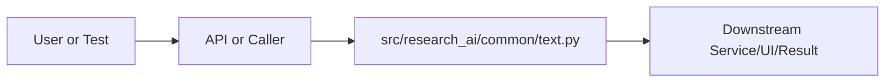

# text.py Explained

Generated educational companion for `src/research_ai/common/text.py`. This file is intentionally detailed so a developer can understand the code, architecture role, production tradeoffs, and ML/backend concepts behind the implementation.

## File Overview

`src/research_ai/common/text.py` is a Python module in the Shared utilities layer. It defines no classes and build_full_text, clean_text, redact_secrets, tokenize_query.

## Why This File Exists

This file isolates one responsibility in the codebase: Shared utilities layer. Separation matters because AI systems are easier to test, scale, debug, and explain when retrieval, orchestration, ML services, memory, UI, and deployment scripts have clear boundaries.

## Workflow Position

**Layer:** Shared utilities layer.

**Previous step:** caller code, an API request, a browser event, a test fixture, an import, or a startup script prepares inputs.

**Current step:** `src/research_ai/common/text.py` performs its local responsibility.

**Next step:** downstream services, API responses, rendered UI, tests, or process execution consume the result.



## Inputs and Outputs

- **Inputs:** function arguments, class constructor dependencies, HTTP payloads, environment variables, filesystem artifacts, DOM events, or test fixtures.
- **Outputs:** return values, dictionaries, Pydantic models, rendered DOM state, API responses, logs, process startup, assertions, or side effects.
- **Serialization:** this project uses JSON for APIs/LLM planning, parquet/joblib/faiss for ML artifacts, and HTML/CSS/JS for the browser surface.

## Imports Explained

| Import | Explanation |
|---|---|
| `__future__` | Project or standard-library dependency used to import a service, type, helper, or runtime capability. Imports affect startup time, packaging, and test isolation. |
| `re` | re implements regular expressions for text extraction, validation, and secret redaction. |

## Global Variables and Config

No major module-level variables are declared. This reduces hidden state and keeps imports lightweight.

## Step-by-Step Workflow

1. Load dependencies and runtime constants.
2. Accept input from the previous layer.
3. Validate, transform, route, score, render, or execute according to this file's role.
4. Return a structured output or perform a controlled side effect.
5. Let caller layers handle presentation, persistence, retries, or fallback.

## Function-by-Function Breakdown

### `build_full_text`

- **Line:** 22
- **Kind:** synchronous function
- **Arguments:** title, abstract
- **Docstring:** No explicit docstring; infer behavior from call sites and body.

```python
def build_full_text(title: str, abstract: str) -> str:
    return f"{title or ''} {abstract or ''}".strip()
```

This function's parameters define its input contract. Its return value or side effect defines how downstream code uses it. Review error handling, resource usage, and whether the function performs CPU work, I/O, model inference, or pure transformation.

### `clean_text`

- **Line:** 26
- **Kind:** synchronous function
- **Arguments:** text, min_token_len
- **Docstring:** No explicit docstring; infer behavior from call sites and body.

```python
def clean_text(text: str, min_token_len: int = 3) -> str:
    value = str(text).lower()
    value = re.sub(r"\$.*?\$", " ", value)
    value = re.sub(r"http\S+|www\.\S+", " ", value)
    value = re.sub(r"\S+@\S+", " ", value)
    value = re.sub(r"[^a-z\s]", " ", value)
    tokens = []
    for token in value.split():
        if token in _STOPWORDS or len(token) < min_token_len:
            continue
        if _LEMMATIZER is not None:
            try:
                token = _LEMMATIZER.lemmatize(token)
            except Exception:
                pass
        tokens.append(token)
    return " ".join(tokens)
```

This function's parameters define its input contract. Its return value or side effect defines how downstream code uses it. Review error handling, resource usage, and whether the function performs CPU work, I/O, model inference, or pure transformation.

### `redact_secrets`

- **Line:** 45
- **Kind:** synchronous function
- **Arguments:** text
- **Docstring:** No explicit docstring; infer behavior from call sites and body.

```python
def redact_secrets(text: str) -> str:
    import os

    value = str(text)
    for env_name in ("GROQ_API_KEY", "OPENROUTER_API_KEY", "GOOGLE_API_KEY"):
        secret = os.getenv(env_name, "")
        if secret:
            value = value.replace(secret, "[redacted]")
    return re.sub(r"([?&]key=)[^&\s')]+", r"\1[redacted]", value)
```

This function's parameters define its input contract. Its return value or side effect defines how downstream code uses it. Review error handling, resource usage, and whether the function performs CPU work, I/O, model inference, or pure transformation.

### `tokenize_query`

- **Line:** 56
- **Kind:** synchronous function
- **Arguments:** text
- **Docstring:** No explicit docstring; infer behavior from call sites and body.

```python
def tokenize_query(text: str) -> set[str]:
    return set(clean_text(text, min_token_len=2).split())
```

This function's parameters define its input contract. Its return value or side effect defines how downstream code uses it. Review error handling, resource usage, and whether the function performs CPU work, I/O, model inference, or pure transformation.


## Class-by-Class Breakdown

No classes are defined. The module relies on functions, constants, imports, or package exports.

## Important Algorithms Used

- **LLM Inference**: LLM inference sends prompts or chat messages to a model provider and receives generated text under token, latency, and cost constraints.

## Libraries Used

| Import | Explanation |
|---|---|
| `__future__` | Project or standard-library dependency used to import a service, type, helper, or runtime capability. Imports affect startup time, packaging, and test isolation. |
| `re` | re implements regular expressions for text extraction, validation, and secret redaction. |

## ML Concepts Used

- **LLM Inference**: LLM inference sends prompts or chat messages to a model provider and receives generated text under token, latency, and cost constraints.

## Performance and Memory Notes

- Avoid eager loading of heavy ML models unless startup latency is acceptable.
- Cache expensive clients, tokenizers, vector stores, and embeddings carefully.
- Use float32 for embedding vectors because it halves memory compared with float64 and matches FAISS/neural inference expectations.
- Bound prompt length, uploaded content, result counts, and token budgets to control latency and memory.
- Watch copies of large metadata frames, embedding matrices, and file buffers.

## Scalability Notes

- In-memory state works for local demos but needs Redis/database/object storage for multi-worker cloud deployment.
- CPU/GPU inference should often be separated from the web API when traffic grows.
- Retrieval can start exact and move to approximate indexes as corpus size grows.
- Batch operations and cache repeated work to improve throughput.
- Add metrics for latency, errors, fallback frequency, retrieval hit rate, and token usage.

## Production Engineering Notes

- Keep interfaces stable because other files may import this module or depend on its response shape.
- Prefer typed/structured data over free-form strings at service boundaries.
- Log operational context without secrets or huge payloads.
- Make fallback behavior explicit so users get useful output even when LLMs or artifacts fail.
- Keep provider-specific logic behind adapters so Groq/OpenRouter/Google/Ollama can be swapped.

## Common Bugs and Failure Cases

- Missing `.env` values, model artifacts, or Ollama models can trigger degraded behavior.
- Type mismatches occur when LLM-generated tool arguments cross into strict Python code.
- Empty retrieval results must not become hallucinated answers.
- Network calls need timeouts and careful retry behavior.
- Frontend IDs/classes and API schemas are contracts; changing one side without the other breaks workflows.

## Security Considerations

- Handles credentials or environment configuration. Keep secrets in environment variables and redact them from logs.
- Performs network I/O. Use timeouts, validate responses, and keep private services such as Ollama off the public internet.

## Real Industry Usage

- This pattern appears in enterprise RAG assistants, scientific search tools, internal research copilots, and ML platform demos.
- The layered design mirrors production systems: API facade, orchestration, retrieval, evaluation, synthesis, UI, and deployment.
- Clear separation lets teams replace model providers, improve retrieval, harden security, or redesign UI independently.

## Optimization Opportunities

- Add tracing around each workflow step.
- Strengthen schema validation at boundaries.
- Persist conversation/session state outside process memory.
- Add load tests and adversarial tests for prompt injection, empty evidence, and large uploads.
- Consider approximate vector indexes, reranker models, or batching when corpus/traffic grows.

## How This Connects To Other Files

- `src/research_ai/common/text.py` is connected through imports, startup scripts, API routes, frontend selectors, tests, or artifact paths.
- `src/research_ai/platform.py` is the backend composition root.
- `src/research_ai/api/main.py` exposes backend behavior over HTTP.
- Retrieval modules depend on artifacts under `artifacts/`.
- Frontend files depend on stable endpoint and DOM contracts.

## End-to-End Flow Summary

- A user/browser/test/startup event enters the system.
- The relevant layer validates or normalizes input.
- Retrieval, ML, orchestration, execution, or UI rendering happens.
- A structured result, visual state, or process side effect is produced.
- Fallbacks and tests keep behavior understandable when dependencies are unavailable.

## Interview Questions

1. What responsibility does this file own?
2. What inputs and outputs define its contract?
3. Which dependencies are expensive or operationally risky?
4. What breaks if this file changes shape?
5. How would you scale or test this behavior in production?

## Key Takeaways

- `src/research_ai/common/text.py` should be understood as part of a layered AI research platform.
- Trace data flow from inputs to transformations to outputs.
- Production readiness comes from explicit contracts, bounded resources, observability, secure defaults, and graceful fallback.

## Fully Commented Source

This section repeats the original source with an explanatory comment before every line. The comments are educational only; they are not inserted into the production source file.

```python
# L0001: Enables future Python behavior so annotations/import semantics stay modern and predictable.
from __future__ import annotations
# L0002: Blank line that visually separates logical sections and improves readability.

# L0003: Imports a dependency, type, or project module needed by later code in this file.
import re
# L0004: Blank line that visually separates logical sections and improves readability.

# L0005: Begins protected execution so failures can be handled without crashing the whole request path.
try:
# L0006: Imports a dependency, type, or project module needed by later code in this file.
    from nltk.corpus import stopwords
# L0007: Imports a dependency, type, or project module needed by later code in this file.
    from nltk.stem import WordNetLemmatizer
# L0008: Blank line that visually separates logical sections and improves readability.

# L0009: Assigns or updates a value used later in the workflow; check mutability and data shape.
    _STOPWORDS = set(stopwords.words("english"))
# L0010: Assigns or updates a value used later in the workflow; check mutability and data shape.
    _LEMMATIZER = WordNetLemmatizer()
# L0011: Handles an expected failure path, often converting exceptions into fallback behavior or API errors.
except Exception:
# L0012: Assigns or updates a value used later in the workflow; check mutability and data shape.
    _STOPWORDS = {
# L0013: Executes Python logic as part of this file's workflow; read surrounding lines for data flow and side effects.
        "a", "an", "and", "are", "as", "at", "be", "by", "for", "from", "has",
# L0014: Executes Python logic as part of this file's workflow; read surrounding lines for data flow and side effects.
        "in", "is", "it", "its", "of", "on", "or", "that", "the", "this", "to",
# L0015: Executes Python logic as part of this file's workflow; read surrounding lines for data flow and side effects.
        "was", "were", "with",
# L0016: Executes Python logic as part of this file's workflow; read surrounding lines for data flow and side effects.
    }
# L0017: Assigns or updates a value used later in the workflow; check mutability and data shape.
    _LEMMATIZER = None
# L0018: Blank line that visually separates logical sections and improves readability.

# L0019: Executes Python logic as part of this file's workflow; read surrounding lines for data flow and side effects.
_STOPWORDS.update({"paper", "study", "approach", "method", "results", "using", "show", "propose"})
# L0020: Blank line that visually separates logical sections and improves readability.

# L0021: Blank line that visually separates logical sections and improves readability.

# L0022: Defines a function or method; parameters are the input contract and the body implements the workflow.
def build_full_text(title: str, abstract: str) -> str:
# L0023: Returns the computed result to the caller; this shape becomes part of the downstream contract.
    return f"{title or ''} {abstract or ''}".strip()
# L0024: Blank line that visually separates logical sections and improves readability.

# L0025: Blank line that visually separates logical sections and improves readability.

# L0026: Defines a function or method; parameters are the input contract and the body implements the workflow.
def clean_text(text: str, min_token_len: int = 3) -> str:
# L0027: Assigns or updates a value used later in the workflow; check mutability and data shape.
    value = str(text).lower()
# L0028: Assigns or updates a value used later in the workflow; check mutability and data shape.
    value = re.sub(r"\$.*?\$", " ", value)
# L0029: Assigns or updates a value used later in the workflow; check mutability and data shape.
    value = re.sub(r"http\S+|www\.\S+", " ", value)
# L0030: Assigns or updates a value used later in the workflow; check mutability and data shape.
    value = re.sub(r"\S+@\S+", " ", value)
# L0031: Assigns or updates a value used later in the workflow; check mutability and data shape.
    value = re.sub(r"[^a-z\s]", " ", value)
# L0032: Assigns or updates a value used later in the workflow; check mutability and data shape.
    tokens = []
# L0033: Iterates over data, retry attempts, files, results, or workflow steps.
    for token in value.split():
# L0034: Branches execution based on a condition, usually for validation, fallback, or mode-specific behavior.
        if token in _STOPWORDS or len(token) < min_token_len:
# L0035: Executes Python logic as part of this file's workflow; read surrounding lines for data flow and side effects.
            continue
# L0036: Branches execution based on a condition, usually for validation, fallback, or mode-specific behavior.
        if _LEMMATIZER is not None:
# L0037: Begins protected execution so failures can be handled without crashing the whole request path.
            try:
# L0038: Assigns or updates a value used later in the workflow; check mutability and data shape.
                token = _LEMMATIZER.lemmatize(token)
# L0039: Handles an expected failure path, often converting exceptions into fallback behavior or API errors.
            except Exception:
# L0040: Explicit no-op placeholder used when no action is required for this branch.
                pass
# L0041: Executes Python logic as part of this file's workflow; read surrounding lines for data flow and side effects.
        tokens.append(token)
# L0042: Returns the computed result to the caller; this shape becomes part of the downstream contract.
    return " ".join(tokens)
# L0043: Blank line that visually separates logical sections and improves readability.

# L0044: Blank line that visually separates logical sections and improves readability.

# L0045: Defines a function or method; parameters are the input contract and the body implements the workflow.
def redact_secrets(text: str) -> str:
# L0046: Imports a dependency, type, or project module needed by later code in this file.
    import os
# L0047: Blank line that visually separates logical sections and improves readability.

# L0048: Assigns or updates a value used later in the workflow; check mutability and data shape.
    value = str(text)
# L0049: Iterates over data, retry attempts, files, results, or workflow steps.
    for env_name in ("GROQ_API_KEY", "OPENROUTER_API_KEY", "GOOGLE_API_KEY"):
# L0050: Assigns or updates a value used later in the workflow; check mutability and data shape.
        secret = os.getenv(env_name, "")
# L0051: Branches execution based on a condition, usually for validation, fallback, or mode-specific behavior.
        if secret:
# L0052: Assigns or updates a value used later in the workflow; check mutability and data shape.
            value = value.replace(secret, "[redacted]")
# L0053: Returns the computed result to the caller; this shape becomes part of the downstream contract.
    return re.sub(r"([?&]key=)[^&\s')]+", r"\1[redacted]", value)
# L0054: Blank line that visually separates logical sections and improves readability.

# L0055: Blank line that visually separates logical sections and improves readability.

# L0056: Defines a function or method; parameters are the input contract and the body implements the workflow.
def tokenize_query(text: str) -> set[str]:
# L0057: Returns the computed result to the caller; this shape becomes part of the downstream contract.
    return set(clean_text(text, min_token_len=2).split())
```

## Source Walkthrough

The complete source is included because the file is short enough to study directly.

```python
from __future__ import annotations

import re

try:
    from nltk.corpus import stopwords
    from nltk.stem import WordNetLemmatizer

    _STOPWORDS = set(stopwords.words("english"))
    _LEMMATIZER = WordNetLemmatizer()
except Exception:
    _STOPWORDS = {
        "a", "an", "and", "are", "as", "at", "be", "by", "for", "from", "has",
        "in", "is", "it", "its", "of", "on", "or", "that", "the", "this", "to",
        "was", "were", "with",
    }
    _LEMMATIZER = None

_STOPWORDS.update({"paper", "study", "approach", "method", "results", "using", "show", "propose"})


def build_full_text(title: str, abstract: str) -> str:
    return f"{title or ''} {abstract or ''}".strip()


def clean_text(text: str, min_token_len: int = 3) -> str:
    value = str(text).lower()
    value = re.sub(r"\$.*?\$", " ", value)
    value = re.sub(r"http\S+|www\.\S+", " ", value)
    value = re.sub(r"\S+@\S+", " ", value)
    value = re.sub(r"[^a-z\s]", " ", value)
    tokens = []
    for token in value.split():
        if token in _STOPWORDS or len(token) < min_token_len:
            continue
        if _LEMMATIZER is not None:
            try:
                token = _LEMMATIZER.lemmatize(token)
            except Exception:
                pass
        tokens.append(token)
    return " ".join(tokens)


def redact_secrets(text: str) -> str:
    import os

    value = str(text)
    for env_name in ("GROQ_API_KEY", "OPENROUTER_API_KEY", "GOOGLE_API_KEY"):
        secret = os.getenv(env_name, "")
        if secret:
            value = value.replace(secret, "[redacted]")
    return re.sub(r"([?&]key=)[^&\s')]+", r"\1[redacted]", value)


def tokenize_query(text: str) -> set[str]:
    return set(clean_text(text, min_token_len=2).split())
```
