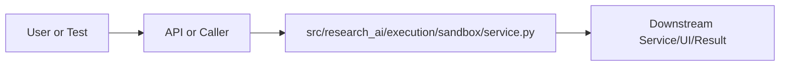

# service.py Explained

Generated educational companion for `src/research_ai/execution/sandbox/service.py`. This file is intentionally detailed so a developer can understand the code, architecture role, production tradeoffs, and ML/backend concepts behind the implementation.

## File Overview

`src/research_ai/execution/sandbox/service.py` is a Python module in the Execution layer: sandboxed Python and predefined analysis pipelines. It defines ValidationResult, SandboxValidator and _build_name_pattern.

## Why This File Exists

This file isolates one responsibility in the codebase: Execution layer: sandboxed Python and predefined analysis pipelines. Separation matters because AI systems are easier to test, scale, debug, and explain when retrieval, orchestration, ML services, memory, UI, and deployment scripts have clear boundaries.

## Workflow Position

**Layer:** Execution layer: sandboxed Python and predefined analysis pipelines.

**Previous step:** caller code, an API request, a browser event, a test fixture, an import, or a startup script prepares inputs.

**Current step:** `src/research_ai/execution/sandbox/service.py` performs its local responsibility.

**Next step:** downstream services, API responses, rendered UI, tests, or process execution consume the result.



## Inputs and Outputs

- **Inputs:** function arguments, class constructor dependencies, HTTP payloads, environment variables, filesystem artifacts, DOM events, or test fixtures.
- **Outputs:** return values, dictionaries, Pydantic models, rendered DOM state, API responses, logs, process startup, assertions, or side effects.
- **Serialization:** this project uses JSON for APIs/LLM planning, parquet/joblib/faiss for ML artifacts, and HTML/CSS/JS for the browser surface.

## Imports Explained

| Import | Explanation |
|---|---|
| `__future__` | Project or standard-library dependency used to import a service, type, helper, or runtime capability. Imports affect startup time, packaging, and test isolation. |
| `ast` | Project or standard-library dependency used to import a service, type, helper, or runtime capability. Imports affect startup time, packaging, and test isolation. |
| `dataclasses` | dataclasses reduce boilerplate for typed configuration/result containers. |
| `logging` | logging provides structured operational visibility without using print statements. |
| `re` | re implements regular expressions for text extraction, validation, and secret redaction. |
| `textwrap` | Project or standard-library dependency used to import a service, type, helper, or runtime capability. Imports affect startup time, packaging, and test isolation. |

## Global Variables and Config

| Name | Line | Why it matters |
|---|---:|---|
| `logger` | 66 | Module-level value, constant, prompt, cache, registry, or configuration point. Check mutability and startup cost. |
| `_FORBIDDEN_NAME_PATTERNS` | 72 | Module-level value, constant, prompt, cache, registry, or configuration point. Check mutability and startup cost. |

## Step-by-Step Workflow

1. Load dependencies and runtime constants.
2. Accept input from the previous layer.
3. Validate, transform, route, score, render, or execute according to this file's role.
4. Return a structured output or perform a controlled side effect.
5. Let caller layers handle presentation, persistence, retries, or fallback.

## Function-by-Function Breakdown

### `_build_name_pattern`

- **Line:** 75
- **Kind:** synchronous function
- **Arguments:** name
- **Docstring:** Return a compiled regex that matches `name` as a whole word.

```python
def _build_name_pattern(name: str) -> re.Pattern:
    """Return a compiled regex that matches `name` as a whole word."""
    return re.compile(r"\b" + re.escape(name) + r"\b", re.IGNORECASE)
```

This function's parameters define its input contract. Its return value or side effect defines how downstream code uses it. Review error handling, resource usage, and whether the function performs CPU work, I/O, model inference, or pure transformation.


## Class-by-Class Breakdown

### `ValidationResult`

- **Line:** 81
- **Base classes:** `object`
- **Docstring:** No explicit class docstring.

**Methods:**
- `to_dict` at line 86: method behavior is described by its body and name

```python
class ValidationResult:
    ok: bool
    issues: list[str]
    ast_node_count: int = 0

    def to_dict(self) -> dict:
        return {
            "ok": self.ok,
            "issues": self.issues,
            "ast_node_count": self.ast_node_count,
        }
```

This class packages state and behavior behind a service-style interface. Constructor dependencies show what the class needs; public methods show what the rest of the system can ask it to do. In production, this boundary is where caching, model loading, artifact access, and error handling must be controlled.

### `SandboxValidator`

- **Line:** 94
- **Base classes:** `object`
- **Docstring:** Static analysis validator that screens Python code before execution.

Raises no exceptions — returns a ValidationResult with a flag and a
list of human-readable issue descriptions so the caller can decide how
to proceed.

Usage:
    validator = SandboxValidator()
    result = validator.validate(user_code)
    if not result.ok:
        return error_response(result.issues)

**Methods:**
- `validate` at line 136: Validate code and return a ValidationResult.

Checks (in order):
  1. Line count limit
  2. Forbidden whole-word name scan (pre-AST, fast)
  3. AST parse + node type scan
  4. Dunder attribute access detection
  5. Dynamic execution call detection (eval/exec/compile)
  6. AST node count limit
- `sanitize_output` at line 215: Truncate and strip ANSI escape codes from execution output.

max_chars prevents memory bloat from runaway print() loops.
ANSI stripping prevents terminal injection via crafted output.

```python
class SandboxValidator:
    """Static analysis validator that screens Python code before execution.

    Raises no exceptions — returns a ValidationResult with a flag and a
    list of human-readable issue descriptions so the caller can decide how
    to proceed.

    Usage:
        validator = SandboxValidator()
        result = validator.validate(user_code)
        if not result.ok:
            return error_response(result.issues)
    """

    # AST node types that signal dangerous operations.
    # These are Python AST class names (as returned by type(node).__name__).
    FORBIDDEN_NODE_TYPES = frozenset({
        "Import",        # `import os` — any import statement
        "ImportFrom",    # `from os import path` — from-import
        "Delete",        # `del x` — can delete builtins in some contexts
        "Global",        # `global x` — scope escape to module level
        "Nonlocal",      # `nonlocal x` — scope escape to enclosing function
    })

    # Identifiers that must not appear as standalone words in the code.
    # This is a defense-in-depth pre-AST scan.  The AST scan below is the
    # authoritative check; this catches obfuscated cases before parsing.
    #
    # BUG FIX v3.1.1: These are now matched as whole words (regex \b...\b)
    # rather than substrings to prevent false positives.  See module docstring.
    FORBIDDEN_NAMES = frozenset({
        "__import__", "__builtins__", "__class__", "__bases__",
        "open", "eval", "exec", "compile", "input",
        "os", "sys", "subprocess", "socket", "shutil",
        "pathlib", "pickle", "marshal", "ctypes", "cffi",
        "importlib", "pkgutil", "inspect",
    })

    # Code complexity limits — prevent DoS via deeply nested code generation
    MAX_LINES = 120
    MAX_NODES = 800

    def validate(self, code: str) -> ValidationResult:
        """Validate code and return a ValidationResult.

        Checks (in order):
          1. Line count limit
          2. Forbidden whole-word name scan (pre-AST, fast)
          3. AST parse + node type scan
          4. Dunder attribute access detection
          5. Dynamic execution call detection (eval/exec/compile)
          6. AST node count limit
        """
        issues: list[str] = []
        code = textwrap.dedent(code)

        # ------------------------------------------------------------------
        # 1. Line count guard
        # ------------------------------------------------------------------
        lines = code.splitlines()
        if len(lines) > self.MAX_LINES:
            issues.append(f"Code exceeds {self.MAX_LINES} line limit ({len(lines)} lines).")

        # ------------------------------------------------------------------
        # 2. Forbidden name scan — whole-word regex (BUG FIX v3.1.1)
        #
        # Pre-AST string scan catches obfuscated strings before they are
        # parsed.  Using whole-word matching prevents false positives:
        #   - "reopen" does NOT trigger "open"
        #   - "socket_count" does NOT trigger "socket"
        #   - "inspect" as a standalone word IS correctly caught
        # ------------------------------------------------------------------
        for name in self.FORBIDDEN_NAMES:
            pattern = _FORBIDDEN_NAME_PATTERNS.get(name)
            if pattern is None:
                pattern = _build_name_pattern(name)
                _FORBIDDEN_NAME_PATTERNS[name] = pattern
            if pattern.search(code):
                issues.append(f"Forbidden identifier detected: '{name}'.")

        # ------------------------------------------------------------------
        # 3–5. AST-level analysis
        # ------------------------------------------------------------------
        node_count = 0
        try:
            tree = ast.parse(code)
            for node in ast.walk(tree):
                node_count += 1
                node_type = type(node).__name__

                # 3. Structural node type check
                if node_type in self.FORBIDDEN_NODE_TYPES:
                    issues.append(f"Forbidden AST node: {node_type}.")

                # 4. Dunder attribute access: obj.__class__, obj.__dict__, etc.
                #    These provide backdoors to the interpreter's type system.
                if isinstance(node, ast.Attribute) and node.attr.startswith("__"):
                    issues.append(f"Dunder attribute access disallowed: '.{node.attr}'.")

                # 5. Dynamic execution: eval("os.system(...)") bypasses static checks.
                #    exec() and compile() have the same issue.
```

This class packages state and behavior behind a service-style interface. Constructor dependencies show what the class needs; public methods show what the rest of the system can ask it to do. In production, this boundary is where caching, model loading, artifact access, and error handling must be controlled.


## Method-by-Method Deep Dive

### Class `ValidationResult` Methods

#### `ValidationResult.to_dict`

- **Line:** 86
- **Kind:** synchronous method
- **Arguments:** self
- **Docstring:** No explicit docstring; behavior is inferred from the implementation and call sites.

```python
    def to_dict(self) -> dict:
        return {
            "ok": self.ok,
            "issues": self.issues,
            "ast_node_count": self.ast_node_count,
        }
```

This method is part of the class contract. Its inputs show what state or caller data it consumes; its body shows whether it performs pure transformation, model/artifact access, retrieval, I/O, caching, validation, or orchestration. In production review, pay attention to error handling, mutation of `self`, repeated expensive work, and whether return shapes stay stable for downstream callers.

### Class `SandboxValidator` Methods

#### `SandboxValidator.validate`

- **Line:** 136
- **Kind:** synchronous method
- **Arguments:** self, code
- **Docstring:** Validate code and return a ValidationResult.

Checks (in order):
  1. Line count limit
  2. Forbidden whole-word name scan (pre-AST, fast)
  3. AST parse + node type scan
  4. Dunder attribute access detection
  5. Dynamic execution call detection (eval/exec/compile)
  6. AST node count limit

```python
    def validate(self, code: str) -> ValidationResult:
        """Validate code and return a ValidationResult.

        Checks (in order):
          1. Line count limit
          2. Forbidden whole-word name scan (pre-AST, fast)
          3. AST parse + node type scan
          4. Dunder attribute access detection
          5. Dynamic execution call detection (eval/exec/compile)
          6. AST node count limit
        """
        issues: list[str] = []
        code = textwrap.dedent(code)

        # ------------------------------------------------------------------
        # 1. Line count guard
        # ------------------------------------------------------------------
        lines = code.splitlines()
        if len(lines) > self.MAX_LINES:
            issues.append(f"Code exceeds {self.MAX_LINES} line limit ({len(lines)} lines).")

        # ------------------------------------------------------------------
        # 2. Forbidden name scan — whole-word regex (BUG FIX v3.1.1)
        #
        # Pre-AST string scan catches obfuscated strings before they are
        # parsed.  Using whole-word matching prevents false positives:
        #   - "reopen" does NOT trigger "open"
        #   - "socket_count" does NOT trigger "socket"
        #   - "inspect" as a standalone word IS correctly caught
        # ------------------------------------------------------------------
        for name in self.FORBIDDEN_NAMES:
            pattern = _FORBIDDEN_NAME_PATTERNS.get(name)
            if pattern is None:
                pattern = _build_name_pattern(name)
                _FORBIDDEN_NAME_PATTERNS[name] = pattern
            if pattern.search(code):
                issues.append(f"Forbidden identifier detected: '{name}'.")

        # ------------------------------------------------------------------
        # 3–5. AST-level analysis
        # ------------------------------------------------------------------
        node_count = 0
        try:
            tree = ast.parse(code)
            for node in ast.walk(tree):
                node_count += 1
                node_type = type(node).__name__

                # 3. Structural node type check
                if node_type in self.FORBIDDEN_NODE_TYPES:
                    issues.append(f"Forbidden AST node: {node_type}.")

                # 4. Dunder attribute access: obj.__class__, obj.__dict__, etc.
                #    These provide backdoors to the interpreter's type system.
                if isinstance(node, ast.Attribute) and node.attr.startswith("__"):
                    issues.append(f"Dunder attribute access disallowed: '.{node.attr}'.")

                # 5. Dynamic execution: eval("os.system(...)") bypasses static checks.
                #    exec() and compile() have the same issue.
                if isinstance(node, ast.Call):
                    func = node.func
                    if isinstance(func, ast.Name) and func.id in ("eval", "exec", "compile"):
                        issues.append(f"Dynamic execution call disallowed: {func.id}().")

        except SyntaxError as exc:
            issues.append(f"Syntax error: {exc}")

        # ------------------------------------------------------------------
        # 6. AST complexity limit
        # ------------------------------------------------------------------
        if node_count > self.MAX_NODES:
```

This method is part of the class contract. Its inputs show what state or caller data it consumes; its body shows whether it performs pure transformation, model/artifact access, retrieval, I/O, caching, validation, or orchestration. In production review, pay attention to error handling, mutation of `self`, repeated expensive work, and whether return shapes stay stable for downstream callers.

#### `SandboxValidator.sanitize_output`

- **Line:** 215
- **Kind:** synchronous method
- **Arguments:** text, max_chars
- **Docstring:** Truncate and strip ANSI escape codes from execution output.

max_chars prevents memory bloat from runaway print() loops.
ANSI stripping prevents terminal injection via crafted output.

```python
    def sanitize_output(text: str, max_chars: int = 8000) -> str:
        """Truncate and strip ANSI escape codes from execution output.

        max_chars prevents memory bloat from runaway print() loops.
        ANSI stripping prevents terminal injection via crafted output.
        """
        cleaned = text[:max_chars]
        cleaned = re.sub(r"\x1b\[[0-9;]*m", "", cleaned)
        return cleaned
```

This method is part of the class contract. Its inputs show what state or caller data it consumes; its body shows whether it performs pure transformation, model/artifact access, retrieval, I/O, caching, validation, or orchestration. In production review, pay attention to error handling, mutation of `self`, repeated expensive work, and whether return shapes stay stable for downstream callers.

## Important Algorithms Used

- **Streaming**: Streaming improves perceived latency by sending incremental output instead of waiting for full completion.
- **Sandboxing**: Sandboxing validates and constrains user code before execution, reducing security and stability risk.

## Libraries Used

| Import | Explanation |
|---|---|
| `__future__` | Project or standard-library dependency used to import a service, type, helper, or runtime capability. Imports affect startup time, packaging, and test isolation. |
| `ast` | Project or standard-library dependency used to import a service, type, helper, or runtime capability. Imports affect startup time, packaging, and test isolation. |
| `dataclasses` | dataclasses reduce boilerplate for typed configuration/result containers. |
| `logging` | logging provides structured operational visibility without using print statements. |
| `re` | re implements regular expressions for text extraction, validation, and secret redaction. |
| `textwrap` | Project or standard-library dependency used to import a service, type, helper, or runtime capability. Imports affect startup time, packaging, and test isolation. |

## ML Concepts Used

- **Streaming**: Streaming improves perceived latency by sending incremental output instead of waiting for full completion.
- **Sandboxing**: Sandboxing validates and constrains user code before execution, reducing security and stability risk.

## Performance and Memory Notes

- Avoid eager loading of heavy ML models unless startup latency is acceptable.
- Cache expensive clients, tokenizers, vector stores, and embeddings carefully.
- Use float32 for embedding vectors because it halves memory compared with float64 and matches FAISS/neural inference expectations.
- Bound prompt length, uploaded content, result counts, and token budgets to control latency and memory.
- Watch copies of large metadata frames, embedding matrices, and file buffers.

## Scalability Notes

- In-memory state works for local demos but needs Redis/database/object storage for multi-worker cloud deployment.
- CPU/GPU inference should often be separated from the web API when traffic grows.
- Retrieval can start exact and move to approximate indexes as corpus size grows.
- Batch operations and cache repeated work to improve throughput.
- Add metrics for latency, errors, fallback frequency, retrieval hit rate, and token usage.

## Production Engineering Notes

- Keep interfaces stable because other files may import this module or depend on its response shape.
- Prefer typed/structured data over free-form strings at service boundaries.
- Log operational context without secrets or huge payloads.
- Make fallback behavior explicit so users get useful output even when LLMs or artifacts fail.
- Keep provider-specific logic behind adapters so Groq/OpenRouter/Google/Ollama can be swapped.

## Common Bugs and Failure Cases

- Missing `.env` values, model artifacts, or Ollama models can trigger degraded behavior.
- Type mismatches occur when LLM-generated tool arguments cross into strict Python code.
- Empty retrieval results must not become hallucinated answers.
- Network calls need timeouts and careful retry behavior.
- Frontend IDs/classes and API schemas are contracts; changing one side without the other breaks workflows.

## Security Considerations

- Touches files or paths. Validate filenames, restrict upload size/type, and prevent traversal.
- Deals with execution or subprocesses. Maintain AST validation, isolated mode, timeouts, and least privilege.

## Real Industry Usage

- This pattern appears in enterprise RAG assistants, scientific search tools, internal research copilots, and ML platform demos.
- The layered design mirrors production systems: API facade, orchestration, retrieval, evaluation, synthesis, UI, and deployment.
- Clear separation lets teams replace model providers, improve retrieval, harden security, or redesign UI independently.

## Optimization Opportunities

- Add tracing around each workflow step.
- Strengthen schema validation at boundaries.
- Persist conversation/session state outside process memory.
- Add load tests and adversarial tests for prompt injection, empty evidence, and large uploads.
- Consider approximate vector indexes, reranker models, or batching when corpus/traffic grows.

## How This Connects To Other Files

- `src/research_ai/execution/sandbox/service.py` is connected through imports, startup scripts, API routes, frontend selectors, tests, or artifact paths.
- `src/research_ai/platform.py` is the backend composition root.
- `src/research_ai/api/main.py` exposes backend behavior over HTTP.
- Retrieval modules depend on artifacts under `artifacts/`.
- Frontend files depend on stable endpoint and DOM contracts.

## End-to-End Flow Summary

- A user/browser/test/startup event enters the system.
- The relevant layer validates or normalizes input.
- Retrieval, ML, orchestration, execution, or UI rendering happens.
- A structured result, visual state, or process side effect is produced.
- Fallbacks and tests keep behavior understandable when dependencies are unavailable.

## Interview Questions

1. What responsibility does this file own?
2. What inputs and outputs define its contract?
3. Which dependencies are expensive or operationally risky?
4. What breaks if this file changes shape?
5. How would you scale or test this behavior in production?

## Key Takeaways

- `src/research_ai/execution/sandbox/service.py` should be understood as part of a layered AI research platform.
- Trace data flow from inputs to transformations to outputs.
- Production readiness comes from explicit contracts, bounded resources, observability, secure defaults, and graceful fallback.

## Fully Commented Source

This section repeats the original source with an explanatory comment before every line. The comments are educational only; they are not inserted into the production source file.

```python
# L0001: Starts, ends, or continues a docstring that documents module, class, or function intent.
"""Execution sandbox — static analysis and code validation layer.
# L0002: Blank line that visually separates logical sections and improves readability.

# L0003: Executes Python logic as part of this file's workflow; read surrounding lines for data flow and side effects.
DEFENCE-IN-DEPTH DESIGN
# L0004: Executes Python logic as part of this file's workflow; read surrounding lines for data flow and side effects.
------------------------
# L0005: Executes Python logic as part of this file's workflow; read surrounding lines for data flow and side effects.
This module is Layer 1 of a two-layer sandbox:
# L0006: Executes Python logic as part of this file's workflow; read surrounding lines for data flow and side effects.
  Layer 1 (this file): AST-level static analysis — runs BEFORE execution.
# L0007: Executes Python logic as part of this file's workflow; read surrounding lines for data flow and side effects.
  Layer 2 (python_runner.py): subprocess -I with restricted builtins.
# L0008: Blank line that visually separates logical sections and improves readability.

# L0009: Executes Python logic as part of this file's workflow; read surrounding lines for data flow and side effects.
Layer 1 rejects code without running it.  Layer 2 limits what the running
# L0010: Executes Python logic as part of this file's workflow; read surrounding lines for data flow and side effects.
process can do even if Layer 1 misses something.
# L0011: Blank line that visually separates logical sections and improves readability.

# L0012: Executes Python logic as part of this file's workflow; read surrounding lines for data flow and side effects.
This is intentionally a software-layer defence, NOT a container boundary.
# L0013: Executes Python logic as part of this file's workflow; read surrounding lines for data flow and side effects.
For production deployments processing untrusted user code, use:
# L0014: Executes Python logic as part of this file's workflow; read surrounding lines for data flow and side effects.
  - Docker with seccomp/AppArmor profiles
# L0015: Executes Python logic as part of this file's workflow; read surrounding lines for data flow and side effects.
  - gVisor (runsc) for kernel-level isolation
# L0016: Executes Python logic as part of this file's workflow; read surrounding lines for data flow and side effects.
  - Firecracker MicroVMs for strongest isolation
# L0017: Blank line that visually separates logical sections and improves readability.

# L0018: Executes Python logic as part of this file's workflow; read surrounding lines for data flow and side effects.
WHY AST ANALYSIS?
# L0019: Executes Python logic as part of this file's workflow; read surrounding lines for data flow and side effects.
-----------------
# L0020: Executes Python logic as part of this file's workflow; read surrounding lines for data flow and side effects.
String matching on raw source code is insufficient (obfuscation bypasses it).
# L0021: Executes Python logic as part of this file's workflow; read surrounding lines for data flow and side effects.
AST analysis works on the parsed syntax tree — the interpreter's actual view
# L0022: Executes Python logic as part of this file's workflow; read surrounding lines for data flow and side effects.
of the code — making it much harder to bypass with encoding tricks.
# L0023: Blank line that visually separates logical sections and improves readability.

# L0024: Executes Python logic as part of this file's workflow; read surrounding lines for data flow and side effects.
We also do a pre-AST string scan as a fast first-pass for obvious forbidden
# L0025: Executes Python logic as part of this file's workflow; read surrounding lines for data flow and side effects.
names, but the AST scan is the authoritative check.
# L0026: Blank line that visually separates logical sections and improves readability.

# L0027: Executes Python logic as part of this file's workflow; read surrounding lines for data flow and side effects.
FORBIDDEN NAME MATCHING (BUG FIX v3.1.1)
# L0028: Executes Python logic as part of this file's workflow; read surrounding lines for data flow and side effects.
-----------------------------------------
# L0029: Executes Python logic as part of this file's workflow; read surrounding lines for data flow and side effects.
Original code: `if name in lower`
# L0030: Executes Python logic as part of this file's workflow; read surrounding lines for data flow and side effects.
  This is a plain substring search.  "open" would match in:
# L0031: Executes Python logic as part of this file's workflow; read surrounding lines for data flow and side effects.
    - "reopened" → False positive (legitimate variable name)
# L0032: Executes Python logic as part of this file's workflow; read surrounding lines for data flow and side effects.
    - "overlap"  → False positive ("open" not in "overlap"... wait, no:
# L0033: Executes Python logic as part of this file's workflow; read surrounding lines for data flow and side effects.
                   "open" IS NOT in "overlap" — "over" + "lap" ≠ "open")
# L0034: Assigns or updates a value used later in the workflow; check mutability and data shape.
    Actually let me reconsider: "open" in "reopened" = True → False POSITIVE.
# L0035: Assigns or updates a value used later in the workflow; check mutability and data shape.
    "open" in "overlap" = False (o-v-e-r-l-a-p, no "open").
# L0036: Blank line that visually separates logical sections and improves readability.

# L0037: Executes Python logic as part of this file's workflow; read surrounding lines for data flow and side effects.
  Real false-positive examples:
# L0038: Executes Python logic as part of this file's workflow; read surrounding lines for data flow and side effects.
    - variable named `reopen_file` → blocked because "open" is a substring
# L0039: Executes Python logic as part of this file's workflow; read surrounding lines for data flow and side effects.
    - variable `socket_count` would be blocked by "socket"
# L0040: Executes Python logic as part of this file's workflow; read surrounding lines for data flow and side effects.
    - import of `opensearch` library would be flagged by "open"
# L0041: Blank line that visually separates logical sections and improves readability.

# L0042: Executes Python logic as part of this file's workflow; read surrounding lines for data flow and side effects.
Fix: use whole-word regex matching (`\bname\b`) so "open" only matches the
# L0043: Executes Python logic as part of this file's workflow; read surrounding lines for data flow and side effects.
standalone word "open", not "reopen", "opener", etc.  This reduces false
# L0044: Executes Python logic as part of this file's workflow; read surrounding lines for data flow and side effects.
positives while maintaining security against the actual attack surface.
# L0045: Blank line that visually separates logical sections and improves readability.

# L0046: Executes Python logic as part of this file's workflow; read surrounding lines for data flow and side effects.
FORBIDDEN NODE TYPES (AST)
# L0047: Executes Python logic as part of this file's workflow; read surrounding lines for data flow and side effects.
--------------------------
# L0048: Executes Python logic as part of this file's workflow; read surrounding lines for data flow and side effects.
Import / ImportFrom:  Block all imports.  The subprocess already has no
# L0049: Executes Python logic as part of this file's workflow; read surrounding lines for data flow and side effects.
  external packages accessible (run with -I), but imports at the AST level
# L0050: Executes Python logic as part of this file's workflow; read surrounding lines for data flow and side effects.
  are still blocked to prevent code that tries to import standard library
# L0051: Executes Python logic as part of this file's workflow; read surrounding lines for data flow and side effects.
  modules that might exist.
# L0052: Blank line that visually separates logical sections and improves readability.

# L0053: Executes Python logic as part of this file's workflow; read surrounding lines for data flow and side effects.
Delete:   `del x` can delete items from __builtins__ dict in some contexts.
# L0054: Blank line that visually separates logical sections and improves readability.

# L0055: Executes Python logic as part of this file's workflow; read surrounding lines for data flow and side effects.
Global / Nonlocal: scope escape mechanisms that could be used to reach
# L0056: Executes Python logic as part of this file's workflow; read surrounding lines for data flow and side effects.
  outer interpreter namespaces.
# L0057: Starts, ends, or continues a docstring that documents module, class, or function intent.
"""
# L0058: Enables future Python behavior so annotations/import semantics stay modern and predictable.
from __future__ import annotations
# L0059: Blank line that visually separates logical sections and improves readability.

# L0060: Imports a dependency, type, or project module needed by later code in this file.
import ast
# L0061: Imports a dependency, type, or project module needed by later code in this file.
import logging
# L0062: Imports a dependency, type, or project module needed by later code in this file.
import re
# L0063: Imports a dependency, type, or project module needed by later code in this file.
import textwrap
# L0064: Imports a dependency, type, or project module needed by later code in this file.
from dataclasses import dataclass
# L0065: Blank line that visually separates logical sections and improves readability.

# L0066: Assigns or updates a value used later in the workflow; check mutability and data shape.
logger = logging.getLogger(__name__)
# L0067: Blank line that visually separates logical sections and improves readability.

# L0068: Developer comment explaining intent, caveat, section boundary, or operational reasoning.
# Pre-compiled regex for whole-word forbidden name detection.
# L0069: Developer comment explaining intent, caveat, section boundary, or operational reasoning.
# Using word boundaries (\b) prevents "open" from matching "reopen",
# L0070: Developer comment explaining intent, caveat, section boundary, or operational reasoning.
# "socket" from matching "socket_count" within a larger identifier, etc.
# L0071: Developer comment explaining intent, caveat, section boundary, or operational reasoning.
# Built once at module load — reused for every validation call.
# L0072: Assigns or updates a value used later in the workflow; check mutability and data shape.
_FORBIDDEN_NAME_PATTERNS: dict[str, re.Pattern] = {}
# L0073: Blank line that visually separates logical sections and improves readability.

# L0074: Blank line that visually separates logical sections and improves readability.

# L0075: Defines a function or method; parameters are the input contract and the body implements the workflow.
def _build_name_pattern(name: str) -> re.Pattern:
# L0076: Starts, ends, or continues a docstring that documents module, class, or function intent.
    """Return a compiled regex that matches `name` as a whole word."""
# L0077: Returns the computed result to the caller; this shape becomes part of the downstream contract.
    return re.compile(r"\b" + re.escape(name) + r"\b", re.IGNORECASE)
# L0078: Blank line that visually separates logical sections and improves readability.

# L0079: Blank line that visually separates logical sections and improves readability.

# L0080: Decorator that modifies the function/class below, commonly for routing, dataclasses, caching, or properties.
@dataclass
# L0081: Defines a class that groups related state and behavior behind a reusable interface.
class ValidationResult:
# L0082: Executes Python logic as part of this file's workflow; read surrounding lines for data flow and side effects.
    ok: bool
# L0083: Executes Python logic as part of this file's workflow; read surrounding lines for data flow and side effects.
    issues: list[str]
# L0084: Assigns or updates a value used later in the workflow; check mutability and data shape.
    ast_node_count: int = 0
# L0085: Blank line that visually separates logical sections and improves readability.

# L0086: Defines a function or method; parameters are the input contract and the body implements the workflow.
    def to_dict(self) -> dict:
# L0087: Returns the computed result to the caller; this shape becomes part of the downstream contract.
        return {
# L0088: Executes Python logic as part of this file's workflow; read surrounding lines for data flow and side effects.
            "ok": self.ok,
# L0089: Executes Python logic as part of this file's workflow; read surrounding lines for data flow and side effects.
            "issues": self.issues,
# L0090: Executes Python logic as part of this file's workflow; read surrounding lines for data flow and side effects.
            "ast_node_count": self.ast_node_count,
# L0091: Executes Python logic as part of this file's workflow; read surrounding lines for data flow and side effects.
        }
# L0092: Blank line that visually separates logical sections and improves readability.

# L0093: Blank line that visually separates logical sections and improves readability.

# L0094: Defines a class that groups related state and behavior behind a reusable interface.
class SandboxValidator:
# L0095: Starts, ends, or continues a docstring that documents module, class, or function intent.
    """Static analysis validator that screens Python code before execution.
# L0096: Blank line that visually separates logical sections and improves readability.

# L0097: Executes Python logic as part of this file's workflow; read surrounding lines for data flow and side effects.
    Raises no exceptions — returns a ValidationResult with a flag and a
# L0098: Executes Python logic as part of this file's workflow; read surrounding lines for data flow and side effects.
    list of human-readable issue descriptions so the caller can decide how
# L0099: Executes Python logic as part of this file's workflow; read surrounding lines for data flow and side effects.
    to proceed.
# L0100: Blank line that visually separates logical sections and improves readability.

# L0101: Executes Python logic as part of this file's workflow; read surrounding lines for data flow and side effects.
    Usage:
# L0102: Assigns or updates a value used later in the workflow; check mutability and data shape.
        validator = SandboxValidator()
# L0103: Assigns or updates a value used later in the workflow; check mutability and data shape.
        result = validator.validate(user_code)
# L0104: Branches execution based on a condition, usually for validation, fallback, or mode-specific behavior.
        if not result.ok:
# L0105: Returns the computed result to the caller; this shape becomes part of the downstream contract.
            return error_response(result.issues)
# L0106: Starts, ends, or continues a docstring that documents module, class, or function intent.
    """
# L0107: Blank line that visually separates logical sections and improves readability.

# L0108: Developer comment explaining intent, caveat, section boundary, or operational reasoning.
    # AST node types that signal dangerous operations.
# L0109: Developer comment explaining intent, caveat, section boundary, or operational reasoning.
    # These are Python AST class names (as returned by type(node).__name__).
# L0110: Assigns or updates a value used later in the workflow; check mutability and data shape.
    FORBIDDEN_NODE_TYPES = frozenset({
# L0111: Executes Python logic as part of this file's workflow; read surrounding lines for data flow and side effects.
        "Import",        # `import os` — any import statement
# L0112: Executes Python logic as part of this file's workflow; read surrounding lines for data flow and side effects.
        "ImportFrom",    # `from os import path` — from-import
# L0113: Executes Python logic as part of this file's workflow; read surrounding lines for data flow and side effects.
        "Delete",        # `del x` — can delete builtins in some contexts
# L0114: Executes Python logic as part of this file's workflow; read surrounding lines for data flow and side effects.
        "Global",        # `global x` — scope escape to module level
# L0115: Executes Python logic as part of this file's workflow; read surrounding lines for data flow and side effects.
        "Nonlocal",      # `nonlocal x` — scope escape to enclosing function
# L0116: Executes Python logic as part of this file's workflow; read surrounding lines for data flow and side effects.
    })
# L0117: Blank line that visually separates logical sections and improves readability.

# L0118: Developer comment explaining intent, caveat, section boundary, or operational reasoning.
    # Identifiers that must not appear as standalone words in the code.
# L0119: Developer comment explaining intent, caveat, section boundary, or operational reasoning.
    # This is a defense-in-depth pre-AST scan.  The AST scan below is the
# L0120: Developer comment explaining intent, caveat, section boundary, or operational reasoning.
    # authoritative check; this catches obfuscated cases before parsing.
# L0121: Developer comment explaining intent, caveat, section boundary, or operational reasoning.
    #
# L0122: Developer comment explaining intent, caveat, section boundary, or operational reasoning.
    # BUG FIX v3.1.1: These are now matched as whole words (regex \b...\b)
# L0123: Developer comment explaining intent, caveat, section boundary, or operational reasoning.
    # rather than substrings to prevent false positives.  See module docstring.
# L0124: Assigns or updates a value used later in the workflow; check mutability and data shape.
    FORBIDDEN_NAMES = frozenset({
# L0125: Executes Python logic as part of this file's workflow; read surrounding lines for data flow and side effects.
        "__import__", "__builtins__", "__class__", "__bases__",
# L0126: Executes Python logic as part of this file's workflow; read surrounding lines for data flow and side effects.
        "open", "eval", "exec", "compile", "input",
# L0127: Executes Python logic as part of this file's workflow; read surrounding lines for data flow and side effects.
        "os", "sys", "subprocess", "socket", "shutil",
# L0128: Executes Python logic as part of this file's workflow; read surrounding lines for data flow and side effects.
        "pathlib", "pickle", "marshal", "ctypes", "cffi",
# L0129: Executes Python logic as part of this file's workflow; read surrounding lines for data flow and side effects.
        "importlib", "pkgutil", "inspect",
# L0130: Executes Python logic as part of this file's workflow; read surrounding lines for data flow and side effects.
    })
# L0131: Blank line that visually separates logical sections and improves readability.

# L0132: Developer comment explaining intent, caveat, section boundary, or operational reasoning.
    # Code complexity limits — prevent DoS via deeply nested code generation
# L0133: Assigns or updates a value used later in the workflow; check mutability and data shape.
    MAX_LINES = 120
# L0134: Assigns or updates a value used later in the workflow; check mutability and data shape.
    MAX_NODES = 800
# L0135: Blank line that visually separates logical sections and improves readability.

# L0136: Defines a function or method; parameters are the input contract and the body implements the workflow.
    def validate(self, code: str) -> ValidationResult:
# L0137: Starts, ends, or continues a docstring that documents module, class, or function intent.
        """Validate code and return a ValidationResult.
# L0138: Blank line that visually separates logical sections and improves readability.

# L0139: Executes Python logic as part of this file's workflow; read surrounding lines for data flow and side effects.
        Checks (in order):
# L0140: Executes Python logic as part of this file's workflow; read surrounding lines for data flow and side effects.
          1. Line count limit
# L0141: Executes Python logic as part of this file's workflow; read surrounding lines for data flow and side effects.
          2. Forbidden whole-word name scan (pre-AST, fast)
# L0142: Executes Python logic as part of this file's workflow; read surrounding lines for data flow and side effects.
          3. AST parse + node type scan
# L0143: Executes Python logic as part of this file's workflow; read surrounding lines for data flow and side effects.
          4. Dunder attribute access detection
# L0144: Executes Python logic as part of this file's workflow; read surrounding lines for data flow and side effects.
          5. Dynamic execution call detection (eval/exec/compile)
# L0145: Executes Python logic as part of this file's workflow; read surrounding lines for data flow and side effects.
          6. AST node count limit
# L0146: Starts, ends, or continues a docstring that documents module, class, or function intent.
        """
# L0147: Assigns or updates a value used later in the workflow; check mutability and data shape.
        issues: list[str] = []
# L0148: Assigns or updates a value used later in the workflow; check mutability and data shape.
        code = textwrap.dedent(code)
# L0149: Blank line that visually separates logical sections and improves readability.

# L0150: Developer comment explaining intent, caveat, section boundary, or operational reasoning.
        # ------------------------------------------------------------------
# L0151: Developer comment explaining intent, caveat, section boundary, or operational reasoning.
        # 1. Line count guard
# L0152: Developer comment explaining intent, caveat, section boundary, or operational reasoning.
        # ------------------------------------------------------------------
# L0153: Assigns or updates a value used later in the workflow; check mutability and data shape.
        lines = code.splitlines()
# L0154: Branches execution based on a condition, usually for validation, fallback, or mode-specific behavior.
        if len(lines) > self.MAX_LINES:
# L0155: Executes Python logic as part of this file's workflow; read surrounding lines for data flow and side effects.
            issues.append(f"Code exceeds {self.MAX_LINES} line limit ({len(lines)} lines).")
# L0156: Blank line that visually separates logical sections and improves readability.

# L0157: Developer comment explaining intent, caveat, section boundary, or operational reasoning.
        # ------------------------------------------------------------------
# L0158: Developer comment explaining intent, caveat, section boundary, or operational reasoning.
        # 2. Forbidden name scan — whole-word regex (BUG FIX v3.1.1)
# L0159: Developer comment explaining intent, caveat, section boundary, or operational reasoning.
        #
# L0160: Developer comment explaining intent, caveat, section boundary, or operational reasoning.
        # Pre-AST string scan catches obfuscated strings before they are
# L0161: Developer comment explaining intent, caveat, section boundary, or operational reasoning.
        # parsed.  Using whole-word matching prevents false positives:
# L0162: Developer comment explaining intent, caveat, section boundary, or operational reasoning.
        #   - "reopen" does NOT trigger "open"
# L0163: Developer comment explaining intent, caveat, section boundary, or operational reasoning.
        #   - "socket_count" does NOT trigger "socket"
# L0164: Developer comment explaining intent, caveat, section boundary, or operational reasoning.
        #   - "inspect" as a standalone word IS correctly caught
# L0165: Developer comment explaining intent, caveat, section boundary, or operational reasoning.
        # ------------------------------------------------------------------
# L0166: Iterates over data, retry attempts, files, results, or workflow steps.
        for name in self.FORBIDDEN_NAMES:
# L0167: Assigns or updates a value used later in the workflow; check mutability and data shape.
            pattern = _FORBIDDEN_NAME_PATTERNS.get(name)
# L0168: Branches execution based on a condition, usually for validation, fallback, or mode-specific behavior.
            if pattern is None:
# L0169: Assigns or updates a value used later in the workflow; check mutability and data shape.
                pattern = _build_name_pattern(name)
# L0170: Assigns or updates a value used later in the workflow; check mutability and data shape.
                _FORBIDDEN_NAME_PATTERNS[name] = pattern
# L0171: Branches execution based on a condition, usually for validation, fallback, or mode-specific behavior.
            if pattern.search(code):
# L0172: Executes Python logic as part of this file's workflow; read surrounding lines for data flow and side effects.
                issues.append(f"Forbidden identifier detected: '{name}'.")
# L0173: Blank line that visually separates logical sections and improves readability.

# L0174: Developer comment explaining intent, caveat, section boundary, or operational reasoning.
        # ------------------------------------------------------------------
# L0175: Developer comment explaining intent, caveat, section boundary, or operational reasoning.
        # 3–5. AST-level analysis
# L0176: Developer comment explaining intent, caveat, section boundary, or operational reasoning.
        # ------------------------------------------------------------------
# L0177: Assigns or updates a value used later in the workflow; check mutability and data shape.
        node_count = 0
# L0178: Begins protected execution so failures can be handled without crashing the whole request path.
        try:
# L0179: Assigns or updates a value used later in the workflow; check mutability and data shape.
            tree = ast.parse(code)
# L0180: Iterates over data, retry attempts, files, results, or workflow steps.
            for node in ast.walk(tree):
# L0181: Assigns or updates a value used later in the workflow; check mutability and data shape.
                node_count += 1
# L0182: Assigns or updates a value used later in the workflow; check mutability and data shape.
                node_type = type(node).__name__
# L0183: Blank line that visually separates logical sections and improves readability.

# L0184: Developer comment explaining intent, caveat, section boundary, or operational reasoning.
                # 3. Structural node type check
# L0185: Branches execution based on a condition, usually for validation, fallback, or mode-specific behavior.
                if node_type in self.FORBIDDEN_NODE_TYPES:
# L0186: Executes Python logic as part of this file's workflow; read surrounding lines for data flow and side effects.
                    issues.append(f"Forbidden AST node: {node_type}.")
# L0187: Blank line that visually separates logical sections and improves readability.

# L0188: Developer comment explaining intent, caveat, section boundary, or operational reasoning.
                # 4. Dunder attribute access: obj.__class__, obj.__dict__, etc.
# L0189: Developer comment explaining intent, caveat, section boundary, or operational reasoning.
                #    These provide backdoors to the interpreter's type system.
# L0190: Branches execution based on a condition, usually for validation, fallback, or mode-specific behavior.
                if isinstance(node, ast.Attribute) and node.attr.startswith("__"):
# L0191: Executes Python logic as part of this file's workflow; read surrounding lines for data flow and side effects.
                    issues.append(f"Dunder attribute access disallowed: '.{node.attr}'.")
# L0192: Blank line that visually separates logical sections and improves readability.

# L0193: Developer comment explaining intent, caveat, section boundary, or operational reasoning.
                # 5. Dynamic execution: eval("os.system(...)") bypasses static checks.
# L0194: Developer comment explaining intent, caveat, section boundary, or operational reasoning.
                #    exec() and compile() have the same issue.
# L0195: Branches execution based on a condition, usually for validation, fallback, or mode-specific behavior.
                if isinstance(node, ast.Call):
# L0196: Assigns or updates a value used later in the workflow; check mutability and data shape.
                    func = node.func
# L0197: Branches execution based on a condition, usually for validation, fallback, or mode-specific behavior.
                    if isinstance(func, ast.Name) and func.id in ("eval", "exec", "compile"):
# L0198: Executes Python logic as part of this file's workflow; read surrounding lines for data flow and side effects.
                        issues.append(f"Dynamic execution call disallowed: {func.id}().")
# L0199: Blank line that visually separates logical sections and improves readability.

# L0200: Handles an expected failure path, often converting exceptions into fallback behavior or API errors.
        except SyntaxError as exc:
# L0201: Executes Python logic as part of this file's workflow; read surrounding lines for data flow and side effects.
            issues.append(f"Syntax error: {exc}")
# L0202: Blank line that visually separates logical sections and improves readability.

# L0203: Developer comment explaining intent, caveat, section boundary, or operational reasoning.
        # ------------------------------------------------------------------
# L0204: Developer comment explaining intent, caveat, section boundary, or operational reasoning.
        # 6. AST complexity limit
# L0205: Developer comment explaining intent, caveat, section boundary, or operational reasoning.
        # ------------------------------------------------------------------
# L0206: Branches execution based on a condition, usually for validation, fallback, or mode-specific behavior.
        if node_count > self.MAX_NODES:
# L0207: Executes Python logic as part of this file's workflow; read surrounding lines for data flow and side effects.
            issues.append(f"Code AST complexity exceeds limit ({node_count} nodes > {self.MAX_NODES}).")
# L0208: Blank line that visually separates logical sections and improves readability.

# L0209: Branches execution based on a condition, usually for validation, fallback, or mode-specific behavior.
        if issues:
# L0210: Emits structured operational information for debugging, monitoring, or failure diagnosis.
            logger.warning("SandboxValidator rejected code: %s", issues[:3])
# L0211: Blank line that visually separates logical sections and improves readability.

# L0212: Returns the computed result to the caller; this shape becomes part of the downstream contract.
        return ValidationResult(ok=not issues, issues=issues, ast_node_count=node_count)
# L0213: Blank line that visually separates logical sections and improves readability.

# L0214: Decorator that modifies the function/class below, commonly for routing, dataclasses, caching, or properties.
    @staticmethod
# L0215: Defines a function or method; parameters are the input contract and the body implements the workflow.
    def sanitize_output(text: str, max_chars: int = 8000) -> str:
# L0216: Starts, ends, or continues a docstring that documents module, class, or function intent.
        """Truncate and strip ANSI escape codes from execution output.
# L0217: Blank line that visually separates logical sections and improves readability.

# L0218: Executes Python logic as part of this file's workflow; read surrounding lines for data flow and side effects.
        max_chars prevents memory bloat from runaway print() loops.
# L0219: Executes Python logic as part of this file's workflow; read surrounding lines for data flow and side effects.
        ANSI stripping prevents terminal injection via crafted output.
# L0220: Starts, ends, or continues a docstring that documents module, class, or function intent.
        """
# L0221: Assigns or updates a value used later in the workflow; check mutability and data shape.
        cleaned = text[:max_chars]
# L0222: Assigns or updates a value used later in the workflow; check mutability and data shape.
        cleaned = re.sub(r"\x1b\[[0-9;]*m", "", cleaned)
# L0223: Returns the computed result to the caller; this shape becomes part of the downstream contract.
        return cleaned
```

## Source Walkthrough

This file is large, so the opening and closing sections are included here. Use the class/function breakdown above to navigate the middle of the file.

### Opening Section

```python
"""Execution sandbox — static analysis and code validation layer.

DEFENCE-IN-DEPTH DESIGN
------------------------
This module is Layer 1 of a two-layer sandbox:
  Layer 1 (this file): AST-level static analysis — runs BEFORE execution.
  Layer 2 (python_runner.py): subprocess -I with restricted builtins.

Layer 1 rejects code without running it.  Layer 2 limits what the running
process can do even if Layer 1 misses something.

This is intentionally a software-layer defence, NOT a container boundary.
For production deployments processing untrusted user code, use:
  - Docker with seccomp/AppArmor profiles
  - gVisor (runsc) for kernel-level isolation
  - Firecracker MicroVMs for strongest isolation

WHY AST ANALYSIS?
-----------------
String matching on raw source code is insufficient (obfuscation bypasses it).
AST analysis works on the parsed syntax tree — the interpreter's actual view
of the code — making it much harder to bypass with encoding tricks.

We also do a pre-AST string scan as a fast first-pass for obvious forbidden
names, but the AST scan is the authoritative check.

FORBIDDEN NAME MATCHING (BUG FIX v3.1.1)
-----------------------------------------
Original code: `if name in lower`
  This is a plain substring search.  "open" would match in:
    - "reopened" → False positive (legitimate variable name)
    - "overlap"  → False positive ("open" not in "overlap"... wait, no:
                   "open" IS NOT in "overlap" — "over" + "lap" ≠ "open")
    Actually let me reconsider: "open" in "reopened" = True → False POSITIVE.
    "open" in "overlap" = False (o-v-e-r-l-a-p, no "open").

  Real false-positive examples:
    - variable named `reopen_file` → blocked because "open" is a substring
    - variable `socket_count` would be blocked by "socket"
    - import of `opensearch` library would be flagged by "open"

Fix: use whole-word regex matching (`\bname\b`) so "open" only matches the
standalone word "open", not "reopen", "opener", etc.  This reduces false
positives while maintaining security against the actual attack surface.

FORBIDDEN NODE TYPES (AST)
--------------------------
Import / ImportFrom:  Block all imports.  The subprocess already has no
  external packages accessible (run with -I), but imports at the AST level
  are still blocked to prevent code that tries to import standard library
  modules that might exist.

Delete:   `del x` can delete items from __builtins__ dict in some contexts.

Global / Nonlocal: scope escape mechanisms that could be used to reach
  outer interpreter namespaces.
"""
from __future__ import annotations

import ast
import logging
import re
import textwrap
from dataclasses import dataclass

logger = logging.getLogger(__name__)

# Pre-compiled regex for whole-word forbidden name detection.
# Using word boundaries (\b) prevents "open" from matching "reopen",
# "socket" from matching "socket_count" within a larger identifier, etc.
# Built once at module load — reused for every validation call.
_FORBIDDEN_NAME_PATTERNS: dict[str, re.Pattern] = {}


def _build_name_pattern(name: str) -> re.Pattern:
    """Return a compiled regex that matches `name` as a whole word."""
    return re.compile(r"\b" + re.escape(name) + r"\b", re.IGNORECASE)


@dataclass
class ValidationResult:
    ok: bool
    issues: list[str]
    ast_node_count: int = 0

    def to_dict(self) -> dict:
        return {
            "ok": self.ok,
            "issues": self.issues,
            "ast_node_count": self.ast_node_count,
        }


class SandboxValidator:
    """Static analysis validator that screens Python code before execution.

    Raises no exceptions — returns a ValidationResult with a flag and a
    list of human-readable issue descriptions so the caller can decide how
    to proceed.

    Usage:
        validator = SandboxValidator()
        result = validator.validate(user_code)
        if not result.ok:
            return error_response(result.issues)
    """

    # AST node types that signal dangerous operations.
    # These are Python AST class names (as returned by type(node).__name__).
    FORBIDDEN_NODE_TYPES = frozenset({
        "Import",        # `import os` — any import statement
        "ImportFrom",    # `from os import path` — from-import
        "Delete",        # `del x` — can delete builtins in some contexts
        "Global",        # `global x` — scope escape to module level
        "Nonlocal",      # `nonlocal x` — scope escape to enclosing function
    })

    # Identifiers that must not appear as standalone words in the code.
    # This is a defense-in-depth pre-AST scan.  The AST scan below is the
    # authoritative check; this catches obfuscated cases before parsing.
```

### Closing Section

```python
          5. Dynamic execution call detection (eval/exec/compile)
          6. AST node count limit
        """
        issues: list[str] = []
        code = textwrap.dedent(code)

        # ------------------------------------------------------------------
        # 1. Line count guard
        # ------------------------------------------------------------------
        lines = code.splitlines()
        if len(lines) > self.MAX_LINES:
            issues.append(f"Code exceeds {self.MAX_LINES} line limit ({len(lines)} lines).")

        # ------------------------------------------------------------------
        # 2. Forbidden name scan — whole-word regex (BUG FIX v3.1.1)
        #
        # Pre-AST string scan catches obfuscated strings before they are
        # parsed.  Using whole-word matching prevents false positives:
        #   - "reopen" does NOT trigger "open"
        #   - "socket_count" does NOT trigger "socket"
        #   - "inspect" as a standalone word IS correctly caught
        # ------------------------------------------------------------------
        for name in self.FORBIDDEN_NAMES:
            pattern = _FORBIDDEN_NAME_PATTERNS.get(name)
            if pattern is None:
                pattern = _build_name_pattern(name)
                _FORBIDDEN_NAME_PATTERNS[name] = pattern
            if pattern.search(code):
                issues.append(f"Forbidden identifier detected: '{name}'.")

        # ------------------------------------------------------------------
        # 3–5. AST-level analysis
        # ------------------------------------------------------------------
        node_count = 0
        try:
            tree = ast.parse(code)
            for node in ast.walk(tree):
                node_count += 1
                node_type = type(node).__name__

                # 3. Structural node type check
                if node_type in self.FORBIDDEN_NODE_TYPES:
                    issues.append(f"Forbidden AST node: {node_type}.")

                # 4. Dunder attribute access: obj.__class__, obj.__dict__, etc.
                #    These provide backdoors to the interpreter's type system.
                if isinstance(node, ast.Attribute) and node.attr.startswith("__"):
                    issues.append(f"Dunder attribute access disallowed: '.{node.attr}'.")

                # 5. Dynamic execution: eval("os.system(...)") bypasses static checks.
                #    exec() and compile() have the same issue.
                if isinstance(node, ast.Call):
                    func = node.func
                    if isinstance(func, ast.Name) and func.id in ("eval", "exec", "compile"):
                        issues.append(f"Dynamic execution call disallowed: {func.id}().")

        except SyntaxError as exc:
            issues.append(f"Syntax error: {exc}")

        # ------------------------------------------------------------------
        # 6. AST complexity limit
        # ------------------------------------------------------------------
        if node_count > self.MAX_NODES:
            issues.append(f"Code AST complexity exceeds limit ({node_count} nodes > {self.MAX_NODES}).")

        if issues:
            logger.warning("SandboxValidator rejected code: %s", issues[:3])

        return ValidationResult(ok=not issues, issues=issues, ast_node_count=node_count)

    @staticmethod
    def sanitize_output(text: str, max_chars: int = 8000) -> str:
        """Truncate and strip ANSI escape codes from execution output.

        max_chars prevents memory bloat from runaway print() loops.
        ANSI stripping prevents terminal injection via crafted output.
        """
        cleaned = text[:max_chars]
        cleaned = re.sub(r"\x1b\[[0-9;]*m", "", cleaned)
        return cleaned
```
