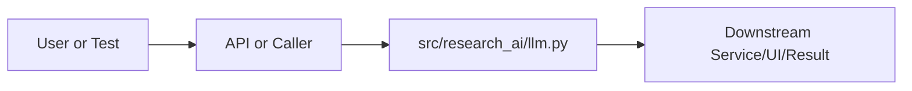

# llm.py Explained

Generated educational companion for `src/research_ai/llm.py`. This file is intentionally detailed so a developer can understand the code, architecture role, production tradeoffs, and ML/backend concepts behind the implementation.

## File Overview

`src/research_ai/llm.py` is a Python module in the Repository support layer. It defines CloudLLMClient and get_cloud_client.

## Why This File Exists

This file isolates one responsibility in the codebase: Repository support layer. Separation matters because AI systems are easier to test, scale, debug, and explain when retrieval, orchestration, ML services, memory, UI, and deployment scripts have clear boundaries.

## Workflow Position

**Layer:** Repository support layer.

**Previous step:** caller code, an API request, a browser event, a test fixture, an import, or a startup script prepares inputs.

**Current step:** `src/research_ai/llm.py` performs its local responsibility.

**Next step:** downstream services, API responses, rendered UI, tests, or process execution consume the result.



## Inputs and Outputs

- **Inputs:** function arguments, class constructor dependencies, HTTP payloads, environment variables, filesystem artifacts, DOM events, or test fixtures.
- **Outputs:** return values, dictionaries, Pydantic models, rendered DOM state, API responses, logs, process startup, assertions, or side effects.
- **Serialization:** this project uses JSON for APIs/LLM planning, parquet/joblib/faiss for ML artifacts, and HTML/CSS/JS for the browser surface.

## Imports Explained

| Import | Explanation |
|---|---|
| `__future__` | Project or standard-library dependency used to import a service, type, helper, or runtime capability. Imports affect startup time, packaging, and test isolation. |
| `logging` | logging provides structured operational visibility without using print statements. |
| `os` | os reads environment variables and process/runtime configuration. |
| `requests` | Requests is the synchronous HTTP client used for outbound LLM, Ollama, arXiv, or provider calls with explicit timeouts. |
| `time` | time measures latency, retry delays, and elapsed operation duration. |

## Global Variables and Config

| Name | Line | Why it matters |
|---|---:|---|
| `logger` | 10 | Module-level value, constant, prompt, cache, registry, or configuration point. Check mutability and startup cost. |
| `_CLIENT_CACHE` | 13 | Module-level value, constant, prompt, cache, registry, or configuration point. Check mutability and startup cost. |

## Step-by-Step Workflow

1. Load dependencies and runtime constants.
2. Accept input from the previous layer.
3. Validate, transform, route, score, render, or execute according to this file's role.
4. Return a structured output or perform a controlled side effect.
5. Let caller layers handle presentation, persistence, retries, or fallback.

## Function-by-Function Breakdown

### `get_cloud_client`

- **Line:** 16
- **Kind:** synchronous function
- **Arguments:** none
- **Docstring:** Return a cached CloudLLMClient or raise ValueError if config is missing.

```python
def get_cloud_client() -> "CloudLLMClient":
    """Return a cached CloudLLMClient or raise ValueError if config is missing."""
    provider = os.getenv("CLOUD_LLM_PROVIDER", "groq").strip().lower()
    if provider not in _CLIENT_CACHE:
        _CLIENT_CACHE[provider] = CloudLLMClient()
    return _CLIENT_CACHE[provider]
```

This function's parameters define its input contract. Its return value or side effect defines how downstream code uses it. Review error handling, resource usage, and whether the function performs CPU work, I/O, model inference, or pure transformation.


## Class-by-Class Breakdown

### `CloudLLMClient`

- **Line:** 24
- **Base classes:** `object`
- **Docstring:** OpenAI-compatible client for Groq / OpenRouter / Google Gemini / Ollama.

Constructed lazily — safe to instantiate even before env vars are set.
Raises ValueError only on the first actual API call when the key is missing.

**Methods:**
- `__init__` at line 36: method behavior is described by its body and name
- `api_key` at line 59: method behavior is described by its body and name
- `_headers` at line 69: method behavior is described by its body and name
- `_post_with_retry` at line 78: method behavior is described by its body and name
- `generate` at line 106: method behavior is described by its body and name
- `chat` at line 138: method behavior is described by its body and name

```python
class CloudLLMClient:
    """OpenAI-compatible client for Groq / OpenRouter / Google Gemini / Ollama.

    Constructed lazily — safe to instantiate even before env vars are set.
    Raises ValueError only on the first actual API call when the key is missing.
    """

    SYSTEM_PROMPT = (
        "You are an expert AI research assistant for scientific analysis. "
        "Be accurate, concise, and explicit about evidence limitations."
    )

    def __init__(self) -> None:
        self.provider = os.getenv("CLOUD_LLM_PROVIDER", "groq").strip().lower()
        if self.provider == "groq":
            self.base_url = os.getenv("GROQ_BASE_URL", "https://api.groq.com/openai/v1")
            self.model = os.getenv("GROQ_MODEL", "llama-3.3-70b-versatile")
            self._api_key_env = "GROQ_API_KEY"
        elif self.provider == "openrouter":
            self.base_url = os.getenv("OPENROUTER_BASE_URL", "https://openrouter.ai/api/v1")
            self.model = os.getenv("OPENROUTER_MODEL", "meta-llama/llama-3.1-8b-instruct:free")
            self._api_key_env = "OPENROUTER_API_KEY"
        elif self.provider == "google":
            self.base_url = os.getenv("GOOGLE_BASE_URL", "https://generativelanguage.googleapis.com/v1beta")
            self.model = os.getenv("GOOGLE_MODEL", "gemini-2.0-flash")
            self._api_key_env = "GOOGLE_API_KEY"
        elif self.provider == "ollama":
            self.base_url = os.getenv("OLLAMA_BASE_URL", "http://localhost:11434/v1")
            self.model = os.getenv("OLLAMA_MODEL", "qwen2.5:3b")
            self._api_key_env = ""  # Ollama needs no key
        else:
            raise ValueError(f"Unsupported CLOUD_LLM_PROVIDER: '{self.provider}'. "
                             f"Choose from: groq, openrouter, google, ollama.")

    @property
    def api_key(self) -> str:
        if self.provider == "ollama":
            return "ollama"  # Ollama accepts any non-empty string
        key = os.getenv(self._api_key_env, "").strip()
        if not key:
            raise ValueError(
                f"Missing API key — set the {self._api_key_env} environment variable."
            )
        return key

    def _headers(self) -> dict[str, str]:
        if self.provider == "google":
            return {"Content-Type": "application/json"}
        headers = {"Authorization": f"Bearer {self.api_key}", "Content-Type": "application/json"}
        if self.provider == "openrouter":
            headers["HTTP-Referer"] = os.getenv("OPENROUTER_REFERER", "http://localhost")
            headers["X-Title"] = os.getenv("OPENROUTER_APP_NAME", "research-ai")
        return headers

    def _post_with_retry(self, url: str, payload: dict, timeout: int = 90, retries: int = 3) -> dict:
        # Ollama runs locally — use a shorter timeout and don't retry on timeouts
        # (retrying a timed-out Ollama request just queues more work and deadlocks the server)
        if self.provider == "ollama":
            timeout = int(os.getenv("OLLAMA_TIMEOUT", "120"))
            retries = 1
        last_exc: Exception | None = None
        for attempt in range(retries):
            try:
                resp = requests.post(url, headers=self._headers(), json=payload, timeout=timeout)
                resp.raise_for_status()
                return resp.json()
            except requests.HTTPError as exc:
                last_exc = exc
                if exc.response is not None and exc.response.status_code in (429, 503):
                    wait = 2 ** attempt
                    logger.warning("LLM rate-limited/unavailable; retrying in %ss (attempt %d).", wait, attempt + 1)
                    time.sleep(wait)
                    continue
                raise
            except requests.Timeout as exc:
                # Don't retry timeouts — they pile up and deadlock local servers
                raise
            except requests.RequestException as exc:
                last_exc = exc
                time.sleep(1)
        raise last_exc or RuntimeError("LLM request failed after all retries.")

    def generate(self, prompt: str, max_tokens: int = 512, system: str | None = None) -> str:
        system_prompt = system or self.SYSTEM_PROMPT
        if self.provider == "google":
            payload = {
                "contents": [{"role": "user", "parts": [{"text": prompt}]}],
                "systemInstruction": {"parts": [{"text": system_prompt}]},
                "generationConfig": {"temperature": 0.15, "maxOutputTokens": max_tokens},
            }
            for model_name in (self.model, "gemini-2.0-flash-lite", "gemini-1.5-flash"):
                url = f"{self.base_url}/models/{model_name}:generateContent?key={self.api_key}"
                try:
                    data = self._post_with_retry(url, payload)
                    parts = data.get("candidates", [{}])[0].get("content", {}).get("parts", [])
                    return "\n".join(p.get("text", "") for p in parts if isinstance(p, dict)).strip()
                except requests.HTTPError as exc:
                    if exc.response is not None and exc.response.status_code == 404:
                        continue
                    raise
            return ""
```

This class packages state and behavior behind a service-style interface. Constructor dependencies show what the class needs; public methods show what the rest of the system can ask it to do. In production, this boundary is where caching, model loading, artifact access, and error handling must be controlled.


## Method-by-Method Deep Dive

### Class `CloudLLMClient` Methods

#### `CloudLLMClient.__init__`

- **Line:** 36
- **Kind:** synchronous method
- **Arguments:** self
- **Docstring:** No explicit docstring; behavior is inferred from the implementation and call sites.

```python
    def __init__(self) -> None:
        self.provider = os.getenv("CLOUD_LLM_PROVIDER", "groq").strip().lower()
        if self.provider == "groq":
            self.base_url = os.getenv("GROQ_BASE_URL", "https://api.groq.com/openai/v1")
            self.model = os.getenv("GROQ_MODEL", "llama-3.3-70b-versatile")
            self._api_key_env = "GROQ_API_KEY"
        elif self.provider == "openrouter":
            self.base_url = os.getenv("OPENROUTER_BASE_URL", "https://openrouter.ai/api/v1")
            self.model = os.getenv("OPENROUTER_MODEL", "meta-llama/llama-3.1-8b-instruct:free")
            self._api_key_env = "OPENROUTER_API_KEY"
        elif self.provider == "google":
            self.base_url = os.getenv("GOOGLE_BASE_URL", "https://generativelanguage.googleapis.com/v1beta")
            self.model = os.getenv("GOOGLE_MODEL", "gemini-2.0-flash")
            self._api_key_env = "GOOGLE_API_KEY"
        elif self.provider == "ollama":
            self.base_url = os.getenv("OLLAMA_BASE_URL", "http://localhost:11434/v1")
            self.model = os.getenv("OLLAMA_MODEL", "qwen2.5:3b")
            self._api_key_env = ""  # Ollama needs no key
        else:
            raise ValueError(f"Unsupported CLOUD_LLM_PROVIDER: '{self.provider}'. "
                             f"Choose from: groq, openrouter, google, ollama.")
```

This method is part of the class contract. Its inputs show what state or caller data it consumes; its body shows whether it performs pure transformation, model/artifact access, retrieval, I/O, caching, validation, or orchestration. In production review, pay attention to error handling, mutation of `self`, repeated expensive work, and whether return shapes stay stable for downstream callers.

#### `CloudLLMClient.api_key`

- **Line:** 59
- **Kind:** synchronous method
- **Arguments:** self
- **Docstring:** No explicit docstring; behavior is inferred from the implementation and call sites.

```python
    def api_key(self) -> str:
        if self.provider == "ollama":
            return "ollama"  # Ollama accepts any non-empty string
        key = os.getenv(self._api_key_env, "").strip()
        if not key:
            raise ValueError(
                f"Missing API key — set the {self._api_key_env} environment variable."
            )
        return key
```

This method is part of the class contract. Its inputs show what state or caller data it consumes; its body shows whether it performs pure transformation, model/artifact access, retrieval, I/O, caching, validation, or orchestration. In production review, pay attention to error handling, mutation of `self`, repeated expensive work, and whether return shapes stay stable for downstream callers.

#### `CloudLLMClient._headers`

- **Line:** 69
- **Kind:** synchronous method
- **Arguments:** self
- **Docstring:** No explicit docstring; behavior is inferred from the implementation and call sites.

```python
    def _headers(self) -> dict[str, str]:
        if self.provider == "google":
            return {"Content-Type": "application/json"}
        headers = {"Authorization": f"Bearer {self.api_key}", "Content-Type": "application/json"}
        if self.provider == "openrouter":
            headers["HTTP-Referer"] = os.getenv("OPENROUTER_REFERER", "http://localhost")
            headers["X-Title"] = os.getenv("OPENROUTER_APP_NAME", "research-ai")
        return headers
```

This method is part of the class contract. Its inputs show what state or caller data it consumes; its body shows whether it performs pure transformation, model/artifact access, retrieval, I/O, caching, validation, or orchestration. In production review, pay attention to error handling, mutation of `self`, repeated expensive work, and whether return shapes stay stable for downstream callers.

#### `CloudLLMClient._post_with_retry`

- **Line:** 78
- **Kind:** synchronous method
- **Arguments:** self, url, payload, timeout, retries
- **Docstring:** No explicit docstring; behavior is inferred from the implementation and call sites.

```python
    def _post_with_retry(self, url: str, payload: dict, timeout: int = 90, retries: int = 3) -> dict:
        # Ollama runs locally — use a shorter timeout and don't retry on timeouts
        # (retrying a timed-out Ollama request just queues more work and deadlocks the server)
        if self.provider == "ollama":
            timeout = int(os.getenv("OLLAMA_TIMEOUT", "120"))
            retries = 1
        last_exc: Exception | None = None
        for attempt in range(retries):
            try:
                resp = requests.post(url, headers=self._headers(), json=payload, timeout=timeout)
                resp.raise_for_status()
                return resp.json()
            except requests.HTTPError as exc:
                last_exc = exc
                if exc.response is not None and exc.response.status_code in (429, 503):
                    wait = 2 ** attempt
                    logger.warning("LLM rate-limited/unavailable; retrying in %ss (attempt %d).", wait, attempt + 1)
                    time.sleep(wait)
                    continue
                raise
            except requests.Timeout as exc:
                # Don't retry timeouts — they pile up and deadlock local servers
                raise
            except requests.RequestException as exc:
                last_exc = exc
                time.sleep(1)
        raise last_exc or RuntimeError("LLM request failed after all retries.")
```

This method is part of the class contract. Its inputs show what state or caller data it consumes; its body shows whether it performs pure transformation, model/artifact access, retrieval, I/O, caching, validation, or orchestration. In production review, pay attention to error handling, mutation of `self`, repeated expensive work, and whether return shapes stay stable for downstream callers.

#### `CloudLLMClient.generate`

- **Line:** 106
- **Kind:** synchronous method
- **Arguments:** self, prompt, max_tokens, system
- **Docstring:** No explicit docstring; behavior is inferred from the implementation and call sites.

```python
    def generate(self, prompt: str, max_tokens: int = 512, system: str | None = None) -> str:
        system_prompt = system or self.SYSTEM_PROMPT
        if self.provider == "google":
            payload = {
                "contents": [{"role": "user", "parts": [{"text": prompt}]}],
                "systemInstruction": {"parts": [{"text": system_prompt}]},
                "generationConfig": {"temperature": 0.15, "maxOutputTokens": max_tokens},
            }
            for model_name in (self.model, "gemini-2.0-flash-lite", "gemini-1.5-flash"):
                url = f"{self.base_url}/models/{model_name}:generateContent?key={self.api_key}"
                try:
                    data = self._post_with_retry(url, payload)
                    parts = data.get("candidates", [{}])[0].get("content", {}).get("parts", [])
                    return "\n".join(p.get("text", "") for p in parts if isinstance(p, dict)).strip()
                except requests.HTTPError as exc:
                    if exc.response is not None and exc.response.status_code == 404:
                        continue
                    raise
            return ""

        payload = {
            "model": self.model,
            "messages": [
                {"role": "system", "content": system_prompt},
                {"role": "user", "content": prompt},
            ],
            "temperature": 0.15,
            "max_tokens": max_tokens,
        }
        data = self._post_with_retry(f"{self.base_url}/chat/completions", payload)
        return data["choices"][0]["message"]["content"].strip()
```

This method is part of the class contract. Its inputs show what state or caller data it consumes; its body shows whether it performs pure transformation, model/artifact access, retrieval, I/O, caching, validation, or orchestration. In production review, pay attention to error handling, mutation of `self`, repeated expensive work, and whether return shapes stay stable for downstream callers.

#### `CloudLLMClient.chat`

- **Line:** 138
- **Kind:** synchronous method
- **Arguments:** self, messages, max_tokens
- **Docstring:** No explicit docstring; behavior is inferred from the implementation and call sites.

```python
    def chat(self, messages: list[dict], max_tokens: int = 512) -> str:
        if self.provider == "google":
            google_messages: list[dict] = []
            system_msg: str | None = None
            for message in messages:
                if message["role"] == "system":
                    system_msg = message["content"]
                else:
                    role = "user" if message["role"] == "user" else "model"
                    google_messages.append({"role": role, "parts": [{"text": message["content"]}]})
            payload: dict = {
                "contents": google_messages,
                "generationConfig": {"temperature": 0.15, "maxOutputTokens": max_tokens},
            }
            if system_msg:
                payload["systemInstruction"] = {"parts": [{"text": system_msg}]}
            data = self._post_with_retry(
                f"{self.base_url}/models/{self.model}:generateContent?key={self.api_key}", payload
            )
            parts = data.get("candidates", [{}])[0].get("content", {}).get("parts", [])
            return "\n".join(p.get("text", "") for p in parts if isinstance(p, dict)).strip()

        payload = {
            "model": self.model,
            "messages": messages,
            "temperature": 0.15,
            "max_tokens": max_tokens,
        }
        data = self._post_with_retry(f"{self.base_url}/chat/completions", payload)
        return data["choices"][0]["message"]["content"].strip()
```

This method is part of the class contract. Its inputs show what state or caller data it consumes; its body shows whether it performs pure transformation, model/artifact access, retrieval, I/O, caching, validation, or orchestration. In production review, pay attention to error handling, mutation of `self`, repeated expensive work, and whether return shapes stay stable for downstream callers.

## Important Algorithms Used

- **LLM Inference**: LLM inference sends prompts or chat messages to a model provider and receives generated text under token, latency, and cost constraints.
- **Caching**: Caching avoids repeating expensive work such as model loading, embedding generation, or client initialization.
- **Sandboxing**: Sandboxing validates and constrains user code before execution, reducing security and stability risk.

## Libraries Used

| Import | Explanation |
|---|---|
| `__future__` | Project or standard-library dependency used to import a service, type, helper, or runtime capability. Imports affect startup time, packaging, and test isolation. |
| `logging` | logging provides structured operational visibility without using print statements. |
| `os` | os reads environment variables and process/runtime configuration. |
| `requests` | Requests is the synchronous HTTP client used for outbound LLM, Ollama, arXiv, or provider calls with explicit timeouts. |
| `time` | time measures latency, retry delays, and elapsed operation duration. |

## ML Concepts Used

- **LLM Inference**: LLM inference sends prompts or chat messages to a model provider and receives generated text under token, latency, and cost constraints.
- **Caching**: Caching avoids repeating expensive work such as model loading, embedding generation, or client initialization.
- **Sandboxing**: Sandboxing validates and constrains user code before execution, reducing security and stability risk.

## Performance and Memory Notes

- Avoid eager loading of heavy ML models unless startup latency is acceptable.
- Cache expensive clients, tokenizers, vector stores, and embeddings carefully.
- Use float32 for embedding vectors because it halves memory compared with float64 and matches FAISS/neural inference expectations.
- Bound prompt length, uploaded content, result counts, and token budgets to control latency and memory.
- Watch copies of large metadata frames, embedding matrices, and file buffers.

## Scalability Notes

- In-memory state works for local demos but needs Redis/database/object storage for multi-worker cloud deployment.
- CPU/GPU inference should often be separated from the web API when traffic grows.
- Retrieval can start exact and move to approximate indexes as corpus size grows.
- Batch operations and cache repeated work to improve throughput.
- Add metrics for latency, errors, fallback frequency, retrieval hit rate, and token usage.

## Production Engineering Notes

- Keep interfaces stable because other files may import this module or depend on its response shape.
- Prefer typed/structured data over free-form strings at service boundaries.
- Log operational context without secrets or huge payloads.
- Make fallback behavior explicit so users get useful output even when LLMs or artifacts fail.
- Keep provider-specific logic behind adapters so Groq/OpenRouter/Google/Ollama can be swapped.

## Common Bugs and Failure Cases

- Missing `.env` values, model artifacts, or Ollama models can trigger degraded behavior.
- Type mismatches occur when LLM-generated tool arguments cross into strict Python code.
- Empty retrieval results must not become hallucinated answers.
- Network calls need timeouts and careful retry behavior.
- Frontend IDs/classes and API schemas are contracts; changing one side without the other breaks workflows.

## Security Considerations

- Handles credentials or environment configuration. Keep secrets in environment variables and redact them from logs.
- Performs network I/O. Use timeouts, validate responses, and keep private services such as Ollama off the public internet.

## Real Industry Usage

- This pattern appears in enterprise RAG assistants, scientific search tools, internal research copilots, and ML platform demos.
- The layered design mirrors production systems: API facade, orchestration, retrieval, evaluation, synthesis, UI, and deployment.
- Clear separation lets teams replace model providers, improve retrieval, harden security, or redesign UI independently.

## Optimization Opportunities

- Add tracing around each workflow step.
- Strengthen schema validation at boundaries.
- Persist conversation/session state outside process memory.
- Add load tests and adversarial tests for prompt injection, empty evidence, and large uploads.
- Consider approximate vector indexes, reranker models, or batching when corpus/traffic grows.

## How This Connects To Other Files

- `src/research_ai/llm.py` is connected through imports, startup scripts, API routes, frontend selectors, tests, or artifact paths.
- `src/research_ai/platform.py` is the backend composition root.
- `src/research_ai/api/main.py` exposes backend behavior over HTTP.
- Retrieval modules depend on artifacts under `artifacts/`.
- Frontend files depend on stable endpoint and DOM contracts.

## End-to-End Flow Summary

- A user/browser/test/startup event enters the system.
- The relevant layer validates or normalizes input.
- Retrieval, ML, orchestration, execution, or UI rendering happens.
- A structured result, visual state, or process side effect is produced.
- Fallbacks and tests keep behavior understandable when dependencies are unavailable.

## Interview Questions

1. What responsibility does this file own?
2. What inputs and outputs define its contract?
3. Which dependencies are expensive or operationally risky?
4. What breaks if this file changes shape?
5. How would you scale or test this behavior in production?

## Key Takeaways

- `src/research_ai/llm.py` should be understood as part of a layered AI research platform.
- Trace data flow from inputs to transformations to outputs.
- Production readiness comes from explicit contracts, bounded resources, observability, secure defaults, and graceful fallback.

## Fully Commented Source

This section repeats the original source with an explanatory comment before every line. The comments are educational only; they are not inserted into the production source file.

```python
# L0001: Starts, ends, or continues a docstring that documents module, class, or function intent.
"""Cloud LLM client — lazy initialization, retry logic, multi-provider support."""
# L0002: Enables future Python behavior so annotations/import semantics stay modern and predictable.
from __future__ import annotations
# L0003: Blank line that visually separates logical sections and improves readability.

# L0004: Imports a dependency, type, or project module needed by later code in this file.
import logging
# L0005: Imports a dependency, type, or project module needed by later code in this file.
import os
# L0006: Imports a dependency, type, or project module needed by later code in this file.
import time
# L0007: Blank line that visually separates logical sections and improves readability.

# L0008: Imports a dependency, type, or project module needed by later code in this file.
import requests
# L0009: Blank line that visually separates logical sections and improves readability.

# L0010: Assigns or updates a value used later in the workflow; check mutability and data shape.
logger = logging.getLogger(__name__)
# L0011: Blank line that visually separates logical sections and improves readability.

# L0012: Developer comment explaining intent, caveat, section boundary, or operational reasoning.
# Singleton cache: one client per (provider, model) pair, lazily built
# L0013: Assigns or updates a value used later in the workflow; check mutability and data shape.
_CLIENT_CACHE: dict[str, "CloudLLMClient"] = {}
# L0014: Blank line that visually separates logical sections and improves readability.

# L0015: Blank line that visually separates logical sections and improves readability.

# L0016: Defines a function or method; parameters are the input contract and the body implements the workflow.
def get_cloud_client() -> "CloudLLMClient":
# L0017: Starts, ends, or continues a docstring that documents module, class, or function intent.
    """Return a cached CloudLLMClient or raise ValueError if config is missing."""
# L0018: Assigns or updates a value used later in the workflow; check mutability and data shape.
    provider = os.getenv("CLOUD_LLM_PROVIDER", "groq").strip().lower()
# L0019: Branches execution based on a condition, usually for validation, fallback, or mode-specific behavior.
    if provider not in _CLIENT_CACHE:
# L0020: Assigns or updates a value used later in the workflow; check mutability and data shape.
        _CLIENT_CACHE[provider] = CloudLLMClient()
# L0021: Returns the computed result to the caller; this shape becomes part of the downstream contract.
    return _CLIENT_CACHE[provider]
# L0022: Blank line that visually separates logical sections and improves readability.

# L0023: Blank line that visually separates logical sections and improves readability.

# L0024: Defines a class that groups related state and behavior behind a reusable interface.
class CloudLLMClient:
# L0025: Starts, ends, or continues a docstring that documents module, class, or function intent.
    """OpenAI-compatible client for Groq / OpenRouter / Google Gemini / Ollama.
# L0026: Blank line that visually separates logical sections and improves readability.

# L0027: Executes Python logic as part of this file's workflow; read surrounding lines for data flow and side effects.
    Constructed lazily — safe to instantiate even before env vars are set.
# L0028: Executes Python logic as part of this file's workflow; read surrounding lines for data flow and side effects.
    Raises ValueError only on the first actual API call when the key is missing.
# L0029: Starts, ends, or continues a docstring that documents module, class, or function intent.
    """
# L0030: Blank line that visually separates logical sections and improves readability.

# L0031: Assigns or updates a value used later in the workflow; check mutability and data shape.
    SYSTEM_PROMPT = (
# L0032: Executes Python logic as part of this file's workflow; read surrounding lines for data flow and side effects.
        "You are an expert AI research assistant for scientific analysis. "
# L0033: Executes Python logic as part of this file's workflow; read surrounding lines for data flow and side effects.
        "Be accurate, concise, and explicit about evidence limitations."
# L0034: Executes Python logic as part of this file's workflow; read surrounding lines for data flow and side effects.
    )
# L0035: Blank line that visually separates logical sections and improves readability.

# L0036: Defines a function or method; parameters are the input contract and the body implements the workflow.
    def __init__(self) -> None:
# L0037: Assigns or updates a value used later in the workflow; check mutability and data shape.
        self.provider = os.getenv("CLOUD_LLM_PROVIDER", "groq").strip().lower()
# L0038: Branches execution based on a condition, usually for validation, fallback, or mode-specific behavior.
        if self.provider == "groq":
# L0039: Assigns or updates a value used later in the workflow; check mutability and data shape.
            self.base_url = os.getenv("GROQ_BASE_URL", "https://api.groq.com/openai/v1")
# L0040: Assigns or updates a value used later in the workflow; check mutability and data shape.
            self.model = os.getenv("GROQ_MODEL", "llama-3.3-70b-versatile")
# L0041: Assigns or updates a value used later in the workflow; check mutability and data shape.
            self._api_key_env = "GROQ_API_KEY"
# L0042: Continues conditional control flow for alternate cases or default fallback behavior.
        elif self.provider == "openrouter":
# L0043: Assigns or updates a value used later in the workflow; check mutability and data shape.
            self.base_url = os.getenv("OPENROUTER_BASE_URL", "https://openrouter.ai/api/v1")
# L0044: Assigns or updates a value used later in the workflow; check mutability and data shape.
            self.model = os.getenv("OPENROUTER_MODEL", "meta-llama/llama-3.1-8b-instruct:free")
# L0045: Assigns or updates a value used later in the workflow; check mutability and data shape.
            self._api_key_env = "OPENROUTER_API_KEY"
# L0046: Continues conditional control flow for alternate cases or default fallback behavior.
        elif self.provider == "google":
# L0047: Assigns or updates a value used later in the workflow; check mutability and data shape.
            self.base_url = os.getenv("GOOGLE_BASE_URL", "https://generativelanguage.googleapis.com/v1beta")
# L0048: Assigns or updates a value used later in the workflow; check mutability and data shape.
            self.model = os.getenv("GOOGLE_MODEL", "gemini-2.0-flash")
# L0049: Assigns or updates a value used later in the workflow; check mutability and data shape.
            self._api_key_env = "GOOGLE_API_KEY"
# L0050: Continues conditional control flow for alternate cases or default fallback behavior.
        elif self.provider == "ollama":
# L0051: Assigns or updates a value used later in the workflow; check mutability and data shape.
            self.base_url = os.getenv("OLLAMA_BASE_URL", "http://localhost:11434/v1")
# L0052: Assigns or updates a value used later in the workflow; check mutability and data shape.
            self.model = os.getenv("OLLAMA_MODEL", "qwen2.5:3b")
# L0053: Assigns or updates a value used later in the workflow; check mutability and data shape.
            self._api_key_env = ""  # Ollama needs no key
# L0054: Continues conditional control flow for alternate cases or default fallback behavior.
        else:
# L0055: Raises an explicit error when the function cannot safely continue.
            raise ValueError(f"Unsupported CLOUD_LLM_PROVIDER: '{self.provider}'. "
# L0056: Executes Python logic as part of this file's workflow; read surrounding lines for data flow and side effects.
                             f"Choose from: groq, openrouter, google, ollama.")
# L0057: Blank line that visually separates logical sections and improves readability.

# L0058: Decorator that modifies the function/class below, commonly for routing, dataclasses, caching, or properties.
    @property
# L0059: Defines a function or method; parameters are the input contract and the body implements the workflow.
    def api_key(self) -> str:
# L0060: Branches execution based on a condition, usually for validation, fallback, or mode-specific behavior.
        if self.provider == "ollama":
# L0061: Returns the computed result to the caller; this shape becomes part of the downstream contract.
            return "ollama"  # Ollama accepts any non-empty string
# L0062: Assigns or updates a value used later in the workflow; check mutability and data shape.
        key = os.getenv(self._api_key_env, "").strip()
# L0063: Branches execution based on a condition, usually for validation, fallback, or mode-specific behavior.
        if not key:
# L0064: Raises an explicit error when the function cannot safely continue.
            raise ValueError(
# L0065: Executes Python logic as part of this file's workflow; read surrounding lines for data flow and side effects.
                f"Missing API key — set the {self._api_key_env} environment variable."
# L0066: Executes Python logic as part of this file's workflow; read surrounding lines for data flow and side effects.
            )
# L0067: Returns the computed result to the caller; this shape becomes part of the downstream contract.
        return key
# L0068: Blank line that visually separates logical sections and improves readability.

# L0069: Defines a function or method; parameters are the input contract and the body implements the workflow.
    def _headers(self) -> dict[str, str]:
# L0070: Branches execution based on a condition, usually for validation, fallback, or mode-specific behavior.
        if self.provider == "google":
# L0071: Returns the computed result to the caller; this shape becomes part of the downstream contract.
            return {"Content-Type": "application/json"}
# L0072: Assigns or updates a value used later in the workflow; check mutability and data shape.
        headers = {"Authorization": f"Bearer {self.api_key}", "Content-Type": "application/json"}
# L0073: Branches execution based on a condition, usually for validation, fallback, or mode-specific behavior.
        if self.provider == "openrouter":
# L0074: Assigns or updates a value used later in the workflow; check mutability and data shape.
            headers["HTTP-Referer"] = os.getenv("OPENROUTER_REFERER", "http://localhost")
# L0075: Assigns or updates a value used later in the workflow; check mutability and data shape.
            headers["X-Title"] = os.getenv("OPENROUTER_APP_NAME", "research-ai")
# L0076: Returns the computed result to the caller; this shape becomes part of the downstream contract.
        return headers
# L0077: Blank line that visually separates logical sections and improves readability.

# L0078: Defines a function or method; parameters are the input contract and the body implements the workflow.
    def _post_with_retry(self, url: str, payload: dict, timeout: int = 90, retries: int = 3) -> dict:
# L0079: Developer comment explaining intent, caveat, section boundary, or operational reasoning.
        # Ollama runs locally — use a shorter timeout and don't retry on timeouts
# L0080: Developer comment explaining intent, caveat, section boundary, or operational reasoning.
        # (retrying a timed-out Ollama request just queues more work and deadlocks the server)
# L0081: Branches execution based on a condition, usually for validation, fallback, or mode-specific behavior.
        if self.provider == "ollama":
# L0082: Assigns or updates a value used later in the workflow; check mutability and data shape.
            timeout = int(os.getenv("OLLAMA_TIMEOUT", "120"))
# L0083: Assigns or updates a value used later in the workflow; check mutability and data shape.
            retries = 1
# L0084: Assigns or updates a value used later in the workflow; check mutability and data shape.
        last_exc: Exception | None = None
# L0085: Iterates over data, retry attempts, files, results, or workflow steps.
        for attempt in range(retries):
# L0086: Begins protected execution so failures can be handled without crashing the whole request path.
            try:
# L0087: Assigns or updates a value used later in the workflow; check mutability and data shape.
                resp = requests.post(url, headers=self._headers(), json=payload, timeout=timeout)
# L0088: Executes Python logic as part of this file's workflow; read surrounding lines for data flow and side effects.
                resp.raise_for_status()
# L0089: Returns the computed result to the caller; this shape becomes part of the downstream contract.
                return resp.json()
# L0090: Handles an expected failure path, often converting exceptions into fallback behavior or API errors.
            except requests.HTTPError as exc:
# L0091: Assigns or updates a value used later in the workflow; check mutability and data shape.
                last_exc = exc
# L0092: Branches execution based on a condition, usually for validation, fallback, or mode-specific behavior.
                if exc.response is not None and exc.response.status_code in (429, 503):
# L0093: Assigns or updates a value used later in the workflow; check mutability and data shape.
                    wait = 2 ** attempt
# L0094: Emits structured operational information for debugging, monitoring, or failure diagnosis.
                    logger.warning("LLM rate-limited/unavailable; retrying in %ss (attempt %d).", wait, attempt + 1)
# L0095: Executes Python logic as part of this file's workflow; read surrounding lines for data flow and side effects.
                    time.sleep(wait)
# L0096: Executes Python logic as part of this file's workflow; read surrounding lines for data flow and side effects.
                    continue
# L0097: Executes Python logic as part of this file's workflow; read surrounding lines for data flow and side effects.
                raise
# L0098: Handles an expected failure path, often converting exceptions into fallback behavior or API errors.
            except requests.Timeout as exc:
# L0099: Developer comment explaining intent, caveat, section boundary, or operational reasoning.
                # Don't retry timeouts — they pile up and deadlock local servers
# L0100: Executes Python logic as part of this file's workflow; read surrounding lines for data flow and side effects.
                raise
# L0101: Handles an expected failure path, often converting exceptions into fallback behavior or API errors.
            except requests.RequestException as exc:
# L0102: Assigns or updates a value used later in the workflow; check mutability and data shape.
                last_exc = exc
# L0103: Executes Python logic as part of this file's workflow; read surrounding lines for data flow and side effects.
                time.sleep(1)
# L0104: Raises an explicit error when the function cannot safely continue.
        raise last_exc or RuntimeError("LLM request failed after all retries.")
# L0105: Blank line that visually separates logical sections and improves readability.

# L0106: Defines a function or method; parameters are the input contract and the body implements the workflow.
    def generate(self, prompt: str, max_tokens: int = 512, system: str | None = None) -> str:
# L0107: Assigns or updates a value used later in the workflow; check mutability and data shape.
        system_prompt = system or self.SYSTEM_PROMPT
# L0108: Branches execution based on a condition, usually for validation, fallback, or mode-specific behavior.
        if self.provider == "google":
# L0109: Assigns or updates a value used later in the workflow; check mutability and data shape.
            payload = {
# L0110: Executes Python logic as part of this file's workflow; read surrounding lines for data flow and side effects.
                "contents": [{"role": "user", "parts": [{"text": prompt}]}],
# L0111: Executes Python logic as part of this file's workflow; read surrounding lines for data flow and side effects.
                "systemInstruction": {"parts": [{"text": system_prompt}]},
# L0112: Executes Python logic as part of this file's workflow; read surrounding lines for data flow and side effects.
                "generationConfig": {"temperature": 0.15, "maxOutputTokens": max_tokens},
# L0113: Executes Python logic as part of this file's workflow; read surrounding lines for data flow and side effects.
            }
# L0114: Iterates over data, retry attempts, files, results, or workflow steps.
            for model_name in (self.model, "gemini-2.0-flash-lite", "gemini-1.5-flash"):
# L0115: Assigns or updates a value used later in the workflow; check mutability and data shape.
                url = f"{self.base_url}/models/{model_name}:generateContent?key={self.api_key}"
# L0116: Begins protected execution so failures can be handled without crashing the whole request path.
                try:
# L0117: Assigns or updates a value used later in the workflow; check mutability and data shape.
                    data = self._post_with_retry(url, payload)
# L0118: Assigns or updates a value used later in the workflow; check mutability and data shape.
                    parts = data.get("candidates", [{}])[0].get("content", {}).get("parts", [])
# L0119: Returns the computed result to the caller; this shape becomes part of the downstream contract.
                    return "\n".join(p.get("text", "") for p in parts if isinstance(p, dict)).strip()
# L0120: Handles an expected failure path, often converting exceptions into fallback behavior or API errors.
                except requests.HTTPError as exc:
# L0121: Branches execution based on a condition, usually for validation, fallback, or mode-specific behavior.
                    if exc.response is not None and exc.response.status_code == 404:
# L0122: Executes Python logic as part of this file's workflow; read surrounding lines for data flow and side effects.
                        continue
# L0123: Executes Python logic as part of this file's workflow; read surrounding lines for data flow and side effects.
                    raise
# L0124: Returns the computed result to the caller; this shape becomes part of the downstream contract.
            return ""
# L0125: Blank line that visually separates logical sections and improves readability.

# L0126: Assigns or updates a value used later in the workflow; check mutability and data shape.
        payload = {
# L0127: Executes Python logic as part of this file's workflow; read surrounding lines for data flow and side effects.
            "model": self.model,
# L0128: Executes Python logic as part of this file's workflow; read surrounding lines for data flow and side effects.
            "messages": [
# L0129: Executes Python logic as part of this file's workflow; read surrounding lines for data flow and side effects.
                {"role": "system", "content": system_prompt},
# L0130: Executes Python logic as part of this file's workflow; read surrounding lines for data flow and side effects.
                {"role": "user", "content": prompt},
# L0131: Executes Python logic as part of this file's workflow; read surrounding lines for data flow and side effects.
            ],
# L0132: Executes Python logic as part of this file's workflow; read surrounding lines for data flow and side effects.
            "temperature": 0.15,
# L0133: Executes Python logic as part of this file's workflow; read surrounding lines for data flow and side effects.
            "max_tokens": max_tokens,
# L0134: Executes Python logic as part of this file's workflow; read surrounding lines for data flow and side effects.
        }
# L0135: Assigns or updates a value used later in the workflow; check mutability and data shape.
        data = self._post_with_retry(f"{self.base_url}/chat/completions", payload)
# L0136: Returns the computed result to the caller; this shape becomes part of the downstream contract.
        return data["choices"][0]["message"]["content"].strip()
# L0137: Blank line that visually separates logical sections and improves readability.

# L0138: Defines a function or method; parameters are the input contract and the body implements the workflow.
    def chat(self, messages: list[dict], max_tokens: int = 512) -> str:
# L0139: Branches execution based on a condition, usually for validation, fallback, or mode-specific behavior.
        if self.provider == "google":
# L0140: Assigns or updates a value used later in the workflow; check mutability and data shape.
            google_messages: list[dict] = []
# L0141: Assigns or updates a value used later in the workflow; check mutability and data shape.
            system_msg: str | None = None
# L0142: Iterates over data, retry attempts, files, results, or workflow steps.
            for message in messages:
# L0143: Branches execution based on a condition, usually for validation, fallback, or mode-specific behavior.
                if message["role"] == "system":
# L0144: Assigns or updates a value used later in the workflow; check mutability and data shape.
                    system_msg = message["content"]
# L0145: Continues conditional control flow for alternate cases or default fallback behavior.
                else:
# L0146: Assigns or updates a value used later in the workflow; check mutability and data shape.
                    role = "user" if message["role"] == "user" else "model"
# L0147: Executes Python logic as part of this file's workflow; read surrounding lines for data flow and side effects.
                    google_messages.append({"role": role, "parts": [{"text": message["content"]}]})
# L0148: Assigns or updates a value used later in the workflow; check mutability and data shape.
            payload: dict = {
# L0149: Executes Python logic as part of this file's workflow; read surrounding lines for data flow and side effects.
                "contents": google_messages,
# L0150: Executes Python logic as part of this file's workflow; read surrounding lines for data flow and side effects.
                "generationConfig": {"temperature": 0.15, "maxOutputTokens": max_tokens},
# L0151: Executes Python logic as part of this file's workflow; read surrounding lines for data flow and side effects.
            }
# L0152: Branches execution based on a condition, usually for validation, fallback, or mode-specific behavior.
            if system_msg:
# L0153: Assigns or updates a value used later in the workflow; check mutability and data shape.
                payload["systemInstruction"] = {"parts": [{"text": system_msg}]}
# L0154: Assigns or updates a value used later in the workflow; check mutability and data shape.
            data = self._post_with_retry(
# L0155: Assigns or updates a value used later in the workflow; check mutability and data shape.
                f"{self.base_url}/models/{self.model}:generateContent?key={self.api_key}", payload
# L0156: Executes Python logic as part of this file's workflow; read surrounding lines for data flow and side effects.
            )
# L0157: Assigns or updates a value used later in the workflow; check mutability and data shape.
            parts = data.get("candidates", [{}])[0].get("content", {}).get("parts", [])
# L0158: Returns the computed result to the caller; this shape becomes part of the downstream contract.
            return "\n".join(p.get("text", "") for p in parts if isinstance(p, dict)).strip()
# L0159: Blank line that visually separates logical sections and improves readability.

# L0160: Assigns or updates a value used later in the workflow; check mutability and data shape.
        payload = {
# L0161: Executes Python logic as part of this file's workflow; read surrounding lines for data flow and side effects.
            "model": self.model,
# L0162: Executes Python logic as part of this file's workflow; read surrounding lines for data flow and side effects.
            "messages": messages,
# L0163: Executes Python logic as part of this file's workflow; read surrounding lines for data flow and side effects.
            "temperature": 0.15,
# L0164: Executes Python logic as part of this file's workflow; read surrounding lines for data flow and side effects.
            "max_tokens": max_tokens,
# L0165: Executes Python logic as part of this file's workflow; read surrounding lines for data flow and side effects.
        }
# L0166: Assigns or updates a value used later in the workflow; check mutability and data shape.
        data = self._post_with_retry(f"{self.base_url}/chat/completions", payload)
# L0167: Returns the computed result to the caller; this shape becomes part of the downstream contract.
        return data["choices"][0]["message"]["content"].strip()
```

## Source Walkthrough

The complete source is included because the file is short enough to study directly.

```python
"""Cloud LLM client — lazy initialization, retry logic, multi-provider support."""
from __future__ import annotations

import logging
import os
import time

import requests

logger = logging.getLogger(__name__)

# Singleton cache: one client per (provider, model) pair, lazily built
_CLIENT_CACHE: dict[str, "CloudLLMClient"] = {}


def get_cloud_client() -> "CloudLLMClient":
    """Return a cached CloudLLMClient or raise ValueError if config is missing."""
    provider = os.getenv("CLOUD_LLM_PROVIDER", "groq").strip().lower()
    if provider not in _CLIENT_CACHE:
        _CLIENT_CACHE[provider] = CloudLLMClient()
    return _CLIENT_CACHE[provider]


class CloudLLMClient:
    """OpenAI-compatible client for Groq / OpenRouter / Google Gemini / Ollama.

    Constructed lazily — safe to instantiate even before env vars are set.
    Raises ValueError only on the first actual API call when the key is missing.
    """

    SYSTEM_PROMPT = (
        "You are an expert AI research assistant for scientific analysis. "
        "Be accurate, concise, and explicit about evidence limitations."
    )

    def __init__(self) -> None:
        self.provider = os.getenv("CLOUD_LLM_PROVIDER", "groq").strip().lower()
        if self.provider == "groq":
            self.base_url = os.getenv("GROQ_BASE_URL", "https://api.groq.com/openai/v1")
            self.model = os.getenv("GROQ_MODEL", "llama-3.3-70b-versatile")
            self._api_key_env = "GROQ_API_KEY"
        elif self.provider == "openrouter":
            self.base_url = os.getenv("OPENROUTER_BASE_URL", "https://openrouter.ai/api/v1")
            self.model = os.getenv("OPENROUTER_MODEL", "meta-llama/llama-3.1-8b-instruct:free")
            self._api_key_env = "OPENROUTER_API_KEY"
        elif self.provider == "google":
            self.base_url = os.getenv("GOOGLE_BASE_URL", "https://generativelanguage.googleapis.com/v1beta")
            self.model = os.getenv("GOOGLE_MODEL", "gemini-2.0-flash")
            self._api_key_env = "GOOGLE_API_KEY"
        elif self.provider == "ollama":
            self.base_url = os.getenv("OLLAMA_BASE_URL", "http://localhost:11434/v1")
            self.model = os.getenv("OLLAMA_MODEL", "qwen2.5:3b")
            self._api_key_env = ""  # Ollama needs no key
        else:
            raise ValueError(f"Unsupported CLOUD_LLM_PROVIDER: '{self.provider}'. "
                             f"Choose from: groq, openrouter, google, ollama.")

    @property
    def api_key(self) -> str:
        if self.provider == "ollama":
            return "ollama"  # Ollama accepts any non-empty string
        key = os.getenv(self._api_key_env, "").strip()
        if not key:
            raise ValueError(
                f"Missing API key — set the {self._api_key_env} environment variable."
            )
        return key

    def _headers(self) -> dict[str, str]:
        if self.provider == "google":
            return {"Content-Type": "application/json"}
        headers = {"Authorization": f"Bearer {self.api_key}", "Content-Type": "application/json"}
        if self.provider == "openrouter":
            headers["HTTP-Referer"] = os.getenv("OPENROUTER_REFERER", "http://localhost")
            headers["X-Title"] = os.getenv("OPENROUTER_APP_NAME", "research-ai")
        return headers

    def _post_with_retry(self, url: str, payload: dict, timeout: int = 90, retries: int = 3) -> dict:
        # Ollama runs locally — use a shorter timeout and don't retry on timeouts
        # (retrying a timed-out Ollama request just queues more work and deadlocks the server)
        if self.provider == "ollama":
            timeout = int(os.getenv("OLLAMA_TIMEOUT", "120"))
            retries = 1
        last_exc: Exception | None = None
        for attempt in range(retries):
            try:
                resp = requests.post(url, headers=self._headers(), json=payload, timeout=timeout)
                resp.raise_for_status()
                return resp.json()
            except requests.HTTPError as exc:
                last_exc = exc
                if exc.response is not None and exc.response.status_code in (429, 503):
                    wait = 2 ** attempt
                    logger.warning("LLM rate-limited/unavailable; retrying in %ss (attempt %d).", wait, attempt + 1)
                    time.sleep(wait)
                    continue
                raise
            except requests.Timeout as exc:
                # Don't retry timeouts — they pile up and deadlock local servers
                raise
            except requests.RequestException as exc:
                last_exc = exc
                time.sleep(1)
        raise last_exc or RuntimeError("LLM request failed after all retries.")

    def generate(self, prompt: str, max_tokens: int = 512, system: str | None = None) -> str:
        system_prompt = system or self.SYSTEM_PROMPT
        if self.provider == "google":
            payload = {
                "contents": [{"role": "user", "parts": [{"text": prompt}]}],
                "systemInstruction": {"parts": [{"text": system_prompt}]},
                "generationConfig": {"temperature": 0.15, "maxOutputTokens": max_tokens},
            }
            for model_name in (self.model, "gemini-2.0-flash-lite", "gemini-1.5-flash"):
                url = f"{self.base_url}/models/{model_name}:generateContent?key={self.api_key}"
                try:
                    data = self._post_with_retry(url, payload)
                    parts = data.get("candidates", [{}])[0].get("content", {}).get("parts", [])
                    return "\n".join(p.get("text", "") for p in parts if isinstance(p, dict)).strip()
                except requests.HTTPError as exc:
                    if exc.response is not None and exc.response.status_code == 404:
                        continue
                    raise
            return ""

        payload = {
            "model": self.model,
            "messages": [
                {"role": "system", "content": system_prompt},
                {"role": "user", "content": prompt},
            ],
            "temperature": 0.15,
            "max_tokens": max_tokens,
        }
        data = self._post_with_retry(f"{self.base_url}/chat/completions", payload)
        return data["choices"][0]["message"]["content"].strip()

    def chat(self, messages: list[dict], max_tokens: int = 512) -> str:
        if self.provider == "google":
            google_messages: list[dict] = []
            system_msg: str | None = None
            for message in messages:
                if message["role"] == "system":
                    system_msg = message["content"]
                else:
                    role = "user" if message["role"] == "user" else "model"
                    google_messages.append({"role": role, "parts": [{"text": message["content"]}]})
            payload: dict = {
                "contents": google_messages,
                "generationConfig": {"temperature": 0.15, "maxOutputTokens": max_tokens},
            }
            if system_msg:
                payload["systemInstruction"] = {"parts": [{"text": system_msg}]}
            data = self._post_with_retry(
                f"{self.base_url}/models/{self.model}:generateContent?key={self.api_key}", payload
            )
            parts = data.get("candidates", [{}])[0].get("content", {}).get("parts", [])
            return "\n".join(p.get("text", "") for p in parts if isinstance(p, dict)).strip()

        payload = {
            "model": self.model,
            "messages": messages,
            "temperature": 0.15,
            "max_tokens": max_tokens,
        }
        data = self._post_with_retry(f"{self.base_url}/chat/completions", payload)
        return data["choices"][0]["message"]["content"].strip()
```
