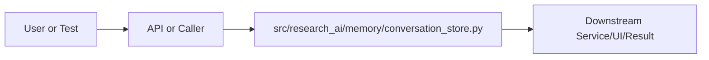

# conversation_store.py Explained

Generated educational companion for `src/research_ai/memory/conversation_store.py`. This file is intentionally detailed so a developer can understand the code, architecture role, production tradeoffs, and ML/backend concepts behind the implementation.

## File Overview

`src/research_ai/memory/conversation_store.py` is a Python module in the Memory layer: conversation, session, and knowledge graph state. It defines Turn, Conversation, ConversationStore and _utcnow.

## Why This File Exists

This file isolates one responsibility in the codebase: Memory layer: conversation, session, and knowledge graph state. Separation matters because AI systems are easier to test, scale, debug, and explain when retrieval, orchestration, ML services, memory, UI, and deployment scripts have clear boundaries.

## Workflow Position

**Layer:** Memory layer: conversation, session, and knowledge graph state.

**Previous step:** caller code, an API request, a browser event, a test fixture, an import, or a startup script prepares inputs.

**Current step:** `src/research_ai/memory/conversation_store.py` performs its local responsibility.

**Next step:** downstream services, API responses, rendered UI, tests, or process execution consume the result.



## Inputs and Outputs

- **Inputs:** function arguments, class constructor dependencies, HTTP payloads, environment variables, filesystem artifacts, DOM events, or test fixtures.
- **Outputs:** return values, dictionaries, Pydantic models, rendered DOM state, API responses, logs, process startup, assertions, or side effects.
- **Serialization:** this project uses JSON for APIs/LLM planning, parquet/joblib/faiss for ML artifacts, and HTML/CSS/JS for the browser surface.

## Imports Explained

| Import | Explanation |
|---|---|
| `__future__` | Project or standard-library dependency used to import a service, type, helper, or runtime capability. Imports affect startup time, packaging, and test isolation. |
| `collections` | Project or standard-library dependency used to import a service, type, helper, or runtime capability. Imports affect startup time, packaging, and test isolation. |
| `dataclasses` | dataclasses reduce boilerplate for typed configuration/result containers. |
| `datetime` | Project or standard-library dependency used to import a service, type, helper, or runtime capability. Imports affect startup time, packaging, and test isolation. |
| `logging` | logging provides structured operational visibility without using print statements. |
| `uuid` | uuid creates unique IDs for sessions, conversations, and uploaded-document references. |

## Global Variables and Config

| Name | Line | Why it matters |
|---|---:|---|
| `logger` | 46 | Module-level value, constant, prompt, cache, registry, or configuration point. Check mutability and startup cost. |
| `_MAX_TURN_PAIRS` | 50 | Module-level value, constant, prompt, cache, registry, or configuration point. Check mutability and startup cost. |
| `_MAX_CONVERSATIONS` | 53 | Module-level value, constant, prompt, cache, registry, or configuration point. Check mutability and startup cost. |

## Step-by-Step Workflow

1. Load dependencies and runtime constants.
2. Accept input from the previous layer.
3. Validate, transform, route, score, render, or execute according to this file's role.
4. Return a structured output or perform a controlled side effect.
5. Let caller layers handle presentation, persistence, retries, or fallback.

## Function-by-Function Breakdown

### `_utcnow`

- **Line:** 56
- **Kind:** synchronous function
- **Arguments:** none
- **Docstring:** No explicit docstring; infer behavior from call sites and body.

```python
def _utcnow() -> str:
    return datetime.now(timezone.utc).isoformat()
```

This function's parameters define its input contract. Its return value or side effect defines how downstream code uses it. Review error handling, resource usage, and whether the function performs CPU work, I/O, model inference, or pure transformation.


## Class-by-Class Breakdown

### `Turn`

- **Line:** 65
- **Base classes:** `object`
- **Docstring:** A single message in a conversation.

**Methods:**
- No methods beyond inherited behavior.

```python
class Turn:
    """A single message in a conversation."""
    role: str       # "user" | "assistant" | "system"
    content: str
    timestamp: str = field(default_factory=_utcnow)
```

This class packages state and behavior behind a service-style interface. Constructor dependencies show what the class needs; public methods show what the rest of the system can ask it to do. In production, this boundary is where caching, model loading, artifact access, and error handling must be controlled.

### `Conversation`

- **Line:** 73
- **Base classes:** `object`
- **Docstring:** A stateful multi-turn conversation session.

Tracks all turns chronologically. Provides helpers to:
  - Format turns for OpenAI-style message lists (to_messages)
  - Build a compact context string for the planner prompt (context_summary)

**Methods:**
- `add` at line 85: Append a turn, evicting oldest pairs if over the limit.
- `to_messages` at line 96: Return the last N turn-pairs as OpenAI-style message dicts.

Used to pass conversation history directly to an LLM API call.
Format: [{"role": "user", "content": "..."}, {"role": "assistant", ...}]
- `context_summary` at line 105: Build a compact plain-text context block for the planner prompt.

Returns an empty string if there's no history (first message in session).
Assistant responses are truncated to 300 chars to bound prompt size.

Example output:
    User: What are the best GNN papers for drug discovery?
    Assistant: I found 8 relevant papers. The most cited is...
    User: Which of those use attention mechanisms?
- `turn_count` at line 132: method behavior is described by its body and name
- `last_user_query` at line 136: Return the most recent user message, or None if no turns yet.

```python
class Conversation:
    """A stateful multi-turn conversation session.

    Tracks all turns chronologically. Provides helpers to:
      - Format turns for OpenAI-style message lists (to_messages)
      - Build a compact context string for the planner prompt (context_summary)
    """
    conversation_id: str
    turns: list[Turn] = field(default_factory=list)
    created_at: str = field(default_factory=_utcnow)
    last_active: str = field(default_factory=_utcnow)

    def add(self, role: str, content: str) -> None:
        """Append a turn, evicting oldest pairs if over the limit."""
        self.turns.append(Turn(role=role, content=content))
        self.last_active = _utcnow()

        # Enforce the turn limit: keep only the most recent _MAX_TURN_PAIRS pairs
        # This means we keep at most _MAX_TURN_PAIRS * 2 messages total.
        max_messages = _MAX_TURN_PAIRS * 2
        if len(self.turns) > max_messages:
            self.turns = self.turns[-max_messages:]

    def to_messages(self, last_n_pairs: int = 10) -> list[dict]:
        """Return the last N turn-pairs as OpenAI-style message dicts.

        Used to pass conversation history directly to an LLM API call.
        Format: [{"role": "user", "content": "..."}, {"role": "assistant", ...}]
        """
        recent = self.turns[-(last_n_pairs * 2):]
        return [{"role": t.role, "content": t.content} for t in recent]

    def context_summary(self, last_n_pairs: int = 6) -> str:
        """Build a compact plain-text context block for the planner prompt.

        Returns an empty string if there's no history (first message in session).
        Assistant responses are truncated to 300 chars to bound prompt size.

        Example output:
            User: What are the best GNN papers for drug discovery?
            Assistant: I found 8 relevant papers. The most cited is...
            User: Which of those use attention mechanisms?
        """
        recent = self.turns[-(last_n_pairs * 2):]
        if not recent:
            return ""

        lines: list[str] = []
        for turn in recent:
            label = "User" if turn.role == "user" else "Assistant"
            # Truncate long assistant responses to prevent context bloat
            content = turn.content
            if turn.role == "assistant" and len(content) > 300:
                content = content[:297] + "…"
            lines.append(f"{label}: {content}")

        return "\n".join(lines)

    @property
    def turn_count(self) -> int:
        return len(self.turns)

    @property
    def last_user_query(self) -> str | None:
        """Return the most recent user message, or None if no turns yet."""
        for turn in reversed(self.turns):
            if turn.role == "user":
                return turn.content
        return None
```

This class packages state and behavior behind a service-style interface. Constructor dependencies show what the class needs; public methods show what the rest of the system can ask it to do. In production, this boundary is where caching, model loading, artifact access, and error handling must be controlled.

### `ConversationStore`

- **Line:** 148
- **Base classes:** `object`
- **Docstring:** LRU-bounded in-memory store for multi-turn conversations.

Thread-safety: This implementation is NOT thread-safe. FastAPI's async
model means event-loop concurrency is fine (no two requests for the same
conversation_id run simultaneously on one event loop), but for multi-worker
deployments use Redis as the backing store instead.

Usage:
    store = ConversationStore()

    # Start or resume a conversation
    cid, conv = store.get_or_create(conversation_id=request.conversation_id)

    # Add user message before orchestration
    conv.add("user", query)

    # Add assistant response after orchestration
    conv.add("assistant", final_answer)

    # Get context for the planner
    context = conv.context_summary(last_n_pairs=6)

**Methods:**
- `__init__` at line 172: method behavior is described by its body and name
- `create` at line 180: Create a new conversation and return its ID.
- `get` at line 187: Retrieve a conversation by ID, updating its LRU position.
- `get_or_create` at line 194: Return (id, conversation), creating a new one if ID is unknown or None.

Always returns a valid (id, Conversation) pair. Call this at the start
of every /chat/message request.
- `add_turn` at line 211: Add a turn to an existing conversation. Returns False if not found.
- `delete` at line 219: Delete a conversation. Returns True if it existed.
- `count` at line 231: method behavior is described by its body and name
- `summary` at line 234: Return store statistics for the /stats endpoint.
- `_evict_if_needed` at line 246: Evict oldest conversations when the store is over capacity.

OrderedDict.popitem(last=False) removes from the front (oldest),
making this O(1) per eviction rather than O(n) with a list.

```python
class ConversationStore:
    """LRU-bounded in-memory store for multi-turn conversations.

    Thread-safety: This implementation is NOT thread-safe. FastAPI's async
    model means event-loop concurrency is fine (no two requests for the same
    conversation_id run simultaneously on one event loop), but for multi-worker
    deployments use Redis as the backing store instead.

    Usage:
        store = ConversationStore()

        # Start or resume a conversation
        cid, conv = store.get_or_create(conversation_id=request.conversation_id)

        # Add user message before orchestration
        conv.add("user", query)

        # Add assistant response after orchestration
        conv.add("assistant", final_answer)

        # Get context for the planner
        context = conv.context_summary(last_n_pairs=6)
    """

    def __init__(self) -> None:
        # OrderedDict gives O(1) move-to-end (LRU update) and O(1) popitem (eviction)
        self._store: OrderedDict[str, Conversation] = OrderedDict()

    # ------------------------------------------------------------------
    # Core operations
    # ------------------------------------------------------------------

    def create(self) -> str:
        """Create a new conversation and return its ID."""
        cid = str(uuid4())
        self._store[cid] = Conversation(conversation_id=cid)
        self._evict_if_needed()
        return cid

    def get(self, conversation_id: str) -> Conversation | None:
        """Retrieve a conversation by ID, updating its LRU position."""
        if conversation_id not in self._store:
            return None
        self._store.move_to_end(conversation_id)
        return self._store[conversation_id]

    def get_or_create(self, conversation_id: str | None) -> tuple[str, Conversation]:
        """Return (id, conversation), creating a new one if ID is unknown or None.

        Always returns a valid (id, Conversation) pair. Call this at the start
        of every /chat/message request.
        """
        if conversation_id and conversation_id in self._store:
            self._store.move_to_end(conversation_id)
            return conversation_id, self._store[conversation_id]

        # Create new conversation
        cid = str(uuid4())
        conv = Conversation(conversation_id=cid)
        self._store[cid] = conv
        self._evict_if_needed()
        return cid, conv

    def add_turn(self, conversation_id: str, role: str, content: str) -> bool:
        """Add a turn to an existing conversation. Returns False if not found."""
        conv = self.get(conversation_id)
        if conv is None:
            return False
        conv.add(role, content)
        return True

    def delete(self, conversation_id: str) -> bool:
        """Delete a conversation. Returns True if it existed."""
        if conversation_id in self._store:
            del self._store[conversation_id]
            return True
        return False

    # ------------------------------------------------------------------
    # Properties and introspection
    # ------------------------------------------------------------------

    @property
    def count(self) -> int:
        return len(self._store)

    def summary(self) -> dict:
        """Return store statistics for the /stats endpoint."""
        return {
            "active_conversations": self.count,
            "max_conversations": _MAX_CONVERSATIONS,
            "max_turns_per_conversation": _MAX_TURN_PAIRS,
        }

    # ------------------------------------------------------------------
    # Private
    # ------------------------------------------------------------------

    def _evict_if_needed(self) -> None:
        """Evict oldest conversations when the store is over capacity.
```

This class packages state and behavior behind a service-style interface. Constructor dependencies show what the class needs; public methods show what the rest of the system can ask it to do. In production, this boundary is where caching, model loading, artifact access, and error handling must be controlled.


## Method-by-Method Deep Dive

### Class `Conversation` Methods

#### `Conversation.add`

- **Line:** 85
- **Kind:** synchronous method
- **Arguments:** self, role, content
- **Docstring:** Append a turn, evicting oldest pairs if over the limit.

```python
    def add(self, role: str, content: str) -> None:
        """Append a turn, evicting oldest pairs if over the limit."""
        self.turns.append(Turn(role=role, content=content))
        self.last_active = _utcnow()

        # Enforce the turn limit: keep only the most recent _MAX_TURN_PAIRS pairs
        # This means we keep at most _MAX_TURN_PAIRS * 2 messages total.
        max_messages = _MAX_TURN_PAIRS * 2
        if len(self.turns) > max_messages:
            self.turns = self.turns[-max_messages:]
```

This method is part of the class contract. Its inputs show what state or caller data it consumes; its body shows whether it performs pure transformation, model/artifact access, retrieval, I/O, caching, validation, or orchestration. In production review, pay attention to error handling, mutation of `self`, repeated expensive work, and whether return shapes stay stable for downstream callers.

#### `Conversation.to_messages`

- **Line:** 96
- **Kind:** synchronous method
- **Arguments:** self, last_n_pairs
- **Docstring:** Return the last N turn-pairs as OpenAI-style message dicts.

Used to pass conversation history directly to an LLM API call.
Format: [{"role": "user", "content": "..."}, {"role": "assistant", ...}]

```python
    def to_messages(self, last_n_pairs: int = 10) -> list[dict]:
        """Return the last N turn-pairs as OpenAI-style message dicts.

        Used to pass conversation history directly to an LLM API call.
        Format: [{"role": "user", "content": "..."}, {"role": "assistant", ...}]
        """
        recent = self.turns[-(last_n_pairs * 2):]
        return [{"role": t.role, "content": t.content} for t in recent]
```

This method is part of the class contract. Its inputs show what state or caller data it consumes; its body shows whether it performs pure transformation, model/artifact access, retrieval, I/O, caching, validation, or orchestration. In production review, pay attention to error handling, mutation of `self`, repeated expensive work, and whether return shapes stay stable for downstream callers.

#### `Conversation.context_summary`

- **Line:** 105
- **Kind:** synchronous method
- **Arguments:** self, last_n_pairs
- **Docstring:** Build a compact plain-text context block for the planner prompt.

Returns an empty string if there's no history (first message in session).
Assistant responses are truncated to 300 chars to bound prompt size.

Example output:
    User: What are the best GNN papers for drug discovery?
    Assistant: I found 8 relevant papers. The most cited is...
    User: Which of those use attention mechanisms?

```python
    def context_summary(self, last_n_pairs: int = 6) -> str:
        """Build a compact plain-text context block for the planner prompt.

        Returns an empty string if there's no history (first message in session).
        Assistant responses are truncated to 300 chars to bound prompt size.

        Example output:
            User: What are the best GNN papers for drug discovery?
            Assistant: I found 8 relevant papers. The most cited is...
            User: Which of those use attention mechanisms?
        """
        recent = self.turns[-(last_n_pairs * 2):]
        if not recent:
            return ""

        lines: list[str] = []
        for turn in recent:
            label = "User" if turn.role == "user" else "Assistant"
            # Truncate long assistant responses to prevent context bloat
            content = turn.content
            if turn.role == "assistant" and len(content) > 300:
                content = content[:297] + "…"
            lines.append(f"{label}: {content}")

        return "\n".join(lines)
```

This method is part of the class contract. Its inputs show what state or caller data it consumes; its body shows whether it performs pure transformation, model/artifact access, retrieval, I/O, caching, validation, or orchestration. In production review, pay attention to error handling, mutation of `self`, repeated expensive work, and whether return shapes stay stable for downstream callers.

#### `Conversation.turn_count`

- **Line:** 132
- **Kind:** synchronous method
- **Arguments:** self
- **Docstring:** No explicit docstring; behavior is inferred from the implementation and call sites.

```python
    def turn_count(self) -> int:
        return len(self.turns)
```

This method is part of the class contract. Its inputs show what state or caller data it consumes; its body shows whether it performs pure transformation, model/artifact access, retrieval, I/O, caching, validation, or orchestration. In production review, pay attention to error handling, mutation of `self`, repeated expensive work, and whether return shapes stay stable for downstream callers.

#### `Conversation.last_user_query`

- **Line:** 136
- **Kind:** synchronous method
- **Arguments:** self
- **Docstring:** Return the most recent user message, or None if no turns yet.

```python
    def last_user_query(self) -> str | None:
        """Return the most recent user message, or None if no turns yet."""
        for turn in reversed(self.turns):
            if turn.role == "user":
                return turn.content
        return None
```

This method is part of the class contract. Its inputs show what state or caller data it consumes; its body shows whether it performs pure transformation, model/artifact access, retrieval, I/O, caching, validation, or orchestration. In production review, pay attention to error handling, mutation of `self`, repeated expensive work, and whether return shapes stay stable for downstream callers.

### Class `ConversationStore` Methods

#### `ConversationStore.__init__`

- **Line:** 172
- **Kind:** synchronous method
- **Arguments:** self
- **Docstring:** No explicit docstring; behavior is inferred from the implementation and call sites.

```python
    def __init__(self) -> None:
        # OrderedDict gives O(1) move-to-end (LRU update) and O(1) popitem (eviction)
        self._store: OrderedDict[str, Conversation] = OrderedDict()
```

This method is part of the class contract. Its inputs show what state or caller data it consumes; its body shows whether it performs pure transformation, model/artifact access, retrieval, I/O, caching, validation, or orchestration. In production review, pay attention to error handling, mutation of `self`, repeated expensive work, and whether return shapes stay stable for downstream callers.

#### `ConversationStore.create`

- **Line:** 180
- **Kind:** synchronous method
- **Arguments:** self
- **Docstring:** Create a new conversation and return its ID.

```python
    def create(self) -> str:
        """Create a new conversation and return its ID."""
        cid = str(uuid4())
        self._store[cid] = Conversation(conversation_id=cid)
        self._evict_if_needed()
        return cid
```

This method is part of the class contract. Its inputs show what state or caller data it consumes; its body shows whether it performs pure transformation, model/artifact access, retrieval, I/O, caching, validation, or orchestration. In production review, pay attention to error handling, mutation of `self`, repeated expensive work, and whether return shapes stay stable for downstream callers.

#### `ConversationStore.get`

- **Line:** 187
- **Kind:** synchronous method
- **Arguments:** self, conversation_id
- **Docstring:** Retrieve a conversation by ID, updating its LRU position.

```python
    def get(self, conversation_id: str) -> Conversation | None:
        """Retrieve a conversation by ID, updating its LRU position."""
        if conversation_id not in self._store:
            return None
        self._store.move_to_end(conversation_id)
        return self._store[conversation_id]
```

This method is part of the class contract. Its inputs show what state or caller data it consumes; its body shows whether it performs pure transformation, model/artifact access, retrieval, I/O, caching, validation, or orchestration. In production review, pay attention to error handling, mutation of `self`, repeated expensive work, and whether return shapes stay stable for downstream callers.

#### `ConversationStore.get_or_create`

- **Line:** 194
- **Kind:** synchronous method
- **Arguments:** self, conversation_id
- **Docstring:** Return (id, conversation), creating a new one if ID is unknown or None.

Always returns a valid (id, Conversation) pair. Call this at the start
of every /chat/message request.

```python
    def get_or_create(self, conversation_id: str | None) -> tuple[str, Conversation]:
        """Return (id, conversation), creating a new one if ID is unknown or None.

        Always returns a valid (id, Conversation) pair. Call this at the start
        of every /chat/message request.
        """
        if conversation_id and conversation_id in self._store:
            self._store.move_to_end(conversation_id)
            return conversation_id, self._store[conversation_id]

        # Create new conversation
        cid = str(uuid4())
        conv = Conversation(conversation_id=cid)
        self._store[cid] = conv
        self._evict_if_needed()
        return cid, conv
```

This method is part of the class contract. Its inputs show what state or caller data it consumes; its body shows whether it performs pure transformation, model/artifact access, retrieval, I/O, caching, validation, or orchestration. In production review, pay attention to error handling, mutation of `self`, repeated expensive work, and whether return shapes stay stable for downstream callers.

#### `ConversationStore.add_turn`

- **Line:** 211
- **Kind:** synchronous method
- **Arguments:** self, conversation_id, role, content
- **Docstring:** Add a turn to an existing conversation. Returns False if not found.

```python
    def add_turn(self, conversation_id: str, role: str, content: str) -> bool:
        """Add a turn to an existing conversation. Returns False if not found."""
        conv = self.get(conversation_id)
        if conv is None:
            return False
        conv.add(role, content)
        return True
```

This method is part of the class contract. Its inputs show what state or caller data it consumes; its body shows whether it performs pure transformation, model/artifact access, retrieval, I/O, caching, validation, or orchestration. In production review, pay attention to error handling, mutation of `self`, repeated expensive work, and whether return shapes stay stable for downstream callers.

#### `ConversationStore.delete`

- **Line:** 219
- **Kind:** synchronous method
- **Arguments:** self, conversation_id
- **Docstring:** Delete a conversation. Returns True if it existed.

```python
    def delete(self, conversation_id: str) -> bool:
        """Delete a conversation. Returns True if it existed."""
        if conversation_id in self._store:
            del self._store[conversation_id]
            return True
        return False
```

This method is part of the class contract. Its inputs show what state or caller data it consumes; its body shows whether it performs pure transformation, model/artifact access, retrieval, I/O, caching, validation, or orchestration. In production review, pay attention to error handling, mutation of `self`, repeated expensive work, and whether return shapes stay stable for downstream callers.

#### `ConversationStore.count`

- **Line:** 231
- **Kind:** synchronous method
- **Arguments:** self
- **Docstring:** No explicit docstring; behavior is inferred from the implementation and call sites.

```python
    def count(self) -> int:
        return len(self._store)
```

This method is part of the class contract. Its inputs show what state or caller data it consumes; its body shows whether it performs pure transformation, model/artifact access, retrieval, I/O, caching, validation, or orchestration. In production review, pay attention to error handling, mutation of `self`, repeated expensive work, and whether return shapes stay stable for downstream callers.

#### `ConversationStore.summary`

- **Line:** 234
- **Kind:** synchronous method
- **Arguments:** self
- **Docstring:** Return store statistics for the /stats endpoint.

```python
    def summary(self) -> dict:
        """Return store statistics for the /stats endpoint."""
        return {
            "active_conversations": self.count,
            "max_conversations": _MAX_CONVERSATIONS,
            "max_turns_per_conversation": _MAX_TURN_PAIRS,
        }
```

This method is part of the class contract. Its inputs show what state or caller data it consumes; its body shows whether it performs pure transformation, model/artifact access, retrieval, I/O, caching, validation, or orchestration. In production review, pay attention to error handling, mutation of `self`, repeated expensive work, and whether return shapes stay stable for downstream callers.

#### `ConversationStore._evict_if_needed`

- **Line:** 246
- **Kind:** synchronous method
- **Arguments:** self
- **Docstring:** Evict oldest conversations when the store is over capacity.

OrderedDict.popitem(last=False) removes from the front (oldest),
making this O(1) per eviction rather than O(n) with a list.

```python
    def _evict_if_needed(self) -> None:
        """Evict oldest conversations when the store is over capacity.

        OrderedDict.popitem(last=False) removes from the front (oldest),
        making this O(1) per eviction rather than O(n) with a list.
        """
        while len(self._store) > _MAX_CONVERSATIONS:
            oldest_id, _ = self._store.popitem(last=False)
            logger.debug("ConversationStore: evicted oldest conversation %s", oldest_id)
```

This method is part of the class contract. Its inputs show what state or caller data it consumes; its body shows whether it performs pure transformation, model/artifact access, retrieval, I/O, caching, validation, or orchestration. In production review, pay attention to error handling, mutation of `self`, repeated expensive work, and whether return shapes stay stable for downstream callers.

## Important Algorithms Used

- **Embeddings**: Embeddings map text into dense semantic vectors so conceptual similarity becomes geometric similarity.
- **LLM Inference**: LLM inference sends prompts or chat messages to a model provider and receives generated text under token, latency, and cost constraints.
- **Transformers**: Transformers use tokenization and attention layers for language understanding/generation. They are powerful but memory and latency sensitive.
- **Caching**: Caching avoids repeating expensive work such as model loading, embedding generation, or client initialization.
- **Streaming**: Streaming improves perceived latency by sending incremental output instead of waiting for full completion.
- **Sandboxing**: Sandboxing validates and constrains user code before execution, reducing security and stability risk.

## Libraries Used

| Import | Explanation |
|---|---|
| `__future__` | Project or standard-library dependency used to import a service, type, helper, or runtime capability. Imports affect startup time, packaging, and test isolation. |
| `collections` | Project or standard-library dependency used to import a service, type, helper, or runtime capability. Imports affect startup time, packaging, and test isolation. |
| `dataclasses` | dataclasses reduce boilerplate for typed configuration/result containers. |
| `datetime` | Project or standard-library dependency used to import a service, type, helper, or runtime capability. Imports affect startup time, packaging, and test isolation. |
| `logging` | logging provides structured operational visibility without using print statements. |
| `uuid` | uuid creates unique IDs for sessions, conversations, and uploaded-document references. |

## ML Concepts Used

- **Embeddings**: Embeddings map text into dense semantic vectors so conceptual similarity becomes geometric similarity.
- **LLM Inference**: LLM inference sends prompts or chat messages to a model provider and receives generated text under token, latency, and cost constraints.
- **Transformers**: Transformers use tokenization and attention layers for language understanding/generation. They are powerful but memory and latency sensitive.
- **Caching**: Caching avoids repeating expensive work such as model loading, embedding generation, or client initialization.
- **Streaming**: Streaming improves perceived latency by sending incremental output instead of waiting for full completion.
- **Sandboxing**: Sandboxing validates and constrains user code before execution, reducing security and stability risk.

## Performance and Memory Notes

- Avoid eager loading of heavy ML models unless startup latency is acceptable.
- Cache expensive clients, tokenizers, vector stores, and embeddings carefully.
- Use float32 for embedding vectors because it halves memory compared with float64 and matches FAISS/neural inference expectations.
- Bound prompt length, uploaded content, result counts, and token budgets to control latency and memory.
- Watch copies of large metadata frames, embedding matrices, and file buffers.

## Scalability Notes

- In-memory state works for local demos but needs Redis/database/object storage for multi-worker cloud deployment.
- CPU/GPU inference should often be separated from the web API when traffic grows.
- Retrieval can start exact and move to approximate indexes as corpus size grows.
- Batch operations and cache repeated work to improve throughput.
- Add metrics for latency, errors, fallback frequency, retrieval hit rate, and token usage.

## Production Engineering Notes

- Keep interfaces stable because other files may import this module or depend on its response shape.
- Prefer typed/structured data over free-form strings at service boundaries.
- Log operational context without secrets or huge payloads.
- Make fallback behavior explicit so users get useful output even when LLMs or artifacts fail.
- Keep provider-specific logic behind adapters so Groq/OpenRouter/Google/Ollama can be swapped.

## Common Bugs and Failure Cases

- Missing `.env` values, model artifacts, or Ollama models can trigger degraded behavior.
- Type mismatches occur when LLM-generated tool arguments cross into strict Python code.
- Empty retrieval results must not become hallucinated answers.
- Network calls need timeouts and careful retry behavior.
- Frontend IDs/classes and API schemas are contracts; changing one side without the other breaks workflows.

## Security Considerations

- Handles credentials or environment configuration. Keep secrets in environment variables and redact them from logs.
- Deals with execution or subprocesses. Maintain AST validation, isolated mode, timeouts, and least privilege.
- Performs network I/O. Use timeouts, validate responses, and keep private services such as Ollama off the public internet.

## Real Industry Usage

- This pattern appears in enterprise RAG assistants, scientific search tools, internal research copilots, and ML platform demos.
- The layered design mirrors production systems: API facade, orchestration, retrieval, evaluation, synthesis, UI, and deployment.
- Clear separation lets teams replace model providers, improve retrieval, harden security, or redesign UI independently.

## Optimization Opportunities

- Add tracing around each workflow step.
- Strengthen schema validation at boundaries.
- Persist conversation/session state outside process memory.
- Add load tests and adversarial tests for prompt injection, empty evidence, and large uploads.
- Consider approximate vector indexes, reranker models, or batching when corpus/traffic grows.

## How This Connects To Other Files

- `src/research_ai/memory/conversation_store.py` is connected through imports, startup scripts, API routes, frontend selectors, tests, or artifact paths.
- `src/research_ai/platform.py` is the backend composition root.
- `src/research_ai/api/main.py` exposes backend behavior over HTTP.
- Retrieval modules depend on artifacts under `artifacts/`.
- Frontend files depend on stable endpoint and DOM contracts.

## End-to-End Flow Summary

- A user/browser/test/startup event enters the system.
- The relevant layer validates or normalizes input.
- Retrieval, ML, orchestration, execution, or UI rendering happens.
- A structured result, visual state, or process side effect is produced.
- Fallbacks and tests keep behavior understandable when dependencies are unavailable.

## Interview Questions

1. What responsibility does this file own?
2. What inputs and outputs define its contract?
3. Which dependencies are expensive or operationally risky?
4. What breaks if this file changes shape?
5. How would you scale or test this behavior in production?

## Key Takeaways

- `src/research_ai/memory/conversation_store.py` should be understood as part of a layered AI research platform.
- Trace data flow from inputs to transformations to outputs.
- Production readiness comes from explicit contracts, bounded resources, observability, secure defaults, and graceful fallback.

## Fully Commented Source

This section repeats the original source with an explanatory comment before every line. The comments are educational only; they are not inserted into the production source file.

```python
# L0001: Starts, ends, or continues a docstring that documents module, class, or function intent.
"""ConversationStore — persistent multi-turn conversation memory.
# L0002: Blank line that visually separates logical sections and improves readability.

# L0003: Executes Python logic as part of this file's workflow; read surrounding lines for data flow and side effects.
WHY THIS EXISTS
# L0004: Executes Python logic as part of this file's workflow; read surrounding lines for data flow and side effects.
---------------
# L0005: Executes Python logic as part of this file's workflow; read surrounding lines for data flow and side effects.
Without conversation memory, every message the user sends is treated as
# L0006: Executes Python logic as part of this file's workflow; read surrounding lines for data flow and side effects.
independent. The orchestrator cannot understand follow-up questions like:
# L0007: Executes Python logic as part of this file's workflow; read surrounding lines for data flow and side effects.
  "Tell me more about that last paper"
# L0008: Executes Python logic as part of this file's workflow; read surrounding lines for data flow and side effects.
  "Which of these methods is fastest?"
# L0009: Executes Python logic as part of this file's workflow; read surrounding lines for data flow and side effects.
  "Compare that to what you just said"
# L0010: Blank line that visually separates logical sections and improves readability.

# L0011: Executes Python logic as part of this file's workflow; read surrounding lines for data flow and side effects.
With conversation memory, the planner agent receives recent turns as context,
# L0012: Executes Python logic as part of this file's workflow; read surrounding lines for data flow and side effects.
allowing it to resolve references, chain related queries, and maintain coherent
# L0013: Executes Python logic as part of this file's workflow; read surrounding lines for data flow and side effects.
multi-turn research dialogues — exactly like ChatGPT's conversation model.
# L0014: Blank line that visually separates logical sections and improves readability.

# L0015: Executes Python logic as part of this file's workflow; read surrounding lines for data flow and side effects.
ARCHITECTURE
# L0016: Executes Python logic as part of this file's workflow; read surrounding lines for data flow and side effects.
------------
# L0017: Executes Python logic as part of this file's workflow; read surrounding lines for data flow and side effects.
Each browser session gets a `conversation_id` (UUID). Messages accumulate as
# L0018: Executes Python logic as part of this file's workflow; read surrounding lines for data flow and side effects.
a chronological list of {role, content} turns. The planner receives a compact
# L0019: Executes Python logic as part of this file's workflow; read surrounding lines for data flow and side effects.
text summary of recent turns rather than the full JSON — this keeps the LLM
# L0020: Executes Python logic as part of this file's workflow; read surrounding lines for data flow and side effects.
prompt within token limits while preserving semantic context.
# L0021: Blank line that visually separates logical sections and improves readability.

# L0022: Executes Python logic as part of this file's workflow; read surrounding lines for data flow and side effects.
MEMORY BOUNDS
# L0023: Executes Python logic as part of this file's workflow; read surrounding lines for data flow and side effects.
-------------
# L0024: Executes Python logic as part of this file's workflow; read surrounding lines for data flow and side effects.
  - Maximum 20 turns per conversation (40 messages: 20 user + 20 assistant)
# L0025: Executes Python logic as part of this file's workflow; read surrounding lines for data flow and side effects.
  - Maximum 500 concurrent conversations (LRU eviction)
# L0026: Executes Python logic as part of this file's workflow; read surrounding lines for data flow and side effects.
  - In-memory only (cleared on server restart)
# L0027: Blank line that visually separates logical sections and improves readability.

# L0028: Executes Python logic as part of this file's workflow; read surrounding lines for data flow and side effects.
For production deployments: replace the OrderedDict store with Redis or
# L0029: Executes Python logic as part of this file's workflow; read surrounding lines for data flow and side effects.
PostgreSQL to survive restarts and scale horizontally.
# L0030: Blank line that visually separates logical sections and improves readability.

# L0031: Executes Python logic as part of this file's workflow; read surrounding lines for data flow and side effects.
LRU EVICTION
# L0032: Executes Python logic as part of this file's workflow; read surrounding lines for data flow and side effects.
------------
# L0033: Executes Python logic as part of this file's workflow; read surrounding lines for data flow and side effects.
Uses OrderedDict (same pattern as the embedding cache in retrieval/embeddings/)
# L0034: Executes Python logic as part of this file's workflow; read surrounding lines for data flow and side effects.
to provide O(1) move-to-end on access and O(1) popitem from the left for
# L0035: Executes Python logic as part of this file's workflow; read surrounding lines for data flow and side effects.
eviction. This means memory usage is bounded at O(_MAX_CONVERSATIONS) regardless
# L0036: Executes Python logic as part of this file's workflow; read surrounding lines for data flow and side effects.
of server uptime.
# L0037: Starts, ends, or continues a docstring that documents module, class, or function intent.
"""
# L0038: Enables future Python behavior so annotations/import semantics stay modern and predictable.
from __future__ import annotations
# L0039: Blank line that visually separates logical sections and improves readability.

# L0040: Imports a dependency, type, or project module needed by later code in this file.
import logging
# L0041: Imports a dependency, type, or project module needed by later code in this file.
from collections import OrderedDict
# L0042: Imports a dependency, type, or project module needed by later code in this file.
from dataclasses import dataclass, field
# L0043: Imports a dependency, type, or project module needed by later code in this file.
from datetime import datetime, timezone
# L0044: Imports a dependency, type, or project module needed by later code in this file.
from uuid import uuid4
# L0045: Blank line that visually separates logical sections and improves readability.

# L0046: Assigns or updates a value used later in the workflow; check mutability and data shape.
logger = logging.getLogger(__name__)
# L0047: Blank line that visually separates logical sections and improves readability.

# L0048: Developer comment explaining intent, caveat, section boundary, or operational reasoning.
# Maximum number of (user + assistant) message pairs to keep per conversation.
# L0049: Developer comment explaining intent, caveat, section boundary, or operational reasoning.
# Older pairs are silently dropped. 20 pairs = 40 total messages.
# L0050: Assigns or updates a value used later in the workflow; check mutability and data shape.
_MAX_TURN_PAIRS = 20
# L0051: Blank line that visually separates logical sections and improves readability.

# L0052: Developer comment explaining intent, caveat, section boundary, or operational reasoning.
# Maximum concurrent conversations before LRU eviction starts.
# L0053: Assigns or updates a value used later in the workflow; check mutability and data shape.
_MAX_CONVERSATIONS = 500
# L0054: Blank line that visually separates logical sections and improves readability.

# L0055: Blank line that visually separates logical sections and improves readability.

# L0056: Defines a function or method; parameters are the input contract and the body implements the workflow.
def _utcnow() -> str:
# L0057: Returns the computed result to the caller; this shape becomes part of the downstream contract.
    return datetime.now(timezone.utc).isoformat()
# L0058: Blank line that visually separates logical sections and improves readability.

# L0059: Blank line that visually separates logical sections and improves readability.

# L0060: Developer comment explaining intent, caveat, section boundary, or operational reasoning.
# ---------------------------------------------------------------------------
# L0061: Developer comment explaining intent, caveat, section boundary, or operational reasoning.
# Data structures
# L0062: Developer comment explaining intent, caveat, section boundary, or operational reasoning.
# ---------------------------------------------------------------------------
# L0063: Blank line that visually separates logical sections and improves readability.

# L0064: Decorator that modifies the function/class below, commonly for routing, dataclasses, caching, or properties.
@dataclass
# L0065: Defines a class that groups related state and behavior behind a reusable interface.
class Turn:
# L0066: Starts, ends, or continues a docstring that documents module, class, or function intent.
    """A single message in a conversation."""
# L0067: Executes Python logic as part of this file's workflow; read surrounding lines for data flow and side effects.
    role: str       # "user" | "assistant" | "system"
# L0068: Executes Python logic as part of this file's workflow; read surrounding lines for data flow and side effects.
    content: str
# L0069: Assigns or updates a value used later in the workflow; check mutability and data shape.
    timestamp: str = field(default_factory=_utcnow)
# L0070: Blank line that visually separates logical sections and improves readability.

# L0071: Blank line that visually separates logical sections and improves readability.

# L0072: Decorator that modifies the function/class below, commonly for routing, dataclasses, caching, or properties.
@dataclass
# L0073: Defines a class that groups related state and behavior behind a reusable interface.
class Conversation:
# L0074: Starts, ends, or continues a docstring that documents module, class, or function intent.
    """A stateful multi-turn conversation session.
# L0075: Blank line that visually separates logical sections and improves readability.

# L0076: Executes Python logic as part of this file's workflow; read surrounding lines for data flow and side effects.
    Tracks all turns chronologically. Provides helpers to:
# L0077: Executes Python logic as part of this file's workflow; read surrounding lines for data flow and side effects.
      - Format turns for OpenAI-style message lists (to_messages)
# L0078: Executes Python logic as part of this file's workflow; read surrounding lines for data flow and side effects.
      - Build a compact context string for the planner prompt (context_summary)
# L0079: Starts, ends, or continues a docstring that documents module, class, or function intent.
    """
# L0080: Executes Python logic as part of this file's workflow; read surrounding lines for data flow and side effects.
    conversation_id: str
# L0081: Assigns or updates a value used later in the workflow; check mutability and data shape.
    turns: list[Turn] = field(default_factory=list)
# L0082: Assigns or updates a value used later in the workflow; check mutability and data shape.
    created_at: str = field(default_factory=_utcnow)
# L0083: Assigns or updates a value used later in the workflow; check mutability and data shape.
    last_active: str = field(default_factory=_utcnow)
# L0084: Blank line that visually separates logical sections and improves readability.

# L0085: Defines a function or method; parameters are the input contract and the body implements the workflow.
    def add(self, role: str, content: str) -> None:
# L0086: Starts, ends, or continues a docstring that documents module, class, or function intent.
        """Append a turn, evicting oldest pairs if over the limit."""
# L0087: Assigns or updates a value used later in the workflow; check mutability and data shape.
        self.turns.append(Turn(role=role, content=content))
# L0088: Assigns or updates a value used later in the workflow; check mutability and data shape.
        self.last_active = _utcnow()
# L0089: Blank line that visually separates logical sections and improves readability.

# L0090: Developer comment explaining intent, caveat, section boundary, or operational reasoning.
        # Enforce the turn limit: keep only the most recent _MAX_TURN_PAIRS pairs
# L0091: Developer comment explaining intent, caveat, section boundary, or operational reasoning.
        # This means we keep at most _MAX_TURN_PAIRS * 2 messages total.
# L0092: Assigns or updates a value used later in the workflow; check mutability and data shape.
        max_messages = _MAX_TURN_PAIRS * 2
# L0093: Branches execution based on a condition, usually for validation, fallback, or mode-specific behavior.
        if len(self.turns) > max_messages:
# L0094: Assigns or updates a value used later in the workflow; check mutability and data shape.
            self.turns = self.turns[-max_messages:]
# L0095: Blank line that visually separates logical sections and improves readability.

# L0096: Defines a function or method; parameters are the input contract and the body implements the workflow.
    def to_messages(self, last_n_pairs: int = 10) -> list[dict]:
# L0097: Starts, ends, or continues a docstring that documents module, class, or function intent.
        """Return the last N turn-pairs as OpenAI-style message dicts.
# L0098: Blank line that visually separates logical sections and improves readability.

# L0099: Executes Python logic as part of this file's workflow; read surrounding lines for data flow and side effects.
        Used to pass conversation history directly to an LLM API call.
# L0100: Executes Python logic as part of this file's workflow; read surrounding lines for data flow and side effects.
        Format: [{"role": "user", "content": "..."}, {"role": "assistant", ...}]
# L0101: Starts, ends, or continues a docstring that documents module, class, or function intent.
        """
# L0102: Assigns or updates a value used later in the workflow; check mutability and data shape.
        recent = self.turns[-(last_n_pairs * 2):]
# L0103: Returns the computed result to the caller; this shape becomes part of the downstream contract.
        return [{"role": t.role, "content": t.content} for t in recent]
# L0104: Blank line that visually separates logical sections and improves readability.

# L0105: Defines a function or method; parameters are the input contract and the body implements the workflow.
    def context_summary(self, last_n_pairs: int = 6) -> str:
# L0106: Starts, ends, or continues a docstring that documents module, class, or function intent.
        """Build a compact plain-text context block for the planner prompt.
# L0107: Blank line that visually separates logical sections and improves readability.

# L0108: Executes Python logic as part of this file's workflow; read surrounding lines for data flow and side effects.
        Returns an empty string if there's no history (first message in session).
# L0109: Executes Python logic as part of this file's workflow; read surrounding lines for data flow and side effects.
        Assistant responses are truncated to 300 chars to bound prompt size.
# L0110: Blank line that visually separates logical sections and improves readability.

# L0111: Executes Python logic as part of this file's workflow; read surrounding lines for data flow and side effects.
        Example output:
# L0112: Executes Python logic as part of this file's workflow; read surrounding lines for data flow and side effects.
            User: What are the best GNN papers for drug discovery?
# L0113: Executes Python logic as part of this file's workflow; read surrounding lines for data flow and side effects.
            Assistant: I found 8 relevant papers. The most cited is...
# L0114: Executes Python logic as part of this file's workflow; read surrounding lines for data flow and side effects.
            User: Which of those use attention mechanisms?
# L0115: Starts, ends, or continues a docstring that documents module, class, or function intent.
        """
# L0116: Assigns or updates a value used later in the workflow; check mutability and data shape.
        recent = self.turns[-(last_n_pairs * 2):]
# L0117: Branches execution based on a condition, usually for validation, fallback, or mode-specific behavior.
        if not recent:
# L0118: Returns the computed result to the caller; this shape becomes part of the downstream contract.
            return ""
# L0119: Blank line that visually separates logical sections and improves readability.

# L0120: Assigns or updates a value used later in the workflow; check mutability and data shape.
        lines: list[str] = []
# L0121: Iterates over data, retry attempts, files, results, or workflow steps.
        for turn in recent:
# L0122: Assigns or updates a value used later in the workflow; check mutability and data shape.
            label = "User" if turn.role == "user" else "Assistant"
# L0123: Developer comment explaining intent, caveat, section boundary, or operational reasoning.
            # Truncate long assistant responses to prevent context bloat
# L0124: Assigns or updates a value used later in the workflow; check mutability and data shape.
            content = turn.content
# L0125: Branches execution based on a condition, usually for validation, fallback, or mode-specific behavior.
            if turn.role == "assistant" and len(content) > 300:
# L0126: Assigns or updates a value used later in the workflow; check mutability and data shape.
                content = content[:297] + "…"
# L0127: Executes Python logic as part of this file's workflow; read surrounding lines for data flow and side effects.
            lines.append(f"{label}: {content}")
# L0128: Blank line that visually separates logical sections and improves readability.

# L0129: Returns the computed result to the caller; this shape becomes part of the downstream contract.
        return "\n".join(lines)
# L0130: Blank line that visually separates logical sections and improves readability.

# L0131: Decorator that modifies the function/class below, commonly for routing, dataclasses, caching, or properties.
    @property
# L0132: Defines a function or method; parameters are the input contract and the body implements the workflow.
    def turn_count(self) -> int:
# L0133: Returns the computed result to the caller; this shape becomes part of the downstream contract.
        return len(self.turns)
# L0134: Blank line that visually separates logical sections and improves readability.

# L0135: Decorator that modifies the function/class below, commonly for routing, dataclasses, caching, or properties.
    @property
# L0136: Defines a function or method; parameters are the input contract and the body implements the workflow.
    def last_user_query(self) -> str | None:
# L0137: Starts, ends, or continues a docstring that documents module, class, or function intent.
        """Return the most recent user message, or None if no turns yet."""
# L0138: Iterates over data, retry attempts, files, results, or workflow steps.
        for turn in reversed(self.turns):
# L0139: Branches execution based on a condition, usually for validation, fallback, or mode-specific behavior.
            if turn.role == "user":
# L0140: Returns the computed result to the caller; this shape becomes part of the downstream contract.
                return turn.content
# L0141: Returns the computed result to the caller; this shape becomes part of the downstream contract.
        return None
# L0142: Blank line that visually separates logical sections and improves readability.

# L0143: Blank line that visually separates logical sections and improves readability.

# L0144: Developer comment explaining intent, caveat, section boundary, or operational reasoning.
# ---------------------------------------------------------------------------
# L0145: Developer comment explaining intent, caveat, section boundary, or operational reasoning.
# Store
# L0146: Developer comment explaining intent, caveat, section boundary, or operational reasoning.
# ---------------------------------------------------------------------------
# L0147: Blank line that visually separates logical sections and improves readability.

# L0148: Defines a class that groups related state and behavior behind a reusable interface.
class ConversationStore:
# L0149: Starts, ends, or continues a docstring that documents module, class, or function intent.
    """LRU-bounded in-memory store for multi-turn conversations.
# L0150: Blank line that visually separates logical sections and improves readability.

# L0151: Executes Python logic as part of this file's workflow; read surrounding lines for data flow and side effects.
    Thread-safety: This implementation is NOT thread-safe. FastAPI's async
# L0152: Executes Python logic as part of this file's workflow; read surrounding lines for data flow and side effects.
    model means event-loop concurrency is fine (no two requests for the same
# L0153: Executes Python logic as part of this file's workflow; read surrounding lines for data flow and side effects.
    conversation_id run simultaneously on one event loop), but for multi-worker
# L0154: Executes Python logic as part of this file's workflow; read surrounding lines for data flow and side effects.
    deployments use Redis as the backing store instead.
# L0155: Blank line that visually separates logical sections and improves readability.

# L0156: Executes Python logic as part of this file's workflow; read surrounding lines for data flow and side effects.
    Usage:
# L0157: Assigns or updates a value used later in the workflow; check mutability and data shape.
        store = ConversationStore()
# L0158: Blank line that visually separates logical sections and improves readability.

# L0159: Developer comment explaining intent, caveat, section boundary, or operational reasoning.
        # Start or resume a conversation
# L0160: Assigns or updates a value used later in the workflow; check mutability and data shape.
        cid, conv = store.get_or_create(conversation_id=request.conversation_id)
# L0161: Blank line that visually separates logical sections and improves readability.

# L0162: Developer comment explaining intent, caveat, section boundary, or operational reasoning.
        # Add user message before orchestration
# L0163: Executes Python logic as part of this file's workflow; read surrounding lines for data flow and side effects.
        conv.add("user", query)
# L0164: Blank line that visually separates logical sections and improves readability.

# L0165: Developer comment explaining intent, caveat, section boundary, or operational reasoning.
        # Add assistant response after orchestration
# L0166: Executes Python logic as part of this file's workflow; read surrounding lines for data flow and side effects.
        conv.add("assistant", final_answer)
# L0167: Blank line that visually separates logical sections and improves readability.

# L0168: Developer comment explaining intent, caveat, section boundary, or operational reasoning.
        # Get context for the planner
# L0169: Assigns or updates a value used later in the workflow; check mutability and data shape.
        context = conv.context_summary(last_n_pairs=6)
# L0170: Starts, ends, or continues a docstring that documents module, class, or function intent.
    """
# L0171: Blank line that visually separates logical sections and improves readability.

# L0172: Defines a function or method; parameters are the input contract and the body implements the workflow.
    def __init__(self) -> None:
# L0173: Developer comment explaining intent, caveat, section boundary, or operational reasoning.
        # OrderedDict gives O(1) move-to-end (LRU update) and O(1) popitem (eviction)
# L0174: Assigns or updates a value used later in the workflow; check mutability and data shape.
        self._store: OrderedDict[str, Conversation] = OrderedDict()
# L0175: Blank line that visually separates logical sections and improves readability.

# L0176: Developer comment explaining intent, caveat, section boundary, or operational reasoning.
    # ------------------------------------------------------------------
# L0177: Developer comment explaining intent, caveat, section boundary, or operational reasoning.
    # Core operations
# L0178: Developer comment explaining intent, caveat, section boundary, or operational reasoning.
    # ------------------------------------------------------------------
# L0179: Blank line that visually separates logical sections and improves readability.

# L0180: Defines a function or method; parameters are the input contract and the body implements the workflow.
    def create(self) -> str:
# L0181: Starts, ends, or continues a docstring that documents module, class, or function intent.
        """Create a new conversation and return its ID."""
# L0182: Assigns or updates a value used later in the workflow; check mutability and data shape.
        cid = str(uuid4())
# L0183: Assigns or updates a value used later in the workflow; check mutability and data shape.
        self._store[cid] = Conversation(conversation_id=cid)
# L0184: Executes Python logic as part of this file's workflow; read surrounding lines for data flow and side effects.
        self._evict_if_needed()
# L0185: Returns the computed result to the caller; this shape becomes part of the downstream contract.
        return cid
# L0186: Blank line that visually separates logical sections and improves readability.

# L0187: Defines a function or method; parameters are the input contract and the body implements the workflow.
    def get(self, conversation_id: str) -> Conversation | None:
# L0188: Starts, ends, or continues a docstring that documents module, class, or function intent.
        """Retrieve a conversation by ID, updating its LRU position."""
# L0189: Branches execution based on a condition, usually for validation, fallback, or mode-specific behavior.
        if conversation_id not in self._store:
# L0190: Returns the computed result to the caller; this shape becomes part of the downstream contract.
            return None
# L0191: Executes Python logic as part of this file's workflow; read surrounding lines for data flow and side effects.
        self._store.move_to_end(conversation_id)
# L0192: Returns the computed result to the caller; this shape becomes part of the downstream contract.
        return self._store[conversation_id]
# L0193: Blank line that visually separates logical sections and improves readability.

# L0194: Defines a function or method; parameters are the input contract and the body implements the workflow.
    def get_or_create(self, conversation_id: str | None) -> tuple[str, Conversation]:
# L0195: Starts, ends, or continues a docstring that documents module, class, or function intent.
        """Return (id, conversation), creating a new one if ID is unknown or None.
# L0196: Blank line that visually separates logical sections and improves readability.

# L0197: Executes Python logic as part of this file's workflow; read surrounding lines for data flow and side effects.
        Always returns a valid (id, Conversation) pair. Call this at the start
# L0198: Executes Python logic as part of this file's workflow; read surrounding lines for data flow and side effects.
        of every /chat/message request.
# L0199: Starts, ends, or continues a docstring that documents module, class, or function intent.
        """
# L0200: Branches execution based on a condition, usually for validation, fallback, or mode-specific behavior.
        if conversation_id and conversation_id in self._store:
# L0201: Executes Python logic as part of this file's workflow; read surrounding lines for data flow and side effects.
            self._store.move_to_end(conversation_id)
# L0202: Returns the computed result to the caller; this shape becomes part of the downstream contract.
            return conversation_id, self._store[conversation_id]
# L0203: Blank line that visually separates logical sections and improves readability.

# L0204: Developer comment explaining intent, caveat, section boundary, or operational reasoning.
        # Create new conversation
# L0205: Assigns or updates a value used later in the workflow; check mutability and data shape.
        cid = str(uuid4())
# L0206: Assigns or updates a value used later in the workflow; check mutability and data shape.
        conv = Conversation(conversation_id=cid)
# L0207: Assigns or updates a value used later in the workflow; check mutability and data shape.
        self._store[cid] = conv
# L0208: Executes Python logic as part of this file's workflow; read surrounding lines for data flow and side effects.
        self._evict_if_needed()
# L0209: Returns the computed result to the caller; this shape becomes part of the downstream contract.
        return cid, conv
# L0210: Blank line that visually separates logical sections and improves readability.

# L0211: Defines a function or method; parameters are the input contract and the body implements the workflow.
    def add_turn(self, conversation_id: str, role: str, content: str) -> bool:
# L0212: Starts, ends, or continues a docstring that documents module, class, or function intent.
        """Add a turn to an existing conversation. Returns False if not found."""
# L0213: Assigns or updates a value used later in the workflow; check mutability and data shape.
        conv = self.get(conversation_id)
# L0214: Branches execution based on a condition, usually for validation, fallback, or mode-specific behavior.
        if conv is None:
# L0215: Returns the computed result to the caller; this shape becomes part of the downstream contract.
            return False
# L0216: Executes Python logic as part of this file's workflow; read surrounding lines for data flow and side effects.
        conv.add(role, content)
# L0217: Returns the computed result to the caller; this shape becomes part of the downstream contract.
        return True
# L0218: Blank line that visually separates logical sections and improves readability.

# L0219: Defines a function or method; parameters are the input contract and the body implements the workflow.
    def delete(self, conversation_id: str) -> bool:
# L0220: Starts, ends, or continues a docstring that documents module, class, or function intent.
        """Delete a conversation. Returns True if it existed."""
# L0221: Branches execution based on a condition, usually for validation, fallback, or mode-specific behavior.
        if conversation_id in self._store:
# L0222: Executes Python logic as part of this file's workflow; read surrounding lines for data flow and side effects.
            del self._store[conversation_id]
# L0223: Returns the computed result to the caller; this shape becomes part of the downstream contract.
            return True
# L0224: Returns the computed result to the caller; this shape becomes part of the downstream contract.
        return False
# L0225: Blank line that visually separates logical sections and improves readability.

# L0226: Developer comment explaining intent, caveat, section boundary, or operational reasoning.
    # ------------------------------------------------------------------
# L0227: Developer comment explaining intent, caveat, section boundary, or operational reasoning.
    # Properties and introspection
# L0228: Developer comment explaining intent, caveat, section boundary, or operational reasoning.
    # ------------------------------------------------------------------
# L0229: Blank line that visually separates logical sections and improves readability.

# L0230: Decorator that modifies the function/class below, commonly for routing, dataclasses, caching, or properties.
    @property
# L0231: Defines a function or method; parameters are the input contract and the body implements the workflow.
    def count(self) -> int:
# L0232: Returns the computed result to the caller; this shape becomes part of the downstream contract.
        return len(self._store)
# L0233: Blank line that visually separates logical sections and improves readability.

# L0234: Defines a function or method; parameters are the input contract and the body implements the workflow.
    def summary(self) -> dict:
# L0235: Starts, ends, or continues a docstring that documents module, class, or function intent.
        """Return store statistics for the /stats endpoint."""
# L0236: Returns the computed result to the caller; this shape becomes part of the downstream contract.
        return {
# L0237: Executes Python logic as part of this file's workflow; read surrounding lines for data flow and side effects.
            "active_conversations": self.count,
# L0238: Executes Python logic as part of this file's workflow; read surrounding lines for data flow and side effects.
            "max_conversations": _MAX_CONVERSATIONS,
# L0239: Executes Python logic as part of this file's workflow; read surrounding lines for data flow and side effects.
            "max_turns_per_conversation": _MAX_TURN_PAIRS,
# L0240: Executes Python logic as part of this file's workflow; read surrounding lines for data flow and side effects.
        }
# L0241: Blank line that visually separates logical sections and improves readability.

# L0242: Developer comment explaining intent, caveat, section boundary, or operational reasoning.
    # ------------------------------------------------------------------
# L0243: Developer comment explaining intent, caveat, section boundary, or operational reasoning.
    # Private
# L0244: Developer comment explaining intent, caveat, section boundary, or operational reasoning.
    # ------------------------------------------------------------------
# L0245: Blank line that visually separates logical sections and improves readability.

# L0246: Defines a function or method; parameters are the input contract and the body implements the workflow.
    def _evict_if_needed(self) -> None:
# L0247: Starts, ends, or continues a docstring that documents module, class, or function intent.
        """Evict oldest conversations when the store is over capacity.
# L0248: Blank line that visually separates logical sections and improves readability.

# L0249: Assigns or updates a value used later in the workflow; check mutability and data shape.
        OrderedDict.popitem(last=False) removes from the front (oldest),
# L0250: Executes Python logic as part of this file's workflow; read surrounding lines for data flow and side effects.
        making this O(1) per eviction rather than O(n) with a list.
# L0251: Starts, ends, or continues a docstring that documents module, class, or function intent.
        """
# L0252: Iterates over data, retry attempts, files, results, or workflow steps.
        while len(self._store) > _MAX_CONVERSATIONS:
# L0253: Assigns or updates a value used later in the workflow; check mutability and data shape.
            oldest_id, _ = self._store.popitem(last=False)
# L0254: Emits structured operational information for debugging, monitoring, or failure diagnosis.
            logger.debug("ConversationStore: evicted oldest conversation %s", oldest_id)
```

## Source Walkthrough

This file is large, so the opening and closing sections are included here. Use the class/function breakdown above to navigate the middle of the file.

### Opening Section

```python
"""ConversationStore — persistent multi-turn conversation memory.

WHY THIS EXISTS
---------------
Without conversation memory, every message the user sends is treated as
independent. The orchestrator cannot understand follow-up questions like:
  "Tell me more about that last paper"
  "Which of these methods is fastest?"
  "Compare that to what you just said"

With conversation memory, the planner agent receives recent turns as context,
allowing it to resolve references, chain related queries, and maintain coherent
multi-turn research dialogues — exactly like ChatGPT's conversation model.

ARCHITECTURE
------------
Each browser session gets a `conversation_id` (UUID). Messages accumulate as
a chronological list of {role, content} turns. The planner receives a compact
text summary of recent turns rather than the full JSON — this keeps the LLM
prompt within token limits while preserving semantic context.

MEMORY BOUNDS
-------------
  - Maximum 20 turns per conversation (40 messages: 20 user + 20 assistant)
  - Maximum 500 concurrent conversations (LRU eviction)
  - In-memory only (cleared on server restart)

For production deployments: replace the OrderedDict store with Redis or
PostgreSQL to survive restarts and scale horizontally.

LRU EVICTION
------------
Uses OrderedDict (same pattern as the embedding cache in retrieval/embeddings/)
to provide O(1) move-to-end on access and O(1) popitem from the left for
eviction. This means memory usage is bounded at O(_MAX_CONVERSATIONS) regardless
of server uptime.
"""
from __future__ import annotations

import logging
from collections import OrderedDict
from dataclasses import dataclass, field
from datetime import datetime, timezone
from uuid import uuid4

logger = logging.getLogger(__name__)

# Maximum number of (user + assistant) message pairs to keep per conversation.
# Older pairs are silently dropped. 20 pairs = 40 total messages.
_MAX_TURN_PAIRS = 20

# Maximum concurrent conversations before LRU eviction starts.
_MAX_CONVERSATIONS = 500


def _utcnow() -> str:
    return datetime.now(timezone.utc).isoformat()


# ---------------------------------------------------------------------------
# Data structures
# ---------------------------------------------------------------------------

@dataclass
class Turn:
    """A single message in a conversation."""
    role: str       # "user" | "assistant" | "system"
    content: str
    timestamp: str = field(default_factory=_utcnow)


@dataclass
class Conversation:
    """A stateful multi-turn conversation session.

    Tracks all turns chronologically. Provides helpers to:
      - Format turns for OpenAI-style message lists (to_messages)
      - Build a compact context string for the planner prompt (context_summary)
    """
    conversation_id: str
    turns: list[Turn] = field(default_factory=list)
    created_at: str = field(default_factory=_utcnow)
    last_active: str = field(default_factory=_utcnow)

    def add(self, role: str, content: str) -> None:
        """Append a turn, evicting oldest pairs if over the limit."""
        self.turns.append(Turn(role=role, content=content))
        self.last_active = _utcnow()

        # Enforce the turn limit: keep only the most recent _MAX_TURN_PAIRS pairs
        # This means we keep at most _MAX_TURN_PAIRS * 2 messages total.
        max_messages = _MAX_TURN_PAIRS * 2
        if len(self.turns) > max_messages:
            self.turns = self.turns[-max_messages:]

    def to_messages(self, last_n_pairs: int = 10) -> list[dict]:
        """Return the last N turn-pairs as OpenAI-style message dicts.

        Used to pass conversation history directly to an LLM API call.
        Format: [{"role": "user", "content": "..."}, {"role": "assistant", ...}]
        """
        recent = self.turns[-(last_n_pairs * 2):]
        return [{"role": t.role, "content": t.content} for t in recent]

    def context_summary(self, last_n_pairs: int = 6) -> str:
        """Build a compact plain-text context block for the planner prompt.

        Returns an empty string if there's no history (first message in session).
        Assistant responses are truncated to 300 chars to bound prompt size.

        Example output:
            User: What are the best GNN papers for drug discovery?
            Assistant: I found 8 relevant papers. The most cited is...
            User: Which of those use attention mechanisms?
        """
        recent = self.turns[-(last_n_pairs * 2):]
        if not recent:
            return ""

        lines: list[str] = []
```

### Closing Section

```python

    # ------------------------------------------------------------------
    # Core operations
    # ------------------------------------------------------------------

    def create(self) -> str:
        """Create a new conversation and return its ID."""
        cid = str(uuid4())
        self._store[cid] = Conversation(conversation_id=cid)
        self._evict_if_needed()
        return cid

    def get(self, conversation_id: str) -> Conversation | None:
        """Retrieve a conversation by ID, updating its LRU position."""
        if conversation_id not in self._store:
            return None
        self._store.move_to_end(conversation_id)
        return self._store[conversation_id]

    def get_or_create(self, conversation_id: str | None) -> tuple[str, Conversation]:
        """Return (id, conversation), creating a new one if ID is unknown or None.

        Always returns a valid (id, Conversation) pair. Call this at the start
        of every /chat/message request.
        """
        if conversation_id and conversation_id in self._store:
            self._store.move_to_end(conversation_id)
            return conversation_id, self._store[conversation_id]

        # Create new conversation
        cid = str(uuid4())
        conv = Conversation(conversation_id=cid)
        self._store[cid] = conv
        self._evict_if_needed()
        return cid, conv

    def add_turn(self, conversation_id: str, role: str, content: str) -> bool:
        """Add a turn to an existing conversation. Returns False if not found."""
        conv = self.get(conversation_id)
        if conv is None:
            return False
        conv.add(role, content)
        return True

    def delete(self, conversation_id: str) -> bool:
        """Delete a conversation. Returns True if it existed."""
        if conversation_id in self._store:
            del self._store[conversation_id]
            return True
        return False

    # ------------------------------------------------------------------
    # Properties and introspection
    # ------------------------------------------------------------------

    @property
    def count(self) -> int:
        return len(self._store)

    def summary(self) -> dict:
        """Return store statistics for the /stats endpoint."""
        return {
            "active_conversations": self.count,
            "max_conversations": _MAX_CONVERSATIONS,
            "max_turns_per_conversation": _MAX_TURN_PAIRS,
        }

    # ------------------------------------------------------------------
    # Private
    # ------------------------------------------------------------------

    def _evict_if_needed(self) -> None:
        """Evict oldest conversations when the store is over capacity.

        OrderedDict.popitem(last=False) removes from the front (oldest),
        making this O(1) per eviction rather than O(n) with a list.
        """
        while len(self._store) > _MAX_CONVERSATIONS:
            oldest_id, _ = self._store.popitem(last=False)
            logger.debug("ConversationStore: evicted oldest conversation %s", oldest_id)
```
