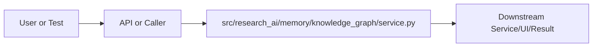

# service.py Explained

Generated educational companion for `src/research_ai/memory/knowledge_graph/service.py`. This file is intentionally detailed so a developer can understand the code, architecture role, production tradeoffs, and ML/backend concepts behind the implementation.

## File Overview

`src/research_ai/memory/knowledge_graph/service.py` is a Python module in the Memory layer: conversation, session, and knowledge graph state. It defines Concept, KnowledgeGraph and no top-level functions.

## Why This File Exists

This file isolates one responsibility in the codebase: Memory layer: conversation, session, and knowledge graph state. Separation matters because AI systems are easier to test, scale, debug, and explain when retrieval, orchestration, ML services, memory, UI, and deployment scripts have clear boundaries.

## Workflow Position

**Layer:** Memory layer: conversation, session, and knowledge graph state.

**Previous step:** caller code, an API request, a browser event, a test fixture, an import, or a startup script prepares inputs.

**Current step:** `src/research_ai/memory/knowledge_graph/service.py` performs its local responsibility.

**Next step:** downstream services, API responses, rendered UI, tests, or process execution consume the result.



## Inputs and Outputs

- **Inputs:** function arguments, class constructor dependencies, HTTP payloads, environment variables, filesystem artifacts, DOM events, or test fixtures.
- **Outputs:** return values, dictionaries, Pydantic models, rendered DOM state, API responses, logs, process startup, assertions, or side effects.
- **Serialization:** this project uses JSON for APIs/LLM planning, parquet/joblib/faiss for ML artifacts, and HTML/CSS/JS for the browser surface.

## Imports Explained

| Import | Explanation |
|---|---|
| `__future__` | Project or standard-library dependency used to import a service, type, helper, or runtime capability. Imports affect startup time, packaging, and test isolation. |
| `collections` | Project or standard-library dependency used to import a service, type, helper, or runtime capability. Imports affect startup time, packaging, and test isolation. |
| `dataclasses` | dataclasses reduce boilerplate for typed configuration/result containers. |
| `logging` | logging provides structured operational visibility without using print statements. |
| `re` | re implements regular expressions for text extraction, validation, and secret redaction. |

## Global Variables and Config

| Name | Line | Why it matters |
|---|---:|---|
| `logger` | 9 | Module-level value, constant, prompt, cache, registry, or configuration point. Check mutability and startup cost. |

## Step-by-Step Workflow

1. Load dependencies and runtime constants.
2. Accept input from the previous layer.
3. Validate, transform, route, score, render, or execute according to this file's role.
4. Return a structured output or perform a controlled side effect.
5. Let caller layers handle presentation, persistence, retries, or fallback.

## Function-by-Function Breakdown

No top-level functions are defined. Behavior is class-based, declarative, or provided through package exports.

## Class-by-Class Breakdown

### `Concept`

- **Line:** 13
- **Base classes:** `object`
- **Docstring:** No explicit class docstring.

**Methods:**
- No methods beyond inherited behavior.

```python
class Concept:
    name: str
    frequency: int = 0
    sessions: set[str] = field(default_factory=set)
    related: set[str] = field(default_factory=set)
    category_votes: dict[str, int] = field(default_factory=dict)
```

This class packages state and behavior behind a service-style interface. Constructor dependencies show what the class needs; public methods show what the rest of the system can ask it to do. In production, this boundary is where caching, model loading, artifact access, and error handling must be controlled.

### `KnowledgeGraph`

- **Line:** 21
- **Base classes:** `object`
- **Docstring:** Session-scoped knowledge graph that tracks concepts, entities, and relations.

Ingests paper metadata and chat turns to build a lightweight concept network.
All data is in-memory (per-process) and resets on server restart. The graph
provides concept frequency, co-occurrence, and session-linkage signals that
the orchestrator can use for context-aware retrieval and synthesis.

Designed to be replaced by a persistent graph database (Neo4j, NetworkX on
disk) without changing the service interface.

**Methods:**
- `__init__` at line 42: method behavior is described by its body and name
- `ingest_papers` at line 51: Extract and register concepts from paper metadata.
- `ingest_query` at line 62: Register a user query as a concept signal.
- `link_session` at line 68: Explicitly link a session to a paper concept.
- `top_concepts` at line 78: Return the most frequently encountered concepts.
- `concepts_for_session` at line 91: Return concepts encountered in a specific session.
- `related_concepts` at line 95: Return concepts that co-occurred with the given concept.
- `summary` at line 103: method behavior is described by its body and name
- `_register` at line 115: method behavior is described by its body and name
- `_extract_concepts` at line 132: method behavior is described by its body and name
- `_normalize` at line 143: method behavior is described by its body and name

```python
class KnowledgeGraph:
    """Session-scoped knowledge graph that tracks concepts, entities, and relations.

    Ingests paper metadata and chat turns to build a lightweight concept network.
    All data is in-memory (per-process) and resets on server restart. The graph
    provides concept frequency, co-occurrence, and session-linkage signals that
    the orchestrator can use for context-aware retrieval and synthesis.

    Designed to be replaced by a persistent graph database (Neo4j, NetworkX on
    disk) without changing the service interface.
    """

    # Regex patterns for extracting domain concepts from scientific text
    CONCEPT_PATTERNS = (
        r"\b(?:transformer|bert|gpt|llm|diffusion model|gnn|cnn|rnn|lstm|vae|gan)\b",
        r"\b(?:reinforcement learning|supervised learning|self-supervised|contrastive)\b",
        r"\b(?:attention mechanism|multi-head attention|positional encoding)\b",
        r"\b(?:fine-tun(?:ing|e)|pre-train(?:ing|ed)|zero-shot|few-shot)\b",
        r"\b(?:benchmark|dataset|evaluation|ablation|baseline)\b",
    )

    def __init__(self) -> None:
        self.concepts: dict[str, Concept] = {}
        self._session_concepts: dict[str, set[str]] = defaultdict(set)
        self._query_log: list[str] = []

    # ------------------------------------------------------------------
    # Ingestion
    # ------------------------------------------------------------------

    def ingest_papers(self, papers: list[dict], session_id: str = "") -> None:
        """Extract and register concepts from paper metadata."""
        for paper in papers:
            text = f"{paper.get('title', '')} {paper.get('abstract', '')}"
            concepts = self._extract_concepts(text)
            for concept in concepts:
                self._register(concept, session_id)
            # Category → concept links
            for category in str(paper.get("category", "")).split():
                self._register(category.lower(), session_id, is_category=True)

    def ingest_query(self, query: str, session_id: str = "") -> None:
        """Register a user query as a concept signal."""
        self._query_log.append(query)
        for concept in self._extract_concepts(query):
            self._register(concept, session_id)

    def link_session(self, session_id: str, paper_id: str, title: str) -> None:
        """Explicitly link a session to a paper concept."""
        key = self._normalize(title[:60])
        if key:
            self._register(key, session_id)

    # ------------------------------------------------------------------
    # Querying
    # ------------------------------------------------------------------

    def top_concepts(self, n: int = 10) -> list[dict]:
        """Return the most frequently encountered concepts."""
        ranked = sorted(self.concepts.values(), key=lambda c: c.frequency, reverse=True)
        return [
            {
                "concept": c.name,
                "frequency": c.frequency,
                "session_count": len(c.sessions),
                "related": sorted(c.related)[:5],
            }
            for c in ranked[:n]
        ]

    def concepts_for_session(self, session_id: str) -> list[str]:
        """Return concepts encountered in a specific session."""
        return sorted(self._session_concepts.get(session_id, set()))

    def related_concepts(self, concept: str, n: int = 5) -> list[str]:
        """Return concepts that co-occurred with the given concept."""
        key = self._normalize(concept)
        node = self.concepts.get(key)
        if node is None:
            return []
        return sorted(node.related, key=lambda c: self.concepts.get(c, Concept(c)).frequency, reverse=True)[:n]

    def summary(self) -> dict:
        return {
            "total_concepts": len(self.concepts),
            "total_sessions_tracked": len(self._session_concepts),
            "total_queries_logged": len(self._query_log),
            "top_concepts": self.top_concepts(5),
        }

    # ------------------------------------------------------------------
    # Private
    # ------------------------------------------------------------------

    def _register(self, name: str, session_id: str, is_category: bool = False) -> None:
        key = self._normalize(name)
        if not key:
            return
        if key not in self.concepts:
            self.concepts[key] = Concept(name=key)
        node = self.concepts[key]
```

This class packages state and behavior behind a service-style interface. Constructor dependencies show what the class needs; public methods show what the rest of the system can ask it to do. In production, this boundary is where caching, model loading, artifact access, and error handling must be controlled.


## Method-by-Method Deep Dive

### Class `KnowledgeGraph` Methods

#### `KnowledgeGraph.__init__`

- **Line:** 42
- **Kind:** synchronous method
- **Arguments:** self
- **Docstring:** No explicit docstring; behavior is inferred from the implementation and call sites.

```python
    def __init__(self) -> None:
        self.concepts: dict[str, Concept] = {}
        self._session_concepts: dict[str, set[str]] = defaultdict(set)
        self._query_log: list[str] = []
```

This method is part of the class contract. Its inputs show what state or caller data it consumes; its body shows whether it performs pure transformation, model/artifact access, retrieval, I/O, caching, validation, or orchestration. In production review, pay attention to error handling, mutation of `self`, repeated expensive work, and whether return shapes stay stable for downstream callers.

#### `KnowledgeGraph.ingest_papers`

- **Line:** 51
- **Kind:** synchronous method
- **Arguments:** self, papers, session_id
- **Docstring:** Extract and register concepts from paper metadata.

```python
    def ingest_papers(self, papers: list[dict], session_id: str = "") -> None:
        """Extract and register concepts from paper metadata."""
        for paper in papers:
            text = f"{paper.get('title', '')} {paper.get('abstract', '')}"
            concepts = self._extract_concepts(text)
            for concept in concepts:
                self._register(concept, session_id)
            # Category → concept links
            for category in str(paper.get("category", "")).split():
                self._register(category.lower(), session_id, is_category=True)
```

This method is part of the class contract. Its inputs show what state or caller data it consumes; its body shows whether it performs pure transformation, model/artifact access, retrieval, I/O, caching, validation, or orchestration. In production review, pay attention to error handling, mutation of `self`, repeated expensive work, and whether return shapes stay stable for downstream callers.

#### `KnowledgeGraph.ingest_query`

- **Line:** 62
- **Kind:** synchronous method
- **Arguments:** self, query, session_id
- **Docstring:** Register a user query as a concept signal.

```python
    def ingest_query(self, query: str, session_id: str = "") -> None:
        """Register a user query as a concept signal."""
        self._query_log.append(query)
        for concept in self._extract_concepts(query):
            self._register(concept, session_id)
```

This method is part of the class contract. Its inputs show what state or caller data it consumes; its body shows whether it performs pure transformation, model/artifact access, retrieval, I/O, caching, validation, or orchestration. In production review, pay attention to error handling, mutation of `self`, repeated expensive work, and whether return shapes stay stable for downstream callers.

#### `KnowledgeGraph.link_session`

- **Line:** 68
- **Kind:** synchronous method
- **Arguments:** self, session_id, paper_id, title
- **Docstring:** Explicitly link a session to a paper concept.

```python
    def link_session(self, session_id: str, paper_id: str, title: str) -> None:
        """Explicitly link a session to a paper concept."""
        key = self._normalize(title[:60])
        if key:
            self._register(key, session_id)
```

This method is part of the class contract. Its inputs show what state or caller data it consumes; its body shows whether it performs pure transformation, model/artifact access, retrieval, I/O, caching, validation, or orchestration. In production review, pay attention to error handling, mutation of `self`, repeated expensive work, and whether return shapes stay stable for downstream callers.

#### `KnowledgeGraph.top_concepts`

- **Line:** 78
- **Kind:** synchronous method
- **Arguments:** self, n
- **Docstring:** Return the most frequently encountered concepts.

```python
    def top_concepts(self, n: int = 10) -> list[dict]:
        """Return the most frequently encountered concepts."""
        ranked = sorted(self.concepts.values(), key=lambda c: c.frequency, reverse=True)
        return [
            {
                "concept": c.name,
                "frequency": c.frequency,
                "session_count": len(c.sessions),
                "related": sorted(c.related)[:5],
            }
            for c in ranked[:n]
        ]
```

This method is part of the class contract. Its inputs show what state or caller data it consumes; its body shows whether it performs pure transformation, model/artifact access, retrieval, I/O, caching, validation, or orchestration. In production review, pay attention to error handling, mutation of `self`, repeated expensive work, and whether return shapes stay stable for downstream callers.

#### `KnowledgeGraph.concepts_for_session`

- **Line:** 91
- **Kind:** synchronous method
- **Arguments:** self, session_id
- **Docstring:** Return concepts encountered in a specific session.

```python
    def concepts_for_session(self, session_id: str) -> list[str]:
        """Return concepts encountered in a specific session."""
        return sorted(self._session_concepts.get(session_id, set()))
```

This method is part of the class contract. Its inputs show what state or caller data it consumes; its body shows whether it performs pure transformation, model/artifact access, retrieval, I/O, caching, validation, or orchestration. In production review, pay attention to error handling, mutation of `self`, repeated expensive work, and whether return shapes stay stable for downstream callers.

#### `KnowledgeGraph.related_concepts`

- **Line:** 95
- **Kind:** synchronous method
- **Arguments:** self, concept, n
- **Docstring:** Return concepts that co-occurred with the given concept.

```python
    def related_concepts(self, concept: str, n: int = 5) -> list[str]:
        """Return concepts that co-occurred with the given concept."""
        key = self._normalize(concept)
        node = self.concepts.get(key)
        if node is None:
            return []
        return sorted(node.related, key=lambda c: self.concepts.get(c, Concept(c)).frequency, reverse=True)[:n]
```

This method is part of the class contract. Its inputs show what state or caller data it consumes; its body shows whether it performs pure transformation, model/artifact access, retrieval, I/O, caching, validation, or orchestration. In production review, pay attention to error handling, mutation of `self`, repeated expensive work, and whether return shapes stay stable for downstream callers.

#### `KnowledgeGraph.summary`

- **Line:** 103
- **Kind:** synchronous method
- **Arguments:** self
- **Docstring:** No explicit docstring; behavior is inferred from the implementation and call sites.

```python
    def summary(self) -> dict:
        return {
            "total_concepts": len(self.concepts),
            "total_sessions_tracked": len(self._session_concepts),
            "total_queries_logged": len(self._query_log),
            "top_concepts": self.top_concepts(5),
        }
```

This method is part of the class contract. Its inputs show what state or caller data it consumes; its body shows whether it performs pure transformation, model/artifact access, retrieval, I/O, caching, validation, or orchestration. In production review, pay attention to error handling, mutation of `self`, repeated expensive work, and whether return shapes stay stable for downstream callers.

#### `KnowledgeGraph._register`

- **Line:** 115
- **Kind:** synchronous method
- **Arguments:** self, name, session_id, is_category
- **Docstring:** No explicit docstring; behavior is inferred from the implementation and call sites.

```python
    def _register(self, name: str, session_id: str, is_category: bool = False) -> None:
        key = self._normalize(name)
        if not key:
            return
        if key not in self.concepts:
            self.concepts[key] = Concept(name=key)
        node = self.concepts[key]
        node.frequency += 1
        if session_id:
            node.sessions.add(session_id)
            self._session_concepts[session_id].add(key)
            # Co-occurrence edges: link to other concepts already in this session
            for other in self._session_concepts[session_id]:
                if other != key:
                    node.related.add(other)
                    self.concepts[other].related.add(key)
```

This method is part of the class contract. Its inputs show what state or caller data it consumes; its body shows whether it performs pure transformation, model/artifact access, retrieval, I/O, caching, validation, or orchestration. In production review, pay attention to error handling, mutation of `self`, repeated expensive work, and whether return shapes stay stable for downstream callers.

#### `KnowledgeGraph._extract_concepts`

- **Line:** 132
- **Kind:** synchronous method
- **Arguments:** self, text
- **Docstring:** No explicit docstring; behavior is inferred from the implementation and call sites.

```python
    def _extract_concepts(self, text: str) -> list[str]:
        found: list[str] = []
        lower = text.lower()
        for pattern in self.CONCEPT_PATTERNS:
            for match in re.finditer(pattern, lower):
                token = match.group(0).strip()
                if token:
                    found.append(token)
        return found
```

This method is part of the class contract. Its inputs show what state or caller data it consumes; its body shows whether it performs pure transformation, model/artifact access, retrieval, I/O, caching, validation, or orchestration. In production review, pay attention to error handling, mutation of `self`, repeated expensive work, and whether return shapes stay stable for downstream callers.

#### `KnowledgeGraph._normalize`

- **Line:** 143
- **Kind:** synchronous method
- **Arguments:** text
- **Docstring:** No explicit docstring; behavior is inferred from the implementation and call sites.

```python
    def _normalize(text: str) -> str:
        return re.sub(r"\s+", "_", text.strip().lower())[:80]
```

This method is part of the class contract. Its inputs show what state or caller data it consumes; its body shows whether it performs pure transformation, model/artifact access, retrieval, I/O, caching, validation, or orchestration. In production review, pay attention to error handling, mutation of `self`, repeated expensive work, and whether return shapes stay stable for downstream callers.

## Important Algorithms Used

- **Vector Normalization**: Unit-normalized vectors let inner product approximate cosine similarity, a common FAISS retrieval design.
- **LLM Inference**: LLM inference sends prompts or chat messages to a model provider and receives generated text under token, latency, and cost constraints.
- **Transformers**: Transformers use tokenization and attention layers for language understanding/generation. They are powerful but memory and latency sensitive.
- **Streaming**: Streaming improves perceived latency by sending incremental output instead of waiting for full completion.
- **Sandboxing**: Sandboxing validates and constrains user code before execution, reducing security and stability risk.

## Libraries Used

| Import | Explanation |
|---|---|
| `__future__` | Project or standard-library dependency used to import a service, type, helper, or runtime capability. Imports affect startup time, packaging, and test isolation. |
| `collections` | Project or standard-library dependency used to import a service, type, helper, or runtime capability. Imports affect startup time, packaging, and test isolation. |
| `dataclasses` | dataclasses reduce boilerplate for typed configuration/result containers. |
| `logging` | logging provides structured operational visibility without using print statements. |
| `re` | re implements regular expressions for text extraction, validation, and secret redaction. |

## ML Concepts Used

- **Vector Normalization**: Unit-normalized vectors let inner product approximate cosine similarity, a common FAISS retrieval design.
- **LLM Inference**: LLM inference sends prompts or chat messages to a model provider and receives generated text under token, latency, and cost constraints.
- **Transformers**: Transformers use tokenization and attention layers for language understanding/generation. They are powerful but memory and latency sensitive.
- **Streaming**: Streaming improves perceived latency by sending incremental output instead of waiting for full completion.
- **Sandboxing**: Sandboxing validates and constrains user code before execution, reducing security and stability risk.

## Performance and Memory Notes

- Avoid eager loading of heavy ML models unless startup latency is acceptable.
- Cache expensive clients, tokenizers, vector stores, and embeddings carefully.
- Use float32 for embedding vectors because it halves memory compared with float64 and matches FAISS/neural inference expectations.
- Bound prompt length, uploaded content, result counts, and token budgets to control latency and memory.
- Watch copies of large metadata frames, embedding matrices, and file buffers.

## Scalability Notes

- In-memory state works for local demos but needs Redis/database/object storage for multi-worker cloud deployment.
- CPU/GPU inference should often be separated from the web API when traffic grows.
- Retrieval can start exact and move to approximate indexes as corpus size grows.
- Batch operations and cache repeated work to improve throughput.
- Add metrics for latency, errors, fallback frequency, retrieval hit rate, and token usage.

## Production Engineering Notes

- Keep interfaces stable because other files may import this module or depend on its response shape.
- Prefer typed/structured data over free-form strings at service boundaries.
- Log operational context without secrets or huge payloads.
- Make fallback behavior explicit so users get useful output even when LLMs or artifacts fail.
- Keep provider-specific logic behind adapters so Groq/OpenRouter/Google/Ollama can be swapped.

## Common Bugs and Failure Cases

- Missing `.env` values, model artifacts, or Ollama models can trigger degraded behavior.
- Type mismatches occur when LLM-generated tool arguments cross into strict Python code.
- Empty retrieval results must not become hallucinated answers.
- Network calls need timeouts and careful retry behavior.
- Frontend IDs/classes and API schemas are contracts; changing one side without the other breaks workflows.

## Security Considerations

- Handles credentials or environment configuration. Keep secrets in environment variables and redact them from logs.
- Deals with execution or subprocesses. Maintain AST validation, isolated mode, timeouts, and least privilege.

## Real Industry Usage

- This pattern appears in enterprise RAG assistants, scientific search tools, internal research copilots, and ML platform demos.
- The layered design mirrors production systems: API facade, orchestration, retrieval, evaluation, synthesis, UI, and deployment.
- Clear separation lets teams replace model providers, improve retrieval, harden security, or redesign UI independently.

## Optimization Opportunities

- Add tracing around each workflow step.
- Strengthen schema validation at boundaries.
- Persist conversation/session state outside process memory.
- Add load tests and adversarial tests for prompt injection, empty evidence, and large uploads.
- Consider approximate vector indexes, reranker models, or batching when corpus/traffic grows.

## How This Connects To Other Files

- `src/research_ai/memory/knowledge_graph/service.py` is connected through imports, startup scripts, API routes, frontend selectors, tests, or artifact paths.
- `src/research_ai/platform.py` is the backend composition root.
- `src/research_ai/api/main.py` exposes backend behavior over HTTP.
- Retrieval modules depend on artifacts under `artifacts/`.
- Frontend files depend on stable endpoint and DOM contracts.

## End-to-End Flow Summary

- A user/browser/test/startup event enters the system.
- The relevant layer validates or normalizes input.
- Retrieval, ML, orchestration, execution, or UI rendering happens.
- A structured result, visual state, or process side effect is produced.
- Fallbacks and tests keep behavior understandable when dependencies are unavailable.

## Interview Questions

1. What responsibility does this file own?
2. What inputs and outputs define its contract?
3. Which dependencies are expensive or operationally risky?
4. What breaks if this file changes shape?
5. How would you scale or test this behavior in production?

## Key Takeaways

- `src/research_ai/memory/knowledge_graph/service.py` should be understood as part of a layered AI research platform.
- Trace data flow from inputs to transformations to outputs.
- Production readiness comes from explicit contracts, bounded resources, observability, secure defaults, and graceful fallback.

## Fully Commented Source

This section repeats the original source with an explanatory comment before every line. The comments are educational only; they are not inserted into the production source file.

```python
# L0001: Starts, ends, or continues a docstring that documents module, class, or function intent.
"""In-memory knowledge graph for tracking research concepts across sessions."""
# L0002: Enables future Python behavior so annotations/import semantics stay modern and predictable.
from __future__ import annotations
# L0003: Blank line that visually separates logical sections and improves readability.

# L0004: Imports a dependency, type, or project module needed by later code in this file.
import logging
# L0005: Imports a dependency, type, or project module needed by later code in this file.
import re
# L0006: Imports a dependency, type, or project module needed by later code in this file.
from collections import defaultdict
# L0007: Imports a dependency, type, or project module needed by later code in this file.
from dataclasses import dataclass, field
# L0008: Blank line that visually separates logical sections and improves readability.

# L0009: Assigns or updates a value used later in the workflow; check mutability and data shape.
logger = logging.getLogger(__name__)
# L0010: Blank line that visually separates logical sections and improves readability.

# L0011: Blank line that visually separates logical sections and improves readability.

# L0012: Decorator that modifies the function/class below, commonly for routing, dataclasses, caching, or properties.
@dataclass
# L0013: Defines a class that groups related state and behavior behind a reusable interface.
class Concept:
# L0014: Executes Python logic as part of this file's workflow; read surrounding lines for data flow and side effects.
    name: str
# L0015: Assigns or updates a value used later in the workflow; check mutability and data shape.
    frequency: int = 0
# L0016: Assigns or updates a value used later in the workflow; check mutability and data shape.
    sessions: set[str] = field(default_factory=set)
# L0017: Assigns or updates a value used later in the workflow; check mutability and data shape.
    related: set[str] = field(default_factory=set)
# L0018: Assigns or updates a value used later in the workflow; check mutability and data shape.
    category_votes: dict[str, int] = field(default_factory=dict)
# L0019: Blank line that visually separates logical sections and improves readability.

# L0020: Blank line that visually separates logical sections and improves readability.

# L0021: Defines a class that groups related state and behavior behind a reusable interface.
class KnowledgeGraph:
# L0022: Starts, ends, or continues a docstring that documents module, class, or function intent.
    """Session-scoped knowledge graph that tracks concepts, entities, and relations.
# L0023: Blank line that visually separates logical sections and improves readability.

# L0024: Executes Python logic as part of this file's workflow; read surrounding lines for data flow and side effects.
    Ingests paper metadata and chat turns to build a lightweight concept network.
# L0025: Executes Python logic as part of this file's workflow; read surrounding lines for data flow and side effects.
    All data is in-memory (per-process) and resets on server restart. The graph
# L0026: Executes Python logic as part of this file's workflow; read surrounding lines for data flow and side effects.
    provides concept frequency, co-occurrence, and session-linkage signals that
# L0027: Executes Python logic as part of this file's workflow; read surrounding lines for data flow and side effects.
    the orchestrator can use for context-aware retrieval and synthesis.
# L0028: Blank line that visually separates logical sections and improves readability.

# L0029: Executes Python logic as part of this file's workflow; read surrounding lines for data flow and side effects.
    Designed to be replaced by a persistent graph database (Neo4j, NetworkX on
# L0030: Executes Python logic as part of this file's workflow; read surrounding lines for data flow and side effects.
    disk) without changing the service interface.
# L0031: Starts, ends, or continues a docstring that documents module, class, or function intent.
    """
# L0032: Blank line that visually separates logical sections and improves readability.

# L0033: Developer comment explaining intent, caveat, section boundary, or operational reasoning.
    # Regex patterns for extracting domain concepts from scientific text
# L0034: Assigns or updates a value used later in the workflow; check mutability and data shape.
    CONCEPT_PATTERNS = (
# L0035: Executes Python logic as part of this file's workflow; read surrounding lines for data flow and side effects.
        r"\b(?:transformer|bert|gpt|llm|diffusion model|gnn|cnn|rnn|lstm|vae|gan)\b",
# L0036: Executes Python logic as part of this file's workflow; read surrounding lines for data flow and side effects.
        r"\b(?:reinforcement learning|supervised learning|self-supervised|contrastive)\b",
# L0037: Executes Python logic as part of this file's workflow; read surrounding lines for data flow and side effects.
        r"\b(?:attention mechanism|multi-head attention|positional encoding)\b",
# L0038: Executes Python logic as part of this file's workflow; read surrounding lines for data flow and side effects.
        r"\b(?:fine-tun(?:ing|e)|pre-train(?:ing|ed)|zero-shot|few-shot)\b",
# L0039: Executes Python logic as part of this file's workflow; read surrounding lines for data flow and side effects.
        r"\b(?:benchmark|dataset|evaluation|ablation|baseline)\b",
# L0040: Executes Python logic as part of this file's workflow; read surrounding lines for data flow and side effects.
    )
# L0041: Blank line that visually separates logical sections and improves readability.

# L0042: Defines a function or method; parameters are the input contract and the body implements the workflow.
    def __init__(self) -> None:
# L0043: Assigns or updates a value used later in the workflow; check mutability and data shape.
        self.concepts: dict[str, Concept] = {}
# L0044: Assigns or updates a value used later in the workflow; check mutability and data shape.
        self._session_concepts: dict[str, set[str]] = defaultdict(set)
# L0045: Assigns or updates a value used later in the workflow; check mutability and data shape.
        self._query_log: list[str] = []
# L0046: Blank line that visually separates logical sections and improves readability.

# L0047: Developer comment explaining intent, caveat, section boundary, or operational reasoning.
    # ------------------------------------------------------------------
# L0048: Developer comment explaining intent, caveat, section boundary, or operational reasoning.
    # Ingestion
# L0049: Developer comment explaining intent, caveat, section boundary, or operational reasoning.
    # ------------------------------------------------------------------
# L0050: Blank line that visually separates logical sections and improves readability.

# L0051: Defines a function or method; parameters are the input contract and the body implements the workflow.
    def ingest_papers(self, papers: list[dict], session_id: str = "") -> None:
# L0052: Starts, ends, or continues a docstring that documents module, class, or function intent.
        """Extract and register concepts from paper metadata."""
# L0053: Iterates over data, retry attempts, files, results, or workflow steps.
        for paper in papers:
# L0054: Assigns or updates a value used later in the workflow; check mutability and data shape.
            text = f"{paper.get('title', '')} {paper.get('abstract', '')}"
# L0055: Assigns or updates a value used later in the workflow; check mutability and data shape.
            concepts = self._extract_concepts(text)
# L0056: Iterates over data, retry attempts, files, results, or workflow steps.
            for concept in concepts:
# L0057: Executes Python logic as part of this file's workflow; read surrounding lines for data flow and side effects.
                self._register(concept, session_id)
# L0058: Developer comment explaining intent, caveat, section boundary, or operational reasoning.
            # Category → concept links
# L0059: Iterates over data, retry attempts, files, results, or workflow steps.
            for category in str(paper.get("category", "")).split():
# L0060: Assigns or updates a value used later in the workflow; check mutability and data shape.
                self._register(category.lower(), session_id, is_category=True)
# L0061: Blank line that visually separates logical sections and improves readability.

# L0062: Defines a function or method; parameters are the input contract and the body implements the workflow.
    def ingest_query(self, query: str, session_id: str = "") -> None:
# L0063: Starts, ends, or continues a docstring that documents module, class, or function intent.
        """Register a user query as a concept signal."""
# L0064: Executes Python logic as part of this file's workflow; read surrounding lines for data flow and side effects.
        self._query_log.append(query)
# L0065: Iterates over data, retry attempts, files, results, or workflow steps.
        for concept in self._extract_concepts(query):
# L0066: Executes Python logic as part of this file's workflow; read surrounding lines for data flow and side effects.
            self._register(concept, session_id)
# L0067: Blank line that visually separates logical sections and improves readability.

# L0068: Defines a function or method; parameters are the input contract and the body implements the workflow.
    def link_session(self, session_id: str, paper_id: str, title: str) -> None:
# L0069: Starts, ends, or continues a docstring that documents module, class, or function intent.
        """Explicitly link a session to a paper concept."""
# L0070: Assigns or updates a value used later in the workflow; check mutability and data shape.
        key = self._normalize(title[:60])
# L0071: Branches execution based on a condition, usually for validation, fallback, or mode-specific behavior.
        if key:
# L0072: Executes Python logic as part of this file's workflow; read surrounding lines for data flow and side effects.
            self._register(key, session_id)
# L0073: Blank line that visually separates logical sections and improves readability.

# L0074: Developer comment explaining intent, caveat, section boundary, or operational reasoning.
    # ------------------------------------------------------------------
# L0075: Developer comment explaining intent, caveat, section boundary, or operational reasoning.
    # Querying
# L0076: Developer comment explaining intent, caveat, section boundary, or operational reasoning.
    # ------------------------------------------------------------------
# L0077: Blank line that visually separates logical sections and improves readability.

# L0078: Defines a function or method; parameters are the input contract and the body implements the workflow.
    def top_concepts(self, n: int = 10) -> list[dict]:
# L0079: Starts, ends, or continues a docstring that documents module, class, or function intent.
        """Return the most frequently encountered concepts."""
# L0080: Assigns or updates a value used later in the workflow; check mutability and data shape.
        ranked = sorted(self.concepts.values(), key=lambda c: c.frequency, reverse=True)
# L0081: Returns the computed result to the caller; this shape becomes part of the downstream contract.
        return [
# L0082: Executes Python logic as part of this file's workflow; read surrounding lines for data flow and side effects.
            {
# L0083: Executes Python logic as part of this file's workflow; read surrounding lines for data flow and side effects.
                "concept": c.name,
# L0084: Executes Python logic as part of this file's workflow; read surrounding lines for data flow and side effects.
                "frequency": c.frequency,
# L0085: Executes Python logic as part of this file's workflow; read surrounding lines for data flow and side effects.
                "session_count": len(c.sessions),
# L0086: Executes Python logic as part of this file's workflow; read surrounding lines for data flow and side effects.
                "related": sorted(c.related)[:5],
# L0087: Executes Python logic as part of this file's workflow; read surrounding lines for data flow and side effects.
            }
# L0088: Iterates over data, retry attempts, files, results, or workflow steps.
            for c in ranked[:n]
# L0089: Executes Python logic as part of this file's workflow; read surrounding lines for data flow and side effects.
        ]
# L0090: Blank line that visually separates logical sections and improves readability.

# L0091: Defines a function or method; parameters are the input contract and the body implements the workflow.
    def concepts_for_session(self, session_id: str) -> list[str]:
# L0092: Starts, ends, or continues a docstring that documents module, class, or function intent.
        """Return concepts encountered in a specific session."""
# L0093: Returns the computed result to the caller; this shape becomes part of the downstream contract.
        return sorted(self._session_concepts.get(session_id, set()))
# L0094: Blank line that visually separates logical sections and improves readability.

# L0095: Defines a function or method; parameters are the input contract and the body implements the workflow.
    def related_concepts(self, concept: str, n: int = 5) -> list[str]:
# L0096: Starts, ends, or continues a docstring that documents module, class, or function intent.
        """Return concepts that co-occurred with the given concept."""
# L0097: Assigns or updates a value used later in the workflow; check mutability and data shape.
        key = self._normalize(concept)
# L0098: Assigns or updates a value used later in the workflow; check mutability and data shape.
        node = self.concepts.get(key)
# L0099: Branches execution based on a condition, usually for validation, fallback, or mode-specific behavior.
        if node is None:
# L0100: Returns the computed result to the caller; this shape becomes part of the downstream contract.
            return []
# L0101: Returns the computed result to the caller; this shape becomes part of the downstream contract.
        return sorted(node.related, key=lambda c: self.concepts.get(c, Concept(c)).frequency, reverse=True)[:n]
# L0102: Blank line that visually separates logical sections and improves readability.

# L0103: Defines a function or method; parameters are the input contract and the body implements the workflow.
    def summary(self) -> dict:
# L0104: Returns the computed result to the caller; this shape becomes part of the downstream contract.
        return {
# L0105: Executes Python logic as part of this file's workflow; read surrounding lines for data flow and side effects.
            "total_concepts": len(self.concepts),
# L0106: Executes Python logic as part of this file's workflow; read surrounding lines for data flow and side effects.
            "total_sessions_tracked": len(self._session_concepts),
# L0107: Executes Python logic as part of this file's workflow; read surrounding lines for data flow and side effects.
            "total_queries_logged": len(self._query_log),
# L0108: Executes Python logic as part of this file's workflow; read surrounding lines for data flow and side effects.
            "top_concepts": self.top_concepts(5),
# L0109: Executes Python logic as part of this file's workflow; read surrounding lines for data flow and side effects.
        }
# L0110: Blank line that visually separates logical sections and improves readability.

# L0111: Developer comment explaining intent, caveat, section boundary, or operational reasoning.
    # ------------------------------------------------------------------
# L0112: Developer comment explaining intent, caveat, section boundary, or operational reasoning.
    # Private
# L0113: Developer comment explaining intent, caveat, section boundary, or operational reasoning.
    # ------------------------------------------------------------------
# L0114: Blank line that visually separates logical sections and improves readability.

# L0115: Defines a function or method; parameters are the input contract and the body implements the workflow.
    def _register(self, name: str, session_id: str, is_category: bool = False) -> None:
# L0116: Assigns or updates a value used later in the workflow; check mutability and data shape.
        key = self._normalize(name)
# L0117: Branches execution based on a condition, usually for validation, fallback, or mode-specific behavior.
        if not key:
# L0118: Executes Python logic as part of this file's workflow; read surrounding lines for data flow and side effects.
            return
# L0119: Branches execution based on a condition, usually for validation, fallback, or mode-specific behavior.
        if key not in self.concepts:
# L0120: Assigns or updates a value used later in the workflow; check mutability and data shape.
            self.concepts[key] = Concept(name=key)
# L0121: Assigns or updates a value used later in the workflow; check mutability and data shape.
        node = self.concepts[key]
# L0122: Assigns or updates a value used later in the workflow; check mutability and data shape.
        node.frequency += 1
# L0123: Branches execution based on a condition, usually for validation, fallback, or mode-specific behavior.
        if session_id:
# L0124: Executes Python logic as part of this file's workflow; read surrounding lines for data flow and side effects.
            node.sessions.add(session_id)
# L0125: Executes Python logic as part of this file's workflow; read surrounding lines for data flow and side effects.
            self._session_concepts[session_id].add(key)
# L0126: Developer comment explaining intent, caveat, section boundary, or operational reasoning.
            # Co-occurrence edges: link to other concepts already in this session
# L0127: Iterates over data, retry attempts, files, results, or workflow steps.
            for other in self._session_concepts[session_id]:
# L0128: Branches execution based on a condition, usually for validation, fallback, or mode-specific behavior.
                if other != key:
# L0129: Executes Python logic as part of this file's workflow; read surrounding lines for data flow and side effects.
                    node.related.add(other)
# L0130: Executes Python logic as part of this file's workflow; read surrounding lines for data flow and side effects.
                    self.concepts[other].related.add(key)
# L0131: Blank line that visually separates logical sections and improves readability.

# L0132: Defines a function or method; parameters are the input contract and the body implements the workflow.
    def _extract_concepts(self, text: str) -> list[str]:
# L0133: Assigns or updates a value used later in the workflow; check mutability and data shape.
        found: list[str] = []
# L0134: Assigns or updates a value used later in the workflow; check mutability and data shape.
        lower = text.lower()
# L0135: Iterates over data, retry attempts, files, results, or workflow steps.
        for pattern in self.CONCEPT_PATTERNS:
# L0136: Iterates over data, retry attempts, files, results, or workflow steps.
            for match in re.finditer(pattern, lower):
# L0137: Assigns or updates a value used later in the workflow; check mutability and data shape.
                token = match.group(0).strip()
# L0138: Branches execution based on a condition, usually for validation, fallback, or mode-specific behavior.
                if token:
# L0139: Executes Python logic as part of this file's workflow; read surrounding lines for data flow and side effects.
                    found.append(token)
# L0140: Returns the computed result to the caller; this shape becomes part of the downstream contract.
        return found
# L0141: Blank line that visually separates logical sections and improves readability.

# L0142: Decorator that modifies the function/class below, commonly for routing, dataclasses, caching, or properties.
    @staticmethod
# L0143: Defines a function or method; parameters are the input contract and the body implements the workflow.
    def _normalize(text: str) -> str:
# L0144: Returns the computed result to the caller; this shape becomes part of the downstream contract.
        return re.sub(r"\s+", "_", text.strip().lower())[:80]
```

## Source Walkthrough

The complete source is included because the file is short enough to study directly.

```python
"""In-memory knowledge graph for tracking research concepts across sessions."""
from __future__ import annotations

import logging
import re
from collections import defaultdict
from dataclasses import dataclass, field

logger = logging.getLogger(__name__)


@dataclass
class Concept:
    name: str
    frequency: int = 0
    sessions: set[str] = field(default_factory=set)
    related: set[str] = field(default_factory=set)
    category_votes: dict[str, int] = field(default_factory=dict)


class KnowledgeGraph:
    """Session-scoped knowledge graph that tracks concepts, entities, and relations.

    Ingests paper metadata and chat turns to build a lightweight concept network.
    All data is in-memory (per-process) and resets on server restart. The graph
    provides concept frequency, co-occurrence, and session-linkage signals that
    the orchestrator can use for context-aware retrieval and synthesis.

    Designed to be replaced by a persistent graph database (Neo4j, NetworkX on
    disk) without changing the service interface.
    """

    # Regex patterns for extracting domain concepts from scientific text
    CONCEPT_PATTERNS = (
        r"\b(?:transformer|bert|gpt|llm|diffusion model|gnn|cnn|rnn|lstm|vae|gan)\b",
        r"\b(?:reinforcement learning|supervised learning|self-supervised|contrastive)\b",
        r"\b(?:attention mechanism|multi-head attention|positional encoding)\b",
        r"\b(?:fine-tun(?:ing|e)|pre-train(?:ing|ed)|zero-shot|few-shot)\b",
        r"\b(?:benchmark|dataset|evaluation|ablation|baseline)\b",
    )

    def __init__(self) -> None:
        self.concepts: dict[str, Concept] = {}
        self._session_concepts: dict[str, set[str]] = defaultdict(set)
        self._query_log: list[str] = []

    # ------------------------------------------------------------------
    # Ingestion
    # ------------------------------------------------------------------

    def ingest_papers(self, papers: list[dict], session_id: str = "") -> None:
        """Extract and register concepts from paper metadata."""
        for paper in papers:
            text = f"{paper.get('title', '')} {paper.get('abstract', '')}"
            concepts = self._extract_concepts(text)
            for concept in concepts:
                self._register(concept, session_id)
            # Category → concept links
            for category in str(paper.get("category", "")).split():
                self._register(category.lower(), session_id, is_category=True)

    def ingest_query(self, query: str, session_id: str = "") -> None:
        """Register a user query as a concept signal."""
        self._query_log.append(query)
        for concept in self._extract_concepts(query):
            self._register(concept, session_id)

    def link_session(self, session_id: str, paper_id: str, title: str) -> None:
        """Explicitly link a session to a paper concept."""
        key = self._normalize(title[:60])
        if key:
            self._register(key, session_id)

    # ------------------------------------------------------------------
    # Querying
    # ------------------------------------------------------------------

    def top_concepts(self, n: int = 10) -> list[dict]:
        """Return the most frequently encountered concepts."""
        ranked = sorted(self.concepts.values(), key=lambda c: c.frequency, reverse=True)
        return [
            {
                "concept": c.name,
                "frequency": c.frequency,
                "session_count": len(c.sessions),
                "related": sorted(c.related)[:5],
            }
            for c in ranked[:n]
        ]

    def concepts_for_session(self, session_id: str) -> list[str]:
        """Return concepts encountered in a specific session."""
        return sorted(self._session_concepts.get(session_id, set()))

    def related_concepts(self, concept: str, n: int = 5) -> list[str]:
        """Return concepts that co-occurred with the given concept."""
        key = self._normalize(concept)
        node = self.concepts.get(key)
        if node is None:
            return []
        return sorted(node.related, key=lambda c: self.concepts.get(c, Concept(c)).frequency, reverse=True)[:n]

    def summary(self) -> dict:
        return {
            "total_concepts": len(self.concepts),
            "total_sessions_tracked": len(self._session_concepts),
            "total_queries_logged": len(self._query_log),
            "top_concepts": self.top_concepts(5),
        }

    # ------------------------------------------------------------------
    # Private
    # ------------------------------------------------------------------

    def _register(self, name: str, session_id: str, is_category: bool = False) -> None:
        key = self._normalize(name)
        if not key:
            return
        if key not in self.concepts:
            self.concepts[key] = Concept(name=key)
        node = self.concepts[key]
        node.frequency += 1
        if session_id:
            node.sessions.add(session_id)
            self._session_concepts[session_id].add(key)
            # Co-occurrence edges: link to other concepts already in this session
            for other in self._session_concepts[session_id]:
                if other != key:
                    node.related.add(other)
                    self.concepts[other].related.add(key)

    def _extract_concepts(self, text: str) -> list[str]:
        found: list[str] = []
        lower = text.lower()
        for pattern in self.CONCEPT_PATTERNS:
            for match in re.finditer(pattern, lower):
                token = match.group(0).strip()
                if token:
                    found.append(token)
        return found

    @staticmethod
    def _normalize(text: str) -> str:
        return re.sub(r"\s+", "_", text.strip().lower())[:80]
```
