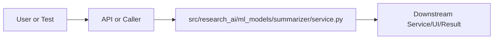

# service.py Explained

Generated educational companion for `src/research_ai/ml_models/summarizer/service.py`. This file is intentionally detailed so a developer can understand the code, architecture role, production tradeoffs, and ML/backend concepts behind the implementation.

## File Overview

`src/research_ai/ml_models/summarizer/service.py` is a Python module in the ML services layer: classifiers, summarizers, similarity, ranking, and extraction. It defines ScientificSummarizer and no top-level functions.

## Why This File Exists

This file isolates one responsibility in the codebase: ML services layer: classifiers, summarizers, similarity, ranking, and extraction. Separation matters because AI systems are easier to test, scale, debug, and explain when retrieval, orchestration, ML services, memory, UI, and deployment scripts have clear boundaries.

## Workflow Position

**Layer:** ML services layer: classifiers, summarizers, similarity, ranking, and extraction.

**Previous step:** caller code, an API request, a browser event, a test fixture, an import, or a startup script prepares inputs.

**Current step:** `src/research_ai/ml_models/summarizer/service.py` performs its local responsibility.

**Next step:** downstream services, API responses, rendered UI, tests, or process execution consume the result.



## Inputs and Outputs

- **Inputs:** function arguments, class constructor dependencies, HTTP payloads, environment variables, filesystem artifacts, DOM events, or test fixtures.
- **Outputs:** return values, dictionaries, Pydantic models, rendered DOM state, API responses, logs, process startup, assertions, or side effects.
- **Serialization:** this project uses JSON for APIs/LLM planning, parquet/joblib/faiss for ML artifacts, and HTML/CSS/JS for the browser surface.

## Imports Explained

| Import | Explanation |
|---|---|
| `__future__` | Project or standard-library dependency used to import a service, type, helper, or runtime capability. Imports affect startup time, packaging, and test isolation. |
| `os` | os reads environment variables and process/runtime configuration. |

## Global Variables and Config

No major module-level variables are declared. This reduces hidden state and keeps imports lightweight.

## Step-by-Step Workflow

1. Load dependencies and runtime constants.
2. Accept input from the previous layer.
3. Validate, transform, route, score, render, or execute according to this file's role.
4. Return a structured output or perform a controlled side effect.
5. Let caller layers handle presentation, persistence, retries, or fallback.

## Function-by-Function Breakdown

No top-level functions are defined. Behavior is class-based, declarative, or provided through package exports.

## Class-by-Class Breakdown

### `ScientificSummarizer`

- **Line:** 6
- **Base classes:** `object`
- **Docstring:** Scientific summarizer with lazy local/cloud model loading.

**Methods:**
- `__init__` at line 14: method behavior is described by its body and name
- `ready` at line 22: method behavior is described by its body and name
- `_ensure_loaded` at line 25: method behavior is described by its body and name
- `summarize` at line 38: method behavior is described by its body and name

```python
class ScientificSummarizer:
    """Scientific summarizer with lazy local/cloud model loading."""

    SUMMARIZE_SYSTEM = (
        "You are an expert research paper summarizer. Highlight contribution, "
        "methodology, main findings, limitations, and scientific impact."
    )

    def __init__(self, model_name: str = "sshleifer/distilbart-cnn-12-6") -> None:
        self.model_name = model_name
        self.backend = os.getenv("LLM_BACKEND", "cloud").strip().lower()
        self._tokenizer = None
        self._model = None
        self._cloud = None

    @property
    def ready(self) -> bool:
        return True

    def _ensure_loaded(self) -> None:
        if self.backend == "cloud":
            if self._cloud is None:
                from research_ai.llm import CloudLLMClient

                self._cloud = CloudLLMClient()
            return
        if self._tokenizer is None or self._model is None:
            from transformers import AutoModelForSeq2SeqLM, AutoTokenizer

            self._tokenizer = AutoTokenizer.from_pretrained(self.model_name)
            self._model = AutoModelForSeq2SeqLM.from_pretrained(self.model_name)

    def summarize(self, text: str, max_length: int = 300, min_length: int = 80) -> str:
        if not text or not text.strip():
            return ""
        self._ensure_loaded()
        if self.backend == "cloud":
            prompt = (
                "Summarize this scientific text with these sections:\n"
                "Key Contribution, Methodology, Main Findings, Limitations, Impact.\n\n"
                f"Text:\n{text[:3500]}"
            )
            return self._cloud.generate(prompt, max_tokens=max_length, system=self.SUMMARIZE_SYSTEM)  # type: ignore[union-attr]

        prompt = f"summarize: {text}"
        inputs = self._tokenizer(prompt, return_tensors="pt", truncation=True, max_length=1024)  # type: ignore[call-arg]
        output_ids = self._model.generate(  # type: ignore[union-attr]
            **inputs, max_new_tokens=max_length, min_length=min_length, do_sample=False
        )
        return self._tokenizer.decode(output_ids[0], skip_special_tokens=True)  # type: ignore[union-attr]
```

This class packages state and behavior behind a service-style interface. Constructor dependencies show what the class needs; public methods show what the rest of the system can ask it to do. In production, this boundary is where caching, model loading, artifact access, and error handling must be controlled.


## Method-by-Method Deep Dive

### Class `ScientificSummarizer` Methods

#### `ScientificSummarizer.__init__`

- **Line:** 14
- **Kind:** synchronous method
- **Arguments:** self, model_name
- **Docstring:** No explicit docstring; behavior is inferred from the implementation and call sites.

```python
    def __init__(self, model_name: str = "sshleifer/distilbart-cnn-12-6") -> None:
        self.model_name = model_name
        self.backend = os.getenv("LLM_BACKEND", "cloud").strip().lower()
        self._tokenizer = None
        self._model = None
        self._cloud = None
```

This method is part of the class contract. Its inputs show what state or caller data it consumes; its body shows whether it performs pure transformation, model/artifact access, retrieval, I/O, caching, validation, or orchestration. In production review, pay attention to error handling, mutation of `self`, repeated expensive work, and whether return shapes stay stable for downstream callers.

#### `ScientificSummarizer.ready`

- **Line:** 22
- **Kind:** synchronous method
- **Arguments:** self
- **Docstring:** No explicit docstring; behavior is inferred from the implementation and call sites.

```python
    def ready(self) -> bool:
        return True
```

This method is part of the class contract. Its inputs show what state or caller data it consumes; its body shows whether it performs pure transformation, model/artifact access, retrieval, I/O, caching, validation, or orchestration. In production review, pay attention to error handling, mutation of `self`, repeated expensive work, and whether return shapes stay stable for downstream callers.

#### `ScientificSummarizer._ensure_loaded`

- **Line:** 25
- **Kind:** synchronous method
- **Arguments:** self
- **Docstring:** No explicit docstring; behavior is inferred from the implementation and call sites.

```python
    def _ensure_loaded(self) -> None:
        if self.backend == "cloud":
            if self._cloud is None:
                from research_ai.llm import CloudLLMClient

                self._cloud = CloudLLMClient()
            return
        if self._tokenizer is None or self._model is None:
            from transformers import AutoModelForSeq2SeqLM, AutoTokenizer

            self._tokenizer = AutoTokenizer.from_pretrained(self.model_name)
            self._model = AutoModelForSeq2SeqLM.from_pretrained(self.model_name)
```

This method is part of the class contract. Its inputs show what state or caller data it consumes; its body shows whether it performs pure transformation, model/artifact access, retrieval, I/O, caching, validation, or orchestration. In production review, pay attention to error handling, mutation of `self`, repeated expensive work, and whether return shapes stay stable for downstream callers.

#### `ScientificSummarizer.summarize`

- **Line:** 38
- **Kind:** synchronous method
- **Arguments:** self, text, max_length, min_length
- **Docstring:** No explicit docstring; behavior is inferred from the implementation and call sites.

```python
    def summarize(self, text: str, max_length: int = 300, min_length: int = 80) -> str:
        if not text or not text.strip():
            return ""
        self._ensure_loaded()
        if self.backend == "cloud":
            prompt = (
                "Summarize this scientific text with these sections:\n"
                "Key Contribution, Methodology, Main Findings, Limitations, Impact.\n\n"
                f"Text:\n{text[:3500]}"
            )
            return self._cloud.generate(prompt, max_tokens=max_length, system=self.SUMMARIZE_SYSTEM)  # type: ignore[union-attr]

        prompt = f"summarize: {text}"
        inputs = self._tokenizer(prompt, return_tensors="pt", truncation=True, max_length=1024)  # type: ignore[call-arg]
        output_ids = self._model.generate(  # type: ignore[union-attr]
            **inputs, max_new_tokens=max_length, min_length=min_length, do_sample=False
        )
        return self._tokenizer.decode(output_ids[0], skip_special_tokens=True)  # type: ignore[union-attr]
```

This method is part of the class contract. Its inputs show what state or caller data it consumes; its body shows whether it performs pure transformation, model/artifact access, retrieval, I/O, caching, validation, or orchestration. In production review, pay attention to error handling, mutation of `self`, repeated expensive work, and whether return shapes stay stable for downstream callers.

## Important Algorithms Used

- **LLM Inference**: LLM inference sends prompts or chat messages to a model provider and receives generated text under token, latency, and cost constraints.
- **Transformers**: Transformers use tokenization and attention layers for language understanding/generation. They are powerful but memory and latency sensitive.

## Libraries Used

| Import | Explanation |
|---|---|
| `__future__` | Project or standard-library dependency used to import a service, type, helper, or runtime capability. Imports affect startup time, packaging, and test isolation. |
| `os` | os reads environment variables and process/runtime configuration. |

## ML Concepts Used

- **LLM Inference**: LLM inference sends prompts or chat messages to a model provider and receives generated text under token, latency, and cost constraints.
- **Transformers**: Transformers use tokenization and attention layers for language understanding/generation. They are powerful but memory and latency sensitive.

## Performance and Memory Notes

- Avoid eager loading of heavy ML models unless startup latency is acceptable.
- Cache expensive clients, tokenizers, vector stores, and embeddings carefully.
- Use float32 for embedding vectors because it halves memory compared with float64 and matches FAISS/neural inference expectations.
- Bound prompt length, uploaded content, result counts, and token budgets to control latency and memory.
- Watch copies of large metadata frames, embedding matrices, and file buffers.

## Scalability Notes

- In-memory state works for local demos but needs Redis/database/object storage for multi-worker cloud deployment.
- CPU/GPU inference should often be separated from the web API when traffic grows.
- Retrieval can start exact and move to approximate indexes as corpus size grows.
- Batch operations and cache repeated work to improve throughput.
- Add metrics for latency, errors, fallback frequency, retrieval hit rate, and token usage.

## Production Engineering Notes

- Keep interfaces stable because other files may import this module or depend on its response shape.
- Prefer typed/structured data over free-form strings at service boundaries.
- Log operational context without secrets or huge payloads.
- Make fallback behavior explicit so users get useful output even when LLMs or artifacts fail.
- Keep provider-specific logic behind adapters so Groq/OpenRouter/Google/Ollama can be swapped.

## Common Bugs and Failure Cases

- Missing `.env` values, model artifacts, or Ollama models can trigger degraded behavior.
- Type mismatches occur when LLM-generated tool arguments cross into strict Python code.
- Empty retrieval results must not become hallucinated answers.
- Network calls need timeouts and careful retry behavior.
- Frontend IDs/classes and API schemas are contracts; changing one side without the other breaks workflows.

## Security Considerations

- Handles credentials or environment configuration. Keep secrets in environment variables and redact them from logs.

## Real Industry Usage

- This pattern appears in enterprise RAG assistants, scientific search tools, internal research copilots, and ML platform demos.
- The layered design mirrors production systems: API facade, orchestration, retrieval, evaluation, synthesis, UI, and deployment.
- Clear separation lets teams replace model providers, improve retrieval, harden security, or redesign UI independently.

## Optimization Opportunities

- Add tracing around each workflow step.
- Strengthen schema validation at boundaries.
- Persist conversation/session state outside process memory.
- Add load tests and adversarial tests for prompt injection, empty evidence, and large uploads.
- Consider approximate vector indexes, reranker models, or batching when corpus/traffic grows.

## How This Connects To Other Files

- `src/research_ai/ml_models/summarizer/service.py` is connected through imports, startup scripts, API routes, frontend selectors, tests, or artifact paths.
- `src/research_ai/platform.py` is the backend composition root.
- `src/research_ai/api/main.py` exposes backend behavior over HTTP.
- Retrieval modules depend on artifacts under `artifacts/`.
- Frontend files depend on stable endpoint and DOM contracts.

## End-to-End Flow Summary

- A user/browser/test/startup event enters the system.
- The relevant layer validates or normalizes input.
- Retrieval, ML, orchestration, execution, or UI rendering happens.
- A structured result, visual state, or process side effect is produced.
- Fallbacks and tests keep behavior understandable when dependencies are unavailable.

## Interview Questions

1. What responsibility does this file own?
2. What inputs and outputs define its contract?
3. Which dependencies are expensive or operationally risky?
4. What breaks if this file changes shape?
5. How would you scale or test this behavior in production?

## Key Takeaways

- `src/research_ai/ml_models/summarizer/service.py` should be understood as part of a layered AI research platform.
- Trace data flow from inputs to transformations to outputs.
- Production readiness comes from explicit contracts, bounded resources, observability, secure defaults, and graceful fallback.

## Fully Commented Source

This section repeats the original source with an explanatory comment before every line. The comments are educational only; they are not inserted into the production source file.

```python
# L0001: Enables future Python behavior so annotations/import semantics stay modern and predictable.
from __future__ import annotations
# L0002: Blank line that visually separates logical sections and improves readability.

# L0003: Imports a dependency, type, or project module needed by later code in this file.
import os
# L0004: Blank line that visually separates logical sections and improves readability.

# L0005: Blank line that visually separates logical sections and improves readability.

# L0006: Defines a class that groups related state and behavior behind a reusable interface.
class ScientificSummarizer:
# L0007: Starts, ends, or continues a docstring that documents module, class, or function intent.
    """Scientific summarizer with lazy local/cloud model loading."""
# L0008: Blank line that visually separates logical sections and improves readability.

# L0009: Assigns or updates a value used later in the workflow; check mutability and data shape.
    SUMMARIZE_SYSTEM = (
# L0010: Executes Python logic as part of this file's workflow; read surrounding lines for data flow and side effects.
        "You are an expert research paper summarizer. Highlight contribution, "
# L0011: Executes Python logic as part of this file's workflow; read surrounding lines for data flow and side effects.
        "methodology, main findings, limitations, and scientific impact."
# L0012: Executes Python logic as part of this file's workflow; read surrounding lines for data flow and side effects.
    )
# L0013: Blank line that visually separates logical sections and improves readability.

# L0014: Defines a function or method; parameters are the input contract and the body implements the workflow.
    def __init__(self, model_name: str = "sshleifer/distilbart-cnn-12-6") -> None:
# L0015: Assigns or updates a value used later in the workflow; check mutability and data shape.
        self.model_name = model_name
# L0016: Assigns or updates a value used later in the workflow; check mutability and data shape.
        self.backend = os.getenv("LLM_BACKEND", "cloud").strip().lower()
# L0017: Assigns or updates a value used later in the workflow; check mutability and data shape.
        self._tokenizer = None
# L0018: Assigns or updates a value used later in the workflow; check mutability and data shape.
        self._model = None
# L0019: Assigns or updates a value used later in the workflow; check mutability and data shape.
        self._cloud = None
# L0020: Blank line that visually separates logical sections and improves readability.

# L0021: Decorator that modifies the function/class below, commonly for routing, dataclasses, caching, or properties.
    @property
# L0022: Defines a function or method; parameters are the input contract and the body implements the workflow.
    def ready(self) -> bool:
# L0023: Returns the computed result to the caller; this shape becomes part of the downstream contract.
        return True
# L0024: Blank line that visually separates logical sections and improves readability.

# L0025: Defines a function or method; parameters are the input contract and the body implements the workflow.
    def _ensure_loaded(self) -> None:
# L0026: Branches execution based on a condition, usually for validation, fallback, or mode-specific behavior.
        if self.backend == "cloud":
# L0027: Branches execution based on a condition, usually for validation, fallback, or mode-specific behavior.
            if self._cloud is None:
# L0028: Imports a dependency, type, or project module needed by later code in this file.
                from research_ai.llm import CloudLLMClient
# L0029: Blank line that visually separates logical sections and improves readability.

# L0030: Assigns or updates a value used later in the workflow; check mutability and data shape.
                self._cloud = CloudLLMClient()
# L0031: Executes Python logic as part of this file's workflow; read surrounding lines for data flow and side effects.
            return
# L0032: Branches execution based on a condition, usually for validation, fallback, or mode-specific behavior.
        if self._tokenizer is None or self._model is None:
# L0033: Imports a dependency, type, or project module needed by later code in this file.
            from transformers import AutoModelForSeq2SeqLM, AutoTokenizer
# L0034: Blank line that visually separates logical sections and improves readability.

# L0035: Assigns or updates a value used later in the workflow; check mutability and data shape.
            self._tokenizer = AutoTokenizer.from_pretrained(self.model_name)
# L0036: Assigns or updates a value used later in the workflow; check mutability and data shape.
            self._model = AutoModelForSeq2SeqLM.from_pretrained(self.model_name)
# L0037: Blank line that visually separates logical sections and improves readability.

# L0038: Defines a function or method; parameters are the input contract and the body implements the workflow.
    def summarize(self, text: str, max_length: int = 300, min_length: int = 80) -> str:
# L0039: Branches execution based on a condition, usually for validation, fallback, or mode-specific behavior.
        if not text or not text.strip():
# L0040: Returns the computed result to the caller; this shape becomes part of the downstream contract.
            return ""
# L0041: Executes Python logic as part of this file's workflow; read surrounding lines for data flow and side effects.
        self._ensure_loaded()
# L0042: Branches execution based on a condition, usually for validation, fallback, or mode-specific behavior.
        if self.backend == "cloud":
# L0043: Assigns or updates a value used later in the workflow; check mutability and data shape.
            prompt = (
# L0044: Executes Python logic as part of this file's workflow; read surrounding lines for data flow and side effects.
                "Summarize this scientific text with these sections:\n"
# L0045: Executes Python logic as part of this file's workflow; read surrounding lines for data flow and side effects.
                "Key Contribution, Methodology, Main Findings, Limitations, Impact.\n\n"
# L0046: Executes Python logic as part of this file's workflow; read surrounding lines for data flow and side effects.
                f"Text:\n{text[:3500]}"
# L0047: Executes Python logic as part of this file's workflow; read surrounding lines for data flow and side effects.
            )
# L0048: Returns the computed result to the caller; this shape becomes part of the downstream contract.
            return self._cloud.generate(prompt, max_tokens=max_length, system=self.SUMMARIZE_SYSTEM)  # type: ignore[union-attr]
# L0049: Blank line that visually separates logical sections and improves readability.

# L0050: Assigns or updates a value used later in the workflow; check mutability and data shape.
        prompt = f"summarize: {text}"
# L0051: Assigns or updates a value used later in the workflow; check mutability and data shape.
        inputs = self._tokenizer(prompt, return_tensors="pt", truncation=True, max_length=1024)  # type: ignore[call-arg]
# L0052: Assigns or updates a value used later in the workflow; check mutability and data shape.
        output_ids = self._model.generate(  # type: ignore[union-attr]
# L0053: Assigns or updates a value used later in the workflow; check mutability and data shape.
            **inputs, max_new_tokens=max_length, min_length=min_length, do_sample=False
# L0054: Executes Python logic as part of this file's workflow; read surrounding lines for data flow and side effects.
        )
# L0055: Returns the computed result to the caller; this shape becomes part of the downstream contract.
        return self._tokenizer.decode(output_ids[0], skip_special_tokens=True)  # type: ignore[union-attr]
# L0056: Blank line that visually separates logical sections and improves readability.

```

## Source Walkthrough

The complete source is included because the file is short enough to study directly.

```python
from __future__ import annotations

import os


class ScientificSummarizer:
    """Scientific summarizer with lazy local/cloud model loading."""

    SUMMARIZE_SYSTEM = (
        "You are an expert research paper summarizer. Highlight contribution, "
        "methodology, main findings, limitations, and scientific impact."
    )

    def __init__(self, model_name: str = "sshleifer/distilbart-cnn-12-6") -> None:
        self.model_name = model_name
        self.backend = os.getenv("LLM_BACKEND", "cloud").strip().lower()
        self._tokenizer = None
        self._model = None
        self._cloud = None

    @property
    def ready(self) -> bool:
        return True

    def _ensure_loaded(self) -> None:
        if self.backend == "cloud":
            if self._cloud is None:
                from research_ai.llm import CloudLLMClient

                self._cloud = CloudLLMClient()
            return
        if self._tokenizer is None or self._model is None:
            from transformers import AutoModelForSeq2SeqLM, AutoTokenizer

            self._tokenizer = AutoTokenizer.from_pretrained(self.model_name)
            self._model = AutoModelForSeq2SeqLM.from_pretrained(self.model_name)

    def summarize(self, text: str, max_length: int = 300, min_length: int = 80) -> str:
        if not text or not text.strip():
            return ""
        self._ensure_loaded()
        if self.backend == "cloud":
            prompt = (
                "Summarize this scientific text with these sections:\n"
                "Key Contribution, Methodology, Main Findings, Limitations, Impact.\n\n"
                f"Text:\n{text[:3500]}"
            )
            return self._cloud.generate(prompt, max_tokens=max_length, system=self.SUMMARIZE_SYSTEM)  # type: ignore[union-attr]

        prompt = f"summarize: {text}"
        inputs = self._tokenizer(prompt, return_tensors="pt", truncation=True, max_length=1024)  # type: ignore[call-arg]
        output_ids = self._model.generate(  # type: ignore[union-attr]
            **inputs, max_new_tokens=max_length, min_length=min_length, do_sample=False
        )
        return self._tokenizer.decode(output_ids[0], skip_special_tokens=True)  # type: ignore[union-attr]
```
