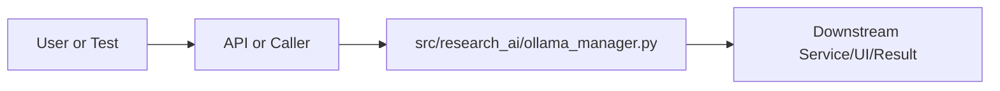

# ollama_manager.py Explained

Generated educational companion for `src/research_ai/ollama_manager.py`. This file is intentionally detailed so a developer can understand the code, architecture role, production tradeoffs, and ML/backend concepts behind the implementation.

## File Overview

`src/research_ai/ollama_manager.py` is a Python module in the Repository support layer. It defines ModelInfo, OllamaModelManager and _detect_tier.

## Why This File Exists

This file isolates one responsibility in the codebase: Repository support layer. Separation matters because AI systems are easier to test, scale, debug, and explain when retrieval, orchestration, ML services, memory, UI, and deployment scripts have clear boundaries.

## Workflow Position

**Layer:** Repository support layer.

**Previous step:** caller code, an API request, a browser event, a test fixture, an import, or a startup script prepares inputs.

**Current step:** `src/research_ai/ollama_manager.py` performs its local responsibility.

**Next step:** downstream services, API responses, rendered UI, tests, or process execution consume the result.



## Inputs and Outputs

- **Inputs:** function arguments, class constructor dependencies, HTTP payloads, environment variables, filesystem artifacts, DOM events, or test fixtures.
- **Outputs:** return values, dictionaries, Pydantic models, rendered DOM state, API responses, logs, process startup, assertions, or side effects.
- **Serialization:** this project uses JSON for APIs/LLM planning, parquet/joblib/faiss for ML artifacts, and HTML/CSS/JS for the browser surface.

## Imports Explained

| Import | Explanation |
|---|---|
| `__future__` | Project or standard-library dependency used to import a service, type, helper, or runtime capability. Imports affect startup time, packaging, and test isolation. |
| `dataclasses` | dataclasses reduce boilerplate for typed configuration/result containers. |
| `logging` | logging provides structured operational visibility without using print statements. |
| `os` | os reads environment variables and process/runtime configuration. |
| `requests` | Requests is the synchronous HTTP client used for outbound LLM, Ollama, arXiv, or provider calls with explicit timeouts. |

## Global Variables and Config

| Name | Line | Why it matters |
|---|---:|---|
| `logger` | 51 | Module-level value, constant, prompt, cache, registry, or configuration point. Check mutability and startup cost. |
| `_MODEL_TIER_MAP` | 60 | Module-level value, constant, prompt, cache, registry, or configuration point. Check mutability and startup cost. |
| `_TASK_MIN_TIER` | 101 | Module-level value, constant, prompt, cache, registry, or configuration point. Check mutability and startup cost. |

## Step-by-Step Workflow

1. Load dependencies and runtime constants.
2. Accept input from the previous layer.
3. Validate, transform, route, score, render, or execute according to this file's role.
4. Return a structured output or perform a controlled side effect.
5. Let caller layers handle presentation, persistence, retries, or fallback.

## Function-by-Function Breakdown

### `_detect_tier`

- **Line:** 115
- **Kind:** synchronous function
- **Arguments:** model_name
- **Docstring:** Detect tier from model name using exact-then-prefix matching.

```python
def _detect_tier(model_name: str) -> int:
    """Detect tier from model name using exact-then-prefix matching."""
    lower = model_name.lower()
    # Strip common suffixes that don't affect tier: -instruct, -chat, -q4, etc.
    cleaned = lower.split(":")[0]  # strip version tag like ":7b-instruct"

    if lower in _MODEL_TIER_MAP:
        return _MODEL_TIER_MAP[lower]

    # Try prefix match on the base name without tag
    for key, tier in _MODEL_TIER_MAP.items():
        base_key = key.split(":")[0]
        if cleaned.startswith(base_key):
            return tier

    # Try substring match as last resort
    for key, tier in _MODEL_TIER_MAP.items():
        if key.split(":")[0] in cleaned:
            return tier

    return 2  # Unknown models default to tier 2 (balanced)
```

This function's parameters define its input contract. Its return value or side effect defines how downstream code uses it. Review error handling, resource usage, and whether the function performs CPU work, I/O, model inference, or pure transformation.


## Class-by-Class Breakdown

### `ModelInfo`

- **Line:** 143
- **Base classes:** `object`
- **Docstring:** Metadata for a discovered Ollama model.

**Methods:**
- `tier_label` at line 150: method behavior is described by its body and name
- `to_dict` at line 153: method behavior is described by its body and name

```python
class ModelInfo:
    """Metadata for a discovered Ollama model."""
    name: str
    tier: int
    size_gb: float = 0.0

    @property
    def tier_label(self) -> str:
        return {1: "fast", 2: "balanced", 3: "powerful"}.get(self.tier, "unknown")

    def to_dict(self) -> dict:
        return {
            "name": self.name,
            "tier": self.tier,
            "tier_label": self.tier_label,
            "size_gb": self.size_gb,
        }
```

This class packages state and behavior behind a service-style interface. Constructor dependencies show what the class needs; public methods show what the rest of the system can ask it to do. In production, this boundary is where caching, model loading, artifact access, and error handling must be controlled.

### `OllamaModelManager`

- **Line:** 166
- **Base classes:** `object`
- **Docstring:** Discovers available Ollama models and routes queries to the best one.

Lifecycle:
    1. manager = OllamaModelManager()          # Safe — no network call
    2. manager.discover()                       # Queries Ollama /api/tags
    3. model = manager.select_model("search")  # Returns best model name
    4. Pass model name to CloudLLMClient        # Use it for generation

The manager is optional: if Ollama is not running, discover() returns False
and select_model() returns the configured default model from env vars.
Everything degrades gracefully.

**Methods:**
- `__init__` at line 180: method behavior is described by its body and name
- `discover` at line 193: Query Ollama for installed models. Returns True if Ollama is reachable.

Side-effects: populates self._models with discovered ModelInfo objects.
Safe to call multiple times — subsequent calls refresh the model list.
- `select_model` at line 241: Choose the best local model for a task type.

Selection algorithm:
  1. Get minimum tier required for the task
  2. Check if the configured default model meets the requirement
  3. If yes, return default (user preference respected)
  4. Otherwise, find the lowest-tier model that meets the requirement
     (prefer speed: smallest sufficient model wins)
  5. If nothing meets the requirement, return the highest-tier available
  6. Ultimate fallback: return the env-configured default model name

This ensures:
  - Simple tasks always use small/fast models (lower latency)
  - Complex tasks get the best available model (higher quality)
  - User's OLLAMA_MODEL preference is honored when sufficient
- `available` at line 293: True if Ollama is running and has at least one model installed.
- `model_count` at line 298: method behavior is described by its body and name
- `models_list` at line 301: Return all discovered models as serializable dicts for the API.
- `health_check` at line 308: Quick health probe — does not update the model list.

```python
class OllamaModelManager:
    """Discovers available Ollama models and routes queries to the best one.

    Lifecycle:
        1. manager = OllamaModelManager()          # Safe — no network call
        2. manager.discover()                       # Queries Ollama /api/tags
        3. model = manager.select_model("search")  # Returns best model name
        4. Pass model name to CloudLLMClient        # Use it for generation

    The manager is optional: if Ollama is not running, discover() returns False
    and select_model() returns the configured default model from env vars.
    Everything degrades gracefully.
    """

    def __init__(self, base_url: str | None = None) -> None:
        # Strip /v1 suffix if present — Ollama management API lives at root
        raw = base_url or os.getenv("OLLAMA_BASE_URL", "http://localhost:11434")
        self.base_url = raw.rstrip("/").removesuffix("/v1")

        self._models: dict[str, ModelInfo] = {}
        self._default_model: str = os.getenv("OLLAMA_MODEL", "qwen2.5:3b")
        self._available: bool = False

    # ------------------------------------------------------------------
    # Discovery
    # ------------------------------------------------------------------

    def discover(self) -> bool:
        """Query Ollama for installed models. Returns True if Ollama is reachable.

        Side-effects: populates self._models with discovered ModelInfo objects.
        Safe to call multiple times — subsequent calls refresh the model list.
        """
        try:
            resp = requests.get(f"{self.base_url}/api/tags", timeout=5)
            resp.raise_for_status()
            data = resp.json()

            self._models.clear()
            for m in data.get("models", []):
                name: str = m.get("name", "").strip()
                if not name:
                    continue
                size_bytes: int = m.get("size", 0)
                size_gb = round(size_bytes / (1024 ** 3), 1) if size_bytes else 0.0
                self._models[name] = ModelInfo(
                    name=name,
                    tier=_detect_tier(name),
                    size_gb=size_gb,
                )

            self._available = bool(self._models)
            if self._available:
                logger.info(
                    "OllamaModelManager: %d model(s) discovered — %s",
                    len(self._models),
                    [m for m in self._models],
                )
            else:
                logger.info("OllamaModelManager: Ollama reachable but no models installed.")
            return self._available

        except requests.Timeout:
            logger.info("OllamaModelManager: Ollama connection timed out — local routing disabled.")
            self._available = False
            return False
        except Exception as exc:
            logger.info("OllamaModelManager: Ollama not reachable (%s).", type(exc).__name__)
            self._available = False
            return False

    # ------------------------------------------------------------------
    # Model selection (the intelligence)
    # ------------------------------------------------------------------

    def select_model(self, task_type: str = "research_analysis") -> str:
        """Choose the best local model for a task type.

        Selection algorithm:
          1. Get minimum tier required for the task
          2. Check if the configured default model meets the requirement
          3. If yes, return default (user preference respected)
          4. Otherwise, find the lowest-tier model that meets the requirement
             (prefer speed: smallest sufficient model wins)
          5. If nothing meets the requirement, return the highest-tier available
          6. Ultimate fallback: return the env-configured default model name

        This ensures:
          - Simple tasks always use small/fast models (lower latency)
          - Complex tasks get the best available model (higher quality)
          - User's OLLAMA_MODEL preference is honored when sufficient
        """
        if not self._models:
            return self._default_model

        min_tier = _TASK_MIN_TIER.get(task_type, 2)

        # Step 1: Check if the user's default model meets the requirement
        if self._default_model in self._models:
            if self._models[self._default_model].tier >= min_tier:
                return self._default_model
```

This class packages state and behavior behind a service-style interface. Constructor dependencies show what the class needs; public methods show what the rest of the system can ask it to do. In production, this boundary is where caching, model loading, artifact access, and error handling must be controlled.


## Method-by-Method Deep Dive

### Class `ModelInfo` Methods

#### `ModelInfo.tier_label`

- **Line:** 150
- **Kind:** synchronous method
- **Arguments:** self
- **Docstring:** No explicit docstring; behavior is inferred from the implementation and call sites.

```python
    def tier_label(self) -> str:
        return {1: "fast", 2: "balanced", 3: "powerful"}.get(self.tier, "unknown")
```

This method is part of the class contract. Its inputs show what state or caller data it consumes; its body shows whether it performs pure transformation, model/artifact access, retrieval, I/O, caching, validation, or orchestration. In production review, pay attention to error handling, mutation of `self`, repeated expensive work, and whether return shapes stay stable for downstream callers.

#### `ModelInfo.to_dict`

- **Line:** 153
- **Kind:** synchronous method
- **Arguments:** self
- **Docstring:** No explicit docstring; behavior is inferred from the implementation and call sites.

```python
    def to_dict(self) -> dict:
        return {
            "name": self.name,
            "tier": self.tier,
            "tier_label": self.tier_label,
            "size_gb": self.size_gb,
        }
```

This method is part of the class contract. Its inputs show what state or caller data it consumes; its body shows whether it performs pure transformation, model/artifact access, retrieval, I/O, caching, validation, or orchestration. In production review, pay attention to error handling, mutation of `self`, repeated expensive work, and whether return shapes stay stable for downstream callers.

### Class `OllamaModelManager` Methods

#### `OllamaModelManager.__init__`

- **Line:** 180
- **Kind:** synchronous method
- **Arguments:** self, base_url
- **Docstring:** No explicit docstring; behavior is inferred from the implementation and call sites.

```python
    def __init__(self, base_url: str | None = None) -> None:
        # Strip /v1 suffix if present — Ollama management API lives at root
        raw = base_url or os.getenv("OLLAMA_BASE_URL", "http://localhost:11434")
        self.base_url = raw.rstrip("/").removesuffix("/v1")

        self._models: dict[str, ModelInfo] = {}
        self._default_model: str = os.getenv("OLLAMA_MODEL", "qwen2.5:3b")
        self._available: bool = False
```

This method is part of the class contract. Its inputs show what state or caller data it consumes; its body shows whether it performs pure transformation, model/artifact access, retrieval, I/O, caching, validation, or orchestration. In production review, pay attention to error handling, mutation of `self`, repeated expensive work, and whether return shapes stay stable for downstream callers.

#### `OllamaModelManager.discover`

- **Line:** 193
- **Kind:** synchronous method
- **Arguments:** self
- **Docstring:** Query Ollama for installed models. Returns True if Ollama is reachable.

Side-effects: populates self._models with discovered ModelInfo objects.
Safe to call multiple times — subsequent calls refresh the model list.

```python
    def discover(self) -> bool:
        """Query Ollama for installed models. Returns True if Ollama is reachable.

        Side-effects: populates self._models with discovered ModelInfo objects.
        Safe to call multiple times — subsequent calls refresh the model list.
        """
        try:
            resp = requests.get(f"{self.base_url}/api/tags", timeout=5)
            resp.raise_for_status()
            data = resp.json()

            self._models.clear()
            for m in data.get("models", []):
                name: str = m.get("name", "").strip()
                if not name:
                    continue
                size_bytes: int = m.get("size", 0)
                size_gb = round(size_bytes / (1024 ** 3), 1) if size_bytes else 0.0
                self._models[name] = ModelInfo(
                    name=name,
                    tier=_detect_tier(name),
                    size_gb=size_gb,
                )

            self._available = bool(self._models)
            if self._available:
                logger.info(
                    "OllamaModelManager: %d model(s) discovered — %s",
                    len(self._models),
                    [m for m in self._models],
                )
            else:
                logger.info("OllamaModelManager: Ollama reachable but no models installed.")
            return self._available

        except requests.Timeout:
            logger.info("OllamaModelManager: Ollama connection timed out — local routing disabled.")
            self._available = False
            return False
        except Exception as exc:
            logger.info("OllamaModelManager: Ollama not reachable (%s).", type(exc).__name__)
            self._available = False
            return False
```

This method is part of the class contract. Its inputs show what state or caller data it consumes; its body shows whether it performs pure transformation, model/artifact access, retrieval, I/O, caching, validation, or orchestration. In production review, pay attention to error handling, mutation of `self`, repeated expensive work, and whether return shapes stay stable for downstream callers.

#### `OllamaModelManager.select_model`

- **Line:** 241
- **Kind:** synchronous method
- **Arguments:** self, task_type
- **Docstring:** Choose the best local model for a task type.

Selection algorithm:
  1. Get minimum tier required for the task
  2. Check if the configured default model meets the requirement
  3. If yes, return default (user preference respected)
  4. Otherwise, find the lowest-tier model that meets the requirement
     (prefer speed: smallest sufficient model wins)
  5. If nothing meets the requirement, return the highest-tier available
  6. Ultimate fallback: return the env-configured default model name

This ensures:
  - Simple tasks always use small/fast models (lower latency)
  - Complex tasks get the best available model (higher quality)
  - User's OLLAMA_MODEL preference is honored when sufficient

```python
    def select_model(self, task_type: str = "research_analysis") -> str:
        """Choose the best local model for a task type.

        Selection algorithm:
          1. Get minimum tier required for the task
          2. Check if the configured default model meets the requirement
          3. If yes, return default (user preference respected)
          4. Otherwise, find the lowest-tier model that meets the requirement
             (prefer speed: smallest sufficient model wins)
          5. If nothing meets the requirement, return the highest-tier available
          6. Ultimate fallback: return the env-configured default model name

        This ensures:
          - Simple tasks always use small/fast models (lower latency)
          - Complex tasks get the best available model (higher quality)
          - User's OLLAMA_MODEL preference is honored when sufficient
        """
        if not self._models:
            return self._default_model

        min_tier = _TASK_MIN_TIER.get(task_type, 2)

        # Step 1: Check if the user's default model meets the requirement
        if self._default_model in self._models:
            if self._models[self._default_model].tier >= min_tier:
                return self._default_model

        # Step 2: Find candidates at or above required tier
        candidates = [m for m in self._models.values() if m.tier >= min_tier]
        if candidates:
            # Among qualifying models, pick the smallest/fastest (lowest tier first,
            # then alphabetical as tiebreaker for determinism)
            best = min(candidates, key=lambda m: (m.tier, m.name))
            return best.name

        # Step 3: Nothing meets requirement — fall back to best available
        if self._models:
            best_available = max(self._models.values(), key=lambda m: (m.tier, m.name))
            logger.warning(
                "OllamaModelManager: No model meets tier %d for task '%s'. "
                "Using best available: %s (tier %d).",
                min_tier, task_type, best_available.name, best_available.tier,
            )
            return best_available.name

        return self._default_model
```

This method is part of the class contract. Its inputs show what state or caller data it consumes; its body shows whether it performs pure transformation, model/artifact access, retrieval, I/O, caching, validation, or orchestration. In production review, pay attention to error handling, mutation of `self`, repeated expensive work, and whether return shapes stay stable for downstream callers.

#### `OllamaModelManager.available`

- **Line:** 293
- **Kind:** synchronous method
- **Arguments:** self
- **Docstring:** True if Ollama is running and has at least one model installed.

```python
    def available(self) -> bool:
        """True if Ollama is running and has at least one model installed."""
        return self._available
```

This method is part of the class contract. Its inputs show what state or caller data it consumes; its body shows whether it performs pure transformation, model/artifact access, retrieval, I/O, caching, validation, or orchestration. In production review, pay attention to error handling, mutation of `self`, repeated expensive work, and whether return shapes stay stable for downstream callers.

#### `OllamaModelManager.model_count`

- **Line:** 298
- **Kind:** synchronous method
- **Arguments:** self
- **Docstring:** No explicit docstring; behavior is inferred from the implementation and call sites.

```python
    def model_count(self) -> int:
        return len(self._models)
```

This method is part of the class contract. Its inputs show what state or caller data it consumes; its body shows whether it performs pure transformation, model/artifact access, retrieval, I/O, caching, validation, or orchestration. In production review, pay attention to error handling, mutation of `self`, repeated expensive work, and whether return shapes stay stable for downstream callers.

#### `OllamaModelManager.models_list`

- **Line:** 301
- **Kind:** synchronous method
- **Arguments:** self
- **Docstring:** Return all discovered models as serializable dicts for the API.

```python
    def models_list(self) -> list[dict]:
        """Return all discovered models as serializable dicts for the API."""
        return [
            m.to_dict()
            for m in sorted(self._models.values(), key=lambda m: (m.tier, m.name))
        ]
```

This method is part of the class contract. Its inputs show what state or caller data it consumes; its body shows whether it performs pure transformation, model/artifact access, retrieval, I/O, caching, validation, or orchestration. In production review, pay attention to error handling, mutation of `self`, repeated expensive work, and whether return shapes stay stable for downstream callers.

#### `OllamaModelManager.health_check`

- **Line:** 308
- **Kind:** synchronous method
- **Arguments:** self
- **Docstring:** Quick health probe — does not update the model list.

```python
    def health_check(self) -> dict:
        """Quick health probe — does not update the model list."""
        try:
            resp = requests.get(f"{self.base_url}/api/tags", timeout=3)
            online = resp.ok
        except Exception:
            online = False
        return {
            "online": online,
            "model_count": len(self._models),
            "models": [m.name for m in self._models.values()],
        }
```

This method is part of the class contract. Its inputs show what state or caller data it consumes; its body shows whether it performs pure transformation, model/artifact access, retrieval, I/O, caching, validation, or orchestration. In production review, pay attention to error handling, mutation of `self`, repeated expensive work, and whether return shapes stay stable for downstream callers.

## Important Algorithms Used

- **RAG**: Retrieval-Augmented Generation retrieves evidence first and asks an LLM to answer from that evidence, reducing hallucination.
- **LLM Inference**: LLM inference sends prompts or chat messages to a model provider and receives generated text under token, latency, and cost constraints.
- **Transformers**: Transformers use tokenization and attention layers for language understanding/generation. They are powerful but memory and latency sensitive.
- **Classification**: Classification maps text or features to discrete labels, supporting category prediction and routing.
- **Streaming**: Streaming improves perceived latency by sending incremental output instead of waiting for full completion.
- **Sandboxing**: Sandboxing validates and constrains user code before execution, reducing security and stability risk.

## Libraries Used

| Import | Explanation |
|---|---|
| `__future__` | Project or standard-library dependency used to import a service, type, helper, or runtime capability. Imports affect startup time, packaging, and test isolation. |
| `dataclasses` | dataclasses reduce boilerplate for typed configuration/result containers. |
| `logging` | logging provides structured operational visibility without using print statements. |
| `os` | os reads environment variables and process/runtime configuration. |
| `requests` | Requests is the synchronous HTTP client used for outbound LLM, Ollama, arXiv, or provider calls with explicit timeouts. |

## ML Concepts Used

- **RAG**: Retrieval-Augmented Generation retrieves evidence first and asks an LLM to answer from that evidence, reducing hallucination.
- **LLM Inference**: LLM inference sends prompts or chat messages to a model provider and receives generated text under token, latency, and cost constraints.
- **Transformers**: Transformers use tokenization and attention layers for language understanding/generation. They are powerful but memory and latency sensitive.
- **Classification**: Classification maps text or features to discrete labels, supporting category prediction and routing.
- **Streaming**: Streaming improves perceived latency by sending incremental output instead of waiting for full completion.
- **Sandboxing**: Sandboxing validates and constrains user code before execution, reducing security and stability risk.

## Performance and Memory Notes

- Avoid eager loading of heavy ML models unless startup latency is acceptable.
- Cache expensive clients, tokenizers, vector stores, and embeddings carefully.
- Use float32 for embedding vectors because it halves memory compared with float64 and matches FAISS/neural inference expectations.
- Bound prompt length, uploaded content, result counts, and token budgets to control latency and memory.
- Watch copies of large metadata frames, embedding matrices, and file buffers.

## Scalability Notes

- In-memory state works for local demos but needs Redis/database/object storage for multi-worker cloud deployment.
- CPU/GPU inference should often be separated from the web API when traffic grows.
- Retrieval can start exact and move to approximate indexes as corpus size grows.
- Batch operations and cache repeated work to improve throughput.
- Add metrics for latency, errors, fallback frequency, retrieval hit rate, and token usage.

## Production Engineering Notes

- Keep interfaces stable because other files may import this module or depend on its response shape.
- Prefer typed/structured data over free-form strings at service boundaries.
- Log operational context without secrets or huge payloads.
- Make fallback behavior explicit so users get useful output even when LLMs or artifacts fail.
- Keep provider-specific logic behind adapters so Groq/OpenRouter/Google/Ollama can be swapped.

## Common Bugs and Failure Cases

- Missing `.env` values, model artifacts, or Ollama models can trigger degraded behavior.
- Type mismatches occur when LLM-generated tool arguments cross into strict Python code.
- Empty retrieval results must not become hallucinated answers.
- Network calls need timeouts and careful retry behavior.
- Frontend IDs/classes and API schemas are contracts; changing one side without the other breaks workflows.

## Security Considerations

- Handles credentials or environment configuration. Keep secrets in environment variables and redact them from logs.
- Touches files or paths. Validate filenames, restrict upload size/type, and prevent traversal.
- Performs network I/O. Use timeouts, validate responses, and keep private services such as Ollama off the public internet.

## Real Industry Usage

- This pattern appears in enterprise RAG assistants, scientific search tools, internal research copilots, and ML platform demos.
- The layered design mirrors production systems: API facade, orchestration, retrieval, evaluation, synthesis, UI, and deployment.
- Clear separation lets teams replace model providers, improve retrieval, harden security, or redesign UI independently.

## Optimization Opportunities

- Add tracing around each workflow step.
- Strengthen schema validation at boundaries.
- Persist conversation/session state outside process memory.
- Add load tests and adversarial tests for prompt injection, empty evidence, and large uploads.
- Consider approximate vector indexes, reranker models, or batching when corpus/traffic grows.

## How This Connects To Other Files

- `src/research_ai/ollama_manager.py` is connected through imports, startup scripts, API routes, frontend selectors, tests, or artifact paths.
- `src/research_ai/platform.py` is the backend composition root.
- `src/research_ai/api/main.py` exposes backend behavior over HTTP.
- Retrieval modules depend on artifacts under `artifacts/`.
- Frontend files depend on stable endpoint and DOM contracts.

## End-to-End Flow Summary

- A user/browser/test/startup event enters the system.
- The relevant layer validates or normalizes input.
- Retrieval, ML, orchestration, execution, or UI rendering happens.
- A structured result, visual state, or process side effect is produced.
- Fallbacks and tests keep behavior understandable when dependencies are unavailable.

## Interview Questions

1. What responsibility does this file own?
2. What inputs and outputs define its contract?
3. Which dependencies are expensive or operationally risky?
4. What breaks if this file changes shape?
5. How would you scale or test this behavior in production?

## Key Takeaways

- `src/research_ai/ollama_manager.py` should be understood as part of a layered AI research platform.
- Trace data flow from inputs to transformations to outputs.
- Production readiness comes from explicit contracts, bounded resources, observability, secure defaults, and graceful fallback.

## Fully Commented Source

This section repeats the original source with an explanatory comment before every line. The comments are educational only; they are not inserted into the production source file.

```python
# L0001: Starts, ends, or continues a docstring that documents module, class, or function intent.
"""OllamaModelManager — discovers, profiles, and routes queries to local Ollama models.
# L0002: Blank line that visually separates logical sections and improves readability.

# L0003: Executes Python logic as part of this file's workflow; read surrounding lines for data flow and side effects.
ARCHITECTURE
# L0004: Executes Python logic as part of this file's workflow; read surrounding lines for data flow and side effects.
------------
# L0005: Executes Python logic as part of this file's workflow; read surrounding lines for data flow and side effects.
This module solves a core UX problem: instead of always using the same local
# L0006: Executes Python logic as part of this file's workflow; read surrounding lines for data flow and side effects.
model for every task, the platform intelligently routes queries to the most
# L0007: Executes Python logic as part of this file's workflow; read surrounding lines for data flow and side effects.
appropriate model based on task complexity. This mirrors how production systems
# L0008: Executes Python logic as part of this file's workflow; read surrounding lines for data flow and side effects.
like ChatGPT internally use GPT-4o-mini for simple tasks and GPT-4o for complex
# L0009: Executes Python logic as part of this file's workflow; read surrounding lines for data flow and side effects.
reasoning — the user never needs to know which model is running.
# L0010: Blank line that visually separates logical sections and improves readability.

# L0011: Executes Python logic as part of this file's workflow; read surrounding lines for data flow and side effects.
ROUTING STRATEGY
# L0012: Executes Python logic as part of this file's workflow; read surrounding lines for data flow and side effects.
----------------
# L0013: Executes Python logic as part of this file's workflow; read surrounding lines for data flow and side effects.
Models are grouped into 3 speed tiers:
# L0014: Blank line that visually separates logical sections and improves readability.

# L0015: Executes Python logic as part of this file's workflow; read surrounding lines for data flow and side effects.
  Tier 1 (<4B params) — fastest, <5s response
# L0016: Executes Python logic as part of this file's workflow; read surrounding lines for data flow and side effects.
    Best for: greetings, classification, simple search planning
# L0017: Executes Python logic as part of this file's workflow; read surrounding lines for data flow and side effects.
    Examples: qwen2.5:3b, phi3:mini, llama3.2:3b
# L0018: Blank line that visually separates logical sections and improves readability.

# L0019: Executes Python logic as part of this file's workflow; read surrounding lines for data flow and side effects.
  Tier 2 (4–10B params) — balanced, 5–30s response
# L0020: Executes Python logic as part of this file's workflow; read surrounding lines for data flow and side effects.
    Best for: research analysis, RAG synthesis, paper Q&A
# L0021: Executes Python logic as part of this file's workflow; read surrounding lines for data flow and side effects.
    Examples: qwen2.5:7b, mistral:7b, llama3.1:8b
# L0022: Blank line that visually separates logical sections and improves readability.

# L0023: Executes Python logic as part of this file's workflow; read surrounding lines for data flow and side effects.
  Tier 3 (>10B params) — most capable, 30–120s response
# L0024: Executes Python logic as part of this file's workflow; read surrounding lines for data flow and side effects.
    Best for: deep reasoning, multi-step analysis, complex synthesis
# L0025: Executes Python logic as part of this file's workflow; read surrounding lines for data flow and side effects.
    Examples: qwen2.5:14b, deepseek-r1:14b, llama3:70b
# L0026: Blank line that visually separates logical sections and improves readability.

# L0027: Executes Python logic as part of this file's workflow; read surrounding lines for data flow and side effects.
Each task type maps to a minimum tier. The manager finds the cheapest (fastest)
# L0028: Executes Python logic as part of this file's workflow; read surrounding lines for data flow and side effects.
model that meets that minimum requirement — maximizing speed while ensuring quality.
# L0029: Blank line that visually separates logical sections and improves readability.

# L0030: Executes Python logic as part of this file's workflow; read surrounding lines for data flow and side effects.
FALLBACK CHAIN
# L0031: Executes Python logic as part of this file's workflow; read surrounding lines for data flow and side effects.
--------------
# L0032: Executes Python logic as part of this file's workflow; read surrounding lines for data flow and side effects.
If no model at the required tier is available, the manager falls back to the
# L0033: Executes Python logic as part of this file's workflow; read surrounding lines for data flow and side effects.
best (highest-tier) model it has. This ensures the system always responds,
# L0034: Executes Python logic as part of this file's workflow; read surrounding lines for data flow and side effects.
even with only a small model installed.
# L0035: Blank line that visually separates logical sections and improves readability.

# L0036: Executes Python logic as part of this file's workflow; read surrounding lines for data flow and side effects.
USAGE
# L0037: Executes Python logic as part of this file's workflow; read surrounding lines for data flow and side effects.
-----
# L0038: Executes Python logic as part of this file's workflow; read surrounding lines for data flow and side effects.
The manager is initialized in platform.py and passed wherever model selection
# L0039: Executes Python logic as part of this file's workflow; read surrounding lines for data flow and side effects.
is needed. Call discover() once at startup, then select_model(task_type) at
# L0040: Executes Python logic as part of this file's workflow; read surrounding lines for data flow and side effects.
request time. The result is a model name string that CloudLLMClient accepts
# L0041: Assigns or updates a value used later in the workflow; check mutability and data shape.
when provider="ollama".
# L0042: Starts, ends, or continues a docstring that documents module, class, or function intent.
"""
# L0043: Enables future Python behavior so annotations/import semantics stay modern and predictable.
from __future__ import annotations
# L0044: Blank line that visually separates logical sections and improves readability.

# L0045: Imports a dependency, type, or project module needed by later code in this file.
import logging
# L0046: Imports a dependency, type, or project module needed by later code in this file.
import os
# L0047: Imports a dependency, type, or project module needed by later code in this file.
from dataclasses import dataclass, field
# L0048: Blank line that visually separates logical sections and improves readability.

# L0049: Imports a dependency, type, or project module needed by later code in this file.
import requests
# L0050: Blank line that visually separates logical sections and improves readability.

# L0051: Assigns or updates a value used later in the workflow; check mutability and data shape.
logger = logging.getLogger(__name__)
# L0052: Blank line that visually separates logical sections and improves readability.

# L0053: Blank line that visually separates logical sections and improves readability.

# L0054: Developer comment explaining intent, caveat, section boundary, or operational reasoning.
# ---------------------------------------------------------------------------
# L0055: Developer comment explaining intent, caveat, section boundary, or operational reasoning.
# Speed-tier catalog
# L0056: Developer comment explaining intent, caveat, section boundary, or operational reasoning.
# Keys are lowercase model names (with or without tag). Values are tier 1–3.
# L0057: Developer comment explaining intent, caveat, section boundary, or operational reasoning.
# The lookup supports prefix matching so "qwen2.5:7b-instruct" → "qwen2.5:7b".
# L0058: Developer comment explaining intent, caveat, section boundary, or operational reasoning.
# ---------------------------------------------------------------------------
# L0059: Blank line that visually separates logical sections and improves readability.

# L0060: Assigns or updates a value used later in the workflow; check mutability and data shape.
_MODEL_TIER_MAP: dict[str, int] = {
# L0061: Developer comment explaining intent, caveat, section boundary, or operational reasoning.
    # ── Tier 1: fastest (<4B) ──────────────────────────────────────────────
# L0062: Executes Python logic as part of this file's workflow; read surrounding lines for data flow and side effects.
    "phi3:mini":         1, "phi3.5:mini":        1, "phi":               1,
# L0063: Executes Python logic as part of this file's workflow; read surrounding lines for data flow and side effects.
    "phi4-mini":         1,
# L0064: Executes Python logic as part of this file's workflow; read surrounding lines for data flow and side effects.
    "gemma:2b":          1, "gemma2:2b":           1,
# L0065: Executes Python logic as part of this file's workflow; read surrounding lines for data flow and side effects.
    "qwen2.5:0.5b":      1, "qwen2.5:1.5b":        1, "qwen2.5:3b":        1,
# L0066: Executes Python logic as part of this file's workflow; read surrounding lines for data flow and side effects.
    "qwen2:1.5b":        1, "qwen2:0.5b":          1,
# L0067: Executes Python logic as part of this file's workflow; read surrounding lines for data flow and side effects.
    "tinyllama":         1,
# L0068: Executes Python logic as part of this file's workflow; read surrounding lines for data flow and side effects.
    "llama3.2:1b":       1, "llama3.2:3b":         1,
# L0069: Executes Python logic as part of this file's workflow; read surrounding lines for data flow and side effects.
    "deepseek-r1:1.5b":  1,
# L0070: Executes Python logic as part of this file's workflow; read surrounding lines for data flow and side effects.
    "smollm":            1, "smollm2":             1,
# L0071: Developer comment explaining intent, caveat, section boundary, or operational reasoning.
    # ── Tier 2: balanced (4–10B) ───────────────────────────────────────────
# L0072: Executes Python logic as part of this file's workflow; read surrounding lines for data flow and side effects.
    "qwen2.5:7b":        2, "qwen2:7b":            2,
# L0073: Executes Python logic as part of this file's workflow; read surrounding lines for data flow and side effects.
    "mistral:7b":        2, "mistral":             2,
# L0074: Executes Python logic as part of this file's workflow; read surrounding lines for data flow and side effects.
    "mistral-nemo":      2,
# L0075: Executes Python logic as part of this file's workflow; read surrounding lines for data flow and side effects.
    "llama3:8b":         2, "llama3.1:8b":         2, "llama3.2:8b":       2,
# L0076: Executes Python logic as part of this file's workflow; read surrounding lines for data flow and side effects.
    "llama3.3":          2,
# L0077: Executes Python logic as part of this file's workflow; read surrounding lines for data flow and side effects.
    "gemma:7b":          2, "gemma2:9b":           2,
# L0078: Executes Python logic as part of this file's workflow; read surrounding lines for data flow and side effects.
    "deepseek-r1:7b":    2, "deepseek-r1:8b":      2,
# L0079: Executes Python logic as part of this file's workflow; read surrounding lines for data flow and side effects.
    "deepseek-coder":    2,
# L0080: Executes Python logic as part of this file's workflow; read surrounding lines for data flow and side effects.
    "codellama":         2,
# L0081: Executes Python logic as part of this file's workflow; read surrounding lines for data flow and side effects.
    "phi4":              2,
# L0082: Executes Python logic as part of this file's workflow; read surrounding lines for data flow and side effects.
    "neural-chat":       2,
# L0083: Developer comment explaining intent, caveat, section boundary, or operational reasoning.
    # ── Tier 3: most capable (>10B) ───────────────────────────────────────
# L0084: Executes Python logic as part of this file's workflow; read surrounding lines for data flow and side effects.
    "llama3:70b":        3, "llama3.1:70b":        3, "llama3.3:70b":      3,
# L0085: Executes Python logic as part of this file's workflow; read surrounding lines for data flow and side effects.
    "qwen2.5:14b":       3, "qwen2.5:32b":         3, "qwen2.5:72b":       3,
# L0086: Executes Python logic as part of this file's workflow; read surrounding lines for data flow and side effects.
    "qwen2:72b":         3,
# L0087: Executes Python logic as part of this file's workflow; read surrounding lines for data flow and side effects.
    "deepseek-r1:14b":   3, "deepseek-r1:32b":     3, "deepseek-r1:70b":   3,
# L0088: Executes Python logic as part of this file's workflow; read surrounding lines for data flow and side effects.
    "mistral-large":     3,
# L0089: Executes Python logic as part of this file's workflow; read surrounding lines for data flow and side effects.
    "mixtral":           3, "mixtral:8x7b":        3, "mixtral:8x22b":     3,
# L0090: Executes Python logic as part of this file's workflow; read surrounding lines for data flow and side effects.
    "gemma2:27b":        3,
# L0091: Executes Python logic as part of this file's workflow; read surrounding lines for data flow and side effects.
    "command-r":         3, "command-r-plus":      3,
# L0092: Executes Python logic as part of this file's workflow; read surrounding lines for data flow and side effects.
}
# L0093: Blank line that visually separates logical sections and improves readability.

# L0094: Blank line that visually separates logical sections and improves readability.

# L0095: Developer comment explaining intent, caveat, section boundary, or operational reasoning.
# ---------------------------------------------------------------------------
# L0096: Developer comment explaining intent, caveat, section boundary, or operational reasoning.
# Task-type → minimum tier required
# L0097: Developer comment explaining intent, caveat, section boundary, or operational reasoning.
# Lower tier = simpler task (speed over quality).
# L0098: Developer comment explaining intent, caveat, section boundary, or operational reasoning.
# Higher tier = complex reasoning needed.
# L0099: Developer comment explaining intent, caveat, section boundary, or operational reasoning.
# ---------------------------------------------------------------------------
# L0100: Blank line that visually separates logical sections and improves readability.

# L0101: Assigns or updates a value used later in the workflow; check mutability and data shape.
_TASK_MIN_TIER: dict[str, int] = {
# L0102: Executes Python logic as part of this file's workflow; read surrounding lines for data flow and side effects.
    "conversation":       1,  # Small talk / greetings — any model fine
# L0103: Executes Python logic as part of this file's workflow; read surrounding lines for data flow and side effects.
    "classification":     1,  # Single-label category prediction — small model fine
# L0104: Executes Python logic as part of this file's workflow; read surrounding lines for data flow and side effects.
    "summarization":      1,  # Abstractive summarization — small model handles it
# L0105: Executes Python logic as part of this file's workflow; read surrounding lines for data flow and side effects.
    "search":             1,  # Search query planning — small model fine
# L0106: Executes Python logic as part of this file's workflow; read surrounding lines for data flow and side effects.
    "trend_analysis":     2,  # Multi-paper trend synthesis — needs decent model
# L0107: Executes Python logic as part of this file's workflow; read surrounding lines for data flow and side effects.
    "research_analysis":  2,  # Full research analysis — needs decent model
# L0108: Executes Python logic as part of this file's workflow; read surrounding lines for data flow and side effects.
    "citation_analysis":  2,  # Citation graph reasoning — needs decent model
# L0109: Executes Python logic as part of this file's workflow; read surrounding lines for data flow and side effects.
    "paper_chat":         2,  # Paper Q&A against chunks — needs decent model
# L0110: Executes Python logic as part of this file's workflow; read surrounding lines for data flow and side effects.
    "reasoning":          3,  # Multi-step logical reasoning — needs best model
# L0111: Executes Python logic as part of this file's workflow; read surrounding lines for data flow and side effects.
    "deep_analysis":      3,  # Complex multi-source synthesis — needs best model
# L0112: Executes Python logic as part of this file's workflow; read surrounding lines for data flow and side effects.
}
# L0113: Blank line that visually separates logical sections and improves readability.

# L0114: Blank line that visually separates logical sections and improves readability.

# L0115: Defines a function or method; parameters are the input contract and the body implements the workflow.
def _detect_tier(model_name: str) -> int:
# L0116: Starts, ends, or continues a docstring that documents module, class, or function intent.
    """Detect tier from model name using exact-then-prefix matching."""
# L0117: Assigns or updates a value used later in the workflow; check mutability and data shape.
    lower = model_name.lower()
# L0118: Developer comment explaining intent, caveat, section boundary, or operational reasoning.
    # Strip common suffixes that don't affect tier: -instruct, -chat, -q4, etc.
# L0119: Assigns or updates a value used later in the workflow; check mutability and data shape.
    cleaned = lower.split(":")[0]  # strip version tag like ":7b-instruct"
# L0120: Blank line that visually separates logical sections and improves readability.

# L0121: Branches execution based on a condition, usually for validation, fallback, or mode-specific behavior.
    if lower in _MODEL_TIER_MAP:
# L0122: Returns the computed result to the caller; this shape becomes part of the downstream contract.
        return _MODEL_TIER_MAP[lower]
# L0123: Blank line that visually separates logical sections and improves readability.

# L0124: Developer comment explaining intent, caveat, section boundary, or operational reasoning.
    # Try prefix match on the base name without tag
# L0125: Iterates over data, retry attempts, files, results, or workflow steps.
    for key, tier in _MODEL_TIER_MAP.items():
# L0126: Assigns or updates a value used later in the workflow; check mutability and data shape.
        base_key = key.split(":")[0]
# L0127: Branches execution based on a condition, usually for validation, fallback, or mode-specific behavior.
        if cleaned.startswith(base_key):
# L0128: Returns the computed result to the caller; this shape becomes part of the downstream contract.
            return tier
# L0129: Blank line that visually separates logical sections and improves readability.

# L0130: Developer comment explaining intent, caveat, section boundary, or operational reasoning.
    # Try substring match as last resort
# L0131: Iterates over data, retry attempts, files, results, or workflow steps.
    for key, tier in _MODEL_TIER_MAP.items():
# L0132: Branches execution based on a condition, usually for validation, fallback, or mode-specific behavior.
        if key.split(":")[0] in cleaned:
# L0133: Returns the computed result to the caller; this shape becomes part of the downstream contract.
            return tier
# L0134: Blank line that visually separates logical sections and improves readability.

# L0135: Returns the computed result to the caller; this shape becomes part of the downstream contract.
    return 2  # Unknown models default to tier 2 (balanced)
# L0136: Blank line that visually separates logical sections and improves readability.

# L0137: Blank line that visually separates logical sections and improves readability.

# L0138: Developer comment explaining intent, caveat, section boundary, or operational reasoning.
# ---------------------------------------------------------------------------
# L0139: Developer comment explaining intent, caveat, section boundary, or operational reasoning.
# Data classes
# L0140: Developer comment explaining intent, caveat, section boundary, or operational reasoning.
# ---------------------------------------------------------------------------
# L0141: Blank line that visually separates logical sections and improves readability.

# L0142: Decorator that modifies the function/class below, commonly for routing, dataclasses, caching, or properties.
@dataclass
# L0143: Defines a class that groups related state and behavior behind a reusable interface.
class ModelInfo:
# L0144: Starts, ends, or continues a docstring that documents module, class, or function intent.
    """Metadata for a discovered Ollama model."""
# L0145: Executes Python logic as part of this file's workflow; read surrounding lines for data flow and side effects.
    name: str
# L0146: Executes Python logic as part of this file's workflow; read surrounding lines for data flow and side effects.
    tier: int
# L0147: Assigns or updates a value used later in the workflow; check mutability and data shape.
    size_gb: float = 0.0
# L0148: Blank line that visually separates logical sections and improves readability.

# L0149: Decorator that modifies the function/class below, commonly for routing, dataclasses, caching, or properties.
    @property
# L0150: Defines a function or method; parameters are the input contract and the body implements the workflow.
    def tier_label(self) -> str:
# L0151: Returns the computed result to the caller; this shape becomes part of the downstream contract.
        return {1: "fast", 2: "balanced", 3: "powerful"}.get(self.tier, "unknown")
# L0152: Blank line that visually separates logical sections and improves readability.

# L0153: Defines a function or method; parameters are the input contract and the body implements the workflow.
    def to_dict(self) -> dict:
# L0154: Returns the computed result to the caller; this shape becomes part of the downstream contract.
        return {
# L0155: Executes Python logic as part of this file's workflow; read surrounding lines for data flow and side effects.
            "name": self.name,
# L0156: Executes Python logic as part of this file's workflow; read surrounding lines for data flow and side effects.
            "tier": self.tier,
# L0157: Executes Python logic as part of this file's workflow; read surrounding lines for data flow and side effects.
            "tier_label": self.tier_label,
# L0158: Executes Python logic as part of this file's workflow; read surrounding lines for data flow and side effects.
            "size_gb": self.size_gb,
# L0159: Executes Python logic as part of this file's workflow; read surrounding lines for data flow and side effects.
        }
# L0160: Blank line that visually separates logical sections and improves readability.

# L0161: Blank line that visually separates logical sections and improves readability.

# L0162: Developer comment explaining intent, caveat, section boundary, or operational reasoning.
# ---------------------------------------------------------------------------
# L0163: Developer comment explaining intent, caveat, section boundary, or operational reasoning.
# Main manager class
# L0164: Developer comment explaining intent, caveat, section boundary, or operational reasoning.
# ---------------------------------------------------------------------------
# L0165: Blank line that visually separates logical sections and improves readability.

# L0166: Defines a class that groups related state and behavior behind a reusable interface.
class OllamaModelManager:
# L0167: Starts, ends, or continues a docstring that documents module, class, or function intent.
    """Discovers available Ollama models and routes queries to the best one.
# L0168: Blank line that visually separates logical sections and improves readability.

# L0169: Executes Python logic as part of this file's workflow; read surrounding lines for data flow and side effects.
    Lifecycle:
# L0170: Assigns or updates a value used later in the workflow; check mutability and data shape.
        1. manager = OllamaModelManager()          # Safe — no network call
# L0171: Executes Python logic as part of this file's workflow; read surrounding lines for data flow and side effects.
        2. manager.discover()                       # Queries Ollama /api/tags
# L0172: Assigns or updates a value used later in the workflow; check mutability and data shape.
        3. model = manager.select_model("search")  # Returns best model name
# L0173: Executes Python logic as part of this file's workflow; read surrounding lines for data flow and side effects.
        4. Pass model name to CloudLLMClient        # Use it for generation
# L0174: Blank line that visually separates logical sections and improves readability.

# L0175: Executes Python logic as part of this file's workflow; read surrounding lines for data flow and side effects.
    The manager is optional: if Ollama is not running, discover() returns False
# L0176: Executes Python logic as part of this file's workflow; read surrounding lines for data flow and side effects.
    and select_model() returns the configured default model from env vars.
# L0177: Executes Python logic as part of this file's workflow; read surrounding lines for data flow and side effects.
    Everything degrades gracefully.
# L0178: Starts, ends, or continues a docstring that documents module, class, or function intent.
    """
# L0179: Blank line that visually separates logical sections and improves readability.

# L0180: Defines a function or method; parameters are the input contract and the body implements the workflow.
    def __init__(self, base_url: str | None = None) -> None:
# L0181: Developer comment explaining intent, caveat, section boundary, or operational reasoning.
        # Strip /v1 suffix if present — Ollama management API lives at root
# L0182: Assigns or updates a value used later in the workflow; check mutability and data shape.
        raw = base_url or os.getenv("OLLAMA_BASE_URL", "http://localhost:11434")
# L0183: Assigns or updates a value used later in the workflow; check mutability and data shape.
        self.base_url = raw.rstrip("/").removesuffix("/v1")
# L0184: Blank line that visually separates logical sections and improves readability.

# L0185: Assigns or updates a value used later in the workflow; check mutability and data shape.
        self._models: dict[str, ModelInfo] = {}
# L0186: Assigns or updates a value used later in the workflow; check mutability and data shape.
        self._default_model: str = os.getenv("OLLAMA_MODEL", "qwen2.5:3b")
# L0187: Assigns or updates a value used later in the workflow; check mutability and data shape.
        self._available: bool = False
# L0188: Blank line that visually separates logical sections and improves readability.

# L0189: Developer comment explaining intent, caveat, section boundary, or operational reasoning.
    # ------------------------------------------------------------------
# L0190: Developer comment explaining intent, caveat, section boundary, or operational reasoning.
    # Discovery
# L0191: Developer comment explaining intent, caveat, section boundary, or operational reasoning.
    # ------------------------------------------------------------------
# L0192: Blank line that visually separates logical sections and improves readability.

# L0193: Defines a function or method; parameters are the input contract and the body implements the workflow.
    def discover(self) -> bool:
# L0194: Starts, ends, or continues a docstring that documents module, class, or function intent.
        """Query Ollama for installed models. Returns True if Ollama is reachable.
# L0195: Blank line that visually separates logical sections and improves readability.

# L0196: Executes Python logic as part of this file's workflow; read surrounding lines for data flow and side effects.
        Side-effects: populates self._models with discovered ModelInfo objects.
# L0197: Executes Python logic as part of this file's workflow; read surrounding lines for data flow and side effects.
        Safe to call multiple times — subsequent calls refresh the model list.
# L0198: Starts, ends, or continues a docstring that documents module, class, or function intent.
        """
# L0199: Begins protected execution so failures can be handled without crashing the whole request path.
        try:
# L0200: Assigns or updates a value used later in the workflow; check mutability and data shape.
            resp = requests.get(f"{self.base_url}/api/tags", timeout=5)
# L0201: Executes Python logic as part of this file's workflow; read surrounding lines for data flow and side effects.
            resp.raise_for_status()
# L0202: Assigns or updates a value used later in the workflow; check mutability and data shape.
            data = resp.json()
# L0203: Blank line that visually separates logical sections and improves readability.

# L0204: Executes Python logic as part of this file's workflow; read surrounding lines for data flow and side effects.
            self._models.clear()
# L0205: Iterates over data, retry attempts, files, results, or workflow steps.
            for m in data.get("models", []):
# L0206: Assigns or updates a value used later in the workflow; check mutability and data shape.
                name: str = m.get("name", "").strip()
# L0207: Branches execution based on a condition, usually for validation, fallback, or mode-specific behavior.
                if not name:
# L0208: Executes Python logic as part of this file's workflow; read surrounding lines for data flow and side effects.
                    continue
# L0209: Assigns or updates a value used later in the workflow; check mutability and data shape.
                size_bytes: int = m.get("size", 0)
# L0210: Assigns or updates a value used later in the workflow; check mutability and data shape.
                size_gb = round(size_bytes / (1024 ** 3), 1) if size_bytes else 0.0
# L0211: Assigns or updates a value used later in the workflow; check mutability and data shape.
                self._models[name] = ModelInfo(
# L0212: Assigns or updates a value used later in the workflow; check mutability and data shape.
                    name=name,
# L0213: Assigns or updates a value used later in the workflow; check mutability and data shape.
                    tier=_detect_tier(name),
# L0214: Assigns or updates a value used later in the workflow; check mutability and data shape.
                    size_gb=size_gb,
# L0215: Executes Python logic as part of this file's workflow; read surrounding lines for data flow and side effects.
                )
# L0216: Blank line that visually separates logical sections and improves readability.

# L0217: Assigns or updates a value used later in the workflow; check mutability and data shape.
            self._available = bool(self._models)
# L0218: Branches execution based on a condition, usually for validation, fallback, or mode-specific behavior.
            if self._available:
# L0219: Emits structured operational information for debugging, monitoring, or failure diagnosis.
                logger.info(
# L0220: Executes Python logic as part of this file's workflow; read surrounding lines for data flow and side effects.
                    "OllamaModelManager: %d model(s) discovered — %s",
# L0221: Executes Python logic as part of this file's workflow; read surrounding lines for data flow and side effects.
                    len(self._models),
# L0222: Executes Python logic as part of this file's workflow; read surrounding lines for data flow and side effects.
                    [m for m in self._models],
# L0223: Executes Python logic as part of this file's workflow; read surrounding lines for data flow and side effects.
                )
# L0224: Continues conditional control flow for alternate cases or default fallback behavior.
            else:
# L0225: Emits structured operational information for debugging, monitoring, or failure diagnosis.
                logger.info("OllamaModelManager: Ollama reachable but no models installed.")
# L0226: Returns the computed result to the caller; this shape becomes part of the downstream contract.
            return self._available
# L0227: Blank line that visually separates logical sections and improves readability.

# L0228: Handles an expected failure path, often converting exceptions into fallback behavior or API errors.
        except requests.Timeout:
# L0229: Emits structured operational information for debugging, monitoring, or failure diagnosis.
            logger.info("OllamaModelManager: Ollama connection timed out — local routing disabled.")
# L0230: Assigns or updates a value used later in the workflow; check mutability and data shape.
            self._available = False
# L0231: Returns the computed result to the caller; this shape becomes part of the downstream contract.
            return False
# L0232: Handles an expected failure path, often converting exceptions into fallback behavior or API errors.
        except Exception as exc:
# L0233: Emits structured operational information for debugging, monitoring, or failure diagnosis.
            logger.info("OllamaModelManager: Ollama not reachable (%s).", type(exc).__name__)
# L0234: Assigns or updates a value used later in the workflow; check mutability and data shape.
            self._available = False
# L0235: Returns the computed result to the caller; this shape becomes part of the downstream contract.
            return False
# L0236: Blank line that visually separates logical sections and improves readability.

# L0237: Developer comment explaining intent, caveat, section boundary, or operational reasoning.
    # ------------------------------------------------------------------
# L0238: Developer comment explaining intent, caveat, section boundary, or operational reasoning.
    # Model selection (the intelligence)
# L0239: Developer comment explaining intent, caveat, section boundary, or operational reasoning.
    # ------------------------------------------------------------------
# L0240: Blank line that visually separates logical sections and improves readability.

# L0241: Defines a function or method; parameters are the input contract and the body implements the workflow.
    def select_model(self, task_type: str = "research_analysis") -> str:
# L0242: Starts, ends, or continues a docstring that documents module, class, or function intent.
        """Choose the best local model for a task type.
# L0243: Blank line that visually separates logical sections and improves readability.

# L0244: Executes Python logic as part of this file's workflow; read surrounding lines for data flow and side effects.
        Selection algorithm:
# L0245: Executes Python logic as part of this file's workflow; read surrounding lines for data flow and side effects.
          1. Get minimum tier required for the task
# L0246: Executes Python logic as part of this file's workflow; read surrounding lines for data flow and side effects.
          2. Check if the configured default model meets the requirement
# L0247: Executes Python logic as part of this file's workflow; read surrounding lines for data flow and side effects.
          3. If yes, return default (user preference respected)
# L0248: Executes Python logic as part of this file's workflow; read surrounding lines for data flow and side effects.
          4. Otherwise, find the lowest-tier model that meets the requirement
# L0249: Executes Python logic as part of this file's workflow; read surrounding lines for data flow and side effects.
             (prefer speed: smallest sufficient model wins)
# L0250: Executes Python logic as part of this file's workflow; read surrounding lines for data flow and side effects.
          5. If nothing meets the requirement, return the highest-tier available
# L0251: Executes Python logic as part of this file's workflow; read surrounding lines for data flow and side effects.
          6. Ultimate fallback: return the env-configured default model name
# L0252: Blank line that visually separates logical sections and improves readability.

# L0253: Executes Python logic as part of this file's workflow; read surrounding lines for data flow and side effects.
        This ensures:
# L0254: Executes Python logic as part of this file's workflow; read surrounding lines for data flow and side effects.
          - Simple tasks always use small/fast models (lower latency)
# L0255: Executes Python logic as part of this file's workflow; read surrounding lines for data flow and side effects.
          - Complex tasks get the best available model (higher quality)
# L0256: Executes Python logic as part of this file's workflow; read surrounding lines for data flow and side effects.
          - User's OLLAMA_MODEL preference is honored when sufficient
# L0257: Starts, ends, or continues a docstring that documents module, class, or function intent.
        """
# L0258: Branches execution based on a condition, usually for validation, fallback, or mode-specific behavior.
        if not self._models:
# L0259: Returns the computed result to the caller; this shape becomes part of the downstream contract.
            return self._default_model
# L0260: Blank line that visually separates logical sections and improves readability.

# L0261: Assigns or updates a value used later in the workflow; check mutability and data shape.
        min_tier = _TASK_MIN_TIER.get(task_type, 2)
# L0262: Blank line that visually separates logical sections and improves readability.

# L0263: Developer comment explaining intent, caveat, section boundary, or operational reasoning.
        # Step 1: Check if the user's default model meets the requirement
# L0264: Branches execution based on a condition, usually for validation, fallback, or mode-specific behavior.
        if self._default_model in self._models:
# L0265: Branches execution based on a condition, usually for validation, fallback, or mode-specific behavior.
            if self._models[self._default_model].tier >= min_tier:
# L0266: Returns the computed result to the caller; this shape becomes part of the downstream contract.
                return self._default_model
# L0267: Blank line that visually separates logical sections and improves readability.

# L0268: Developer comment explaining intent, caveat, section boundary, or operational reasoning.
        # Step 2: Find candidates at or above required tier
# L0269: Assigns or updates a value used later in the workflow; check mutability and data shape.
        candidates = [m for m in self._models.values() if m.tier >= min_tier]
# L0270: Branches execution based on a condition, usually for validation, fallback, or mode-specific behavior.
        if candidates:
# L0271: Developer comment explaining intent, caveat, section boundary, or operational reasoning.
            # Among qualifying models, pick the smallest/fastest (lowest tier first,
# L0272: Developer comment explaining intent, caveat, section boundary, or operational reasoning.
            # then alphabetical as tiebreaker for determinism)
# L0273: Assigns or updates a value used later in the workflow; check mutability and data shape.
            best = min(candidates, key=lambda m: (m.tier, m.name))
# L0274: Returns the computed result to the caller; this shape becomes part of the downstream contract.
            return best.name
# L0275: Blank line that visually separates logical sections and improves readability.

# L0276: Developer comment explaining intent, caveat, section boundary, or operational reasoning.
        # Step 3: Nothing meets requirement — fall back to best available
# L0277: Branches execution based on a condition, usually for validation, fallback, or mode-specific behavior.
        if self._models:
# L0278: Assigns or updates a value used later in the workflow; check mutability and data shape.
            best_available = max(self._models.values(), key=lambda m: (m.tier, m.name))
# L0279: Emits structured operational information for debugging, monitoring, or failure diagnosis.
            logger.warning(
# L0280: Executes Python logic as part of this file's workflow; read surrounding lines for data flow and side effects.
                "OllamaModelManager: No model meets tier %d for task '%s'. "
# L0281: Executes Python logic as part of this file's workflow; read surrounding lines for data flow and side effects.
                "Using best available: %s (tier %d).",
# L0282: Executes Python logic as part of this file's workflow; read surrounding lines for data flow and side effects.
                min_tier, task_type, best_available.name, best_available.tier,
# L0283: Executes Python logic as part of this file's workflow; read surrounding lines for data flow and side effects.
            )
# L0284: Returns the computed result to the caller; this shape becomes part of the downstream contract.
            return best_available.name
# L0285: Blank line that visually separates logical sections and improves readability.

# L0286: Returns the computed result to the caller; this shape becomes part of the downstream contract.
        return self._default_model
# L0287: Blank line that visually separates logical sections and improves readability.

# L0288: Developer comment explaining intent, caveat, section boundary, or operational reasoning.
    # ------------------------------------------------------------------
# L0289: Developer comment explaining intent, caveat, section boundary, or operational reasoning.
    # Properties and helpers
# L0290: Developer comment explaining intent, caveat, section boundary, or operational reasoning.
    # ------------------------------------------------------------------
# L0291: Blank line that visually separates logical sections and improves readability.

# L0292: Decorator that modifies the function/class below, commonly for routing, dataclasses, caching, or properties.
    @property
# L0293: Defines a function or method; parameters are the input contract and the body implements the workflow.
    def available(self) -> bool:
# L0294: Starts, ends, or continues a docstring that documents module, class, or function intent.
        """True if Ollama is running and has at least one model installed."""
# L0295: Returns the computed result to the caller; this shape becomes part of the downstream contract.
        return self._available
# L0296: Blank line that visually separates logical sections and improves readability.

# L0297: Decorator that modifies the function/class below, commonly for routing, dataclasses, caching, or properties.
    @property
# L0298: Defines a function or method; parameters are the input contract and the body implements the workflow.
    def model_count(self) -> int:
# L0299: Returns the computed result to the caller; this shape becomes part of the downstream contract.
        return len(self._models)
# L0300: Blank line that visually separates logical sections and improves readability.

# L0301: Defines a function or method; parameters are the input contract and the body implements the workflow.
    def models_list(self) -> list[dict]:
# L0302: Starts, ends, or continues a docstring that documents module, class, or function intent.
        """Return all discovered models as serializable dicts for the API."""
# L0303: Returns the computed result to the caller; this shape becomes part of the downstream contract.
        return [
# L0304: Executes Python logic as part of this file's workflow; read surrounding lines for data flow and side effects.
            m.to_dict()
# L0305: Iterates over data, retry attempts, files, results, or workflow steps.
            for m in sorted(self._models.values(), key=lambda m: (m.tier, m.name))
# L0306: Executes Python logic as part of this file's workflow; read surrounding lines for data flow and side effects.
        ]
# L0307: Blank line that visually separates logical sections and improves readability.

# L0308: Defines a function or method; parameters are the input contract and the body implements the workflow.
    def health_check(self) -> dict:
# L0309: Starts, ends, or continues a docstring that documents module, class, or function intent.
        """Quick health probe — does not update the model list."""
# L0310: Begins protected execution so failures can be handled without crashing the whole request path.
        try:
# L0311: Assigns or updates a value used later in the workflow; check mutability and data shape.
            resp = requests.get(f"{self.base_url}/api/tags", timeout=3)
# L0312: Assigns or updates a value used later in the workflow; check mutability and data shape.
            online = resp.ok
# L0313: Handles an expected failure path, often converting exceptions into fallback behavior or API errors.
        except Exception:
# L0314: Assigns or updates a value used later in the workflow; check mutability and data shape.
            online = False
# L0315: Returns the computed result to the caller; this shape becomes part of the downstream contract.
        return {
# L0316: Executes Python logic as part of this file's workflow; read surrounding lines for data flow and side effects.
            "online": online,
# L0317: Executes Python logic as part of this file's workflow; read surrounding lines for data flow and side effects.
            "model_count": len(self._models),
# L0318: Executes Python logic as part of this file's workflow; read surrounding lines for data flow and side effects.
            "models": [m.name for m in self._models.values()],
# L0319: Executes Python logic as part of this file's workflow; read surrounding lines for data flow and side effects.
        }
```

## Source Walkthrough

This file is large, so the opening and closing sections are included here. Use the class/function breakdown above to navigate the middle of the file.

### Opening Section

```python
"""OllamaModelManager — discovers, profiles, and routes queries to local Ollama models.

ARCHITECTURE
------------
This module solves a core UX problem: instead of always using the same local
model for every task, the platform intelligently routes queries to the most
appropriate model based on task complexity. This mirrors how production systems
like ChatGPT internally use GPT-4o-mini for simple tasks and GPT-4o for complex
reasoning — the user never needs to know which model is running.

ROUTING STRATEGY
----------------
Models are grouped into 3 speed tiers:

  Tier 1 (<4B params) — fastest, <5s response
    Best for: greetings, classification, simple search planning
    Examples: qwen2.5:3b, phi3:mini, llama3.2:3b

  Tier 2 (4–10B params) — balanced, 5–30s response
    Best for: research analysis, RAG synthesis, paper Q&A
    Examples: qwen2.5:7b, mistral:7b, llama3.1:8b

  Tier 3 (>10B params) — most capable, 30–120s response
    Best for: deep reasoning, multi-step analysis, complex synthesis
    Examples: qwen2.5:14b, deepseek-r1:14b, llama3:70b

Each task type maps to a minimum tier. The manager finds the cheapest (fastest)
model that meets that minimum requirement — maximizing speed while ensuring quality.

FALLBACK CHAIN
--------------
If no model at the required tier is available, the manager falls back to the
best (highest-tier) model it has. This ensures the system always responds,
even with only a small model installed.

USAGE
-----
The manager is initialized in platform.py and passed wherever model selection
is needed. Call discover() once at startup, then select_model(task_type) at
request time. The result is a model name string that CloudLLMClient accepts
when provider="ollama".
"""
from __future__ import annotations

import logging
import os
from dataclasses import dataclass, field

import requests

logger = logging.getLogger(__name__)


# ---------------------------------------------------------------------------
# Speed-tier catalog
# Keys are lowercase model names (with or without tag). Values are tier 1–3.
# The lookup supports prefix matching so "qwen2.5:7b-instruct" → "qwen2.5:7b".
# ---------------------------------------------------------------------------

_MODEL_TIER_MAP: dict[str, int] = {
    # ── Tier 1: fastest (<4B) ──────────────────────────────────────────────
    "phi3:mini":         1, "phi3.5:mini":        1, "phi":               1,
    "phi4-mini":         1,
    "gemma:2b":          1, "gemma2:2b":           1,
    "qwen2.5:0.5b":      1, "qwen2.5:1.5b":        1, "qwen2.5:3b":        1,
    "qwen2:1.5b":        1, "qwen2:0.5b":          1,
    "tinyllama":         1,
    "llama3.2:1b":       1, "llama3.2:3b":         1,
    "deepseek-r1:1.5b":  1,
    "smollm":            1, "smollm2":             1,
    # ── Tier 2: balanced (4–10B) ───────────────────────────────────────────
    "qwen2.5:7b":        2, "qwen2:7b":            2,
    "mistral:7b":        2, "mistral":             2,
    "mistral-nemo":      2,
    "llama3:8b":         2, "llama3.1:8b":         2, "llama3.2:8b":       2,
    "llama3.3":          2,
    "gemma:7b":          2, "gemma2:9b":           2,
    "deepseek-r1:7b":    2, "deepseek-r1:8b":      2,
    "deepseek-coder":    2,
    "codellama":         2,
    "phi4":              2,
    "neural-chat":       2,
    # ── Tier 3: most capable (>10B) ───────────────────────────────────────
    "llama3:70b":        3, "llama3.1:70b":        3, "llama3.3:70b":      3,
    "qwen2.5:14b":       3, "qwen2.5:32b":         3, "qwen2.5:72b":       3,
    "qwen2:72b":         3,
    "deepseek-r1:14b":   3, "deepseek-r1:32b":     3, "deepseek-r1:70b":   3,
    "mistral-large":     3,
    "mixtral":           3, "mixtral:8x7b":        3, "mixtral:8x22b":     3,
    "gemma2:27b":        3,
    "command-r":         3, "command-r-plus":      3,
}


# ---------------------------------------------------------------------------
# Task-type → minimum tier required
# Lower tier = simpler task (speed over quality).
# Higher tier = complex reasoning needed.
# ---------------------------------------------------------------------------

_TASK_MIN_TIER: dict[str, int] = {
    "conversation":       1,  # Small talk / greetings — any model fine
    "classification":     1,  # Single-label category prediction — small model fine
    "summarization":      1,  # Abstractive summarization — small model handles it
    "search":             1,  # Search query planning — small model fine
    "trend_analysis":     2,  # Multi-paper trend synthesis — needs decent model
    "research_analysis":  2,  # Full research analysis — needs decent model
    "citation_analysis":  2,  # Citation graph reasoning — needs decent model
    "paper_chat":         2,  # Paper Q&A against chunks — needs decent model
    "reasoning":          3,  # Multi-step logical reasoning — needs best model
    "deep_analysis":      3,  # Complex multi-source synthesis — needs best model
}


def _detect_tier(model_name: str) -> int:
    """Detect tier from model name using exact-then-prefix matching."""
    lower = model_name.lower()
    # Strip common suffixes that don't affect tier: -instruct, -chat, -q4, etc.
    cleaned = lower.split(":")[0]  # strip version tag like ":7b-instruct"
```

### Closing Section

```python

    def select_model(self, task_type: str = "research_analysis") -> str:
        """Choose the best local model for a task type.

        Selection algorithm:
          1. Get minimum tier required for the task
          2. Check if the configured default model meets the requirement
          3. If yes, return default (user preference respected)
          4. Otherwise, find the lowest-tier model that meets the requirement
             (prefer speed: smallest sufficient model wins)
          5. If nothing meets the requirement, return the highest-tier available
          6. Ultimate fallback: return the env-configured default model name

        This ensures:
          - Simple tasks always use small/fast models (lower latency)
          - Complex tasks get the best available model (higher quality)
          - User's OLLAMA_MODEL preference is honored when sufficient
        """
        if not self._models:
            return self._default_model

        min_tier = _TASK_MIN_TIER.get(task_type, 2)

        # Step 1: Check if the user's default model meets the requirement
        if self._default_model in self._models:
            if self._models[self._default_model].tier >= min_tier:
                return self._default_model

        # Step 2: Find candidates at or above required tier
        candidates = [m for m in self._models.values() if m.tier >= min_tier]
        if candidates:
            # Among qualifying models, pick the smallest/fastest (lowest tier first,
            # then alphabetical as tiebreaker for determinism)
            best = min(candidates, key=lambda m: (m.tier, m.name))
            return best.name

        # Step 3: Nothing meets requirement — fall back to best available
        if self._models:
            best_available = max(self._models.values(), key=lambda m: (m.tier, m.name))
            logger.warning(
                "OllamaModelManager: No model meets tier %d for task '%s'. "
                "Using best available: %s (tier %d).",
                min_tier, task_type, best_available.name, best_available.tier,
            )
            return best_available.name

        return self._default_model

    # ------------------------------------------------------------------
    # Properties and helpers
    # ------------------------------------------------------------------

    @property
    def available(self) -> bool:
        """True if Ollama is running and has at least one model installed."""
        return self._available

    @property
    def model_count(self) -> int:
        return len(self._models)

    def models_list(self) -> list[dict]:
        """Return all discovered models as serializable dicts for the API."""
        return [
            m.to_dict()
            for m in sorted(self._models.values(), key=lambda m: (m.tier, m.name))
        ]

    def health_check(self) -> dict:
        """Quick health probe — does not update the model list."""
        try:
            resp = requests.get(f"{self.base_url}/api/tags", timeout=3)
            online = resp.ok
        except Exception:
            online = False
        return {
            "online": online,
            "model_count": len(self._models),
            "models": [m.name for m in self._models.values()],
        }
```
