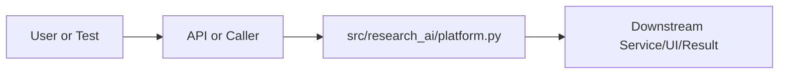

# platform.py Explained

Generated educational companion for `src/research_ai/platform.py`. This file is intentionally detailed so a developer can understand the code, architecture role, production tradeoffs, and ML/backend concepts behind the implementation.

## File Overview

`src/research_ai/platform.py` is a Python module in the Repository support layer. It defines ResearchAIPlatform and no top-level functions.

## Why This File Exists

This file isolates one responsibility in the codebase: Repository support layer. Separation matters because AI systems are easier to test, scale, debug, and explain when retrieval, orchestration, ML services, memory, UI, and deployment scripts have clear boundaries.

## Workflow Position

**Layer:** Repository support layer.

**Previous step:** caller code, an API request, a browser event, a test fixture, an import, or a startup script prepares inputs.

**Current step:** `src/research_ai/platform.py` performs its local responsibility.

**Next step:** downstream services, API responses, rendered UI, tests, or process execution consume the result.



## Inputs and Outputs

- **Inputs:** function arguments, class constructor dependencies, HTTP payloads, environment variables, filesystem artifacts, DOM events, or test fixtures.
- **Outputs:** return values, dictionaries, Pydantic models, rendered DOM state, API responses, logs, process startup, assertions, or side effects.
- **Serialization:** this project uses JSON for APIs/LLM planning, parquet/joblib/faiss for ML artifacts, and HTML/CSS/JS for the browser surface.

## Imports Explained

| Import | Explanation |
|---|---|
| `__future__` | Project or standard-library dependency used to import a service, type, helper, or runtime capability. Imports affect startup time, packaging, and test isolation. |
| `joblib` | Joblib serializes Python and scikit-learn artifacts such as vectorizers, classifiers, and model metadata. |
| `logging` | logging provides structured operational visibility without using print statements. |
| `research_ai` | Project or standard-library dependency used to import a service, type, helper, or runtime capability. Imports affect startup time, packaging, and test isolation. |

## Global Variables and Config

| Name | Line | Why it matters |
|---|---:|---|
| `logger` | 55 | Module-level value, constant, prompt, cache, registry, or configuration point. Check mutability and startup cost. |

## Step-by-Step Workflow

1. Load dependencies and runtime constants.
2. Accept input from the previous layer.
3. Validate, transform, route, score, render, or execute according to this file's role.
4. Return a structured output or perform a controlled side effect.
5. Let caller layers handle presentation, persistence, retries, or fallback.

## Function-by-Function Breakdown

No top-level functions are defined. Behavior is class-based, declarative, or provided through package exports.

## Class-by-Class Breakdown

### `ResearchAIPlatform`

- **Line:** 58
- **Base classes:** `object`
- **Docstring:** Composition root — all services wired here, nothing else knows about each other.

The cloud LLM factory is a callable that returns a *cached* client instance.
It raises ValueError only if the API key is missing at call time, so startup
always succeeds even with no LLM key configured.

**Methods:**
- `__init__` at line 66: method behavior is described by its body and name
- `_build_tool_registry` at line 155: method behavior is described by its body and name
- `_classify_query` at line 183: method behavior is described by its body and name
- `_hybrid_search` at line 186: method behavior is described by its body and name
- `_summarize` at line 205: method behavior is described by its body and name
- `_methodology_extract` at line 210: method behavior is described by its body and name
- `_citation_signals` at line 217: method behavior is described by its body and name
- `_trend_analysis` at line 220: method behavior is described by its body and name
- `_citation_proxy` at line 223: method behavior is described by its body and name
- `_metadata_analyse` at line 226: method behavior is described by its body and name
- `_paper_chat` at line 229: method behavior is described by its body and name
- `_metadata_rag` at line 234: Retrieval-augmented generation: search papers then produce a grounded answer.

Pipeline:
  1. hybrid_search → candidate papers (reuses the full hybrid pipeline)
  2. Build a numbered context block from titles + abstract snippets
  3. Cloud LLM generates an answer citing papers as [1], [2], ...
  4. If no LLM is available, fall back to a formatted paper list

WHY call _hybrid_search here instead of the vector store directly:
  _hybrid_search also triggers knowledge-graph ingestion and category-aware
  ranking, giving the LLM richer, better-ordered context.

BUG FIX (v3.1.1): previously called get_cloud_client() directly.
  In local-only mode (no API key) this crashed with ValueError instead of
  gracefully returning the fallback paper list. Fix: use self._cloud_factory.
- `_python_execute` at line 284: method behavior is described by its body and name
- `_run_pipeline` at line 287: method behavior is described by its body and name
- `_conversation` at line 293: method behavior is described by its body and name
- `chat` at line 311: Unified chat entry point — the only method the frontend needs to call.

This is the "ChatGPT-like" interface. The user sends a message; the
system automatically decides which tools to invoke, which model to use,
how to retrieve evidence, and how to synthesize a grounded answer.

Orchestration flow:
  1. Retrieve / create conversation from ConversationStore
  2. Add user message to conversation history
  3. Pass conversation history to orchestrator (context-aware planning)
  4. Run full Plan→Execute→Evaluate→Synthesize pipeline
  5. Extract structured sources from tool outputs
  6. Add assistant answer to conversation history
  7. Return structured response (answer + sources + confidence + metadata)

Returns:
    {
        "answer":          str,
        "sources":         list[dict],
        "confidence":      float,
        "conversation_id": str,
        "intent":          str,
        "tools_used":      list[str],
        "model_used":      str,
        "latency_ms":      float,
        "debug_trace":     dict | None,
    }
- `indexed_paper_count` at line 407: method behavior is described by its body and name
- `_resolve_embedding_model` at line 411: method behavior is described by its body and name
- `_format_paper_list` at line 421: method behavior is described by its body and name

```python
class ResearchAIPlatform:
    """Composition root — all services wired here, nothing else knows about each other.

    The cloud LLM factory is a callable that returns a *cached* client instance.
    It raises ValueError only if the API key is missing at call time, so startup
    always succeeds even with no LLM key configured.
    """

    def __init__(self, settings: Settings) -> None:
        self.settings = settings

        # Cloud factory: returns the singleton client, raises only on first real call.
        # Stored on self so ALL internal tool methods (including _metadata_rag) can
        # use it without importing get_cloud_client() directly — which would bypass
        # the factory pattern and crash in local-only deployments.
        self._cloud_factory = (
            (lambda: get_cloud_client()) if settings.llm.backend == "cloud" else None
        )

        # --- Core infrastructure ---
        self.embedding_service = EmbeddingService(self._resolve_embedding_model(settings))
        self.vector_store = FaissVectorStore.from_artifacts(settings.paths.similarity_dir)
        self.retriever = HybridSearchService(self.embedding_service, self.vector_store)

        # --- ML models ---
        self.classifier = ClassifierService.from_artifacts(settings.paths.classifier_dir)
        self.summarizer = ScientificSummarizer()
        self.similarity = SimilarityService(self.embedding_service)
        self.methodology = MethodologyExtractor()
        self.ranking = RankingService()
        self.citation_graph = CitationGraphService()

        # --- Research intelligence ---
        # PaperChatService receives the cloud_factory so it uses the same singleton
        # client — previously it created CloudLLMClient() directly, breaking the
        # singleton and causing double-initialization on first paper chat call.
        self.paper_chat = PaperChatService(
            self.embedding_service, cloud_factory=self._cloud_factory
        )
        self.trends = TrendAnalysisService()
        self.citation_engine = CitationEngine()
        self.metadata_service = MetadataService()

        # --- Memory ---
        self.knowledge_graph = KnowledgeGraph()

        # Conversation store: tracks multi-turn chat history per conversation_id.
        # Powers the unified /chat/message endpoint so the AI can understand
        # follow-up questions ("tell me more", "which was fastest?", etc.)
        self.conversation_store = ConversationStore()

        # Ollama model manager: discovers installed local models and routes each
        # request to the best model for the task (fast models for simple tasks,
        # stronger models for complex reasoning). Safe to initialize even if
        # Ollama is not running — discover() returns False gracefully.
        self.ollama_manager = OllamaModelManager(
            base_url=settings.llm.ollama_base_url
        )
        if settings.llm.provider == "ollama" or settings.llm.backend == "local":
            self.ollama_manager.discover()

        # --- Execution ---
        self.python_runner = PythonRunner(
            enabled=settings.execution.enabled,
            max_code_chars=settings.execution.max_code_chars,
            timeout_seconds=settings.execution.timeout_seconds,
        )

        # --- Agent layer ---
        retrieval_agent = RetrievalAgent(self.retriever)
        tools = self._build_tool_registry(retrieval_agent)
        ml_agent = MLExecutionAgent(tools)
        self.pipeline_runner = PipelineRunner(ml_agent)

        # Keep a direct reference to SynthesisAgent for the chat() method.
        # The orchestrator uses synthesizer.synthesize() (legacy string return),
        # while chat() calls synthesizer.synthesize_structured() for rich output.
        self.synthesizer_service = SynthesisAgent(cloud_factory=self._cloud_factory)

        self.orchestrator = ResearchOrchestrator(
            planner=PlannerAgent(cloud_factory=self._cloud_factory, max_top_k=settings.retrieval.max_top_k),
            executor=ml_agent,
            evaluator=EvaluatorAgent(),
            synthesizer=self.synthesizer_service,
        )

        logger.info(
            "ResearchAIPlatform v3.1 ready — backend=%s provider=%s index_ready=%s",
            settings.llm.backend,
            settings.llm.provider,
            self.retriever.ready,
        )

    # ------------------------------------------------------------------
    # Tool registry — the full set of tools the LLM planner can invoke
    # ------------------------------------------------------------------

    def _build_tool_registry(self, retrieval_agent: RetrievalAgent) -> dict:
        return {
            # Core retrieval
            "hybrid_search":        self._hybrid_search,
```

This class packages state and behavior behind a service-style interface. Constructor dependencies show what the class needs; public methods show what the rest of the system can ask it to do. In production, this boundary is where caching, model loading, artifact access, and error handling must be controlled.


## Method-by-Method Deep Dive

### Class `ResearchAIPlatform` Methods

#### `ResearchAIPlatform.__init__`

- **Line:** 66
- **Kind:** synchronous method
- **Arguments:** self, settings
- **Docstring:** No explicit docstring; behavior is inferred from the implementation and call sites.

```python
    def __init__(self, settings: Settings) -> None:
        self.settings = settings

        # Cloud factory: returns the singleton client, raises only on first real call.
        # Stored on self so ALL internal tool methods (including _metadata_rag) can
        # use it without importing get_cloud_client() directly — which would bypass
        # the factory pattern and crash in local-only deployments.
        self._cloud_factory = (
            (lambda: get_cloud_client()) if settings.llm.backend == "cloud" else None
        )

        # --- Core infrastructure ---
        self.embedding_service = EmbeddingService(self._resolve_embedding_model(settings))
        self.vector_store = FaissVectorStore.from_artifacts(settings.paths.similarity_dir)
        self.retriever = HybridSearchService(self.embedding_service, self.vector_store)

        # --- ML models ---
        self.classifier = ClassifierService.from_artifacts(settings.paths.classifier_dir)
        self.summarizer = ScientificSummarizer()
        self.similarity = SimilarityService(self.embedding_service)
        self.methodology = MethodologyExtractor()
        self.ranking = RankingService()
        self.citation_graph = CitationGraphService()

        # --- Research intelligence ---
        # PaperChatService receives the cloud_factory so it uses the same singleton
        # client — previously it created CloudLLMClient() directly, breaking the
        # singleton and causing double-initialization on first paper chat call.
        self.paper_chat = PaperChatService(
            self.embedding_service, cloud_factory=self._cloud_factory
        )
        self.trends = TrendAnalysisService()
        self.citation_engine = CitationEngine()
        self.metadata_service = MetadataService()

        # --- Memory ---
        self.knowledge_graph = KnowledgeGraph()

        # Conversation store: tracks multi-turn chat history per conversation_id.
        # Powers the unified /chat/message endpoint so the AI can understand
        # follow-up questions ("tell me more", "which was fastest?", etc.)
        self.conversation_store = ConversationStore()

        # Ollama model manager: discovers installed local models and routes each
        # request to the best model for the task (fast models for simple tasks,
        # stronger models for complex reasoning). Safe to initialize even if
        # Ollama is not running — discover() returns False gracefully.
        self.ollama_manager = OllamaModelManager(
            base_url=settings.llm.ollama_base_url
        )
        if settings.llm.provider == "ollama" or settings.llm.backend == "local":
            self.ollama_manager.discover()

        # --- Execution ---
        self.python_runner = PythonRunner(
            enabled=settings.execution.enabled,
            max_code_chars=settings.execution.max_code_chars,
            timeout_seconds=settings.execution.timeout_seconds,
        )

        # --- Agent layer ---
        retrieval_agent = RetrievalAgent(self.retriever)
        tools = self._build_tool_registry(retrieval_agent)
        ml_agent = MLExecutionAgent(tools)
        self.pipeline_runner = PipelineRunner(ml_agent)

        # Keep a direct reference to SynthesisAgent for the chat() method.
        # The orchestrator uses synthesizer.synthesize() (legacy string return),
        # while chat() calls synthesizer.synthesize_structured() for rich output.
        self.synthesizer_service = SynthesisAgent(cloud_factory=self._cloud_factory)
```

This method is part of the class contract. Its inputs show what state or caller data it consumes; its body shows whether it performs pure transformation, model/artifact access, retrieval, I/O, caching, validation, or orchestration. In production review, pay attention to error handling, mutation of `self`, repeated expensive work, and whether return shapes stay stable for downstream callers.

#### `ResearchAIPlatform._build_tool_registry`

- **Line:** 155
- **Kind:** synchronous method
- **Arguments:** self, retrieval_agent
- **Docstring:** No explicit docstring; behavior is inferred from the implementation and call sites.

```python
    def _build_tool_registry(self, retrieval_agent: RetrievalAgent) -> dict:
        return {
            # Core retrieval
            "hybrid_search":        self._hybrid_search,
            "smart_retrieve":       retrieval_agent.retrieve,
            # ML models
            "classify_query":       self._classify_query,
            "summarize":            self._summarize,
            "methodology_extract":  self._methodology_extract,
            "citation_signals":     self._citation_signals,
            # Research intelligence
            "trend_analysis":       self._trend_analysis,
            "citation_proxy":       self._citation_proxy,
            "metadata_analyse":     self._metadata_analyse,
            # LLM-backed synthesis
            "paper_chat":           self._paper_chat,
            "metadata_rag":         self._metadata_rag,
            # Execution
            "python_execute":       self._python_execute,
            "run_pipeline":         self._run_pipeline,
            # Utility
            "conversation":         self._conversation,
        }
```

This method is part of the class contract. Its inputs show what state or caller data it consumes; its body shows whether it performs pure transformation, model/artifact access, retrieval, I/O, caching, validation, or orchestration. In production review, pay attention to error handling, mutation of `self`, repeated expensive work, and whether return shapes stay stable for downstream callers.

#### `ResearchAIPlatform._classify_query`

- **Line:** 183
- **Kind:** synchronous method
- **Arguments:** self, title, abstract
- **Docstring:** No explicit docstring; behavior is inferred from the implementation and call sites.

```python
    def _classify_query(self, title: str = "", abstract: str = "", **_) -> dict:
        return self.classifier.classify(title, abstract)
```

This method is part of the class contract. Its inputs show what state or caller data it consumes; its body shows whether it performs pure transformation, model/artifact access, retrieval, I/O, caching, validation, or orchestration. In production review, pay attention to error handling, mutation of `self`, repeated expensive work, and whether return shapes stay stable for downstream callers.

#### `ResearchAIPlatform._hybrid_search`

- **Line:** 186
- **Kind:** synchronous method
- **Arguments:** self, query, top_k, filters, candidate_k
- **Docstring:** No explicit docstring; behavior is inferred from the implementation and call sites.

```python
    def _hybrid_search(
        self,
        query: str = "",
        top_k: int = 5,
        filters: dict | None = None,
        candidate_k: int | None = None,
        **_,
    ) -> dict:
        result = self.retriever.search(query, top_k=top_k, filters=filters, candidate_k=candidate_k)
        if result.get("results"):
            # Category-aware ranking
            clf = self.classifier.classify(query, query)
            preferred = clf.get("predicted_category") if not clf.get("error") else None
            result["results"] = self.ranking.rank(result["results"], preferred_category=preferred)
            # Feed into knowledge graph
            self.knowledge_graph.ingest_papers(result["results"])
            self.knowledge_graph.ingest_query(query)
        return result
```

This method is part of the class contract. Its inputs show what state or caller data it consumes; its body shows whether it performs pure transformation, model/artifact access, retrieval, I/O, caching, validation, or orchestration. In production review, pay attention to error handling, mutation of `self`, repeated expensive work, and whether return shapes stay stable for downstream callers.

#### `ResearchAIPlatform._summarize`

- **Line:** 205
- **Kind:** synchronous method
- **Arguments:** self, text
- **Docstring:** No explicit docstring; behavior is inferred from the implementation and call sites.

```python
    def _summarize(self, text: str = "", **_) -> dict:
        if not text.strip():
            return {"error": "No text provided to summarize."}
        return {"summary": self.summarizer.summarize(text)}
```

This method is part of the class contract. Its inputs show what state or caller data it consumes; its body shows whether it performs pure transformation, model/artifact access, retrieval, I/O, caching, validation, or orchestration. In production review, pay attention to error handling, mutation of `self`, repeated expensive work, and whether return shapes stay stable for downstream callers.

#### `ResearchAIPlatform._methodology_extract`

- **Line:** 210
- **Kind:** synchronous method
- **Arguments:** self, papers, text
- **Docstring:** No explicit docstring; behavior is inferred from the implementation and call sites.

```python
    def _methodology_extract(self, papers: list | None = None, text: str = "", **_) -> dict:
        source = text or "\n\n".join(
            f"{p.get('title', '')}. {p.get('abstract', '')}"
            for p in (papers or [])[:6]
        )
        return self.methodology.extract(source)
```

This method is part of the class contract. Its inputs show what state or caller data it consumes; its body shows whether it performs pure transformation, model/artifact access, retrieval, I/O, caching, validation, or orchestration. In production review, pay attention to error handling, mutation of `self`, repeated expensive work, and whether return shapes stay stable for downstream callers.

#### `ResearchAIPlatform._citation_signals`

- **Line:** 217
- **Kind:** synchronous method
- **Arguments:** self, papers
- **Docstring:** No explicit docstring; behavior is inferred from the implementation and call sites.

```python
    def _citation_signals(self, papers: list | None = None, **_) -> dict:
        return self.citation_graph.related_signals(papers or [])
```

This method is part of the class contract. Its inputs show what state or caller data it consumes; its body shows whether it performs pure transformation, model/artifact access, retrieval, I/O, caching, validation, or orchestration. In production review, pay attention to error handling, mutation of `self`, repeated expensive work, and whether return shapes stay stable for downstream callers.

#### `ResearchAIPlatform._trend_analysis`

- **Line:** 220
- **Kind:** synchronous method
- **Arguments:** self, papers
- **Docstring:** No explicit docstring; behavior is inferred from the implementation and call sites.

```python
    def _trend_analysis(self, papers: list | None = None, **_) -> dict:
        return self.trends.analyze(papers or [])
```

This method is part of the class contract. Its inputs show what state or caller data it consumes; its body shows whether it performs pure transformation, model/artifact access, retrieval, I/O, caching, validation, or orchestration. In production review, pay attention to error handling, mutation of `self`, repeated expensive work, and whether return shapes stay stable for downstream callers.

#### `ResearchAIPlatform._citation_proxy`

- **Line:** 223
- **Kind:** synchronous method
- **Arguments:** self, papers
- **Docstring:** No explicit docstring; behavior is inferred from the implementation and call sites.

```python
    def _citation_proxy(self, papers: list | None = None, **_) -> dict:
        return self.citation_engine.proxy_citations(papers or [])
```

This method is part of the class contract. Its inputs show what state or caller data it consumes; its body shows whether it performs pure transformation, model/artifact access, retrieval, I/O, caching, validation, or orchestration. In production review, pay attention to error handling, mutation of `self`, repeated expensive work, and whether return shapes stay stable for downstream callers.

#### `ResearchAIPlatform._metadata_analyse`

- **Line:** 226
- **Kind:** synchronous method
- **Arguments:** self, papers
- **Docstring:** No explicit docstring; behavior is inferred from the implementation and call sites.

```python
    def _metadata_analyse(self, papers: list | None = None, **_) -> dict:
        return self.metadata_service.analyse(papers or [])
```

This method is part of the class contract. Its inputs show what state or caller data it consumes; its body shows whether it performs pure transformation, model/artifact access, retrieval, I/O, caching, validation, or orchestration. In production review, pay attention to error handling, mutation of `self`, repeated expensive work, and whether return shapes stay stable for downstream callers.

#### `ResearchAIPlatform._paper_chat`

- **Line:** 229
- **Kind:** synchronous method
- **Arguments:** self, session_id, question, top_k
- **Docstring:** No explicit docstring; behavior is inferred from the implementation and call sites.

```python
    def _paper_chat(self, session_id: str = "", question: str = "", top_k: int = 5, **_) -> dict:
        if not session_id:
            return {"error": "session_id is required for paper_chat."}
        return self.paper_chat.ask(session_id=session_id, question=question, top_k=top_k)
```

This method is part of the class contract. Its inputs show what state or caller data it consumes; its body shows whether it performs pure transformation, model/artifact access, retrieval, I/O, caching, validation, or orchestration. In production review, pay attention to error handling, mutation of `self`, repeated expensive work, and whether return shapes stay stable for downstream callers.

#### `ResearchAIPlatform._metadata_rag`

- **Line:** 234
- **Kind:** synchronous method
- **Arguments:** self, query, top_k
- **Docstring:** Retrieval-augmented generation: search papers then produce a grounded answer.

Pipeline:
  1. hybrid_search → candidate papers (reuses the full hybrid pipeline)
  2. Build a numbered context block from titles + abstract snippets
  3. Cloud LLM generates an answer citing papers as [1], [2], ...
  4. If no LLM is available, fall back to a formatted paper list

WHY call _hybrid_search here instead of the vector store directly:
  _hybrid_search also triggers knowledge-graph ingestion and category-aware
  ranking, giving the LLM richer, better-ordered context.

BUG FIX (v3.1.1): previously called get_cloud_client() directly.
  In local-only mode (no API key) this crashed with ValueError instead of
  gracefully returning the fallback paper list. Fix: use self._cloud_factory.

```python
    def _metadata_rag(self, query: str = "", top_k: int = 5, **_) -> dict:
        """Retrieval-augmented generation: search papers then produce a grounded answer.

        Pipeline:
          1. hybrid_search → candidate papers (reuses the full hybrid pipeline)
          2. Build a numbered context block from titles + abstract snippets
          3. Cloud LLM generates an answer citing papers as [1], [2], ...
          4. If no LLM is available, fall back to a formatted paper list

        WHY call _hybrid_search here instead of the vector store directly:
          _hybrid_search also triggers knowledge-graph ingestion and category-aware
          ranking, giving the LLM richer, better-ordered context.

        BUG FIX (v3.1.1): previously called get_cloud_client() directly.
          In local-only mode (no API key) this crashed with ValueError instead of
          gracefully returning the fallback paper list. Fix: use self._cloud_factory.
        """
        search = self._hybrid_search(query, top_k=top_k)
        if search.get("error"):
            return search
        results = search.get("results", [])
        if not results:
            return {"query": query, "answer": "No relevant papers found in the index.", "retrieved": []}

        # Build a compact numbered context block — LLM will cite as [1], [2], ...
        # 700-char abstract cap keeps the prompt within reasonable token limits.
        context = "\n\n".join(
            f"[{i}] {p.get('title', 'Untitled')} ({p.get('year', '')})\n{str(p.get('abstract', ''))[:700]}"
            for i, p in enumerate(results, 1)
        )
        try:
            # Use the cloud factory (may be None in local-only mode, triggers except)
            if self._cloud_factory is None:
                raise RuntimeError("No cloud LLM configured.")
            cloud = self._cloud_factory()
            answer = cloud.generate(
                prompt=f"Question: {query}\n\nPapers:\n{context}\n\nAnswer with citations like [1].",
                max_tokens=512,
                system=(
                    "You are a scientific research assistant. "
                    "Answer using ONLY the provided paper metadata and abstracts. "
                    "Be specific. Cite papers as [1], [2], etc. "
                    "Do NOT add information not present in the papers."
                ),
            )
        except Exception:
            # Graceful degradation: return a clean formatted paper list
            answer = self._format_paper_list(query, results)
        return {"query": query, "answer": answer, "retrieved": results}
```

This method is part of the class contract. Its inputs show what state or caller data it consumes; its body shows whether it performs pure transformation, model/artifact access, retrieval, I/O, caching, validation, or orchestration. In production review, pay attention to error handling, mutation of `self`, repeated expensive work, and whether return shapes stay stable for downstream callers.

#### `ResearchAIPlatform._python_execute`

- **Line:** 284
- **Kind:** synchronous method
- **Arguments:** self, code
- **Docstring:** No explicit docstring; behavior is inferred from the implementation and call sites.

```python
    def _python_execute(self, code: str = "", **_) -> dict:
        return self.python_runner.run(code).to_dict()
```

This method is part of the class contract. Its inputs show what state or caller data it consumes; its body shows whether it performs pure transformation, model/artifact access, retrieval, I/O, caching, validation, or orchestration. In production review, pay attention to error handling, mutation of `self`, repeated expensive work, and whether return shapes stay stable for downstream callers.

#### `ResearchAIPlatform._run_pipeline`

- **Line:** 287
- **Kind:** synchronous method
- **Arguments:** self, pipeline_name, query
- **Docstring:** No explicit docstring; behavior is inferred from the implementation and call sites.

```python
    def _run_pipeline(self, pipeline_name: str = "full_research_analysis", query: str = "", **_) -> dict:
        if not query:
            return {"error": "query is required for run_pipeline."}
        return self.pipeline_runner.run(pipeline_name, query).to_dict()
```

This method is part of the class contract. Its inputs show what state or caller data it consumes; its body shows whether it performs pure transformation, model/artifact access, retrieval, I/O, caching, validation, or orchestration. In production review, pay attention to error handling, mutation of `self`, repeated expensive work, and whether return shapes stay stable for downstream callers.

#### `ResearchAIPlatform._conversation`

- **Line:** 293
- **Kind:** synchronous method
- **Arguments:** query
- **Docstring:** No explicit docstring; behavior is inferred from the implementation and call sites.

```python
    def _conversation(query: str = "", **_) -> dict:
        return {
            "answer": (
                "Hello! I'm your AI Research Intelligence assistant. I can help you:\n"
                "• Find and analyse arXiv papers on any topic\n"
                "• Extract methodology and experimental details\n"
                "• Identify research trends and citation patterns\n"
                "• Summarise papers or abstracts\n"
                "• Answer research questions using the paper database\n\n"
                "What would you like to explore?"
            ),
            "query": query,
        }
```

This method is part of the class contract. Its inputs show what state or caller data it consumes; its body shows whether it performs pure transformation, model/artifact access, retrieval, I/O, caching, validation, or orchestration. In production review, pay attention to error handling, mutation of `self`, repeated expensive work, and whether return shapes stay stable for downstream callers.

#### `ResearchAIPlatform.chat`

- **Line:** 311
- **Kind:** synchronous method
- **Arguments:** self, query, conversation_id, session_id, top_k, debug
- **Docstring:** Unified chat entry point — the only method the frontend needs to call.

This is the "ChatGPT-like" interface. The user sends a message; the
system automatically decides which tools to invoke, which model to use,
how to retrieve evidence, and how to synthesize a grounded answer.

Orchestration flow:
  1. Retrieve / create conversation from ConversationStore
  2. Add user message to conversation history
  3. Pass conversation history to orchestrator (context-aware planning)
  4. Run full Plan→Execute→Evaluate→Synthesize pipeline
  5. Extract structured sources from tool outputs
  6. Add assistant answer to conversation history
  7. Return structured response (answer + sources + confidence + metadata)

Returns:
    {
        "answer":          str,
        "sources":         list[dict],
        "confidence":      float,
        "conversation_id": str,
        "intent":          str,
        "tools_used":      list[str],
        "model_used":      str,
        "latency_ms":      float,
        "debug_trace":     dict | None,
    }

```python
    def chat(
        self,
        query: str,
        conversation_id: str | None = None,
        session_id: str | None = None,
        top_k: int = 5,
        debug: bool = False,
    ) -> dict:
        """Unified chat entry point — the only method the frontend needs to call.

        This is the "ChatGPT-like" interface. The user sends a message; the
        system automatically decides which tools to invoke, which model to use,
        how to retrieve evidence, and how to synthesize a grounded answer.

        Orchestration flow:
          1. Retrieve / create conversation from ConversationStore
          2. Add user message to conversation history
          3. Pass conversation history to orchestrator (context-aware planning)
          4. Run full Plan→Execute→Evaluate→Synthesize pipeline
          5. Extract structured sources from tool outputs
          6. Add assistant answer to conversation history
          7. Return structured response (answer + sources + confidence + metadata)

        Returns:
            {
                "answer":          str,
                "sources":         list[dict],
                "confidence":      float,
                "conversation_id": str,
                "intent":          str,
                "tools_used":      list[str],
                "model_used":      str,
                "latency_ms":      float,
                "debug_trace":     dict | None,
            }
        """
        import time
        started = time.perf_counter()

        # Step 1–2: Resume or create conversation, store user turn
        cid, conv = self.conversation_store.get_or_create(conversation_id)
        conv.add("user", query)

        # Step 3: Build context summary for the planner
        # This lets the planner resolve "that paper", "the second one", etc.
        history = conv.context_summary(last_n_pairs=6)

        # Step 4: Full orchestration (Plan → Execute → Evaluate → Synthesize)
        raw = self.orchestrator.run(
            mode="auto",
            query=query,
            top_k=top_k,
            session_id=session_id,
            conversation_history=history if conv.turn_count > 2 else None,
        )

        # Step 5: Structured synthesis (sources + confidence + tools_used)
        # SynthesisAgent.synthesize_structured provides richer output than the
        # legacy synthesize() method which returns only a string.
        quality_score = raw.get("evaluation", {}).get("quality_score")
        structured = self.synthesizer_service.synthesize_structured(
            query=query,
            plan=raw.get("plan", {}),
            outputs=raw.get("executor_output", {}),
            quality_score=quality_score,
        )

        answer = structured["answer"]
        sources = structured["sources"]
        confidence = structured["confidence"]
        tools_used = structured["tools_used"]
```

This method is part of the class contract. Its inputs show what state or caller data it consumes; its body shows whether it performs pure transformation, model/artifact access, retrieval, I/O, caching, validation, or orchestration. In production review, pay attention to error handling, mutation of `self`, repeated expensive work, and whether return shapes stay stable for downstream callers.

#### `ResearchAIPlatform.indexed_paper_count`

- **Line:** 407
- **Kind:** synchronous method
- **Arguments:** self
- **Docstring:** No explicit docstring; behavior is inferred from the implementation and call sites.

```python
    def indexed_paper_count(self) -> int:
        return self.vector_store.paper_count
```

This method is part of the class contract. Its inputs show what state or caller data it consumes; its body shows whether it performs pure transformation, model/artifact access, retrieval, I/O, caching, validation, or orchestration. In production review, pay attention to error handling, mutation of `self`, repeated expensive work, and whether return shapes stay stable for downstream callers.

#### `ResearchAIPlatform._resolve_embedding_model`

- **Line:** 411
- **Kind:** synchronous method
- **Arguments:** settings
- **Docstring:** No explicit docstring; behavior is inferred from the implementation and call sites.

```python
    def _resolve_embedding_model(settings: Settings) -> str:
        path = settings.paths.similarity_dir / "embedding_model_name.joblib"
        if path.exists():
            try:
                return str(joblib.load(path))
            except Exception:
                pass
        return settings.retrieval.embedding_model_name
```

This method is part of the class contract. Its inputs show what state or caller data it consumes; its body shows whether it performs pure transformation, model/artifact access, retrieval, I/O, caching, validation, or orchestration. In production review, pay attention to error handling, mutation of `self`, repeated expensive work, and whether return shapes stay stable for downstream callers.

#### `ResearchAIPlatform._format_paper_list`

- **Line:** 421
- **Kind:** synchronous method
- **Arguments:** query, results
- **Docstring:** No explicit docstring; behavior is inferred from the implementation and call sites.

```python
    def _format_paper_list(query: str, results: list) -> str:
        lines = [f"Top papers related to: {query}"]
        for i, p in enumerate(results[:6], 1):
            pid = p.get("paper_id", "")
            link = f" — https://arxiv.org/abs/{pid}" if pid else ""
            lines.append(f"{i}. {p.get('title', 'Untitled')} ({p.get('year', '')}){link}")
        return "\n".join(lines)
```

This method is part of the class contract. Its inputs show what state or caller data it consumes; its body shows whether it performs pure transformation, model/artifact access, retrieval, I/O, caching, validation, or orchestration. In production review, pay attention to error handling, mutation of `self`, repeated expensive work, and whether return shapes stay stable for downstream callers.

## Important Algorithms Used

- **Embeddings**: Embeddings map text into dense semantic vectors so conceptual similarity becomes geometric similarity.
- **FAISS Indexing**: FAISS indexes dense vectors for nearest-neighbor search. Exact flat indexes trade speed at huge scale for simplicity and correctness.
- **Hybrid Retrieval**: Hybrid retrieval combines semantic vectors with lexical/keyword evidence, improving scientific search where exact terms matter.
- **RAG**: Retrieval-Augmented Generation retrieves evidence first and asks an LLM to answer from that evidence, reducing hallucination.
- **LLM Inference**: LLM inference sends prompts or chat messages to a model provider and receives generated text under token, latency, and cost constraints.
- **Transformers**: Transformers use tokenization and attention layers for language understanding/generation. They are powerful but memory and latency sensitive.
- **Classification**: Classification maps text or features to discrete labels, supporting category prediction and routing.
- **Calibration**: Calibration makes predicted probabilities better match real correctness rates, which matters for user-facing confidence.
- **Caching**: Caching avoids repeating expensive work such as model loading, embedding generation, or client initialization.
- **Streaming**: Streaming improves perceived latency by sending incremental output instead of waiting for full completion.
- **Sandboxing**: Sandboxing validates and constrains user code before execution, reducing security and stability risk.

## Libraries Used

| Import | Explanation |
|---|---|
| `__future__` | Project or standard-library dependency used to import a service, type, helper, or runtime capability. Imports affect startup time, packaging, and test isolation. |
| `joblib` | Joblib serializes Python and scikit-learn artifacts such as vectorizers, classifiers, and model metadata. |
| `logging` | logging provides structured operational visibility without using print statements. |
| `research_ai` | Project or standard-library dependency used to import a service, type, helper, or runtime capability. Imports affect startup time, packaging, and test isolation. |

## ML Concepts Used

- **Embeddings**: Embeddings map text into dense semantic vectors so conceptual similarity becomes geometric similarity.
- **FAISS Indexing**: FAISS indexes dense vectors for nearest-neighbor search. Exact flat indexes trade speed at huge scale for simplicity and correctness.
- **Hybrid Retrieval**: Hybrid retrieval combines semantic vectors with lexical/keyword evidence, improving scientific search where exact terms matter.
- **RAG**: Retrieval-Augmented Generation retrieves evidence first and asks an LLM to answer from that evidence, reducing hallucination.
- **LLM Inference**: LLM inference sends prompts or chat messages to a model provider and receives generated text under token, latency, and cost constraints.
- **Transformers**: Transformers use tokenization and attention layers for language understanding/generation. They are powerful but memory and latency sensitive.
- **Classification**: Classification maps text or features to discrete labels, supporting category prediction and routing.
- **Calibration**: Calibration makes predicted probabilities better match real correctness rates, which matters for user-facing confidence.
- **Caching**: Caching avoids repeating expensive work such as model loading, embedding generation, or client initialization.
- **Streaming**: Streaming improves perceived latency by sending incremental output instead of waiting for full completion.
- **Sandboxing**: Sandboxing validates and constrains user code before execution, reducing security and stability risk.

## Performance and Memory Notes

- Avoid eager loading of heavy ML models unless startup latency is acceptable.
- Cache expensive clients, tokenizers, vector stores, and embeddings carefully.
- Use float32 for embedding vectors because it halves memory compared with float64 and matches FAISS/neural inference expectations.
- Bound prompt length, uploaded content, result counts, and token budgets to control latency and memory.
- Watch copies of large metadata frames, embedding matrices, and file buffers.

## Scalability Notes

- In-memory state works for local demos but needs Redis/database/object storage for multi-worker cloud deployment.
- CPU/GPU inference should often be separated from the web API when traffic grows.
- Retrieval can start exact and move to approximate indexes as corpus size grows.
- Batch operations and cache repeated work to improve throughput.
- Add metrics for latency, errors, fallback frequency, retrieval hit rate, and token usage.

## Production Engineering Notes

- Keep interfaces stable because other files may import this module or depend on its response shape.
- Prefer typed/structured data over free-form strings at service boundaries.
- Log operational context without secrets or huge payloads.
- Make fallback behavior explicit so users get useful output even when LLMs or artifacts fail.
- Keep provider-specific logic behind adapters so Groq/OpenRouter/Google/Ollama can be swapped.

## Common Bugs and Failure Cases

- Missing `.env` values, model artifacts, or Ollama models can trigger degraded behavior.
- Type mismatches occur when LLM-generated tool arguments cross into strict Python code.
- Empty retrieval results must not become hallucinated answers.
- Network calls need timeouts and careful retry behavior.
- Frontend IDs/classes and API schemas are contracts; changing one side without the other breaks workflows.

## Security Considerations

- Handles credentials or environment configuration. Keep secrets in environment variables and redact them from logs.
- Touches files or paths. Validate filenames, restrict upload size/type, and prevent traversal.
- Deals with execution or subprocesses. Maintain AST validation, isolated mode, timeouts, and least privilege.
- Performs network I/O. Use timeouts, validate responses, and keep private services such as Ollama off the public internet.

## Real Industry Usage

- This pattern appears in enterprise RAG assistants, scientific search tools, internal research copilots, and ML platform demos.
- The layered design mirrors production systems: API facade, orchestration, retrieval, evaluation, synthesis, UI, and deployment.
- Clear separation lets teams replace model providers, improve retrieval, harden security, or redesign UI independently.

## Optimization Opportunities

- Add tracing around each workflow step.
- Strengthen schema validation at boundaries.
- Persist conversation/session state outside process memory.
- Add load tests and adversarial tests for prompt injection, empty evidence, and large uploads.
- Consider approximate vector indexes, reranker models, or batching when corpus/traffic grows.

## How This Connects To Other Files

- `src/research_ai/platform.py` is connected through imports, startup scripts, API routes, frontend selectors, tests, or artifact paths.
- `src/research_ai/platform.py` is the backend composition root.
- `src/research_ai/api/main.py` exposes backend behavior over HTTP.
- Retrieval modules depend on artifacts under `artifacts/`.
- Frontend files depend on stable endpoint and DOM contracts.

## End-to-End Flow Summary

- A user/browser/test/startup event enters the system.
- The relevant layer validates or normalizes input.
- Retrieval, ML, orchestration, execution, or UI rendering happens.
- A structured result, visual state, or process side effect is produced.
- Fallbacks and tests keep behavior understandable when dependencies are unavailable.

## Interview Questions

1. What responsibility does this file own?
2. What inputs and outputs define its contract?
3. Which dependencies are expensive or operationally risky?
4. What breaks if this file changes shape?
5. How would you scale or test this behavior in production?

## Key Takeaways

- `src/research_ai/platform.py` should be understood as part of a layered AI research platform.
- Trace data flow from inputs to transformations to outputs.
- Production readiness comes from explicit contracts, bounded resources, observability, secure defaults, and graceful fallback.

## Fully Commented Source

This section repeats the original source with an explanatory comment before every line. The comments are educational only; they are not inserted into the production source file.

```python
# L0001: Starts, ends, or continues a docstring that documents module, class, or function intent.
"""Composition root — wires all services together via dependency injection.
# L0002: Blank line that visually separates logical sections and improves readability.

# L0003: Executes Python logic as part of this file's workflow; read surrounding lines for data flow and side effects.
ARCHITECTURE OVERVIEW
# L0004: Executes Python logic as part of this file's workflow; read surrounding lines for data flow and side effects.
---------------------
# L0005: Executes Python logic as part of this file's workflow; read surrounding lines for data flow and side effects.
ResearchAIPlatform is the single wiring point for the entire system.  Nothing
# L0006: Executes Python logic as part of this file's workflow; read surrounding lines for data flow and side effects.
outside this file imports concrete classes from sibling packages — all callers
# L0007: Executes Python logic as part of this file's workflow; read surrounding lines for data flow and side effects.
receive interfaces (tool callables, service objects) wired here.
# L0008: Blank line that visually separates logical sections and improves readability.

# L0009: Executes Python logic as part of this file's workflow; read surrounding lines for data flow and side effects.
CLOUD FACTORY PATTERN
# L0010: Executes Python logic as part of this file's workflow; read surrounding lines for data flow and side effects.
---------------------
# L0011: Executes Python logic as part of this file's workflow; read surrounding lines for data flow and side effects.
The cloud LLM client is intentionally NOT created at startup.  Instead, a
# L0012: Executes Python logic as part of this file's workflow; read surrounding lines for data flow and side effects.
zero-argument factory lambda is threaded through every service that needs it.
# L0013: Executes Python logic as part of this file's workflow; read surrounding lines for data flow and side effects.
This means:
# L0014: Executes Python logic as part of this file's workflow; read surrounding lines for data flow and side effects.
  1. Startup never fails even if the API key is absent.
# L0015: Executes Python logic as part of this file's workflow; read surrounding lines for data flow and side effects.
  2. The singleton is created on the first real API call (lazy init).
# L0016: Executes Python logic as part of this file's workflow; read surrounding lines for data flow and side effects.
  3. Tests can swap the factory for a mock without touching service code.
# L0017: Blank line that visually separates logical sections and improves readability.

# L0018: Executes Python logic as part of this file's workflow; read surrounding lines for data flow and side effects.
BUG FIX (v3.1.1): _metadata_rag previously called get_cloud_client() directly,
# L0019: Executes Python logic as part of this file's workflow; read surrounding lines for data flow and side effects.
bypassing the factory.  In a local-only (no API key) deployment this caused an
# L0020: Executes Python logic as part of this file's workflow; read surrounding lines for data flow and side effects.
immediate ValueError crash instead of gracefully falling back to the paper list.
# L0021: Executes Python logic as part of this file's workflow; read surrounding lines for data flow and side effects.
The fix stores the factory on self._cloud_factory and uses it everywhere.
# L0022: Starts, ends, or continues a docstring that documents module, class, or function intent.
"""
# L0023: Enables future Python behavior so annotations/import semantics stay modern and predictable.
from __future__ import annotations
# L0024: Blank line that visually separates logical sections and improves readability.

# L0025: Imports a dependency, type, or project module needed by later code in this file.
import joblib
# L0026: Imports a dependency, type, or project module needed by later code in this file.
import logging
# L0027: Blank line that visually separates logical sections and improves readability.

# L0028: Imports a dependency, type, or project module needed by later code in this file.
from research_ai.agents.evaluator_agent import EvaluatorAgent
# L0029: Imports a dependency, type, or project module needed by later code in this file.
from research_ai.agents.ml_execution_agent import MLExecutionAgent
# L0030: Imports a dependency, type, or project module needed by later code in this file.
from research_ai.agents.orchestrator import ResearchOrchestrator
# L0031: Imports a dependency, type, or project module needed by later code in this file.
from research_ai.agents.planner import PlannerAgent
# L0032: Imports a dependency, type, or project module needed by later code in this file.
from research_ai.agents.retrieval_agent import RetrievalAgent
# L0033: Imports a dependency, type, or project module needed by later code in this file.
from research_ai.agents.synthesis_agent import SynthesisAgent
# L0034: Imports a dependency, type, or project module needed by later code in this file.
from research_ai.configs.settings import Settings
# L0035: Imports a dependency, type, or project module needed by later code in this file.
from research_ai.execution.pipelines import PipelineRunner
# L0036: Imports a dependency, type, or project module needed by later code in this file.
from research_ai.execution.python_runner import PythonRunner
# L0037: Imports a dependency, type, or project module needed by later code in this file.
from research_ai.llm import get_cloud_client
# L0038: Imports a dependency, type, or project module needed by later code in this file.
from research_ai.memory.conversation_store import ConversationStore
# L0039: Imports a dependency, type, or project module needed by later code in this file.
from research_ai.memory.knowledge_graph import KnowledgeGraph
# L0040: Imports a dependency, type, or project module needed by later code in this file.
from research_ai.ml_models.citation_graph import CitationGraphService
# L0041: Imports a dependency, type, or project module needed by later code in this file.
from research_ai.ml_models.classifier import ClassifierService
# L0042: Imports a dependency, type, or project module needed by later code in this file.
from research_ai.ml_models.methodology_extractor import MethodologyExtractor
# L0043: Imports a dependency, type, or project module needed by later code in this file.
from research_ai.ml_models.ranking import RankingService
# L0044: Imports a dependency, type, or project module needed by later code in this file.
from research_ai.ml_models.similarity import SimilarityService
# L0045: Imports a dependency, type, or project module needed by later code in this file.
from research_ai.ml_models.summarizer import ScientificSummarizer
# L0046: Imports a dependency, type, or project module needed by later code in this file.
from research_ai.ollama_manager import OllamaModelManager
# L0047: Imports a dependency, type, or project module needed by later code in this file.
from research_ai.research.citation_engine import CitationEngine
# L0048: Imports a dependency, type, or project module needed by later code in this file.
from research_ai.research.metadata import MetadataService
# L0049: Imports a dependency, type, or project module needed by later code in this file.
from research_ai.research.paper_ingestion import PaperChatService
# L0050: Imports a dependency, type, or project module needed by later code in this file.
from research_ai.research.trend_analysis import TrendAnalysisService
# L0051: Imports a dependency, type, or project module needed by later code in this file.
from research_ai.retrieval.embeddings import EmbeddingService
# L0052: Imports a dependency, type, or project module needed by later code in this file.
from research_ai.retrieval.hybrid_search import HybridSearchService
# L0053: Imports a dependency, type, or project module needed by later code in this file.
from research_ai.retrieval.vector_store import FaissVectorStore
# L0054: Blank line that visually separates logical sections and improves readability.

# L0055: Assigns or updates a value used later in the workflow; check mutability and data shape.
logger = logging.getLogger(__name__)
# L0056: Blank line that visually separates logical sections and improves readability.

# L0057: Blank line that visually separates logical sections and improves readability.

# L0058: Defines a class that groups related state and behavior behind a reusable interface.
class ResearchAIPlatform:
# L0059: Starts, ends, or continues a docstring that documents module, class, or function intent.
    """Composition root — all services wired here, nothing else knows about each other.
# L0060: Blank line that visually separates logical sections and improves readability.

# L0061: Executes Python logic as part of this file's workflow; read surrounding lines for data flow and side effects.
    The cloud LLM factory is a callable that returns a *cached* client instance.
# L0062: Executes Python logic as part of this file's workflow; read surrounding lines for data flow and side effects.
    It raises ValueError only if the API key is missing at call time, so startup
# L0063: Executes Python logic as part of this file's workflow; read surrounding lines for data flow and side effects.
    always succeeds even with no LLM key configured.
# L0064: Starts, ends, or continues a docstring that documents module, class, or function intent.
    """
# L0065: Blank line that visually separates logical sections and improves readability.

# L0066: Defines a function or method; parameters are the input contract and the body implements the workflow.
    def __init__(self, settings: Settings) -> None:
# L0067: Assigns or updates a value used later in the workflow; check mutability and data shape.
        self.settings = settings
# L0068: Blank line that visually separates logical sections and improves readability.

# L0069: Developer comment explaining intent, caveat, section boundary, or operational reasoning.
        # Cloud factory: returns the singleton client, raises only on first real call.
# L0070: Developer comment explaining intent, caveat, section boundary, or operational reasoning.
        # Stored on self so ALL internal tool methods (including _metadata_rag) can
# L0071: Developer comment explaining intent, caveat, section boundary, or operational reasoning.
        # use it without importing get_cloud_client() directly — which would bypass
# L0072: Developer comment explaining intent, caveat, section boundary, or operational reasoning.
        # the factory pattern and crash in local-only deployments.
# L0073: Assigns or updates a value used later in the workflow; check mutability and data shape.
        self._cloud_factory = (
# L0074: Assigns or updates a value used later in the workflow; check mutability and data shape.
            (lambda: get_cloud_client()) if settings.llm.backend == "cloud" else None
# L0075: Executes Python logic as part of this file's workflow; read surrounding lines for data flow and side effects.
        )
# L0076: Blank line that visually separates logical sections and improves readability.

# L0077: Developer comment explaining intent, caveat, section boundary, or operational reasoning.
        # --- Core infrastructure ---
# L0078: Assigns or updates a value used later in the workflow; check mutability and data shape.
        self.embedding_service = EmbeddingService(self._resolve_embedding_model(settings))
# L0079: Assigns or updates a value used later in the workflow; check mutability and data shape.
        self.vector_store = FaissVectorStore.from_artifacts(settings.paths.similarity_dir)
# L0080: Assigns or updates a value used later in the workflow; check mutability and data shape.
        self.retriever = HybridSearchService(self.embedding_service, self.vector_store)
# L0081: Blank line that visually separates logical sections and improves readability.

# L0082: Developer comment explaining intent, caveat, section boundary, or operational reasoning.
        # --- ML models ---
# L0083: Assigns or updates a value used later in the workflow; check mutability and data shape.
        self.classifier = ClassifierService.from_artifacts(settings.paths.classifier_dir)
# L0084: Assigns or updates a value used later in the workflow; check mutability and data shape.
        self.summarizer = ScientificSummarizer()
# L0085: Assigns or updates a value used later in the workflow; check mutability and data shape.
        self.similarity = SimilarityService(self.embedding_service)
# L0086: Assigns or updates a value used later in the workflow; check mutability and data shape.
        self.methodology = MethodologyExtractor()
# L0087: Assigns or updates a value used later in the workflow; check mutability and data shape.
        self.ranking = RankingService()
# L0088: Assigns or updates a value used later in the workflow; check mutability and data shape.
        self.citation_graph = CitationGraphService()
# L0089: Blank line that visually separates logical sections and improves readability.

# L0090: Developer comment explaining intent, caveat, section boundary, or operational reasoning.
        # --- Research intelligence ---
# L0091: Developer comment explaining intent, caveat, section boundary, or operational reasoning.
        # PaperChatService receives the cloud_factory so it uses the same singleton
# L0092: Developer comment explaining intent, caveat, section boundary, or operational reasoning.
        # client — previously it created CloudLLMClient() directly, breaking the
# L0093: Developer comment explaining intent, caveat, section boundary, or operational reasoning.
        # singleton and causing double-initialization on first paper chat call.
# L0094: Assigns or updates a value used later in the workflow; check mutability and data shape.
        self.paper_chat = PaperChatService(
# L0095: Assigns or updates a value used later in the workflow; check mutability and data shape.
            self.embedding_service, cloud_factory=self._cloud_factory
# L0096: Executes Python logic as part of this file's workflow; read surrounding lines for data flow and side effects.
        )
# L0097: Assigns or updates a value used later in the workflow; check mutability and data shape.
        self.trends = TrendAnalysisService()
# L0098: Assigns or updates a value used later in the workflow; check mutability and data shape.
        self.citation_engine = CitationEngine()
# L0099: Assigns or updates a value used later in the workflow; check mutability and data shape.
        self.metadata_service = MetadataService()
# L0100: Blank line that visually separates logical sections and improves readability.

# L0101: Developer comment explaining intent, caveat, section boundary, or operational reasoning.
        # --- Memory ---
# L0102: Assigns or updates a value used later in the workflow; check mutability and data shape.
        self.knowledge_graph = KnowledgeGraph()
# L0103: Blank line that visually separates logical sections and improves readability.

# L0104: Developer comment explaining intent, caveat, section boundary, or operational reasoning.
        # Conversation store: tracks multi-turn chat history per conversation_id.
# L0105: Developer comment explaining intent, caveat, section boundary, or operational reasoning.
        # Powers the unified /chat/message endpoint so the AI can understand
# L0106: Developer comment explaining intent, caveat, section boundary, or operational reasoning.
        # follow-up questions ("tell me more", "which was fastest?", etc.)
# L0107: Assigns or updates a value used later in the workflow; check mutability and data shape.
        self.conversation_store = ConversationStore()
# L0108: Blank line that visually separates logical sections and improves readability.

# L0109: Developer comment explaining intent, caveat, section boundary, or operational reasoning.
        # Ollama model manager: discovers installed local models and routes each
# L0110: Developer comment explaining intent, caveat, section boundary, or operational reasoning.
        # request to the best model for the task (fast models for simple tasks,
# L0111: Developer comment explaining intent, caveat, section boundary, or operational reasoning.
        # stronger models for complex reasoning). Safe to initialize even if
# L0112: Developer comment explaining intent, caveat, section boundary, or operational reasoning.
        # Ollama is not running — discover() returns False gracefully.
# L0113: Assigns or updates a value used later in the workflow; check mutability and data shape.
        self.ollama_manager = OllamaModelManager(
# L0114: Assigns or updates a value used later in the workflow; check mutability and data shape.
            base_url=settings.llm.ollama_base_url
# L0115: Executes Python logic as part of this file's workflow; read surrounding lines for data flow and side effects.
        )
# L0116: Branches execution based on a condition, usually for validation, fallback, or mode-specific behavior.
        if settings.llm.provider == "ollama" or settings.llm.backend == "local":
# L0117: Executes Python logic as part of this file's workflow; read surrounding lines for data flow and side effects.
            self.ollama_manager.discover()
# L0118: Blank line that visually separates logical sections and improves readability.

# L0119: Developer comment explaining intent, caveat, section boundary, or operational reasoning.
        # --- Execution ---
# L0120: Assigns or updates a value used later in the workflow; check mutability and data shape.
        self.python_runner = PythonRunner(
# L0121: Assigns or updates a value used later in the workflow; check mutability and data shape.
            enabled=settings.execution.enabled,
# L0122: Assigns or updates a value used later in the workflow; check mutability and data shape.
            max_code_chars=settings.execution.max_code_chars,
# L0123: Assigns or updates a value used later in the workflow; check mutability and data shape.
            timeout_seconds=settings.execution.timeout_seconds,
# L0124: Executes Python logic as part of this file's workflow; read surrounding lines for data flow and side effects.
        )
# L0125: Blank line that visually separates logical sections and improves readability.

# L0126: Developer comment explaining intent, caveat, section boundary, or operational reasoning.
        # --- Agent layer ---
# L0127: Assigns or updates a value used later in the workflow; check mutability and data shape.
        retrieval_agent = RetrievalAgent(self.retriever)
# L0128: Assigns or updates a value used later in the workflow; check mutability and data shape.
        tools = self._build_tool_registry(retrieval_agent)
# L0129: Assigns or updates a value used later in the workflow; check mutability and data shape.
        ml_agent = MLExecutionAgent(tools)
# L0130: Assigns or updates a value used later in the workflow; check mutability and data shape.
        self.pipeline_runner = PipelineRunner(ml_agent)
# L0131: Blank line that visually separates logical sections and improves readability.

# L0132: Developer comment explaining intent, caveat, section boundary, or operational reasoning.
        # Keep a direct reference to SynthesisAgent for the chat() method.
# L0133: Developer comment explaining intent, caveat, section boundary, or operational reasoning.
        # The orchestrator uses synthesizer.synthesize() (legacy string return),
# L0134: Developer comment explaining intent, caveat, section boundary, or operational reasoning.
        # while chat() calls synthesizer.synthesize_structured() for rich output.
# L0135: Assigns or updates a value used later in the workflow; check mutability and data shape.
        self.synthesizer_service = SynthesisAgent(cloud_factory=self._cloud_factory)
# L0136: Blank line that visually separates logical sections and improves readability.

# L0137: Assigns or updates a value used later in the workflow; check mutability and data shape.
        self.orchestrator = ResearchOrchestrator(
# L0138: Assigns or updates a value used later in the workflow; check mutability and data shape.
            planner=PlannerAgent(cloud_factory=self._cloud_factory, max_top_k=settings.retrieval.max_top_k),
# L0139: Assigns or updates a value used later in the workflow; check mutability and data shape.
            executor=ml_agent,
# L0140: Assigns or updates a value used later in the workflow; check mutability and data shape.
            evaluator=EvaluatorAgent(),
# L0141: Assigns or updates a value used later in the workflow; check mutability and data shape.
            synthesizer=self.synthesizer_service,
# L0142: Executes Python logic as part of this file's workflow; read surrounding lines for data flow and side effects.
        )
# L0143: Blank line that visually separates logical sections and improves readability.

# L0144: Emits structured operational information for debugging, monitoring, or failure diagnosis.
        logger.info(
# L0145: Assigns or updates a value used later in the workflow; check mutability and data shape.
            "ResearchAIPlatform v3.1 ready — backend=%s provider=%s index_ready=%s",
# L0146: Executes Python logic as part of this file's workflow; read surrounding lines for data flow and side effects.
            settings.llm.backend,
# L0147: Executes Python logic as part of this file's workflow; read surrounding lines for data flow and side effects.
            settings.llm.provider,
# L0148: Executes Python logic as part of this file's workflow; read surrounding lines for data flow and side effects.
            self.retriever.ready,
# L0149: Executes Python logic as part of this file's workflow; read surrounding lines for data flow and side effects.
        )
# L0150: Blank line that visually separates logical sections and improves readability.

# L0151: Developer comment explaining intent, caveat, section boundary, or operational reasoning.
    # ------------------------------------------------------------------
# L0152: Developer comment explaining intent, caveat, section boundary, or operational reasoning.
    # Tool registry — the full set of tools the LLM planner can invoke
# L0153: Developer comment explaining intent, caveat, section boundary, or operational reasoning.
    # ------------------------------------------------------------------
# L0154: Blank line that visually separates logical sections and improves readability.

# L0155: Defines a function or method; parameters are the input contract and the body implements the workflow.
    def _build_tool_registry(self, retrieval_agent: RetrievalAgent) -> dict:
# L0156: Returns the computed result to the caller; this shape becomes part of the downstream contract.
        return {
# L0157: Developer comment explaining intent, caveat, section boundary, or operational reasoning.
            # Core retrieval
# L0158: Executes Python logic as part of this file's workflow; read surrounding lines for data flow and side effects.
            "hybrid_search":        self._hybrid_search,
# L0159: Executes Python logic as part of this file's workflow; read surrounding lines for data flow and side effects.
            "smart_retrieve":       retrieval_agent.retrieve,
# L0160: Developer comment explaining intent, caveat, section boundary, or operational reasoning.
            # ML models
# L0161: Executes Python logic as part of this file's workflow; read surrounding lines for data flow and side effects.
            "classify_query":       self._classify_query,
# L0162: Executes Python logic as part of this file's workflow; read surrounding lines for data flow and side effects.
            "summarize":            self._summarize,
# L0163: Executes Python logic as part of this file's workflow; read surrounding lines for data flow and side effects.
            "methodology_extract":  self._methodology_extract,
# L0164: Executes Python logic as part of this file's workflow; read surrounding lines for data flow and side effects.
            "citation_signals":     self._citation_signals,
# L0165: Developer comment explaining intent, caveat, section boundary, or operational reasoning.
            # Research intelligence
# L0166: Executes Python logic as part of this file's workflow; read surrounding lines for data flow and side effects.
            "trend_analysis":       self._trend_analysis,
# L0167: Executes Python logic as part of this file's workflow; read surrounding lines for data flow and side effects.
            "citation_proxy":       self._citation_proxy,
# L0168: Executes Python logic as part of this file's workflow; read surrounding lines for data flow and side effects.
            "metadata_analyse":     self._metadata_analyse,
# L0169: Developer comment explaining intent, caveat, section boundary, or operational reasoning.
            # LLM-backed synthesis
# L0170: Executes Python logic as part of this file's workflow; read surrounding lines for data flow and side effects.
            "paper_chat":           self._paper_chat,
# L0171: Executes Python logic as part of this file's workflow; read surrounding lines for data flow and side effects.
            "metadata_rag":         self._metadata_rag,
# L0172: Developer comment explaining intent, caveat, section boundary, or operational reasoning.
            # Execution
# L0173: Executes Python logic as part of this file's workflow; read surrounding lines for data flow and side effects.
            "python_execute":       self._python_execute,
# L0174: Executes Python logic as part of this file's workflow; read surrounding lines for data flow and side effects.
            "run_pipeline":         self._run_pipeline,
# L0175: Developer comment explaining intent, caveat, section boundary, or operational reasoning.
            # Utility
# L0176: Executes Python logic as part of this file's workflow; read surrounding lines for data flow and side effects.
            "conversation":         self._conversation,
# L0177: Executes Python logic as part of this file's workflow; read surrounding lines for data flow and side effects.
        }
# L0178: Blank line that visually separates logical sections and improves readability.

# L0179: Developer comment explaining intent, caveat, section boundary, or operational reasoning.
    # ------------------------------------------------------------------
# L0180: Developer comment explaining intent, caveat, section boundary, or operational reasoning.
    # Tool implementations
# L0181: Developer comment explaining intent, caveat, section boundary, or operational reasoning.
    # ------------------------------------------------------------------
# L0182: Blank line that visually separates logical sections and improves readability.

# L0183: Defines a function or method; parameters are the input contract and the body implements the workflow.
    def _classify_query(self, title: str = "", abstract: str = "", **_) -> dict:
# L0184: Returns the computed result to the caller; this shape becomes part of the downstream contract.
        return self.classifier.classify(title, abstract)
# L0185: Blank line that visually separates logical sections and improves readability.

# L0186: Defines a function or method; parameters are the input contract and the body implements the workflow.
    def _hybrid_search(
# L0187: Executes Python logic as part of this file's workflow; read surrounding lines for data flow and side effects.
        self,
# L0188: Assigns or updates a value used later in the workflow; check mutability and data shape.
        query: str = "",
# L0189: Assigns or updates a value used later in the workflow; check mutability and data shape.
        top_k: int = 5,
# L0190: Assigns or updates a value used later in the workflow; check mutability and data shape.
        filters: dict | None = None,
# L0191: Assigns or updates a value used later in the workflow; check mutability and data shape.
        candidate_k: int | None = None,
# L0192: Executes Python logic as part of this file's workflow; read surrounding lines for data flow and side effects.
        **_,
# L0193: Executes Python logic as part of this file's workflow; read surrounding lines for data flow and side effects.
    ) -> dict:
# L0194: Assigns or updates a value used later in the workflow; check mutability and data shape.
        result = self.retriever.search(query, top_k=top_k, filters=filters, candidate_k=candidate_k)
# L0195: Branches execution based on a condition, usually for validation, fallback, or mode-specific behavior.
        if result.get("results"):
# L0196: Developer comment explaining intent, caveat, section boundary, or operational reasoning.
            # Category-aware ranking
# L0197: Assigns or updates a value used later in the workflow; check mutability and data shape.
            clf = self.classifier.classify(query, query)
# L0198: Assigns or updates a value used later in the workflow; check mutability and data shape.
            preferred = clf.get("predicted_category") if not clf.get("error") else None
# L0199: Assigns or updates a value used later in the workflow; check mutability and data shape.
            result["results"] = self.ranking.rank(result["results"], preferred_category=preferred)
# L0200: Developer comment explaining intent, caveat, section boundary, or operational reasoning.
            # Feed into knowledge graph
# L0201: Executes Python logic as part of this file's workflow; read surrounding lines for data flow and side effects.
            self.knowledge_graph.ingest_papers(result["results"])
# L0202: Executes Python logic as part of this file's workflow; read surrounding lines for data flow and side effects.
            self.knowledge_graph.ingest_query(query)
# L0203: Returns the computed result to the caller; this shape becomes part of the downstream contract.
        return result
# L0204: Blank line that visually separates logical sections and improves readability.

# L0205: Defines a function or method; parameters are the input contract and the body implements the workflow.
    def _summarize(self, text: str = "", **_) -> dict:
# L0206: Branches execution based on a condition, usually for validation, fallback, or mode-specific behavior.
        if not text.strip():
# L0207: Returns the computed result to the caller; this shape becomes part of the downstream contract.
            return {"error": "No text provided to summarize."}
# L0208: Returns the computed result to the caller; this shape becomes part of the downstream contract.
        return {"summary": self.summarizer.summarize(text)}
# L0209: Blank line that visually separates logical sections and improves readability.

# L0210: Defines a function or method; parameters are the input contract and the body implements the workflow.
    def _methodology_extract(self, papers: list | None = None, text: str = "", **_) -> dict:
# L0211: Assigns or updates a value used later in the workflow; check mutability and data shape.
        source = text or "\n\n".join(
# L0212: Executes Python logic as part of this file's workflow; read surrounding lines for data flow and side effects.
            f"{p.get('title', '')}. {p.get('abstract', '')}"
# L0213: Iterates over data, retry attempts, files, results, or workflow steps.
            for p in (papers or [])[:6]
# L0214: Executes Python logic as part of this file's workflow; read surrounding lines for data flow and side effects.
        )
# L0215: Returns the computed result to the caller; this shape becomes part of the downstream contract.
        return self.methodology.extract(source)
# L0216: Blank line that visually separates logical sections and improves readability.

# L0217: Defines a function or method; parameters are the input contract and the body implements the workflow.
    def _citation_signals(self, papers: list | None = None, **_) -> dict:
# L0218: Returns the computed result to the caller; this shape becomes part of the downstream contract.
        return self.citation_graph.related_signals(papers or [])
# L0219: Blank line that visually separates logical sections and improves readability.

# L0220: Defines a function or method; parameters are the input contract and the body implements the workflow.
    def _trend_analysis(self, papers: list | None = None, **_) -> dict:
# L0221: Returns the computed result to the caller; this shape becomes part of the downstream contract.
        return self.trends.analyze(papers or [])
# L0222: Blank line that visually separates logical sections and improves readability.

# L0223: Defines a function or method; parameters are the input contract and the body implements the workflow.
    def _citation_proxy(self, papers: list | None = None, **_) -> dict:
# L0224: Returns the computed result to the caller; this shape becomes part of the downstream contract.
        return self.citation_engine.proxy_citations(papers or [])
# L0225: Blank line that visually separates logical sections and improves readability.

# L0226: Defines a function or method; parameters are the input contract and the body implements the workflow.
    def _metadata_analyse(self, papers: list | None = None, **_) -> dict:
# L0227: Returns the computed result to the caller; this shape becomes part of the downstream contract.
        return self.metadata_service.analyse(papers or [])
# L0228: Blank line that visually separates logical sections and improves readability.

# L0229: Defines a function or method; parameters are the input contract and the body implements the workflow.
    def _paper_chat(self, session_id: str = "", question: str = "", top_k: int = 5, **_) -> dict:
# L0230: Branches execution based on a condition, usually for validation, fallback, or mode-specific behavior.
        if not session_id:
# L0231: Returns the computed result to the caller; this shape becomes part of the downstream contract.
            return {"error": "session_id is required for paper_chat."}
# L0232: Returns the computed result to the caller; this shape becomes part of the downstream contract.
        return self.paper_chat.ask(session_id=session_id, question=question, top_k=top_k)
# L0233: Blank line that visually separates logical sections and improves readability.

# L0234: Defines a function or method; parameters are the input contract and the body implements the workflow.
    def _metadata_rag(self, query: str = "", top_k: int = 5, **_) -> dict:
# L0235: Starts, ends, or continues a docstring that documents module, class, or function intent.
        """Retrieval-augmented generation: search papers then produce a grounded answer.
# L0236: Blank line that visually separates logical sections and improves readability.

# L0237: Executes Python logic as part of this file's workflow; read surrounding lines for data flow and side effects.
        Pipeline:
# L0238: Executes Python logic as part of this file's workflow; read surrounding lines for data flow and side effects.
          1. hybrid_search → candidate papers (reuses the full hybrid pipeline)
# L0239: Executes Python logic as part of this file's workflow; read surrounding lines for data flow and side effects.
          2. Build a numbered context block from titles + abstract snippets
# L0240: Executes Python logic as part of this file's workflow; read surrounding lines for data flow and side effects.
          3. Cloud LLM generates an answer citing papers as [1], [2], ...
# L0241: Executes Python logic as part of this file's workflow; read surrounding lines for data flow and side effects.
          4. If no LLM is available, fall back to a formatted paper list
# L0242: Blank line that visually separates logical sections and improves readability.

# L0243: Executes Python logic as part of this file's workflow; read surrounding lines for data flow and side effects.
        WHY call _hybrid_search here instead of the vector store directly:
# L0244: Executes Python logic as part of this file's workflow; read surrounding lines for data flow and side effects.
          _hybrid_search also triggers knowledge-graph ingestion and category-aware
# L0245: Executes Python logic as part of this file's workflow; read surrounding lines for data flow and side effects.
          ranking, giving the LLM richer, better-ordered context.
# L0246: Blank line that visually separates logical sections and improves readability.

# L0247: Executes Python logic as part of this file's workflow; read surrounding lines for data flow and side effects.
        BUG FIX (v3.1.1): previously called get_cloud_client() directly.
# L0248: Executes Python logic as part of this file's workflow; read surrounding lines for data flow and side effects.
          In local-only mode (no API key) this crashed with ValueError instead of
# L0249: Executes Python logic as part of this file's workflow; read surrounding lines for data flow and side effects.
          gracefully returning the fallback paper list. Fix: use self._cloud_factory.
# L0250: Starts, ends, or continues a docstring that documents module, class, or function intent.
        """
# L0251: Assigns or updates a value used later in the workflow; check mutability and data shape.
        search = self._hybrid_search(query, top_k=top_k)
# L0252: Branches execution based on a condition, usually for validation, fallback, or mode-specific behavior.
        if search.get("error"):
# L0253: Returns the computed result to the caller; this shape becomes part of the downstream contract.
            return search
# L0254: Assigns or updates a value used later in the workflow; check mutability and data shape.
        results = search.get("results", [])
# L0255: Branches execution based on a condition, usually for validation, fallback, or mode-specific behavior.
        if not results:
# L0256: Returns the computed result to the caller; this shape becomes part of the downstream contract.
            return {"query": query, "answer": "No relevant papers found in the index.", "retrieved": []}
# L0257: Blank line that visually separates logical sections and improves readability.

# L0258: Developer comment explaining intent, caveat, section boundary, or operational reasoning.
        # Build a compact numbered context block — LLM will cite as [1], [2], ...
# L0259: Developer comment explaining intent, caveat, section boundary, or operational reasoning.
        # 700-char abstract cap keeps the prompt within reasonable token limits.
# L0260: Assigns or updates a value used later in the workflow; check mutability and data shape.
        context = "\n\n".join(
# L0261: Executes Python logic as part of this file's workflow; read surrounding lines for data flow and side effects.
            f"[{i}] {p.get('title', 'Untitled')} ({p.get('year', '')})\n{str(p.get('abstract', ''))[:700]}"
# L0262: Iterates over data, retry attempts, files, results, or workflow steps.
            for i, p in enumerate(results, 1)
# L0263: Executes Python logic as part of this file's workflow; read surrounding lines for data flow and side effects.
        )
# L0264: Begins protected execution so failures can be handled without crashing the whole request path.
        try:
# L0265: Developer comment explaining intent, caveat, section boundary, or operational reasoning.
            # Use the cloud factory (may be None in local-only mode, triggers except)
# L0266: Branches execution based on a condition, usually for validation, fallback, or mode-specific behavior.
            if self._cloud_factory is None:
# L0267: Raises an explicit error when the function cannot safely continue.
                raise RuntimeError("No cloud LLM configured.")
# L0268: Assigns or updates a value used later in the workflow; check mutability and data shape.
            cloud = self._cloud_factory()
# L0269: Assigns or updates a value used later in the workflow; check mutability and data shape.
            answer = cloud.generate(
# L0270: Assigns or updates a value used later in the workflow; check mutability and data shape.
                prompt=f"Question: {query}\n\nPapers:\n{context}\n\nAnswer with citations like [1].",
# L0271: Assigns or updates a value used later in the workflow; check mutability and data shape.
                max_tokens=512,
# L0272: Assigns or updates a value used later in the workflow; check mutability and data shape.
                system=(
# L0273: Executes Python logic as part of this file's workflow; read surrounding lines for data flow and side effects.
                    "You are a scientific research assistant. "
# L0274: Executes Python logic as part of this file's workflow; read surrounding lines for data flow and side effects.
                    "Answer using ONLY the provided paper metadata and abstracts. "
# L0275: Executes Python logic as part of this file's workflow; read surrounding lines for data flow and side effects.
                    "Be specific. Cite papers as [1], [2], etc. "
# L0276: Executes Python logic as part of this file's workflow; read surrounding lines for data flow and side effects.
                    "Do NOT add information not present in the papers."
# L0277: Executes Python logic as part of this file's workflow; read surrounding lines for data flow and side effects.
                ),
# L0278: Executes Python logic as part of this file's workflow; read surrounding lines for data flow and side effects.
            )
# L0279: Handles an expected failure path, often converting exceptions into fallback behavior or API errors.
        except Exception:
# L0280: Developer comment explaining intent, caveat, section boundary, or operational reasoning.
            # Graceful degradation: return a clean formatted paper list
# L0281: Assigns or updates a value used later in the workflow; check mutability and data shape.
            answer = self._format_paper_list(query, results)
# L0282: Returns the computed result to the caller; this shape becomes part of the downstream contract.
        return {"query": query, "answer": answer, "retrieved": results}
# L0283: Blank line that visually separates logical sections and improves readability.

# L0284: Defines a function or method; parameters are the input contract and the body implements the workflow.
    def _python_execute(self, code: str = "", **_) -> dict:
# L0285: Returns the computed result to the caller; this shape becomes part of the downstream contract.
        return self.python_runner.run(code).to_dict()
# L0286: Blank line that visually separates logical sections and improves readability.

# L0287: Defines a function or method; parameters are the input contract and the body implements the workflow.
    def _run_pipeline(self, pipeline_name: str = "full_research_analysis", query: str = "", **_) -> dict:
# L0288: Branches execution based on a condition, usually for validation, fallback, or mode-specific behavior.
        if not query:
# L0289: Returns the computed result to the caller; this shape becomes part of the downstream contract.
            return {"error": "query is required for run_pipeline."}
# L0290: Returns the computed result to the caller; this shape becomes part of the downstream contract.
        return self.pipeline_runner.run(pipeline_name, query).to_dict()
# L0291: Blank line that visually separates logical sections and improves readability.

# L0292: Decorator that modifies the function/class below, commonly for routing, dataclasses, caching, or properties.
    @staticmethod
# L0293: Defines a function or method; parameters are the input contract and the body implements the workflow.
    def _conversation(query: str = "", **_) -> dict:
# L0294: Returns the computed result to the caller; this shape becomes part of the downstream contract.
        return {
# L0295: Executes Python logic as part of this file's workflow; read surrounding lines for data flow and side effects.
            "answer": (
# L0296: Executes Python logic as part of this file's workflow; read surrounding lines for data flow and side effects.
                "Hello! I'm your AI Research Intelligence assistant. I can help you:\n"
# L0297: Executes Python logic as part of this file's workflow; read surrounding lines for data flow and side effects.
                "• Find and analyse arXiv papers on any topic\n"
# L0298: Executes Python logic as part of this file's workflow; read surrounding lines for data flow and side effects.
                "• Extract methodology and experimental details\n"
# L0299: Executes Python logic as part of this file's workflow; read surrounding lines for data flow and side effects.
                "• Identify research trends and citation patterns\n"
# L0300: Executes Python logic as part of this file's workflow; read surrounding lines for data flow and side effects.
                "• Summarise papers or abstracts\n"
# L0301: Executes Python logic as part of this file's workflow; read surrounding lines for data flow and side effects.
                "• Answer research questions using the paper database\n\n"
# L0302: Executes Python logic as part of this file's workflow; read surrounding lines for data flow and side effects.
                "What would you like to explore?"
# L0303: Executes Python logic as part of this file's workflow; read surrounding lines for data flow and side effects.
            ),
# L0304: Executes Python logic as part of this file's workflow; read surrounding lines for data flow and side effects.
            "query": query,
# L0305: Executes Python logic as part of this file's workflow; read surrounding lines for data flow and side effects.
        }
# L0306: Blank line that visually separates logical sections and improves readability.

# L0307: Developer comment explaining intent, caveat, section boundary, or operational reasoning.
    # ------------------------------------------------------------------
# L0308: Developer comment explaining intent, caveat, section boundary, or operational reasoning.
    # Unified chat entry point (powers /chat/message)
# L0309: Developer comment explaining intent, caveat, section boundary, or operational reasoning.
    # ------------------------------------------------------------------
# L0310: Blank line that visually separates logical sections and improves readability.

# L0311: Defines a function or method; parameters are the input contract and the body implements the workflow.
    def chat(
# L0312: Executes Python logic as part of this file's workflow; read surrounding lines for data flow and side effects.
        self,
# L0313: Executes Python logic as part of this file's workflow; read surrounding lines for data flow and side effects.
        query: str,
# L0314: Assigns or updates a value used later in the workflow; check mutability and data shape.
        conversation_id: str | None = None,
# L0315: Assigns or updates a value used later in the workflow; check mutability and data shape.
        session_id: str | None = None,
# L0316: Assigns or updates a value used later in the workflow; check mutability and data shape.
        top_k: int = 5,
# L0317: Assigns or updates a value used later in the workflow; check mutability and data shape.
        debug: bool = False,
# L0318: Executes Python logic as part of this file's workflow; read surrounding lines for data flow and side effects.
    ) -> dict:
# L0319: Starts, ends, or continues a docstring that documents module, class, or function intent.
        """Unified chat entry point — the only method the frontend needs to call.
# L0320: Blank line that visually separates logical sections and improves readability.

# L0321: Executes Python logic as part of this file's workflow; read surrounding lines for data flow and side effects.
        This is the "ChatGPT-like" interface. The user sends a message; the
# L0322: Executes Python logic as part of this file's workflow; read surrounding lines for data flow and side effects.
        system automatically decides which tools to invoke, which model to use,
# L0323: Executes Python logic as part of this file's workflow; read surrounding lines for data flow and side effects.
        how to retrieve evidence, and how to synthesize a grounded answer.
# L0324: Blank line that visually separates logical sections and improves readability.

# L0325: Executes Python logic as part of this file's workflow; read surrounding lines for data flow and side effects.
        Orchestration flow:
# L0326: Executes Python logic as part of this file's workflow; read surrounding lines for data flow and side effects.
          1. Retrieve / create conversation from ConversationStore
# L0327: Executes Python logic as part of this file's workflow; read surrounding lines for data flow and side effects.
          2. Add user message to conversation history
# L0328: Executes Python logic as part of this file's workflow; read surrounding lines for data flow and side effects.
          3. Pass conversation history to orchestrator (context-aware planning)
# L0329: Executes Python logic as part of this file's workflow; read surrounding lines for data flow and side effects.
          4. Run full Plan→Execute→Evaluate→Synthesize pipeline
# L0330: Executes Python logic as part of this file's workflow; read surrounding lines for data flow and side effects.
          5. Extract structured sources from tool outputs
# L0331: Executes Python logic as part of this file's workflow; read surrounding lines for data flow and side effects.
          6. Add assistant answer to conversation history
# L0332: Executes Python logic as part of this file's workflow; read surrounding lines for data flow and side effects.
          7. Return structured response (answer + sources + confidence + metadata)
# L0333: Blank line that visually separates logical sections and improves readability.

# L0334: Executes Python logic as part of this file's workflow; read surrounding lines for data flow and side effects.
        Returns:
# L0335: Executes Python logic as part of this file's workflow; read surrounding lines for data flow and side effects.
            {
# L0336: Executes Python logic as part of this file's workflow; read surrounding lines for data flow and side effects.
                "answer":          str,
# L0337: Executes Python logic as part of this file's workflow; read surrounding lines for data flow and side effects.
                "sources":         list[dict],
# L0338: Executes Python logic as part of this file's workflow; read surrounding lines for data flow and side effects.
                "confidence":      float,
# L0339: Executes Python logic as part of this file's workflow; read surrounding lines for data flow and side effects.
                "conversation_id": str,
# L0340: Executes Python logic as part of this file's workflow; read surrounding lines for data flow and side effects.
                "intent":          str,
# L0341: Executes Python logic as part of this file's workflow; read surrounding lines for data flow and side effects.
                "tools_used":      list[str],
# L0342: Executes Python logic as part of this file's workflow; read surrounding lines for data flow and side effects.
                "model_used":      str,
# L0343: Executes Python logic as part of this file's workflow; read surrounding lines for data flow and side effects.
                "latency_ms":      float,
# L0344: Executes Python logic as part of this file's workflow; read surrounding lines for data flow and side effects.
                "debug_trace":     dict | None,
# L0345: Executes Python logic as part of this file's workflow; read surrounding lines for data flow and side effects.
            }
# L0346: Starts, ends, or continues a docstring that documents module, class, or function intent.
        """
# L0347: Imports a dependency, type, or project module needed by later code in this file.
        import time
# L0348: Assigns or updates a value used later in the workflow; check mutability and data shape.
        started = time.perf_counter()
# L0349: Blank line that visually separates logical sections and improves readability.

# L0350: Developer comment explaining intent, caveat, section boundary, or operational reasoning.
        # Step 1–2: Resume or create conversation, store user turn
# L0351: Assigns or updates a value used later in the workflow; check mutability and data shape.
        cid, conv = self.conversation_store.get_or_create(conversation_id)
# L0352: Executes Python logic as part of this file's workflow; read surrounding lines for data flow and side effects.
        conv.add("user", query)
# L0353: Blank line that visually separates logical sections and improves readability.

# L0354: Developer comment explaining intent, caveat, section boundary, or operational reasoning.
        # Step 3: Build context summary for the planner
# L0355: Developer comment explaining intent, caveat, section boundary, or operational reasoning.
        # This lets the planner resolve "that paper", "the second one", etc.
# L0356: Assigns or updates a value used later in the workflow; check mutability and data shape.
        history = conv.context_summary(last_n_pairs=6)
# L0357: Blank line that visually separates logical sections and improves readability.

# L0358: Developer comment explaining intent, caveat, section boundary, or operational reasoning.
        # Step 4: Full orchestration (Plan → Execute → Evaluate → Synthesize)
# L0359: Assigns or updates a value used later in the workflow; check mutability and data shape.
        raw = self.orchestrator.run(
# L0360: Assigns or updates a value used later in the workflow; check mutability and data shape.
            mode="auto",
# L0361: Assigns or updates a value used later in the workflow; check mutability and data shape.
            query=query,
# L0362: Assigns or updates a value used later in the workflow; check mutability and data shape.
            top_k=top_k,
# L0363: Assigns or updates a value used later in the workflow; check mutability and data shape.
            session_id=session_id,
# L0364: Assigns or updates a value used later in the workflow; check mutability and data shape.
            conversation_history=history if conv.turn_count > 2 else None,
# L0365: Executes Python logic as part of this file's workflow; read surrounding lines for data flow and side effects.
        )
# L0366: Blank line that visually separates logical sections and improves readability.

# L0367: Developer comment explaining intent, caveat, section boundary, or operational reasoning.
        # Step 5: Structured synthesis (sources + confidence + tools_used)
# L0368: Developer comment explaining intent, caveat, section boundary, or operational reasoning.
        # SynthesisAgent.synthesize_structured provides richer output than the
# L0369: Developer comment explaining intent, caveat, section boundary, or operational reasoning.
        # legacy synthesize() method which returns only a string.
# L0370: Assigns or updates a value used later in the workflow; check mutability and data shape.
        quality_score = raw.get("evaluation", {}).get("quality_score")
# L0371: Assigns or updates a value used later in the workflow; check mutability and data shape.
        structured = self.synthesizer_service.synthesize_structured(
# L0372: Assigns or updates a value used later in the workflow; check mutability and data shape.
            query=query,
# L0373: Assigns or updates a value used later in the workflow; check mutability and data shape.
            plan=raw.get("plan", {}),
# L0374: Assigns or updates a value used later in the workflow; check mutability and data shape.
            outputs=raw.get("executor_output", {}),
# L0375: Assigns or updates a value used later in the workflow; check mutability and data shape.
            quality_score=quality_score,
# L0376: Executes Python logic as part of this file's workflow; read surrounding lines for data flow and side effects.
        )
# L0377: Blank line that visually separates logical sections and improves readability.

# L0378: Assigns or updates a value used later in the workflow; check mutability and data shape.
        answer = structured["answer"]
# L0379: Assigns or updates a value used later in the workflow; check mutability and data shape.
        sources = structured["sources"]
# L0380: Assigns or updates a value used later in the workflow; check mutability and data shape.
        confidence = structured["confidence"]
# L0381: Assigns or updates a value used later in the workflow; check mutability and data shape.
        tools_used = structured["tools_used"]
# L0382: Assigns or updates a value used later in the workflow; check mutability and data shape.
        model_used = structured.get("model_used", "")
# L0383: Blank line that visually separates logical sections and improves readability.

# L0384: Developer comment explaining intent, caveat, section boundary, or operational reasoning.
        # Step 6: Store assistant response in conversation history
# L0385: Executes Python logic as part of this file's workflow; read surrounding lines for data flow and side effects.
        conv.add("assistant", answer)
# L0386: Blank line that visually separates logical sections and improves readability.

# L0387: Assigns or updates a value used later in the workflow; check mutability and data shape.
        latency_ms = round((time.perf_counter() - started) * 1000, 2)
# L0388: Blank line that visually separates logical sections and improves readability.

# L0389: Assigns or updates a value used later in the workflow; check mutability and data shape.
        result = {
# L0390: Executes Python logic as part of this file's workflow; read surrounding lines for data flow and side effects.
            "answer":          answer,
# L0391: Executes Python logic as part of this file's workflow; read surrounding lines for data flow and side effects.
            "sources":         sources,
# L0392: Executes Python logic as part of this file's workflow; read surrounding lines for data flow and side effects.
            "confidence":      confidence,
# L0393: Executes Python logic as part of this file's workflow; read surrounding lines for data flow and side effects.
            "conversation_id": cid,
# L0394: Executes Python logic as part of this file's workflow; read surrounding lines for data flow and side effects.
            "intent":          raw.get("mode", "research_analysis"),
# L0395: Executes Python logic as part of this file's workflow; read surrounding lines for data flow and side effects.
            "tools_used":      tools_used,
# L0396: Executes Python logic as part of this file's workflow; read surrounding lines for data flow and side effects.
            "model_used":      model_used,
# L0397: Executes Python logic as part of this file's workflow; read surrounding lines for data flow and side effects.
            "latency_ms":      latency_ms,
# L0398: Executes Python logic as part of this file's workflow; read surrounding lines for data flow and side effects.
            "debug_trace":     raw if debug else None,
# L0399: Executes Python logic as part of this file's workflow; read surrounding lines for data flow and side effects.
        }
# L0400: Returns the computed result to the caller; this shape becomes part of the downstream contract.
        return result
# L0401: Blank line that visually separates logical sections and improves readability.

# L0402: Developer comment explaining intent, caveat, section boundary, or operational reasoning.
    # ------------------------------------------------------------------
# L0403: Developer comment explaining intent, caveat, section boundary, or operational reasoning.
    # Properties and helpers
# L0404: Developer comment explaining intent, caveat, section boundary, or operational reasoning.
    # ------------------------------------------------------------------
# L0405: Blank line that visually separates logical sections and improves readability.

# L0406: Decorator that modifies the function/class below, commonly for routing, dataclasses, caching, or properties.
    @property
# L0407: Defines a function or method; parameters are the input contract and the body implements the workflow.
    def indexed_paper_count(self) -> int:
# L0408: Returns the computed result to the caller; this shape becomes part of the downstream contract.
        return self.vector_store.paper_count
# L0409: Blank line that visually separates logical sections and improves readability.

# L0410: Decorator that modifies the function/class below, commonly for routing, dataclasses, caching, or properties.
    @staticmethod
# L0411: Defines a function or method; parameters are the input contract and the body implements the workflow.
    def _resolve_embedding_model(settings: Settings) -> str:
# L0412: Assigns or updates a value used later in the workflow; check mutability and data shape.
        path = settings.paths.similarity_dir / "embedding_model_name.joblib"
# L0413: Branches execution based on a condition, usually for validation, fallback, or mode-specific behavior.
        if path.exists():
# L0414: Begins protected execution so failures can be handled without crashing the whole request path.
            try:
# L0415: Returns the computed result to the caller; this shape becomes part of the downstream contract.
                return str(joblib.load(path))
# L0416: Handles an expected failure path, often converting exceptions into fallback behavior or API errors.
            except Exception:
# L0417: Explicit no-op placeholder used when no action is required for this branch.
                pass
# L0418: Returns the computed result to the caller; this shape becomes part of the downstream contract.
        return settings.retrieval.embedding_model_name
# L0419: Blank line that visually separates logical sections and improves readability.

# L0420: Decorator that modifies the function/class below, commonly for routing, dataclasses, caching, or properties.
    @staticmethod
# L0421: Defines a function or method; parameters are the input contract and the body implements the workflow.
    def _format_paper_list(query: str, results: list) -> str:
# L0422: Assigns or updates a value used later in the workflow; check mutability and data shape.
        lines = [f"Top papers related to: {query}"]
# L0423: Iterates over data, retry attempts, files, results, or workflow steps.
        for i, p in enumerate(results[:6], 1):
# L0424: Assigns or updates a value used later in the workflow; check mutability and data shape.
            pid = p.get("paper_id", "")
# L0425: Assigns or updates a value used later in the workflow; check mutability and data shape.
            link = f" — https://arxiv.org/abs/{pid}" if pid else ""
# L0426: Executes Python logic as part of this file's workflow; read surrounding lines for data flow and side effects.
            lines.append(f"{i}. {p.get('title', 'Untitled')} ({p.get('year', '')}){link}")
# L0427: Returns the computed result to the caller; this shape becomes part of the downstream contract.
        return "\n".join(lines)
```

## Source Walkthrough

This file is large, so the opening and closing sections are included here. Use the class/function breakdown above to navigate the middle of the file.

### Opening Section

```python
"""Composition root — wires all services together via dependency injection.

ARCHITECTURE OVERVIEW
---------------------
ResearchAIPlatform is the single wiring point for the entire system.  Nothing
outside this file imports concrete classes from sibling packages — all callers
receive interfaces (tool callables, service objects) wired here.

CLOUD FACTORY PATTERN
---------------------
The cloud LLM client is intentionally NOT created at startup.  Instead, a
zero-argument factory lambda is threaded through every service that needs it.
This means:
  1. Startup never fails even if the API key is absent.
  2. The singleton is created on the first real API call (lazy init).
  3. Tests can swap the factory for a mock without touching service code.

BUG FIX (v3.1.1): _metadata_rag previously called get_cloud_client() directly,
bypassing the factory.  In a local-only (no API key) deployment this caused an
immediate ValueError crash instead of gracefully falling back to the paper list.
The fix stores the factory on self._cloud_factory and uses it everywhere.
"""
from __future__ import annotations

import joblib
import logging

from research_ai.agents.evaluator_agent import EvaluatorAgent
from research_ai.agents.ml_execution_agent import MLExecutionAgent
from research_ai.agents.orchestrator import ResearchOrchestrator
from research_ai.agents.planner import PlannerAgent
from research_ai.agents.retrieval_agent import RetrievalAgent
from research_ai.agents.synthesis_agent import SynthesisAgent
from research_ai.configs.settings import Settings
from research_ai.execution.pipelines import PipelineRunner
from research_ai.execution.python_runner import PythonRunner
from research_ai.llm import get_cloud_client
from research_ai.memory.conversation_store import ConversationStore
from research_ai.memory.knowledge_graph import KnowledgeGraph
from research_ai.ml_models.citation_graph import CitationGraphService
from research_ai.ml_models.classifier import ClassifierService
from research_ai.ml_models.methodology_extractor import MethodologyExtractor
from research_ai.ml_models.ranking import RankingService
from research_ai.ml_models.similarity import SimilarityService
from research_ai.ml_models.summarizer import ScientificSummarizer
from research_ai.ollama_manager import OllamaModelManager
from research_ai.research.citation_engine import CitationEngine
from research_ai.research.metadata import MetadataService
from research_ai.research.paper_ingestion import PaperChatService
from research_ai.research.trend_analysis import TrendAnalysisService
from research_ai.retrieval.embeddings import EmbeddingService
from research_ai.retrieval.hybrid_search import HybridSearchService
from research_ai.retrieval.vector_store import FaissVectorStore

logger = logging.getLogger(__name__)


class ResearchAIPlatform:
    """Composition root — all services wired here, nothing else knows about each other.

    The cloud LLM factory is a callable that returns a *cached* client instance.
    It raises ValueError only if the API key is missing at call time, so startup
    always succeeds even with no LLM key configured.
    """

    def __init__(self, settings: Settings) -> None:
        self.settings = settings

        # Cloud factory: returns the singleton client, raises only on first real call.
        # Stored on self so ALL internal tool methods (including _metadata_rag) can
        # use it without importing get_cloud_client() directly — which would bypass
        # the factory pattern and crash in local-only deployments.
        self._cloud_factory = (
            (lambda: get_cloud_client()) if settings.llm.backend == "cloud" else None
        )

        # --- Core infrastructure ---
        self.embedding_service = EmbeddingService(self._resolve_embedding_model(settings))
        self.vector_store = FaissVectorStore.from_artifacts(settings.paths.similarity_dir)
        self.retriever = HybridSearchService(self.embedding_service, self.vector_store)

        # --- ML models ---
        self.classifier = ClassifierService.from_artifacts(settings.paths.classifier_dir)
        self.summarizer = ScientificSummarizer()
        self.similarity = SimilarityService(self.embedding_service)
        self.methodology = MethodologyExtractor()
        self.ranking = RankingService()
        self.citation_graph = CitationGraphService()

        # --- Research intelligence ---
        # PaperChatService receives the cloud_factory so it uses the same singleton
        # client — previously it created CloudLLMClient() directly, breaking the
        # singleton and causing double-initialization on first paper chat call.
        self.paper_chat = PaperChatService(
            self.embedding_service, cloud_factory=self._cloud_factory
        )
        self.trends = TrendAnalysisService()
        self.citation_engine = CitationEngine()
        self.metadata_service = MetadataService()

        # --- Memory ---
        self.knowledge_graph = KnowledgeGraph()

        # Conversation store: tracks multi-turn chat history per conversation_id.
        # Powers the unified /chat/message endpoint so the AI can understand
        # follow-up questions ("tell me more", "which was fastest?", etc.)
        self.conversation_store = ConversationStore()

        # Ollama model manager: discovers installed local models and routes each
        # request to the best model for the task (fast models for simple tasks,
        # stronger models for complex reasoning). Safe to initialize even if
        # Ollama is not running — discover() returns False gracefully.
        self.ollama_manager = OllamaModelManager(
            base_url=settings.llm.ollama_base_url
        )
        if settings.llm.provider == "ollama" or settings.llm.backend == "local":
            self.ollama_manager.discover()

        # --- Execution ---
        self.python_runner = PythonRunner(
```

### Closing Section

```python
        started = time.perf_counter()

        # Step 1–2: Resume or create conversation, store user turn
        cid, conv = self.conversation_store.get_or_create(conversation_id)
        conv.add("user", query)

        # Step 3: Build context summary for the planner
        # This lets the planner resolve "that paper", "the second one", etc.
        history = conv.context_summary(last_n_pairs=6)

        # Step 4: Full orchestration (Plan → Execute → Evaluate → Synthesize)
        raw = self.orchestrator.run(
            mode="auto",
            query=query,
            top_k=top_k,
            session_id=session_id,
            conversation_history=history if conv.turn_count > 2 else None,
        )

        # Step 5: Structured synthesis (sources + confidence + tools_used)
        # SynthesisAgent.synthesize_structured provides richer output than the
        # legacy synthesize() method which returns only a string.
        quality_score = raw.get("evaluation", {}).get("quality_score")
        structured = self.synthesizer_service.synthesize_structured(
            query=query,
            plan=raw.get("plan", {}),
            outputs=raw.get("executor_output", {}),
            quality_score=quality_score,
        )

        answer = structured["answer"]
        sources = structured["sources"]
        confidence = structured["confidence"]
        tools_used = structured["tools_used"]
        model_used = structured.get("model_used", "")

        # Step 6: Store assistant response in conversation history
        conv.add("assistant", answer)

        latency_ms = round((time.perf_counter() - started) * 1000, 2)

        result = {
            "answer":          answer,
            "sources":         sources,
            "confidence":      confidence,
            "conversation_id": cid,
            "intent":          raw.get("mode", "research_analysis"),
            "tools_used":      tools_used,
            "model_used":      model_used,
            "latency_ms":      latency_ms,
            "debug_trace":     raw if debug else None,
        }
        return result

    # ------------------------------------------------------------------
    # Properties and helpers
    # ------------------------------------------------------------------

    @property
    def indexed_paper_count(self) -> int:
        return self.vector_store.paper_count

    @staticmethod
    def _resolve_embedding_model(settings: Settings) -> str:
        path = settings.paths.similarity_dir / "embedding_model_name.joblib"
        if path.exists():
            try:
                return str(joblib.load(path))
            except Exception:
                pass
        return settings.retrieval.embedding_model_name

    @staticmethod
    def _format_paper_list(query: str, results: list) -> str:
        lines = [f"Top papers related to: {query}"]
        for i, p in enumerate(results[:6], 1):
            pid = p.get("paper_id", "")
            link = f" — https://arxiv.org/abs/{pid}" if pid else ""
            lines.append(f"{i}. {p.get('title', 'Untitled')} ({p.get('year', '')}){link}")
        return "\n".join(lines)
```
