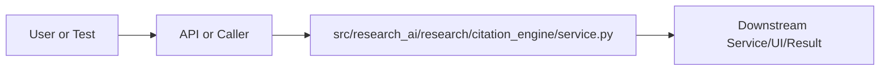

# service.py Explained

Generated educational companion for `src/research_ai/research/citation_engine/service.py`. This file is intentionally detailed so a developer can understand the code, architecture role, production tradeoffs, and ML/backend concepts behind the implementation.

## File Overview

`src/research_ai/research/citation_engine/service.py` is a Python module in the Research intelligence layer: paper ingestion, metadata, citations, and trends. It defines CitationEngine and no top-level functions.

## Why This File Exists

This file isolates one responsibility in the codebase: Research intelligence layer: paper ingestion, metadata, citations, and trends. Separation matters because AI systems are easier to test, scale, debug, and explain when retrieval, orchestration, ML services, memory, UI, and deployment scripts have clear boundaries.

## Workflow Position

**Layer:** Research intelligence layer: paper ingestion, metadata, citations, and trends.

**Previous step:** caller code, an API request, a browser event, a test fixture, an import, or a startup script prepares inputs.

**Current step:** `src/research_ai/research/citation_engine/service.py` performs its local responsibility.

**Next step:** downstream services, API responses, rendered UI, tests, or process execution consume the result.



## Inputs and Outputs

- **Inputs:** function arguments, class constructor dependencies, HTTP payloads, environment variables, filesystem artifacts, DOM events, or test fixtures.
- **Outputs:** return values, dictionaries, Pydantic models, rendered DOM state, API responses, logs, process startup, assertions, or side effects.
- **Serialization:** this project uses JSON for APIs/LLM planning, parquet/joblib/faiss for ML artifacts, and HTML/CSS/JS for the browser surface.

## Imports Explained

| Import | Explanation |
|---|---|
| `__future__` | Project or standard-library dependency used to import a service, type, helper, or runtime capability. Imports affect startup time, packaging, and test isolation. |
| `collections` | Project or standard-library dependency used to import a service, type, helper, or runtime capability. Imports affect startup time, packaging, and test isolation. |
| `logging` | logging provides structured operational visibility without using print statements. |
| `re` | re implements regular expressions for text extraction, validation, and secret redaction. |

## Global Variables and Config

| Name | Line | Why it matters |
|---|---:|---|
| `logger` | 15 | Module-level value, constant, prompt, cache, registry, or configuration point. Check mutability and startup cost. |

## Step-by-Step Workflow

1. Load dependencies and runtime constants.
2. Accept input from the previous layer.
3. Validate, transform, route, score, render, or execute according to this file's role.
4. Return a structured output or perform a controlled side effect.
5. Let caller layers handle presentation, persistence, retries, or fallback.

## Function-by-Function Breakdown

No top-level functions are defined. Behavior is class-based, declarative, or provided through package exports.

## Class-by-Class Breakdown

### `CitationEngine`

- **Line:** 18
- **Base classes:** `object`
- **Docstring:** Derives citation-like signals from paper metadata.

Exposes three main operations:
- ``proxy_citations``: for each paper, finds candidate papers that are
  likely to share a citation relationship based on metadata signals.
- ``co_citation_clusters``: groups papers into clusters by shared category
  and keyword overlap — a proxy for topic-based citation communities.
- ``influence_timeline``: orders papers by year to approximate intellectual
  lineage within a result set.

**Methods:**
- `__init__` at line 30: method behavior is described by its body and name
- `proxy_citations` at line 37: Find candidate related papers for each paper via metadata signals.
- `co_citation_clusters` at line 65: Group papers into topic clusters by shared metadata signals.
- `influence_timeline` at line 89: Order papers by year to approximate intellectual lineage.
- `_cache_papers` at line 124: method behavior is described by its body and name
- `_find_related` at line 130: method behavior is described by its body and name
- `_primary_category` at line 170: method behavior is described by its body and name
- `_keyword_tokens` at line 175: method behavior is described by its body and name
- `_shared_keywords` at line 183: method behavior is described by its body and name
- `_safe_year` at line 201: method behavior is described by its body and name

```python
class CitationEngine:
    """Derives citation-like signals from paper metadata.

    Exposes three main operations:
    - ``proxy_citations``: for each paper, finds candidate papers that are
      likely to share a citation relationship based on metadata signals.
    - ``co_citation_clusters``: groups papers into clusters by shared category
      and keyword overlap — a proxy for topic-based citation communities.
    - ``influence_timeline``: orders papers by year to approximate intellectual
      lineage within a result set.
    """

    def __init__(self) -> None:
        self._paper_cache: dict[str, dict] = {}

    # ------------------------------------------------------------------
    # Public API
    # ------------------------------------------------------------------

    def proxy_citations(
        self, papers: list[dict], candidate_pool: list[dict] | None = None
    ) -> dict:
        """Find candidate related papers for each paper via metadata signals."""
        pool = candidate_pool or papers
        self._cache_papers(pool)

        relations: list[dict] = []
        for paper in papers:
            pid = paper.get("paper_id", "")
            candidates = self._find_related(paper, pool, exclude_self=pid)
            relations.append({
                "paper_id": pid,
                "title": paper.get("title", "")[:120],
                "proxy_related": candidates[:5],
                "signals_used": ["category_overlap", "keyword_overlap", "temporal_proximity"],
            })

        return {
            "citation_graph_mode": "proxy_metadata",
            "paper_count": len(papers),
            "relations": relations,
            "note": (
                "Real citation edges unavailable. Signals derived from category, "
                "keyword, and temporal proximity."
            ),
        }

    def co_citation_clusters(self, papers: list[dict]) -> dict:
        """Group papers into topic clusters by shared metadata signals."""
        if not papers:
            return {"clusters": [], "paper_count": 0}

        category_map: dict[str, list[dict]] = defaultdict(list)
        for paper in papers:
            primary = self._primary_category(paper)
            category_map[primary].append(paper)

        clusters = []
        for category, members in sorted(category_map.items(), key=lambda item: -len(item[1])):
            clusters.append({
                "category": category,
                "size": len(members),
                "papers": [
                    {"paper_id": p.get("paper_id", ""), "title": p.get("title", "")[:80]}
                    for p in members[:8]
                ],
                "shared_keywords": self._shared_keywords(members),
            })

        return {"clusters": clusters, "paper_count": len(papers), "cluster_count": len(clusters)}

    def influence_timeline(self, papers: list[dict]) -> dict:
        """Order papers by year to approximate intellectual lineage."""
        dated = []
        undated = []
        for paper in papers:
            year_str = str(paper.get("year", "")).strip()
            try:
                year = int(year_str)
                dated.append((year, paper))
            except ValueError:
                undated.append(paper)

        sorted_papers = [
            {
                "year": year,
                "paper_id": p.get("paper_id", ""),
                "title": p.get("title", "")[:100],
                "category": p.get("category", ""),
            }
            for year, p in sorted(dated)
        ]
        return {
            "timeline": sorted_papers,
            "undated_count": len(undated),
            "year_range": (
                f"{sorted_papers[0]['year']}–{sorted_papers[-1]['year']}"
                if len(sorted_papers) >= 2
                else str(sorted_papers[0]["year"]) if sorted_papers else "unknown"
            ),
        }
```

This class packages state and behavior behind a service-style interface. Constructor dependencies show what the class needs; public methods show what the rest of the system can ask it to do. In production, this boundary is where caching, model loading, artifact access, and error handling must be controlled.


## Method-by-Method Deep Dive

### Class `CitationEngine` Methods

#### `CitationEngine.__init__`

- **Line:** 30
- **Kind:** synchronous method
- **Arguments:** self
- **Docstring:** No explicit docstring; behavior is inferred from the implementation and call sites.

```python
    def __init__(self) -> None:
        self._paper_cache: dict[str, dict] = {}
```

This method is part of the class contract. Its inputs show what state or caller data it consumes; its body shows whether it performs pure transformation, model/artifact access, retrieval, I/O, caching, validation, or orchestration. In production review, pay attention to error handling, mutation of `self`, repeated expensive work, and whether return shapes stay stable for downstream callers.

#### `CitationEngine.proxy_citations`

- **Line:** 37
- **Kind:** synchronous method
- **Arguments:** self, papers, candidate_pool
- **Docstring:** Find candidate related papers for each paper via metadata signals.

```python
    def proxy_citations(
        self, papers: list[dict], candidate_pool: list[dict] | None = None
    ) -> dict:
        """Find candidate related papers for each paper via metadata signals."""
        pool = candidate_pool or papers
        self._cache_papers(pool)

        relations: list[dict] = []
        for paper in papers:
            pid = paper.get("paper_id", "")
            candidates = self._find_related(paper, pool, exclude_self=pid)
            relations.append({
                "paper_id": pid,
                "title": paper.get("title", "")[:120],
                "proxy_related": candidates[:5],
                "signals_used": ["category_overlap", "keyword_overlap", "temporal_proximity"],
            })

        return {
            "citation_graph_mode": "proxy_metadata",
            "paper_count": len(papers),
            "relations": relations,
            "note": (
                "Real citation edges unavailable. Signals derived from category, "
                "keyword, and temporal proximity."
            ),
        }
```

This method is part of the class contract. Its inputs show what state or caller data it consumes; its body shows whether it performs pure transformation, model/artifact access, retrieval, I/O, caching, validation, or orchestration. In production review, pay attention to error handling, mutation of `self`, repeated expensive work, and whether return shapes stay stable for downstream callers.

#### `CitationEngine.co_citation_clusters`

- **Line:** 65
- **Kind:** synchronous method
- **Arguments:** self, papers
- **Docstring:** Group papers into topic clusters by shared metadata signals.

```python
    def co_citation_clusters(self, papers: list[dict]) -> dict:
        """Group papers into topic clusters by shared metadata signals."""
        if not papers:
            return {"clusters": [], "paper_count": 0}

        category_map: dict[str, list[dict]] = defaultdict(list)
        for paper in papers:
            primary = self._primary_category(paper)
            category_map[primary].append(paper)

        clusters = []
        for category, members in sorted(category_map.items(), key=lambda item: -len(item[1])):
            clusters.append({
                "category": category,
                "size": len(members),
                "papers": [
                    {"paper_id": p.get("paper_id", ""), "title": p.get("title", "")[:80]}
                    for p in members[:8]
                ],
                "shared_keywords": self._shared_keywords(members),
            })

        return {"clusters": clusters, "paper_count": len(papers), "cluster_count": len(clusters)}
```

This method is part of the class contract. Its inputs show what state or caller data it consumes; its body shows whether it performs pure transformation, model/artifact access, retrieval, I/O, caching, validation, or orchestration. In production review, pay attention to error handling, mutation of `self`, repeated expensive work, and whether return shapes stay stable for downstream callers.

#### `CitationEngine.influence_timeline`

- **Line:** 89
- **Kind:** synchronous method
- **Arguments:** self, papers
- **Docstring:** Order papers by year to approximate intellectual lineage.

```python
    def influence_timeline(self, papers: list[dict]) -> dict:
        """Order papers by year to approximate intellectual lineage."""
        dated = []
        undated = []
        for paper in papers:
            year_str = str(paper.get("year", "")).strip()
            try:
                year = int(year_str)
                dated.append((year, paper))
            except ValueError:
                undated.append(paper)

        sorted_papers = [
            {
                "year": year,
                "paper_id": p.get("paper_id", ""),
                "title": p.get("title", "")[:100],
                "category": p.get("category", ""),
            }
            for year, p in sorted(dated)
        ]
        return {
            "timeline": sorted_papers,
            "undated_count": len(undated),
            "year_range": (
                f"{sorted_papers[0]['year']}–{sorted_papers[-1]['year']}"
                if len(sorted_papers) >= 2
                else str(sorted_papers[0]["year"]) if sorted_papers else "unknown"
            ),
        }
```

This method is part of the class contract. Its inputs show what state or caller data it consumes; its body shows whether it performs pure transformation, model/artifact access, retrieval, I/O, caching, validation, or orchestration. In production review, pay attention to error handling, mutation of `self`, repeated expensive work, and whether return shapes stay stable for downstream callers.

#### `CitationEngine._cache_papers`

- **Line:** 124
- **Kind:** synchronous method
- **Arguments:** self, papers
- **Docstring:** No explicit docstring; behavior is inferred from the implementation and call sites.

```python
    def _cache_papers(self, papers: list[dict]) -> None:
        for paper in papers:
            pid = paper.get("paper_id", "")
            if pid:
                self._paper_cache[pid] = paper
```

This method is part of the class contract. Its inputs show what state or caller data it consumes; its body shows whether it performs pure transformation, model/artifact access, retrieval, I/O, caching, validation, or orchestration. In production review, pay attention to error handling, mutation of `self`, repeated expensive work, and whether return shapes stay stable for downstream callers.

#### `CitationEngine._find_related`

- **Line:** 130
- **Kind:** synchronous method
- **Arguments:** self, paper, pool, exclude_self
- **Docstring:** No explicit docstring; behavior is inferred from the implementation and call sites.

```python
    def _find_related(
        self, paper: dict, pool: list[dict], exclude_self: str
    ) -> list[dict]:
        paper_cats = set(str(paper.get("category", "")).lower().split())
        paper_tokens = self._keyword_tokens(paper)
        paper_year = self._safe_year(paper)

        scored: list[tuple[float, dict]] = []
        for candidate in pool:
            cid = candidate.get("paper_id", "")
            if cid == exclude_self:
                continue
            score = 0.0
            # Category overlap
            cand_cats = set(str(candidate.get("category", "")).lower().split())
            cat_overlap = len(paper_cats & cand_cats) / max(1, len(paper_cats | cand_cats))
            score += cat_overlap * 0.5
            # Keyword overlap
            cand_tokens = self._keyword_tokens(candidate)
            kw_overlap = len(paper_tokens & cand_tokens) / max(1, len(paper_tokens | cand_tokens))
            score += kw_overlap * 0.4
            # Temporal proximity (closer in time → higher score)
            cand_year = self._safe_year(candidate)
            if paper_year and cand_year:
                distance = abs(paper_year - cand_year)
                score += max(0.0, 0.1 - distance * 0.01)

            if score > 0.05:
                scored.append((score, candidate))

        return [
            {
                "paper_id": c.get("paper_id", ""),
                "title": c.get("title", "")[:100],
                "score": round(s, 4),
            }
            for s, c in sorted(scored, key=lambda item: -item[0])
        ]
```

This method is part of the class contract. Its inputs show what state or caller data it consumes; its body shows whether it performs pure transformation, model/artifact access, retrieval, I/O, caching, validation, or orchestration. In production review, pay attention to error handling, mutation of `self`, repeated expensive work, and whether return shapes stay stable for downstream callers.

#### `CitationEngine._primary_category`

- **Line:** 170
- **Kind:** synchronous method
- **Arguments:** paper
- **Docstring:** No explicit docstring; behavior is inferred from the implementation and call sites.

```python
    def _primary_category(paper: dict) -> str:
        cats = str(paper.get("category", "unknown")).split()
        return cats[0] if cats else "unknown"
```

This method is part of the class contract. Its inputs show what state or caller data it consumes; its body shows whether it performs pure transformation, model/artifact access, retrieval, I/O, caching, validation, or orchestration. In production review, pay attention to error handling, mutation of `self`, repeated expensive work, and whether return shapes stay stable for downstream callers.

#### `CitationEngine._keyword_tokens`

- **Line:** 175
- **Kind:** synchronous method
- **Arguments:** paper
- **Docstring:** No explicit docstring; behavior is inferred from the implementation and call sites.

```python
    def _keyword_tokens(paper: dict) -> set[str]:
        text = f"{paper.get('title', '')} {paper.get('abstract', '')}".lower()
        tokens = re.findall(r"\b[a-z]{4,}\b", text)
        stopwords = {"that", "with", "this", "from", "have", "using", "also", "been", "their",
                     "which", "they", "paper", "show", "results", "method", "approach", "model"}
        return {t for t in tokens if t not in stopwords}
```

This method is part of the class contract. Its inputs show what state or caller data it consumes; its body shows whether it performs pure transformation, model/artifact access, retrieval, I/O, caching, validation, or orchestration. In production review, pay attention to error handling, mutation of `self`, repeated expensive work, and whether return shapes stay stable for downstream callers.

#### `CitationEngine._shared_keywords`

- **Line:** 183
- **Kind:** synchronous method
- **Arguments:** papers
- **Docstring:** No explicit docstring; behavior is inferred from the implementation and call sites.

```python
    def _shared_keywords(papers: list[dict]) -> list[str]:
        if not papers:
            return []
        stopwords = {"that", "with", "this", "from", "have", "using", "also", "been",
                     "paper", "show", "results", "method", "approach", "model", "propose"}
        token_counts: dict[str, int] = defaultdict(int)
        for paper in papers:
            text = f"{paper.get('title', '')} {paper.get('abstract', '')}".lower()
            for token in set(re.findall(r"\b[a-z]{5,}\b", text)):
                if token not in stopwords:
                    token_counts[token] += 1
        threshold = max(1, len(papers) // 2)
        return sorted(
            [token for token, count in token_counts.items() if count >= threshold],
            key=lambda t: -token_counts[t],
        )[:8]
```

This method is part of the class contract. Its inputs show what state or caller data it consumes; its body shows whether it performs pure transformation, model/artifact access, retrieval, I/O, caching, validation, or orchestration. In production review, pay attention to error handling, mutation of `self`, repeated expensive work, and whether return shapes stay stable for downstream callers.

#### `CitationEngine._safe_year`

- **Line:** 201
- **Kind:** synchronous method
- **Arguments:** paper
- **Docstring:** No explicit docstring; behavior is inferred from the implementation and call sites.

```python
    def _safe_year(paper: dict) -> int | None:
        try:
            return int(str(paper.get("year", "")).strip())
        except ValueError:
            return None
```

This method is part of the class contract. Its inputs show what state or caller data it consumes; its body shows whether it performs pure transformation, model/artifact access, retrieval, I/O, caching, validation, or orchestration. In production review, pay attention to error handling, mutation of `self`, repeated expensive work, and whether return shapes stay stable for downstream callers.

## Important Algorithms Used

- **Hybrid Retrieval**: Hybrid retrieval combines semantic vectors with lexical/keyword evidence, improving scientific search where exact terms matter.
- **Caching**: Caching avoids repeating expensive work such as model loading, embedding generation, or client initialization.
- **Sandboxing**: Sandboxing validates and constrains user code before execution, reducing security and stability risk.

## Libraries Used

| Import | Explanation |
|---|---|
| `__future__` | Project or standard-library dependency used to import a service, type, helper, or runtime capability. Imports affect startup time, packaging, and test isolation. |
| `collections` | Project or standard-library dependency used to import a service, type, helper, or runtime capability. Imports affect startup time, packaging, and test isolation. |
| `logging` | logging provides structured operational visibility without using print statements. |
| `re` | re implements regular expressions for text extraction, validation, and secret redaction. |

## ML Concepts Used

- **Hybrid Retrieval**: Hybrid retrieval combines semantic vectors with lexical/keyword evidence, improving scientific search where exact terms matter.
- **Caching**: Caching avoids repeating expensive work such as model loading, embedding generation, or client initialization.
- **Sandboxing**: Sandboxing validates and constrains user code before execution, reducing security and stability risk.

## Performance and Memory Notes

- Avoid eager loading of heavy ML models unless startup latency is acceptable.
- Cache expensive clients, tokenizers, vector stores, and embeddings carefully.
- Use float32 for embedding vectors because it halves memory compared with float64 and matches FAISS/neural inference expectations.
- Bound prompt length, uploaded content, result counts, and token budgets to control latency and memory.
- Watch copies of large metadata frames, embedding matrices, and file buffers.

## Scalability Notes

- In-memory state works for local demos but needs Redis/database/object storage for multi-worker cloud deployment.
- CPU/GPU inference should often be separated from the web API when traffic grows.
- Retrieval can start exact and move to approximate indexes as corpus size grows.
- Batch operations and cache repeated work to improve throughput.
- Add metrics for latency, errors, fallback frequency, retrieval hit rate, and token usage.

## Production Engineering Notes

- Keep interfaces stable because other files may import this module or depend on its response shape.
- Prefer typed/structured data over free-form strings at service boundaries.
- Log operational context without secrets or huge payloads.
- Make fallback behavior explicit so users get useful output even when LLMs or artifacts fail.
- Keep provider-specific logic behind adapters so Groq/OpenRouter/Google/Ollama can be swapped.

## Common Bugs and Failure Cases

- Missing `.env` values, model artifacts, or Ollama models can trigger degraded behavior.
- Type mismatches occur when LLM-generated tool arguments cross into strict Python code.
- Empty retrieval results must not become hallucinated answers.
- Network calls need timeouts and careful retry behavior.
- Frontend IDs/classes and API schemas are contracts; changing one side without the other breaks workflows.

## Security Considerations

- Handles credentials or environment configuration. Keep secrets in environment variables and redact them from logs.

## Real Industry Usage

- This pattern appears in enterprise RAG assistants, scientific search tools, internal research copilots, and ML platform demos.
- The layered design mirrors production systems: API facade, orchestration, retrieval, evaluation, synthesis, UI, and deployment.
- Clear separation lets teams replace model providers, improve retrieval, harden security, or redesign UI independently.

## Optimization Opportunities

- Add tracing around each workflow step.
- Strengthen schema validation at boundaries.
- Persist conversation/session state outside process memory.
- Add load tests and adversarial tests for prompt injection, empty evidence, and large uploads.
- Consider approximate vector indexes, reranker models, or batching when corpus/traffic grows.

## How This Connects To Other Files

- `src/research_ai/research/citation_engine/service.py` is connected through imports, startup scripts, API routes, frontend selectors, tests, or artifact paths.
- `src/research_ai/platform.py` is the backend composition root.
- `src/research_ai/api/main.py` exposes backend behavior over HTTP.
- Retrieval modules depend on artifacts under `artifacts/`.
- Frontend files depend on stable endpoint and DOM contracts.

## End-to-End Flow Summary

- A user/browser/test/startup event enters the system.
- The relevant layer validates or normalizes input.
- Retrieval, ML, orchestration, execution, or UI rendering happens.
- A structured result, visual state, or process side effect is produced.
- Fallbacks and tests keep behavior understandable when dependencies are unavailable.

## Interview Questions

1. What responsibility does this file own?
2. What inputs and outputs define its contract?
3. Which dependencies are expensive or operationally risky?
4. What breaks if this file changes shape?
5. How would you scale or test this behavior in production?

## Key Takeaways

- `src/research_ai/research/citation_engine/service.py` should be understood as part of a layered AI research platform.
- Trace data flow from inputs to transformations to outputs.
- Production readiness comes from explicit contracts, bounded resources, observability, secure defaults, and graceful fallback.

## Fully Commented Source

This section repeats the original source with an explanatory comment before every line. The comments are educational only; they are not inserted into the production source file.

```python
# L0001: Starts, ends, or continues a docstring that documents module, class, or function intent.
"""Citation intelligence engine derived from arXiv metadata.
# L0002: Blank line that visually separates logical sections and improves readability.

# L0003: Executes Python logic as part of this file's workflow; read surrounding lines for data flow and side effects.
Real citation graph edges are not present in the standard arXiv metadata dump,
# L0004: Executes Python logic as part of this file's workflow; read surrounding lines for data flow and side effects.
so this engine derives proxy citation signals from category co-occurrence,
# L0005: Executes Python logic as part of this file's workflow; read surrounding lines for data flow and side effects.
temporal proximity, title/abstract keyword overlap, and shared author tokens.
# L0006: Executes Python logic as part of this file's workflow; read surrounding lines for data flow and side effects.
The interface is designed so that a future graph with actual citation edges
# L0007: Executes Python logic as part of this file's workflow; read surrounding lines for data flow and side effects.
(e.g. Semantic Scholar) can be swapped in without touching the orchestrator.
# L0008: Starts, ends, or continues a docstring that documents module, class, or function intent.
"""
# L0009: Enables future Python behavior so annotations/import semantics stay modern and predictable.
from __future__ import annotations
# L0010: Blank line that visually separates logical sections and improves readability.

# L0011: Imports a dependency, type, or project module needed by later code in this file.
import logging
# L0012: Imports a dependency, type, or project module needed by later code in this file.
import re
# L0013: Imports a dependency, type, or project module needed by later code in this file.
from collections import defaultdict
# L0014: Blank line that visually separates logical sections and improves readability.

# L0015: Assigns or updates a value used later in the workflow; check mutability and data shape.
logger = logging.getLogger(__name__)
# L0016: Blank line that visually separates logical sections and improves readability.

# L0017: Blank line that visually separates logical sections and improves readability.

# L0018: Defines a class that groups related state and behavior behind a reusable interface.
class CitationEngine:
# L0019: Starts, ends, or continues a docstring that documents module, class, or function intent.
    """Derives citation-like signals from paper metadata.
# L0020: Blank line that visually separates logical sections and improves readability.

# L0021: Executes Python logic as part of this file's workflow; read surrounding lines for data flow and side effects.
    Exposes three main operations:
# L0022: Executes Python logic as part of this file's workflow; read surrounding lines for data flow and side effects.
    - ``proxy_citations``: for each paper, finds candidate papers that are
# L0023: Executes Python logic as part of this file's workflow; read surrounding lines for data flow and side effects.
      likely to share a citation relationship based on metadata signals.
# L0024: Executes Python logic as part of this file's workflow; read surrounding lines for data flow and side effects.
    - ``co_citation_clusters``: groups papers into clusters by shared category
# L0025: Executes Python logic as part of this file's workflow; read surrounding lines for data flow and side effects.
      and keyword overlap — a proxy for topic-based citation communities.
# L0026: Executes Python logic as part of this file's workflow; read surrounding lines for data flow and side effects.
    - ``influence_timeline``: orders papers by year to approximate intellectual
# L0027: Executes Python logic as part of this file's workflow; read surrounding lines for data flow and side effects.
      lineage within a result set.
# L0028: Starts, ends, or continues a docstring that documents module, class, or function intent.
    """
# L0029: Blank line that visually separates logical sections and improves readability.

# L0030: Defines a function or method; parameters are the input contract and the body implements the workflow.
    def __init__(self) -> None:
# L0031: Assigns or updates a value used later in the workflow; check mutability and data shape.
        self._paper_cache: dict[str, dict] = {}
# L0032: Blank line that visually separates logical sections and improves readability.

# L0033: Developer comment explaining intent, caveat, section boundary, or operational reasoning.
    # ------------------------------------------------------------------
# L0034: Developer comment explaining intent, caveat, section boundary, or operational reasoning.
    # Public API
# L0035: Developer comment explaining intent, caveat, section boundary, or operational reasoning.
    # ------------------------------------------------------------------
# L0036: Blank line that visually separates logical sections and improves readability.

# L0037: Defines a function or method; parameters are the input contract and the body implements the workflow.
    def proxy_citations(
# L0038: Assigns or updates a value used later in the workflow; check mutability and data shape.
        self, papers: list[dict], candidate_pool: list[dict] | None = None
# L0039: Executes Python logic as part of this file's workflow; read surrounding lines for data flow and side effects.
    ) -> dict:
# L0040: Starts, ends, or continues a docstring that documents module, class, or function intent.
        """Find candidate related papers for each paper via metadata signals."""
# L0041: Assigns or updates a value used later in the workflow; check mutability and data shape.
        pool = candidate_pool or papers
# L0042: Executes Python logic as part of this file's workflow; read surrounding lines for data flow and side effects.
        self._cache_papers(pool)
# L0043: Blank line that visually separates logical sections and improves readability.

# L0044: Assigns or updates a value used later in the workflow; check mutability and data shape.
        relations: list[dict] = []
# L0045: Iterates over data, retry attempts, files, results, or workflow steps.
        for paper in papers:
# L0046: Assigns or updates a value used later in the workflow; check mutability and data shape.
            pid = paper.get("paper_id", "")
# L0047: Assigns or updates a value used later in the workflow; check mutability and data shape.
            candidates = self._find_related(paper, pool, exclude_self=pid)
# L0048: Executes Python logic as part of this file's workflow; read surrounding lines for data flow and side effects.
            relations.append({
# L0049: Executes Python logic as part of this file's workflow; read surrounding lines for data flow and side effects.
                "paper_id": pid,
# L0050: Executes Python logic as part of this file's workflow; read surrounding lines for data flow and side effects.
                "title": paper.get("title", "")[:120],
# L0051: Executes Python logic as part of this file's workflow; read surrounding lines for data flow and side effects.
                "proxy_related": candidates[:5],
# L0052: Executes Python logic as part of this file's workflow; read surrounding lines for data flow and side effects.
                "signals_used": ["category_overlap", "keyword_overlap", "temporal_proximity"],
# L0053: Executes Python logic as part of this file's workflow; read surrounding lines for data flow and side effects.
            })
# L0054: Blank line that visually separates logical sections and improves readability.

# L0055: Returns the computed result to the caller; this shape becomes part of the downstream contract.
        return {
# L0056: Executes Python logic as part of this file's workflow; read surrounding lines for data flow and side effects.
            "citation_graph_mode": "proxy_metadata",
# L0057: Executes Python logic as part of this file's workflow; read surrounding lines for data flow and side effects.
            "paper_count": len(papers),
# L0058: Executes Python logic as part of this file's workflow; read surrounding lines for data flow and side effects.
            "relations": relations,
# L0059: Executes Python logic as part of this file's workflow; read surrounding lines for data flow and side effects.
            "note": (
# L0060: Executes Python logic as part of this file's workflow; read surrounding lines for data flow and side effects.
                "Real citation edges unavailable. Signals derived from category, "
# L0061: Executes Python logic as part of this file's workflow; read surrounding lines for data flow and side effects.
                "keyword, and temporal proximity."
# L0062: Executes Python logic as part of this file's workflow; read surrounding lines for data flow and side effects.
            ),
# L0063: Executes Python logic as part of this file's workflow; read surrounding lines for data flow and side effects.
        }
# L0064: Blank line that visually separates logical sections and improves readability.

# L0065: Defines a function or method; parameters are the input contract and the body implements the workflow.
    def co_citation_clusters(self, papers: list[dict]) -> dict:
# L0066: Starts, ends, or continues a docstring that documents module, class, or function intent.
        """Group papers into topic clusters by shared metadata signals."""
# L0067: Branches execution based on a condition, usually for validation, fallback, or mode-specific behavior.
        if not papers:
# L0068: Returns the computed result to the caller; this shape becomes part of the downstream contract.
            return {"clusters": [], "paper_count": 0}
# L0069: Blank line that visually separates logical sections and improves readability.

# L0070: Assigns or updates a value used later in the workflow; check mutability and data shape.
        category_map: dict[str, list[dict]] = defaultdict(list)
# L0071: Iterates over data, retry attempts, files, results, or workflow steps.
        for paper in papers:
# L0072: Assigns or updates a value used later in the workflow; check mutability and data shape.
            primary = self._primary_category(paper)
# L0073: Executes Python logic as part of this file's workflow; read surrounding lines for data flow and side effects.
            category_map[primary].append(paper)
# L0074: Blank line that visually separates logical sections and improves readability.

# L0075: Assigns or updates a value used later in the workflow; check mutability and data shape.
        clusters = []
# L0076: Iterates over data, retry attempts, files, results, or workflow steps.
        for category, members in sorted(category_map.items(), key=lambda item: -len(item[1])):
# L0077: Executes Python logic as part of this file's workflow; read surrounding lines for data flow and side effects.
            clusters.append({
# L0078: Executes Python logic as part of this file's workflow; read surrounding lines for data flow and side effects.
                "category": category,
# L0079: Executes Python logic as part of this file's workflow; read surrounding lines for data flow and side effects.
                "size": len(members),
# L0080: Executes Python logic as part of this file's workflow; read surrounding lines for data flow and side effects.
                "papers": [
# L0081: Executes Python logic as part of this file's workflow; read surrounding lines for data flow and side effects.
                    {"paper_id": p.get("paper_id", ""), "title": p.get("title", "")[:80]}
# L0082: Iterates over data, retry attempts, files, results, or workflow steps.
                    for p in members[:8]
# L0083: Executes Python logic as part of this file's workflow; read surrounding lines for data flow and side effects.
                ],
# L0084: Executes Python logic as part of this file's workflow; read surrounding lines for data flow and side effects.
                "shared_keywords": self._shared_keywords(members),
# L0085: Executes Python logic as part of this file's workflow; read surrounding lines for data flow and side effects.
            })
# L0086: Blank line that visually separates logical sections and improves readability.

# L0087: Returns the computed result to the caller; this shape becomes part of the downstream contract.
        return {"clusters": clusters, "paper_count": len(papers), "cluster_count": len(clusters)}
# L0088: Blank line that visually separates logical sections and improves readability.

# L0089: Defines a function or method; parameters are the input contract and the body implements the workflow.
    def influence_timeline(self, papers: list[dict]) -> dict:
# L0090: Starts, ends, or continues a docstring that documents module, class, or function intent.
        """Order papers by year to approximate intellectual lineage."""
# L0091: Assigns or updates a value used later in the workflow; check mutability and data shape.
        dated = []
# L0092: Assigns or updates a value used later in the workflow; check mutability and data shape.
        undated = []
# L0093: Iterates over data, retry attempts, files, results, or workflow steps.
        for paper in papers:
# L0094: Assigns or updates a value used later in the workflow; check mutability and data shape.
            year_str = str(paper.get("year", "")).strip()
# L0095: Begins protected execution so failures can be handled without crashing the whole request path.
            try:
# L0096: Assigns or updates a value used later in the workflow; check mutability and data shape.
                year = int(year_str)
# L0097: Executes Python logic as part of this file's workflow; read surrounding lines for data flow and side effects.
                dated.append((year, paper))
# L0098: Handles an expected failure path, often converting exceptions into fallback behavior or API errors.
            except ValueError:
# L0099: Executes Python logic as part of this file's workflow; read surrounding lines for data flow and side effects.
                undated.append(paper)
# L0100: Blank line that visually separates logical sections and improves readability.

# L0101: Assigns or updates a value used later in the workflow; check mutability and data shape.
        sorted_papers = [
# L0102: Executes Python logic as part of this file's workflow; read surrounding lines for data flow and side effects.
            {
# L0103: Executes Python logic as part of this file's workflow; read surrounding lines for data flow and side effects.
                "year": year,
# L0104: Executes Python logic as part of this file's workflow; read surrounding lines for data flow and side effects.
                "paper_id": p.get("paper_id", ""),
# L0105: Executes Python logic as part of this file's workflow; read surrounding lines for data flow and side effects.
                "title": p.get("title", "")[:100],
# L0106: Executes Python logic as part of this file's workflow; read surrounding lines for data flow and side effects.
                "category": p.get("category", ""),
# L0107: Executes Python logic as part of this file's workflow; read surrounding lines for data flow and side effects.
            }
# L0108: Iterates over data, retry attempts, files, results, or workflow steps.
            for year, p in sorted(dated)
# L0109: Executes Python logic as part of this file's workflow; read surrounding lines for data flow and side effects.
        ]
# L0110: Returns the computed result to the caller; this shape becomes part of the downstream contract.
        return {
# L0111: Executes Python logic as part of this file's workflow; read surrounding lines for data flow and side effects.
            "timeline": sorted_papers,
# L0112: Executes Python logic as part of this file's workflow; read surrounding lines for data flow and side effects.
            "undated_count": len(undated),
# L0113: Executes Python logic as part of this file's workflow; read surrounding lines for data flow and side effects.
            "year_range": (
# L0114: Executes Python logic as part of this file's workflow; read surrounding lines for data flow and side effects.
                f"{sorted_papers[0]['year']}–{sorted_papers[-1]['year']}"
# L0115: Branches execution based on a condition, usually for validation, fallback, or mode-specific behavior.
                if len(sorted_papers) >= 2
# L0116: Continues conditional control flow for alternate cases or default fallback behavior.
                else str(sorted_papers[0]["year"]) if sorted_papers else "unknown"
# L0117: Executes Python logic as part of this file's workflow; read surrounding lines for data flow and side effects.
            ),
# L0118: Executes Python logic as part of this file's workflow; read surrounding lines for data flow and side effects.
        }
# L0119: Blank line that visually separates logical sections and improves readability.

# L0120: Developer comment explaining intent, caveat, section boundary, or operational reasoning.
    # ------------------------------------------------------------------
# L0121: Developer comment explaining intent, caveat, section boundary, or operational reasoning.
    # Private helpers
# L0122: Developer comment explaining intent, caveat, section boundary, or operational reasoning.
    # ------------------------------------------------------------------
# L0123: Blank line that visually separates logical sections and improves readability.

# L0124: Defines a function or method; parameters are the input contract and the body implements the workflow.
    def _cache_papers(self, papers: list[dict]) -> None:
# L0125: Iterates over data, retry attempts, files, results, or workflow steps.
        for paper in papers:
# L0126: Assigns or updates a value used later in the workflow; check mutability and data shape.
            pid = paper.get("paper_id", "")
# L0127: Branches execution based on a condition, usually for validation, fallback, or mode-specific behavior.
            if pid:
# L0128: Assigns or updates a value used later in the workflow; check mutability and data shape.
                self._paper_cache[pid] = paper
# L0129: Blank line that visually separates logical sections and improves readability.

# L0130: Defines a function or method; parameters are the input contract and the body implements the workflow.
    def _find_related(
# L0131: Executes Python logic as part of this file's workflow; read surrounding lines for data flow and side effects.
        self, paper: dict, pool: list[dict], exclude_self: str
# L0132: Executes Python logic as part of this file's workflow; read surrounding lines for data flow and side effects.
    ) -> list[dict]:
# L0133: Assigns or updates a value used later in the workflow; check mutability and data shape.
        paper_cats = set(str(paper.get("category", "")).lower().split())
# L0134: Assigns or updates a value used later in the workflow; check mutability and data shape.
        paper_tokens = self._keyword_tokens(paper)
# L0135: Assigns or updates a value used later in the workflow; check mutability and data shape.
        paper_year = self._safe_year(paper)
# L0136: Blank line that visually separates logical sections and improves readability.

# L0137: Assigns or updates a value used later in the workflow; check mutability and data shape.
        scored: list[tuple[float, dict]] = []
# L0138: Iterates over data, retry attempts, files, results, or workflow steps.
        for candidate in pool:
# L0139: Assigns or updates a value used later in the workflow; check mutability and data shape.
            cid = candidate.get("paper_id", "")
# L0140: Branches execution based on a condition, usually for validation, fallback, or mode-specific behavior.
            if cid == exclude_self:
# L0141: Executes Python logic as part of this file's workflow; read surrounding lines for data flow and side effects.
                continue
# L0142: Assigns or updates a value used later in the workflow; check mutability and data shape.
            score = 0.0
# L0143: Developer comment explaining intent, caveat, section boundary, or operational reasoning.
            # Category overlap
# L0144: Assigns or updates a value used later in the workflow; check mutability and data shape.
            cand_cats = set(str(candidate.get("category", "")).lower().split())
# L0145: Assigns or updates a value used later in the workflow; check mutability and data shape.
            cat_overlap = len(paper_cats & cand_cats) / max(1, len(paper_cats | cand_cats))
# L0146: Assigns or updates a value used later in the workflow; check mutability and data shape.
            score += cat_overlap * 0.5
# L0147: Developer comment explaining intent, caveat, section boundary, or operational reasoning.
            # Keyword overlap
# L0148: Assigns or updates a value used later in the workflow; check mutability and data shape.
            cand_tokens = self._keyword_tokens(candidate)
# L0149: Assigns or updates a value used later in the workflow; check mutability and data shape.
            kw_overlap = len(paper_tokens & cand_tokens) / max(1, len(paper_tokens | cand_tokens))
# L0150: Assigns or updates a value used later in the workflow; check mutability and data shape.
            score += kw_overlap * 0.4
# L0151: Developer comment explaining intent, caveat, section boundary, or operational reasoning.
            # Temporal proximity (closer in time → higher score)
# L0152: Assigns or updates a value used later in the workflow; check mutability and data shape.
            cand_year = self._safe_year(candidate)
# L0153: Branches execution based on a condition, usually for validation, fallback, or mode-specific behavior.
            if paper_year and cand_year:
# L0154: Assigns or updates a value used later in the workflow; check mutability and data shape.
                distance = abs(paper_year - cand_year)
# L0155: Assigns or updates a value used later in the workflow; check mutability and data shape.
                score += max(0.0, 0.1 - distance * 0.01)
# L0156: Blank line that visually separates logical sections and improves readability.

# L0157: Branches execution based on a condition, usually for validation, fallback, or mode-specific behavior.
            if score > 0.05:
# L0158: Executes Python logic as part of this file's workflow; read surrounding lines for data flow and side effects.
                scored.append((score, candidate))
# L0159: Blank line that visually separates logical sections and improves readability.

# L0160: Returns the computed result to the caller; this shape becomes part of the downstream contract.
        return [
# L0161: Executes Python logic as part of this file's workflow; read surrounding lines for data flow and side effects.
            {
# L0162: Executes Python logic as part of this file's workflow; read surrounding lines for data flow and side effects.
                "paper_id": c.get("paper_id", ""),
# L0163: Executes Python logic as part of this file's workflow; read surrounding lines for data flow and side effects.
                "title": c.get("title", "")[:100],
# L0164: Executes Python logic as part of this file's workflow; read surrounding lines for data flow and side effects.
                "score": round(s, 4),
# L0165: Executes Python logic as part of this file's workflow; read surrounding lines for data flow and side effects.
            }
# L0166: Iterates over data, retry attempts, files, results, or workflow steps.
            for s, c in sorted(scored, key=lambda item: -item[0])
# L0167: Executes Python logic as part of this file's workflow; read surrounding lines for data flow and side effects.
        ]
# L0168: Blank line that visually separates logical sections and improves readability.

# L0169: Decorator that modifies the function/class below, commonly for routing, dataclasses, caching, or properties.
    @staticmethod
# L0170: Defines a function or method; parameters are the input contract and the body implements the workflow.
    def _primary_category(paper: dict) -> str:
# L0171: Assigns or updates a value used later in the workflow; check mutability and data shape.
        cats = str(paper.get("category", "unknown")).split()
# L0172: Returns the computed result to the caller; this shape becomes part of the downstream contract.
        return cats[0] if cats else "unknown"
# L0173: Blank line that visually separates logical sections and improves readability.

# L0174: Decorator that modifies the function/class below, commonly for routing, dataclasses, caching, or properties.
    @staticmethod
# L0175: Defines a function or method; parameters are the input contract and the body implements the workflow.
    def _keyword_tokens(paper: dict) -> set[str]:
# L0176: Assigns or updates a value used later in the workflow; check mutability and data shape.
        text = f"{paper.get('title', '')} {paper.get('abstract', '')}".lower()
# L0177: Assigns or updates a value used later in the workflow; check mutability and data shape.
        tokens = re.findall(r"\b[a-z]{4,}\b", text)
# L0178: Assigns or updates a value used later in the workflow; check mutability and data shape.
        stopwords = {"that", "with", "this", "from", "have", "using", "also", "been", "their",
# L0179: Executes Python logic as part of this file's workflow; read surrounding lines for data flow and side effects.
                     "which", "they", "paper", "show", "results", "method", "approach", "model"}
# L0180: Returns the computed result to the caller; this shape becomes part of the downstream contract.
        return {t for t in tokens if t not in stopwords}
# L0181: Blank line that visually separates logical sections and improves readability.

# L0182: Decorator that modifies the function/class below, commonly for routing, dataclasses, caching, or properties.
    @staticmethod
# L0183: Defines a function or method; parameters are the input contract and the body implements the workflow.
    def _shared_keywords(papers: list[dict]) -> list[str]:
# L0184: Branches execution based on a condition, usually for validation, fallback, or mode-specific behavior.
        if not papers:
# L0185: Returns the computed result to the caller; this shape becomes part of the downstream contract.
            return []
# L0186: Assigns or updates a value used later in the workflow; check mutability and data shape.
        stopwords = {"that", "with", "this", "from", "have", "using", "also", "been",
# L0187: Executes Python logic as part of this file's workflow; read surrounding lines for data flow and side effects.
                     "paper", "show", "results", "method", "approach", "model", "propose"}
# L0188: Assigns or updates a value used later in the workflow; check mutability and data shape.
        token_counts: dict[str, int] = defaultdict(int)
# L0189: Iterates over data, retry attempts, files, results, or workflow steps.
        for paper in papers:
# L0190: Assigns or updates a value used later in the workflow; check mutability and data shape.
            text = f"{paper.get('title', '')} {paper.get('abstract', '')}".lower()
# L0191: Iterates over data, retry attempts, files, results, or workflow steps.
            for token in set(re.findall(r"\b[a-z]{5,}\b", text)):
# L0192: Branches execution based on a condition, usually for validation, fallback, or mode-specific behavior.
                if token not in stopwords:
# L0193: Assigns or updates a value used later in the workflow; check mutability and data shape.
                    token_counts[token] += 1
# L0194: Assigns or updates a value used later in the workflow; check mutability and data shape.
        threshold = max(1, len(papers) // 2)
# L0195: Returns the computed result to the caller; this shape becomes part of the downstream contract.
        return sorted(
# L0196: Assigns or updates a value used later in the workflow; check mutability and data shape.
            [token for token, count in token_counts.items() if count >= threshold],
# L0197: Assigns or updates a value used later in the workflow; check mutability and data shape.
            key=lambda t: -token_counts[t],
# L0198: Executes Python logic as part of this file's workflow; read surrounding lines for data flow and side effects.
        )[:8]
# L0199: Blank line that visually separates logical sections and improves readability.

# L0200: Decorator that modifies the function/class below, commonly for routing, dataclasses, caching, or properties.
    @staticmethod
# L0201: Defines a function or method; parameters are the input contract and the body implements the workflow.
    def _safe_year(paper: dict) -> int | None:
# L0202: Begins protected execution so failures can be handled without crashing the whole request path.
        try:
# L0203: Returns the computed result to the caller; this shape becomes part of the downstream contract.
            return int(str(paper.get("year", "")).strip())
# L0204: Handles an expected failure path, often converting exceptions into fallback behavior or API errors.
        except ValueError:
# L0205: Returns the computed result to the caller; this shape becomes part of the downstream contract.
            return None
```

## Source Walkthrough

The complete source is included because the file is short enough to study directly.

```python
"""Citation intelligence engine derived from arXiv metadata.

Real citation graph edges are not present in the standard arXiv metadata dump,
so this engine derives proxy citation signals from category co-occurrence,
temporal proximity, title/abstract keyword overlap, and shared author tokens.
The interface is designed so that a future graph with actual citation edges
(e.g. Semantic Scholar) can be swapped in without touching the orchestrator.
"""
from __future__ import annotations

import logging
import re
from collections import defaultdict

logger = logging.getLogger(__name__)


class CitationEngine:
    """Derives citation-like signals from paper metadata.

    Exposes three main operations:
    - ``proxy_citations``: for each paper, finds candidate papers that are
      likely to share a citation relationship based on metadata signals.
    - ``co_citation_clusters``: groups papers into clusters by shared category
      and keyword overlap — a proxy for topic-based citation communities.
    - ``influence_timeline``: orders papers by year to approximate intellectual
      lineage within a result set.
    """

    def __init__(self) -> None:
        self._paper_cache: dict[str, dict] = {}

    # ------------------------------------------------------------------
    # Public API
    # ------------------------------------------------------------------

    def proxy_citations(
        self, papers: list[dict], candidate_pool: list[dict] | None = None
    ) -> dict:
        """Find candidate related papers for each paper via metadata signals."""
        pool = candidate_pool or papers
        self._cache_papers(pool)

        relations: list[dict] = []
        for paper in papers:
            pid = paper.get("paper_id", "")
            candidates = self._find_related(paper, pool, exclude_self=pid)
            relations.append({
                "paper_id": pid,
                "title": paper.get("title", "")[:120],
                "proxy_related": candidates[:5],
                "signals_used": ["category_overlap", "keyword_overlap", "temporal_proximity"],
            })

        return {
            "citation_graph_mode": "proxy_metadata",
            "paper_count": len(papers),
            "relations": relations,
            "note": (
                "Real citation edges unavailable. Signals derived from category, "
                "keyword, and temporal proximity."
            ),
        }

    def co_citation_clusters(self, papers: list[dict]) -> dict:
        """Group papers into topic clusters by shared metadata signals."""
        if not papers:
            return {"clusters": [], "paper_count": 0}

        category_map: dict[str, list[dict]] = defaultdict(list)
        for paper in papers:
            primary = self._primary_category(paper)
            category_map[primary].append(paper)

        clusters = []
        for category, members in sorted(category_map.items(), key=lambda item: -len(item[1])):
            clusters.append({
                "category": category,
                "size": len(members),
                "papers": [
                    {"paper_id": p.get("paper_id", ""), "title": p.get("title", "")[:80]}
                    for p in members[:8]
                ],
                "shared_keywords": self._shared_keywords(members),
            })

        return {"clusters": clusters, "paper_count": len(papers), "cluster_count": len(clusters)}

    def influence_timeline(self, papers: list[dict]) -> dict:
        """Order papers by year to approximate intellectual lineage."""
        dated = []
        undated = []
        for paper in papers:
            year_str = str(paper.get("year", "")).strip()
            try:
                year = int(year_str)
                dated.append((year, paper))
            except ValueError:
                undated.append(paper)

        sorted_papers = [
            {
                "year": year,
                "paper_id": p.get("paper_id", ""),
                "title": p.get("title", "")[:100],
                "category": p.get("category", ""),
            }
            for year, p in sorted(dated)
        ]
        return {
            "timeline": sorted_papers,
            "undated_count": len(undated),
            "year_range": (
                f"{sorted_papers[0]['year']}–{sorted_papers[-1]['year']}"
                if len(sorted_papers) >= 2
                else str(sorted_papers[0]["year"]) if sorted_papers else "unknown"
            ),
        }

    # ------------------------------------------------------------------
    # Private helpers
    # ------------------------------------------------------------------

    def _cache_papers(self, papers: list[dict]) -> None:
        for paper in papers:
            pid = paper.get("paper_id", "")
            if pid:
                self._paper_cache[pid] = paper

    def _find_related(
        self, paper: dict, pool: list[dict], exclude_self: str
    ) -> list[dict]:
        paper_cats = set(str(paper.get("category", "")).lower().split())
        paper_tokens = self._keyword_tokens(paper)
        paper_year = self._safe_year(paper)

        scored: list[tuple[float, dict]] = []
        for candidate in pool:
            cid = candidate.get("paper_id", "")
            if cid == exclude_self:
                continue
            score = 0.0
            # Category overlap
            cand_cats = set(str(candidate.get("category", "")).lower().split())
            cat_overlap = len(paper_cats & cand_cats) / max(1, len(paper_cats | cand_cats))
            score += cat_overlap * 0.5
            # Keyword overlap
            cand_tokens = self._keyword_tokens(candidate)
            kw_overlap = len(paper_tokens & cand_tokens) / max(1, len(paper_tokens | cand_tokens))
            score += kw_overlap * 0.4
            # Temporal proximity (closer in time → higher score)
            cand_year = self._safe_year(candidate)
            if paper_year and cand_year:
                distance = abs(paper_year - cand_year)
                score += max(0.0, 0.1 - distance * 0.01)

            if score > 0.05:
                scored.append((score, candidate))

        return [
            {
                "paper_id": c.get("paper_id", ""),
                "title": c.get("title", "")[:100],
                "score": round(s, 4),
            }
            for s, c in sorted(scored, key=lambda item: -item[0])
        ]

    @staticmethod
    def _primary_category(paper: dict) -> str:
        cats = str(paper.get("category", "unknown")).split()
        return cats[0] if cats else "unknown"

    @staticmethod
    def _keyword_tokens(paper: dict) -> set[str]:
        text = f"{paper.get('title', '')} {paper.get('abstract', '')}".lower()
        tokens = re.findall(r"\b[a-z]{4,}\b", text)
        stopwords = {"that", "with", "this", "from", "have", "using", "also", "been", "their",
                     "which", "they", "paper", "show", "results", "method", "approach", "model"}
        return {t for t in tokens if t not in stopwords}

    @staticmethod
    def _shared_keywords(papers: list[dict]) -> list[str]:
        if not papers:
            return []
        stopwords = {"that", "with", "this", "from", "have", "using", "also", "been",
                     "paper", "show", "results", "method", "approach", "model", "propose"}
        token_counts: dict[str, int] = defaultdict(int)
        for paper in papers:
            text = f"{paper.get('title', '')} {paper.get('abstract', '')}".lower()
            for token in set(re.findall(r"\b[a-z]{5,}\b", text)):
                if token not in stopwords:
                    token_counts[token] += 1
        threshold = max(1, len(papers) // 2)
        return sorted(
            [token for token, count in token_counts.items() if count >= threshold],
            key=lambda t: -token_counts[t],
        )[:8]

    @staticmethod
    def _safe_year(paper: dict) -> int | None:
        try:
            return int(str(paper.get("year", "")).strip())
        except ValueError:
            return None
```
