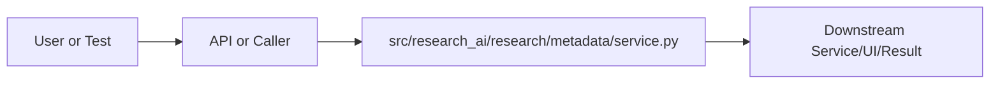

# service.py Explained

Generated educational companion for `src/research_ai/research/metadata/service.py`. This file is intentionally detailed so a developer can understand the code, architecture role, production tradeoffs, and ML/backend concepts behind the implementation.

## File Overview

`src/research_ai/research/metadata/service.py` is a Python module in the Research intelligence layer: paper ingestion, metadata, citations, and trends. It defines MetadataService and no top-level functions.

## Why This File Exists

This file isolates one responsibility in the codebase: Research intelligence layer: paper ingestion, metadata, citations, and trends. Separation matters because AI systems are easier to test, scale, debug, and explain when retrieval, orchestration, ML services, memory, UI, and deployment scripts have clear boundaries.

## Workflow Position

**Layer:** Research intelligence layer: paper ingestion, metadata, citations, and trends.

**Previous step:** caller code, an API request, a browser event, a test fixture, an import, or a startup script prepares inputs.

**Current step:** `src/research_ai/research/metadata/service.py` performs its local responsibility.

**Next step:** downstream services, API responses, rendered UI, tests, or process execution consume the result.



## Inputs and Outputs

- **Inputs:** function arguments, class constructor dependencies, HTTP payloads, environment variables, filesystem artifacts, DOM events, or test fixtures.
- **Outputs:** return values, dictionaries, Pydantic models, rendered DOM state, API responses, logs, process startup, assertions, or side effects.
- **Serialization:** this project uses JSON for APIs/LLM planning, parquet/joblib/faiss for ML artifacts, and HTML/CSS/JS for the browser surface.

## Imports Explained

| Import | Explanation |
|---|---|
| `__future__` | Project or standard-library dependency used to import a service, type, helper, or runtime capability. Imports affect startup time, packaging, and test isolation. |
| `collections` | Project or standard-library dependency used to import a service, type, helper, or runtime capability. Imports affect startup time, packaging, and test isolation. |
| `re` | re implements regular expressions for text extraction, validation, and secret redaction. |

## Global Variables and Config

No major module-level variables are declared. This reduces hidden state and keeps imports lightweight.

## Step-by-Step Workflow

1. Load dependencies and runtime constants.
2. Accept input from the previous layer.
3. Validate, transform, route, score, render, or execute according to this file's role.
4. Return a structured output or perform a controlled side effect.
5. Let caller layers handle presentation, persistence, retries, or fallback.

## Function-by-Function Breakdown

No top-level functions are defined. Behavior is class-based, declarative, or provided through package exports.

## Class-by-Class Breakdown

### `MetadataService`

- **Line:** 14
- **Base classes:** `object`
- **Docstring:** Analyse paper metadata to produce author, category, and quality signals.

Designed to operate on the list-of-dicts format returned by retrieval
so it can be wired directly into orchestrator tool calls.

**Methods:**
- `analyse` at line 24: Full metadata analysis over a list of paper dicts.
- `author_network` at line 38: Derive author co-occurrence network from paper metadata.
- `quality_score` at line 64: Compute a 0–1 metadata quality score for a single paper.
- `_author_signals` at line 87: method behavior is described by its body and name
- `_category_dist` at line 99: method behavior is described by its body and name
- `_year_dist` at line 107: method behavior is described by its body and name
- `_abstract_quality` at line 115: method behavior is described by its body and name
- `_completeness` at line 128: method behavior is described by its body and name
- `_parse_authors` at line 138: Split an author string into individual normalised names.

```python
class MetadataService:
    """Analyse paper metadata to produce author, category, and quality signals.

    Designed to operate on the list-of-dicts format returned by retrieval
    so it can be wired directly into orchestrator tool calls.
    """

    # Minimum token count for an abstract to be considered informative
    MIN_ABSTRACT_WORDS = 30

    def analyse(self, papers: list[dict]) -> dict:
        """Full metadata analysis over a list of paper dicts."""
        if not papers:
            return {"error": "No papers provided for metadata analysis."}

        return {
            "paper_count": len(papers),
            "author_signals": self._author_signals(papers),
            "category_distribution": self._category_dist(papers),
            "year_distribution": self._year_dist(papers),
            "abstract_quality": self._abstract_quality(papers),
            "metadata_completeness": self._completeness(papers),
        }

    def author_network(self, papers: list[dict]) -> dict:
        """Derive author co-occurrence network from paper metadata."""
        coauthorships: dict[str, Counter] = defaultdict(Counter)
        author_paper_count: Counter = Counter()

        for paper in papers:
            authors = self._parse_authors(paper.get("authors", ""))
            for author in authors:
                author_paper_count[author] += 1
            for i, author_a in enumerate(authors):
                for author_b in authors[i + 1:]:
                    coauthorships[author_a][author_b] += 1
                    coauthorships[author_b][author_a] += 1

        top_authors = author_paper_count.most_common(10)
        return {
            "unique_authors": len(author_paper_count),
            "top_authors": [{"author": a, "papers": c} for a, c in top_authors],
            "coauthor_pairs": [
                {"author_a": a, "author_b": b, "shared_papers": count}
                for a, coauthors in coauthorships.items()
                for b, count in coauthors.most_common(3)
                if a < b
            ][:15],
        }

    def quality_score(self, paper: dict) -> float:
        """Compute a 0–1 metadata quality score for a single paper."""
        score = 0.0
        if paper.get("title", "").strip():
            score += 0.25
        abstract = paper.get("abstract", "")
        word_count = len(abstract.split())
        if word_count >= self.MIN_ABSTRACT_WORDS:
            score += 0.25
        if word_count >= 100:
            score += 0.15
        if paper.get("authors", "").strip():
            score += 0.15
        if paper.get("year", "").strip():
            score += 0.10
        if paper.get("category", "").strip():
            score += 0.10
        return round(min(score, 1.0), 3)

    # ------------------------------------------------------------------
    # Private
    # ------------------------------------------------------------------

    def _author_signals(self, papers: list[dict]) -> dict:
        all_authors: list[str] = []
        for paper in papers:
            all_authors.extend(self._parse_authors(paper.get("authors", "")))
        counter = Counter(all_authors)
        return {
            "unique_authors": len(counter),
            "prolific_authors": [{"author": a, "papers": c} for a, c in counter.most_common(5)],
            "avg_authors_per_paper": round(len(all_authors) / max(1, len(papers)), 2),
        }

    @staticmethod
    def _category_dist(papers: list[dict]) -> list[dict]:
        counter: Counter = Counter()
        for paper in papers:
            for cat in str(paper.get("category", "")).split():
                counter[cat.lower()] += 1
        return [{"category": cat, "count": count} for cat, count in counter.most_common(10)]

    @staticmethod
    def _year_dist(papers: list[dict]) -> dict:
        years: Counter = Counter()
        for paper in papers:
            year = str(paper.get("year", "")).strip()
            if year.isdigit():
                years[year] += 1
        return dict(sorted(years.items()))
```

This class packages state and behavior behind a service-style interface. Constructor dependencies show what the class needs; public methods show what the rest of the system can ask it to do. In production, this boundary is where caching, model loading, artifact access, and error handling must be controlled.


## Method-by-Method Deep Dive

### Class `MetadataService` Methods

#### `MetadataService.analyse`

- **Line:** 24
- **Kind:** synchronous method
- **Arguments:** self, papers
- **Docstring:** Full metadata analysis over a list of paper dicts.

```python
    def analyse(self, papers: list[dict]) -> dict:
        """Full metadata analysis over a list of paper dicts."""
        if not papers:
            return {"error": "No papers provided for metadata analysis."}

        return {
            "paper_count": len(papers),
            "author_signals": self._author_signals(papers),
            "category_distribution": self._category_dist(papers),
            "year_distribution": self._year_dist(papers),
            "abstract_quality": self._abstract_quality(papers),
            "metadata_completeness": self._completeness(papers),
        }
```

This method is part of the class contract. Its inputs show what state or caller data it consumes; its body shows whether it performs pure transformation, model/artifact access, retrieval, I/O, caching, validation, or orchestration. In production review, pay attention to error handling, mutation of `self`, repeated expensive work, and whether return shapes stay stable for downstream callers.

#### `MetadataService.author_network`

- **Line:** 38
- **Kind:** synchronous method
- **Arguments:** self, papers
- **Docstring:** Derive author co-occurrence network from paper metadata.

```python
    def author_network(self, papers: list[dict]) -> dict:
        """Derive author co-occurrence network from paper metadata."""
        coauthorships: dict[str, Counter] = defaultdict(Counter)
        author_paper_count: Counter = Counter()

        for paper in papers:
            authors = self._parse_authors(paper.get("authors", ""))
            for author in authors:
                author_paper_count[author] += 1
            for i, author_a in enumerate(authors):
                for author_b in authors[i + 1:]:
                    coauthorships[author_a][author_b] += 1
                    coauthorships[author_b][author_a] += 1

        top_authors = author_paper_count.most_common(10)
        return {
            "unique_authors": len(author_paper_count),
            "top_authors": [{"author": a, "papers": c} for a, c in top_authors],
            "coauthor_pairs": [
                {"author_a": a, "author_b": b, "shared_papers": count}
                for a, coauthors in coauthorships.items()
                for b, count in coauthors.most_common(3)
                if a < b
            ][:15],
        }
```

This method is part of the class contract. Its inputs show what state or caller data it consumes; its body shows whether it performs pure transformation, model/artifact access, retrieval, I/O, caching, validation, or orchestration. In production review, pay attention to error handling, mutation of `self`, repeated expensive work, and whether return shapes stay stable for downstream callers.

#### `MetadataService.quality_score`

- **Line:** 64
- **Kind:** synchronous method
- **Arguments:** self, paper
- **Docstring:** Compute a 0–1 metadata quality score for a single paper.

```python
    def quality_score(self, paper: dict) -> float:
        """Compute a 0–1 metadata quality score for a single paper."""
        score = 0.0
        if paper.get("title", "").strip():
            score += 0.25
        abstract = paper.get("abstract", "")
        word_count = len(abstract.split())
        if word_count >= self.MIN_ABSTRACT_WORDS:
            score += 0.25
        if word_count >= 100:
            score += 0.15
        if paper.get("authors", "").strip():
            score += 0.15
        if paper.get("year", "").strip():
            score += 0.10
        if paper.get("category", "").strip():
            score += 0.10
        return round(min(score, 1.0), 3)
```

This method is part of the class contract. Its inputs show what state or caller data it consumes; its body shows whether it performs pure transformation, model/artifact access, retrieval, I/O, caching, validation, or orchestration. In production review, pay attention to error handling, mutation of `self`, repeated expensive work, and whether return shapes stay stable for downstream callers.

#### `MetadataService._author_signals`

- **Line:** 87
- **Kind:** synchronous method
- **Arguments:** self, papers
- **Docstring:** No explicit docstring; behavior is inferred from the implementation and call sites.

```python
    def _author_signals(self, papers: list[dict]) -> dict:
        all_authors: list[str] = []
        for paper in papers:
            all_authors.extend(self._parse_authors(paper.get("authors", "")))
        counter = Counter(all_authors)
        return {
            "unique_authors": len(counter),
            "prolific_authors": [{"author": a, "papers": c} for a, c in counter.most_common(5)],
            "avg_authors_per_paper": round(len(all_authors) / max(1, len(papers)), 2),
        }
```

This method is part of the class contract. Its inputs show what state or caller data it consumes; its body shows whether it performs pure transformation, model/artifact access, retrieval, I/O, caching, validation, or orchestration. In production review, pay attention to error handling, mutation of `self`, repeated expensive work, and whether return shapes stay stable for downstream callers.

#### `MetadataService._category_dist`

- **Line:** 99
- **Kind:** synchronous method
- **Arguments:** papers
- **Docstring:** No explicit docstring; behavior is inferred from the implementation and call sites.

```python
    def _category_dist(papers: list[dict]) -> list[dict]:
        counter: Counter = Counter()
        for paper in papers:
            for cat in str(paper.get("category", "")).split():
                counter[cat.lower()] += 1
        return [{"category": cat, "count": count} for cat, count in counter.most_common(10)]
```

This method is part of the class contract. Its inputs show what state or caller data it consumes; its body shows whether it performs pure transformation, model/artifact access, retrieval, I/O, caching, validation, or orchestration. In production review, pay attention to error handling, mutation of `self`, repeated expensive work, and whether return shapes stay stable for downstream callers.

#### `MetadataService._year_dist`

- **Line:** 107
- **Kind:** synchronous method
- **Arguments:** papers
- **Docstring:** No explicit docstring; behavior is inferred from the implementation and call sites.

```python
    def _year_dist(papers: list[dict]) -> dict:
        years: Counter = Counter()
        for paper in papers:
            year = str(paper.get("year", "")).strip()
            if year.isdigit():
                years[year] += 1
        return dict(sorted(years.items()))
```

This method is part of the class contract. Its inputs show what state or caller data it consumes; its body shows whether it performs pure transformation, model/artifact access, retrieval, I/O, caching, validation, or orchestration. In production review, pay attention to error handling, mutation of `self`, repeated expensive work, and whether return shapes stay stable for downstream callers.

#### `MetadataService._abstract_quality`

- **Line:** 115
- **Kind:** synchronous method
- **Arguments:** self, papers
- **Docstring:** No explicit docstring; behavior is inferred from the implementation and call sites.

```python
    def _abstract_quality(self, papers: list[dict]) -> dict:
        word_counts = [len(p.get("abstract", "").split()) for p in papers]
        if not word_counts:
            return {}
        below_min = sum(1 for wc in word_counts if wc < self.MIN_ABSTRACT_WORDS)
        return {
            "avg_word_count": round(sum(word_counts) / len(word_counts), 1),
            "min_word_count": min(word_counts),
            "max_word_count": max(word_counts),
            "below_minimum_threshold": below_min,
            "quality_rate": round(1 - below_min / max(1, len(word_counts)), 3),
        }
```

This method is part of the class contract. Its inputs show what state or caller data it consumes; its body shows whether it performs pure transformation, model/artifact access, retrieval, I/O, caching, validation, or orchestration. In production review, pay attention to error handling, mutation of `self`, repeated expensive work, and whether return shapes stay stable for downstream callers.

#### `MetadataService._completeness`

- **Line:** 128
- **Kind:** synchronous method
- **Arguments:** self, papers
- **Docstring:** No explicit docstring; behavior is inferred from the implementation and call sites.

```python
    def _completeness(self, papers: list[dict]) -> dict:
        fields = ("title", "abstract", "authors", "year", "category", "paper_id")
        counts = {f: sum(1 for p in papers if p.get(f, "").strip()) for f in fields}
        total = len(papers)
        return {
            field: {"present": count, "rate": round(count / max(1, total), 3)}
            for field, count in counts.items()
        }
```

This method is part of the class contract. Its inputs show what state or caller data it consumes; its body shows whether it performs pure transformation, model/artifact access, retrieval, I/O, caching, validation, or orchestration. In production review, pay attention to error handling, mutation of `self`, repeated expensive work, and whether return shapes stay stable for downstream callers.

#### `MetadataService._parse_authors`

- **Line:** 138
- **Kind:** synchronous method
- **Arguments:** raw
- **Docstring:** Split an author string into individual normalised names.

```python
    def _parse_authors(raw: str) -> list[str]:
        """Split an author string into individual normalised names."""
        if not raw:
            return []
        # arXiv metadata uses commas or semicolons
        parts = re.split(r"[,;]", raw)
        return [p.strip() for p in parts if len(p.strip()) > 2]
```

This method is part of the class contract. Its inputs show what state or caller data it consumes; its body shows whether it performs pure transformation, model/artifact access, retrieval, I/O, caching, validation, or orchestration. In production review, pay attention to error handling, mutation of `self`, repeated expensive work, and whether return shapes stay stable for downstream callers.

## Important Algorithms Used

- No dominant algorithm appears here; the important design is delegation, configuration, interface definition, or verification.

## Libraries Used

| Import | Explanation |
|---|---|
| `__future__` | Project or standard-library dependency used to import a service, type, helper, or runtime capability. Imports affect startup time, packaging, and test isolation. |
| `collections` | Project or standard-library dependency used to import a service, type, helper, or runtime capability. Imports affect startup time, packaging, and test isolation. |
| `re` | re implements regular expressions for text extraction, validation, and secret redaction. |

## ML Concepts Used

This file does not directly implement a major ML algorithm. It still matters because production ML systems depend on glue code, settings, tests, package exports, and UI contracts to make models usable.

## Performance and Memory Notes

- Avoid eager loading of heavy ML models unless startup latency is acceptable.
- Cache expensive clients, tokenizers, vector stores, and embeddings carefully.
- Use float32 for embedding vectors because it halves memory compared with float64 and matches FAISS/neural inference expectations.
- Bound prompt length, uploaded content, result counts, and token budgets to control latency and memory.
- Watch copies of large metadata frames, embedding matrices, and file buffers.

## Scalability Notes

- In-memory state works for local demos but needs Redis/database/object storage for multi-worker cloud deployment.
- CPU/GPU inference should often be separated from the web API when traffic grows.
- Retrieval can start exact and move to approximate indexes as corpus size grows.
- Batch operations and cache repeated work to improve throughput.
- Add metrics for latency, errors, fallback frequency, retrieval hit rate, and token usage.

## Production Engineering Notes

- Keep interfaces stable because other files may import this module or depend on its response shape.
- Prefer typed/structured data over free-form strings at service boundaries.
- Log operational context without secrets or huge payloads.
- Make fallback behavior explicit so users get useful output even when LLMs or artifacts fail.
- Keep provider-specific logic behind adapters so Groq/OpenRouter/Google/Ollama can be swapped.

## Common Bugs and Failure Cases

- Missing `.env` values, model artifacts, or Ollama models can trigger degraded behavior.
- Type mismatches occur when LLM-generated tool arguments cross into strict Python code.
- Empty retrieval results must not become hallucinated answers.
- Network calls need timeouts and careful retry behavior.
- Frontend IDs/classes and API schemas are contracts; changing one side without the other breaks workflows.

## Security Considerations

- Handles credentials or environment configuration. Keep secrets in environment variables and redact them from logs.
- Deals with execution or subprocesses. Maintain AST validation, isolated mode, timeouts, and least privilege.

## Real Industry Usage

- This pattern appears in enterprise RAG assistants, scientific search tools, internal research copilots, and ML platform demos.
- The layered design mirrors production systems: API facade, orchestration, retrieval, evaluation, synthesis, UI, and deployment.
- Clear separation lets teams replace model providers, improve retrieval, harden security, or redesign UI independently.

## Optimization Opportunities

- Add tracing around each workflow step.
- Strengthen schema validation at boundaries.
- Persist conversation/session state outside process memory.
- Add load tests and adversarial tests for prompt injection, empty evidence, and large uploads.
- Consider approximate vector indexes, reranker models, or batching when corpus/traffic grows.

## How This Connects To Other Files

- `src/research_ai/research/metadata/service.py` is connected through imports, startup scripts, API routes, frontend selectors, tests, or artifact paths.
- `src/research_ai/platform.py` is the backend composition root.
- `src/research_ai/api/main.py` exposes backend behavior over HTTP.
- Retrieval modules depend on artifacts under `artifacts/`.
- Frontend files depend on stable endpoint and DOM contracts.

## End-to-End Flow Summary

- A user/browser/test/startup event enters the system.
- The relevant layer validates or normalizes input.
- Retrieval, ML, orchestration, execution, or UI rendering happens.
- A structured result, visual state, or process side effect is produced.
- Fallbacks and tests keep behavior understandable when dependencies are unavailable.

## Interview Questions

1. What responsibility does this file own?
2. What inputs and outputs define its contract?
3. Which dependencies are expensive or operationally risky?
4. What breaks if this file changes shape?
5. How would you scale or test this behavior in production?

## Key Takeaways

- `src/research_ai/research/metadata/service.py` should be understood as part of a layered AI research platform.
- Trace data flow from inputs to transformations to outputs.
- Production readiness comes from explicit contracts, bounded resources, observability, secure defaults, and graceful fallback.

## Fully Commented Source

This section repeats the original source with an explanatory comment before every line. The comments are educational only; they are not inserted into the production source file.

```python
# L0001: Starts, ends, or continues a docstring that documents module, class, or function intent.
"""Paper metadata analysis service.
# L0002: Blank line that visually separates logical sections and improves readability.

# L0003: Executes Python logic as part of this file's workflow; read surrounding lines for data flow and side effects.
Provides structural intelligence over arXiv paper metadata beyond what
# L0004: Executes Python logic as part of this file's workflow; read surrounding lines for data flow and side effects.
the trend analysis and citation services expose — author disambiguation,
# L0005: Executes Python logic as part of this file's workflow; read surrounding lines for data flow and side effects.
venue/category cross-referencing, abstract statistics, and metadata
# L0006: Executes Python logic as part of this file's workflow; read surrounding lines for data flow and side effects.
quality scoring.
# L0007: Starts, ends, or continues a docstring that documents module, class, or function intent.
"""
# L0008: Enables future Python behavior so annotations/import semantics stay modern and predictable.
from __future__ import annotations
# L0009: Blank line that visually separates logical sections and improves readability.

# L0010: Imports a dependency, type, or project module needed by later code in this file.
import re
# L0011: Imports a dependency, type, or project module needed by later code in this file.
from collections import Counter, defaultdict
# L0012: Blank line that visually separates logical sections and improves readability.

# L0013: Blank line that visually separates logical sections and improves readability.

# L0014: Defines a class that groups related state and behavior behind a reusable interface.
class MetadataService:
# L0015: Starts, ends, or continues a docstring that documents module, class, or function intent.
    """Analyse paper metadata to produce author, category, and quality signals.
# L0016: Blank line that visually separates logical sections and improves readability.

# L0017: Executes Python logic as part of this file's workflow; read surrounding lines for data flow and side effects.
    Designed to operate on the list-of-dicts format returned by retrieval
# L0018: Executes Python logic as part of this file's workflow; read surrounding lines for data flow and side effects.
    so it can be wired directly into orchestrator tool calls.
# L0019: Starts, ends, or continues a docstring that documents module, class, or function intent.
    """
# L0020: Blank line that visually separates logical sections and improves readability.

# L0021: Developer comment explaining intent, caveat, section boundary, or operational reasoning.
    # Minimum token count for an abstract to be considered informative
# L0022: Assigns or updates a value used later in the workflow; check mutability and data shape.
    MIN_ABSTRACT_WORDS = 30
# L0023: Blank line that visually separates logical sections and improves readability.

# L0024: Defines a function or method; parameters are the input contract and the body implements the workflow.
    def analyse(self, papers: list[dict]) -> dict:
# L0025: Starts, ends, or continues a docstring that documents module, class, or function intent.
        """Full metadata analysis over a list of paper dicts."""
# L0026: Branches execution based on a condition, usually for validation, fallback, or mode-specific behavior.
        if not papers:
# L0027: Returns the computed result to the caller; this shape becomes part of the downstream contract.
            return {"error": "No papers provided for metadata analysis."}
# L0028: Blank line that visually separates logical sections and improves readability.

# L0029: Returns the computed result to the caller; this shape becomes part of the downstream contract.
        return {
# L0030: Executes Python logic as part of this file's workflow; read surrounding lines for data flow and side effects.
            "paper_count": len(papers),
# L0031: Executes Python logic as part of this file's workflow; read surrounding lines for data flow and side effects.
            "author_signals": self._author_signals(papers),
# L0032: Executes Python logic as part of this file's workflow; read surrounding lines for data flow and side effects.
            "category_distribution": self._category_dist(papers),
# L0033: Executes Python logic as part of this file's workflow; read surrounding lines for data flow and side effects.
            "year_distribution": self._year_dist(papers),
# L0034: Executes Python logic as part of this file's workflow; read surrounding lines for data flow and side effects.
            "abstract_quality": self._abstract_quality(papers),
# L0035: Executes Python logic as part of this file's workflow; read surrounding lines for data flow and side effects.
            "metadata_completeness": self._completeness(papers),
# L0036: Executes Python logic as part of this file's workflow; read surrounding lines for data flow and side effects.
        }
# L0037: Blank line that visually separates logical sections and improves readability.

# L0038: Defines a function or method; parameters are the input contract and the body implements the workflow.
    def author_network(self, papers: list[dict]) -> dict:
# L0039: Starts, ends, or continues a docstring that documents module, class, or function intent.
        """Derive author co-occurrence network from paper metadata."""
# L0040: Assigns or updates a value used later in the workflow; check mutability and data shape.
        coauthorships: dict[str, Counter] = defaultdict(Counter)
# L0041: Assigns or updates a value used later in the workflow; check mutability and data shape.
        author_paper_count: Counter = Counter()
# L0042: Blank line that visually separates logical sections and improves readability.

# L0043: Iterates over data, retry attempts, files, results, or workflow steps.
        for paper in papers:
# L0044: Assigns or updates a value used later in the workflow; check mutability and data shape.
            authors = self._parse_authors(paper.get("authors", ""))
# L0045: Iterates over data, retry attempts, files, results, or workflow steps.
            for author in authors:
# L0046: Assigns or updates a value used later in the workflow; check mutability and data shape.
                author_paper_count[author] += 1
# L0047: Iterates over data, retry attempts, files, results, or workflow steps.
            for i, author_a in enumerate(authors):
# L0048: Iterates over data, retry attempts, files, results, or workflow steps.
                for author_b in authors[i + 1:]:
# L0049: Assigns or updates a value used later in the workflow; check mutability and data shape.
                    coauthorships[author_a][author_b] += 1
# L0050: Assigns or updates a value used later in the workflow; check mutability and data shape.
                    coauthorships[author_b][author_a] += 1
# L0051: Blank line that visually separates logical sections and improves readability.

# L0052: Assigns or updates a value used later in the workflow; check mutability and data shape.
        top_authors = author_paper_count.most_common(10)
# L0053: Returns the computed result to the caller; this shape becomes part of the downstream contract.
        return {
# L0054: Executes Python logic as part of this file's workflow; read surrounding lines for data flow and side effects.
            "unique_authors": len(author_paper_count),
# L0055: Executes Python logic as part of this file's workflow; read surrounding lines for data flow and side effects.
            "top_authors": [{"author": a, "papers": c} for a, c in top_authors],
# L0056: Executes Python logic as part of this file's workflow; read surrounding lines for data flow and side effects.
            "coauthor_pairs": [
# L0057: Executes Python logic as part of this file's workflow; read surrounding lines for data flow and side effects.
                {"author_a": a, "author_b": b, "shared_papers": count}
# L0058: Iterates over data, retry attempts, files, results, or workflow steps.
                for a, coauthors in coauthorships.items()
# L0059: Iterates over data, retry attempts, files, results, or workflow steps.
                for b, count in coauthors.most_common(3)
# L0060: Branches execution based on a condition, usually for validation, fallback, or mode-specific behavior.
                if a < b
# L0061: Executes Python logic as part of this file's workflow; read surrounding lines for data flow and side effects.
            ][:15],
# L0062: Executes Python logic as part of this file's workflow; read surrounding lines for data flow and side effects.
        }
# L0063: Blank line that visually separates logical sections and improves readability.

# L0064: Defines a function or method; parameters are the input contract and the body implements the workflow.
    def quality_score(self, paper: dict) -> float:
# L0065: Starts, ends, or continues a docstring that documents module, class, or function intent.
        """Compute a 0–1 metadata quality score for a single paper."""
# L0066: Assigns or updates a value used later in the workflow; check mutability and data shape.
        score = 0.0
# L0067: Branches execution based on a condition, usually for validation, fallback, or mode-specific behavior.
        if paper.get("title", "").strip():
# L0068: Assigns or updates a value used later in the workflow; check mutability and data shape.
            score += 0.25
# L0069: Assigns or updates a value used later in the workflow; check mutability and data shape.
        abstract = paper.get("abstract", "")
# L0070: Assigns or updates a value used later in the workflow; check mutability and data shape.
        word_count = len(abstract.split())
# L0071: Branches execution based on a condition, usually for validation, fallback, or mode-specific behavior.
        if word_count >= self.MIN_ABSTRACT_WORDS:
# L0072: Assigns or updates a value used later in the workflow; check mutability and data shape.
            score += 0.25
# L0073: Branches execution based on a condition, usually for validation, fallback, or mode-specific behavior.
        if word_count >= 100:
# L0074: Assigns or updates a value used later in the workflow; check mutability and data shape.
            score += 0.15
# L0075: Branches execution based on a condition, usually for validation, fallback, or mode-specific behavior.
        if paper.get("authors", "").strip():
# L0076: Assigns or updates a value used later in the workflow; check mutability and data shape.
            score += 0.15
# L0077: Branches execution based on a condition, usually for validation, fallback, or mode-specific behavior.
        if paper.get("year", "").strip():
# L0078: Assigns or updates a value used later in the workflow; check mutability and data shape.
            score += 0.10
# L0079: Branches execution based on a condition, usually for validation, fallback, or mode-specific behavior.
        if paper.get("category", "").strip():
# L0080: Assigns or updates a value used later in the workflow; check mutability and data shape.
            score += 0.10
# L0081: Returns the computed result to the caller; this shape becomes part of the downstream contract.
        return round(min(score, 1.0), 3)
# L0082: Blank line that visually separates logical sections and improves readability.

# L0083: Developer comment explaining intent, caveat, section boundary, or operational reasoning.
    # ------------------------------------------------------------------
# L0084: Developer comment explaining intent, caveat, section boundary, or operational reasoning.
    # Private
# L0085: Developer comment explaining intent, caveat, section boundary, or operational reasoning.
    # ------------------------------------------------------------------
# L0086: Blank line that visually separates logical sections and improves readability.

# L0087: Defines a function or method; parameters are the input contract and the body implements the workflow.
    def _author_signals(self, papers: list[dict]) -> dict:
# L0088: Assigns or updates a value used later in the workflow; check mutability and data shape.
        all_authors: list[str] = []
# L0089: Iterates over data, retry attempts, files, results, or workflow steps.
        for paper in papers:
# L0090: Executes Python logic as part of this file's workflow; read surrounding lines for data flow and side effects.
            all_authors.extend(self._parse_authors(paper.get("authors", "")))
# L0091: Assigns or updates a value used later in the workflow; check mutability and data shape.
        counter = Counter(all_authors)
# L0092: Returns the computed result to the caller; this shape becomes part of the downstream contract.
        return {
# L0093: Executes Python logic as part of this file's workflow; read surrounding lines for data flow and side effects.
            "unique_authors": len(counter),
# L0094: Executes Python logic as part of this file's workflow; read surrounding lines for data flow and side effects.
            "prolific_authors": [{"author": a, "papers": c} for a, c in counter.most_common(5)],
# L0095: Executes Python logic as part of this file's workflow; read surrounding lines for data flow and side effects.
            "avg_authors_per_paper": round(len(all_authors) / max(1, len(papers)), 2),
# L0096: Executes Python logic as part of this file's workflow; read surrounding lines for data flow and side effects.
        }
# L0097: Blank line that visually separates logical sections and improves readability.

# L0098: Decorator that modifies the function/class below, commonly for routing, dataclasses, caching, or properties.
    @staticmethod
# L0099: Defines a function or method; parameters are the input contract and the body implements the workflow.
    def _category_dist(papers: list[dict]) -> list[dict]:
# L0100: Assigns or updates a value used later in the workflow; check mutability and data shape.
        counter: Counter = Counter()
# L0101: Iterates over data, retry attempts, files, results, or workflow steps.
        for paper in papers:
# L0102: Iterates over data, retry attempts, files, results, or workflow steps.
            for cat in str(paper.get("category", "")).split():
# L0103: Assigns or updates a value used later in the workflow; check mutability and data shape.
                counter[cat.lower()] += 1
# L0104: Returns the computed result to the caller; this shape becomes part of the downstream contract.
        return [{"category": cat, "count": count} for cat, count in counter.most_common(10)]
# L0105: Blank line that visually separates logical sections and improves readability.

# L0106: Decorator that modifies the function/class below, commonly for routing, dataclasses, caching, or properties.
    @staticmethod
# L0107: Defines a function or method; parameters are the input contract and the body implements the workflow.
    def _year_dist(papers: list[dict]) -> dict:
# L0108: Assigns or updates a value used later in the workflow; check mutability and data shape.
        years: Counter = Counter()
# L0109: Iterates over data, retry attempts, files, results, or workflow steps.
        for paper in papers:
# L0110: Assigns or updates a value used later in the workflow; check mutability and data shape.
            year = str(paper.get("year", "")).strip()
# L0111: Branches execution based on a condition, usually for validation, fallback, or mode-specific behavior.
            if year.isdigit():
# L0112: Assigns or updates a value used later in the workflow; check mutability and data shape.
                years[year] += 1
# L0113: Returns the computed result to the caller; this shape becomes part of the downstream contract.
        return dict(sorted(years.items()))
# L0114: Blank line that visually separates logical sections and improves readability.

# L0115: Defines a function or method; parameters are the input contract and the body implements the workflow.
    def _abstract_quality(self, papers: list[dict]) -> dict:
# L0116: Assigns or updates a value used later in the workflow; check mutability and data shape.
        word_counts = [len(p.get("abstract", "").split()) for p in papers]
# L0117: Branches execution based on a condition, usually for validation, fallback, or mode-specific behavior.
        if not word_counts:
# L0118: Returns the computed result to the caller; this shape becomes part of the downstream contract.
            return {}
# L0119: Assigns or updates a value used later in the workflow; check mutability and data shape.
        below_min = sum(1 for wc in word_counts if wc < self.MIN_ABSTRACT_WORDS)
# L0120: Returns the computed result to the caller; this shape becomes part of the downstream contract.
        return {
# L0121: Executes Python logic as part of this file's workflow; read surrounding lines for data flow and side effects.
            "avg_word_count": round(sum(word_counts) / len(word_counts), 1),
# L0122: Executes Python logic as part of this file's workflow; read surrounding lines for data flow and side effects.
            "min_word_count": min(word_counts),
# L0123: Executes Python logic as part of this file's workflow; read surrounding lines for data flow and side effects.
            "max_word_count": max(word_counts),
# L0124: Executes Python logic as part of this file's workflow; read surrounding lines for data flow and side effects.
            "below_minimum_threshold": below_min,
# L0125: Executes Python logic as part of this file's workflow; read surrounding lines for data flow and side effects.
            "quality_rate": round(1 - below_min / max(1, len(word_counts)), 3),
# L0126: Executes Python logic as part of this file's workflow; read surrounding lines for data flow and side effects.
        }
# L0127: Blank line that visually separates logical sections and improves readability.

# L0128: Defines a function or method; parameters are the input contract and the body implements the workflow.
    def _completeness(self, papers: list[dict]) -> dict:
# L0129: Assigns or updates a value used later in the workflow; check mutability and data shape.
        fields = ("title", "abstract", "authors", "year", "category", "paper_id")
# L0130: Assigns or updates a value used later in the workflow; check mutability and data shape.
        counts = {f: sum(1 for p in papers if p.get(f, "").strip()) for f in fields}
# L0131: Assigns or updates a value used later in the workflow; check mutability and data shape.
        total = len(papers)
# L0132: Returns the computed result to the caller; this shape becomes part of the downstream contract.
        return {
# L0133: Executes Python logic as part of this file's workflow; read surrounding lines for data flow and side effects.
            field: {"present": count, "rate": round(count / max(1, total), 3)}
# L0134: Iterates over data, retry attempts, files, results, or workflow steps.
            for field, count in counts.items()
# L0135: Executes Python logic as part of this file's workflow; read surrounding lines for data flow and side effects.
        }
# L0136: Blank line that visually separates logical sections and improves readability.

# L0137: Decorator that modifies the function/class below, commonly for routing, dataclasses, caching, or properties.
    @staticmethod
# L0138: Defines a function or method; parameters are the input contract and the body implements the workflow.
    def _parse_authors(raw: str) -> list[str]:
# L0139: Starts, ends, or continues a docstring that documents module, class, or function intent.
        """Split an author string into individual normalised names."""
# L0140: Branches execution based on a condition, usually for validation, fallback, or mode-specific behavior.
        if not raw:
# L0141: Returns the computed result to the caller; this shape becomes part of the downstream contract.
            return []
# L0142: Developer comment explaining intent, caveat, section boundary, or operational reasoning.
        # arXiv metadata uses commas or semicolons
# L0143: Assigns or updates a value used later in the workflow; check mutability and data shape.
        parts = re.split(r"[,;]", raw)
# L0144: Returns the computed result to the caller; this shape becomes part of the downstream contract.
        return [p.strip() for p in parts if len(p.strip()) > 2]
```

## Source Walkthrough

The complete source is included because the file is short enough to study directly.

```python
"""Paper metadata analysis service.

Provides structural intelligence over arXiv paper metadata beyond what
the trend analysis and citation services expose — author disambiguation,
venue/category cross-referencing, abstract statistics, and metadata
quality scoring.
"""
from __future__ import annotations

import re
from collections import Counter, defaultdict


class MetadataService:
    """Analyse paper metadata to produce author, category, and quality signals.

    Designed to operate on the list-of-dicts format returned by retrieval
    so it can be wired directly into orchestrator tool calls.
    """

    # Minimum token count for an abstract to be considered informative
    MIN_ABSTRACT_WORDS = 30

    def analyse(self, papers: list[dict]) -> dict:
        """Full metadata analysis over a list of paper dicts."""
        if not papers:
            return {"error": "No papers provided for metadata analysis."}

        return {
            "paper_count": len(papers),
            "author_signals": self._author_signals(papers),
            "category_distribution": self._category_dist(papers),
            "year_distribution": self._year_dist(papers),
            "abstract_quality": self._abstract_quality(papers),
            "metadata_completeness": self._completeness(papers),
        }

    def author_network(self, papers: list[dict]) -> dict:
        """Derive author co-occurrence network from paper metadata."""
        coauthorships: dict[str, Counter] = defaultdict(Counter)
        author_paper_count: Counter = Counter()

        for paper in papers:
            authors = self._parse_authors(paper.get("authors", ""))
            for author in authors:
                author_paper_count[author] += 1
            for i, author_a in enumerate(authors):
                for author_b in authors[i + 1:]:
                    coauthorships[author_a][author_b] += 1
                    coauthorships[author_b][author_a] += 1

        top_authors = author_paper_count.most_common(10)
        return {
            "unique_authors": len(author_paper_count),
            "top_authors": [{"author": a, "papers": c} for a, c in top_authors],
            "coauthor_pairs": [
                {"author_a": a, "author_b": b, "shared_papers": count}
                for a, coauthors in coauthorships.items()
                for b, count in coauthors.most_common(3)
                if a < b
            ][:15],
        }

    def quality_score(self, paper: dict) -> float:
        """Compute a 0–1 metadata quality score for a single paper."""
        score = 0.0
        if paper.get("title", "").strip():
            score += 0.25
        abstract = paper.get("abstract", "")
        word_count = len(abstract.split())
        if word_count >= self.MIN_ABSTRACT_WORDS:
            score += 0.25
        if word_count >= 100:
            score += 0.15
        if paper.get("authors", "").strip():
            score += 0.15
        if paper.get("year", "").strip():
            score += 0.10
        if paper.get("category", "").strip():
            score += 0.10
        return round(min(score, 1.0), 3)

    # ------------------------------------------------------------------
    # Private
    # ------------------------------------------------------------------

    def _author_signals(self, papers: list[dict]) -> dict:
        all_authors: list[str] = []
        for paper in papers:
            all_authors.extend(self._parse_authors(paper.get("authors", "")))
        counter = Counter(all_authors)
        return {
            "unique_authors": len(counter),
            "prolific_authors": [{"author": a, "papers": c} for a, c in counter.most_common(5)],
            "avg_authors_per_paper": round(len(all_authors) / max(1, len(papers)), 2),
        }

    @staticmethod
    def _category_dist(papers: list[dict]) -> list[dict]:
        counter: Counter = Counter()
        for paper in papers:
            for cat in str(paper.get("category", "")).split():
                counter[cat.lower()] += 1
        return [{"category": cat, "count": count} for cat, count in counter.most_common(10)]

    @staticmethod
    def _year_dist(papers: list[dict]) -> dict:
        years: Counter = Counter()
        for paper in papers:
            year = str(paper.get("year", "")).strip()
            if year.isdigit():
                years[year] += 1
        return dict(sorted(years.items()))

    def _abstract_quality(self, papers: list[dict]) -> dict:
        word_counts = [len(p.get("abstract", "").split()) for p in papers]
        if not word_counts:
            return {}
        below_min = sum(1 for wc in word_counts if wc < self.MIN_ABSTRACT_WORDS)
        return {
            "avg_word_count": round(sum(word_counts) / len(word_counts), 1),
            "min_word_count": min(word_counts),
            "max_word_count": max(word_counts),
            "below_minimum_threshold": below_min,
            "quality_rate": round(1 - below_min / max(1, len(word_counts)), 3),
        }

    def _completeness(self, papers: list[dict]) -> dict:
        fields = ("title", "abstract", "authors", "year", "category", "paper_id")
        counts = {f: sum(1 for p in papers if p.get(f, "").strip()) for f in fields}
        total = len(papers)
        return {
            field: {"present": count, "rate": round(count / max(1, total), 3)}
            for field, count in counts.items()
        }

    @staticmethod
    def _parse_authors(raw: str) -> list[str]:
        """Split an author string into individual normalised names."""
        if not raw:
            return []
        # arXiv metadata uses commas or semicolons
        parts = re.split(r"[,;]", raw)
        return [p.strip() for p in parts if len(p.strip()) > 2]
```
