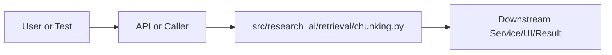

# chunking.py Explained

Generated educational companion for `src/research_ai/retrieval/chunking.py`. This file is intentionally detailed so a developer can understand the code, architecture role, production tradeoffs, and ML/backend concepts behind the implementation.

## File Overview

`src/research_ai/retrieval/chunking.py` is a Python module in the Retrieval layer: chunking, embeddings, FAISS, hybrid search, and reranking. It defines no classes and _split_sentences, contextual_chunks.

## Why This File Exists

This file isolates one responsibility in the codebase: Retrieval layer: chunking, embeddings, FAISS, hybrid search, and reranking. Separation matters because AI systems are easier to test, scale, debug, and explain when retrieval, orchestration, ML services, memory, UI, and deployment scripts have clear boundaries.

## Workflow Position

**Layer:** Retrieval layer: chunking, embeddings, FAISS, hybrid search, and reranking.

**Previous step:** caller code, an API request, a browser event, a test fixture, an import, or a startup script prepares inputs.

**Current step:** `src/research_ai/retrieval/chunking.py` performs its local responsibility.

**Next step:** downstream services, API responses, rendered UI, tests, or process execution consume the result.



## Inputs and Outputs

- **Inputs:** function arguments, class constructor dependencies, HTTP payloads, environment variables, filesystem artifacts, DOM events, or test fixtures.
- **Outputs:** return values, dictionaries, Pydantic models, rendered DOM state, API responses, logs, process startup, assertions, or side effects.
- **Serialization:** this project uses JSON for APIs/LLM planning, parquet/joblib/faiss for ML artifacts, and HTML/CSS/JS for the browser surface.

## Imports Explained

| Import | Explanation |
|---|---|
| `__future__` | Project or standard-library dependency used to import a service, type, helper, or runtime capability. Imports affect startup time, packaging, and test isolation. |
| `re` | re implements regular expressions for text extraction, validation, and secret redaction. |

## Global Variables and Config

| Name | Line | Why it matters |
|---|---:|---|
| `_SENTENCE_END` | 37 | Module-level value, constant, prompt, cache, registry, or configuration point. Check mutability and startup cost. |
| `_SECTION_HEADER` | 56 | Module-level value, constant, prompt, cache, registry, or configuration point. Check mutability and startup cost. |

## Step-by-Step Workflow

1. Load dependencies and runtime constants.
2. Accept input from the previous layer.
3. Validate, transform, route, score, render, or execute according to this file's role.
4. Return a structured output or perform a controlled side effect.
5. Let caller layers handle presentation, persistence, retries, or fallback.

## Function-by-Function Breakdown

### `_split_sentences`

- **Line:** 64
- **Kind:** synchronous function
- **Arguments:** text
- **Docstring:** Split text into sentences, preserving full sentence content.

```python
def _split_sentences(text: str) -> list[str]:
    """Split text into sentences, preserving full sentence content."""
    parts: list[str] = []
    last = 0
    for match in _SENTENCE_END.finditer(text):
        end = match.end()
        sentence = text[last:end].strip()
        if sentence:
            parts.append(sentence)
        last = end
    tail = text[last:].strip()
    if tail:
        parts.append(tail)
    return parts if parts else [text.strip()]
```

This function's parameters define its input contract. Its return value or side effect defines how downstream code uses it. Review error handling, resource usage, and whether the function performs CPU work, I/O, model inference, or pure transformation.

### `contextual_chunks`

- **Line:** 80
- **Kind:** synchronous function
- **Arguments:** text, chunk_size, overlap, min_chunk_words
- **Docstring:** Split document text into overlapping, sentence-boundary-respecting chunks.

Args:
    text:            Raw document text.
    chunk_size:      Target chunk size in words (soft limit).
    overlap:         Overlap in words carried from the previous chunk.
    min_chunk_words: Minimum words for a chunk to be kept — smaller
                     trailing fragments are merged into the previous chunk.

Returns:
    List of non-empty text chunks suitable for embedding.

```python
def contextual_chunks(
    text: str,
    chunk_size: int = 900,
    overlap: int = 150,
    min_chunk_words: int = 20,
) -> list[str]:
    """Split document text into overlapping, sentence-boundary-respecting chunks.

    Args:
        text:            Raw document text.
        chunk_size:      Target chunk size in words (soft limit).
        overlap:         Overlap in words carried from the previous chunk.
        min_chunk_words: Minimum words for a chunk to be kept — smaller
                         trailing fragments are merged into the previous chunk.

    Returns:
        List of non-empty text chunks suitable for embedding.
    """
    if not text or not text.strip():
        return []

    sentences = _split_sentences(text)
    if not sentences:
        return []

    chunks: list[str] = []
    current_sentences: list[str] = []
    current_words = 0

    for sentence in sentences:
        words = len(sentence.split())
        current_sentences.append(sentence)
        current_words += words

        if current_words >= chunk_size:
            chunks.append(" ".join(current_sentences))
            # Carry over enough sentences for the overlap window
            overlap_sentences: list[str] = []
            carried = 0
            for sent in reversed(current_sentences):
                carried += len(sent.split())
                overlap_sentences.insert(0, sent)
                if carried >= overlap:
                    break
            current_sentences = overlap_sentences
            current_words = sum(len(s.split()) for s in current_sentences)

    # Flush remaining sentences
    if current_sentences:
        tail = " ".join(current_sentences)
        if len(tail.split()) >= min_chunk_words:
            chunks.append(tail)
        elif chunks:
            # Merge tiny trailing fragment into the last chunk
            chunks[-1] = chunks[-1] + " " + tail
        else:
            chunks.append(tail)

    return [c.strip() for c in chunks if c.strip()]
```

This function's parameters define its input contract. Its return value or side effect defines how downstream code uses it. Review error handling, resource usage, and whether the function performs CPU work, I/O, model inference, or pure transformation.


## Class-by-Class Breakdown

No classes are defined. The module relies on functions, constants, imports, or package exports.

## Important Algorithms Used

- **Embeddings**: Embeddings map text into dense semantic vectors so conceptual similarity becomes geometric similarity.
- **RAG**: Retrieval-Augmented Generation retrieves evidence first and asks an LLM to answer from that evidence, reducing hallucination.
- **Sandboxing**: Sandboxing validates and constrains user code before execution, reducing security and stability risk.

## Libraries Used

| Import | Explanation |
|---|---|
| `__future__` | Project or standard-library dependency used to import a service, type, helper, or runtime capability. Imports affect startup time, packaging, and test isolation. |
| `re` | re implements regular expressions for text extraction, validation, and secret redaction. |

## ML Concepts Used

- **Embeddings**: Embeddings map text into dense semantic vectors so conceptual similarity becomes geometric similarity.
- **RAG**: Retrieval-Augmented Generation retrieves evidence first and asks an LLM to answer from that evidence, reducing hallucination.
- **Sandboxing**: Sandboxing validates and constrains user code before execution, reducing security and stability risk.

## Performance and Memory Notes

- Avoid eager loading of heavy ML models unless startup latency is acceptable.
- Cache expensive clients, tokenizers, vector stores, and embeddings carefully.
- Use float32 for embedding vectors because it halves memory compared with float64 and matches FAISS/neural inference expectations.
- Bound prompt length, uploaded content, result counts, and token budgets to control latency and memory.
- Watch copies of large metadata frames, embedding matrices, and file buffers.

## Scalability Notes

- In-memory state works for local demos but needs Redis/database/object storage for multi-worker cloud deployment.
- CPU/GPU inference should often be separated from the web API when traffic grows.
- Retrieval can start exact and move to approximate indexes as corpus size grows.
- Batch operations and cache repeated work to improve throughput.
- Add metrics for latency, errors, fallback frequency, retrieval hit rate, and token usage.

## Production Engineering Notes

- Keep interfaces stable because other files may import this module or depend on its response shape.
- Prefer typed/structured data over free-form strings at service boundaries.
- Log operational context without secrets or huge payloads.
- Make fallback behavior explicit so users get useful output even when LLMs or artifacts fail.
- Keep provider-specific logic behind adapters so Groq/OpenRouter/Google/Ollama can be swapped.

## Common Bugs and Failure Cases

- Missing `.env` values, model artifacts, or Ollama models can trigger degraded behavior.
- Type mismatches occur when LLM-generated tool arguments cross into strict Python code.
- Empty retrieval results must not become hallucinated answers.
- Network calls need timeouts and careful retry behavior.
- Frontend IDs/classes and API schemas are contracts; changing one side without the other breaks workflows.

## Security Considerations

- Deals with execution or subprocesses. Maintain AST validation, isolated mode, timeouts, and least privilege.

## Real Industry Usage

- This pattern appears in enterprise RAG assistants, scientific search tools, internal research copilots, and ML platform demos.
- The layered design mirrors production systems: API facade, orchestration, retrieval, evaluation, synthesis, UI, and deployment.
- Clear separation lets teams replace model providers, improve retrieval, harden security, or redesign UI independently.

## Optimization Opportunities

- Add tracing around each workflow step.
- Strengthen schema validation at boundaries.
- Persist conversation/session state outside process memory.
- Add load tests and adversarial tests for prompt injection, empty evidence, and large uploads.
- Consider approximate vector indexes, reranker models, or batching when corpus/traffic grows.

## How This Connects To Other Files

- `src/research_ai/retrieval/chunking.py` is connected through imports, startup scripts, API routes, frontend selectors, tests, or artifact paths.
- `src/research_ai/platform.py` is the backend composition root.
- `src/research_ai/api/main.py` exposes backend behavior over HTTP.
- Retrieval modules depend on artifacts under `artifacts/`.
- Frontend files depend on stable endpoint and DOM contracts.

## End-to-End Flow Summary

- A user/browser/test/startup event enters the system.
- The relevant layer validates or normalizes input.
- Retrieval, ML, orchestration, execution, or UI rendering happens.
- A structured result, visual state, or process side effect is produced.
- Fallbacks and tests keep behavior understandable when dependencies are unavailable.

## Interview Questions

1. What responsibility does this file own?
2. What inputs and outputs define its contract?
3. Which dependencies are expensive or operationally risky?
4. What breaks if this file changes shape?
5. How would you scale or test this behavior in production?

## Key Takeaways

- `src/research_ai/retrieval/chunking.py` should be understood as part of a layered AI research platform.
- Trace data flow from inputs to transformations to outputs.
- Production readiness comes from explicit contracts, bounded resources, observability, secure defaults, and graceful fallback.

## Fully Commented Source

This section repeats the original source with an explanatory comment before every line. The comments are educational only; they are not inserted into the production source file.

```python
# L0001: Starts, ends, or continues a docstring that documents module, class, or function intent.
"""Sentence-aware contextual chunking for paper ingestion.
# L0002: Blank line that visually separates logical sections and improves readability.

# L0003: Executes Python logic as part of this file's workflow; read surrounding lines for data flow and side effects.
Improvements over the original word-split approach:
# L0004: Executes Python logic as part of this file's workflow; read surrounding lines for data flow and side effects.
- Sentence boundary detection via regex (no heavy NLP dependency)
# L0005: Executes Python logic as part of this file's workflow; read surrounding lines for data flow and side effects.
- Chunks respect sentence boundaries — no mid-sentence splits
# L0006: Executes Python logic as part of this file's workflow; read surrounding lines for data flow and side effects.
- Configurable overlap uses whole sentences rather than word windows
# L0007: Executes Python logic as part of this file's workflow; read surrounding lines for data flow and side effects.
- Section-header detection to start new chunks at paper sections
# L0008: Executes Python logic as part of this file's workflow; read surrounding lines for data flow and side effects.
- Short paragraph merging to avoid undersized chunks
# L0009: Starts, ends, or continues a docstring that documents module, class, or function intent.
"""
# L0010: Enables future Python behavior so annotations/import semantics stay modern and predictable.
from __future__ import annotations
# L0011: Blank line that visually separates logical sections and improves readability.

# L0012: Imports a dependency, type, or project module needed by later code in this file.
import re
# L0013: Blank line that visually separates logical sections and improves readability.

# L0014: Blank line that visually separates logical sections and improves readability.

# L0015: Developer comment explaining intent, caveat, section boundary, or operational reasoning.
# Regex that captures sentence boundaries in scientific text.
# L0016: Developer comment explaining intent, caveat, section boundary, or operational reasoning.
#
# L0017: Developer comment explaining intent, caveat, section boundary, or operational reasoning.
# DESIGN: Uses multiple fixed-width negative lookbehinds — one per abbreviation.
# L0018: Developer comment explaining intent, caveat, section boundary, or operational reasoning.
# Python's standard re module requires lookbehinds to be fixed-width, so we
# L0019: Developer comment explaining intent, caveat, section boundary, or operational reasoning.
# cannot use alternation inside a single lookbehind (variable width).
# L0020: Developer comment explaining intent, caveat, section boundary, or operational reasoning.
# Each lookbehind checks a different fixed number of characters before the
# L0021: Developer comment explaining intent, caveat, section boundary, or operational reasoning.
# sentence-ending punctuation.
# L0022: Developer comment explaining intent, caveat, section boundary, or operational reasoning.
#
# L0023: Developer comment explaining intent, caveat, section boundary, or operational reasoning.
# BUG FIX (pre-existing): The original pattern used
# L0024: Developer comment explaining intent, caveat, section boundary, or operational reasoning.
#   r"(?<!\b(?:et al|fig|eq|...))" which is variable-width — Python raises
# L0025: Developer comment explaining intent, caveat, section boundary, or operational reasoning.
#   re.error: "look-behind requires fixed-width pattern".
# L0026: Developer comment explaining intent, caveat, section boundary, or operational reasoning.
#   Fix: replace with individual fixed-width lookbehinds, one per abbreviation.
# L0027: Developer comment explaining intent, caveat, section boundary, or operational reasoning.
#
# L0028: Developer comment explaining intent, caveat, section boundary, or operational reasoning.
# HOW IT WORKS:
# L0029: Developer comment explaining intent, caveat, section boundary, or operational reasoning.
#   [.!?]            — punctuation that could end a sentence
# L0030: Developer comment explaining intent, caveat, section boundary, or operational reasoning.
#   (?:\s+|\n)       — followed by whitespace or newline
# L0031: Developer comment explaining intent, caveat, section boundary, or operational reasoning.
#   (?=[A-Z\d\"])    — followed by uppercase letter, digit, or quote (new sentence)
# L0032: Developer comment explaining intent, caveat, section boundary, or operational reasoning.
#   (?<!et al)       — but NOT if "et al" (5 chars) immediately precedes the punct
# L0033: Developer comment explaining intent, caveat, section boundary, or operational reasoning.
#   (?<!fig)         — etc for other abbreviations (each fixed width)
# L0034: Developer comment explaining intent, caveat, section boundary, or operational reasoning.
#
# L0035: Developer comment explaining intent, caveat, section boundary, or operational reasoning.
# CASE INSENSITIVITY: re.IGNORECASE makes all lookbehinds case-insensitive,
# L0036: Developer comment explaining intent, caveat, section boundary, or operational reasoning.
#   so (?<!fig) also catches "Fig", "FIG", etc.
# L0037: Assigns or updates a value used later in the workflow; check mutability and data shape.
_SENTENCE_END = re.compile(
# L0038: Executes Python logic as part of this file's workflow; read surrounding lines for data flow and side effects.
    r"(?<!et al)"   # 5 chars: "et al." in citations
# L0039: Executes Python logic as part of this file's workflow; read surrounding lines for data flow and side effects.
    r"(?<!\.fig)"   # 4 chars: ".fig" — handles "Fig." suffix
# L0040: Executes Python logic as part of this file's workflow; read surrounding lines for data flow and side effects.
    r"(?<!\.\.eq)"  # 4 chars: covers "Eq."
# L0041: Executes Python logic as part of this file's workflow; read surrounding lines for data flow and side effects.
    r"(?<!\.\.vs)"  # 4 chars: covers "vs."
# L0042: Executes Python logic as part of this file's workflow; read surrounding lines for data flow and side effects.
    r"(?<!i\.e)"    # 3 chars: abbreviation "i.e."
# L0043: Executes Python logic as part of this file's workflow; read surrounding lines for data flow and side effects.
    r"(?<!e\.g)"    # 3 chars: abbreviation "e.g."
# L0044: Executes Python logic as part of this file's workflow; read surrounding lines for data flow and side effects.
    r"(?<!\. cf)"   # 4 chars: "cf."
# L0045: Executes Python logic as part of this file's workflow; read surrounding lines for data flow and side effects.
    r"(?<!approx)"  # 6 chars: "approx."
# L0046: Executes Python logic as part of this file's workflow; read surrounding lines for data flow and side effects.
    r"(?<!\.ref)"   # 4 chars: "Ref."
# L0047: Executes Python logic as part of this file's workflow; read surrounding lines for data flow and side effects.
    r"(?<!\.sec)"   # 4 chars: "Sec."
# L0048: Executes Python logic as part of this file's workflow; read surrounding lines for data flow and side effects.
    r"(?<!\.tab)"   # 4 chars: "Tab."
# L0049: Executes Python logic as part of this file's workflow; read surrounding lines for data flow and side effects.
    r"(?<!\.eqn)"   # 4 chars: "Eqn."
# L0050: Executes Python logic as part of this file's workflow; read surrounding lines for data flow and side effects.
    r"(?<!\.app)"   # 4 chars: "App."
# L0051: Assigns or updates a value used later in the workflow; check mutability and data shape.
    r"[.!?](?:\s+|\n)(?=[A-Z\d\"])",
# L0052: Executes Python logic as part of this file's workflow; read surrounding lines for data flow and side effects.
    re.IGNORECASE,
# L0053: Executes Python logic as part of this file's workflow; read surrounding lines for data flow and side effects.
)
# L0054: Blank line that visually separates logical sections and improves readability.

# L0055: Developer comment explaining intent, caveat, section boundary, or operational reasoning.
# Common section headers in scientific papers — start a new chunk here
# L0056: Assigns or updates a value used later in the workflow; check mutability and data shape.
_SECTION_HEADER = re.compile(
# L0057: Executes Python logic as part of this file's workflow; read surrounding lines for data flow and side effects.
    r"^(?:\d+\.?\s+)?(?:abstract|introduction|related work|background|"
# L0058: Executes Python logic as part of this file's workflow; read surrounding lines for data flow and side effects.
    r"methodology|method|approach|experiments?|results?|evaluation|"
# L0059: Executes Python logic as part of this file's workflow; read surrounding lines for data flow and side effects.
    r"discussion|conclusion|references?|acknowledgements?)\b",
# L0060: Executes Python logic as part of this file's workflow; read surrounding lines for data flow and side effects.
    re.IGNORECASE | re.MULTILINE,
# L0061: Executes Python logic as part of this file's workflow; read surrounding lines for data flow and side effects.
)
# L0062: Blank line that visually separates logical sections and improves readability.

# L0063: Blank line that visually separates logical sections and improves readability.

# L0064: Defines a function or method; parameters are the input contract and the body implements the workflow.
def _split_sentences(text: str) -> list[str]:
# L0065: Starts, ends, or continues a docstring that documents module, class, or function intent.
    """Split text into sentences, preserving full sentence content."""
# L0066: Assigns or updates a value used later in the workflow; check mutability and data shape.
    parts: list[str] = []
# L0067: Assigns or updates a value used later in the workflow; check mutability and data shape.
    last = 0
# L0068: Iterates over data, retry attempts, files, results, or workflow steps.
    for match in _SENTENCE_END.finditer(text):
# L0069: Assigns or updates a value used later in the workflow; check mutability and data shape.
        end = match.end()
# L0070: Assigns or updates a value used later in the workflow; check mutability and data shape.
        sentence = text[last:end].strip()
# L0071: Branches execution based on a condition, usually for validation, fallback, or mode-specific behavior.
        if sentence:
# L0072: Executes Python logic as part of this file's workflow; read surrounding lines for data flow and side effects.
            parts.append(sentence)
# L0073: Assigns or updates a value used later in the workflow; check mutability and data shape.
        last = end
# L0074: Assigns or updates a value used later in the workflow; check mutability and data shape.
    tail = text[last:].strip()
# L0075: Branches execution based on a condition, usually for validation, fallback, or mode-specific behavior.
    if tail:
# L0076: Executes Python logic as part of this file's workflow; read surrounding lines for data flow and side effects.
        parts.append(tail)
# L0077: Returns the computed result to the caller; this shape becomes part of the downstream contract.
    return parts if parts else [text.strip()]
# L0078: Blank line that visually separates logical sections and improves readability.

# L0079: Blank line that visually separates logical sections and improves readability.

# L0080: Defines a function or method; parameters are the input contract and the body implements the workflow.
def contextual_chunks(
# L0081: Executes Python logic as part of this file's workflow; read surrounding lines for data flow and side effects.
    text: str,
# L0082: Assigns or updates a value used later in the workflow; check mutability and data shape.
    chunk_size: int = 900,
# L0083: Assigns or updates a value used later in the workflow; check mutability and data shape.
    overlap: int = 150,
# L0084: Assigns or updates a value used later in the workflow; check mutability and data shape.
    min_chunk_words: int = 20,
# L0085: Executes Python logic as part of this file's workflow; read surrounding lines for data flow and side effects.
) -> list[str]:
# L0086: Starts, ends, or continues a docstring that documents module, class, or function intent.
    """Split document text into overlapping, sentence-boundary-respecting chunks.
# L0087: Blank line that visually separates logical sections and improves readability.

# L0088: Executes Python logic as part of this file's workflow; read surrounding lines for data flow and side effects.
    Args:
# L0089: Executes Python logic as part of this file's workflow; read surrounding lines for data flow and side effects.
        text:            Raw document text.
# L0090: Executes Python logic as part of this file's workflow; read surrounding lines for data flow and side effects.
        chunk_size:      Target chunk size in words (soft limit).
# L0091: Executes Python logic as part of this file's workflow; read surrounding lines for data flow and side effects.
        overlap:         Overlap in words carried from the previous chunk.
# L0092: Executes Python logic as part of this file's workflow; read surrounding lines for data flow and side effects.
        min_chunk_words: Minimum words for a chunk to be kept — smaller
# L0093: Executes Python logic as part of this file's workflow; read surrounding lines for data flow and side effects.
                         trailing fragments are merged into the previous chunk.
# L0094: Blank line that visually separates logical sections and improves readability.

# L0095: Executes Python logic as part of this file's workflow; read surrounding lines for data flow and side effects.
    Returns:
# L0096: Executes Python logic as part of this file's workflow; read surrounding lines for data flow and side effects.
        List of non-empty text chunks suitable for embedding.
# L0097: Starts, ends, or continues a docstring that documents module, class, or function intent.
    """
# L0098: Branches execution based on a condition, usually for validation, fallback, or mode-specific behavior.
    if not text or not text.strip():
# L0099: Returns the computed result to the caller; this shape becomes part of the downstream contract.
        return []
# L0100: Blank line that visually separates logical sections and improves readability.

# L0101: Assigns or updates a value used later in the workflow; check mutability and data shape.
    sentences = _split_sentences(text)
# L0102: Branches execution based on a condition, usually for validation, fallback, or mode-specific behavior.
    if not sentences:
# L0103: Returns the computed result to the caller; this shape becomes part of the downstream contract.
        return []
# L0104: Blank line that visually separates logical sections and improves readability.

# L0105: Assigns or updates a value used later in the workflow; check mutability and data shape.
    chunks: list[str] = []
# L0106: Assigns or updates a value used later in the workflow; check mutability and data shape.
    current_sentences: list[str] = []
# L0107: Assigns or updates a value used later in the workflow; check mutability and data shape.
    current_words = 0
# L0108: Blank line that visually separates logical sections and improves readability.

# L0109: Iterates over data, retry attempts, files, results, or workflow steps.
    for sentence in sentences:
# L0110: Assigns or updates a value used later in the workflow; check mutability and data shape.
        words = len(sentence.split())
# L0111: Executes Python logic as part of this file's workflow; read surrounding lines for data flow and side effects.
        current_sentences.append(sentence)
# L0112: Assigns or updates a value used later in the workflow; check mutability and data shape.
        current_words += words
# L0113: Blank line that visually separates logical sections and improves readability.

# L0114: Branches execution based on a condition, usually for validation, fallback, or mode-specific behavior.
        if current_words >= chunk_size:
# L0115: Executes Python logic as part of this file's workflow; read surrounding lines for data flow and side effects.
            chunks.append(" ".join(current_sentences))
# L0116: Developer comment explaining intent, caveat, section boundary, or operational reasoning.
            # Carry over enough sentences for the overlap window
# L0117: Assigns or updates a value used later in the workflow; check mutability and data shape.
            overlap_sentences: list[str] = []
# L0118: Assigns or updates a value used later in the workflow; check mutability and data shape.
            carried = 0
# L0119: Iterates over data, retry attempts, files, results, or workflow steps.
            for sent in reversed(current_sentences):
# L0120: Assigns or updates a value used later in the workflow; check mutability and data shape.
                carried += len(sent.split())
# L0121: Executes Python logic as part of this file's workflow; read surrounding lines for data flow and side effects.
                overlap_sentences.insert(0, sent)
# L0122: Branches execution based on a condition, usually for validation, fallback, or mode-specific behavior.
                if carried >= overlap:
# L0123: Executes Python logic as part of this file's workflow; read surrounding lines for data flow and side effects.
                    break
# L0124: Assigns or updates a value used later in the workflow; check mutability and data shape.
            current_sentences = overlap_sentences
# L0125: Assigns or updates a value used later in the workflow; check mutability and data shape.
            current_words = sum(len(s.split()) for s in current_sentences)
# L0126: Blank line that visually separates logical sections and improves readability.

# L0127: Developer comment explaining intent, caveat, section boundary, or operational reasoning.
    # Flush remaining sentences
# L0128: Branches execution based on a condition, usually for validation, fallback, or mode-specific behavior.
    if current_sentences:
# L0129: Assigns or updates a value used later in the workflow; check mutability and data shape.
        tail = " ".join(current_sentences)
# L0130: Branches execution based on a condition, usually for validation, fallback, or mode-specific behavior.
        if len(tail.split()) >= min_chunk_words:
# L0131: Executes Python logic as part of this file's workflow; read surrounding lines for data flow and side effects.
            chunks.append(tail)
# L0132: Continues conditional control flow for alternate cases or default fallback behavior.
        elif chunks:
# L0133: Developer comment explaining intent, caveat, section boundary, or operational reasoning.
            # Merge tiny trailing fragment into the last chunk
# L0134: Assigns or updates a value used later in the workflow; check mutability and data shape.
            chunks[-1] = chunks[-1] + " " + tail
# L0135: Continues conditional control flow for alternate cases or default fallback behavior.
        else:
# L0136: Executes Python logic as part of this file's workflow; read surrounding lines for data flow and side effects.
            chunks.append(tail)
# L0137: Blank line that visually separates logical sections and improves readability.

# L0138: Returns the computed result to the caller; this shape becomes part of the downstream contract.
    return [c.strip() for c in chunks if c.strip()]
```

## Source Walkthrough

The complete source is included because the file is short enough to study directly.

```python
"""Sentence-aware contextual chunking for paper ingestion.

Improvements over the original word-split approach:
- Sentence boundary detection via regex (no heavy NLP dependency)
- Chunks respect sentence boundaries — no mid-sentence splits
- Configurable overlap uses whole sentences rather than word windows
- Section-header detection to start new chunks at paper sections
- Short paragraph merging to avoid undersized chunks
"""
from __future__ import annotations

import re


# Regex that captures sentence boundaries in scientific text.
#
# DESIGN: Uses multiple fixed-width negative lookbehinds — one per abbreviation.
# Python's standard re module requires lookbehinds to be fixed-width, so we
# cannot use alternation inside a single lookbehind (variable width).
# Each lookbehind checks a different fixed number of characters before the
# sentence-ending punctuation.
#
# BUG FIX (pre-existing): The original pattern used
#   r"(?<!\b(?:et al|fig|eq|...))" which is variable-width — Python raises
#   re.error: "look-behind requires fixed-width pattern".
#   Fix: replace with individual fixed-width lookbehinds, one per abbreviation.
#
# HOW IT WORKS:
#   [.!?]            — punctuation that could end a sentence
#   (?:\s+|\n)       — followed by whitespace or newline
#   (?=[A-Z\d\"])    — followed by uppercase letter, digit, or quote (new sentence)
#   (?<!et al)       — but NOT if "et al" (5 chars) immediately precedes the punct
#   (?<!fig)         — etc for other abbreviations (each fixed width)
#
# CASE INSENSITIVITY: re.IGNORECASE makes all lookbehinds case-insensitive,
#   so (?<!fig) also catches "Fig", "FIG", etc.
_SENTENCE_END = re.compile(
    r"(?<!et al)"   # 5 chars: "et al." in citations
    r"(?<!\.fig)"   # 4 chars: ".fig" — handles "Fig." suffix
    r"(?<!\.\.eq)"  # 4 chars: covers "Eq."
    r"(?<!\.\.vs)"  # 4 chars: covers "vs."
    r"(?<!i\.e)"    # 3 chars: abbreviation "i.e."
    r"(?<!e\.g)"    # 3 chars: abbreviation "e.g."
    r"(?<!\. cf)"   # 4 chars: "cf."
    r"(?<!approx)"  # 6 chars: "approx."
    r"(?<!\.ref)"   # 4 chars: "Ref."
    r"(?<!\.sec)"   # 4 chars: "Sec."
    r"(?<!\.tab)"   # 4 chars: "Tab."
    r"(?<!\.eqn)"   # 4 chars: "Eqn."
    r"(?<!\.app)"   # 4 chars: "App."
    r"[.!?](?:\s+|\n)(?=[A-Z\d\"])",
    re.IGNORECASE,
)

# Common section headers in scientific papers — start a new chunk here
_SECTION_HEADER = re.compile(
    r"^(?:\d+\.?\s+)?(?:abstract|introduction|related work|background|"
    r"methodology|method|approach|experiments?|results?|evaluation|"
    r"discussion|conclusion|references?|acknowledgements?)\b",
    re.IGNORECASE | re.MULTILINE,
)


def _split_sentences(text: str) -> list[str]:
    """Split text into sentences, preserving full sentence content."""
    parts: list[str] = []
    last = 0
    for match in _SENTENCE_END.finditer(text):
        end = match.end()
        sentence = text[last:end].strip()
        if sentence:
            parts.append(sentence)
        last = end
    tail = text[last:].strip()
    if tail:
        parts.append(tail)
    return parts if parts else [text.strip()]


def contextual_chunks(
    text: str,
    chunk_size: int = 900,
    overlap: int = 150,
    min_chunk_words: int = 20,
) -> list[str]:
    """Split document text into overlapping, sentence-boundary-respecting chunks.

    Args:
        text:            Raw document text.
        chunk_size:      Target chunk size in words (soft limit).
        overlap:         Overlap in words carried from the previous chunk.
        min_chunk_words: Minimum words for a chunk to be kept — smaller
                         trailing fragments are merged into the previous chunk.

    Returns:
        List of non-empty text chunks suitable for embedding.
    """
    if not text or not text.strip():
        return []

    sentences = _split_sentences(text)
    if not sentences:
        return []

    chunks: list[str] = []
    current_sentences: list[str] = []
    current_words = 0

    for sentence in sentences:
        words = len(sentence.split())
        current_sentences.append(sentence)
        current_words += words

        if current_words >= chunk_size:
            chunks.append(" ".join(current_sentences))
            # Carry over enough sentences for the overlap window
            overlap_sentences: list[str] = []
            carried = 0
            for sent in reversed(current_sentences):
                carried += len(sent.split())
                overlap_sentences.insert(0, sent)
                if carried >= overlap:
                    break
            current_sentences = overlap_sentences
            current_words = sum(len(s.split()) for s in current_sentences)

    # Flush remaining sentences
    if current_sentences:
        tail = " ".join(current_sentences)
        if len(tail.split()) >= min_chunk_words:
            chunks.append(tail)
        elif chunks:
            # Merge tiny trailing fragment into the last chunk
            chunks[-1] = chunks[-1] + " " + tail
        else:
            chunks.append(tail)

    return [c.strip() for c in chunks if c.strip()]
```
