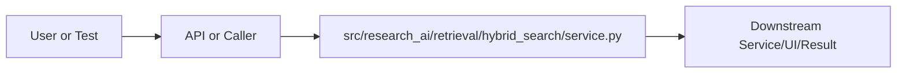

# service.py Explained

Generated educational companion for `src/research_ai/retrieval/hybrid_search/service.py`. This file is intentionally detailed so a developer can understand the code, architecture role, production tradeoffs, and ML/backend concepts behind the implementation.

## File Overview

`src/research_ai/retrieval/hybrid_search/service.py` is a Python module in the Retrieval layer: chunking, embeddings, FAISS, hybrid search, and reranking. It defines _BM25, HybridSearchService and no top-level functions.

## Why This File Exists

This file isolates one responsibility in the codebase: Retrieval layer: chunking, embeddings, FAISS, hybrid search, and reranking. Separation matters because AI systems are easier to test, scale, debug, and explain when retrieval, orchestration, ML services, memory, UI, and deployment scripts have clear boundaries.

## Workflow Position

**Layer:** Retrieval layer: chunking, embeddings, FAISS, hybrid search, and reranking.

**Previous step:** caller code, an API request, a browser event, a test fixture, an import, or a startup script prepares inputs.

**Current step:** `src/research_ai/retrieval/hybrid_search/service.py` performs its local responsibility.

**Next step:** downstream services, API responses, rendered UI, tests, or process execution consume the result.



## Inputs and Outputs

- **Inputs:** function arguments, class constructor dependencies, HTTP payloads, environment variables, filesystem artifacts, DOM events, or test fixtures.
- **Outputs:** return values, dictionaries, Pydantic models, rendered DOM state, API responses, logs, process startup, assertions, or side effects.
- **Serialization:** this project uses JSON for APIs/LLM planning, parquet/joblib/faiss for ML artifacts, and HTML/CSS/JS for the browser surface.

## Imports Explained

| Import | Explanation |
|---|---|
| `__future__` | Project or standard-library dependency used to import a service, type, helper, or runtime capability. Imports affect startup time, packaging, and test isolation. |
| `collections` | Project or standard-library dependency used to import a service, type, helper, or runtime capability. Imports affect startup time, packaging, and test isolation. |
| `logging` | logging provides structured operational visibility without using print statements. |
| `math` | Project or standard-library dependency used to import a service, type, helper, or runtime capability. Imports affect startup time, packaging, and test isolation. |
| `re` | re implements regular expressions for text extraction, validation, and secret redaction. |
| `research_ai` | Project or standard-library dependency used to import a service, type, helper, or runtime capability. Imports affect startup time, packaging, and test isolation. |

## Global Variables and Config

| Name | Line | Why it matters |
|---|---:|---|
| `logger` | 46 | Module-level value, constant, prompt, cache, registry, or configuration point. Check mutability and startup cost. |

## Step-by-Step Workflow

1. Load dependencies and runtime constants.
2. Accept input from the previous layer.
3. Validate, transform, route, score, render, or execute according to this file's role.
4. Return a structured output or perform a controlled side effect.
5. Let caller layers handle presentation, persistence, retries, or fallback.

## Function-by-Function Breakdown

No top-level functions are defined. Behavior is class-based, declarative, or provided through package exports.

## Class-by-Class Breakdown

### `_BM25`

- **Line:** 53
- **Base classes:** `object`
- **Docstring:** Okapi BM25 scorer over a small document set.

Formula (per query token t, document d):
    score(t, d) = IDF(t) × (tf(t,d) × (K1+1)) / (tf(t,d) + K1×(1 - B + B×|d|/avgdl))

Parameters:
    K1 = 1.5  — term-frequency saturation. Higher K1 gives more weight to
                high-frequency terms (aggressive TF scaling). Standard range 1.2–2.0.
    B  = 0.75 — document-length normalisation. B=1 full normalisation; B=0 none.
                0.75 is the widely validated default for document collections.

IDF formula used here is the smoothed Robertson IDF:
    IDF(t) = log((N - df(t) + 0.5) / (df(t) + 0.5) + 1)
The +1 inside the log keeps IDF positive even for tokens appearing in every doc.

**Methods:**
- `__init__` at line 73: method behavior is described by its body and name
- `_idf` at line 84: Robertson smoothed IDF, cached per token.
- `scores` at line 93: Return a BM25 score for each document against the query.
- `_tokenize` at line 111: Tokenize scientific text into lowercase word-like tokens.

BUG FIX (v3.1.1): original regex r"\b[a-z]{2,}\b" missed:
  - Alphanumeric model names: gpt3, t5, bert2, llama2, phi3
  - Pure numbers: 2019, 2023 (publication years used as filters)
  - Hyphenated terms: "pre-training" was split into "pre" and "training"
    (hyphen is not captured, but both parts are tokenized separately —
    this is actually fine for BM25 since both parts get scored)

Fix: include sequences of 2+ characters that are alphanumeric (letters
and/or digits), applied after lowercasing.

Examples:
  "GPT-4 achieves BLEU of 42.3" → ["gpt", "4", "achieves", "bleu", "of", "42", "3"]
  Wait — we need word boundaries with \b for alphanumeric:
  "gpt3" → ["gpt3"]   (correctly kept together)
  "pre-training" → ["pre", "training"]  (split at hyphen, both kept)
  "BERT" → ["bert"]
  "2023" → ["2023"]

```python
class _BM25:
    """Okapi BM25 scorer over a small document set.

    Formula (per query token t, document d):
        score(t, d) = IDF(t) × (tf(t,d) × (K1+1)) / (tf(t,d) + K1×(1 - B + B×|d|/avgdl))

    Parameters:
        K1 = 1.5  — term-frequency saturation. Higher K1 gives more weight to
                    high-frequency terms (aggressive TF scaling). Standard range 1.2–2.0.
        B  = 0.75 — document-length normalisation. B=1 full normalisation; B=0 none.
                    0.75 is the widely validated default for document collections.

    IDF formula used here is the smoothed Robertson IDF:
        IDF(t) = log((N - df(t) + 0.5) / (df(t) + 0.5) + 1)
    The +1 inside the log keeps IDF positive even for tokens appearing in every doc.
    """

    K1 = 1.5
    B = 0.75

    def __init__(self, documents: list[str]) -> None:
        self.docs: list[list[str]] = [self._tokenize(d) for d in documents]
        self.n = len(self.docs)
        self.avgdl = sum(len(d) for d in self.docs) / max(1, self.n)
        # df[token] = number of documents containing the token (for IDF)
        self.df: Counter = Counter()
        for doc in self.docs:
            for token in set(doc):  # set() so each doc contributes 1 per token
                self.df[token] += 1
        self.idf_cache: dict[str, float] = {}

    def _idf(self, token: str) -> float:
        """Robertson smoothed IDF, cached per token."""
        if token not in self.idf_cache:
            df = self.df.get(token, 0)
            self.idf_cache[token] = math.log(
                (self.n - df + 0.5) / (df + 0.5) + 1
            )
        return self.idf_cache[token]

    def scores(self, query: str) -> list[float]:
        """Return a BM25 score for each document against the query."""
        q_tokens = self._tokenize(query)
        result: list[float] = []
        for doc in self.docs:
            dl = len(doc)
            tf_map: Counter = Counter(doc)
            sc = 0.0
            for token in q_tokens:
                tf = tf_map.get(token, 0)
                idf = self._idf(token)
                num = tf * (self.K1 + 1)
                den = tf + self.K1 * (1 - self.B + self.B * dl / self.avgdl)
                sc += idf * num / max(den, 1e-9)
            result.append(sc)
        return result

    @staticmethod
    def _tokenize(text: str) -> list[str]:
        """Tokenize scientific text into lowercase word-like tokens.

        BUG FIX (v3.1.1): original regex r"\\b[a-z]{2,}\\b" missed:
          - Alphanumeric model names: gpt3, t5, bert2, llama2, phi3
          - Pure numbers: 2019, 2023 (publication years used as filters)
          - Hyphenated terms: "pre-training" was split into "pre" and "training"
            (hyphen is not captured, but both parts are tokenized separately —
            this is actually fine for BM25 since both parts get scored)

        Fix: include sequences of 2+ characters that are alphanumeric (letters
        and/or digits), applied after lowercasing.

        Examples:
          "GPT-4 achieves BLEU of 42.3" → ["gpt", "4", "achieves", "bleu", "of", "42", "3"]
          Wait — we need word boundaries with \\b for alphanumeric:
          "gpt3" → ["gpt3"]   (correctly kept together)
          "pre-training" → ["pre", "training"]  (split at hyphen, both kept)
          "BERT" → ["bert"]
          "2023" → ["2023"]
        """
        return re.findall(r"\b[a-z0-9][a-z0-9]{1,}\b", text.lower())
```

This class packages state and behavior behind a service-style interface. Constructor dependencies show what the class needs; public methods show what the rest of the system can ask it to do. In production, this boundary is where caching, model loading, artifact access, and error handling must be controlled.

### `HybridSearchService`

- **Line:** 139
- **Base classes:** `object`
- **Docstring:** Three-stage hybrid retrieval: FAISS semantic → BM25 keyword → reranking.

WEIGHTS (must sum to 1.0):
  SEMANTIC_WEIGHT = 0.60 — primary signal; handles paraphrases/synonyms
  BM25_WEIGHT     = 0.25 — exact-match boost for model names, datasets
  KEYWORD_WEIGHT  = 0.15 — passed to MetadataReranker for title overlap

The MetadataReranker applies keyword weight as:
    final_score = (1 - KEYWORD_WEIGHT) × fused_score + KEYWORD_WEIGHT × overlap
i.e.,   final_score = 0.85 × fused_score + 0.15 × keyword_overlap

CANDIDATE POOL SIZE
-------------------
We retrieve ``candidate_k`` docs from FAISS (default: min(60, top_k×5))
and then re-rank down to ``top_k``.  A larger pool improves recall at the
cost of more BM25/reranker compute.  60 is the practical sweet spot for
a typical 100k-paper index on CPU hardware.

THREAD SAFETY
-------------
HybridSearchService holds no mutable state after construction (BM25 is
built per-request from candidates).  It is safe to share across threads.

**Methods:**
- `__init__` at line 168: method behavior is described by its body and name
- `ready` at line 179: method behavior is described by its body and name
- `metadata` at line 183: method behavior is described by its body and name
- `search` at line 186: Execute hybrid retrieval and return ranked results.

Args:
    query:       Natural-language search query.
    top_k:       Final number of results to return.
    filters:     Optional metadata filters: {"category": "cs.LG", "year": "2023"}.
    candidate_k: FAISS candidate pool size before BM25+rerank.
                 Default: min(60, top_k × 5) — enough for good recall.

Returns:
    dict with keys: query, retrieval_strategy, results, count, candidate_count.
    On failure: {"error": "<message>"}.
- `_apply_bm25_fusion` at line 238: Fuse FAISS semantic scores with BM25 keyword scores.
- `_apply_filters` at line 269: method behavior is described by its body and name

```python
class HybridSearchService:
    """Three-stage hybrid retrieval: FAISS semantic → BM25 keyword → reranking.

    WEIGHTS (must sum to 1.0):
      SEMANTIC_WEIGHT = 0.60 — primary signal; handles paraphrases/synonyms
      BM25_WEIGHT     = 0.25 — exact-match boost for model names, datasets
      KEYWORD_WEIGHT  = 0.15 — passed to MetadataReranker for title overlap

    The MetadataReranker applies keyword weight as:
        final_score = (1 - KEYWORD_WEIGHT) × fused_score + KEYWORD_WEIGHT × overlap
    i.e.,   final_score = 0.85 × fused_score + 0.15 × keyword_overlap

    CANDIDATE POOL SIZE
    -------------------
    We retrieve ``candidate_k`` docs from FAISS (default: min(60, top_k×5))
    and then re-rank down to ``top_k``.  A larger pool improves recall at the
    cost of more BM25/reranker compute.  60 is the practical sweet spot for
    a typical 100k-paper index on CPU hardware.

    THREAD SAFETY
    -------------
    HybridSearchService holds no mutable state after construction (BM25 is
    built per-request from candidates).  It is safe to share across threads.
    """

    SEMANTIC_WEIGHT = 0.60
    BM25_WEIGHT = 0.25
    KEYWORD_WEIGHT = 0.15   # forwarded to MetadataReranker; must equal 1 - reranker_semantic_weight

    def __init__(
        self,
        embedding_service,
        vector_store,
        reranker: MetadataReranker | None = None,
    ) -> None:
        self.embedding_service = embedding_service
        self.vector_store = vector_store
        self.reranker = reranker or MetadataReranker()

    @property
    def ready(self) -> bool:
        return bool(self.vector_store.ready)

    @property
    def metadata(self):
        return self.vector_store.metadata

    def search(
        self,
        query: str,
        top_k: int = 5,
        filters: dict | None = None,
        candidate_k: int | None = None,
    ) -> dict:
        """Execute hybrid retrieval and return ranked results.

        Args:
            query:       Natural-language search query.
            top_k:       Final number of results to return.
            filters:     Optional metadata filters: {"category": "cs.LG", "year": "2023"}.
            candidate_k: FAISS candidate pool size before BM25+rerank.
                         Default: min(60, top_k × 5) — enough for good recall.

        Returns:
            dict with keys: query, retrieval_strategy, results, count, candidate_count.
            On failure: {"error": "<message>"}.
        """
        if not self.ready:
            return {"error": "Search index not ready. Build similarity artifacts first."}

        # Candidate pool: retrieve more than top_k from FAISS so BM25 and
        # the reranker have room to promote better-matching docs.
        # Formula: at least top_k, at most 60 (CPU memory/latency budget).
        candidate_count = max(top_k, candidate_k or min(60, max(top_k * 5, top_k)))

        # Stage 1: Semantic FAISS retrieval (cosine similarity via inner product
        # on L2-normalised vectors — see EmbeddingService.encode()).
        query_vec = self.embedding_service.encode([query])
        raw_docs = [doc.to_dict() for doc in self.vector_store.search(query_vec, candidate_count)]

        # Stage 2: BM25 fusion — re-ranks within the semantic candidate set.
        raw_docs = self._apply_bm25_fusion(query, raw_docs)

        # Stage 3: Metadata filter → MetadataReranker → truncate to top_k.
        raw_docs = self._apply_filters(raw_docs, filters or {})
        final_docs = self.reranker.rerank(query, raw_docs)[:top_k]

        return {
            "query": query,
            "retrieval_strategy": "hybrid_faiss_bm25_metadata",
            "results": final_docs,
            "count": len(final_docs),
            "candidate_count": len(raw_docs),
        }

    # ------------------------------------------------------------------
    # Private helpers
    # ------------------------------------------------------------------

    def _apply_bm25_fusion(self, query: str, docs: list[dict]) -> list[dict]:
        """Fuse FAISS semantic scores with BM25 keyword scores."""
```

This class packages state and behavior behind a service-style interface. Constructor dependencies show what the class needs; public methods show what the rest of the system can ask it to do. In production, this boundary is where caching, model loading, artifact access, and error handling must be controlled.


## Method-by-Method Deep Dive

### Class `_BM25` Methods

#### `_BM25.__init__`

- **Line:** 73
- **Kind:** synchronous method
- **Arguments:** self, documents
- **Docstring:** No explicit docstring; behavior is inferred from the implementation and call sites.

```python
    def __init__(self, documents: list[str]) -> None:
        self.docs: list[list[str]] = [self._tokenize(d) for d in documents]
        self.n = len(self.docs)
        self.avgdl = sum(len(d) for d in self.docs) / max(1, self.n)
        # df[token] = number of documents containing the token (for IDF)
        self.df: Counter = Counter()
        for doc in self.docs:
            for token in set(doc):  # set() so each doc contributes 1 per token
                self.df[token] += 1
        self.idf_cache: dict[str, float] = {}
```

This method is part of the class contract. Its inputs show what state or caller data it consumes; its body shows whether it performs pure transformation, model/artifact access, retrieval, I/O, caching, validation, or orchestration. In production review, pay attention to error handling, mutation of `self`, repeated expensive work, and whether return shapes stay stable for downstream callers.

#### `_BM25._idf`

- **Line:** 84
- **Kind:** synchronous method
- **Arguments:** self, token
- **Docstring:** Robertson smoothed IDF, cached per token.

```python
    def _idf(self, token: str) -> float:
        """Robertson smoothed IDF, cached per token."""
        if token not in self.idf_cache:
            df = self.df.get(token, 0)
            self.idf_cache[token] = math.log(
                (self.n - df + 0.5) / (df + 0.5) + 1
            )
        return self.idf_cache[token]
```

This method is part of the class contract. Its inputs show what state or caller data it consumes; its body shows whether it performs pure transformation, model/artifact access, retrieval, I/O, caching, validation, or orchestration. In production review, pay attention to error handling, mutation of `self`, repeated expensive work, and whether return shapes stay stable for downstream callers.

#### `_BM25.scores`

- **Line:** 93
- **Kind:** synchronous method
- **Arguments:** self, query
- **Docstring:** Return a BM25 score for each document against the query.

```python
    def scores(self, query: str) -> list[float]:
        """Return a BM25 score for each document against the query."""
        q_tokens = self._tokenize(query)
        result: list[float] = []
        for doc in self.docs:
            dl = len(doc)
            tf_map: Counter = Counter(doc)
            sc = 0.0
            for token in q_tokens:
                tf = tf_map.get(token, 0)
                idf = self._idf(token)
                num = tf * (self.K1 + 1)
                den = tf + self.K1 * (1 - self.B + self.B * dl / self.avgdl)
                sc += idf * num / max(den, 1e-9)
            result.append(sc)
        return result
```

This method is part of the class contract. Its inputs show what state or caller data it consumes; its body shows whether it performs pure transformation, model/artifact access, retrieval, I/O, caching, validation, or orchestration. In production review, pay attention to error handling, mutation of `self`, repeated expensive work, and whether return shapes stay stable for downstream callers.

#### `_BM25._tokenize`

- **Line:** 111
- **Kind:** synchronous method
- **Arguments:** text
- **Docstring:** Tokenize scientific text into lowercase word-like tokens.

BUG FIX (v3.1.1): original regex r"\b[a-z]{2,}\b" missed:
  - Alphanumeric model names: gpt3, t5, bert2, llama2, phi3
  - Pure numbers: 2019, 2023 (publication years used as filters)
  - Hyphenated terms: "pre-training" was split into "pre" and "training"
    (hyphen is not captured, but both parts are tokenized separately —
    this is actually fine for BM25 since both parts get scored)

Fix: include sequences of 2+ characters that are alphanumeric (letters
and/or digits), applied after lowercasing.

Examples:
  "GPT-4 achieves BLEU of 42.3" → ["gpt", "4", "achieves", "bleu", "of", "42", "3"]
  Wait — we need word boundaries with \b for alphanumeric:
  "gpt3" → ["gpt3"]   (correctly kept together)
  "pre-training" → ["pre", "training"]  (split at hyphen, both kept)
  "BERT" → ["bert"]
  "2023" → ["2023"]

```python
    def _tokenize(text: str) -> list[str]:
        """Tokenize scientific text into lowercase word-like tokens.

        BUG FIX (v3.1.1): original regex r"\\b[a-z]{2,}\\b" missed:
          - Alphanumeric model names: gpt3, t5, bert2, llama2, phi3
          - Pure numbers: 2019, 2023 (publication years used as filters)
          - Hyphenated terms: "pre-training" was split into "pre" and "training"
            (hyphen is not captured, but both parts are tokenized separately —
            this is actually fine for BM25 since both parts get scored)

        Fix: include sequences of 2+ characters that are alphanumeric (letters
        and/or digits), applied after lowercasing.

        Examples:
          "GPT-4 achieves BLEU of 42.3" → ["gpt", "4", "achieves", "bleu", "of", "42", "3"]
          Wait — we need word boundaries with \\b for alphanumeric:
          "gpt3" → ["gpt3"]   (correctly kept together)
          "pre-training" → ["pre", "training"]  (split at hyphen, both kept)
          "BERT" → ["bert"]
          "2023" → ["2023"]
        """
        return re.findall(r"\b[a-z0-9][a-z0-9]{1,}\b", text.lower())
```

This method is part of the class contract. Its inputs show what state or caller data it consumes; its body shows whether it performs pure transformation, model/artifact access, retrieval, I/O, caching, validation, or orchestration. In production review, pay attention to error handling, mutation of `self`, repeated expensive work, and whether return shapes stay stable for downstream callers.

### Class `HybridSearchService` Methods

#### `HybridSearchService.__init__`

- **Line:** 168
- **Kind:** synchronous method
- **Arguments:** self, embedding_service, vector_store, reranker
- **Docstring:** No explicit docstring; behavior is inferred from the implementation and call sites.

```python
    def __init__(
        self,
        embedding_service,
        vector_store,
        reranker: MetadataReranker | None = None,
    ) -> None:
        self.embedding_service = embedding_service
        self.vector_store = vector_store
        self.reranker = reranker or MetadataReranker()
```

This method is part of the class contract. Its inputs show what state or caller data it consumes; its body shows whether it performs pure transformation, model/artifact access, retrieval, I/O, caching, validation, or orchestration. In production review, pay attention to error handling, mutation of `self`, repeated expensive work, and whether return shapes stay stable for downstream callers.

#### `HybridSearchService.ready`

- **Line:** 179
- **Kind:** synchronous method
- **Arguments:** self
- **Docstring:** No explicit docstring; behavior is inferred from the implementation and call sites.

```python
    def ready(self) -> bool:
        return bool(self.vector_store.ready)
```

This method is part of the class contract. Its inputs show what state or caller data it consumes; its body shows whether it performs pure transformation, model/artifact access, retrieval, I/O, caching, validation, or orchestration. In production review, pay attention to error handling, mutation of `self`, repeated expensive work, and whether return shapes stay stable for downstream callers.

#### `HybridSearchService.metadata`

- **Line:** 183
- **Kind:** synchronous method
- **Arguments:** self
- **Docstring:** No explicit docstring; behavior is inferred from the implementation and call sites.

```python
    def metadata(self):
        return self.vector_store.metadata
```

This method is part of the class contract. Its inputs show what state or caller data it consumes; its body shows whether it performs pure transformation, model/artifact access, retrieval, I/O, caching, validation, or orchestration. In production review, pay attention to error handling, mutation of `self`, repeated expensive work, and whether return shapes stay stable for downstream callers.

#### `HybridSearchService.search`

- **Line:** 186
- **Kind:** synchronous method
- **Arguments:** self, query, top_k, filters, candidate_k
- **Docstring:** Execute hybrid retrieval and return ranked results.

Args:
    query:       Natural-language search query.
    top_k:       Final number of results to return.
    filters:     Optional metadata filters: {"category": "cs.LG", "year": "2023"}.
    candidate_k: FAISS candidate pool size before BM25+rerank.
                 Default: min(60, top_k × 5) — enough for good recall.

Returns:
    dict with keys: query, retrieval_strategy, results, count, candidate_count.
    On failure: {"error": "<message>"}.

```python
    def search(
        self,
        query: str,
        top_k: int = 5,
        filters: dict | None = None,
        candidate_k: int | None = None,
    ) -> dict:
        """Execute hybrid retrieval and return ranked results.

        Args:
            query:       Natural-language search query.
            top_k:       Final number of results to return.
            filters:     Optional metadata filters: {"category": "cs.LG", "year": "2023"}.
            candidate_k: FAISS candidate pool size before BM25+rerank.
                         Default: min(60, top_k × 5) — enough for good recall.

        Returns:
            dict with keys: query, retrieval_strategy, results, count, candidate_count.
            On failure: {"error": "<message>"}.
        """
        if not self.ready:
            return {"error": "Search index not ready. Build similarity artifacts first."}

        # Candidate pool: retrieve more than top_k from FAISS so BM25 and
        # the reranker have room to promote better-matching docs.
        # Formula: at least top_k, at most 60 (CPU memory/latency budget).
        candidate_count = max(top_k, candidate_k or min(60, max(top_k * 5, top_k)))

        # Stage 1: Semantic FAISS retrieval (cosine similarity via inner product
        # on L2-normalised vectors — see EmbeddingService.encode()).
        query_vec = self.embedding_service.encode([query])
        raw_docs = [doc.to_dict() for doc in self.vector_store.search(query_vec, candidate_count)]

        # Stage 2: BM25 fusion — re-ranks within the semantic candidate set.
        raw_docs = self._apply_bm25_fusion(query, raw_docs)

        # Stage 3: Metadata filter → MetadataReranker → truncate to top_k.
        raw_docs = self._apply_filters(raw_docs, filters or {})
        final_docs = self.reranker.rerank(query, raw_docs)[:top_k]

        return {
            "query": query,
            "retrieval_strategy": "hybrid_faiss_bm25_metadata",
            "results": final_docs,
            "count": len(final_docs),
            "candidate_count": len(raw_docs),
        }
```

This method is part of the class contract. Its inputs show what state or caller data it consumes; its body shows whether it performs pure transformation, model/artifact access, retrieval, I/O, caching, validation, or orchestration. In production review, pay attention to error handling, mutation of `self`, repeated expensive work, and whether return shapes stay stable for downstream callers.

#### `HybridSearchService._apply_bm25_fusion`

- **Line:** 238
- **Kind:** synchronous method
- **Arguments:** self, query, docs
- **Docstring:** Fuse FAISS semantic scores with BM25 keyword scores.

```python
    def _apply_bm25_fusion(self, query: str, docs: list[dict]) -> list[dict]:
        """Fuse FAISS semantic scores with BM25 keyword scores."""
        if not docs:
            return docs

        # Build BM25 index lazily over the retrieved candidates
        texts = [f"{d.get('title', '')} {d.get('abstract', '')}" for d in docs]
        bm25 = _BM25(texts)
        bm25_scores = bm25.scores(query)

        if not bm25_scores or max(bm25_scores) == 0:
            return docs

        max_bm25 = max(bm25_scores)
        fused: list[dict] = []
        for doc, bm25_score in zip(docs, bm25_scores):
            semantic_score = float(doc.get("score", 0.0))
            normalised_bm25 = bm25_score / max_bm25
            fused_score = (
                self.SEMANTIC_WEIGHT * semantic_score
                + self.BM25_WEIGHT * normalised_bm25
            )
            item = dict(doc)
            item["semantic_score"] = round(semantic_score, 4)
            item["bm25_score"] = round(normalised_bm25, 4)
            item["score"] = round(fused_score, 4)
            fused.append(item)

        return sorted(fused, key=lambda d: d["score"], reverse=True)
```

This method is part of the class contract. Its inputs show what state or caller data it consumes; its body shows whether it performs pure transformation, model/artifact access, retrieval, I/O, caching, validation, or orchestration. In production review, pay attention to error handling, mutation of `self`, repeated expensive work, and whether return shapes stay stable for downstream callers.

#### `HybridSearchService._apply_filters`

- **Line:** 269
- **Kind:** synchronous method
- **Arguments:** docs, filters
- **Docstring:** No explicit docstring; behavior is inferred from the implementation and call sites.

```python
    def _apply_filters(docs: list[dict], filters: dict) -> list[dict]:
        category = str(filters.get("category", "")).strip().lower()
        year = str(filters.get("year", "")).strip()
        if not category and not year:
            return docs
        out: list[dict] = []
        for doc in docs:
            if category and category not in str(doc.get("category", "")).lower():
                continue
            if year and year != str(doc.get("year", "")):
                continue
            out.append(doc)
        return out
```

This method is part of the class contract. Its inputs show what state or caller data it consumes; its body shows whether it performs pure transformation, model/artifact access, retrieval, I/O, caching, validation, or orchestration. In production review, pay attention to error handling, mutation of `self`, repeated expensive work, and whether return shapes stay stable for downstream callers.

## Important Algorithms Used

- **Embeddings**: Embeddings map text into dense semantic vectors so conceptual similarity becomes geometric similarity.
- **Vector Normalization**: Unit-normalized vectors let inner product approximate cosine similarity, a common FAISS retrieval design.
- **FAISS Indexing**: FAISS indexes dense vectors for nearest-neighbor search. Exact flat indexes trade speed at huge scale for simplicity and correctness.
- **Hybrid Retrieval**: Hybrid retrieval combines semantic vectors with lexical/keyword evidence, improving scientific search where exact terms matter.
- **Transformers**: Transformers use tokenization and attention layers for language understanding/generation. They are powerful but memory and latency sensitive.
- **Caching**: Caching avoids repeating expensive work such as model loading, embedding generation, or client initialization.
- **Streaming**: Streaming improves perceived latency by sending incremental output instead of waiting for full completion.
- **Sandboxing**: Sandboxing validates and constrains user code before execution, reducing security and stability risk.

## Libraries Used

| Import | Explanation |
|---|---|
| `__future__` | Project or standard-library dependency used to import a service, type, helper, or runtime capability. Imports affect startup time, packaging, and test isolation. |
| `collections` | Project or standard-library dependency used to import a service, type, helper, or runtime capability. Imports affect startup time, packaging, and test isolation. |
| `logging` | logging provides structured operational visibility without using print statements. |
| `math` | Project or standard-library dependency used to import a service, type, helper, or runtime capability. Imports affect startup time, packaging, and test isolation. |
| `re` | re implements regular expressions for text extraction, validation, and secret redaction. |
| `research_ai` | Project or standard-library dependency used to import a service, type, helper, or runtime capability. Imports affect startup time, packaging, and test isolation. |

## ML Concepts Used

- **Embeddings**: Embeddings map text into dense semantic vectors so conceptual similarity becomes geometric similarity.
- **Vector Normalization**: Unit-normalized vectors let inner product approximate cosine similarity, a common FAISS retrieval design.
- **FAISS Indexing**: FAISS indexes dense vectors for nearest-neighbor search. Exact flat indexes trade speed at huge scale for simplicity and correctness.
- **Hybrid Retrieval**: Hybrid retrieval combines semantic vectors with lexical/keyword evidence, improving scientific search where exact terms matter.
- **Transformers**: Transformers use tokenization and attention layers for language understanding/generation. They are powerful but memory and latency sensitive.
- **Caching**: Caching avoids repeating expensive work such as model loading, embedding generation, or client initialization.
- **Streaming**: Streaming improves perceived latency by sending incremental output instead of waiting for full completion.
- **Sandboxing**: Sandboxing validates and constrains user code before execution, reducing security and stability risk.

## Performance and Memory Notes

- Avoid eager loading of heavy ML models unless startup latency is acceptable.
- Cache expensive clients, tokenizers, vector stores, and embeddings carefully.
- Use float32 for embedding vectors because it halves memory compared with float64 and matches FAISS/neural inference expectations.
- Bound prompt length, uploaded content, result counts, and token budgets to control latency and memory.
- Watch copies of large metadata frames, embedding matrices, and file buffers.

## Scalability Notes

- In-memory state works for local demos but needs Redis/database/object storage for multi-worker cloud deployment.
- CPU/GPU inference should often be separated from the web API when traffic grows.
- Retrieval can start exact and move to approximate indexes as corpus size grows.
- Batch operations and cache repeated work to improve throughput.
- Add metrics for latency, errors, fallback frequency, retrieval hit rate, and token usage.

## Production Engineering Notes

- Keep interfaces stable because other files may import this module or depend on its response shape.
- Prefer typed/structured data over free-form strings at service boundaries.
- Log operational context without secrets or huge payloads.
- Make fallback behavior explicit so users get useful output even when LLMs or artifacts fail.
- Keep provider-specific logic behind adapters so Groq/OpenRouter/Google/Ollama can be swapped.

## Common Bugs and Failure Cases

- Missing `.env` values, model artifacts, or Ollama models can trigger degraded behavior.
- Type mismatches occur when LLM-generated tool arguments cross into strict Python code.
- Empty retrieval results must not become hallucinated answers.
- Network calls need timeouts and careful retry behavior.
- Frontend IDs/classes and API schemas are contracts; changing one side without the other breaks workflows.

## Security Considerations

- Handles credentials or environment configuration. Keep secrets in environment variables and redact them from logs.
- Deals with execution or subprocesses. Maintain AST validation, isolated mode, timeouts, and least privilege.

## Real Industry Usage

- This pattern appears in enterprise RAG assistants, scientific search tools, internal research copilots, and ML platform demos.
- The layered design mirrors production systems: API facade, orchestration, retrieval, evaluation, synthesis, UI, and deployment.
- Clear separation lets teams replace model providers, improve retrieval, harden security, or redesign UI independently.

## Optimization Opportunities

- Add tracing around each workflow step.
- Strengthen schema validation at boundaries.
- Persist conversation/session state outside process memory.
- Add load tests and adversarial tests for prompt injection, empty evidence, and large uploads.
- Consider approximate vector indexes, reranker models, or batching when corpus/traffic grows.

## How This Connects To Other Files

- `src/research_ai/retrieval/hybrid_search/service.py` is connected through imports, startup scripts, API routes, frontend selectors, tests, or artifact paths.
- `src/research_ai/platform.py` is the backend composition root.
- `src/research_ai/api/main.py` exposes backend behavior over HTTP.
- Retrieval modules depend on artifacts under `artifacts/`.
- Frontend files depend on stable endpoint and DOM contracts.

## End-to-End Flow Summary

- A user/browser/test/startup event enters the system.
- The relevant layer validates or normalizes input.
- Retrieval, ML, orchestration, execution, or UI rendering happens.
- A structured result, visual state, or process side effect is produced.
- Fallbacks and tests keep behavior understandable when dependencies are unavailable.

## Interview Questions

1. What responsibility does this file own?
2. What inputs and outputs define its contract?
3. Which dependencies are expensive or operationally risky?
4. What breaks if this file changes shape?
5. How would you scale or test this behavior in production?

## Key Takeaways

- `src/research_ai/retrieval/hybrid_search/service.py` should be understood as part of a layered AI research platform.
- Trace data flow from inputs to transformations to outputs.
- Production readiness comes from explicit contracts, bounded resources, observability, secure defaults, and graceful fallback.

## Fully Commented Source

This section repeats the original source with an explanatory comment before every line. The comments are educational only; they are not inserted into the production source file.

```python
# L0001: Starts, ends, or continues a docstring that documents module, class, or function intent.
"""Hybrid retrieval: FAISS semantic + BM25 keyword + metadata reranking.
# L0002: Blank line that visually separates logical sections and improves readability.

# L0003: Executes Python logic as part of this file's workflow; read surrounding lines for data flow and side effects.
THREE-STAGE PIPELINE
# L0004: Executes Python logic as part of this file's workflow; read surrounding lines for data flow and side effects.
--------------------
# L0005: Executes Python logic as part of this file's workflow; read surrounding lines for data flow and side effects.
Stage 1 — Semantic FAISS  (weight 0.60):
# L0006: Executes Python logic as part of this file's workflow; read surrounding lines for data flow and side effects.
  Embed the query with SentenceTransformer, run IndexFlatIP (inner product ≡
# L0007: Executes Python logic as part of this file's workflow; read surrounding lines for data flow and side effects.
  cosine similarity for L2-normalised vectors), retrieve ``candidate_k`` docs.
# L0008: Executes Python logic as part of this file's workflow; read surrounding lines for data flow and side effects.
  Fast: O(d × N) with FAISS BLAS, typically <10ms for 100k vectors.
# L0009: Blank line that visually separates logical sections and improves readability.

# L0010: Executes Python logic as part of this file's workflow; read surrounding lines for data flow and side effects.
Stage 2 — BM25 keyword fusion  (weight 0.25):
# L0011: Executes Python logic as part of this file's workflow; read surrounding lines for data flow and side effects.
  Apply Okapi BM25 to the candidate set returned by Stage 1.
# L0012: Executes Python logic as part of this file's workflow; read surrounding lines for data flow and side effects.
  IMPORTANT DESIGN NOTE: BM25 runs over the ~60-doc candidate set, NOT the
# L0013: Executes Python logic as part of this file's workflow; read surrounding lines for data flow and side effects.
  full corpus.  This is intentional for two reasons:
# L0014: Executes Python logic as part of this file's workflow; read surrounding lines for data flow and side effects.
    a) Building a full-corpus BM25 index at startup would require loading all
# L0015: Executes Python logic as part of this file's workflow; read surrounding lines for data flow and side effects.
       abstracts into RAM and rebuilding every time the FAISS index changes.
# L0016: Executes Python logic as part of this file's workflow; read surrounding lines for data flow and side effects.
    b) The candidate set is already semantically relevant; BM25 re-ranks within
# L0017: Executes Python logic as part of this file's workflow; read surrounding lines for data flow and side effects.
       that relevant slice, which is exactly what we want.
# L0018: Executes Python logic as part of this file's workflow; read surrounding lines for data flow and side effects.
  The trade-off is that IDF values are computed over 60 docs rather than 100k,
# L0019: Executes Python logic as part of this file's workflow; read surrounding lines for data flow and side effects.
  making rare-in-candidates terms score higher than in full-corpus BM25.
# L0020: Executes Python logic as part of this file's workflow; read surrounding lines for data flow and side effects.
  In practice this is acceptable because the candidates are already on-topic,
# L0021: Executes Python logic as part of this file's workflow; read surrounding lines for data flow and side effects.
  so the IDF signal correctly distinguishes within-topic specificity.
# L0022: Blank line that visually separates logical sections and improves readability.

# L0023: Executes Python logic as part of this file's workflow; read surrounding lines for data flow and side effects.
Stage 3 — Metadata reranking  (weight 0.15, via MetadataReranker):
# L0024: Executes Python logic as part of this file's workflow; read surrounding lines for data flow and side effects.
  Keyword overlap between query tokens and doc tokens, re-weighted:
# L0025: Assigns or updates a value used later in the workflow; check mutability and data shape.
    hybrid_score = 0.85 × fused_score + 0.15 × keyword_overlap
# L0026: Executes Python logic as part of this file's workflow; read surrounding lines for data flow and side effects.
  This gives a small extra boost to docs whose title/abstract literally contain
# L0027: Executes Python logic as part of this file's workflow; read surrounding lines for data flow and side effects.
  query words that the embedding model may have mapped to synonyms.
# L0028: Blank line that visually separates logical sections and improves readability.

# L0029: Executes Python logic as part of this file's workflow; read surrounding lines for data flow and side effects.
WEIGHT RATIONALE
# L0030: Executes Python logic as part of this file's workflow; read surrounding lines for data flow and side effects.
----------------
# L0031: Executes Python logic as part of this file's workflow; read surrounding lines for data flow and side effects.
0.60 semantic: embeddings capture meaning across paraphrases and synonyms.
# L0032: Executes Python logic as part of this file's workflow; read surrounding lines for data flow and side effects.
0.25 BM25:     exact-match keyword signals are critical for model names (BERT,
# L0033: Executes Python logic as part of this file's workflow; read surrounding lines for data flow and side effects.
               GPT-4), datasets (CIFAR-10), and specific metric names (BLEU).
# L0034: Executes Python logic as part of this file's workflow; read surrounding lines for data flow and side effects.
0.15 metadata: title-level keyword overlap is the strongest lexical signal but
# L0035: Executes Python logic as part of this file's workflow; read surrounding lines for data flow and side effects.
               is already partially captured by BM25, so it gets less weight.
# L0036: Starts, ends, or continues a docstring that documents module, class, or function intent.
"""
# L0037: Enables future Python behavior so annotations/import semantics stay modern and predictable.
from __future__ import annotations
# L0038: Blank line that visually separates logical sections and improves readability.

# L0039: Imports a dependency, type, or project module needed by later code in this file.
import logging
# L0040: Imports a dependency, type, or project module needed by later code in this file.
import math
# L0041: Imports a dependency, type, or project module needed by later code in this file.
import re
# L0042: Imports a dependency, type, or project module needed by later code in this file.
from collections import Counter
# L0043: Blank line that visually separates logical sections and improves readability.

# L0044: Imports a dependency, type, or project module needed by later code in this file.
from research_ai.retrieval.rerankers import MetadataReranker
# L0045: Blank line that visually separates logical sections and improves readability.

# L0046: Assigns or updates a value used later in the workflow; check mutability and data shape.
logger = logging.getLogger(__name__)
# L0047: Blank line that visually separates logical sections and improves readability.

# L0048: Blank line that visually separates logical sections and improves readability.

# L0049: Developer comment explaining intent, caveat, section boundary, or operational reasoning.
# ---------------------------------------------------------------------------
# L0050: Developer comment explaining intent, caveat, section boundary, or operational reasoning.
# Lightweight BM25 implementation (no extra dependencies)
# L0051: Developer comment explaining intent, caveat, section boundary, or operational reasoning.
# ---------------------------------------------------------------------------
# L0052: Blank line that visually separates logical sections and improves readability.

# L0053: Defines a class that groups related state and behavior behind a reusable interface.
class _BM25:
# L0054: Starts, ends, or continues a docstring that documents module, class, or function intent.
    """Okapi BM25 scorer over a small document set.
# L0055: Blank line that visually separates logical sections and improves readability.

# L0056: Executes Python logic as part of this file's workflow; read surrounding lines for data flow and side effects.
    Formula (per query token t, document d):
# L0057: Assigns or updates a value used later in the workflow; check mutability and data shape.
        score(t, d) = IDF(t) × (tf(t,d) × (K1+1)) / (tf(t,d) + K1×(1 - B + B×|d|/avgdl))
# L0058: Blank line that visually separates logical sections and improves readability.

# L0059: Executes Python logic as part of this file's workflow; read surrounding lines for data flow and side effects.
    Parameters:
# L0060: Assigns or updates a value used later in the workflow; check mutability and data shape.
        K1 = 1.5  — term-frequency saturation. Higher K1 gives more weight to
# L0061: Executes Python logic as part of this file's workflow; read surrounding lines for data flow and side effects.
                    high-frequency terms (aggressive TF scaling). Standard range 1.2–2.0.
# L0062: Assigns or updates a value used later in the workflow; check mutability and data shape.
        B  = 0.75 — document-length normalisation. B=1 full normalisation; B=0 none.
# L0063: Executes Python logic as part of this file's workflow; read surrounding lines for data flow and side effects.
                    0.75 is the widely validated default for document collections.
# L0064: Blank line that visually separates logical sections and improves readability.

# L0065: Executes Python logic as part of this file's workflow; read surrounding lines for data flow and side effects.
    IDF formula used here is the smoothed Robertson IDF:
# L0066: Assigns or updates a value used later in the workflow; check mutability and data shape.
        IDF(t) = log((N - df(t) + 0.5) / (df(t) + 0.5) + 1)
# L0067: Executes Python logic as part of this file's workflow; read surrounding lines for data flow and side effects.
    The +1 inside the log keeps IDF positive even for tokens appearing in every doc.
# L0068: Starts, ends, or continues a docstring that documents module, class, or function intent.
    """
# L0069: Blank line that visually separates logical sections and improves readability.

# L0070: Assigns or updates a value used later in the workflow; check mutability and data shape.
    K1 = 1.5
# L0071: Assigns or updates a value used later in the workflow; check mutability and data shape.
    B = 0.75
# L0072: Blank line that visually separates logical sections and improves readability.

# L0073: Defines a function or method; parameters are the input contract and the body implements the workflow.
    def __init__(self, documents: list[str]) -> None:
# L0074: Assigns or updates a value used later in the workflow; check mutability and data shape.
        self.docs: list[list[str]] = [self._tokenize(d) for d in documents]
# L0075: Assigns or updates a value used later in the workflow; check mutability and data shape.
        self.n = len(self.docs)
# L0076: Assigns or updates a value used later in the workflow; check mutability and data shape.
        self.avgdl = sum(len(d) for d in self.docs) / max(1, self.n)
# L0077: Developer comment explaining intent, caveat, section boundary, or operational reasoning.
        # df[token] = number of documents containing the token (for IDF)
# L0078: Assigns or updates a value used later in the workflow; check mutability and data shape.
        self.df: Counter = Counter()
# L0079: Iterates over data, retry attempts, files, results, or workflow steps.
        for doc in self.docs:
# L0080: Iterates over data, retry attempts, files, results, or workflow steps.
            for token in set(doc):  # set() so each doc contributes 1 per token
# L0081: Assigns or updates a value used later in the workflow; check mutability and data shape.
                self.df[token] += 1
# L0082: Assigns or updates a value used later in the workflow; check mutability and data shape.
        self.idf_cache: dict[str, float] = {}
# L0083: Blank line that visually separates logical sections and improves readability.

# L0084: Defines a function or method; parameters are the input contract and the body implements the workflow.
    def _idf(self, token: str) -> float:
# L0085: Starts, ends, or continues a docstring that documents module, class, or function intent.
        """Robertson smoothed IDF, cached per token."""
# L0086: Branches execution based on a condition, usually for validation, fallback, or mode-specific behavior.
        if token not in self.idf_cache:
# L0087: Assigns or updates a value used later in the workflow; check mutability and data shape.
            df = self.df.get(token, 0)
# L0088: Assigns or updates a value used later in the workflow; check mutability and data shape.
            self.idf_cache[token] = math.log(
# L0089: Executes Python logic as part of this file's workflow; read surrounding lines for data flow and side effects.
                (self.n - df + 0.5) / (df + 0.5) + 1
# L0090: Executes Python logic as part of this file's workflow; read surrounding lines for data flow and side effects.
            )
# L0091: Returns the computed result to the caller; this shape becomes part of the downstream contract.
        return self.idf_cache[token]
# L0092: Blank line that visually separates logical sections and improves readability.

# L0093: Defines a function or method; parameters are the input contract and the body implements the workflow.
    def scores(self, query: str) -> list[float]:
# L0094: Starts, ends, or continues a docstring that documents module, class, or function intent.
        """Return a BM25 score for each document against the query."""
# L0095: Assigns or updates a value used later in the workflow; check mutability and data shape.
        q_tokens = self._tokenize(query)
# L0096: Assigns or updates a value used later in the workflow; check mutability and data shape.
        result: list[float] = []
# L0097: Iterates over data, retry attempts, files, results, or workflow steps.
        for doc in self.docs:
# L0098: Assigns or updates a value used later in the workflow; check mutability and data shape.
            dl = len(doc)
# L0099: Assigns or updates a value used later in the workflow; check mutability and data shape.
            tf_map: Counter = Counter(doc)
# L0100: Assigns or updates a value used later in the workflow; check mutability and data shape.
            sc = 0.0
# L0101: Iterates over data, retry attempts, files, results, or workflow steps.
            for token in q_tokens:
# L0102: Assigns or updates a value used later in the workflow; check mutability and data shape.
                tf = tf_map.get(token, 0)
# L0103: Assigns or updates a value used later in the workflow; check mutability and data shape.
                idf = self._idf(token)
# L0104: Assigns or updates a value used later in the workflow; check mutability and data shape.
                num = tf * (self.K1 + 1)
# L0105: Assigns or updates a value used later in the workflow; check mutability and data shape.
                den = tf + self.K1 * (1 - self.B + self.B * dl / self.avgdl)
# L0106: Assigns or updates a value used later in the workflow; check mutability and data shape.
                sc += idf * num / max(den, 1e-9)
# L0107: Executes Python logic as part of this file's workflow; read surrounding lines for data flow and side effects.
            result.append(sc)
# L0108: Returns the computed result to the caller; this shape becomes part of the downstream contract.
        return result
# L0109: Blank line that visually separates logical sections and improves readability.

# L0110: Decorator that modifies the function/class below, commonly for routing, dataclasses, caching, or properties.
    @staticmethod
# L0111: Defines a function or method; parameters are the input contract and the body implements the workflow.
    def _tokenize(text: str) -> list[str]:
# L0112: Starts, ends, or continues a docstring that documents module, class, or function intent.
        """Tokenize scientific text into lowercase word-like tokens.
# L0113: Blank line that visually separates logical sections and improves readability.

# L0114: Executes Python logic as part of this file's workflow; read surrounding lines for data flow and side effects.
        BUG FIX (v3.1.1): original regex r"\\b[a-z]{2,}\\b" missed:
# L0115: Executes Python logic as part of this file's workflow; read surrounding lines for data flow and side effects.
          - Alphanumeric model names: gpt3, t5, bert2, llama2, phi3
# L0116: Executes Python logic as part of this file's workflow; read surrounding lines for data flow and side effects.
          - Pure numbers: 2019, 2023 (publication years used as filters)
# L0117: Executes Python logic as part of this file's workflow; read surrounding lines for data flow and side effects.
          - Hyphenated terms: "pre-training" was split into "pre" and "training"
# L0118: Executes Python logic as part of this file's workflow; read surrounding lines for data flow and side effects.
            (hyphen is not captured, but both parts are tokenized separately —
# L0119: Executes Python logic as part of this file's workflow; read surrounding lines for data flow and side effects.
            this is actually fine for BM25 since both parts get scored)
# L0120: Blank line that visually separates logical sections and improves readability.

# L0121: Executes Python logic as part of this file's workflow; read surrounding lines for data flow and side effects.
        Fix: include sequences of 2+ characters that are alphanumeric (letters
# L0122: Executes Python logic as part of this file's workflow; read surrounding lines for data flow and side effects.
        and/or digits), applied after lowercasing.
# L0123: Blank line that visually separates logical sections and improves readability.

# L0124: Executes Python logic as part of this file's workflow; read surrounding lines for data flow and side effects.
        Examples:
# L0125: Executes Python logic as part of this file's workflow; read surrounding lines for data flow and side effects.
          "GPT-4 achieves BLEU of 42.3" → ["gpt", "4", "achieves", "bleu", "of", "42", "3"]
# L0126: Executes Python logic as part of this file's workflow; read surrounding lines for data flow and side effects.
          Wait — we need word boundaries with \\b for alphanumeric:
# L0127: Executes Python logic as part of this file's workflow; read surrounding lines for data flow and side effects.
          "gpt3" → ["gpt3"]   (correctly kept together)
# L0128: Executes Python logic as part of this file's workflow; read surrounding lines for data flow and side effects.
          "pre-training" → ["pre", "training"]  (split at hyphen, both kept)
# L0129: Executes Python logic as part of this file's workflow; read surrounding lines for data flow and side effects.
          "BERT" → ["bert"]
# L0130: Executes Python logic as part of this file's workflow; read surrounding lines for data flow and side effects.
          "2023" → ["2023"]
# L0131: Starts, ends, or continues a docstring that documents module, class, or function intent.
        """
# L0132: Returns the computed result to the caller; this shape becomes part of the downstream contract.
        return re.findall(r"\b[a-z0-9][a-z0-9]{1,}\b", text.lower())
# L0133: Blank line that visually separates logical sections and improves readability.

# L0134: Blank line that visually separates logical sections and improves readability.

# L0135: Developer comment explaining intent, caveat, section boundary, or operational reasoning.
# ---------------------------------------------------------------------------
# L0136: Developer comment explaining intent, caveat, section boundary, or operational reasoning.
# Hybrid Search Service
# L0137: Developer comment explaining intent, caveat, section boundary, or operational reasoning.
# ---------------------------------------------------------------------------
# L0138: Blank line that visually separates logical sections and improves readability.

# L0139: Defines a class that groups related state and behavior behind a reusable interface.
class HybridSearchService:
# L0140: Starts, ends, or continues a docstring that documents module, class, or function intent.
    """Three-stage hybrid retrieval: FAISS semantic → BM25 keyword → reranking.
# L0141: Blank line that visually separates logical sections and improves readability.

# L0142: Executes Python logic as part of this file's workflow; read surrounding lines for data flow and side effects.
    WEIGHTS (must sum to 1.0):
# L0143: Assigns or updates a value used later in the workflow; check mutability and data shape.
      SEMANTIC_WEIGHT = 0.60 — primary signal; handles paraphrases/synonyms
# L0144: Assigns or updates a value used later in the workflow; check mutability and data shape.
      BM25_WEIGHT     = 0.25 — exact-match boost for model names, datasets
# L0145: Assigns or updates a value used later in the workflow; check mutability and data shape.
      KEYWORD_WEIGHT  = 0.15 — passed to MetadataReranker for title overlap
# L0146: Blank line that visually separates logical sections and improves readability.

# L0147: Executes Python logic as part of this file's workflow; read surrounding lines for data flow and side effects.
    The MetadataReranker applies keyword weight as:
# L0148: Assigns or updates a value used later in the workflow; check mutability and data shape.
        final_score = (1 - KEYWORD_WEIGHT) × fused_score + KEYWORD_WEIGHT × overlap
# L0149: Assigns or updates a value used later in the workflow; check mutability and data shape.
    i.e.,   final_score = 0.85 × fused_score + 0.15 × keyword_overlap
# L0150: Blank line that visually separates logical sections and improves readability.

# L0151: Executes Python logic as part of this file's workflow; read surrounding lines for data flow and side effects.
    CANDIDATE POOL SIZE
# L0152: Executes Python logic as part of this file's workflow; read surrounding lines for data flow and side effects.
    -------------------
# L0153: Executes Python logic as part of this file's workflow; read surrounding lines for data flow and side effects.
    We retrieve ``candidate_k`` docs from FAISS (default: min(60, top_k×5))
# L0154: Executes Python logic as part of this file's workflow; read surrounding lines for data flow and side effects.
    and then re-rank down to ``top_k``.  A larger pool improves recall at the
# L0155: Executes Python logic as part of this file's workflow; read surrounding lines for data flow and side effects.
    cost of more BM25/reranker compute.  60 is the practical sweet spot for
# L0156: Executes Python logic as part of this file's workflow; read surrounding lines for data flow and side effects.
    a typical 100k-paper index on CPU hardware.
# L0157: Blank line that visually separates logical sections and improves readability.

# L0158: Executes Python logic as part of this file's workflow; read surrounding lines for data flow and side effects.
    THREAD SAFETY
# L0159: Executes Python logic as part of this file's workflow; read surrounding lines for data flow and side effects.
    -------------
# L0160: Executes Python logic as part of this file's workflow; read surrounding lines for data flow and side effects.
    HybridSearchService holds no mutable state after construction (BM25 is
# L0161: Executes Python logic as part of this file's workflow; read surrounding lines for data flow and side effects.
    built per-request from candidates).  It is safe to share across threads.
# L0162: Starts, ends, or continues a docstring that documents module, class, or function intent.
    """
# L0163: Blank line that visually separates logical sections and improves readability.

# L0164: Assigns or updates a value used later in the workflow; check mutability and data shape.
    SEMANTIC_WEIGHT = 0.60
# L0165: Assigns or updates a value used later in the workflow; check mutability and data shape.
    BM25_WEIGHT = 0.25
# L0166: Assigns or updates a value used later in the workflow; check mutability and data shape.
    KEYWORD_WEIGHT = 0.15   # forwarded to MetadataReranker; must equal 1 - reranker_semantic_weight
# L0167: Blank line that visually separates logical sections and improves readability.

# L0168: Defines a function or method; parameters are the input contract and the body implements the workflow.
    def __init__(
# L0169: Executes Python logic as part of this file's workflow; read surrounding lines for data flow and side effects.
        self,
# L0170: Executes Python logic as part of this file's workflow; read surrounding lines for data flow and side effects.
        embedding_service,
# L0171: Executes Python logic as part of this file's workflow; read surrounding lines for data flow and side effects.
        vector_store,
# L0172: Assigns or updates a value used later in the workflow; check mutability and data shape.
        reranker: MetadataReranker | None = None,
# L0173: Executes Python logic as part of this file's workflow; read surrounding lines for data flow and side effects.
    ) -> None:
# L0174: Assigns or updates a value used later in the workflow; check mutability and data shape.
        self.embedding_service = embedding_service
# L0175: Assigns or updates a value used later in the workflow; check mutability and data shape.
        self.vector_store = vector_store
# L0176: Assigns or updates a value used later in the workflow; check mutability and data shape.
        self.reranker = reranker or MetadataReranker()
# L0177: Blank line that visually separates logical sections and improves readability.

# L0178: Decorator that modifies the function/class below, commonly for routing, dataclasses, caching, or properties.
    @property
# L0179: Defines a function or method; parameters are the input contract and the body implements the workflow.
    def ready(self) -> bool:
# L0180: Returns the computed result to the caller; this shape becomes part of the downstream contract.
        return bool(self.vector_store.ready)
# L0181: Blank line that visually separates logical sections and improves readability.

# L0182: Decorator that modifies the function/class below, commonly for routing, dataclasses, caching, or properties.
    @property
# L0183: Defines a function or method; parameters are the input contract and the body implements the workflow.
    def metadata(self):
# L0184: Returns the computed result to the caller; this shape becomes part of the downstream contract.
        return self.vector_store.metadata
# L0185: Blank line that visually separates logical sections and improves readability.

# L0186: Defines a function or method; parameters are the input contract and the body implements the workflow.
    def search(
# L0187: Executes Python logic as part of this file's workflow; read surrounding lines for data flow and side effects.
        self,
# L0188: Executes Python logic as part of this file's workflow; read surrounding lines for data flow and side effects.
        query: str,
# L0189: Assigns or updates a value used later in the workflow; check mutability and data shape.
        top_k: int = 5,
# L0190: Assigns or updates a value used later in the workflow; check mutability and data shape.
        filters: dict | None = None,
# L0191: Assigns or updates a value used later in the workflow; check mutability and data shape.
        candidate_k: int | None = None,
# L0192: Executes Python logic as part of this file's workflow; read surrounding lines for data flow and side effects.
    ) -> dict:
# L0193: Starts, ends, or continues a docstring that documents module, class, or function intent.
        """Execute hybrid retrieval and return ranked results.
# L0194: Blank line that visually separates logical sections and improves readability.

# L0195: Executes Python logic as part of this file's workflow; read surrounding lines for data flow and side effects.
        Args:
# L0196: Executes Python logic as part of this file's workflow; read surrounding lines for data flow and side effects.
            query:       Natural-language search query.
# L0197: Executes Python logic as part of this file's workflow; read surrounding lines for data flow and side effects.
            top_k:       Final number of results to return.
# L0198: Executes Python logic as part of this file's workflow; read surrounding lines for data flow and side effects.
            filters:     Optional metadata filters: {"category": "cs.LG", "year": "2023"}.
# L0199: Executes Python logic as part of this file's workflow; read surrounding lines for data flow and side effects.
            candidate_k: FAISS candidate pool size before BM25+rerank.
# L0200: Executes Python logic as part of this file's workflow; read surrounding lines for data flow and side effects.
                         Default: min(60, top_k × 5) — enough for good recall.
# L0201: Blank line that visually separates logical sections and improves readability.

# L0202: Executes Python logic as part of this file's workflow; read surrounding lines for data flow and side effects.
        Returns:
# L0203: Executes Python logic as part of this file's workflow; read surrounding lines for data flow and side effects.
            dict with keys: query, retrieval_strategy, results, count, candidate_count.
# L0204: Executes Python logic as part of this file's workflow; read surrounding lines for data flow and side effects.
            On failure: {"error": "<message>"}.
# L0205: Starts, ends, or continues a docstring that documents module, class, or function intent.
        """
# L0206: Branches execution based on a condition, usually for validation, fallback, or mode-specific behavior.
        if not self.ready:
# L0207: Returns the computed result to the caller; this shape becomes part of the downstream contract.
            return {"error": "Search index not ready. Build similarity artifacts first."}
# L0208: Blank line that visually separates logical sections and improves readability.

# L0209: Developer comment explaining intent, caveat, section boundary, or operational reasoning.
        # Candidate pool: retrieve more than top_k from FAISS so BM25 and
# L0210: Developer comment explaining intent, caveat, section boundary, or operational reasoning.
        # the reranker have room to promote better-matching docs.
# L0211: Developer comment explaining intent, caveat, section boundary, or operational reasoning.
        # Formula: at least top_k, at most 60 (CPU memory/latency budget).
# L0212: Assigns or updates a value used later in the workflow; check mutability and data shape.
        candidate_count = max(top_k, candidate_k or min(60, max(top_k * 5, top_k)))
# L0213: Blank line that visually separates logical sections and improves readability.

# L0214: Developer comment explaining intent, caveat, section boundary, or operational reasoning.
        # Stage 1: Semantic FAISS retrieval (cosine similarity via inner product
# L0215: Developer comment explaining intent, caveat, section boundary, or operational reasoning.
        # on L2-normalised vectors — see EmbeddingService.encode()).
# L0216: Assigns or updates a value used later in the workflow; check mutability and data shape.
        query_vec = self.embedding_service.encode([query])
# L0217: Assigns or updates a value used later in the workflow; check mutability and data shape.
        raw_docs = [doc.to_dict() for doc in self.vector_store.search(query_vec, candidate_count)]
# L0218: Blank line that visually separates logical sections and improves readability.

# L0219: Developer comment explaining intent, caveat, section boundary, or operational reasoning.
        # Stage 2: BM25 fusion — re-ranks within the semantic candidate set.
# L0220: Assigns or updates a value used later in the workflow; check mutability and data shape.
        raw_docs = self._apply_bm25_fusion(query, raw_docs)
# L0221: Blank line that visually separates logical sections and improves readability.

# L0222: Developer comment explaining intent, caveat, section boundary, or operational reasoning.
        # Stage 3: Metadata filter → MetadataReranker → truncate to top_k.
# L0223: Assigns or updates a value used later in the workflow; check mutability and data shape.
        raw_docs = self._apply_filters(raw_docs, filters or {})
# L0224: Assigns or updates a value used later in the workflow; check mutability and data shape.
        final_docs = self.reranker.rerank(query, raw_docs)[:top_k]
# L0225: Blank line that visually separates logical sections and improves readability.

# L0226: Returns the computed result to the caller; this shape becomes part of the downstream contract.
        return {
# L0227: Executes Python logic as part of this file's workflow; read surrounding lines for data flow and side effects.
            "query": query,
# L0228: Executes Python logic as part of this file's workflow; read surrounding lines for data flow and side effects.
            "retrieval_strategy": "hybrid_faiss_bm25_metadata",
# L0229: Executes Python logic as part of this file's workflow; read surrounding lines for data flow and side effects.
            "results": final_docs,
# L0230: Executes Python logic as part of this file's workflow; read surrounding lines for data flow and side effects.
            "count": len(final_docs),
# L0231: Executes Python logic as part of this file's workflow; read surrounding lines for data flow and side effects.
            "candidate_count": len(raw_docs),
# L0232: Executes Python logic as part of this file's workflow; read surrounding lines for data flow and side effects.
        }
# L0233: Blank line that visually separates logical sections and improves readability.

# L0234: Developer comment explaining intent, caveat, section boundary, or operational reasoning.
    # ------------------------------------------------------------------
# L0235: Developer comment explaining intent, caveat, section boundary, or operational reasoning.
    # Private helpers
# L0236: Developer comment explaining intent, caveat, section boundary, or operational reasoning.
    # ------------------------------------------------------------------
# L0237: Blank line that visually separates logical sections and improves readability.

# L0238: Defines a function or method; parameters are the input contract and the body implements the workflow.
    def _apply_bm25_fusion(self, query: str, docs: list[dict]) -> list[dict]:
# L0239: Starts, ends, or continues a docstring that documents module, class, or function intent.
        """Fuse FAISS semantic scores with BM25 keyword scores."""
# L0240: Branches execution based on a condition, usually for validation, fallback, or mode-specific behavior.
        if not docs:
# L0241: Returns the computed result to the caller; this shape becomes part of the downstream contract.
            return docs
# L0242: Blank line that visually separates logical sections and improves readability.

# L0243: Developer comment explaining intent, caveat, section boundary, or operational reasoning.
        # Build BM25 index lazily over the retrieved candidates
# L0244: Assigns or updates a value used later in the workflow; check mutability and data shape.
        texts = [f"{d.get('title', '')} {d.get('abstract', '')}" for d in docs]
# L0245: Assigns or updates a value used later in the workflow; check mutability and data shape.
        bm25 = _BM25(texts)
# L0246: Assigns or updates a value used later in the workflow; check mutability and data shape.
        bm25_scores = bm25.scores(query)
# L0247: Blank line that visually separates logical sections and improves readability.

# L0248: Branches execution based on a condition, usually for validation, fallback, or mode-specific behavior.
        if not bm25_scores or max(bm25_scores) == 0:
# L0249: Returns the computed result to the caller; this shape becomes part of the downstream contract.
            return docs
# L0250: Blank line that visually separates logical sections and improves readability.

# L0251: Assigns or updates a value used later in the workflow; check mutability and data shape.
        max_bm25 = max(bm25_scores)
# L0252: Assigns or updates a value used later in the workflow; check mutability and data shape.
        fused: list[dict] = []
# L0253: Iterates over data, retry attempts, files, results, or workflow steps.
        for doc, bm25_score in zip(docs, bm25_scores):
# L0254: Assigns or updates a value used later in the workflow; check mutability and data shape.
            semantic_score = float(doc.get("score", 0.0))
# L0255: Assigns or updates a value used later in the workflow; check mutability and data shape.
            normalised_bm25 = bm25_score / max_bm25
# L0256: Assigns or updates a value used later in the workflow; check mutability and data shape.
            fused_score = (
# L0257: Executes Python logic as part of this file's workflow; read surrounding lines for data flow and side effects.
                self.SEMANTIC_WEIGHT * semantic_score
# L0258: Executes Python logic as part of this file's workflow; read surrounding lines for data flow and side effects.
                + self.BM25_WEIGHT * normalised_bm25
# L0259: Executes Python logic as part of this file's workflow; read surrounding lines for data flow and side effects.
            )
# L0260: Assigns or updates a value used later in the workflow; check mutability and data shape.
            item = dict(doc)
# L0261: Assigns or updates a value used later in the workflow; check mutability and data shape.
            item["semantic_score"] = round(semantic_score, 4)
# L0262: Assigns or updates a value used later in the workflow; check mutability and data shape.
            item["bm25_score"] = round(normalised_bm25, 4)
# L0263: Assigns or updates a value used later in the workflow; check mutability and data shape.
            item["score"] = round(fused_score, 4)
# L0264: Executes Python logic as part of this file's workflow; read surrounding lines for data flow and side effects.
            fused.append(item)
# L0265: Blank line that visually separates logical sections and improves readability.

# L0266: Returns the computed result to the caller; this shape becomes part of the downstream contract.
        return sorted(fused, key=lambda d: d["score"], reverse=True)
# L0267: Blank line that visually separates logical sections and improves readability.

# L0268: Decorator that modifies the function/class below, commonly for routing, dataclasses, caching, or properties.
    @staticmethod
# L0269: Defines a function or method; parameters are the input contract and the body implements the workflow.
    def _apply_filters(docs: list[dict], filters: dict) -> list[dict]:
# L0270: Assigns or updates a value used later in the workflow; check mutability and data shape.
        category = str(filters.get("category", "")).strip().lower()
# L0271: Assigns or updates a value used later in the workflow; check mutability and data shape.
        year = str(filters.get("year", "")).strip()
# L0272: Branches execution based on a condition, usually for validation, fallback, or mode-specific behavior.
        if not category and not year:
# L0273: Returns the computed result to the caller; this shape becomes part of the downstream contract.
            return docs
# L0274: Assigns or updates a value used later in the workflow; check mutability and data shape.
        out: list[dict] = []
# L0275: Iterates over data, retry attempts, files, results, or workflow steps.
        for doc in docs:
# L0276: Branches execution based on a condition, usually for validation, fallback, or mode-specific behavior.
            if category and category not in str(doc.get("category", "")).lower():
# L0277: Executes Python logic as part of this file's workflow; read surrounding lines for data flow and side effects.
                continue
# L0278: Branches execution based on a condition, usually for validation, fallback, or mode-specific behavior.
            if year and year != str(doc.get("year", "")):
# L0279: Executes Python logic as part of this file's workflow; read surrounding lines for data flow and side effects.
                continue
# L0280: Executes Python logic as part of this file's workflow; read surrounding lines for data flow and side effects.
            out.append(doc)
# L0281: Returns the computed result to the caller; this shape becomes part of the downstream contract.
        return out
```

## Source Walkthrough

This file is large, so the opening and closing sections are included here. Use the class/function breakdown above to navigate the middle of the file.

### Opening Section

```python
"""Hybrid retrieval: FAISS semantic + BM25 keyword + metadata reranking.

THREE-STAGE PIPELINE
--------------------
Stage 1 — Semantic FAISS  (weight 0.60):
  Embed the query with SentenceTransformer, run IndexFlatIP (inner product ≡
  cosine similarity for L2-normalised vectors), retrieve ``candidate_k`` docs.
  Fast: O(d × N) with FAISS BLAS, typically <10ms for 100k vectors.

Stage 2 — BM25 keyword fusion  (weight 0.25):
  Apply Okapi BM25 to the candidate set returned by Stage 1.
  IMPORTANT DESIGN NOTE: BM25 runs over the ~60-doc candidate set, NOT the
  full corpus.  This is intentional for two reasons:
    a) Building a full-corpus BM25 index at startup would require loading all
       abstracts into RAM and rebuilding every time the FAISS index changes.
    b) The candidate set is already semantically relevant; BM25 re-ranks within
       that relevant slice, which is exactly what we want.
  The trade-off is that IDF values are computed over 60 docs rather than 100k,
  making rare-in-candidates terms score higher than in full-corpus BM25.
  In practice this is acceptable because the candidates are already on-topic,
  so the IDF signal correctly distinguishes within-topic specificity.

Stage 3 — Metadata reranking  (weight 0.15, via MetadataReranker):
  Keyword overlap between query tokens and doc tokens, re-weighted:
    hybrid_score = 0.85 × fused_score + 0.15 × keyword_overlap
  This gives a small extra boost to docs whose title/abstract literally contain
  query words that the embedding model may have mapped to synonyms.

WEIGHT RATIONALE
----------------
0.60 semantic: embeddings capture meaning across paraphrases and synonyms.
0.25 BM25:     exact-match keyword signals are critical for model names (BERT,
               GPT-4), datasets (CIFAR-10), and specific metric names (BLEU).
0.15 metadata: title-level keyword overlap is the strongest lexical signal but
               is already partially captured by BM25, so it gets less weight.
"""
from __future__ import annotations

import logging
import math
import re
from collections import Counter

from research_ai.retrieval.rerankers import MetadataReranker

logger = logging.getLogger(__name__)


# ---------------------------------------------------------------------------
# Lightweight BM25 implementation (no extra dependencies)
# ---------------------------------------------------------------------------

class _BM25:
    """Okapi BM25 scorer over a small document set.

    Formula (per query token t, document d):
        score(t, d) = IDF(t) × (tf(t,d) × (K1+1)) / (tf(t,d) + K1×(1 - B + B×|d|/avgdl))

    Parameters:
        K1 = 1.5  — term-frequency saturation. Higher K1 gives more weight to
                    high-frequency terms (aggressive TF scaling). Standard range 1.2–2.0.
        B  = 0.75 — document-length normalisation. B=1 full normalisation; B=0 none.
                    0.75 is the widely validated default for document collections.

    IDF formula used here is the smoothed Robertson IDF:
        IDF(t) = log((N - df(t) + 0.5) / (df(t) + 0.5) + 1)
    The +1 inside the log keeps IDF positive even for tokens appearing in every doc.
    """

    K1 = 1.5
    B = 0.75

    def __init__(self, documents: list[str]) -> None:
        self.docs: list[list[str]] = [self._tokenize(d) for d in documents]
        self.n = len(self.docs)
        self.avgdl = sum(len(d) for d in self.docs) / max(1, self.n)
        # df[token] = number of documents containing the token (for IDF)
        self.df: Counter = Counter()
        for doc in self.docs:
            for token in set(doc):  # set() so each doc contributes 1 per token
                self.df[token] += 1
        self.idf_cache: dict[str, float] = {}

    def _idf(self, token: str) -> float:
        """Robertson smoothed IDF, cached per token."""
        if token not in self.idf_cache:
            df = self.df.get(token, 0)
            self.idf_cache[token] = math.log(
                (self.n - df + 0.5) / (df + 0.5) + 1
            )
        return self.idf_cache[token]

    def scores(self, query: str) -> list[float]:
        """Return a BM25 score for each document against the query."""
        q_tokens = self._tokenize(query)
        result: list[float] = []
        for doc in self.docs:
            dl = len(doc)
            tf_map: Counter = Counter(doc)
            sc = 0.0
            for token in q_tokens:
                tf = tf_map.get(token, 0)
                idf = self._idf(token)
                num = tf * (self.K1 + 1)
                den = tf + self.K1 * (1 - self.B + self.B * dl / self.avgdl)
                sc += idf * num / max(den, 1e-9)
            result.append(sc)
        return result

    @staticmethod
    def _tokenize(text: str) -> list[str]:
        """Tokenize scientific text into lowercase word-like tokens.

        BUG FIX (v3.1.1): original regex r"\\b[a-z]{2,}\\b" missed:
          - Alphanumeric model names: gpt3, t5, bert2, llama2, phi3
          - Pure numbers: 2019, 2023 (publication years used as filters)
          - Hyphenated terms: "pre-training" was split into "pre" and "training"
            (hyphen is not captured, but both parts are tokenized separately —
            this is actually fine for BM25 since both parts get scored)
```

### Closing Section

```python
        Returns:
            dict with keys: query, retrieval_strategy, results, count, candidate_count.
            On failure: {"error": "<message>"}.
        """
        if not self.ready:
            return {"error": "Search index not ready. Build similarity artifacts first."}

        # Candidate pool: retrieve more than top_k from FAISS so BM25 and
        # the reranker have room to promote better-matching docs.
        # Formula: at least top_k, at most 60 (CPU memory/latency budget).
        candidate_count = max(top_k, candidate_k or min(60, max(top_k * 5, top_k)))

        # Stage 1: Semantic FAISS retrieval (cosine similarity via inner product
        # on L2-normalised vectors — see EmbeddingService.encode()).
        query_vec = self.embedding_service.encode([query])
        raw_docs = [doc.to_dict() for doc in self.vector_store.search(query_vec, candidate_count)]

        # Stage 2: BM25 fusion — re-ranks within the semantic candidate set.
        raw_docs = self._apply_bm25_fusion(query, raw_docs)

        # Stage 3: Metadata filter → MetadataReranker → truncate to top_k.
        raw_docs = self._apply_filters(raw_docs, filters or {})
        final_docs = self.reranker.rerank(query, raw_docs)[:top_k]

        return {
            "query": query,
            "retrieval_strategy": "hybrid_faiss_bm25_metadata",
            "results": final_docs,
            "count": len(final_docs),
            "candidate_count": len(raw_docs),
        }

    # ------------------------------------------------------------------
    # Private helpers
    # ------------------------------------------------------------------

    def _apply_bm25_fusion(self, query: str, docs: list[dict]) -> list[dict]:
        """Fuse FAISS semantic scores with BM25 keyword scores."""
        if not docs:
            return docs

        # Build BM25 index lazily over the retrieved candidates
        texts = [f"{d.get('title', '')} {d.get('abstract', '')}" for d in docs]
        bm25 = _BM25(texts)
        bm25_scores = bm25.scores(query)

        if not bm25_scores or max(bm25_scores) == 0:
            return docs

        max_bm25 = max(bm25_scores)
        fused: list[dict] = []
        for doc, bm25_score in zip(docs, bm25_scores):
            semantic_score = float(doc.get("score", 0.0))
            normalised_bm25 = bm25_score / max_bm25
            fused_score = (
                self.SEMANTIC_WEIGHT * semantic_score
                + self.BM25_WEIGHT * normalised_bm25
            )
            item = dict(doc)
            item["semantic_score"] = round(semantic_score, 4)
            item["bm25_score"] = round(normalised_bm25, 4)
            item["score"] = round(fused_score, 4)
            fused.append(item)

        return sorted(fused, key=lambda d: d["score"], reverse=True)

    @staticmethod
    def _apply_filters(docs: list[dict], filters: dict) -> list[dict]:
        category = str(filters.get("category", "")).strip().lower()
        year = str(filters.get("year", "")).strip()
        if not category and not year:
            return docs
        out: list[dict] = []
        for doc in docs:
            if category and category not in str(doc.get("category", "")).lower():
                continue
            if year and year != str(doc.get("year", "")):
                continue
            out.append(doc)
        return out
```
