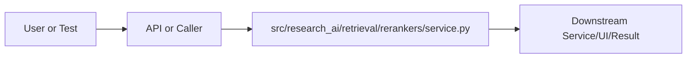

# service.py Explained

Generated educational companion for `src/research_ai/retrieval/rerankers/service.py`. This file is intentionally detailed so a developer can understand the code, architecture role, production tradeoffs, and ML/backend concepts behind the implementation.

## File Overview

`src/research_ai/retrieval/rerankers/service.py` is a Python module in the Retrieval layer: chunking, embeddings, FAISS, hybrid search, and reranking. It defines MetadataReranker and no top-level functions.

## Why This File Exists

This file isolates one responsibility in the codebase: Retrieval layer: chunking, embeddings, FAISS, hybrid search, and reranking. Separation matters because AI systems are easier to test, scale, debug, and explain when retrieval, orchestration, ML services, memory, UI, and deployment scripts have clear boundaries.

## Workflow Position

**Layer:** Retrieval layer: chunking, embeddings, FAISS, hybrid search, and reranking.

**Previous step:** caller code, an API request, a browser event, a test fixture, an import, or a startup script prepares inputs.

**Current step:** `src/research_ai/retrieval/rerankers/service.py` performs its local responsibility.

**Next step:** downstream services, API responses, rendered UI, tests, or process execution consume the result.



## Inputs and Outputs

- **Inputs:** function arguments, class constructor dependencies, HTTP payloads, environment variables, filesystem artifacts, DOM events, or test fixtures.
- **Outputs:** return values, dictionaries, Pydantic models, rendered DOM state, API responses, logs, process startup, assertions, or side effects.
- **Serialization:** this project uses JSON for APIs/LLM planning, parquet/joblib/faiss for ML artifacts, and HTML/CSS/JS for the browser surface.

## Imports Explained

| Import | Explanation |
|---|---|
| `__future__` | Project or standard-library dependency used to import a service, type, helper, or runtime capability. Imports affect startup time, packaging, and test isolation. |
| `research_ai` | Project or standard-library dependency used to import a service, type, helper, or runtime capability. Imports affect startup time, packaging, and test isolation. |

## Global Variables and Config

| Name | Line | Why it matters |
|---|---:|---|
| `_KEYWORD_WEIGHT` | 51 | Module-level value, constant, prompt, cache, registry, or configuration point. Check mutability and startup cost. |
| `_SEMANTIC_WEIGHT` | 52 | Module-level value, constant, prompt, cache, registry, or configuration point. Check mutability and startup cost. |

## Step-by-Step Workflow

1. Load dependencies and runtime constants.
2. Accept input from the previous layer.
3. Validate, transform, route, score, render, or execute according to this file's role.
4. Return a structured output or perform a controlled side effect.
5. Let caller layers handle presentation, persistence, retries, or fallback.

## Function-by-Function Breakdown

No top-level functions are defined. Behavior is class-based, declarative, or provided through package exports.

## Class-by-Class Breakdown

### `MetadataReranker`

- **Line:** 55
- **Base classes:** `object`
- **Docstring:** Lightweight local reranker using title/abstract keyword evidence.

Computes a Jaccard-like overlap between query tokens and document tokens,
then blends with the upstream fused score at a 85/15 ratio.

Token representation uses the same tokenize_query() as the query planner —
lowercase, stopwords removed, lemmatized.  This means "transformers" and
"transformer" both reduce to "transformer", providing stemming-like matching.

**Methods:**
- `rerank` at line 66: Re-rank docs by blending fused score with keyword overlap.

Args:
    query: The original search query string.
    docs:  List of dicts with at least "title", "abstract", and "score" keys.

Returns:
    Same dicts sorted by hybrid_score descending, with two added fields:
      keyword_score: raw overlap ratio ∈ [0, 1]
      hybrid_score:  final blended score ∈ [0, 1]

```python
class MetadataReranker:
    """Lightweight local reranker using title/abstract keyword evidence.

    Computes a Jaccard-like overlap between query tokens and document tokens,
    then blends with the upstream fused score at a 85/15 ratio.

    Token representation uses the same tokenize_query() as the query planner —
    lowercase, stopwords removed, lemmatized.  This means "transformers" and
    "transformer" both reduce to "transformer", providing stemming-like matching.
    """

    def rerank(self, query: str, docs: list[dict]) -> list[dict]:
        """Re-rank docs by blending fused score with keyword overlap.

        Args:
            query: The original search query string.
            docs:  List of dicts with at least "title", "abstract", and "score" keys.

        Returns:
            Same dicts sorted by hybrid_score descending, with two added fields:
              keyword_score: raw overlap ratio ∈ [0, 1]
              hybrid_score:  final blended score ∈ [0, 1]
        """
        query_tokens = tokenize_query(query)
        if not query_tokens:
            # No tokens after cleaning (e.g., query is all stopwords) → return as-is
            return docs

        reranked = []
        for doc in docs:
            # Compute overlap between query tokens and doc title+abstract tokens.
            # Using the title AND abstract ensures a paper about "neural networks"
            # scores well even if "neural" is only in the abstract.
            haystack = f"{doc.get('title', '')} {doc.get('abstract', '')}"
            doc_tokens = tokenize_query(haystack)

            # Precision-style overlap: what fraction of query terms appear in doc?
            # Using query length as denominator rewards docs that cover all query terms.
            overlap = len(query_tokens & doc_tokens) / max(1, len(query_tokens))

            item = dict(doc)
            item["keyword_score"] = round(overlap, 4)
            # BUG FIX: was 0.75/0.25, now correctly 0.85/0.15 per KEYWORD_WEIGHT
            item["hybrid_score"] = round(
                _SEMANTIC_WEIGHT * float(item.get("score", 0.0)) + _KEYWORD_WEIGHT * overlap,
                4,
            )
            reranked.append(item)

        return sorted(reranked, key=lambda item: item["hybrid_score"], reverse=True)
```

This class packages state and behavior behind a service-style interface. Constructor dependencies show what the class needs; public methods show what the rest of the system can ask it to do. In production, this boundary is where caching, model loading, artifact access, and error handling must be controlled.


## Method-by-Method Deep Dive

### Class `MetadataReranker` Methods

#### `MetadataReranker.rerank`

- **Line:** 66
- **Kind:** synchronous method
- **Arguments:** self, query, docs
- **Docstring:** Re-rank docs by blending fused score with keyword overlap.

Args:
    query: The original search query string.
    docs:  List of dicts with at least "title", "abstract", and "score" keys.

Returns:
    Same dicts sorted by hybrid_score descending, with two added fields:
      keyword_score: raw overlap ratio ∈ [0, 1]
      hybrid_score:  final blended score ∈ [0, 1]

```python
    def rerank(self, query: str, docs: list[dict]) -> list[dict]:
        """Re-rank docs by blending fused score with keyword overlap.

        Args:
            query: The original search query string.
            docs:  List of dicts with at least "title", "abstract", and "score" keys.

        Returns:
            Same dicts sorted by hybrid_score descending, with two added fields:
              keyword_score: raw overlap ratio ∈ [0, 1]
              hybrid_score:  final blended score ∈ [0, 1]
        """
        query_tokens = tokenize_query(query)
        if not query_tokens:
            # No tokens after cleaning (e.g., query is all stopwords) → return as-is
            return docs

        reranked = []
        for doc in docs:
            # Compute overlap between query tokens and doc title+abstract tokens.
            # Using the title AND abstract ensures a paper about "neural networks"
            # scores well even if "neural" is only in the abstract.
            haystack = f"{doc.get('title', '')} {doc.get('abstract', '')}"
            doc_tokens = tokenize_query(haystack)

            # Precision-style overlap: what fraction of query terms appear in doc?
            # Using query length as denominator rewards docs that cover all query terms.
            overlap = len(query_tokens & doc_tokens) / max(1, len(query_tokens))

            item = dict(doc)
            item["keyword_score"] = round(overlap, 4)
            # BUG FIX: was 0.75/0.25, now correctly 0.85/0.15 per KEYWORD_WEIGHT
            item["hybrid_score"] = round(
                _SEMANTIC_WEIGHT * float(item.get("score", 0.0)) + _KEYWORD_WEIGHT * overlap,
                4,
            )
            reranked.append(item)

        return sorted(reranked, key=lambda item: item["hybrid_score"], reverse=True)
```

This method is part of the class contract. Its inputs show what state or caller data it consumes; its body shows whether it performs pure transformation, model/artifact access, retrieval, I/O, caching, validation, or orchestration. In production review, pay attention to error handling, mutation of `self`, repeated expensive work, and whether return shapes stay stable for downstream callers.

## Important Algorithms Used

- **FAISS Indexing**: FAISS indexes dense vectors for nearest-neighbor search. Exact flat indexes trade speed at huge scale for simplicity and correctness.
- **Hybrid Retrieval**: Hybrid retrieval combines semantic vectors with lexical/keyword evidence, improving scientific search where exact terms matter.
- **Transformers**: Transformers use tokenization and attention layers for language understanding/generation. They are powerful but memory and latency sensitive.
- **Calibration**: Calibration makes predicted probabilities better match real correctness rates, which matters for user-facing confidence.
- **Streaming**: Streaming improves perceived latency by sending incremental output instead of waiting for full completion.
- **Sandboxing**: Sandboxing validates and constrains user code before execution, reducing security and stability risk.

## Libraries Used

| Import | Explanation |
|---|---|
| `__future__` | Project or standard-library dependency used to import a service, type, helper, or runtime capability. Imports affect startup time, packaging, and test isolation. |
| `research_ai` | Project or standard-library dependency used to import a service, type, helper, or runtime capability. Imports affect startup time, packaging, and test isolation. |

## ML Concepts Used

- **FAISS Indexing**: FAISS indexes dense vectors for nearest-neighbor search. Exact flat indexes trade speed at huge scale for simplicity and correctness.
- **Hybrid Retrieval**: Hybrid retrieval combines semantic vectors with lexical/keyword evidence, improving scientific search where exact terms matter.
- **Transformers**: Transformers use tokenization and attention layers for language understanding/generation. They are powerful but memory and latency sensitive.
- **Calibration**: Calibration makes predicted probabilities better match real correctness rates, which matters for user-facing confidence.
- **Streaming**: Streaming improves perceived latency by sending incremental output instead of waiting for full completion.
- **Sandboxing**: Sandboxing validates and constrains user code before execution, reducing security and stability risk.

## Performance and Memory Notes

- Avoid eager loading of heavy ML models unless startup latency is acceptable.
- Cache expensive clients, tokenizers, vector stores, and embeddings carefully.
- Use float32 for embedding vectors because it halves memory compared with float64 and matches FAISS/neural inference expectations.
- Bound prompt length, uploaded content, result counts, and token budgets to control latency and memory.
- Watch copies of large metadata frames, embedding matrices, and file buffers.

## Scalability Notes

- In-memory state works for local demos but needs Redis/database/object storage for multi-worker cloud deployment.
- CPU/GPU inference should often be separated from the web API when traffic grows.
- Retrieval can start exact and move to approximate indexes as corpus size grows.
- Batch operations and cache repeated work to improve throughput.
- Add metrics for latency, errors, fallback frequency, retrieval hit rate, and token usage.

## Production Engineering Notes

- Keep interfaces stable because other files may import this module or depend on its response shape.
- Prefer typed/structured data over free-form strings at service boundaries.
- Log operational context without secrets or huge payloads.
- Make fallback behavior explicit so users get useful output even when LLMs or artifacts fail.
- Keep provider-specific logic behind adapters so Groq/OpenRouter/Google/Ollama can be swapped.

## Common Bugs and Failure Cases

- Missing `.env` values, model artifacts, or Ollama models can trigger degraded behavior.
- Type mismatches occur when LLM-generated tool arguments cross into strict Python code.
- Empty retrieval results must not become hallucinated answers.
- Network calls need timeouts and careful retry behavior.
- Frontend IDs/classes and API schemas are contracts; changing one side without the other breaks workflows.

## Security Considerations

- Handles credentials or environment configuration. Keep secrets in environment variables and redact them from logs.
- Deals with execution or subprocesses. Maintain AST validation, isolated mode, timeouts, and least privilege.

## Real Industry Usage

- This pattern appears in enterprise RAG assistants, scientific search tools, internal research copilots, and ML platform demos.
- The layered design mirrors production systems: API facade, orchestration, retrieval, evaluation, synthesis, UI, and deployment.
- Clear separation lets teams replace model providers, improve retrieval, harden security, or redesign UI independently.

## Optimization Opportunities

- Add tracing around each workflow step.
- Strengthen schema validation at boundaries.
- Persist conversation/session state outside process memory.
- Add load tests and adversarial tests for prompt injection, empty evidence, and large uploads.
- Consider approximate vector indexes, reranker models, or batching when corpus/traffic grows.

## How This Connects To Other Files

- `src/research_ai/retrieval/rerankers/service.py` is connected through imports, startup scripts, API routes, frontend selectors, tests, or artifact paths.
- `src/research_ai/platform.py` is the backend composition root.
- `src/research_ai/api/main.py` exposes backend behavior over HTTP.
- Retrieval modules depend on artifacts under `artifacts/`.
- Frontend files depend on stable endpoint and DOM contracts.

## End-to-End Flow Summary

- A user/browser/test/startup event enters the system.
- The relevant layer validates or normalizes input.
- Retrieval, ML, orchestration, execution, or UI rendering happens.
- A structured result, visual state, or process side effect is produced.
- Fallbacks and tests keep behavior understandable when dependencies are unavailable.

## Interview Questions

1. What responsibility does this file own?
2. What inputs and outputs define its contract?
3. Which dependencies are expensive or operationally risky?
4. What breaks if this file changes shape?
5. How would you scale or test this behavior in production?

## Key Takeaways

- `src/research_ai/retrieval/rerankers/service.py` should be understood as part of a layered AI research platform.
- Trace data flow from inputs to transformations to outputs.
- Production readiness comes from explicit contracts, bounded resources, observability, secure defaults, and graceful fallback.

## Fully Commented Source

This section repeats the original source with an explanatory comment before every line. The comments are educational only; they are not inserted into the production source file.

```python
# L0001: Starts, ends, or continues a docstring that documents module, class, or function intent.
"""Metadata reranker — final re-ranking stage of the hybrid retrieval pipeline.
# L0002: Blank line that visually separates logical sections and improves readability.

# L0003: Executes Python logic as part of this file's workflow; read surrounding lines for data flow and side effects.
POSITION IN THE PIPELINE
# L0004: Executes Python logic as part of this file's workflow; read surrounding lines for data flow and side effects.
-------------------------
# L0005: Executes Python logic as part of this file's workflow; read surrounding lines for data flow and side effects.
This is Stage 3 (the last stage) of HybridSearchService.  It receives docs
# L0006: Executes Python logic as part of this file's workflow; read surrounding lines for data flow and side effects.
that have already been scored by:
# L0007: Executes Python logic as part of this file's workflow; read surrounding lines for data flow and side effects.
  Stage 1: FAISS semantic similarity (weight 0.60)
# L0008: Executes Python logic as part of this file's workflow; read surrounding lines for data flow and side effects.
  Stage 2: BM25 keyword fusion     (weight 0.25)
# L0009: Blank line that visually separates logical sections and improves readability.

# L0010: Executes Python logic as part of this file's workflow; read surrounding lines for data flow and side effects.
Stage 3 computes a title+abstract keyword overlap score and blends it with the
# L0011: Executes Python logic as part of this file's workflow; read surrounding lines for data flow and side effects.
fused score from Stages 1+2.
# L0012: Blank line that visually separates logical sections and improves readability.

# L0013: Executes Python logic as part of this file's workflow; read surrounding lines for data flow and side effects.
WEIGHT ALIGNMENT (BUG FIX v3.1.1)
# L0014: Executes Python logic as part of this file's workflow; read surrounding lines for data flow and side effects.
-----------------------------------
# L0015: Executes Python logic as part of this file's workflow; read surrounding lines for data flow and side effects.
The original code used hard-coded weights 0.75 / 0.25 inside rerank(), which
# L0016: Assigns or updates a value used later in the workflow; check mutability and data shape.
conflicted with HybridSearchService.KEYWORD_WEIGHT = 0.15.  The mismatch meant:
# L0017: Blank line that visually separates logical sections and improves readability.

# L0018: Assigns or updates a value used later in the workflow; check mutability and data shape.
  Declared:  final_score = 0.85 × fused + 0.15 × keyword
# L0019: Assigns or updates a value used later in the workflow; check mutability and data shape.
  Actual:    final_score = 0.75 × fused + 0.25 × keyword
# L0020: Blank line that visually separates logical sections and improves readability.

# L0021: Executes Python logic as part of this file's workflow; read surrounding lines for data flow and side effects.
This gave keyword overlap 1.67× more influence than intended, over-promoting
# L0022: Executes Python logic as part of this file's workflow; read surrounding lines for data flow and side effects.
documents that merely share words with the query (rather than being semantically
# L0023: Executes Python logic as part of this file's workflow; read surrounding lines for data flow and side effects.
relevant) and under-weighting the carefully calibrated BM25+semantic scores.
# L0024: Blank line that visually separates logical sections and improves readability.

# L0025: Assigns or updates a value used later in the workflow; check mutability and data shape.
Fix: MetadataReranker now declares SEMANTIC_WEIGHT = 1 - KEYWORD_WEIGHT so the
# L0026: Executes Python logic as part of this file's workflow; read surrounding lines for data flow and side effects.
weights are defined in one place only (HybridSearchService), and the reranker
# L0027: Executes Python logic as part of this file's workflow; read surrounding lines for data flow and side effects.
imports and uses them.
# L0028: Blank line that visually separates logical sections and improves readability.

# L0029: Executes Python logic as part of this file's workflow; read surrounding lines for data flow and side effects.
WHY KEYWORD OVERLAP AT ALL after BM25?
# L0030: Executes Python logic as part of this file's workflow; read surrounding lines for data flow and side effects.
---------------------------------------
# L0031: Executes Python logic as part of this file's workflow; read surrounding lines for data flow and side effects.
BM25 captures token-level frequency at the corpus level (IDF).  The metadata
# L0032: Executes Python logic as part of this file's workflow; read surrounding lines for data flow and side effects.
reranker captures a simpler signal: does the paper title contain the exact query
# L0033: Executes Python logic as part of this file's workflow; read surrounding lines for data flow and side effects.
words?  Title-match is a strong heuristic for relevance that complements IDF-
# L0034: Executes Python logic as part of this file's workflow; read surrounding lines for data flow and side effects.
weighted body text frequency from BM25.
# L0035: Blank line that visually separates logical sections and improves readability.

# L0036: Executes Python logic as part of this file's workflow; read surrounding lines for data flow and side effects.
MATHEMATICAL DEFINITION
# L0037: Executes Python logic as part of this file's workflow; read surrounding lines for data flow and side effects.
------------------------
# L0038: Assigns or updates a value used later in the workflow; check mutability and data shape.
  overlap = |query_tokens ∩ doc_tokens| / |query_tokens|
# L0039: Assigns or updates a value used later in the workflow; check mutability and data shape.
  hybrid_score = SEMANTIC_WEIGHT × fused_score + KEYWORD_WEIGHT × overlap
# L0040: Blank line that visually separates logical sections and improves readability.

# L0041: Executes Python logic as part of this file's workflow; read surrounding lines for data flow and side effects.
  where fused_score already encodes 0.60 × semantic + 0.25 × BM25.
# L0042: Starts, ends, or continues a docstring that documents module, class, or function intent.
"""
# L0043: Enables future Python behavior so annotations/import semantics stay modern and predictable.
from __future__ import annotations
# L0044: Blank line that visually separates logical sections and improves readability.

# L0045: Imports a dependency, type, or project module needed by later code in this file.
from research_ai.common.text import tokenize_query
# L0046: Blank line that visually separates logical sections and improves readability.

# L0047: Developer comment explaining intent, caveat, section boundary, or operational reasoning.
# Must match HybridSearchService.KEYWORD_WEIGHT exactly.
# L0048: Developer comment explaining intent, caveat, section boundary, or operational reasoning.
# Defined here as a local constant to avoid circular imports while keeping
# L0049: Developer comment explaining intent, caveat, section boundary, or operational reasoning.
# the value synchronized.  If you change KEYWORD_WEIGHT in hybrid_search,
# L0050: Developer comment explaining intent, caveat, section boundary, or operational reasoning.
# change this constant too.
# L0051: Assigns or updates a value used later in the workflow; check mutability and data shape.
_KEYWORD_WEIGHT = 0.15
# L0052: Assigns or updates a value used later in the workflow; check mutability and data shape.
_SEMANTIC_WEIGHT = 1.0 - _KEYWORD_WEIGHT  # = 0.85
# L0053: Blank line that visually separates logical sections and improves readability.

# L0054: Blank line that visually separates logical sections and improves readability.

# L0055: Defines a class that groups related state and behavior behind a reusable interface.
class MetadataReranker:
# L0056: Starts, ends, or continues a docstring that documents module, class, or function intent.
    """Lightweight local reranker using title/abstract keyword evidence.
# L0057: Blank line that visually separates logical sections and improves readability.

# L0058: Executes Python logic as part of this file's workflow; read surrounding lines for data flow and side effects.
    Computes a Jaccard-like overlap between query tokens and document tokens,
# L0059: Executes Python logic as part of this file's workflow; read surrounding lines for data flow and side effects.
    then blends with the upstream fused score at a 85/15 ratio.
# L0060: Blank line that visually separates logical sections and improves readability.

# L0061: Executes Python logic as part of this file's workflow; read surrounding lines for data flow and side effects.
    Token representation uses the same tokenize_query() as the query planner —
# L0062: Executes Python logic as part of this file's workflow; read surrounding lines for data flow and side effects.
    lowercase, stopwords removed, lemmatized.  This means "transformers" and
# L0063: Executes Python logic as part of this file's workflow; read surrounding lines for data flow and side effects.
    "transformer" both reduce to "transformer", providing stemming-like matching.
# L0064: Starts, ends, or continues a docstring that documents module, class, or function intent.
    """
# L0065: Blank line that visually separates logical sections and improves readability.

# L0066: Defines a function or method; parameters are the input contract and the body implements the workflow.
    def rerank(self, query: str, docs: list[dict]) -> list[dict]:
# L0067: Starts, ends, or continues a docstring that documents module, class, or function intent.
        """Re-rank docs by blending fused score with keyword overlap.
# L0068: Blank line that visually separates logical sections and improves readability.

# L0069: Executes Python logic as part of this file's workflow; read surrounding lines for data flow and side effects.
        Args:
# L0070: Executes Python logic as part of this file's workflow; read surrounding lines for data flow and side effects.
            query: The original search query string.
# L0071: Executes Python logic as part of this file's workflow; read surrounding lines for data flow and side effects.
            docs:  List of dicts with at least "title", "abstract", and "score" keys.
# L0072: Blank line that visually separates logical sections and improves readability.

# L0073: Executes Python logic as part of this file's workflow; read surrounding lines for data flow and side effects.
        Returns:
# L0074: Executes Python logic as part of this file's workflow; read surrounding lines for data flow and side effects.
            Same dicts sorted by hybrid_score descending, with two added fields:
# L0075: Executes Python logic as part of this file's workflow; read surrounding lines for data flow and side effects.
              keyword_score: raw overlap ratio ∈ [0, 1]
# L0076: Executes Python logic as part of this file's workflow; read surrounding lines for data flow and side effects.
              hybrid_score:  final blended score ∈ [0, 1]
# L0077: Starts, ends, or continues a docstring that documents module, class, or function intent.
        """
# L0078: Assigns or updates a value used later in the workflow; check mutability and data shape.
        query_tokens = tokenize_query(query)
# L0079: Branches execution based on a condition, usually for validation, fallback, or mode-specific behavior.
        if not query_tokens:
# L0080: Developer comment explaining intent, caveat, section boundary, or operational reasoning.
            # No tokens after cleaning (e.g., query is all stopwords) → return as-is
# L0081: Returns the computed result to the caller; this shape becomes part of the downstream contract.
            return docs
# L0082: Blank line that visually separates logical sections and improves readability.

# L0083: Assigns or updates a value used later in the workflow; check mutability and data shape.
        reranked = []
# L0084: Iterates over data, retry attempts, files, results, or workflow steps.
        for doc in docs:
# L0085: Developer comment explaining intent, caveat, section boundary, or operational reasoning.
            # Compute overlap between query tokens and doc title+abstract tokens.
# L0086: Developer comment explaining intent, caveat, section boundary, or operational reasoning.
            # Using the title AND abstract ensures a paper about "neural networks"
# L0087: Developer comment explaining intent, caveat, section boundary, or operational reasoning.
            # scores well even if "neural" is only in the abstract.
# L0088: Assigns or updates a value used later in the workflow; check mutability and data shape.
            haystack = f"{doc.get('title', '')} {doc.get('abstract', '')}"
# L0089: Assigns or updates a value used later in the workflow; check mutability and data shape.
            doc_tokens = tokenize_query(haystack)
# L0090: Blank line that visually separates logical sections and improves readability.

# L0091: Developer comment explaining intent, caveat, section boundary, or operational reasoning.
            # Precision-style overlap: what fraction of query terms appear in doc?
# L0092: Developer comment explaining intent, caveat, section boundary, or operational reasoning.
            # Using query length as denominator rewards docs that cover all query terms.
# L0093: Assigns or updates a value used later in the workflow; check mutability and data shape.
            overlap = len(query_tokens & doc_tokens) / max(1, len(query_tokens))
# L0094: Blank line that visually separates logical sections and improves readability.

# L0095: Assigns or updates a value used later in the workflow; check mutability and data shape.
            item = dict(doc)
# L0096: Assigns or updates a value used later in the workflow; check mutability and data shape.
            item["keyword_score"] = round(overlap, 4)
# L0097: Developer comment explaining intent, caveat, section boundary, or operational reasoning.
            # BUG FIX: was 0.75/0.25, now correctly 0.85/0.15 per KEYWORD_WEIGHT
# L0098: Assigns or updates a value used later in the workflow; check mutability and data shape.
            item["hybrid_score"] = round(
# L0099: Executes Python logic as part of this file's workflow; read surrounding lines for data flow and side effects.
                _SEMANTIC_WEIGHT * float(item.get("score", 0.0)) + _KEYWORD_WEIGHT * overlap,
# L0100: Executes Python logic as part of this file's workflow; read surrounding lines for data flow and side effects.
                4,
# L0101: Executes Python logic as part of this file's workflow; read surrounding lines for data flow and side effects.
            )
# L0102: Executes Python logic as part of this file's workflow; read surrounding lines for data flow and side effects.
            reranked.append(item)
# L0103: Blank line that visually separates logical sections and improves readability.

# L0104: Returns the computed result to the caller; this shape becomes part of the downstream contract.
        return sorted(reranked, key=lambda item: item["hybrid_score"], reverse=True)
# L0105: Blank line that visually separates logical sections and improves readability.

```

## Source Walkthrough

The complete source is included because the file is short enough to study directly.

```python
"""Metadata reranker — final re-ranking stage of the hybrid retrieval pipeline.

POSITION IN THE PIPELINE
-------------------------
This is Stage 3 (the last stage) of HybridSearchService.  It receives docs
that have already been scored by:
  Stage 1: FAISS semantic similarity (weight 0.60)
  Stage 2: BM25 keyword fusion     (weight 0.25)

Stage 3 computes a title+abstract keyword overlap score and blends it with the
fused score from Stages 1+2.

WEIGHT ALIGNMENT (BUG FIX v3.1.1)
-----------------------------------
The original code used hard-coded weights 0.75 / 0.25 inside rerank(), which
conflicted with HybridSearchService.KEYWORD_WEIGHT = 0.15.  The mismatch meant:

  Declared:  final_score = 0.85 × fused + 0.15 × keyword
  Actual:    final_score = 0.75 × fused + 0.25 × keyword

This gave keyword overlap 1.67× more influence than intended, over-promoting
documents that merely share words with the query (rather than being semantically
relevant) and under-weighting the carefully calibrated BM25+semantic scores.

Fix: MetadataReranker now declares SEMANTIC_WEIGHT = 1 - KEYWORD_WEIGHT so the
weights are defined in one place only (HybridSearchService), and the reranker
imports and uses them.

WHY KEYWORD OVERLAP AT ALL after BM25?
---------------------------------------
BM25 captures token-level frequency at the corpus level (IDF).  The metadata
reranker captures a simpler signal: does the paper title contain the exact query
words?  Title-match is a strong heuristic for relevance that complements IDF-
weighted body text frequency from BM25.

MATHEMATICAL DEFINITION
------------------------
  overlap = |query_tokens ∩ doc_tokens| / |query_tokens|
  hybrid_score = SEMANTIC_WEIGHT × fused_score + KEYWORD_WEIGHT × overlap

  where fused_score already encodes 0.60 × semantic + 0.25 × BM25.
"""
from __future__ import annotations

from research_ai.common.text import tokenize_query

# Must match HybridSearchService.KEYWORD_WEIGHT exactly.
# Defined here as a local constant to avoid circular imports while keeping
# the value synchronized.  If you change KEYWORD_WEIGHT in hybrid_search,
# change this constant too.
_KEYWORD_WEIGHT = 0.15
_SEMANTIC_WEIGHT = 1.0 - _KEYWORD_WEIGHT  # = 0.85


class MetadataReranker:
    """Lightweight local reranker using title/abstract keyword evidence.

    Computes a Jaccard-like overlap between query tokens and document tokens,
    then blends with the upstream fused score at a 85/15 ratio.

    Token representation uses the same tokenize_query() as the query planner —
    lowercase, stopwords removed, lemmatized.  This means "transformers" and
    "transformer" both reduce to "transformer", providing stemming-like matching.
    """

    def rerank(self, query: str, docs: list[dict]) -> list[dict]:
        """Re-rank docs by blending fused score with keyword overlap.

        Args:
            query: The original search query string.
            docs:  List of dicts with at least "title", "abstract", and "score" keys.

        Returns:
            Same dicts sorted by hybrid_score descending, with two added fields:
              keyword_score: raw overlap ratio ∈ [0, 1]
              hybrid_score:  final blended score ∈ [0, 1]
        """
        query_tokens = tokenize_query(query)
        if not query_tokens:
            # No tokens after cleaning (e.g., query is all stopwords) → return as-is
            return docs

        reranked = []
        for doc in docs:
            # Compute overlap between query tokens and doc title+abstract tokens.
            # Using the title AND abstract ensures a paper about "neural networks"
            # scores well even if "neural" is only in the abstract.
            haystack = f"{doc.get('title', '')} {doc.get('abstract', '')}"
            doc_tokens = tokenize_query(haystack)

            # Precision-style overlap: what fraction of query terms appear in doc?
            # Using query length as denominator rewards docs that cover all query terms.
            overlap = len(query_tokens & doc_tokens) / max(1, len(query_tokens))

            item = dict(doc)
            item["keyword_score"] = round(overlap, 4)
            # BUG FIX: was 0.75/0.25, now correctly 0.85/0.15 per KEYWORD_WEIGHT
            item["hybrid_score"] = round(
                _SEMANTIC_WEIGHT * float(item.get("score", 0.0)) + _KEYWORD_WEIGHT * overlap,
                4,
            )
            reranked.append(item)

        return sorted(reranked, key=lambda item: item["hybrid_score"], reverse=True)
```
