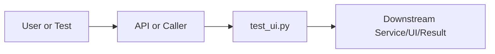

# test_ui.py Explained

Generated educational companion for `test_ui.py`. This file is intentionally detailed so a developer can understand the code, architecture role, production tradeoffs, and ML/backend concepts behind the implementation.

## File Overview

`test_ui.py` is a Python module in the Repository support layer. It defines no classes and ok, fail.

## Why This File Exists

This file isolates one responsibility in the codebase: Repository support layer. Separation matters because AI systems are easier to test, scale, debug, and explain when retrieval, orchestration, ML services, memory, UI, and deployment scripts have clear boundaries.

## Workflow Position

**Layer:** Repository support layer.

**Previous step:** caller code, an API request, a browser event, a test fixture, an import, or a startup script prepares inputs.

**Current step:** `test_ui.py` performs its local responsibility.

**Next step:** downstream services, API responses, rendered UI, tests, or process execution consume the result.



## Inputs and Outputs

- **Inputs:** function arguments, class constructor dependencies, HTTP payloads, environment variables, filesystem artifacts, DOM events, or test fixtures.
- **Outputs:** return values, dictionaries, Pydantic models, rendered DOM state, API responses, logs, process startup, assertions, or side effects.
- **Serialization:** this project uses JSON for APIs/LLM planning, parquet/joblib/faiss for ML artifacts, and HTML/CSS/JS for the browser surface.

## Imports Explained

| Import | Explanation |
|---|---|
| `playwright` | Project or standard-library dependency used to import a service, type, helper, or runtime capability. Imports affect startup time, packaging, and test isolation. |
| `sys` | Project or standard-library dependency used to import a service, type, helper, or runtime capability. Imports affect startup time, packaging, and test isolation. |
| `time` | time measures latency, retry delays, and elapsed operation duration. |

## Global Variables and Config

| Name | Line | Why it matters |
|---|---:|---|
| `WAIT_STREAM` | 5 | Module-level value, constant, prompt, cache, registry, or configuration point. Check mutability and startup cost. |
| `BASE` | 6 | Module-level value, constant, prompt, cache, registry, or configuration point. Check mutability and startup cost. |
| `results` | 8 | Module-level value, constant, prompt, cache, registry, or configuration point. Check mutability and startup cost. |
| `passed` | 196 | Module-level value, constant, prompt, cache, registry, or configuration point. Check mutability and startup cost. |
| `failed` | 197 | Module-level value, constant, prompt, cache, registry, or configuration point. Check mutability and startup cost. |

## Step-by-Step Workflow

1. Load dependencies and runtime constants.
2. Accept input from the previous layer.
3. Validate, transform, route, score, render, or execute according to this file's role.
4. Return a structured output or perform a controlled side effect.
5. Let caller layers handle presentation, persistence, retries, or fallback.

## Function-by-Function Breakdown

### `ok`

- **Line:** 10
- **Kind:** synchronous function
- **Arguments:** label
- **Docstring:** No explicit docstring; infer behavior from call sites and body.

```python
def ok(label):
    results.append(("PASS", label))
    print(f"  PASS  {label}")
```

This function's parameters define its input contract. Its return value or side effect defines how downstream code uses it. Review error handling, resource usage, and whether the function performs CPU work, I/O, model inference, or pure transformation.

### `fail`

- **Line:** 14
- **Kind:** synchronous function
- **Arguments:** label, reason
- **Docstring:** No explicit docstring; infer behavior from call sites and body.

```python
def fail(label, reason=""):
    results.append(("FAIL", label))
    print(f"  FAIL  {label}" + (f" — {reason}" if reason else ""))
```

This function's parameters define its input contract. Its return value or side effect defines how downstream code uses it. Review error handling, resource usage, and whether the function performs CPU work, I/O, model inference, or pure transformation.


## Class-by-Class Breakdown

No classes are defined. The module relies on functions, constants, imports, or package exports.

## Important Algorithms Used

- **LLM Inference**: LLM inference sends prompts or chat messages to a model provider and receives generated text under token, latency, and cost constraints.
- **Transformers**: Transformers use tokenization and attention layers for language understanding/generation. They are powerful but memory and latency sensitive.
- **Classification**: Classification maps text or features to discrete labels, supporting category prediction and routing.
- **Calibration**: Calibration makes predicted probabilities better match real correctness rates, which matters for user-facing confidence.
- **Streaming**: Streaming improves perceived latency by sending incremental output instead of waiting for full completion.
- **Sandboxing**: Sandboxing validates and constrains user code before execution, reducing security and stability risk.

## Libraries Used

| Import | Explanation |
|---|---|
| `playwright` | Project or standard-library dependency used to import a service, type, helper, or runtime capability. Imports affect startup time, packaging, and test isolation. |
| `sys` | Project or standard-library dependency used to import a service, type, helper, or runtime capability. Imports affect startup time, packaging, and test isolation. |
| `time` | time measures latency, retry delays, and elapsed operation duration. |

## ML Concepts Used

- **LLM Inference**: LLM inference sends prompts or chat messages to a model provider and receives generated text under token, latency, and cost constraints.
- **Transformers**: Transformers use tokenization and attention layers for language understanding/generation. They are powerful but memory and latency sensitive.
- **Classification**: Classification maps text or features to discrete labels, supporting category prediction and routing.
- **Calibration**: Calibration makes predicted probabilities better match real correctness rates, which matters for user-facing confidence.
- **Streaming**: Streaming improves perceived latency by sending incremental output instead of waiting for full completion.
- **Sandboxing**: Sandboxing validates and constrains user code before execution, reducing security and stability risk.

## Performance and Memory Notes

- Avoid eager loading of heavy ML models unless startup latency is acceptable.
- Cache expensive clients, tokenizers, vector stores, and embeddings carefully.
- Use float32 for embedding vectors because it halves memory compared with float64 and matches FAISS/neural inference expectations.
- Bound prompt length, uploaded content, result counts, and token budgets to control latency and memory.
- Watch copies of large metadata frames, embedding matrices, and file buffers.

## Scalability Notes

- In-memory state works for local demos but needs Redis/database/object storage for multi-worker cloud deployment.
- CPU/GPU inference should often be separated from the web API when traffic grows.
- Retrieval can start exact and move to approximate indexes as corpus size grows.
- Batch operations and cache repeated work to improve throughput.
- Add metrics for latency, errors, fallback frequency, retrieval hit rate, and token usage.

## Production Engineering Notes

- Keep interfaces stable because other files may import this module or depend on its response shape.
- Prefer typed/structured data over free-form strings at service boundaries.
- Log operational context without secrets or huge payloads.
- Make fallback behavior explicit so users get useful output even when LLMs or artifacts fail.
- Keep provider-specific logic behind adapters so Groq/OpenRouter/Google/Ollama can be swapped.

## Common Bugs and Failure Cases

- Missing `.env` values, model artifacts, or Ollama models can trigger degraded behavior.
- Type mismatches occur when LLM-generated tool arguments cross into strict Python code.
- Empty retrieval results must not become hallucinated answers.
- Network calls need timeouts and careful retry behavior.
- Frontend IDs/classes and API schemas are contracts; changing one side without the other breaks workflows.

## Security Considerations

- Touches files or paths. Validate filenames, restrict upload size/type, and prevent traversal.
- Performs network I/O. Use timeouts, validate responses, and keep private services such as Ollama off the public internet.

## Real Industry Usage

- This pattern appears in enterprise RAG assistants, scientific search tools, internal research copilots, and ML platform demos.
- The layered design mirrors production systems: API facade, orchestration, retrieval, evaluation, synthesis, UI, and deployment.
- Clear separation lets teams replace model providers, improve retrieval, harden security, or redesign UI independently.

## Optimization Opportunities

- Add tracing around each workflow step.
- Strengthen schema validation at boundaries.
- Persist conversation/session state outside process memory.
- Add load tests and adversarial tests for prompt injection, empty evidence, and large uploads.
- Consider approximate vector indexes, reranker models, or batching when corpus/traffic grows.

## How This Connects To Other Files

- `test_ui.py` is connected through imports, startup scripts, API routes, frontend selectors, tests, or artifact paths.
- `src/research_ai/platform.py` is the backend composition root.
- `src/research_ai/api/main.py` exposes backend behavior over HTTP.
- Retrieval modules depend on artifacts under `artifacts/`.
- Frontend files depend on stable endpoint and DOM contracts.

## End-to-End Flow Summary

- A user/browser/test/startup event enters the system.
- The relevant layer validates or normalizes input.
- Retrieval, ML, orchestration, execution, or UI rendering happens.
- A structured result, visual state, or process side effect is produced.
- Fallbacks and tests keep behavior understandable when dependencies are unavailable.

## Interview Questions

1. What responsibility does this file own?
2. What inputs and outputs define its contract?
3. Which dependencies are expensive or operationally risky?
4. What breaks if this file changes shape?
5. How would you scale or test this behavior in production?

## Key Takeaways

- `test_ui.py` should be understood as part of a layered AI research platform.
- Trace data flow from inputs to transformations to outputs.
- Production readiness comes from explicit contracts, bounded resources, observability, secure defaults, and graceful fallback.

## Fully Commented Source

This section repeats the original source with an explanatory comment before every line. The comments are educational only; they are not inserted into the production source file.

```python
# L0001: Starts, ends, or continues a docstring that documents module, class, or function intent.
"""End-to-end UI test — drives the ChatGPT-like interface with Playwright."""
# L0002: Imports a dependency, type, or project module needed by later code in this file.
from playwright.sync_api import sync_playwright
# L0003: Imports a dependency, type, or project module needed by later code in this file.
import time, sys
# L0004: Blank line that visually separates logical sections and improves readability.

# L0005: Assigns or updates a value used later in the workflow; check mutability and data shape.
WAIT_STREAM = 90_000   # ms — allow long Ollama responses
# L0006: Assigns or updates a value used later in the workflow; check mutability and data shape.
BASE = "http://localhost:8000"
# L0007: Blank line that visually separates logical sections and improves readability.

# L0008: Assigns or updates a value used later in the workflow; check mutability and data shape.
results = []
# L0009: Blank line that visually separates logical sections and improves readability.

# L0010: Defines a function or method; parameters are the input contract and the body implements the workflow.
def ok(label):
# L0011: Executes Python logic as part of this file's workflow; read surrounding lines for data flow and side effects.
    results.append(("PASS", label))
# L0012: Executes Python logic as part of this file's workflow; read surrounding lines for data flow and side effects.
    print(f"  PASS  {label}")
# L0013: Blank line that visually separates logical sections and improves readability.

# L0014: Defines a function or method; parameters are the input contract and the body implements the workflow.
def fail(label, reason=""):
# L0015: Executes Python logic as part of this file's workflow; read surrounding lines for data flow and side effects.
    results.append(("FAIL", label))
# L0016: Executes Python logic as part of this file's workflow; read surrounding lines for data flow and side effects.
    print(f"  FAIL  {label}" + (f" — {reason}" if reason else ""))
# L0017: Blank line that visually separates logical sections and improves readability.

# L0018: Uses a context manager to guarantee setup/cleanup around files, locks, or managed resources.
with sync_playwright() as p:
# L0019: Assigns or updates a value used later in the workflow; check mutability and data shape.
    browser = p.chromium.launch(headless=False, slow_mo=60)
# L0020: Assigns or updates a value used later in the workflow; check mutability and data shape.
    page = browser.new_page(viewport={"width": 1400, "height": 860})
# L0021: Executes Python logic as part of this file's workflow; read surrounding lines for data flow and side effects.
    page.goto(BASE)
# L0022: Executes Python logic as part of this file's workflow; read surrounding lines for data flow and side effects.
    page.wait_for_load_state("networkidle")
# L0023: Blank line that visually separates logical sections and improves readability.

# L0024: Developer comment explaining intent, caveat, section boundary, or operational reasoning.
    # ── TEST 1: Welcome screen rendered ──────────────────────────────────────
# L0025: Executes Python logic as part of this file's workflow; read surrounding lines for data flow and side effects.
    print("\n── Test 1: Welcome screen ──")
# L0026: Assigns or updates a value used later in the workflow; check mutability and data shape.
    title_el = page.locator(".welcome-title")
# L0027: Branches execution based on a condition, usually for validation, fallback, or mode-specific behavior.
    if title_el.is_visible() and "Research" in title_el.inner_text():
# L0028: Executes Python logic as part of this file's workflow; read surrounding lines for data flow and side effects.
        ok("Welcome title visible")
# L0029: Continues conditional control flow for alternate cases or default fallback behavior.
    else:
# L0030: Executes Python logic as part of this file's workflow; read surrounding lines for data flow and side effects.
        fail("Welcome title", "not visible")
# L0031: Blank line that visually separates logical sections and improves readability.

# L0032: Assigns or updates a value used later in the workflow; check mutability and data shape.
    chips = page.locator(".example-chip").all()
# L0033: Branches execution based on a condition, usually for validation, fallback, or mode-specific behavior.
    if len(chips) >= 4:
# L0034: Executes Python logic as part of this file's workflow; read surrounding lines for data flow and side effects.
        ok(f"Example chips rendered ({len(chips)})")
# L0035: Continues conditional control flow for alternate cases or default fallback behavior.
    else:
# L0036: Executes Python logic as part of this file's workflow; read surrounding lines for data flow and side effects.
        fail("Example chips", f"only {len(chips)}")
# L0037: Blank line that visually separates logical sections and improves readability.

# L0038: Assigns or updates a value used later in the workflow; check mutability and data shape.
    page.screenshot(path="screen_01_welcome.png")
# L0039: Blank line that visually separates logical sections and improves readability.

# L0040: Developer comment explaining intent, caveat, section boundary, or operational reasoning.
    # ── TEST 2: Send a research query via example chip ────────────────────────
# L0041: Executes Python logic as part of this file's workflow; read surrounding lines for data flow and side effects.
    print("\n── Test 2: Research query (example chip) ──")
# L0042: Executes Python logic as part of this file's workflow; read surrounding lines for data flow and side effects.
    chips[0].click()
# L0043: Blank line that visually separates logical sections and improves readability.

# L0044: Developer comment explaining intent, caveat, section boundary, or operational reasoning.
    # Typing indicator should appear
# L0045: Begins protected execution so failures can be handled without crashing the whole request path.
    try:
# L0046: Assigns or updates a value used later in the workflow; check mutability and data shape.
        page.wait_for_selector(".typing-indicator", timeout=8000)
# L0047: Executes Python logic as part of this file's workflow; read surrounding lines for data flow and side effects.
        ok("Typing indicator appeared")
# L0048: Handles an expected failure path, often converting exceptions into fallback behavior or API errors.
    except:
# L0049: Executes Python logic as part of this file's workflow; read surrounding lines for data flow and side effects.
        fail("Typing indicator", "did not appear")
# L0050: Blank line that visually separates logical sections and improves readability.

# L0051: Developer comment explaining intent, caveat, section boundary, or operational reasoning.
    # Wait for streaming to finish
# L0052: Begins protected execution so failures can be handled without crashing the whole request path.
    try:
# L0053: Executes Python logic as part of this file's workflow; read surrounding lines for data flow and side effects.
        page.wait_for_function(
# L0054: Assigns or updates a value used later in the workflow; check mutability and data shape.
            "() => { const b = document.querySelector('.ai-bubble'); return b && !b.querySelector('.typing-indicator') && b.innerText.trim().length > 20; }",
# L0055: Assigns or updates a value used later in the workflow; check mutability and data shape.
            timeout=WAIT_STREAM
# L0056: Executes Python logic as part of this file's workflow; read surrounding lines for data flow and side effects.
        )
# L0057: Executes Python logic as part of this file's workflow; read surrounding lines for data flow and side effects.
        ok("Streaming response completed")
# L0058: Handles an expected failure path, often converting exceptions into fallback behavior or API errors.
    except Exception as e:
# L0059: Executes Python logic as part of this file's workflow; read surrounding lines for data flow and side effects.
        fail("Streaming response", str(e))
# L0060: Blank line that visually separates logical sections and improves readability.

# L0061: Executes Python logic as part of this file's workflow; read surrounding lines for data flow and side effects.
    time.sleep(0.5)
# L0062: Assigns or updates a value used later in the workflow; check mutability and data shape.
    page.screenshot(path="screen_02_response.png")
# L0063: Blank line that visually separates logical sections and improves readability.

# L0064: Developer comment explaining intent, caveat, section boundary, or operational reasoning.
    # ── TEST 3: Confidence badge ──────────────────────────────────────────────
# L0065: Executes Python logic as part of this file's workflow; read surrounding lines for data flow and side effects.
    print("\n── Test 3: Confidence badge ──")
# L0066: Assigns or updates a value used later in the workflow; check mutability and data shape.
    badge = page.locator(".confidence-badge").first
# L0067: Branches execution based on a condition, usually for validation, fallback, or mode-specific behavior.
    if badge.is_visible():
# L0068: Assigns or updates a value used later in the workflow; check mutability and data shape.
        txt = badge.inner_text()
# L0069: Executes Python logic as part of this file's workflow; read surrounding lines for data flow and side effects.
        ok(f"Confidence badge: {txt}")
# L0070: Continues conditional control flow for alternate cases or default fallback behavior.
    else:
# L0071: Executes Python logic as part of this file's workflow; read surrounding lines for data flow and side effects.
        fail("Confidence badge", "not visible")
# L0072: Blank line that visually separates logical sections and improves readability.

# L0073: Developer comment explaining intent, caveat, section boundary, or operational reasoning.
    # ── TEST 4: Sources panel ─────────────────────────────────────────────────
# L0074: Executes Python logic as part of this file's workflow; read surrounding lines for data flow and side effects.
    print("\n── Test 4: Sources panel ──")
# L0075: Assigns or updates a value used later in the workflow; check mutability and data shape.
    src_toggle = page.locator(".sources-toggle").first
# L0076: Branches execution based on a condition, usually for validation, fallback, or mode-specific behavior.
    if src_toggle.is_visible():
# L0077: Executes Python logic as part of this file's workflow; read surrounding lines for data flow and side effects.
        ok(f"Sources toggle: {src_toggle.inner_text().strip()[:50]}")
# L0078: Executes Python logic as part of this file's workflow; read surrounding lines for data flow and side effects.
        src_toggle.click()
# L0079: Executes Python logic as part of this file's workflow; read surrounding lines for data flow and side effects.
        time.sleep(0.3)
# L0080: Assigns or updates a value used later in the workflow; check mutability and data shape.
        cards = page.locator(".source-card").all()
# L0081: Branches execution based on a condition, usually for validation, fallback, or mode-specific behavior.
        if cards:
# L0082: Executes Python logic as part of this file's workflow; read surrounding lines for data flow and side effects.
            ok(f"Source cards visible ({len(cards)})")
# L0083: Assigns or updates a value used later in the workflow; check mutability and data shape.
            title_txt = page.locator(".source-title").first.inner_text()
# L0084: Executes Python logic as part of this file's workflow; read surrounding lines for data flow and side effects.
            ok(f"First source: {title_txt[:60]}")
# L0085: Continues conditional control flow for alternate cases or default fallback behavior.
        else:
# L0086: Executes Python logic as part of this file's workflow; read surrounding lines for data flow and side effects.
            fail("Source cards", "none visible after toggle")
# L0087: Continues conditional control flow for alternate cases or default fallback behavior.
    else:
# L0088: Executes Python logic as part of this file's workflow; read surrounding lines for data flow and side effects.
        fail("Sources toggle", "not visible")
# L0089: Blank line that visually separates logical sections and improves readability.

# L0090: Assigns or updates a value used later in the workflow; check mutability and data shape.
    page.screenshot(path="screen_03_sources.png")
# L0091: Blank line that visually separates logical sections and improves readability.

# L0092: Developer comment explaining intent, caveat, section boundary, or operational reasoning.
    # ── TEST 5: History entry added ────────────────────────────────────────────
# L0093: Executes Python logic as part of this file's workflow; read surrounding lines for data flow and side effects.
    print("\n── Test 5: Conversation history ──")
# L0094: Assigns or updates a value used later in the workflow; check mutability and data shape.
    hist = page.locator(".history-item").all()
# L0095: Branches execution based on a condition, usually for validation, fallback, or mode-specific behavior.
    if hist:
# L0096: Executes Python logic as part of this file's workflow; read surrounding lines for data flow and side effects.
        ok(f"History entry added: {hist[0].inner_text().strip()[:50]}")
# L0097: Continues conditional control flow for alternate cases or default fallback behavior.
    else:
# L0098: Executes Python logic as part of this file's workflow; read surrounding lines for data flow and side effects.
        fail("History entry", "none found")
# L0099: Blank line that visually separates logical sections and improves readability.

# L0100: Developer comment explaining intent, caveat, section boundary, or operational reasoning.
    # ── TEST 6: Follow-up question (conversation continuity) ─────────────────
# L0101: Executes Python logic as part of this file's workflow; read surrounding lines for data flow and side effects.
    print("\n── Test 6: Follow-up / multi-turn ──")
# L0102: Executes Python logic as part of this file's workflow; read surrounding lines for data flow and side effects.
    page.locator("#chatInput").fill("Which of those used attention mechanisms?")
# L0103: Executes Python logic as part of this file's workflow; read surrounding lines for data flow and side effects.
    page.locator("#chatInput").press("Enter")
# L0104: Blank line that visually separates logical sections and improves readability.

# L0105: Begins protected execution so failures can be handled without crashing the whole request path.
    try:
# L0106: Assigns or updates a value used later in the workflow; check mutability and data shape.
        page.wait_for_selector(".typing-indicator", timeout=8000)
# L0107: Executes Python logic as part of this file's workflow; read surrounding lines for data flow and side effects.
        ok("Follow-up: typing indicator appeared")
# L0108: Handles an expected failure path, often converting exceptions into fallback behavior or API errors.
    except:
# L0109: Executes Python logic as part of this file's workflow; read surrounding lines for data flow and side effects.
        fail("Follow-up: typing indicator")
# L0110: Blank line that visually separates logical sections and improves readability.

# L0111: Begins protected execution so failures can be handled without crashing the whole request path.
    try:
# L0112: Executes Python logic as part of this file's workflow; read surrounding lines for data flow and side effects.
        page.wait_for_function(
# L0113: Assigns or updates a value used later in the workflow; check mutability and data shape.
            "() => { const bubbles = document.querySelectorAll('.ai-bubble'); const last = bubbles[bubbles.length-1]; return last && !last.querySelector('.typing-indicator') && last.innerText.trim().length > 20; }",
# L0114: Assigns or updates a value used later in the workflow; check mutability and data shape.
            timeout=WAIT_STREAM
# L0115: Executes Python logic as part of this file's workflow; read surrounding lines for data flow and side effects.
        )
# L0116: Executes Python logic as part of this file's workflow; read surrounding lines for data flow and side effects.
        ok("Follow-up: response received")
# L0117: Handles an expected failure path, often converting exceptions into fallback behavior or API errors.
    except Exception as e:
# L0118: Executes Python logic as part of this file's workflow; read surrounding lines for data flow and side effects.
        fail("Follow-up response", str(e))
# L0119: Blank line that visually separates logical sections and improves readability.

# L0120: Executes Python logic as part of this file's workflow; read surrounding lines for data flow and side effects.
    time.sleep(0.4)
# L0121: Assigns or updates a value used later in the workflow; check mutability and data shape.
    page.screenshot(path="screen_04_followup.png")
# L0122: Blank line that visually separates logical sections and improves readability.

# L0123: Developer comment explaining intent, caveat, section boundary, or operational reasoning.
    # ── TEST 7: Theme toggle ───────────────────────────────────────────────────
# L0124: Executes Python logic as part of this file's workflow; read surrounding lines for data flow and side effects.
    print("\n── Test 7: Theme toggle (dark → light) ──")
# L0125: Executes Python logic as part of this file's workflow; read surrounding lines for data flow and side effects.
    page.locator("#themeToggle").click()
# L0126: Executes Python logic as part of this file's workflow; read surrounding lines for data flow and side effects.
    time.sleep(0.3)
# L0127: Assigns or updates a value used later in the workflow; check mutability and data shape.
    theme = page.locator("html").get_attribute("data-theme")
# L0128: Branches execution based on a condition, usually for validation, fallback, or mode-specific behavior.
    if theme == "light":
# L0129: Executes Python logic as part of this file's workflow; read surrounding lines for data flow and side effects.
        ok("Theme switched to light")
# L0130: Continues conditional control flow for alternate cases or default fallback behavior.
    else:
# L0131: Assigns or updates a value used later in the workflow; check mutability and data shape.
        fail("Theme toggle", f"data-theme={theme}")
# L0132: Assigns or updates a value used later in the workflow; check mutability and data shape.
    page.screenshot(path="screen_05_light_theme.png")
# L0133: Blank line that visually separates logical sections and improves readability.

# L0134: Developer comment explaining intent, caveat, section boundary, or operational reasoning.
    # Switch back to dark
# L0135: Executes Python logic as part of this file's workflow; read surrounding lines for data flow and side effects.
    page.locator("#themeToggle").click()
# L0136: Executes Python logic as part of this file's workflow; read surrounding lines for data flow and side effects.
    time.sleep(0.2)
# L0137: Blank line that visually separates logical sections and improves readability.

# L0138: Developer comment explaining intent, caveat, section boundary, or operational reasoning.
    # ── TEST 8: New chat resets to welcome ─────────────────────────────────────
# L0139: Executes Python logic as part of this file's workflow; read surrounding lines for data flow and side effects.
    print("\n── Test 8: New chat button ──")
# L0140: Executes Python logic as part of this file's workflow; read surrounding lines for data flow and side effects.
    page.locator("#newChatBtn").click()
# L0141: Executes Python logic as part of this file's workflow; read surrounding lines for data flow and side effects.
    time.sleep(0.3)
# L0142: Branches execution based on a condition, usually for validation, fallback, or mode-specific behavior.
    if page.locator(".welcome").is_visible():
# L0143: Executes Python logic as part of this file's workflow; read surrounding lines for data flow and side effects.
        ok("New chat shows welcome screen")
# L0144: Continues conditional control flow for alternate cases or default fallback behavior.
    else:
# L0145: Executes Python logic as part of this file's workflow; read surrounding lines for data flow and side effects.
        fail("New chat", "welcome screen not shown")
# L0146: Assigns or updates a value used later in the workflow; check mutability and data shape.
    page.screenshot(path="screen_06_new_chat.png")
# L0147: Blank line that visually separates logical sections and improves readability.

# L0148: Developer comment explaining intent, caveat, section boundary, or operational reasoning.
    # ── TEST 9: arXiv load in sidebar ─────────────────────────────────────────
# L0149: Executes Python logic as part of this file's workflow; read surrounding lines for data flow and side effects.
    print("\n── Test 9: arXiv paper load ──")
# L0150: Executes Python logic as part of this file's workflow; read surrounding lines for data flow and side effects.
    page.locator("#arxivInput").fill("2303.08774")
# L0151: Executes Python logic as part of this file's workflow; read surrounding lines for data flow and side effects.
    page.locator("#loadArxivBtn").click()
# L0152: Begins protected execution so failures can be handled without crashing the whole request path.
    try:
# L0153: Executes Python logic as part of this file's workflow; read surrounding lines for data flow and side effects.
        page.wait_for_function(
# L0154: Assigns or updates a value used later in the workflow; check mutability and data shape.
            "() => document.querySelectorAll('.doc-item').length > 0",
# L0155: Assigns or updates a value used later in the workflow; check mutability and data shape.
            timeout=20000
# L0156: Executes Python logic as part of this file's workflow; read surrounding lines for data flow and side effects.
        )
# L0157: Assigns or updates a value used later in the workflow; check mutability and data shape.
        doc = page.locator(".doc-item").first.inner_text()
# L0158: Executes Python logic as part of this file's workflow; read surrounding lines for data flow and side effects.
        ok(f"arXiv paper loaded: {doc.strip()[:40]}")
# L0159: Handles an expected failure path, often converting exceptions into fallback behavior or API errors.
    except Exception as e:
# L0160: Executes Python logic as part of this file's workflow; read surrounding lines for data flow and side effects.
        fail("arXiv load", str(e))
# L0161: Assigns or updates a value used later in the workflow; check mutability and data shape.
    page.screenshot(path="screen_07_arxiv_loaded.png")
# L0162: Blank line that visually separates logical sections and improves readability.

# L0163: Developer comment explaining intent, caveat, section boundary, or operational reasoning.
    # ── TEST 10: Direct classify endpoint still works ──────────────────────────
# L0164: Executes Python logic as part of this file's workflow; read surrounding lines for data flow and side effects.
    print("\n── Test 10: /classify endpoint (internal tool still reachable) ──")
# L0165: Imports a dependency, type, or project module needed by later code in this file.
    import urllib.request, json
# L0166: Assigns or updates a value used later in the workflow; check mutability and data shape.
    req_data = json.dumps({"title":"attention is all you need","abstract":"transformer self-attention"}).encode()
# L0167: Assigns or updates a value used later in the workflow; check mutability and data shape.
    req = urllib.request.Request("http://localhost:8000/classify", data=req_data, headers={"Content-Type":"application/json"})
# L0168: Begins protected execution so failures can be handled without crashing the whole request path.
    try:
# L0169: Uses a context manager to guarantee setup/cleanup around files, locks, or managed resources.
        with urllib.request.urlopen(req, timeout=10) as resp:
# L0170: Assigns or updates a value used later in the workflow; check mutability and data shape.
            data = json.loads(resp.read())
# L0171: Executes Python logic as part of this file's workflow; read surrounding lines for data flow and side effects.
        ok(f"Classify: {data.get('predicted_category','?')} (confidence data present: {'confidence' in data})")
# L0172: Handles an expected failure path, often converting exceptions into fallback behavior or API errors.
    except Exception as e:
# L0173: Executes Python logic as part of this file's workflow; read surrounding lines for data flow and side effects.
        fail("Classify endpoint", str(e))
# L0174: Blank line that visually separates logical sections and improves readability.

# L0175: Developer comment explaining intent, caveat, section boundary, or operational reasoning.
    # ── TEST 11: Debug mode toggle ─────────────────────────────────────────────
# L0176: Executes Python logic as part of this file's workflow; read surrounding lines for data flow and side effects.
    print("\n── Test 11: Debug mode toggle ──")
# L0177: Executes Python logic as part of this file's workflow; read surrounding lines for data flow and side effects.
    page.locator("#chatInput").fill("hello")
# L0178: Executes Python logic as part of this file's workflow; read surrounding lines for data flow and side effects.
    page.locator("#debugToggle").click()   # enable debug
# L0179: Executes Python logic as part of this file's workflow; read surrounding lines for data flow and side effects.
    time.sleep(0.1)
# L0180: Executes Python logic as part of this file's workflow; read surrounding lines for data flow and side effects.
    page.locator("#chatInput").press("Enter")
# L0181: Begins protected execution so failures can be handled without crashing the whole request path.
    try:
# L0182: Executes Python logic as part of this file's workflow; read surrounding lines for data flow and side effects.
        page.wait_for_function(
# L0183: Assigns or updates a value used later in the workflow; check mutability and data shape.
            "() => { const b = document.querySelector('.ai-bubble'); return b && !b.querySelector('.typing-indicator') && b.innerText.trim().length > 5; }",
# L0184: Assigns or updates a value used later in the workflow; check mutability and data shape.
            timeout=WAIT_STREAM
# L0185: Executes Python logic as part of this file's workflow; read surrounding lines for data flow and side effects.
        )
# L0186: Executes Python logic as part of this file's workflow; read surrounding lines for data flow and side effects.
        ok("Debug mode: response received")
# L0187: Handles an expected failure path, often converting exceptions into fallback behavior or API errors.
    except Exception as e:
# L0188: Executes Python logic as part of this file's workflow; read surrounding lines for data flow and side effects.
        fail("Debug mode response", str(e))
# L0189: Executes Python logic as part of this file's workflow; read surrounding lines for data flow and side effects.
    page.locator("#debugToggle").click()   # disable debug
# L0190: Assigns or updates a value used later in the workflow; check mutability and data shape.
    page.screenshot(path="screen_08_debug.png")
# L0191: Blank line that visually separates logical sections and improves readability.

# L0192: Executes Python logic as part of this file's workflow; read surrounding lines for data flow and side effects.
    browser.close()
# L0193: Blank line that visually separates logical sections and improves readability.

# L0194: Developer comment explaining intent, caveat, section boundary, or operational reasoning.
# ── Summary ───────────────────────────────────────────────────────────────────
# L0195: Assigns or updates a value used later in the workflow; check mutability and data shape.
print("\n" + "="*50)
# L0196: Assigns or updates a value used later in the workflow; check mutability and data shape.
passed = sum(1 for s,_ in results if s == "PASS")
# L0197: Assigns or updates a value used later in the workflow; check mutability and data shape.
failed = sum(1 for s,_ in results if s == "FAIL")
# L0198: Executes Python logic as part of this file's workflow; read surrounding lines for data flow and side effects.
print(f"RESULTS: {passed} passed, {failed} failed")
# L0199: Iterates over data, retry attempts, files, results, or workflow steps.
for s, label in results:
# L0200: Executes Python logic as part of this file's workflow; read surrounding lines for data flow and side effects.
    print(f"  [{s}] {label}")
# L0201: Assigns or updates a value used later in the workflow; check mutability and data shape.
sys.exit(0 if failed == 0 else 1)
```

## Source Walkthrough

The complete source is included because the file is short enough to study directly.

```python
"""End-to-end UI test — drives the ChatGPT-like interface with Playwright."""
from playwright.sync_api import sync_playwright
import time, sys

WAIT_STREAM = 90_000   # ms — allow long Ollama responses
BASE = "http://localhost:8000"

results = []

def ok(label):
    results.append(("PASS", label))
    print(f"  PASS  {label}")

def fail(label, reason=""):
    results.append(("FAIL", label))
    print(f"  FAIL  {label}" + (f" — {reason}" if reason else ""))

with sync_playwright() as p:
    browser = p.chromium.launch(headless=False, slow_mo=60)
    page = browser.new_page(viewport={"width": 1400, "height": 860})
    page.goto(BASE)
    page.wait_for_load_state("networkidle")

    # ── TEST 1: Welcome screen rendered ──────────────────────────────────────
    print("\n── Test 1: Welcome screen ──")
    title_el = page.locator(".welcome-title")
    if title_el.is_visible() and "Research" in title_el.inner_text():
        ok("Welcome title visible")
    else:
        fail("Welcome title", "not visible")

    chips = page.locator(".example-chip").all()
    if len(chips) >= 4:
        ok(f"Example chips rendered ({len(chips)})")
    else:
        fail("Example chips", f"only {len(chips)}")

    page.screenshot(path="screen_01_welcome.png")

    # ── TEST 2: Send a research query via example chip ────────────────────────
    print("\n── Test 2: Research query (example chip) ──")
    chips[0].click()

    # Typing indicator should appear
    try:
        page.wait_for_selector(".typing-indicator", timeout=8000)
        ok("Typing indicator appeared")
    except:
        fail("Typing indicator", "did not appear")

    # Wait for streaming to finish
    try:
        page.wait_for_function(
            "() => { const b = document.querySelector('.ai-bubble'); return b && !b.querySelector('.typing-indicator') && b.innerText.trim().length > 20; }",
            timeout=WAIT_STREAM
        )
        ok("Streaming response completed")
    except Exception as e:
        fail("Streaming response", str(e))

    time.sleep(0.5)
    page.screenshot(path="screen_02_response.png")

    # ── TEST 3: Confidence badge ──────────────────────────────────────────────
    print("\n── Test 3: Confidence badge ──")
    badge = page.locator(".confidence-badge").first
    if badge.is_visible():
        txt = badge.inner_text()
        ok(f"Confidence badge: {txt}")
    else:
        fail("Confidence badge", "not visible")

    # ── TEST 4: Sources panel ─────────────────────────────────────────────────
    print("\n── Test 4: Sources panel ──")
    src_toggle = page.locator(".sources-toggle").first
    if src_toggle.is_visible():
        ok(f"Sources toggle: {src_toggle.inner_text().strip()[:50]}")
        src_toggle.click()
        time.sleep(0.3)
        cards = page.locator(".source-card").all()
        if cards:
            ok(f"Source cards visible ({len(cards)})")
            title_txt = page.locator(".source-title").first.inner_text()
            ok(f"First source: {title_txt[:60]}")
        else:
            fail("Source cards", "none visible after toggle")
    else:
        fail("Sources toggle", "not visible")

    page.screenshot(path="screen_03_sources.png")

    # ── TEST 5: History entry added ────────────────────────────────────────────
    print("\n── Test 5: Conversation history ──")
    hist = page.locator(".history-item").all()
    if hist:
        ok(f"History entry added: {hist[0].inner_text().strip()[:50]}")
    else:
        fail("History entry", "none found")

    # ── TEST 6: Follow-up question (conversation continuity) ─────────────────
    print("\n── Test 6: Follow-up / multi-turn ──")
    page.locator("#chatInput").fill("Which of those used attention mechanisms?")
    page.locator("#chatInput").press("Enter")

    try:
        page.wait_for_selector(".typing-indicator", timeout=8000)
        ok("Follow-up: typing indicator appeared")
    except:
        fail("Follow-up: typing indicator")

    try:
        page.wait_for_function(
            "() => { const bubbles = document.querySelectorAll('.ai-bubble'); const last = bubbles[bubbles.length-1]; return last && !last.querySelector('.typing-indicator') && last.innerText.trim().length > 20; }",
            timeout=WAIT_STREAM
        )
        ok("Follow-up: response received")
    except Exception as e:
        fail("Follow-up response", str(e))

    time.sleep(0.4)
    page.screenshot(path="screen_04_followup.png")

    # ── TEST 7: Theme toggle ───────────────────────────────────────────────────
    print("\n── Test 7: Theme toggle (dark → light) ──")
    page.locator("#themeToggle").click()
    time.sleep(0.3)
    theme = page.locator("html").get_attribute("data-theme")
    if theme == "light":
        ok("Theme switched to light")
    else:
        fail("Theme toggle", f"data-theme={theme}")
    page.screenshot(path="screen_05_light_theme.png")

    # Switch back to dark
    page.locator("#themeToggle").click()
    time.sleep(0.2)

    # ── TEST 8: New chat resets to welcome ─────────────────────────────────────
    print("\n── Test 8: New chat button ──")
    page.locator("#newChatBtn").click()
    time.sleep(0.3)
    if page.locator(".welcome").is_visible():
        ok("New chat shows welcome screen")
    else:
        fail("New chat", "welcome screen not shown")
    page.screenshot(path="screen_06_new_chat.png")

    # ── TEST 9: arXiv load in sidebar ─────────────────────────────────────────
    print("\n── Test 9: arXiv paper load ──")
    page.locator("#arxivInput").fill("2303.08774")
    page.locator("#loadArxivBtn").click()
    try:
        page.wait_for_function(
            "() => document.querySelectorAll('.doc-item').length > 0",
            timeout=20000
        )
        doc = page.locator(".doc-item").first.inner_text()
        ok(f"arXiv paper loaded: {doc.strip()[:40]}")
    except Exception as e:
        fail("arXiv load", str(e))
    page.screenshot(path="screen_07_arxiv_loaded.png")

    # ── TEST 10: Direct classify endpoint still works ──────────────────────────
    print("\n── Test 10: /classify endpoint (internal tool still reachable) ──")
    import urllib.request, json
    req_data = json.dumps({"title":"attention is all you need","abstract":"transformer self-attention"}).encode()
    req = urllib.request.Request("http://localhost:8000/classify", data=req_data, headers={"Content-Type":"application/json"})
    try:
        with urllib.request.urlopen(req, timeout=10) as resp:
            data = json.loads(resp.read())
        ok(f"Classify: {data.get('predicted_category','?')} (confidence data present: {'confidence' in data})")
    except Exception as e:
        fail("Classify endpoint", str(e))

    # ── TEST 11: Debug mode toggle ─────────────────────────────────────────────
    print("\n── Test 11: Debug mode toggle ──")
    page.locator("#chatInput").fill("hello")
    page.locator("#debugToggle").click()   # enable debug
    time.sleep(0.1)
    page.locator("#chatInput").press("Enter")
    try:
        page.wait_for_function(
            "() => { const b = document.querySelector('.ai-bubble'); return b && !b.querySelector('.typing-indicator') && b.innerText.trim().length > 5; }",
            timeout=WAIT_STREAM
        )
        ok("Debug mode: response received")
    except Exception as e:
        fail("Debug mode response", str(e))
    page.locator("#debugToggle").click()   # disable debug
    page.screenshot(path="screen_08_debug.png")

    browser.close()

# ── Summary ───────────────────────────────────────────────────────────────────
print("\n" + "="*50)
passed = sum(1 for s,_ in results if s == "PASS")
failed = sum(1 for s,_ in results if s == "FAIL")
print(f"RESULTS: {passed} passed, {failed} failed")
for s, label in results:
    print(f"  [{s}] {label}")
sys.exit(0 if failed == 0 else 1)
```
