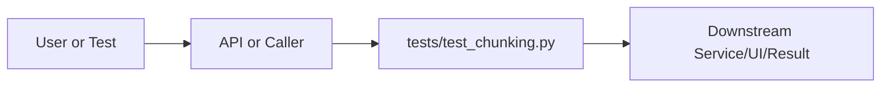

# test_chunking.py Explained

Generated educational companion for `tests/test_chunking.py`. This file is intentionally detailed so a developer can understand the code, architecture role, production tradeoffs, and ML/backend concepts behind the implementation.

## File Overview

`tests/test_chunking.py` is a Python module in the Test layer: behavioral, safety, performance, and integration checks. It defines TestEdgeCases, TestChunkingBehaviour, TestSentenceBoundaries, TestDeterminism and no top-level functions.

## Why This File Exists

This file isolates one responsibility in the codebase: Test layer: behavioral, safety, performance, and integration checks. Separation matters because AI systems are easier to test, scale, debug, and explain when retrieval, orchestration, ML services, memory, UI, and deployment scripts have clear boundaries.

## Workflow Position

**Layer:** Test layer: behavioral, safety, performance, and integration checks.

**Previous step:** caller code, an API request, a browser event, a test fixture, an import, or a startup script prepares inputs.

**Current step:** `tests/test_chunking.py` performs its local responsibility.

**Next step:** downstream services, API responses, rendered UI, tests, or process execution consume the result.



## Inputs and Outputs

- **Inputs:** function arguments, class constructor dependencies, HTTP payloads, environment variables, filesystem artifacts, DOM events, or test fixtures.
- **Outputs:** return values, dictionaries, Pydantic models, rendered DOM state, API responses, logs, process startup, assertions, or side effects.
- **Serialization:** this project uses JSON for APIs/LLM planning, parquet/joblib/faiss for ML artifacts, and HTML/CSS/JS for the browser surface.

## Imports Explained

| Import | Explanation |
|---|---|
| `__future__` | Project or standard-library dependency used to import a service, type, helper, or runtime capability. Imports affect startup time, packaging, and test isolation. |
| `pytest` | Project or standard-library dependency used to import a service, type, helper, or runtime capability. Imports affect startup time, packaging, and test isolation. |
| `research_ai` | Project or standard-library dependency used to import a service, type, helper, or runtime capability. Imports affect startup time, packaging, and test isolation. |

## Global Variables and Config

No major module-level variables are declared. This reduces hidden state and keeps imports lightweight.

## Step-by-Step Workflow

1. Load dependencies and runtime constants.
2. Accept input from the previous layer.
3. Validate, transform, route, score, render, or execute according to this file's role.
4. Return a structured output or perform a controlled side effect.
5. Let caller layers handle presentation, persistence, retries, or fallback.

## Function-by-Function Breakdown

No top-level functions are defined. Behavior is class-based, declarative, or provided through package exports.

## Class-by-Class Breakdown

### `TestEdgeCases`

- **Line:** 24
- **Base classes:** `object`
- **Docstring:** No explicit class docstring.

**Methods:**
- `test_empty_string` at line 25: method behavior is described by its body and name
- `test_whitespace_only` at line 28: method behavior is described by its body and name
- `test_single_sentence` at line 31: method behavior is described by its body and name
- `test_no_empty_chunks` at line 36: method behavior is described by its body and name
- `test_output_is_list_of_strings` at line 42: method behavior is described by its body and name

```python
class TestEdgeCases:
    def test_empty_string(self):
        assert contextual_chunks("") == []

    def test_whitespace_only(self):
        assert contextual_chunks("   \n\t  ") == []

    def test_single_sentence(self):
        chunks = contextual_chunks("This is a single sentence.")
        assert len(chunks) == 1
        assert "single sentence" in chunks[0]

    def test_no_empty_chunks(self):
        text = "Word " * 2000
        chunks = contextual_chunks(text)
        for chunk in chunks:
            assert chunk.strip() != "", "Found empty chunk"

    def test_output_is_list_of_strings(self):
        chunks = contextual_chunks("Some academic text about neural networks.")
        assert isinstance(chunks, list)
        for c in chunks:
            assert isinstance(c, str)
```

This class packages state and behavior behind a service-style interface. Constructor dependencies show what the class needs; public methods show what the rest of the system can ask it to do. In production, this boundary is where caching, model loading, artifact access, and error handling must be controlled.

### `TestChunkingBehaviour`

- **Line:** 53
- **Base classes:** `object`
- **Docstring:** No explicit class docstring.

**Methods:**
- `test_short_text_single_chunk` at line 54: A text shorter than chunk_size returns exactly one chunk.
- `test_long_text_multiple_chunks` at line 60: A text longer than chunk_size is split into multiple chunks.
- `test_chunk_size_respected_approximately` at line 67: Chunks should stay near the target chunk_size.

NOTE: The chunker splits on SENTENCE boundaries, so text with no
punctuation cannot be split (the whole text is one "sentence").
This test uses text with proper sentence endings so chunking fires.
We allow 2× chunk_size as the upper bound, since sentence-boundary
alignment means the split may happen slightly after chunk_size.
- `test_overlap_carries_words` at line 86: The end of chunk N should overlap with the start of chunk N+1.
- `test_no_chunk_below_min_words` at line 100: Tiny trailing fragments are merged into the previous chunk.

```python
class TestChunkingBehaviour:
    def test_short_text_single_chunk(self):
        """A text shorter than chunk_size returns exactly one chunk."""
        text = " ".join(["word"] * 50)  # 50 words << 900 default
        chunks = contextual_chunks(text, chunk_size=900)
        assert len(chunks) == 1

    def test_long_text_multiple_chunks(self):
        """A text longer than chunk_size is split into multiple chunks."""
        # Build 3000-word text (should produce ~3-4 chunks at 900 words each)
        text = ". ".join([" ".join(["word"] * 100)] * 30) + "."
        chunks = contextual_chunks(text, chunk_size=900)
        assert len(chunks) >= 2

    def test_chunk_size_respected_approximately(self):
        """Chunks should stay near the target chunk_size.

        NOTE: The chunker splits on SENTENCE boundaries, so text with no
        punctuation cannot be split (the whole text is one "sentence").
        This test uses text with proper sentence endings so chunking fires.
        We allow 2× chunk_size as the upper bound, since sentence-boundary
        alignment means the split may happen slightly after chunk_size.
        """
        # Build 2000-word text as 40-word sentences with proper punctuation
        sentence = " ".join(["word"] * 40) + "."
        text = " ".join([sentence] * 50)  # 50 × 40 = 2000 words
        chunks = contextual_chunks(text, chunk_size=200, overlap=50)
        assert len(chunks) >= 2, "Text should produce multiple chunks"
        for chunk in chunks:
            word_count = len(chunk.split())
            # Allow 2× chunk_size to account for overlap + sentence boundary alignment
            assert word_count <= 400 + 1, f"Chunk too large: {word_count} words"

    def test_overlap_carries_words(self):
        """The end of chunk N should overlap with the start of chunk N+1."""
        # Build text with identifiable sentences
        sentences = [f"Sentence {i} has five words here." for i in range(100)]
        text = " ".join(sentences)
        chunks = contextual_chunks(text, chunk_size=50, overlap=20)
        if len(chunks) < 2:
            pytest.skip("Text too short to produce overlap with these parameters")
        # Some words from chunk[0] should appear in chunk[1]
        words_0 = set(chunks[0].lower().split())
        words_1 = set(chunks[1].lower().split())
        common = words_0 & words_1
        assert len(common) > 0, "No overlap found between consecutive chunks"

    def test_no_chunk_below_min_words(self):
        """Tiny trailing fragments are merged into the previous chunk."""
        # Build text that would produce a 5-word tail
        base = " ".join(["word"] * 900)
        tail = " ".join(["tail"] * 5)  # well below default min_chunk_words=20
        text = base + ". " + tail + "."
        chunks = contextual_chunks(text, chunk_size=900, overlap=150, min_chunk_words=20)
        for chunk in chunks[:-1]:  # all but last should be full-size
            assert len(chunk.split()) >= 20
```

This class packages state and behavior behind a service-style interface. Constructor dependencies show what the class needs; public methods show what the rest of the system can ask it to do. In production, this boundary is where caching, model loading, artifact access, and error handling must be controlled.

### `TestSentenceBoundaries`

- **Line:** 115
- **Base classes:** `object`
- **Docstring:** No explicit class docstring.

**Methods:**
- `test_et_al_not_split` at line 116: 'et al.' should not cause a sentence boundary.
- `test_fig_not_split` at line 132: 'Fig.' should not cause a sentence boundary.

```python
class TestSentenceBoundaries:
    def test_et_al_not_split(self):
        """'et al.' should not cause a sentence boundary."""
        text = (
            "Smith et al. proposed a new model. "
            "The model achieved state-of-the-art results. " * 50
        )
        chunks = contextual_chunks(text, chunk_size=200)
        # Verify 'et al' is not split mid-chunk (it's joined with the next word)
        for chunk in chunks:
            # "et al." should always be followed by more text in the same chunk,
            # not cut off at the "." after "al"
            if "et al." in chunk:
                idx = chunk.index("et al.")
                # There should be characters after "et al." in the chunk
                assert idx + len("et al.") < len(chunk)

    def test_fig_not_split(self):
        """'Fig.' should not cause a sentence boundary."""
        text = (
            "As shown in Fig. 1, the results demonstrate improvement. " * 50
        )
        chunks = contextual_chunks(text, chunk_size=200)
        assert chunks  # just verify it doesn't crash
```

This class packages state and behavior behind a service-style interface. Constructor dependencies show what the class needs; public methods show what the rest of the system can ask it to do. In production, this boundary is where caching, model loading, artifact access, and error handling must be controlled.

### `TestDeterminism`

- **Line:** 145
- **Base classes:** `object`
- **Docstring:** No explicit class docstring.

**Methods:**
- `test_same_input_same_output` at line 146: method behavior is described by its body and name

```python
class TestDeterminism:
    def test_same_input_same_output(self):
        text = " ".join([f"word{i}" for i in range(500)])
        chunks_1 = contextual_chunks(text)
        chunks_2 = contextual_chunks(text)
        assert chunks_1 == chunks_2
```

This class packages state and behavior behind a service-style interface. Constructor dependencies show what the class needs; public methods show what the rest of the system can ask it to do. In production, this boundary is where caching, model loading, artifact access, and error handling must be controlled.


## Method-by-Method Deep Dive

### Class `TestEdgeCases` Methods

#### `TestEdgeCases.test_empty_string`

- **Line:** 25
- **Kind:** synchronous method
- **Arguments:** self
- **Docstring:** No explicit docstring; behavior is inferred from the implementation and call sites.

```python
    def test_empty_string(self):
        assert contextual_chunks("") == []
```

This method is part of the class contract. Its inputs show what state or caller data it consumes; its body shows whether it performs pure transformation, model/artifact access, retrieval, I/O, caching, validation, or orchestration. In production review, pay attention to error handling, mutation of `self`, repeated expensive work, and whether return shapes stay stable for downstream callers.

#### `TestEdgeCases.test_whitespace_only`

- **Line:** 28
- **Kind:** synchronous method
- **Arguments:** self
- **Docstring:** No explicit docstring; behavior is inferred from the implementation and call sites.

```python
    def test_whitespace_only(self):
        assert contextual_chunks("   \n\t  ") == []
```

This method is part of the class contract. Its inputs show what state or caller data it consumes; its body shows whether it performs pure transformation, model/artifact access, retrieval, I/O, caching, validation, or orchestration. In production review, pay attention to error handling, mutation of `self`, repeated expensive work, and whether return shapes stay stable for downstream callers.

#### `TestEdgeCases.test_single_sentence`

- **Line:** 31
- **Kind:** synchronous method
- **Arguments:** self
- **Docstring:** No explicit docstring; behavior is inferred from the implementation and call sites.

```python
    def test_single_sentence(self):
        chunks = contextual_chunks("This is a single sentence.")
        assert len(chunks) == 1
        assert "single sentence" in chunks[0]
```

This method is part of the class contract. Its inputs show what state or caller data it consumes; its body shows whether it performs pure transformation, model/artifact access, retrieval, I/O, caching, validation, or orchestration. In production review, pay attention to error handling, mutation of `self`, repeated expensive work, and whether return shapes stay stable for downstream callers.

#### `TestEdgeCases.test_no_empty_chunks`

- **Line:** 36
- **Kind:** synchronous method
- **Arguments:** self
- **Docstring:** No explicit docstring; behavior is inferred from the implementation and call sites.

```python
    def test_no_empty_chunks(self):
        text = "Word " * 2000
        chunks = contextual_chunks(text)
        for chunk in chunks:
            assert chunk.strip() != "", "Found empty chunk"
```

This method is part of the class contract. Its inputs show what state or caller data it consumes; its body shows whether it performs pure transformation, model/artifact access, retrieval, I/O, caching, validation, or orchestration. In production review, pay attention to error handling, mutation of `self`, repeated expensive work, and whether return shapes stay stable for downstream callers.

#### `TestEdgeCases.test_output_is_list_of_strings`

- **Line:** 42
- **Kind:** synchronous method
- **Arguments:** self
- **Docstring:** No explicit docstring; behavior is inferred from the implementation and call sites.

```python
    def test_output_is_list_of_strings(self):
        chunks = contextual_chunks("Some academic text about neural networks.")
        assert isinstance(chunks, list)
        for c in chunks:
            assert isinstance(c, str)
```

This method is part of the class contract. Its inputs show what state or caller data it consumes; its body shows whether it performs pure transformation, model/artifact access, retrieval, I/O, caching, validation, or orchestration. In production review, pay attention to error handling, mutation of `self`, repeated expensive work, and whether return shapes stay stable for downstream callers.

### Class `TestChunkingBehaviour` Methods

#### `TestChunkingBehaviour.test_short_text_single_chunk`

- **Line:** 54
- **Kind:** synchronous method
- **Arguments:** self
- **Docstring:** A text shorter than chunk_size returns exactly one chunk.

```python
    def test_short_text_single_chunk(self):
        """A text shorter than chunk_size returns exactly one chunk."""
        text = " ".join(["word"] * 50)  # 50 words << 900 default
        chunks = contextual_chunks(text, chunk_size=900)
        assert len(chunks) == 1
```

This method is part of the class contract. Its inputs show what state or caller data it consumes; its body shows whether it performs pure transformation, model/artifact access, retrieval, I/O, caching, validation, or orchestration. In production review, pay attention to error handling, mutation of `self`, repeated expensive work, and whether return shapes stay stable for downstream callers.

#### `TestChunkingBehaviour.test_long_text_multiple_chunks`

- **Line:** 60
- **Kind:** synchronous method
- **Arguments:** self
- **Docstring:** A text longer than chunk_size is split into multiple chunks.

```python
    def test_long_text_multiple_chunks(self):
        """A text longer than chunk_size is split into multiple chunks."""
        # Build 3000-word text (should produce ~3-4 chunks at 900 words each)
        text = ". ".join([" ".join(["word"] * 100)] * 30) + "."
        chunks = contextual_chunks(text, chunk_size=900)
        assert len(chunks) >= 2
```

This method is part of the class contract. Its inputs show what state or caller data it consumes; its body shows whether it performs pure transformation, model/artifact access, retrieval, I/O, caching, validation, or orchestration. In production review, pay attention to error handling, mutation of `self`, repeated expensive work, and whether return shapes stay stable for downstream callers.

#### `TestChunkingBehaviour.test_chunk_size_respected_approximately`

- **Line:** 67
- **Kind:** synchronous method
- **Arguments:** self
- **Docstring:** Chunks should stay near the target chunk_size.

NOTE: The chunker splits on SENTENCE boundaries, so text with no
punctuation cannot be split (the whole text is one "sentence").
This test uses text with proper sentence endings so chunking fires.
We allow 2× chunk_size as the upper bound, since sentence-boundary
alignment means the split may happen slightly after chunk_size.

```python
    def test_chunk_size_respected_approximately(self):
        """Chunks should stay near the target chunk_size.

        NOTE: The chunker splits on SENTENCE boundaries, so text with no
        punctuation cannot be split (the whole text is one "sentence").
        This test uses text with proper sentence endings so chunking fires.
        We allow 2× chunk_size as the upper bound, since sentence-boundary
        alignment means the split may happen slightly after chunk_size.
        """
        # Build 2000-word text as 40-word sentences with proper punctuation
        sentence = " ".join(["word"] * 40) + "."
        text = " ".join([sentence] * 50)  # 50 × 40 = 2000 words
        chunks = contextual_chunks(text, chunk_size=200, overlap=50)
        assert len(chunks) >= 2, "Text should produce multiple chunks"
        for chunk in chunks:
            word_count = len(chunk.split())
            # Allow 2× chunk_size to account for overlap + sentence boundary alignment
            assert word_count <= 400 + 1, f"Chunk too large: {word_count} words"
```

This method is part of the class contract. Its inputs show what state or caller data it consumes; its body shows whether it performs pure transformation, model/artifact access, retrieval, I/O, caching, validation, or orchestration. In production review, pay attention to error handling, mutation of `self`, repeated expensive work, and whether return shapes stay stable for downstream callers.

#### `TestChunkingBehaviour.test_overlap_carries_words`

- **Line:** 86
- **Kind:** synchronous method
- **Arguments:** self
- **Docstring:** The end of chunk N should overlap with the start of chunk N+1.

```python
    def test_overlap_carries_words(self):
        """The end of chunk N should overlap with the start of chunk N+1."""
        # Build text with identifiable sentences
        sentences = [f"Sentence {i} has five words here." for i in range(100)]
        text = " ".join(sentences)
        chunks = contextual_chunks(text, chunk_size=50, overlap=20)
        if len(chunks) < 2:
            pytest.skip("Text too short to produce overlap with these parameters")
        # Some words from chunk[0] should appear in chunk[1]
        words_0 = set(chunks[0].lower().split())
        words_1 = set(chunks[1].lower().split())
        common = words_0 & words_1
        assert len(common) > 0, "No overlap found between consecutive chunks"
```

This method is part of the class contract. Its inputs show what state or caller data it consumes; its body shows whether it performs pure transformation, model/artifact access, retrieval, I/O, caching, validation, or orchestration. In production review, pay attention to error handling, mutation of `self`, repeated expensive work, and whether return shapes stay stable for downstream callers.

#### `TestChunkingBehaviour.test_no_chunk_below_min_words`

- **Line:** 100
- **Kind:** synchronous method
- **Arguments:** self
- **Docstring:** Tiny trailing fragments are merged into the previous chunk.

```python
    def test_no_chunk_below_min_words(self):
        """Tiny trailing fragments are merged into the previous chunk."""
        # Build text that would produce a 5-word tail
        base = " ".join(["word"] * 900)
        tail = " ".join(["tail"] * 5)  # well below default min_chunk_words=20
        text = base + ". " + tail + "."
        chunks = contextual_chunks(text, chunk_size=900, overlap=150, min_chunk_words=20)
        for chunk in chunks[:-1]:  # all but last should be full-size
            assert len(chunk.split()) >= 20
```

This method is part of the class contract. Its inputs show what state or caller data it consumes; its body shows whether it performs pure transformation, model/artifact access, retrieval, I/O, caching, validation, or orchestration. In production review, pay attention to error handling, mutation of `self`, repeated expensive work, and whether return shapes stay stable for downstream callers.

### Class `TestSentenceBoundaries` Methods

#### `TestSentenceBoundaries.test_et_al_not_split`

- **Line:** 116
- **Kind:** synchronous method
- **Arguments:** self
- **Docstring:** 'et al.' should not cause a sentence boundary.

```python
    def test_et_al_not_split(self):
        """'et al.' should not cause a sentence boundary."""
        text = (
            "Smith et al. proposed a new model. "
            "The model achieved state-of-the-art results. " * 50
        )
        chunks = contextual_chunks(text, chunk_size=200)
        # Verify 'et al' is not split mid-chunk (it's joined with the next word)
        for chunk in chunks:
            # "et al." should always be followed by more text in the same chunk,
            # not cut off at the "." after "al"
            if "et al." in chunk:
                idx = chunk.index("et al.")
                # There should be characters after "et al." in the chunk
                assert idx + len("et al.") < len(chunk)
```

This method is part of the class contract. Its inputs show what state or caller data it consumes; its body shows whether it performs pure transformation, model/artifact access, retrieval, I/O, caching, validation, or orchestration. In production review, pay attention to error handling, mutation of `self`, repeated expensive work, and whether return shapes stay stable for downstream callers.

#### `TestSentenceBoundaries.test_fig_not_split`

- **Line:** 132
- **Kind:** synchronous method
- **Arguments:** self
- **Docstring:** 'Fig.' should not cause a sentence boundary.

```python
    def test_fig_not_split(self):
        """'Fig.' should not cause a sentence boundary."""
        text = (
            "As shown in Fig. 1, the results demonstrate improvement. " * 50
        )
        chunks = contextual_chunks(text, chunk_size=200)
        assert chunks  # just verify it doesn't crash
```

This method is part of the class contract. Its inputs show what state or caller data it consumes; its body shows whether it performs pure transformation, model/artifact access, retrieval, I/O, caching, validation, or orchestration. In production review, pay attention to error handling, mutation of `self`, repeated expensive work, and whether return shapes stay stable for downstream callers.

### Class `TestDeterminism` Methods

#### `TestDeterminism.test_same_input_same_output`

- **Line:** 146
- **Kind:** synchronous method
- **Arguments:** self
- **Docstring:** No explicit docstring; behavior is inferred from the implementation and call sites.

```python
    def test_same_input_same_output(self):
        text = " ".join([f"word{i}" for i in range(500)])
        chunks_1 = contextual_chunks(text)
        chunks_2 = contextual_chunks(text)
        assert chunks_1 == chunks_2
```

This method is part of the class contract. Its inputs show what state or caller data it consumes; its body shows whether it performs pure transformation, model/artifact access, retrieval, I/O, caching, validation, or orchestration. In production review, pay attention to error handling, mutation of `self`, repeated expensive work, and whether return shapes stay stable for downstream callers.

## Important Algorithms Used

- **RAG**: Retrieval-Augmented Generation retrieves evidence first and asks an LLM to answer from that evidence, reducing hallucination.
- **Streaming**: Streaming improves perceived latency by sending incremental output instead of waiting for full completion.
- **Sandboxing**: Sandboxing validates and constrains user code before execution, reducing security and stability risk.

## Libraries Used

| Import | Explanation |
|---|---|
| `__future__` | Project or standard-library dependency used to import a service, type, helper, or runtime capability. Imports affect startup time, packaging, and test isolation. |
| `pytest` | Project or standard-library dependency used to import a service, type, helper, or runtime capability. Imports affect startup time, packaging, and test isolation. |
| `research_ai` | Project or standard-library dependency used to import a service, type, helper, or runtime capability. Imports affect startup time, packaging, and test isolation. |

## ML Concepts Used

- **RAG**: Retrieval-Augmented Generation retrieves evidence first and asks an LLM to answer from that evidence, reducing hallucination.
- **Streaming**: Streaming improves perceived latency by sending incremental output instead of waiting for full completion.
- **Sandboxing**: Sandboxing validates and constrains user code before execution, reducing security and stability risk.

## Performance and Memory Notes

- Avoid eager loading of heavy ML models unless startup latency is acceptable.
- Cache expensive clients, tokenizers, vector stores, and embeddings carefully.
- Use float32 for embedding vectors because it halves memory compared with float64 and matches FAISS/neural inference expectations.
- Bound prompt length, uploaded content, result counts, and token budgets to control latency and memory.
- Watch copies of large metadata frames, embedding matrices, and file buffers.

## Scalability Notes

- In-memory state works for local demos but needs Redis/database/object storage for multi-worker cloud deployment.
- CPU/GPU inference should often be separated from the web API when traffic grows.
- Retrieval can start exact and move to approximate indexes as corpus size grows.
- Batch operations and cache repeated work to improve throughput.
- Add metrics for latency, errors, fallback frequency, retrieval hit rate, and token usage.

## Production Engineering Notes

- Keep interfaces stable because other files may import this module or depend on its response shape.
- Prefer typed/structured data over free-form strings at service boundaries.
- Log operational context without secrets or huge payloads.
- Make fallback behavior explicit so users get useful output even when LLMs or artifacts fail.
- Keep provider-specific logic behind adapters so Groq/OpenRouter/Google/Ollama can be swapped.

## Common Bugs and Failure Cases

- Missing `.env` values, model artifacts, or Ollama models can trigger degraded behavior.
- Type mismatches occur when LLM-generated tool arguments cross into strict Python code.
- Empty retrieval results must not become hallucinated answers.
- Network calls need timeouts and careful retry behavior.
- Frontend IDs/classes and API schemas are contracts; changing one side without the other breaks workflows.

## Security Considerations

- Deals with execution or subprocesses. Maintain AST validation, isolated mode, timeouts, and least privilege.

## Real Industry Usage

- This pattern appears in enterprise RAG assistants, scientific search tools, internal research copilots, and ML platform demos.
- The layered design mirrors production systems: API facade, orchestration, retrieval, evaluation, synthesis, UI, and deployment.
- Clear separation lets teams replace model providers, improve retrieval, harden security, or redesign UI independently.

## Optimization Opportunities

- Add tracing around each workflow step.
- Strengthen schema validation at boundaries.
- Persist conversation/session state outside process memory.
- Add load tests and adversarial tests for prompt injection, empty evidence, and large uploads.
- Consider approximate vector indexes, reranker models, or batching when corpus/traffic grows.

## How This Connects To Other Files

- `tests/test_chunking.py` is connected through imports, startup scripts, API routes, frontend selectors, tests, or artifact paths.
- `src/research_ai/platform.py` is the backend composition root.
- `src/research_ai/api/main.py` exposes backend behavior over HTTP.
- Retrieval modules depend on artifacts under `artifacts/`.
- Frontend files depend on stable endpoint and DOM contracts.

## End-to-End Flow Summary

- A user/browser/test/startup event enters the system.
- The relevant layer validates or normalizes input.
- Retrieval, ML, orchestration, execution, or UI rendering happens.
- A structured result, visual state, or process side effect is produced.
- Fallbacks and tests keep behavior understandable when dependencies are unavailable.

## Interview Questions

1. What responsibility does this file own?
2. What inputs and outputs define its contract?
3. Which dependencies are expensive or operationally risky?
4. What breaks if this file changes shape?
5. How would you scale or test this behavior in production?

## Key Takeaways

- `tests/test_chunking.py` should be understood as part of a layered AI research platform.
- Trace data flow from inputs to transformations to outputs.
- Production readiness comes from explicit contracts, bounded resources, observability, secure defaults, and graceful fallback.

## Fully Commented Source

This section repeats the original source with an explanatory comment before every line. The comments are educational only; they are not inserted into the production source file.

```python
# L0001: Starts, ends, or continues a docstring that documents module, class, or function intent.
"""Tests for contextual_chunks — sentence-aware document chunking.
# L0002: Blank line that visually separates logical sections and improves readability.

# L0003: Executes Python logic as part of this file's workflow; read surrounding lines for data flow and side effects.
Covers:
# L0004: Executes Python logic as part of this file's workflow; read surrounding lines for data flow and side effects.
  - Empty / whitespace-only input
# L0005: Executes Python logic as part of this file's workflow; read surrounding lines for data flow and side effects.
  - Short text fits in one chunk
# L0006: Executes Python logic as part of this file's workflow; read surrounding lines for data flow and side effects.
  - Long text splits correctly
# L0007: Executes Python logic as part of this file's workflow; read surrounding lines for data flow and side effects.
  - Chunk overlap (words from previous chunk appear in next)
# L0008: Executes Python logic as part of this file's workflow; read surrounding lines for data flow and side effects.
  - No empty chunks in output
# L0009: Executes Python logic as part of this file's workflow; read surrounding lines for data flow and side effects.
  - Min-chunk merging (tiny trailing fragments get merged)
# L0010: Executes Python logic as part of this file's workflow; read surrounding lines for data flow and side effects.
  - Section header detection starts a new chunk
# L0011: Executes Python logic as part of this file's workflow; read surrounding lines for data flow and side effects.
  - Scientific abbreviation handling (et al., Fig., vs.)
# L0012: Starts, ends, or continues a docstring that documents module, class, or function intent.
"""
# L0013: Enables future Python behavior so annotations/import semantics stay modern and predictable.
from __future__ import annotations
# L0014: Blank line that visually separates logical sections and improves readability.

# L0015: Imports a dependency, type, or project module needed by later code in this file.
import pytest
# L0016: Blank line that visually separates logical sections and improves readability.

# L0017: Imports a dependency, type, or project module needed by later code in this file.
from research_ai.retrieval.chunking import contextual_chunks
# L0018: Blank line that visually separates logical sections and improves readability.

# L0019: Blank line that visually separates logical sections and improves readability.

# L0020: Developer comment explaining intent, caveat, section boundary, or operational reasoning.
# ---------------------------------------------------------------------------
# L0021: Developer comment explaining intent, caveat, section boundary, or operational reasoning.
# Edge cases
# L0022: Developer comment explaining intent, caveat, section boundary, or operational reasoning.
# ---------------------------------------------------------------------------
# L0023: Blank line that visually separates logical sections and improves readability.

# L0024: Defines a class that groups related state and behavior behind a reusable interface.
class TestEdgeCases:
# L0025: Defines a function or method; parameters are the input contract and the body implements the workflow.
    def test_empty_string(self):
# L0026: Assigns or updates a value used later in the workflow; check mutability and data shape.
        assert contextual_chunks("") == []
# L0027: Blank line that visually separates logical sections and improves readability.

# L0028: Defines a function or method; parameters are the input contract and the body implements the workflow.
    def test_whitespace_only(self):
# L0029: Assigns or updates a value used later in the workflow; check mutability and data shape.
        assert contextual_chunks("   \n\t  ") == []
# L0030: Blank line that visually separates logical sections and improves readability.

# L0031: Defines a function or method; parameters are the input contract and the body implements the workflow.
    def test_single_sentence(self):
# L0032: Assigns or updates a value used later in the workflow; check mutability and data shape.
        chunks = contextual_chunks("This is a single sentence.")
# L0033: Assigns or updates a value used later in the workflow; check mutability and data shape.
        assert len(chunks) == 1
# L0034: Executes Python logic as part of this file's workflow; read surrounding lines for data flow and side effects.
        assert "single sentence" in chunks[0]
# L0035: Blank line that visually separates logical sections and improves readability.

# L0036: Defines a function or method; parameters are the input contract and the body implements the workflow.
    def test_no_empty_chunks(self):
# L0037: Assigns or updates a value used later in the workflow; check mutability and data shape.
        text = "Word " * 2000
# L0038: Assigns or updates a value used later in the workflow; check mutability and data shape.
        chunks = contextual_chunks(text)
# L0039: Iterates over data, retry attempts, files, results, or workflow steps.
        for chunk in chunks:
# L0040: Assigns or updates a value used later in the workflow; check mutability and data shape.
            assert chunk.strip() != "", "Found empty chunk"
# L0041: Blank line that visually separates logical sections and improves readability.

# L0042: Defines a function or method; parameters are the input contract and the body implements the workflow.
    def test_output_is_list_of_strings(self):
# L0043: Assigns or updates a value used later in the workflow; check mutability and data shape.
        chunks = contextual_chunks("Some academic text about neural networks.")
# L0044: Executes Python logic as part of this file's workflow; read surrounding lines for data flow and side effects.
        assert isinstance(chunks, list)
# L0045: Iterates over data, retry attempts, files, results, or workflow steps.
        for c in chunks:
# L0046: Executes Python logic as part of this file's workflow; read surrounding lines for data flow and side effects.
            assert isinstance(c, str)
# L0047: Blank line that visually separates logical sections and improves readability.

# L0048: Blank line that visually separates logical sections and improves readability.

# L0049: Developer comment explaining intent, caveat, section boundary, or operational reasoning.
# ---------------------------------------------------------------------------
# L0050: Developer comment explaining intent, caveat, section boundary, or operational reasoning.
# Chunking behaviour
# L0051: Developer comment explaining intent, caveat, section boundary, or operational reasoning.
# ---------------------------------------------------------------------------
# L0052: Blank line that visually separates logical sections and improves readability.

# L0053: Defines a class that groups related state and behavior behind a reusable interface.
class TestChunkingBehaviour:
# L0054: Defines a function or method; parameters are the input contract and the body implements the workflow.
    def test_short_text_single_chunk(self):
# L0055: Starts, ends, or continues a docstring that documents module, class, or function intent.
        """A text shorter than chunk_size returns exactly one chunk."""
# L0056: Assigns or updates a value used later in the workflow; check mutability and data shape.
        text = " ".join(["word"] * 50)  # 50 words << 900 default
# L0057: Assigns or updates a value used later in the workflow; check mutability and data shape.
        chunks = contextual_chunks(text, chunk_size=900)
# L0058: Assigns or updates a value used later in the workflow; check mutability and data shape.
        assert len(chunks) == 1
# L0059: Blank line that visually separates logical sections and improves readability.

# L0060: Defines a function or method; parameters are the input contract and the body implements the workflow.
    def test_long_text_multiple_chunks(self):
# L0061: Starts, ends, or continues a docstring that documents module, class, or function intent.
        """A text longer than chunk_size is split into multiple chunks."""
# L0062: Developer comment explaining intent, caveat, section boundary, or operational reasoning.
        # Build 3000-word text (should produce ~3-4 chunks at 900 words each)
# L0063: Assigns or updates a value used later in the workflow; check mutability and data shape.
        text = ". ".join([" ".join(["word"] * 100)] * 30) + "."
# L0064: Assigns or updates a value used later in the workflow; check mutability and data shape.
        chunks = contextual_chunks(text, chunk_size=900)
# L0065: Assigns or updates a value used later in the workflow; check mutability and data shape.
        assert len(chunks) >= 2
# L0066: Blank line that visually separates logical sections and improves readability.

# L0067: Defines a function or method; parameters are the input contract and the body implements the workflow.
    def test_chunk_size_respected_approximately(self):
# L0068: Starts, ends, or continues a docstring that documents module, class, or function intent.
        """Chunks should stay near the target chunk_size.
# L0069: Blank line that visually separates logical sections and improves readability.

# L0070: Executes Python logic as part of this file's workflow; read surrounding lines for data flow and side effects.
        NOTE: The chunker splits on SENTENCE boundaries, so text with no
# L0071: Executes Python logic as part of this file's workflow; read surrounding lines for data flow and side effects.
        punctuation cannot be split (the whole text is one "sentence").
# L0072: Executes Python logic as part of this file's workflow; read surrounding lines for data flow and side effects.
        This test uses text with proper sentence endings so chunking fires.
# L0073: Executes Python logic as part of this file's workflow; read surrounding lines for data flow and side effects.
        We allow 2× chunk_size as the upper bound, since sentence-boundary
# L0074: Executes Python logic as part of this file's workflow; read surrounding lines for data flow and side effects.
        alignment means the split may happen slightly after chunk_size.
# L0075: Starts, ends, or continues a docstring that documents module, class, or function intent.
        """
# L0076: Developer comment explaining intent, caveat, section boundary, or operational reasoning.
        # Build 2000-word text as 40-word sentences with proper punctuation
# L0077: Assigns or updates a value used later in the workflow; check mutability and data shape.
        sentence = " ".join(["word"] * 40) + "."
# L0078: Assigns or updates a value used later in the workflow; check mutability and data shape.
        text = " ".join([sentence] * 50)  # 50 × 40 = 2000 words
# L0079: Assigns or updates a value used later in the workflow; check mutability and data shape.
        chunks = contextual_chunks(text, chunk_size=200, overlap=50)
# L0080: Assigns or updates a value used later in the workflow; check mutability and data shape.
        assert len(chunks) >= 2, "Text should produce multiple chunks"
# L0081: Iterates over data, retry attempts, files, results, or workflow steps.
        for chunk in chunks:
# L0082: Assigns or updates a value used later in the workflow; check mutability and data shape.
            word_count = len(chunk.split())
# L0083: Developer comment explaining intent, caveat, section boundary, or operational reasoning.
            # Allow 2× chunk_size to account for overlap + sentence boundary alignment
# L0084: Assigns or updates a value used later in the workflow; check mutability and data shape.
            assert word_count <= 400 + 1, f"Chunk too large: {word_count} words"
# L0085: Blank line that visually separates logical sections and improves readability.

# L0086: Defines a function or method; parameters are the input contract and the body implements the workflow.
    def test_overlap_carries_words(self):
# L0087: Starts, ends, or continues a docstring that documents module, class, or function intent.
        """The end of chunk N should overlap with the start of chunk N+1."""
# L0088: Developer comment explaining intent, caveat, section boundary, or operational reasoning.
        # Build text with identifiable sentences
# L0089: Assigns or updates a value used later in the workflow; check mutability and data shape.
        sentences = [f"Sentence {i} has five words here." for i in range(100)]
# L0090: Assigns or updates a value used later in the workflow; check mutability and data shape.
        text = " ".join(sentences)
# L0091: Assigns or updates a value used later in the workflow; check mutability and data shape.
        chunks = contextual_chunks(text, chunk_size=50, overlap=20)
# L0092: Branches execution based on a condition, usually for validation, fallback, or mode-specific behavior.
        if len(chunks) < 2:
# L0093: Executes Python logic as part of this file's workflow; read surrounding lines for data flow and side effects.
            pytest.skip("Text too short to produce overlap with these parameters")
# L0094: Developer comment explaining intent, caveat, section boundary, or operational reasoning.
        # Some words from chunk[0] should appear in chunk[1]
# L0095: Assigns or updates a value used later in the workflow; check mutability and data shape.
        words_0 = set(chunks[0].lower().split())
# L0096: Assigns or updates a value used later in the workflow; check mutability and data shape.
        words_1 = set(chunks[1].lower().split())
# L0097: Assigns or updates a value used later in the workflow; check mutability and data shape.
        common = words_0 & words_1
# L0098: Executes Python logic as part of this file's workflow; read surrounding lines for data flow and side effects.
        assert len(common) > 0, "No overlap found between consecutive chunks"
# L0099: Blank line that visually separates logical sections and improves readability.

# L0100: Defines a function or method; parameters are the input contract and the body implements the workflow.
    def test_no_chunk_below_min_words(self):
# L0101: Starts, ends, or continues a docstring that documents module, class, or function intent.
        """Tiny trailing fragments are merged into the previous chunk."""
# L0102: Developer comment explaining intent, caveat, section boundary, or operational reasoning.
        # Build text that would produce a 5-word tail
# L0103: Assigns or updates a value used later in the workflow; check mutability and data shape.
        base = " ".join(["word"] * 900)
# L0104: Assigns or updates a value used later in the workflow; check mutability and data shape.
        tail = " ".join(["tail"] * 5)  # well below default min_chunk_words=20
# L0105: Assigns or updates a value used later in the workflow; check mutability and data shape.
        text = base + ". " + tail + "."
# L0106: Assigns or updates a value used later in the workflow; check mutability and data shape.
        chunks = contextual_chunks(text, chunk_size=900, overlap=150, min_chunk_words=20)
# L0107: Iterates over data, retry attempts, files, results, or workflow steps.
        for chunk in chunks[:-1]:  # all but last should be full-size
# L0108: Assigns or updates a value used later in the workflow; check mutability and data shape.
            assert len(chunk.split()) >= 20
# L0109: Blank line that visually separates logical sections and improves readability.

# L0110: Blank line that visually separates logical sections and improves readability.

# L0111: Developer comment explaining intent, caveat, section boundary, or operational reasoning.
# ---------------------------------------------------------------------------
# L0112: Developer comment explaining intent, caveat, section boundary, or operational reasoning.
# Sentence boundary handling
# L0113: Developer comment explaining intent, caveat, section boundary, or operational reasoning.
# ---------------------------------------------------------------------------
# L0114: Blank line that visually separates logical sections and improves readability.

# L0115: Defines a class that groups related state and behavior behind a reusable interface.
class TestSentenceBoundaries:
# L0116: Defines a function or method; parameters are the input contract and the body implements the workflow.
    def test_et_al_not_split(self):
# L0117: Starts, ends, or continues a docstring that documents module, class, or function intent.
        """'et al.' should not cause a sentence boundary."""
# L0118: Assigns or updates a value used later in the workflow; check mutability and data shape.
        text = (
# L0119: Executes Python logic as part of this file's workflow; read surrounding lines for data flow and side effects.
            "Smith et al. proposed a new model. "
# L0120: Executes Python logic as part of this file's workflow; read surrounding lines for data flow and side effects.
            "The model achieved state-of-the-art results. " * 50
# L0121: Executes Python logic as part of this file's workflow; read surrounding lines for data flow and side effects.
        )
# L0122: Assigns or updates a value used later in the workflow; check mutability and data shape.
        chunks = contextual_chunks(text, chunk_size=200)
# L0123: Developer comment explaining intent, caveat, section boundary, or operational reasoning.
        # Verify 'et al' is not split mid-chunk (it's joined with the next word)
# L0124: Iterates over data, retry attempts, files, results, or workflow steps.
        for chunk in chunks:
# L0125: Developer comment explaining intent, caveat, section boundary, or operational reasoning.
            # "et al." should always be followed by more text in the same chunk,
# L0126: Developer comment explaining intent, caveat, section boundary, or operational reasoning.
            # not cut off at the "." after "al"
# L0127: Branches execution based on a condition, usually for validation, fallback, or mode-specific behavior.
            if "et al." in chunk:
# L0128: Assigns or updates a value used later in the workflow; check mutability and data shape.
                idx = chunk.index("et al.")
# L0129: Developer comment explaining intent, caveat, section boundary, or operational reasoning.
                # There should be characters after "et al." in the chunk
# L0130: Executes Python logic as part of this file's workflow; read surrounding lines for data flow and side effects.
                assert idx + len("et al.") < len(chunk)
# L0131: Blank line that visually separates logical sections and improves readability.

# L0132: Defines a function or method; parameters are the input contract and the body implements the workflow.
    def test_fig_not_split(self):
# L0133: Starts, ends, or continues a docstring that documents module, class, or function intent.
        """'Fig.' should not cause a sentence boundary."""
# L0134: Assigns or updates a value used later in the workflow; check mutability and data shape.
        text = (
# L0135: Executes Python logic as part of this file's workflow; read surrounding lines for data flow and side effects.
            "As shown in Fig. 1, the results demonstrate improvement. " * 50
# L0136: Executes Python logic as part of this file's workflow; read surrounding lines for data flow and side effects.
        )
# L0137: Assigns or updates a value used later in the workflow; check mutability and data shape.
        chunks = contextual_chunks(text, chunk_size=200)
# L0138: Executes Python logic as part of this file's workflow; read surrounding lines for data flow and side effects.
        assert chunks  # just verify it doesn't crash
# L0139: Blank line that visually separates logical sections and improves readability.

# L0140: Blank line that visually separates logical sections and improves readability.

# L0141: Developer comment explaining intent, caveat, section boundary, or operational reasoning.
# ---------------------------------------------------------------------------
# L0142: Developer comment explaining intent, caveat, section boundary, or operational reasoning.
# Determinism
# L0143: Developer comment explaining intent, caveat, section boundary, or operational reasoning.
# ---------------------------------------------------------------------------
# L0144: Blank line that visually separates logical sections and improves readability.

# L0145: Defines a class that groups related state and behavior behind a reusable interface.
class TestDeterminism:
# L0146: Defines a function or method; parameters are the input contract and the body implements the workflow.
    def test_same_input_same_output(self):
# L0147: Assigns or updates a value used later in the workflow; check mutability and data shape.
        text = " ".join([f"word{i}" for i in range(500)])
# L0148: Assigns or updates a value used later in the workflow; check mutability and data shape.
        chunks_1 = contextual_chunks(text)
# L0149: Assigns or updates a value used later in the workflow; check mutability and data shape.
        chunks_2 = contextual_chunks(text)
# L0150: Assigns or updates a value used later in the workflow; check mutability and data shape.
        assert chunks_1 == chunks_2
```

## Source Walkthrough

The complete source is included because the file is short enough to study directly.

```python
"""Tests for contextual_chunks — sentence-aware document chunking.

Covers:
  - Empty / whitespace-only input
  - Short text fits in one chunk
  - Long text splits correctly
  - Chunk overlap (words from previous chunk appear in next)
  - No empty chunks in output
  - Min-chunk merging (tiny trailing fragments get merged)
  - Section header detection starts a new chunk
  - Scientific abbreviation handling (et al., Fig., vs.)
"""
from __future__ import annotations

import pytest

from research_ai.retrieval.chunking import contextual_chunks


# ---------------------------------------------------------------------------
# Edge cases
# ---------------------------------------------------------------------------

class TestEdgeCases:
    def test_empty_string(self):
        assert contextual_chunks("") == []

    def test_whitespace_only(self):
        assert contextual_chunks("   \n\t  ") == []

    def test_single_sentence(self):
        chunks = contextual_chunks("This is a single sentence.")
        assert len(chunks) == 1
        assert "single sentence" in chunks[0]

    def test_no_empty_chunks(self):
        text = "Word " * 2000
        chunks = contextual_chunks(text)
        for chunk in chunks:
            assert chunk.strip() != "", "Found empty chunk"

    def test_output_is_list_of_strings(self):
        chunks = contextual_chunks("Some academic text about neural networks.")
        assert isinstance(chunks, list)
        for c in chunks:
            assert isinstance(c, str)


# ---------------------------------------------------------------------------
# Chunking behaviour
# ---------------------------------------------------------------------------

class TestChunkingBehaviour:
    def test_short_text_single_chunk(self):
        """A text shorter than chunk_size returns exactly one chunk."""
        text = " ".join(["word"] * 50)  # 50 words << 900 default
        chunks = contextual_chunks(text, chunk_size=900)
        assert len(chunks) == 1

    def test_long_text_multiple_chunks(self):
        """A text longer than chunk_size is split into multiple chunks."""
        # Build 3000-word text (should produce ~3-4 chunks at 900 words each)
        text = ". ".join([" ".join(["word"] * 100)] * 30) + "."
        chunks = contextual_chunks(text, chunk_size=900)
        assert len(chunks) >= 2

    def test_chunk_size_respected_approximately(self):
        """Chunks should stay near the target chunk_size.

        NOTE: The chunker splits on SENTENCE boundaries, so text with no
        punctuation cannot be split (the whole text is one "sentence").
        This test uses text with proper sentence endings so chunking fires.
        We allow 2× chunk_size as the upper bound, since sentence-boundary
        alignment means the split may happen slightly after chunk_size.
        """
        # Build 2000-word text as 40-word sentences with proper punctuation
        sentence = " ".join(["word"] * 40) + "."
        text = " ".join([sentence] * 50)  # 50 × 40 = 2000 words
        chunks = contextual_chunks(text, chunk_size=200, overlap=50)
        assert len(chunks) >= 2, "Text should produce multiple chunks"
        for chunk in chunks:
            word_count = len(chunk.split())
            # Allow 2× chunk_size to account for overlap + sentence boundary alignment
            assert word_count <= 400 + 1, f"Chunk too large: {word_count} words"

    def test_overlap_carries_words(self):
        """The end of chunk N should overlap with the start of chunk N+1."""
        # Build text with identifiable sentences
        sentences = [f"Sentence {i} has five words here." for i in range(100)]
        text = " ".join(sentences)
        chunks = contextual_chunks(text, chunk_size=50, overlap=20)
        if len(chunks) < 2:
            pytest.skip("Text too short to produce overlap with these parameters")
        # Some words from chunk[0] should appear in chunk[1]
        words_0 = set(chunks[0].lower().split())
        words_1 = set(chunks[1].lower().split())
        common = words_0 & words_1
        assert len(common) > 0, "No overlap found between consecutive chunks"

    def test_no_chunk_below_min_words(self):
        """Tiny trailing fragments are merged into the previous chunk."""
        # Build text that would produce a 5-word tail
        base = " ".join(["word"] * 900)
        tail = " ".join(["tail"] * 5)  # well below default min_chunk_words=20
        text = base + ". " + tail + "."
        chunks = contextual_chunks(text, chunk_size=900, overlap=150, min_chunk_words=20)
        for chunk in chunks[:-1]:  # all but last should be full-size
            assert len(chunk.split()) >= 20


# ---------------------------------------------------------------------------
# Sentence boundary handling
# ---------------------------------------------------------------------------

class TestSentenceBoundaries:
    def test_et_al_not_split(self):
        """'et al.' should not cause a sentence boundary."""
        text = (
            "Smith et al. proposed a new model. "
            "The model achieved state-of-the-art results. " * 50
        )
        chunks = contextual_chunks(text, chunk_size=200)
        # Verify 'et al' is not split mid-chunk (it's joined with the next word)
        for chunk in chunks:
            # "et al." should always be followed by more text in the same chunk,
            # not cut off at the "." after "al"
            if "et al." in chunk:
                idx = chunk.index("et al.")
                # There should be characters after "et al." in the chunk
                assert idx + len("et al.") < len(chunk)

    def test_fig_not_split(self):
        """'Fig.' should not cause a sentence boundary."""
        text = (
            "As shown in Fig. 1, the results demonstrate improvement. " * 50
        )
        chunks = contextual_chunks(text, chunk_size=200)
        assert chunks  # just verify it doesn't crash


# ---------------------------------------------------------------------------
# Determinism
# ---------------------------------------------------------------------------

class TestDeterminism:
    def test_same_input_same_output(self):
        text = " ".join([f"word{i}" for i in range(500)])
        chunks_1 = contextual_chunks(text)
        chunks_2 = contextual_chunks(text)
        assert chunks_1 == chunks_2
```
