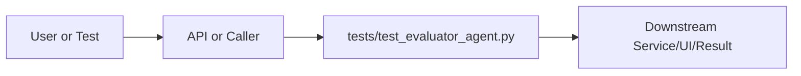

# test_evaluator_agent.py Explained

Generated educational companion for `tests/test_evaluator_agent.py`. This file is intentionally detailed so a developer can understand the code, architecture role, production tradeoffs, and ML/backend concepts behind the implementation.

## File Overview

`tests/test_evaluator_agent.py` is a Python module in the Test layer: behavioral, safety, performance, and integration checks. It defines TestRetrievalQuality, TestAnswerCompleteness, TestEvidenceGrounding, TestErrorAbsence, TestRetryLogic and ev.

## Why This File Exists

This file isolates one responsibility in the codebase: Test layer: behavioral, safety, performance, and integration checks. Separation matters because AI systems are easier to test, scale, debug, and explain when retrieval, orchestration, ML services, memory, UI, and deployment scripts have clear boundaries.

## Workflow Position

**Layer:** Test layer: behavioral, safety, performance, and integration checks.

**Previous step:** caller code, an API request, a browser event, a test fixture, an import, or a startup script prepares inputs.

**Current step:** `tests/test_evaluator_agent.py` performs its local responsibility.

**Next step:** downstream services, API responses, rendered UI, tests, or process execution consume the result.



## Inputs and Outputs

- **Inputs:** function arguments, class constructor dependencies, HTTP payloads, environment variables, filesystem artifacts, DOM events, or test fixtures.
- **Outputs:** return values, dictionaries, Pydantic models, rendered DOM state, API responses, logs, process startup, assertions, or side effects.
- **Serialization:** this project uses JSON for APIs/LLM planning, parquet/joblib/faiss for ML artifacts, and HTML/CSS/JS for the browser surface.

## Imports Explained

| Import | Explanation |
|---|---|
| `__future__` | Project or standard-library dependency used to import a service, type, helper, or runtime capability. Imports affect startup time, packaging, and test isolation. |
| `pytest` | Project or standard-library dependency used to import a service, type, helper, or runtime capability. Imports affect startup time, packaging, and test isolation. |
| `research_ai` | Project or standard-library dependency used to import a service, type, helper, or runtime capability. Imports affect startup time, packaging, and test isolation. |

## Global Variables and Config

No major module-level variables are declared. This reduces hidden state and keeps imports lightweight.

## Step-by-Step Workflow

1. Load dependencies and runtime constants.
2. Accept input from the previous layer.
3. Validate, transform, route, score, render, or execute according to this file's role.
4. Return a structured output or perform a controlled side effect.
5. Let caller layers handle presentation, persistence, retries, or fallback.

## Function-by-Function Breakdown

### `ev`

- **Line:** 21
- **Kind:** synchronous function
- **Arguments:** none
- **Docstring:** No explicit docstring; infer behavior from call sites and body.

```python
def ev():
    return EvaluatorAgent()
```

This function's parameters define its input contract. Its return value or side effect defines how downstream code uses it. Review error handling, resource usage, and whether the function performs CPU work, I/O, model inference, or pure transformation.


## Class-by-Class Breakdown

### `TestRetrievalQuality`

- **Line:** 29
- **Base classes:** `object`
- **Docstring:** No explicit class docstring.

**Methods:**
- `test_hybrid_search_zero_results_gives_zero` at line 30: method behavior is described by its body and name
- `test_hybrid_search_five_results_gives_full_score` at line 35: method behavior is described by its body and name
- `test_smart_retrieve_counted_correctly` at line 40: BUG FIX: smart_retrieve was previously ignored → always 0 retrieval score.
- `test_smart_retrieve_no_spurious_retry` at line 47: Without the fix, smart_retrieve with 5 results would trigger a retry.
- `test_takes_max_when_both_tools_present` at line 60: If somehow both appear, take the higher count.
- `test_retrieval_score_saturates_at_five` at line 69: More than 5 results does not push score above 0.40.
- `test_retrieval_partial_score_three_results` at line 75: method behavior is described by its body and name
- `test_errored_retrieval_gives_zero` at line 80: method behavior is described by its body and name

```python
class TestRetrievalQuality:
    def test_hybrid_search_zero_results_gives_zero(self, ev):
        outputs = {"hybrid_search": {"count": 0, "results": []}}
        result = ev.evaluate(outputs)
        assert result["breakdown"]["retrieval"] == 0.0

    def test_hybrid_search_five_results_gives_full_score(self, ev):
        outputs = {"hybrid_search": {"count": 5, "results": [{}] * 5}}
        result = ev.evaluate(outputs)
        assert result["breakdown"]["retrieval"] == pytest.approx(0.4)

    def test_smart_retrieve_counted_correctly(self, ev):
        """BUG FIX: smart_retrieve was previously ignored → always 0 retrieval score."""
        outputs = {"smart_retrieve": {"count": 5, "results": [{}] * 5}}
        result = ev.evaluate(outputs)
        # Should get full retrieval credit from smart_retrieve
        assert result["breakdown"]["retrieval"] == pytest.approx(0.4)

    def test_smart_retrieve_no_spurious_retry(self, ev):
        """Without the fix, smart_retrieve with 5 results would trigger a retry."""
        outputs = {
            "smart_retrieve": {"count": 5, "results": [{}] * 5},
            "metadata_rag": {"answer": "A substantive answer with at least twenty words here yes this counts"},
            "classify_query": {"predicted_category": "cs.LG"},
        }
        result = ev.evaluate(outputs)
        assert result["needs_retry"] is False, (
            f"Spurious retry triggered: score={result['quality_score']}, "
            f"reason={result.get('reason')}"
        )

    def test_takes_max_when_both_tools_present(self, ev):
        """If somehow both appear, take the higher count."""
        outputs = {
            "hybrid_search": {"count": 2, "results": [{}] * 2},
            "smart_retrieve": {"count": 5, "results": [{}] * 5},
        }
        result = ev.evaluate(outputs)
        assert result["breakdown"]["retrieval"] == pytest.approx(0.4)

    def test_retrieval_score_saturates_at_five(self, ev):
        """More than 5 results does not push score above 0.40."""
        outputs = {"hybrid_search": {"count": 20, "results": [{}] * 20}}
        result = ev.evaluate(outputs)
        assert result["breakdown"]["retrieval"] == pytest.approx(0.4)

    def test_retrieval_partial_score_three_results(self, ev):
        outputs = {"hybrid_search": {"count": 3, "results": [{}] * 3}}
        result = ev.evaluate(outputs)
        assert result["breakdown"]["retrieval"] == pytest.approx(0.24)  # 0.08 × 3

    def test_errored_retrieval_gives_zero(self, ev):
        outputs = {"hybrid_search": {"error": "Index not ready"}}
        result = ev.evaluate(outputs)
        assert result["breakdown"]["retrieval"] == 0.0
```

This class packages state and behavior behind a service-style interface. Constructor dependencies show what the class needs; public methods show what the rest of the system can ask it to do. In production, this boundary is where caching, model loading, artifact access, and error handling must be controlled.

### `TestAnswerCompleteness`

- **Line:** 90
- **Base classes:** `object`
- **Docstring:** No explicit class docstring.

**Methods:**
- `test_long_answer_gives_full_score` at line 91: method behavior is described by its body and name
- `test_short_answer_gives_half_score` at line 97: method behavior is described by its body and name
- `test_empty_answer_gives_zero` at line 103: method behavior is described by its body and name
- `test_summarize_answer_counts` at line 108: method behavior is described by its body and name
- `test_conversation_counts` at line 114: method behavior is described by its body and name

```python
class TestAnswerCompleteness:
    def test_long_answer_gives_full_score(self, ev):
        long_answer = " ".join(["word"] * 25)  # 25 words ≥ 20 threshold
        outputs = {"metadata_rag": {"answer": long_answer}}
        result = ev.evaluate(outputs)
        assert result["breakdown"]["answer_completeness"] == pytest.approx(0.3)

    def test_short_answer_gives_half_score(self, ev):
        short_answer = "A brief answer."  # < 20 words
        outputs = {"metadata_rag": {"answer": short_answer}}
        result = ev.evaluate(outputs)
        assert result["breakdown"]["answer_completeness"] == pytest.approx(0.15)

    def test_empty_answer_gives_zero(self, ev):
        outputs = {"metadata_rag": {"answer": ""}}
        result = ev.evaluate(outputs)
        assert result["breakdown"]["answer_completeness"] == 0.0

    def test_summarize_answer_counts(self, ev):
        long_summary = " ".join(["word"] * 25)
        outputs = {"summarize": {"summary": long_summary}}
        result = ev.evaluate(outputs)
        assert result["breakdown"]["answer_completeness"] == pytest.approx(0.3)

    def test_conversation_counts(self, ev):
        long_conv = " ".join(["word"] * 25)
        outputs = {"conversation": {"answer": long_conv}}
        result = ev.evaluate(outputs)
        assert result["breakdown"]["answer_completeness"] == pytest.approx(0.3)
```

This class packages state and behavior behind a service-style interface. Constructor dependencies show what the class needs; public methods show what the rest of the system can ask it to do. In production, this boundary is where caching, model loading, artifact access, and error handling must be controlled.

### `TestEvidenceGrounding`

- **Line:** 125
- **Base classes:** `object`
- **Docstring:** No explicit class docstring.

**Methods:**
- `test_full_grounding_score` at line 126: method behavior is described by its body and name
- `test_methodology_alone_gives_0_1` at line 135: method behavior is described by its body and name
- `test_zero_methodology_count_gives_zero` at line 140: method behavior is described by its body and name

```python
class TestEvidenceGrounding:
    def test_full_grounding_score(self, ev):
        outputs = {
            "methodology_extract": {"count": 3, "signals": ["transformer"]},
            "citation_signals": {"category_cooccurrence": {"cs.LG": 5}},
            "classify_query": {"predicted_category": "cs.LG"},
        }
        result = ev.evaluate(outputs)
        assert result["breakdown"]["evidence_grounding"] == pytest.approx(0.2)

    def test_methodology_alone_gives_0_1(self, ev):
        outputs = {"methodology_extract": {"count": 1, "signals": ["bert"]}}
        result = ev.evaluate(outputs)
        assert result["breakdown"]["evidence_grounding"] == pytest.approx(0.1)

    def test_zero_methodology_count_gives_zero(self, ev):
        outputs = {"methodology_extract": {"count": 0, "signals": []}}
        result = ev.evaluate(outputs)
        assert result["breakdown"]["evidence_grounding"] == 0.0
```

This class packages state and behavior behind a service-style interface. Constructor dependencies show what the class needs; public methods show what the rest of the system can ask it to do. In production, this boundary is where caching, model loading, artifact access, and error handling must be controlled.

### `TestErrorAbsence`

- **Line:** 150
- **Base classes:** `object`
- **Docstring:** No explicit class docstring.

**Methods:**
- `test_no_errors_gives_full_error_score` at line 151: method behavior is described by its body and name
- `test_critical_tool_error_gives_zero` at line 156: method behavior is described by its body and name
- `test_tool_errors_surfaced_in_result` at line 161: method behavior is described by its body and name

```python
class TestErrorAbsence:
    def test_no_errors_gives_full_error_score(self, ev):
        outputs = {"hybrid_search": {"count": 3, "results": []}}
        result = ev.evaluate(outputs)
        assert result["breakdown"]["error_absence"] == pytest.approx(0.1)

    def test_critical_tool_error_gives_zero(self, ev):
        outputs = {"hybrid_search": {"error": "Index not ready"}}
        result = ev.evaluate(outputs)
        assert result["breakdown"]["error_absence"] == 0.0

    def test_tool_errors_surfaced_in_result(self, ev):
        outputs = {
            "hybrid_search": {"error": "Index not ready"},
            "metadata_rag": {"error": "LLM timeout"},
        }
        result = ev.evaluate(outputs)
        assert "tool_errors" in result
        assert "hybrid_search" in result["tool_errors"]
        assert "metadata_rag" in result["tool_errors"]
```

This class packages state and behavior behind a service-style interface. Constructor dependencies show what the class needs; public methods show what the rest of the system can ask it to do. In production, this boundary is where caching, model loading, artifact access, and error handling must be controlled.

### `TestRetryLogic`

- **Line:** 176
- **Base classes:** `object`
- **Docstring:** No explicit class docstring.

**Methods:**
- `test_no_retry_above_threshold` at line 177: A query with 5 results and a decent answer should not retry.
- `test_retry_triggered_below_threshold` at line 187: Zero retrieval hits should always trigger a retry.
- `test_retry_multiplier_x3_for_very_low_score` at line 193: Score < 0.15 → x3 multiplier.
- `test_retry_multiplier_x2_for_moderate_low_score` at line 200: Score ∈ [0.15, 0.35) → x2 multiplier.
- `test_retry_reason_no_retrieval_hits` at line 212: method behavior is described by its body and name
- `test_retry_reason_no_answer_generated` at line 217: method behavior is described by its body and name
- `test_sufficient_evidence_reason_when_no_retry` at line 222: method behavior is described by its body and name

```python
class TestRetryLogic:
    def test_no_retry_above_threshold(self, ev):
        """A query with 5 results and a decent answer should not retry."""
        outputs = {
            "hybrid_search": {"count": 5, "results": [{}] * 5},
            "metadata_rag": {"answer": " ".join(["word"] * 25)},
            "classify_query": {"predicted_category": "cs.LG"},
        }
        result = ev.evaluate(outputs)
        assert result["needs_retry"] is False

    def test_retry_triggered_below_threshold(self, ev):
        """Zero retrieval hits should always trigger a retry."""
        outputs = {"hybrid_search": {"count": 0, "results": []}}
        result = ev.evaluate(outputs)
        assert result["needs_retry"] is True

    def test_retry_multiplier_x3_for_very_low_score(self, ev):
        """Score < 0.15 → x3 multiplier."""
        outputs = {}  # all zeros → score = 0.0
        result = ev.evaluate(outputs)
        assert result["quality_score"] < 0.15
        assert result.get("retry_top_k_multiplier") == 3

    def test_retry_multiplier_x2_for_moderate_low_score(self, ev):
        """Score ∈ [0.15, 0.35) → x2 multiplier."""
        # 1 result (0.08) + short answer (0.15) + classification (0.05) + no errors (0.1) = 0.38
        # That's above threshold. Let's use: 2 results (0.16) + no answer = 0.16 + 0.1 = 0.26 < 0.35
        outputs = {
            "hybrid_search": {"count": 2, "results": [{}] * 2},
            "classify_query": {"predicted_category": "cs.LG"},
        }
        result = ev.evaluate(outputs)
        assert 0.15 <= result["quality_score"] < 0.35
        assert result.get("retry_top_k_multiplier") == 2

    def test_retry_reason_no_retrieval_hits(self, ev):
        outputs = {"hybrid_search": {"count": 0, "results": []}}
        result = ev.evaluate(outputs)
        assert result["reason"] == "no_retrieval_hits"

    def test_retry_reason_no_answer_generated(self, ev):
        outputs = {"hybrid_search": {"count": 3, "results": [{}] * 3}}
        result = ev.evaluate(outputs)
        assert result["reason"] == "no_answer_generated"

    def test_sufficient_evidence_reason_when_no_retry(self, ev):
        outputs = {
            "hybrid_search": {"count": 5, "results": [{}] * 5},
            "metadata_rag": {"answer": " ".join(["word"] * 25)},
            "classify_query": {"predicted_category": "cs.LG"},
        }
        result = ev.evaluate(outputs)
        assert result["reason"] == "sufficient_evidence"
```

This class packages state and behavior behind a service-style interface. Constructor dependencies show what the class needs; public methods show what the rest of the system can ask it to do. In production, this boundary is where caching, model loading, artifact access, and error handling must be controlled.


## Method-by-Method Deep Dive

### Class `TestRetrievalQuality` Methods

#### `TestRetrievalQuality.test_hybrid_search_zero_results_gives_zero`

- **Line:** 30
- **Kind:** synchronous method
- **Arguments:** self, ev
- **Docstring:** No explicit docstring; behavior is inferred from the implementation and call sites.

```python
    def test_hybrid_search_zero_results_gives_zero(self, ev):
        outputs = {"hybrid_search": {"count": 0, "results": []}}
        result = ev.evaluate(outputs)
        assert result["breakdown"]["retrieval"] == 0.0
```

This method is part of the class contract. Its inputs show what state or caller data it consumes; its body shows whether it performs pure transformation, model/artifact access, retrieval, I/O, caching, validation, or orchestration. In production review, pay attention to error handling, mutation of `self`, repeated expensive work, and whether return shapes stay stable for downstream callers.

#### `TestRetrievalQuality.test_hybrid_search_five_results_gives_full_score`

- **Line:** 35
- **Kind:** synchronous method
- **Arguments:** self, ev
- **Docstring:** No explicit docstring; behavior is inferred from the implementation and call sites.

```python
    def test_hybrid_search_five_results_gives_full_score(self, ev):
        outputs = {"hybrid_search": {"count": 5, "results": [{}] * 5}}
        result = ev.evaluate(outputs)
        assert result["breakdown"]["retrieval"] == pytest.approx(0.4)
```

This method is part of the class contract. Its inputs show what state or caller data it consumes; its body shows whether it performs pure transformation, model/artifact access, retrieval, I/O, caching, validation, or orchestration. In production review, pay attention to error handling, mutation of `self`, repeated expensive work, and whether return shapes stay stable for downstream callers.

#### `TestRetrievalQuality.test_smart_retrieve_counted_correctly`

- **Line:** 40
- **Kind:** synchronous method
- **Arguments:** self, ev
- **Docstring:** BUG FIX: smart_retrieve was previously ignored → always 0 retrieval score.

```python
    def test_smart_retrieve_counted_correctly(self, ev):
        """BUG FIX: smart_retrieve was previously ignored → always 0 retrieval score."""
        outputs = {"smart_retrieve": {"count": 5, "results": [{}] * 5}}
        result = ev.evaluate(outputs)
        # Should get full retrieval credit from smart_retrieve
        assert result["breakdown"]["retrieval"] == pytest.approx(0.4)
```

This method is part of the class contract. Its inputs show what state or caller data it consumes; its body shows whether it performs pure transformation, model/artifact access, retrieval, I/O, caching, validation, or orchestration. In production review, pay attention to error handling, mutation of `self`, repeated expensive work, and whether return shapes stay stable for downstream callers.

#### `TestRetrievalQuality.test_smart_retrieve_no_spurious_retry`

- **Line:** 47
- **Kind:** synchronous method
- **Arguments:** self, ev
- **Docstring:** Without the fix, smart_retrieve with 5 results would trigger a retry.

```python
    def test_smart_retrieve_no_spurious_retry(self, ev):
        """Without the fix, smart_retrieve with 5 results would trigger a retry."""
        outputs = {
            "smart_retrieve": {"count": 5, "results": [{}] * 5},
            "metadata_rag": {"answer": "A substantive answer with at least twenty words here yes this counts"},
            "classify_query": {"predicted_category": "cs.LG"},
        }
        result = ev.evaluate(outputs)
        assert result["needs_retry"] is False, (
            f"Spurious retry triggered: score={result['quality_score']}, "
            f"reason={result.get('reason')}"
        )
```

This method is part of the class contract. Its inputs show what state or caller data it consumes; its body shows whether it performs pure transformation, model/artifact access, retrieval, I/O, caching, validation, or orchestration. In production review, pay attention to error handling, mutation of `self`, repeated expensive work, and whether return shapes stay stable for downstream callers.

#### `TestRetrievalQuality.test_takes_max_when_both_tools_present`

- **Line:** 60
- **Kind:** synchronous method
- **Arguments:** self, ev
- **Docstring:** If somehow both appear, take the higher count.

```python
    def test_takes_max_when_both_tools_present(self, ev):
        """If somehow both appear, take the higher count."""
        outputs = {
            "hybrid_search": {"count": 2, "results": [{}] * 2},
            "smart_retrieve": {"count": 5, "results": [{}] * 5},
        }
        result = ev.evaluate(outputs)
        assert result["breakdown"]["retrieval"] == pytest.approx(0.4)
```

This method is part of the class contract. Its inputs show what state or caller data it consumes; its body shows whether it performs pure transformation, model/artifact access, retrieval, I/O, caching, validation, or orchestration. In production review, pay attention to error handling, mutation of `self`, repeated expensive work, and whether return shapes stay stable for downstream callers.

#### `TestRetrievalQuality.test_retrieval_score_saturates_at_five`

- **Line:** 69
- **Kind:** synchronous method
- **Arguments:** self, ev
- **Docstring:** More than 5 results does not push score above 0.40.

```python
    def test_retrieval_score_saturates_at_five(self, ev):
        """More than 5 results does not push score above 0.40."""
        outputs = {"hybrid_search": {"count": 20, "results": [{}] * 20}}
        result = ev.evaluate(outputs)
        assert result["breakdown"]["retrieval"] == pytest.approx(0.4)
```

This method is part of the class contract. Its inputs show what state or caller data it consumes; its body shows whether it performs pure transformation, model/artifact access, retrieval, I/O, caching, validation, or orchestration. In production review, pay attention to error handling, mutation of `self`, repeated expensive work, and whether return shapes stay stable for downstream callers.

#### `TestRetrievalQuality.test_retrieval_partial_score_three_results`

- **Line:** 75
- **Kind:** synchronous method
- **Arguments:** self, ev
- **Docstring:** No explicit docstring; behavior is inferred from the implementation and call sites.

```python
    def test_retrieval_partial_score_three_results(self, ev):
        outputs = {"hybrid_search": {"count": 3, "results": [{}] * 3}}
        result = ev.evaluate(outputs)
        assert result["breakdown"]["retrieval"] == pytest.approx(0.24)  # 0.08 × 3
```

This method is part of the class contract. Its inputs show what state or caller data it consumes; its body shows whether it performs pure transformation, model/artifact access, retrieval, I/O, caching, validation, or orchestration. In production review, pay attention to error handling, mutation of `self`, repeated expensive work, and whether return shapes stay stable for downstream callers.

#### `TestRetrievalQuality.test_errored_retrieval_gives_zero`

- **Line:** 80
- **Kind:** synchronous method
- **Arguments:** self, ev
- **Docstring:** No explicit docstring; behavior is inferred from the implementation and call sites.

```python
    def test_errored_retrieval_gives_zero(self, ev):
        outputs = {"hybrid_search": {"error": "Index not ready"}}
        result = ev.evaluate(outputs)
        assert result["breakdown"]["retrieval"] == 0.0
```

This method is part of the class contract. Its inputs show what state or caller data it consumes; its body shows whether it performs pure transformation, model/artifact access, retrieval, I/O, caching, validation, or orchestration. In production review, pay attention to error handling, mutation of `self`, repeated expensive work, and whether return shapes stay stable for downstream callers.

### Class `TestAnswerCompleteness` Methods

#### `TestAnswerCompleteness.test_long_answer_gives_full_score`

- **Line:** 91
- **Kind:** synchronous method
- **Arguments:** self, ev
- **Docstring:** No explicit docstring; behavior is inferred from the implementation and call sites.

```python
    def test_long_answer_gives_full_score(self, ev):
        long_answer = " ".join(["word"] * 25)  # 25 words ≥ 20 threshold
        outputs = {"metadata_rag": {"answer": long_answer}}
        result = ev.evaluate(outputs)
        assert result["breakdown"]["answer_completeness"] == pytest.approx(0.3)
```

This method is part of the class contract. Its inputs show what state or caller data it consumes; its body shows whether it performs pure transformation, model/artifact access, retrieval, I/O, caching, validation, or orchestration. In production review, pay attention to error handling, mutation of `self`, repeated expensive work, and whether return shapes stay stable for downstream callers.

#### `TestAnswerCompleteness.test_short_answer_gives_half_score`

- **Line:** 97
- **Kind:** synchronous method
- **Arguments:** self, ev
- **Docstring:** No explicit docstring; behavior is inferred from the implementation and call sites.

```python
    def test_short_answer_gives_half_score(self, ev):
        short_answer = "A brief answer."  # < 20 words
        outputs = {"metadata_rag": {"answer": short_answer}}
        result = ev.evaluate(outputs)
        assert result["breakdown"]["answer_completeness"] == pytest.approx(0.15)
```

This method is part of the class contract. Its inputs show what state or caller data it consumes; its body shows whether it performs pure transformation, model/artifact access, retrieval, I/O, caching, validation, or orchestration. In production review, pay attention to error handling, mutation of `self`, repeated expensive work, and whether return shapes stay stable for downstream callers.

#### `TestAnswerCompleteness.test_empty_answer_gives_zero`

- **Line:** 103
- **Kind:** synchronous method
- **Arguments:** self, ev
- **Docstring:** No explicit docstring; behavior is inferred from the implementation and call sites.

```python
    def test_empty_answer_gives_zero(self, ev):
        outputs = {"metadata_rag": {"answer": ""}}
        result = ev.evaluate(outputs)
        assert result["breakdown"]["answer_completeness"] == 0.0
```

This method is part of the class contract. Its inputs show what state or caller data it consumes; its body shows whether it performs pure transformation, model/artifact access, retrieval, I/O, caching, validation, or orchestration. In production review, pay attention to error handling, mutation of `self`, repeated expensive work, and whether return shapes stay stable for downstream callers.

#### `TestAnswerCompleteness.test_summarize_answer_counts`

- **Line:** 108
- **Kind:** synchronous method
- **Arguments:** self, ev
- **Docstring:** No explicit docstring; behavior is inferred from the implementation and call sites.

```python
    def test_summarize_answer_counts(self, ev):
        long_summary = " ".join(["word"] * 25)
        outputs = {"summarize": {"summary": long_summary}}
        result = ev.evaluate(outputs)
        assert result["breakdown"]["answer_completeness"] == pytest.approx(0.3)
```

This method is part of the class contract. Its inputs show what state or caller data it consumes; its body shows whether it performs pure transformation, model/artifact access, retrieval, I/O, caching, validation, or orchestration. In production review, pay attention to error handling, mutation of `self`, repeated expensive work, and whether return shapes stay stable for downstream callers.

#### `TestAnswerCompleteness.test_conversation_counts`

- **Line:** 114
- **Kind:** synchronous method
- **Arguments:** self, ev
- **Docstring:** No explicit docstring; behavior is inferred from the implementation and call sites.

```python
    def test_conversation_counts(self, ev):
        long_conv = " ".join(["word"] * 25)
        outputs = {"conversation": {"answer": long_conv}}
        result = ev.evaluate(outputs)
        assert result["breakdown"]["answer_completeness"] == pytest.approx(0.3)
```

This method is part of the class contract. Its inputs show what state or caller data it consumes; its body shows whether it performs pure transformation, model/artifact access, retrieval, I/O, caching, validation, or orchestration. In production review, pay attention to error handling, mutation of `self`, repeated expensive work, and whether return shapes stay stable for downstream callers.

### Class `TestEvidenceGrounding` Methods

#### `TestEvidenceGrounding.test_full_grounding_score`

- **Line:** 126
- **Kind:** synchronous method
- **Arguments:** self, ev
- **Docstring:** No explicit docstring; behavior is inferred from the implementation and call sites.

```python
    def test_full_grounding_score(self, ev):
        outputs = {
            "methodology_extract": {"count": 3, "signals": ["transformer"]},
            "citation_signals": {"category_cooccurrence": {"cs.LG": 5}},
            "classify_query": {"predicted_category": "cs.LG"},
        }
        result = ev.evaluate(outputs)
        assert result["breakdown"]["evidence_grounding"] == pytest.approx(0.2)
```

This method is part of the class contract. Its inputs show what state or caller data it consumes; its body shows whether it performs pure transformation, model/artifact access, retrieval, I/O, caching, validation, or orchestration. In production review, pay attention to error handling, mutation of `self`, repeated expensive work, and whether return shapes stay stable for downstream callers.

#### `TestEvidenceGrounding.test_methodology_alone_gives_0_1`

- **Line:** 135
- **Kind:** synchronous method
- **Arguments:** self, ev
- **Docstring:** No explicit docstring; behavior is inferred from the implementation and call sites.

```python
    def test_methodology_alone_gives_0_1(self, ev):
        outputs = {"methodology_extract": {"count": 1, "signals": ["bert"]}}
        result = ev.evaluate(outputs)
        assert result["breakdown"]["evidence_grounding"] == pytest.approx(0.1)
```

This method is part of the class contract. Its inputs show what state or caller data it consumes; its body shows whether it performs pure transformation, model/artifact access, retrieval, I/O, caching, validation, or orchestration. In production review, pay attention to error handling, mutation of `self`, repeated expensive work, and whether return shapes stay stable for downstream callers.

#### `TestEvidenceGrounding.test_zero_methodology_count_gives_zero`

- **Line:** 140
- **Kind:** synchronous method
- **Arguments:** self, ev
- **Docstring:** No explicit docstring; behavior is inferred from the implementation and call sites.

```python
    def test_zero_methodology_count_gives_zero(self, ev):
        outputs = {"methodology_extract": {"count": 0, "signals": []}}
        result = ev.evaluate(outputs)
        assert result["breakdown"]["evidence_grounding"] == 0.0
```

This method is part of the class contract. Its inputs show what state or caller data it consumes; its body shows whether it performs pure transformation, model/artifact access, retrieval, I/O, caching, validation, or orchestration. In production review, pay attention to error handling, mutation of `self`, repeated expensive work, and whether return shapes stay stable for downstream callers.

### Class `TestErrorAbsence` Methods

#### `TestErrorAbsence.test_no_errors_gives_full_error_score`

- **Line:** 151
- **Kind:** synchronous method
- **Arguments:** self, ev
- **Docstring:** No explicit docstring; behavior is inferred from the implementation and call sites.

```python
    def test_no_errors_gives_full_error_score(self, ev):
        outputs = {"hybrid_search": {"count": 3, "results": []}}
        result = ev.evaluate(outputs)
        assert result["breakdown"]["error_absence"] == pytest.approx(0.1)
```

This method is part of the class contract. Its inputs show what state or caller data it consumes; its body shows whether it performs pure transformation, model/artifact access, retrieval, I/O, caching, validation, or orchestration. In production review, pay attention to error handling, mutation of `self`, repeated expensive work, and whether return shapes stay stable for downstream callers.

#### `TestErrorAbsence.test_critical_tool_error_gives_zero`

- **Line:** 156
- **Kind:** synchronous method
- **Arguments:** self, ev
- **Docstring:** No explicit docstring; behavior is inferred from the implementation and call sites.

```python
    def test_critical_tool_error_gives_zero(self, ev):
        outputs = {"hybrid_search": {"error": "Index not ready"}}
        result = ev.evaluate(outputs)
        assert result["breakdown"]["error_absence"] == 0.0
```

This method is part of the class contract. Its inputs show what state or caller data it consumes; its body shows whether it performs pure transformation, model/artifact access, retrieval, I/O, caching, validation, or orchestration. In production review, pay attention to error handling, mutation of `self`, repeated expensive work, and whether return shapes stay stable for downstream callers.

#### `TestErrorAbsence.test_tool_errors_surfaced_in_result`

- **Line:** 161
- **Kind:** synchronous method
- **Arguments:** self, ev
- **Docstring:** No explicit docstring; behavior is inferred from the implementation and call sites.

```python
    def test_tool_errors_surfaced_in_result(self, ev):
        outputs = {
            "hybrid_search": {"error": "Index not ready"},
            "metadata_rag": {"error": "LLM timeout"},
        }
        result = ev.evaluate(outputs)
        assert "tool_errors" in result
        assert "hybrid_search" in result["tool_errors"]
        assert "metadata_rag" in result["tool_errors"]
```

This method is part of the class contract. Its inputs show what state or caller data it consumes; its body shows whether it performs pure transformation, model/artifact access, retrieval, I/O, caching, validation, or orchestration. In production review, pay attention to error handling, mutation of `self`, repeated expensive work, and whether return shapes stay stable for downstream callers.

### Class `TestRetryLogic` Methods

#### `TestRetryLogic.test_no_retry_above_threshold`

- **Line:** 177
- **Kind:** synchronous method
- **Arguments:** self, ev
- **Docstring:** A query with 5 results and a decent answer should not retry.

```python
    def test_no_retry_above_threshold(self, ev):
        """A query with 5 results and a decent answer should not retry."""
        outputs = {
            "hybrid_search": {"count": 5, "results": [{}] * 5},
            "metadata_rag": {"answer": " ".join(["word"] * 25)},
            "classify_query": {"predicted_category": "cs.LG"},
        }
        result = ev.evaluate(outputs)
        assert result["needs_retry"] is False
```

This method is part of the class contract. Its inputs show what state or caller data it consumes; its body shows whether it performs pure transformation, model/artifact access, retrieval, I/O, caching, validation, or orchestration. In production review, pay attention to error handling, mutation of `self`, repeated expensive work, and whether return shapes stay stable for downstream callers.

#### `TestRetryLogic.test_retry_triggered_below_threshold`

- **Line:** 187
- **Kind:** synchronous method
- **Arguments:** self, ev
- **Docstring:** Zero retrieval hits should always trigger a retry.

```python
    def test_retry_triggered_below_threshold(self, ev):
        """Zero retrieval hits should always trigger a retry."""
        outputs = {"hybrid_search": {"count": 0, "results": []}}
        result = ev.evaluate(outputs)
        assert result["needs_retry"] is True
```

This method is part of the class contract. Its inputs show what state or caller data it consumes; its body shows whether it performs pure transformation, model/artifact access, retrieval, I/O, caching, validation, or orchestration. In production review, pay attention to error handling, mutation of `self`, repeated expensive work, and whether return shapes stay stable for downstream callers.

#### `TestRetryLogic.test_retry_multiplier_x3_for_very_low_score`

- **Line:** 193
- **Kind:** synchronous method
- **Arguments:** self, ev
- **Docstring:** Score < 0.15 → x3 multiplier.

```python
    def test_retry_multiplier_x3_for_very_low_score(self, ev):
        """Score < 0.15 → x3 multiplier."""
        outputs = {}  # all zeros → score = 0.0
        result = ev.evaluate(outputs)
        assert result["quality_score"] < 0.15
        assert result.get("retry_top_k_multiplier") == 3
```

This method is part of the class contract. Its inputs show what state or caller data it consumes; its body shows whether it performs pure transformation, model/artifact access, retrieval, I/O, caching, validation, or orchestration. In production review, pay attention to error handling, mutation of `self`, repeated expensive work, and whether return shapes stay stable for downstream callers.

#### `TestRetryLogic.test_retry_multiplier_x2_for_moderate_low_score`

- **Line:** 200
- **Kind:** synchronous method
- **Arguments:** self, ev
- **Docstring:** Score ∈ [0.15, 0.35) → x2 multiplier.

```python
    def test_retry_multiplier_x2_for_moderate_low_score(self, ev):
        """Score ∈ [0.15, 0.35) → x2 multiplier."""
        # 1 result (0.08) + short answer (0.15) + classification (0.05) + no errors (0.1) = 0.38
        # That's above threshold. Let's use: 2 results (0.16) + no answer = 0.16 + 0.1 = 0.26 < 0.35
        outputs = {
            "hybrid_search": {"count": 2, "results": [{}] * 2},
            "classify_query": {"predicted_category": "cs.LG"},
        }
        result = ev.evaluate(outputs)
        assert 0.15 <= result["quality_score"] < 0.35
        assert result.get("retry_top_k_multiplier") == 2
```

This method is part of the class contract. Its inputs show what state or caller data it consumes; its body shows whether it performs pure transformation, model/artifact access, retrieval, I/O, caching, validation, or orchestration. In production review, pay attention to error handling, mutation of `self`, repeated expensive work, and whether return shapes stay stable for downstream callers.

#### `TestRetryLogic.test_retry_reason_no_retrieval_hits`

- **Line:** 212
- **Kind:** synchronous method
- **Arguments:** self, ev
- **Docstring:** No explicit docstring; behavior is inferred from the implementation and call sites.

```python
    def test_retry_reason_no_retrieval_hits(self, ev):
        outputs = {"hybrid_search": {"count": 0, "results": []}}
        result = ev.evaluate(outputs)
        assert result["reason"] == "no_retrieval_hits"
```

This method is part of the class contract. Its inputs show what state or caller data it consumes; its body shows whether it performs pure transformation, model/artifact access, retrieval, I/O, caching, validation, or orchestration. In production review, pay attention to error handling, mutation of `self`, repeated expensive work, and whether return shapes stay stable for downstream callers.

#### `TestRetryLogic.test_retry_reason_no_answer_generated`

- **Line:** 217
- **Kind:** synchronous method
- **Arguments:** self, ev
- **Docstring:** No explicit docstring; behavior is inferred from the implementation and call sites.

```python
    def test_retry_reason_no_answer_generated(self, ev):
        outputs = {"hybrid_search": {"count": 3, "results": [{}] * 3}}
        result = ev.evaluate(outputs)
        assert result["reason"] == "no_answer_generated"
```

This method is part of the class contract. Its inputs show what state or caller data it consumes; its body shows whether it performs pure transformation, model/artifact access, retrieval, I/O, caching, validation, or orchestration. In production review, pay attention to error handling, mutation of `self`, repeated expensive work, and whether return shapes stay stable for downstream callers.

#### `TestRetryLogic.test_sufficient_evidence_reason_when_no_retry`

- **Line:** 222
- **Kind:** synchronous method
- **Arguments:** self, ev
- **Docstring:** No explicit docstring; behavior is inferred from the implementation and call sites.

```python
    def test_sufficient_evidence_reason_when_no_retry(self, ev):
        outputs = {
            "hybrid_search": {"count": 5, "results": [{}] * 5},
            "metadata_rag": {"answer": " ".join(["word"] * 25)},
            "classify_query": {"predicted_category": "cs.LG"},
        }
        result = ev.evaluate(outputs)
        assert result["reason"] == "sufficient_evidence"
```

This method is part of the class contract. Its inputs show what state or caller data it consumes; its body shows whether it performs pure transformation, model/artifact access, retrieval, I/O, caching, validation, or orchestration. In production review, pay attention to error handling, mutation of `self`, repeated expensive work, and whether return shapes stay stable for downstream callers.

## Important Algorithms Used

- **Hybrid Retrieval**: Hybrid retrieval combines semantic vectors with lexical/keyword evidence, improving scientific search where exact terms matter.
- **RAG**: Retrieval-Augmented Generation retrieves evidence first and asks an LLM to answer from that evidence, reducing hallucination.
- **LLM Inference**: LLM inference sends prompts or chat messages to a model provider and receives generated text under token, latency, and cost constraints.
- **Transformers**: Transformers use tokenization and attention layers for language understanding/generation. They are powerful but memory and latency sensitive.
- **Classification**: Classification maps text or features to discrete labels, supporting category prediction and routing.
- **Streaming**: Streaming improves perceived latency by sending incremental output instead of waiting for full completion.
- **Sandboxing**: Sandboxing validates and constrains user code before execution, reducing security and stability risk.

## Libraries Used

| Import | Explanation |
|---|---|
| `__future__` | Project or standard-library dependency used to import a service, type, helper, or runtime capability. Imports affect startup time, packaging, and test isolation. |
| `pytest` | Project or standard-library dependency used to import a service, type, helper, or runtime capability. Imports affect startup time, packaging, and test isolation. |
| `research_ai` | Project or standard-library dependency used to import a service, type, helper, or runtime capability. Imports affect startup time, packaging, and test isolation. |

## ML Concepts Used

- **Hybrid Retrieval**: Hybrid retrieval combines semantic vectors with lexical/keyword evidence, improving scientific search where exact terms matter.
- **RAG**: Retrieval-Augmented Generation retrieves evidence first and asks an LLM to answer from that evidence, reducing hallucination.
- **LLM Inference**: LLM inference sends prompts or chat messages to a model provider and receives generated text under token, latency, and cost constraints.
- **Transformers**: Transformers use tokenization and attention layers for language understanding/generation. They are powerful but memory and latency sensitive.
- **Classification**: Classification maps text or features to discrete labels, supporting category prediction and routing.
- **Streaming**: Streaming improves perceived latency by sending incremental output instead of waiting for full completion.
- **Sandboxing**: Sandboxing validates and constrains user code before execution, reducing security and stability risk.

## Performance and Memory Notes

- Avoid eager loading of heavy ML models unless startup latency is acceptable.
- Cache expensive clients, tokenizers, vector stores, and embeddings carefully.
- Use float32 for embedding vectors because it halves memory compared with float64 and matches FAISS/neural inference expectations.
- Bound prompt length, uploaded content, result counts, and token budgets to control latency and memory.
- Watch copies of large metadata frames, embedding matrices, and file buffers.

## Scalability Notes

- In-memory state works for local demos but needs Redis/database/object storage for multi-worker cloud deployment.
- CPU/GPU inference should often be separated from the web API when traffic grows.
- Retrieval can start exact and move to approximate indexes as corpus size grows.
- Batch operations and cache repeated work to improve throughput.
- Add metrics for latency, errors, fallback frequency, retrieval hit rate, and token usage.

## Production Engineering Notes

- Keep interfaces stable because other files may import this module or depend on its response shape.
- Prefer typed/structured data over free-form strings at service boundaries.
- Log operational context without secrets or huge payloads.
- Make fallback behavior explicit so users get useful output even when LLMs or artifacts fail.
- Keep provider-specific logic behind adapters so Groq/OpenRouter/Google/Ollama can be swapped.

## Common Bugs and Failure Cases

- Missing `.env` values, model artifacts, or Ollama models can trigger degraded behavior.
- Type mismatches occur when LLM-generated tool arguments cross into strict Python code.
- Empty retrieval results must not become hallucinated answers.
- Network calls need timeouts and careful retry behavior.
- Frontend IDs/classes and API schemas are contracts; changing one side without the other breaks workflows.

## Security Considerations

- Deals with execution or subprocesses. Maintain AST validation, isolated mode, timeouts, and least privilege.

## Real Industry Usage

- This pattern appears in enterprise RAG assistants, scientific search tools, internal research copilots, and ML platform demos.
- The layered design mirrors production systems: API facade, orchestration, retrieval, evaluation, synthesis, UI, and deployment.
- Clear separation lets teams replace model providers, improve retrieval, harden security, or redesign UI independently.

## Optimization Opportunities

- Add tracing around each workflow step.
- Strengthen schema validation at boundaries.
- Persist conversation/session state outside process memory.
- Add load tests and adversarial tests for prompt injection, empty evidence, and large uploads.
- Consider approximate vector indexes, reranker models, or batching when corpus/traffic grows.

## How This Connects To Other Files

- `tests/test_evaluator_agent.py` is connected through imports, startup scripts, API routes, frontend selectors, tests, or artifact paths.
- `src/research_ai/platform.py` is the backend composition root.
- `src/research_ai/api/main.py` exposes backend behavior over HTTP.
- Retrieval modules depend on artifacts under `artifacts/`.
- Frontend files depend on stable endpoint and DOM contracts.

## End-to-End Flow Summary

- A user/browser/test/startup event enters the system.
- The relevant layer validates or normalizes input.
- Retrieval, ML, orchestration, execution, or UI rendering happens.
- A structured result, visual state, or process side effect is produced.
- Fallbacks and tests keep behavior understandable when dependencies are unavailable.

## Interview Questions

1. What responsibility does this file own?
2. What inputs and outputs define its contract?
3. Which dependencies are expensive or operationally risky?
4. What breaks if this file changes shape?
5. How would you scale or test this behavior in production?

## Key Takeaways

- `tests/test_evaluator_agent.py` should be understood as part of a layered AI research platform.
- Trace data flow from inputs to transformations to outputs.
- Production readiness comes from explicit contracts, bounded resources, observability, secure defaults, and graceful fallback.

## Fully Commented Source

This section repeats the original source with an explanatory comment before every line. The comments are educational only; they are not inserted into the production source file.

```python
# L0001: Starts, ends, or continues a docstring that documents module, class, or function intent.
"""Tests for EvaluatorAgent — quality scoring and retry logic.
# L0002: Blank line that visually separates logical sections and improves readability.

# L0003: Executes Python logic as part of this file's workflow; read surrounding lines for data flow and side effects.
Covers:
# L0004: Executes Python logic as part of this file's workflow; read surrounding lines for data flow and side effects.
  - Retrieval quality sub-score for hybrid_search AND smart_retrieve
# L0005: Executes Python logic as part of this file's workflow; read surrounding lines for data flow and side effects.
  - Answer completeness scoring
# L0006: Executes Python logic as part of this file's workflow; read surrounding lines for data flow and side effects.
  - Evidence grounding scoring
# L0007: Executes Python logic as part of this file's workflow; read surrounding lines for data flow and side effects.
  - Error absence scoring
# L0008: Executes Python logic as part of this file's workflow; read surrounding lines for data flow and side effects.
  - Retry threshold logic
# L0009: Executes Python logic as part of this file's workflow; read surrounding lines for data flow and side effects.
  - Retry multiplier (x2 vs x3)
# L0010: Executes Python logic as part of this file's workflow; read surrounding lines for data flow and side effects.
  - Retry reason mapping
# L0011: Executes Python logic as part of this file's workflow; read surrounding lines for data flow and side effects.
  - Tool error surfacing
# L0012: Starts, ends, or continues a docstring that documents module, class, or function intent.
"""
# L0013: Enables future Python behavior so annotations/import semantics stay modern and predictable.
from __future__ import annotations
# L0014: Blank line that visually separates logical sections and improves readability.

# L0015: Imports a dependency, type, or project module needed by later code in this file.
import pytest
# L0016: Blank line that visually separates logical sections and improves readability.

# L0017: Imports a dependency, type, or project module needed by later code in this file.
from research_ai.agents.evaluator_agent import EvaluatorAgent
# L0018: Blank line that visually separates logical sections and improves readability.

# L0019: Blank line that visually separates logical sections and improves readability.

# L0020: Decorator that modifies the function/class below, commonly for routing, dataclasses, caching, or properties.
@pytest.fixture
# L0021: Defines a function or method; parameters are the input contract and the body implements the workflow.
def ev():
# L0022: Returns the computed result to the caller; this shape becomes part of the downstream contract.
    return EvaluatorAgent()
# L0023: Blank line that visually separates logical sections and improves readability.

# L0024: Blank line that visually separates logical sections and improves readability.

# L0025: Developer comment explaining intent, caveat, section boundary, or operational reasoning.
# ---------------------------------------------------------------------------
# L0026: Developer comment explaining intent, caveat, section boundary, or operational reasoning.
# 1. Retrieval quality — the core bug fix
# L0027: Developer comment explaining intent, caveat, section boundary, or operational reasoning.
# ---------------------------------------------------------------------------
# L0028: Blank line that visually separates logical sections and improves readability.

# L0029: Defines a class that groups related state and behavior behind a reusable interface.
class TestRetrievalQuality:
# L0030: Defines a function or method; parameters are the input contract and the body implements the workflow.
    def test_hybrid_search_zero_results_gives_zero(self, ev):
# L0031: Assigns or updates a value used later in the workflow; check mutability and data shape.
        outputs = {"hybrid_search": {"count": 0, "results": []}}
# L0032: Assigns or updates a value used later in the workflow; check mutability and data shape.
        result = ev.evaluate(outputs)
# L0033: Assigns or updates a value used later in the workflow; check mutability and data shape.
        assert result["breakdown"]["retrieval"] == 0.0
# L0034: Blank line that visually separates logical sections and improves readability.

# L0035: Defines a function or method; parameters are the input contract and the body implements the workflow.
    def test_hybrid_search_five_results_gives_full_score(self, ev):
# L0036: Assigns or updates a value used later in the workflow; check mutability and data shape.
        outputs = {"hybrid_search": {"count": 5, "results": [{}] * 5}}
# L0037: Assigns or updates a value used later in the workflow; check mutability and data shape.
        result = ev.evaluate(outputs)
# L0038: Assigns or updates a value used later in the workflow; check mutability and data shape.
        assert result["breakdown"]["retrieval"] == pytest.approx(0.4)
# L0039: Blank line that visually separates logical sections and improves readability.

# L0040: Defines a function or method; parameters are the input contract and the body implements the workflow.
    def test_smart_retrieve_counted_correctly(self, ev):
# L0041: Starts, ends, or continues a docstring that documents module, class, or function intent.
        """BUG FIX: smart_retrieve was previously ignored → always 0 retrieval score."""
# L0042: Assigns or updates a value used later in the workflow; check mutability and data shape.
        outputs = {"smart_retrieve": {"count": 5, "results": [{}] * 5}}
# L0043: Assigns or updates a value used later in the workflow; check mutability and data shape.
        result = ev.evaluate(outputs)
# L0044: Developer comment explaining intent, caveat, section boundary, or operational reasoning.
        # Should get full retrieval credit from smart_retrieve
# L0045: Assigns or updates a value used later in the workflow; check mutability and data shape.
        assert result["breakdown"]["retrieval"] == pytest.approx(0.4)
# L0046: Blank line that visually separates logical sections and improves readability.

# L0047: Defines a function or method; parameters are the input contract and the body implements the workflow.
    def test_smart_retrieve_no_spurious_retry(self, ev):
# L0048: Starts, ends, or continues a docstring that documents module, class, or function intent.
        """Without the fix, smart_retrieve with 5 results would trigger a retry."""
# L0049: Assigns or updates a value used later in the workflow; check mutability and data shape.
        outputs = {
# L0050: Executes Python logic as part of this file's workflow; read surrounding lines for data flow and side effects.
            "smart_retrieve": {"count": 5, "results": [{}] * 5},
# L0051: Executes Python logic as part of this file's workflow; read surrounding lines for data flow and side effects.
            "metadata_rag": {"answer": "A substantive answer with at least twenty words here yes this counts"},
# L0052: Executes Python logic as part of this file's workflow; read surrounding lines for data flow and side effects.
            "classify_query": {"predicted_category": "cs.LG"},
# L0053: Executes Python logic as part of this file's workflow; read surrounding lines for data flow and side effects.
        }
# L0054: Assigns or updates a value used later in the workflow; check mutability and data shape.
        result = ev.evaluate(outputs)
# L0055: Executes Python logic as part of this file's workflow; read surrounding lines for data flow and side effects.
        assert result["needs_retry"] is False, (
# L0056: Assigns or updates a value used later in the workflow; check mutability and data shape.
            f"Spurious retry triggered: score={result['quality_score']}, "
# L0057: Assigns or updates a value used later in the workflow; check mutability and data shape.
            f"reason={result.get('reason')}"
# L0058: Executes Python logic as part of this file's workflow; read surrounding lines for data flow and side effects.
        )
# L0059: Blank line that visually separates logical sections and improves readability.

# L0060: Defines a function or method; parameters are the input contract and the body implements the workflow.
    def test_takes_max_when_both_tools_present(self, ev):
# L0061: Starts, ends, or continues a docstring that documents module, class, or function intent.
        """If somehow both appear, take the higher count."""
# L0062: Assigns or updates a value used later in the workflow; check mutability and data shape.
        outputs = {
# L0063: Executes Python logic as part of this file's workflow; read surrounding lines for data flow and side effects.
            "hybrid_search": {"count": 2, "results": [{}] * 2},
# L0064: Executes Python logic as part of this file's workflow; read surrounding lines for data flow and side effects.
            "smart_retrieve": {"count": 5, "results": [{}] * 5},
# L0065: Executes Python logic as part of this file's workflow; read surrounding lines for data flow and side effects.
        }
# L0066: Assigns or updates a value used later in the workflow; check mutability and data shape.
        result = ev.evaluate(outputs)
# L0067: Assigns or updates a value used later in the workflow; check mutability and data shape.
        assert result["breakdown"]["retrieval"] == pytest.approx(0.4)
# L0068: Blank line that visually separates logical sections and improves readability.

# L0069: Defines a function or method; parameters are the input contract and the body implements the workflow.
    def test_retrieval_score_saturates_at_five(self, ev):
# L0070: Starts, ends, or continues a docstring that documents module, class, or function intent.
        """More than 5 results does not push score above 0.40."""
# L0071: Assigns or updates a value used later in the workflow; check mutability and data shape.
        outputs = {"hybrid_search": {"count": 20, "results": [{}] * 20}}
# L0072: Assigns or updates a value used later in the workflow; check mutability and data shape.
        result = ev.evaluate(outputs)
# L0073: Assigns or updates a value used later in the workflow; check mutability and data shape.
        assert result["breakdown"]["retrieval"] == pytest.approx(0.4)
# L0074: Blank line that visually separates logical sections and improves readability.

# L0075: Defines a function or method; parameters are the input contract and the body implements the workflow.
    def test_retrieval_partial_score_three_results(self, ev):
# L0076: Assigns or updates a value used later in the workflow; check mutability and data shape.
        outputs = {"hybrid_search": {"count": 3, "results": [{}] * 3}}
# L0077: Assigns or updates a value used later in the workflow; check mutability and data shape.
        result = ev.evaluate(outputs)
# L0078: Assigns or updates a value used later in the workflow; check mutability and data shape.
        assert result["breakdown"]["retrieval"] == pytest.approx(0.24)  # 0.08 × 3
# L0079: Blank line that visually separates logical sections and improves readability.

# L0080: Defines a function or method; parameters are the input contract and the body implements the workflow.
    def test_errored_retrieval_gives_zero(self, ev):
# L0081: Assigns or updates a value used later in the workflow; check mutability and data shape.
        outputs = {"hybrid_search": {"error": "Index not ready"}}
# L0082: Assigns or updates a value used later in the workflow; check mutability and data shape.
        result = ev.evaluate(outputs)
# L0083: Assigns or updates a value used later in the workflow; check mutability and data shape.
        assert result["breakdown"]["retrieval"] == 0.0
# L0084: Blank line that visually separates logical sections and improves readability.

# L0085: Blank line that visually separates logical sections and improves readability.

# L0086: Developer comment explaining intent, caveat, section boundary, or operational reasoning.
# ---------------------------------------------------------------------------
# L0087: Developer comment explaining intent, caveat, section boundary, or operational reasoning.
# 2. Answer completeness
# L0088: Developer comment explaining intent, caveat, section boundary, or operational reasoning.
# ---------------------------------------------------------------------------
# L0089: Blank line that visually separates logical sections and improves readability.

# L0090: Defines a class that groups related state and behavior behind a reusable interface.
class TestAnswerCompleteness:
# L0091: Defines a function or method; parameters are the input contract and the body implements the workflow.
    def test_long_answer_gives_full_score(self, ev):
# L0092: Assigns or updates a value used later in the workflow; check mutability and data shape.
        long_answer = " ".join(["word"] * 25)  # 25 words ≥ 20 threshold
# L0093: Assigns or updates a value used later in the workflow; check mutability and data shape.
        outputs = {"metadata_rag": {"answer": long_answer}}
# L0094: Assigns or updates a value used later in the workflow; check mutability and data shape.
        result = ev.evaluate(outputs)
# L0095: Assigns or updates a value used later in the workflow; check mutability and data shape.
        assert result["breakdown"]["answer_completeness"] == pytest.approx(0.3)
# L0096: Blank line that visually separates logical sections and improves readability.

# L0097: Defines a function or method; parameters are the input contract and the body implements the workflow.
    def test_short_answer_gives_half_score(self, ev):
# L0098: Assigns or updates a value used later in the workflow; check mutability and data shape.
        short_answer = "A brief answer."  # < 20 words
# L0099: Assigns or updates a value used later in the workflow; check mutability and data shape.
        outputs = {"metadata_rag": {"answer": short_answer}}
# L0100: Assigns or updates a value used later in the workflow; check mutability and data shape.
        result = ev.evaluate(outputs)
# L0101: Assigns or updates a value used later in the workflow; check mutability and data shape.
        assert result["breakdown"]["answer_completeness"] == pytest.approx(0.15)
# L0102: Blank line that visually separates logical sections and improves readability.

# L0103: Defines a function or method; parameters are the input contract and the body implements the workflow.
    def test_empty_answer_gives_zero(self, ev):
# L0104: Assigns or updates a value used later in the workflow; check mutability and data shape.
        outputs = {"metadata_rag": {"answer": ""}}
# L0105: Assigns or updates a value used later in the workflow; check mutability and data shape.
        result = ev.evaluate(outputs)
# L0106: Assigns or updates a value used later in the workflow; check mutability and data shape.
        assert result["breakdown"]["answer_completeness"] == 0.0
# L0107: Blank line that visually separates logical sections and improves readability.

# L0108: Defines a function or method; parameters are the input contract and the body implements the workflow.
    def test_summarize_answer_counts(self, ev):
# L0109: Assigns or updates a value used later in the workflow; check mutability and data shape.
        long_summary = " ".join(["word"] * 25)
# L0110: Assigns or updates a value used later in the workflow; check mutability and data shape.
        outputs = {"summarize": {"summary": long_summary}}
# L0111: Assigns or updates a value used later in the workflow; check mutability and data shape.
        result = ev.evaluate(outputs)
# L0112: Assigns or updates a value used later in the workflow; check mutability and data shape.
        assert result["breakdown"]["answer_completeness"] == pytest.approx(0.3)
# L0113: Blank line that visually separates logical sections and improves readability.

# L0114: Defines a function or method; parameters are the input contract and the body implements the workflow.
    def test_conversation_counts(self, ev):
# L0115: Assigns or updates a value used later in the workflow; check mutability and data shape.
        long_conv = " ".join(["word"] * 25)
# L0116: Assigns or updates a value used later in the workflow; check mutability and data shape.
        outputs = {"conversation": {"answer": long_conv}}
# L0117: Assigns or updates a value used later in the workflow; check mutability and data shape.
        result = ev.evaluate(outputs)
# L0118: Assigns or updates a value used later in the workflow; check mutability and data shape.
        assert result["breakdown"]["answer_completeness"] == pytest.approx(0.3)
# L0119: Blank line that visually separates logical sections and improves readability.

# L0120: Blank line that visually separates logical sections and improves readability.

# L0121: Developer comment explaining intent, caveat, section boundary, or operational reasoning.
# ---------------------------------------------------------------------------
# L0122: Developer comment explaining intent, caveat, section boundary, or operational reasoning.
# 3. Evidence grounding
# L0123: Developer comment explaining intent, caveat, section boundary, or operational reasoning.
# ---------------------------------------------------------------------------
# L0124: Blank line that visually separates logical sections and improves readability.

# L0125: Defines a class that groups related state and behavior behind a reusable interface.
class TestEvidenceGrounding:
# L0126: Defines a function or method; parameters are the input contract and the body implements the workflow.
    def test_full_grounding_score(self, ev):
# L0127: Assigns or updates a value used later in the workflow; check mutability and data shape.
        outputs = {
# L0128: Executes Python logic as part of this file's workflow; read surrounding lines for data flow and side effects.
            "methodology_extract": {"count": 3, "signals": ["transformer"]},
# L0129: Executes Python logic as part of this file's workflow; read surrounding lines for data flow and side effects.
            "citation_signals": {"category_cooccurrence": {"cs.LG": 5}},
# L0130: Executes Python logic as part of this file's workflow; read surrounding lines for data flow and side effects.
            "classify_query": {"predicted_category": "cs.LG"},
# L0131: Executes Python logic as part of this file's workflow; read surrounding lines for data flow and side effects.
        }
# L0132: Assigns or updates a value used later in the workflow; check mutability and data shape.
        result = ev.evaluate(outputs)
# L0133: Assigns or updates a value used later in the workflow; check mutability and data shape.
        assert result["breakdown"]["evidence_grounding"] == pytest.approx(0.2)
# L0134: Blank line that visually separates logical sections and improves readability.

# L0135: Defines a function or method; parameters are the input contract and the body implements the workflow.
    def test_methodology_alone_gives_0_1(self, ev):
# L0136: Assigns or updates a value used later in the workflow; check mutability and data shape.
        outputs = {"methodology_extract": {"count": 1, "signals": ["bert"]}}
# L0137: Assigns or updates a value used later in the workflow; check mutability and data shape.
        result = ev.evaluate(outputs)
# L0138: Assigns or updates a value used later in the workflow; check mutability and data shape.
        assert result["breakdown"]["evidence_grounding"] == pytest.approx(0.1)
# L0139: Blank line that visually separates logical sections and improves readability.

# L0140: Defines a function or method; parameters are the input contract and the body implements the workflow.
    def test_zero_methodology_count_gives_zero(self, ev):
# L0141: Assigns or updates a value used later in the workflow; check mutability and data shape.
        outputs = {"methodology_extract": {"count": 0, "signals": []}}
# L0142: Assigns or updates a value used later in the workflow; check mutability and data shape.
        result = ev.evaluate(outputs)
# L0143: Assigns or updates a value used later in the workflow; check mutability and data shape.
        assert result["breakdown"]["evidence_grounding"] == 0.0
# L0144: Blank line that visually separates logical sections and improves readability.

# L0145: Blank line that visually separates logical sections and improves readability.

# L0146: Developer comment explaining intent, caveat, section boundary, or operational reasoning.
# ---------------------------------------------------------------------------
# L0147: Developer comment explaining intent, caveat, section boundary, or operational reasoning.
# 4. Error absence
# L0148: Developer comment explaining intent, caveat, section boundary, or operational reasoning.
# ---------------------------------------------------------------------------
# L0149: Blank line that visually separates logical sections and improves readability.

# L0150: Defines a class that groups related state and behavior behind a reusable interface.
class TestErrorAbsence:
# L0151: Defines a function or method; parameters are the input contract and the body implements the workflow.
    def test_no_errors_gives_full_error_score(self, ev):
# L0152: Assigns or updates a value used later in the workflow; check mutability and data shape.
        outputs = {"hybrid_search": {"count": 3, "results": []}}
# L0153: Assigns or updates a value used later in the workflow; check mutability and data shape.
        result = ev.evaluate(outputs)
# L0154: Assigns or updates a value used later in the workflow; check mutability and data shape.
        assert result["breakdown"]["error_absence"] == pytest.approx(0.1)
# L0155: Blank line that visually separates logical sections and improves readability.

# L0156: Defines a function or method; parameters are the input contract and the body implements the workflow.
    def test_critical_tool_error_gives_zero(self, ev):
# L0157: Assigns or updates a value used later in the workflow; check mutability and data shape.
        outputs = {"hybrid_search": {"error": "Index not ready"}}
# L0158: Assigns or updates a value used later in the workflow; check mutability and data shape.
        result = ev.evaluate(outputs)
# L0159: Assigns or updates a value used later in the workflow; check mutability and data shape.
        assert result["breakdown"]["error_absence"] == 0.0
# L0160: Blank line that visually separates logical sections and improves readability.

# L0161: Defines a function or method; parameters are the input contract and the body implements the workflow.
    def test_tool_errors_surfaced_in_result(self, ev):
# L0162: Assigns or updates a value used later in the workflow; check mutability and data shape.
        outputs = {
# L0163: Executes Python logic as part of this file's workflow; read surrounding lines for data flow and side effects.
            "hybrid_search": {"error": "Index not ready"},
# L0164: Executes Python logic as part of this file's workflow; read surrounding lines for data flow and side effects.
            "metadata_rag": {"error": "LLM timeout"},
# L0165: Executes Python logic as part of this file's workflow; read surrounding lines for data flow and side effects.
        }
# L0166: Assigns or updates a value used later in the workflow; check mutability and data shape.
        result = ev.evaluate(outputs)
# L0167: Executes Python logic as part of this file's workflow; read surrounding lines for data flow and side effects.
        assert "tool_errors" in result
# L0168: Executes Python logic as part of this file's workflow; read surrounding lines for data flow and side effects.
        assert "hybrid_search" in result["tool_errors"]
# L0169: Executes Python logic as part of this file's workflow; read surrounding lines for data flow and side effects.
        assert "metadata_rag" in result["tool_errors"]
# L0170: Blank line that visually separates logical sections and improves readability.

# L0171: Blank line that visually separates logical sections and improves readability.

# L0172: Developer comment explaining intent, caveat, section boundary, or operational reasoning.
# ---------------------------------------------------------------------------
# L0173: Developer comment explaining intent, caveat, section boundary, or operational reasoning.
# 5. Retry logic
# L0174: Developer comment explaining intent, caveat, section boundary, or operational reasoning.
# ---------------------------------------------------------------------------
# L0175: Blank line that visually separates logical sections and improves readability.

# L0176: Defines a class that groups related state and behavior behind a reusable interface.
class TestRetryLogic:
# L0177: Defines a function or method; parameters are the input contract and the body implements the workflow.
    def test_no_retry_above_threshold(self, ev):
# L0178: Starts, ends, or continues a docstring that documents module, class, or function intent.
        """A query with 5 results and a decent answer should not retry."""
# L0179: Assigns or updates a value used later in the workflow; check mutability and data shape.
        outputs = {
# L0180: Executes Python logic as part of this file's workflow; read surrounding lines for data flow and side effects.
            "hybrid_search": {"count": 5, "results": [{}] * 5},
# L0181: Executes Python logic as part of this file's workflow; read surrounding lines for data flow and side effects.
            "metadata_rag": {"answer": " ".join(["word"] * 25)},
# L0182: Executes Python logic as part of this file's workflow; read surrounding lines for data flow and side effects.
            "classify_query": {"predicted_category": "cs.LG"},
# L0183: Executes Python logic as part of this file's workflow; read surrounding lines for data flow and side effects.
        }
# L0184: Assigns or updates a value used later in the workflow; check mutability and data shape.
        result = ev.evaluate(outputs)
# L0185: Executes Python logic as part of this file's workflow; read surrounding lines for data flow and side effects.
        assert result["needs_retry"] is False
# L0186: Blank line that visually separates logical sections and improves readability.

# L0187: Defines a function or method; parameters are the input contract and the body implements the workflow.
    def test_retry_triggered_below_threshold(self, ev):
# L0188: Starts, ends, or continues a docstring that documents module, class, or function intent.
        """Zero retrieval hits should always trigger a retry."""
# L0189: Assigns or updates a value used later in the workflow; check mutability and data shape.
        outputs = {"hybrid_search": {"count": 0, "results": []}}
# L0190: Assigns or updates a value used later in the workflow; check mutability and data shape.
        result = ev.evaluate(outputs)
# L0191: Executes Python logic as part of this file's workflow; read surrounding lines for data flow and side effects.
        assert result["needs_retry"] is True
# L0192: Blank line that visually separates logical sections and improves readability.

# L0193: Defines a function or method; parameters are the input contract and the body implements the workflow.
    def test_retry_multiplier_x3_for_very_low_score(self, ev):
# L0194: Starts, ends, or continues a docstring that documents module, class, or function intent.
        """Score < 0.15 → x3 multiplier."""
# L0195: Assigns or updates a value used later in the workflow; check mutability and data shape.
        outputs = {}  # all zeros → score = 0.0
# L0196: Assigns or updates a value used later in the workflow; check mutability and data shape.
        result = ev.evaluate(outputs)
# L0197: Executes Python logic as part of this file's workflow; read surrounding lines for data flow and side effects.
        assert result["quality_score"] < 0.15
# L0198: Assigns or updates a value used later in the workflow; check mutability and data shape.
        assert result.get("retry_top_k_multiplier") == 3
# L0199: Blank line that visually separates logical sections and improves readability.

# L0200: Defines a function or method; parameters are the input contract and the body implements the workflow.
    def test_retry_multiplier_x2_for_moderate_low_score(self, ev):
# L0201: Starts, ends, or continues a docstring that documents module, class, or function intent.
        """Score ∈ [0.15, 0.35) → x2 multiplier."""
# L0202: Developer comment explaining intent, caveat, section boundary, or operational reasoning.
        # 1 result (0.08) + short answer (0.15) + classification (0.05) + no errors (0.1) = 0.38
# L0203: Developer comment explaining intent, caveat, section boundary, or operational reasoning.
        # That's above threshold. Let's use: 2 results (0.16) + no answer = 0.16 + 0.1 = 0.26 < 0.35
# L0204: Assigns or updates a value used later in the workflow; check mutability and data shape.
        outputs = {
# L0205: Executes Python logic as part of this file's workflow; read surrounding lines for data flow and side effects.
            "hybrid_search": {"count": 2, "results": [{}] * 2},
# L0206: Executes Python logic as part of this file's workflow; read surrounding lines for data flow and side effects.
            "classify_query": {"predicted_category": "cs.LG"},
# L0207: Executes Python logic as part of this file's workflow; read surrounding lines for data flow and side effects.
        }
# L0208: Assigns or updates a value used later in the workflow; check mutability and data shape.
        result = ev.evaluate(outputs)
# L0209: Assigns or updates a value used later in the workflow; check mutability and data shape.
        assert 0.15 <= result["quality_score"] < 0.35
# L0210: Assigns or updates a value used later in the workflow; check mutability and data shape.
        assert result.get("retry_top_k_multiplier") == 2
# L0211: Blank line that visually separates logical sections and improves readability.

# L0212: Defines a function or method; parameters are the input contract and the body implements the workflow.
    def test_retry_reason_no_retrieval_hits(self, ev):
# L0213: Assigns or updates a value used later in the workflow; check mutability and data shape.
        outputs = {"hybrid_search": {"count": 0, "results": []}}
# L0214: Assigns or updates a value used later in the workflow; check mutability and data shape.
        result = ev.evaluate(outputs)
# L0215: Assigns or updates a value used later in the workflow; check mutability and data shape.
        assert result["reason"] == "no_retrieval_hits"
# L0216: Blank line that visually separates logical sections and improves readability.

# L0217: Defines a function or method; parameters are the input contract and the body implements the workflow.
    def test_retry_reason_no_answer_generated(self, ev):
# L0218: Assigns or updates a value used later in the workflow; check mutability and data shape.
        outputs = {"hybrid_search": {"count": 3, "results": [{}] * 3}}
# L0219: Assigns or updates a value used later in the workflow; check mutability and data shape.
        result = ev.evaluate(outputs)
# L0220: Assigns or updates a value used later in the workflow; check mutability and data shape.
        assert result["reason"] == "no_answer_generated"
# L0221: Blank line that visually separates logical sections and improves readability.

# L0222: Defines a function or method; parameters are the input contract and the body implements the workflow.
    def test_sufficient_evidence_reason_when_no_retry(self, ev):
# L0223: Assigns or updates a value used later in the workflow; check mutability and data shape.
        outputs = {
# L0224: Executes Python logic as part of this file's workflow; read surrounding lines for data flow and side effects.
            "hybrid_search": {"count": 5, "results": [{}] * 5},
# L0225: Executes Python logic as part of this file's workflow; read surrounding lines for data flow and side effects.
            "metadata_rag": {"answer": " ".join(["word"] * 25)},
# L0226: Executes Python logic as part of this file's workflow; read surrounding lines for data flow and side effects.
            "classify_query": {"predicted_category": "cs.LG"},
# L0227: Executes Python logic as part of this file's workflow; read surrounding lines for data flow and side effects.
        }
# L0228: Assigns or updates a value used later in the workflow; check mutability and data shape.
        result = ev.evaluate(outputs)
# L0229: Assigns or updates a value used later in the workflow; check mutability and data shape.
        assert result["reason"] == "sufficient_evidence"
```

## Source Walkthrough

This file is large, so the opening and closing sections are included here. Use the class/function breakdown above to navigate the middle of the file.

### Opening Section

```python
"""Tests for EvaluatorAgent — quality scoring and retry logic.

Covers:
  - Retrieval quality sub-score for hybrid_search AND smart_retrieve
  - Answer completeness scoring
  - Evidence grounding scoring
  - Error absence scoring
  - Retry threshold logic
  - Retry multiplier (x2 vs x3)
  - Retry reason mapping
  - Tool error surfacing
"""
from __future__ import annotations

import pytest

from research_ai.agents.evaluator_agent import EvaluatorAgent


@pytest.fixture
def ev():
    return EvaluatorAgent()


# ---------------------------------------------------------------------------
# 1. Retrieval quality — the core bug fix
# ---------------------------------------------------------------------------

class TestRetrievalQuality:
    def test_hybrid_search_zero_results_gives_zero(self, ev):
        outputs = {"hybrid_search": {"count": 0, "results": []}}
        result = ev.evaluate(outputs)
        assert result["breakdown"]["retrieval"] == 0.0

    def test_hybrid_search_five_results_gives_full_score(self, ev):
        outputs = {"hybrid_search": {"count": 5, "results": [{}] * 5}}
        result = ev.evaluate(outputs)
        assert result["breakdown"]["retrieval"] == pytest.approx(0.4)

    def test_smart_retrieve_counted_correctly(self, ev):
        """BUG FIX: smart_retrieve was previously ignored → always 0 retrieval score."""
        outputs = {"smart_retrieve": {"count": 5, "results": [{}] * 5}}
        result = ev.evaluate(outputs)
        # Should get full retrieval credit from smart_retrieve
        assert result["breakdown"]["retrieval"] == pytest.approx(0.4)

    def test_smart_retrieve_no_spurious_retry(self, ev):
        """Without the fix, smart_retrieve with 5 results would trigger a retry."""
        outputs = {
            "smart_retrieve": {"count": 5, "results": [{}] * 5},
            "metadata_rag": {"answer": "A substantive answer with at least twenty words here yes this counts"},
            "classify_query": {"predicted_category": "cs.LG"},
        }
        result = ev.evaluate(outputs)
        assert result["needs_retry"] is False, (
            f"Spurious retry triggered: score={result['quality_score']}, "
            f"reason={result.get('reason')}"
        )

    def test_takes_max_when_both_tools_present(self, ev):
        """If somehow both appear, take the higher count."""
        outputs = {
            "hybrid_search": {"count": 2, "results": [{}] * 2},
            "smart_retrieve": {"count": 5, "results": [{}] * 5},
        }
        result = ev.evaluate(outputs)
        assert result["breakdown"]["retrieval"] == pytest.approx(0.4)

    def test_retrieval_score_saturates_at_five(self, ev):
        """More than 5 results does not push score above 0.40."""
        outputs = {"hybrid_search": {"count": 20, "results": [{}] * 20}}
        result = ev.evaluate(outputs)
        assert result["breakdown"]["retrieval"] == pytest.approx(0.4)

    def test_retrieval_partial_score_three_results(self, ev):
        outputs = {"hybrid_search": {"count": 3, "results": [{}] * 3}}
        result = ev.evaluate(outputs)
        assert result["breakdown"]["retrieval"] == pytest.approx(0.24)  # 0.08 × 3

    def test_errored_retrieval_gives_zero(self, ev):
        outputs = {"hybrid_search": {"error": "Index not ready"}}
        result = ev.evaluate(outputs)
        assert result["breakdown"]["retrieval"] == 0.0


# ---------------------------------------------------------------------------
# 2. Answer completeness
# ---------------------------------------------------------------------------

class TestAnswerCompleteness:
    def test_long_answer_gives_full_score(self, ev):
        long_answer = " ".join(["word"] * 25)  # 25 words ≥ 20 threshold
        outputs = {"metadata_rag": {"answer": long_answer}}
        result = ev.evaluate(outputs)
        assert result["breakdown"]["answer_completeness"] == pytest.approx(0.3)

    def test_short_answer_gives_half_score(self, ev):
        short_answer = "A brief answer."  # < 20 words
        outputs = {"metadata_rag": {"answer": short_answer}}
        result = ev.evaluate(outputs)
        assert result["breakdown"]["answer_completeness"] == pytest.approx(0.15)

    def test_empty_answer_gives_zero(self, ev):
        outputs = {"metadata_rag": {"answer": ""}}
        result = ev.evaluate(outputs)
        assert result["breakdown"]["answer_completeness"] == 0.0

    def test_summarize_answer_counts(self, ev):
        long_summary = " ".join(["word"] * 25)
        outputs = {"summarize": {"summary": long_summary}}
        result = ev.evaluate(outputs)
        assert result["breakdown"]["answer_completeness"] == pytest.approx(0.3)

    def test_conversation_counts(self, ev):
        long_conv = " ".join(["word"] * 25)
        outputs = {"conversation": {"answer": long_conv}}
        result = ev.evaluate(outputs)
        assert result["breakdown"]["answer_completeness"] == pytest.approx(0.3)
```

### Closing Section

```python
class TestErrorAbsence:
    def test_no_errors_gives_full_error_score(self, ev):
        outputs = {"hybrid_search": {"count": 3, "results": []}}
        result = ev.evaluate(outputs)
        assert result["breakdown"]["error_absence"] == pytest.approx(0.1)

    def test_critical_tool_error_gives_zero(self, ev):
        outputs = {"hybrid_search": {"error": "Index not ready"}}
        result = ev.evaluate(outputs)
        assert result["breakdown"]["error_absence"] == 0.0

    def test_tool_errors_surfaced_in_result(self, ev):
        outputs = {
            "hybrid_search": {"error": "Index not ready"},
            "metadata_rag": {"error": "LLM timeout"},
        }
        result = ev.evaluate(outputs)
        assert "tool_errors" in result
        assert "hybrid_search" in result["tool_errors"]
        assert "metadata_rag" in result["tool_errors"]


# ---------------------------------------------------------------------------
# 5. Retry logic
# ---------------------------------------------------------------------------

class TestRetryLogic:
    def test_no_retry_above_threshold(self, ev):
        """A query with 5 results and a decent answer should not retry."""
        outputs = {
            "hybrid_search": {"count": 5, "results": [{}] * 5},
            "metadata_rag": {"answer": " ".join(["word"] * 25)},
            "classify_query": {"predicted_category": "cs.LG"},
        }
        result = ev.evaluate(outputs)
        assert result["needs_retry"] is False

    def test_retry_triggered_below_threshold(self, ev):
        """Zero retrieval hits should always trigger a retry."""
        outputs = {"hybrid_search": {"count": 0, "results": []}}
        result = ev.evaluate(outputs)
        assert result["needs_retry"] is True

    def test_retry_multiplier_x3_for_very_low_score(self, ev):
        """Score < 0.15 → x3 multiplier."""
        outputs = {}  # all zeros → score = 0.0
        result = ev.evaluate(outputs)
        assert result["quality_score"] < 0.15
        assert result.get("retry_top_k_multiplier") == 3

    def test_retry_multiplier_x2_for_moderate_low_score(self, ev):
        """Score ∈ [0.15, 0.35) → x2 multiplier."""
        # 1 result (0.08) + short answer (0.15) + classification (0.05) + no errors (0.1) = 0.38
        # That's above threshold. Let's use: 2 results (0.16) + no answer = 0.16 + 0.1 = 0.26 < 0.35
        outputs = {
            "hybrid_search": {"count": 2, "results": [{}] * 2},
            "classify_query": {"predicted_category": "cs.LG"},
        }
        result = ev.evaluate(outputs)
        assert 0.15 <= result["quality_score"] < 0.35
        assert result.get("retry_top_k_multiplier") == 2

    def test_retry_reason_no_retrieval_hits(self, ev):
        outputs = {"hybrid_search": {"count": 0, "results": []}}
        result = ev.evaluate(outputs)
        assert result["reason"] == "no_retrieval_hits"

    def test_retry_reason_no_answer_generated(self, ev):
        outputs = {"hybrid_search": {"count": 3, "results": [{}] * 3}}
        result = ev.evaluate(outputs)
        assert result["reason"] == "no_answer_generated"

    def test_sufficient_evidence_reason_when_no_retry(self, ev):
        outputs = {
            "hybrid_search": {"count": 5, "results": [{}] * 5},
            "metadata_rag": {"answer": " ".join(["word"] * 25)},
            "classify_query": {"predicted_category": "cs.LG"},
        }
        result = ev.evaluate(outputs)
        assert result["reason"] == "sufficient_evidence"
```
