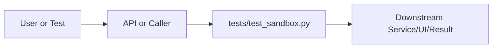

# test_sandbox.py Explained

Generated educational companion for `tests/test_sandbox.py`. This file is intentionally detailed so a developer can understand the code, architecture role, production tradeoffs, and ML/backend concepts behind the implementation.

## File Overview

`tests/test_sandbox.py` is a Python module in the Test layer: behavioral, safety, performance, and integration checks. It defines TestCleanCodePasses, TestImportBlocking, TestForbiddenNameWholeWordMatching, TestDunderAccess, TestDynamicExecution, TestScopeEscape, TestComplexityLimits, TestSanitizeOutput and validator.

## Why This File Exists

This file isolates one responsibility in the codebase: Test layer: behavioral, safety, performance, and integration checks. Separation matters because AI systems are easier to test, scale, debug, and explain when retrieval, orchestration, ML services, memory, UI, and deployment scripts have clear boundaries.

## Workflow Position

**Layer:** Test layer: behavioral, safety, performance, and integration checks.

**Previous step:** caller code, an API request, a browser event, a test fixture, an import, or a startup script prepares inputs.

**Current step:** `tests/test_sandbox.py` performs its local responsibility.

**Next step:** downstream services, API responses, rendered UI, tests, or process execution consume the result.



## Inputs and Outputs

- **Inputs:** function arguments, class constructor dependencies, HTTP payloads, environment variables, filesystem artifacts, DOM events, or test fixtures.
- **Outputs:** return values, dictionaries, Pydantic models, rendered DOM state, API responses, logs, process startup, assertions, or side effects.
- **Serialization:** this project uses JSON for APIs/LLM planning, parquet/joblib/faiss for ML artifacts, and HTML/CSS/JS for the browser surface.

## Imports Explained

| Import | Explanation |
|---|---|
| `__future__` | Project or standard-library dependency used to import a service, type, helper, or runtime capability. Imports affect startup time, packaging, and test isolation. |
| `pytest` | Project or standard-library dependency used to import a service, type, helper, or runtime capability. Imports affect startup time, packaging, and test isolation. |
| `research_ai` | Project or standard-library dependency used to import a service, type, helper, or runtime capability. Imports affect startup time, packaging, and test isolation. |

## Global Variables and Config

No major module-level variables are declared. This reduces hidden state and keeps imports lightweight.

## Step-by-Step Workflow

1. Load dependencies and runtime constants.
2. Accept input from the previous layer.
3. Validate, transform, route, score, render, or execute according to this file's role.
4. Return a structured output or perform a controlled side effect.
5. Let caller layers handle presentation, persistence, retries, or fallback.

## Function-by-Function Breakdown

### `validator`

- **Line:** 21
- **Kind:** synchronous function
- **Arguments:** none
- **Docstring:** No explicit docstring; infer behavior from call sites and body.

```python
def validator():
    return SandboxValidator()
```

This function's parameters define its input contract. Its return value or side effect defines how downstream code uses it. Review error handling, resource usage, and whether the function performs CPU work, I/O, model inference, or pure transformation.


## Class-by-Class Breakdown

### `TestCleanCodePasses`

- **Line:** 29
- **Base classes:** `object`
- **Docstring:** No explicit class docstring.

**Methods:**
- `test_simple_arithmetic` at line 30: method behavior is described by its body and name
- `test_list_comprehension` at line 34: method behavior is described by its body and name
- `test_statistics` at line 38: method behavior is described by its body and name
- `test_string_operations` at line 43: method behavior is described by its body and name
- `test_fibonacci` at line 47: method behavior is described by its body and name

```python
class TestCleanCodePasses:
    def test_simple_arithmetic(self, validator):
        result = validator.validate("x = 1 + 2\nprint(x)")
        assert result.ok, f"Expected pass, got: {result.issues}"

    def test_list_comprehension(self, validator):
        result = validator.validate("[x**2 for x in range(10)]")
        assert result.ok

    def test_statistics(self, validator):
        code = "data = [1, 2, 3, 4, 5]\nmean = sum(data) / len(data)\nprint(mean)"
        result = validator.validate(code)
        assert result.ok

    def test_string_operations(self, validator):
        result = validator.validate('text = "hello world"\nprint(text.upper())')
        assert result.ok

    def test_fibonacci(self, validator):
        code = """
def fib(n):
    if n <= 1:
        return n
    return fib(n-1) + fib(n-2)
print(fib(10))
"""
        result = validator.validate(code)
        assert result.ok
```

This class packages state and behavior behind a service-style interface. Constructor dependencies show what the class needs; public methods show what the rest of the system can ask it to do. In production, this boundary is where caching, model loading, artifact access, and error handling must be controlled.

### `TestImportBlocking`

- **Line:** 63
- **Base classes:** `object`
- **Docstring:** No explicit class docstring.

**Methods:**
- `test_import_os_blocked` at line 64: method behavior is described by its body and name
- `test_from_import_blocked` at line 69: method behavior is described by its body and name
- `test_import_sys_blocked` at line 73: method behavior is described by its body and name
- `test_import_subprocess_blocked` at line 77: method behavior is described by its body and name

```python
class TestImportBlocking:
    def test_import_os_blocked(self, validator):
        result = validator.validate("import os")
        assert not result.ok
        assert any("Import" in issue or "os" in issue for issue in result.issues)

    def test_from_import_blocked(self, validator):
        result = validator.validate("from os import path")
        assert not result.ok

    def test_import_sys_blocked(self, validator):
        result = validator.validate("import sys")
        assert not result.ok

    def test_import_subprocess_blocked(self, validator):
        result = validator.validate("import subprocess")
        assert not result.ok
```

This class packages state and behavior behind a service-style interface. Constructor dependencies show what the class needs; public methods show what the rest of the system can ask it to do. In production, this boundary is where caching, model loading, artifact access, and error handling must be controlled.

### `TestForbiddenNameWholeWordMatching`

- **Line:** 86
- **Base classes:** `object`
- **Docstring:** Verify false positives are eliminated by whole-word regex matching.

**Methods:**
- `test_open_standalone_blocked` at line 89: method behavior is described by its body and name
- `test_reopen_not_blocked` at line 93: BUG FIX: 'reopen' contains 'open' as substring but is a legitimate name.
- `test_overlay_not_blocked_by_open` at line 98: 'overlap' does not contain the word 'open'.
- `test_socket_standalone_blocked` at line 103: method behavior is described by its body and name
- `test_eval_standalone_blocked` at line 107: method behavior is described by its body and name
- `test_os_standalone_blocked` at line 111: method behavior is described by its body and name
- `test_sys_standalone_blocked` at line 115: method behavior is described by its body and name
- `test_inspect_standalone_blocked` at line 119: method behavior is described by its body and name

```python
class TestForbiddenNameWholeWordMatching:
    """Verify false positives are eliminated by whole-word regex matching."""

    def test_open_standalone_blocked(self, validator):
        result = validator.validate("f = open('file.txt')")
        assert not result.ok, "Standalone 'open' must be blocked"

    def test_reopen_not_blocked(self, validator):
        """BUG FIX: 'reopen' contains 'open' as substring but is a legitimate name."""
        result = validator.validate("reopen_count = 5\nprint(reopen_count)")
        assert result.ok, f"'reopen' is a legitimate variable name, got issues: {result.issues}"

    def test_overlay_not_blocked_by_open(self, validator):
        """'overlap' does not contain the word 'open'."""
        result = validator.validate("overlap = 0.5\nprint(overlap)")
        assert result.ok, f"'overlap' is safe, got: {result.issues}"

    def test_socket_standalone_blocked(self, validator):
        result = validator.validate("socket = 1")
        assert not result.ok

    def test_eval_standalone_blocked(self, validator):
        result = validator.validate("result = eval('1+1')")
        assert not result.ok

    def test_os_standalone_blocked(self, validator):
        result = validator.validate("x = os.getcwd()")
        assert not result.ok

    def test_sys_standalone_blocked(self, validator):
        result = validator.validate("sys.exit(0)")
        assert not result.ok

    def test_inspect_standalone_blocked(self, validator):
        result = validator.validate("x = inspect.stack()")
        assert not result.ok
```

This class packages state and behavior behind a service-style interface. Constructor dependencies show what the class needs; public methods show what the rest of the system can ask it to do. In production, this boundary is where caching, model loading, artifact access, and error handling must be controlled.

### `TestDunderAccess`

- **Line:** 128
- **Base classes:** `object`
- **Docstring:** No explicit class docstring.

**Methods:**
- `test_class_dunder_blocked` at line 129: method behavior is described by its body and name
- `test_builtins_dunder_blocked` at line 134: method behavior is described by its body and name
- `test_dict_keys_allowed` at line 138: Normal dict method access is allowed.

```python
class TestDunderAccess:
    def test_class_dunder_blocked(self, validator):
        result = validator.validate("x = ().__class__")
        assert not result.ok
        assert any("__class__" in issue or "Dunder" in issue for issue in result.issues)

    def test_builtins_dunder_blocked(self, validator):
        result = validator.validate("b = {}.__builtins__")
        assert not result.ok

    def test_dict_keys_allowed(self, validator):
        """Normal dict method access is allowed."""
        result = validator.validate("d = {}\nkeys = list(d.keys())")
        assert result.ok
```

This class packages state and behavior behind a service-style interface. Constructor dependencies show what the class needs; public methods show what the rest of the system can ask it to do. In production, this boundary is where caching, model loading, artifact access, and error handling must be controlled.

### `TestDynamicExecution`

- **Line:** 148
- **Base classes:** `object`
- **Docstring:** No explicit class docstring.

**Methods:**
- `test_eval_call_blocked` at line 149: method behavior is described by its body and name
- `test_exec_call_blocked` at line 153: method behavior is described by its body and name
- `test_compile_call_blocked` at line 157: method behavior is described by its body and name

```python
class TestDynamicExecution:
    def test_eval_call_blocked(self, validator):
        result = validator.validate("eval('__import__(\"os\")')")
        assert not result.ok

    def test_exec_call_blocked(self, validator):
        result = validator.validate("exec('import os')")
        assert not result.ok

    def test_compile_call_blocked(self, validator):
        result = validator.validate("code = compile('x=1', '', 'exec')")
        assert not result.ok
```

This class packages state and behavior behind a service-style interface. Constructor dependencies show what the class needs; public methods show what the rest of the system can ask it to do. In production, this boundary is where caching, model loading, artifact access, and error handling must be controlled.

### `TestScopeEscape`

- **Line:** 166
- **Base classes:** `object`
- **Docstring:** No explicit class docstring.

**Methods:**
- `test_global_statement_blocked` at line 167: method behavior is described by its body and name
- `test_nonlocal_statement_blocked` at line 171: method behavior is described by its body and name
- `test_del_statement_blocked` at line 175: method behavior is described by its body and name

```python
class TestScopeEscape:
    def test_global_statement_blocked(self, validator):
        result = validator.validate("def f():\n    global x\n    x = 1")
        assert not result.ok

    def test_nonlocal_statement_blocked(self, validator):
        result = validator.validate("def outer():\n    x=1\n    def inner():\n        nonlocal x\n        x=2")
        assert not result.ok

    def test_del_statement_blocked(self, validator):
        result = validator.validate("x = [1,2,3]\ndel x[0]")
        assert not result.ok
```

This class packages state and behavior behind a service-style interface. Constructor dependencies show what the class needs; public methods show what the rest of the system can ask it to do. In production, this boundary is where caching, model loading, artifact access, and error handling must be controlled.

### `TestComplexityLimits`

- **Line:** 184
- **Base classes:** `object`
- **Docstring:** No explicit class docstring.

**Methods:**
- `test_line_count_limit` at line 185: method behavior is described by its body and name
- `test_ast_node_count_reported` at line 191: method behavior is described by its body and name
- `test_syntax_error_reported` at line 195: method behavior is described by its body and name

```python
class TestComplexityLimits:
    def test_line_count_limit(self, validator):
        code = "\n".join(f"x_{i} = {i}" for i in range(200))
        result = validator.validate(code)
        assert not result.ok
        assert any("line limit" in issue.lower() for issue in result.issues)

    def test_ast_node_count_reported(self, validator):
        result = validator.validate("x = 1 + 2")
        assert result.ast_node_count > 0

    def test_syntax_error_reported(self, validator):
        result = validator.validate("def broken(:\n    pass")
        assert not result.ok
        assert any("Syntax error" in issue or "syntax" in issue.lower() for issue in result.issues)
```

This class packages state and behavior behind a service-style interface. Constructor dependencies show what the class needs; public methods show what the rest of the system can ask it to do. In production, this boundary is where caching, model loading, artifact access, and error handling must be controlled.

### `TestSanitizeOutput`

- **Line:** 205
- **Base classes:** `object`
- **Docstring:** No explicit class docstring.

**Methods:**
- `test_ansi_codes_stripped` at line 206: method behavior is described by its body and name
- `test_truncation_at_max_chars` at line 212: method behavior is described by its body and name
- `test_short_output_unchanged` at line 217: method behavior is described by its body and name

```python
class TestSanitizeOutput:
    def test_ansi_codes_stripped(self, validator):
        ansi_text = "\x1b[31mred text\x1b[0m"
        cleaned = validator.sanitize_output(ansi_text)
        assert "\x1b" not in cleaned
        assert "red text" in cleaned

    def test_truncation_at_max_chars(self, validator):
        long_text = "x" * 10000
        cleaned = validator.sanitize_output(long_text, max_chars=100)
        assert len(cleaned) <= 100

    def test_short_output_unchanged(self, validator):
        result = validator.sanitize_output("hello world")
        assert result == "hello world"
```

This class packages state and behavior behind a service-style interface. Constructor dependencies show what the class needs; public methods show what the rest of the system can ask it to do. In production, this boundary is where caching, model loading, artifact access, and error handling must be controlled.


## Method-by-Method Deep Dive

### Class `TestCleanCodePasses` Methods

#### `TestCleanCodePasses.test_simple_arithmetic`

- **Line:** 30
- **Kind:** synchronous method
- **Arguments:** self, validator
- **Docstring:** No explicit docstring; behavior is inferred from the implementation and call sites.

```python
    def test_simple_arithmetic(self, validator):
        result = validator.validate("x = 1 + 2\nprint(x)")
        assert result.ok, f"Expected pass, got: {result.issues}"
```

This method is part of the class contract. Its inputs show what state or caller data it consumes; its body shows whether it performs pure transformation, model/artifact access, retrieval, I/O, caching, validation, or orchestration. In production review, pay attention to error handling, mutation of `self`, repeated expensive work, and whether return shapes stay stable for downstream callers.

#### `TestCleanCodePasses.test_list_comprehension`

- **Line:** 34
- **Kind:** synchronous method
- **Arguments:** self, validator
- **Docstring:** No explicit docstring; behavior is inferred from the implementation and call sites.

```python
    def test_list_comprehension(self, validator):
        result = validator.validate("[x**2 for x in range(10)]")
        assert result.ok
```

This method is part of the class contract. Its inputs show what state or caller data it consumes; its body shows whether it performs pure transformation, model/artifact access, retrieval, I/O, caching, validation, or orchestration. In production review, pay attention to error handling, mutation of `self`, repeated expensive work, and whether return shapes stay stable for downstream callers.

#### `TestCleanCodePasses.test_statistics`

- **Line:** 38
- **Kind:** synchronous method
- **Arguments:** self, validator
- **Docstring:** No explicit docstring; behavior is inferred from the implementation and call sites.

```python
    def test_statistics(self, validator):
        code = "data = [1, 2, 3, 4, 5]\nmean = sum(data) / len(data)\nprint(mean)"
        result = validator.validate(code)
        assert result.ok
```

This method is part of the class contract. Its inputs show what state or caller data it consumes; its body shows whether it performs pure transformation, model/artifact access, retrieval, I/O, caching, validation, or orchestration. In production review, pay attention to error handling, mutation of `self`, repeated expensive work, and whether return shapes stay stable for downstream callers.

#### `TestCleanCodePasses.test_string_operations`

- **Line:** 43
- **Kind:** synchronous method
- **Arguments:** self, validator
- **Docstring:** No explicit docstring; behavior is inferred from the implementation and call sites.

```python
    def test_string_operations(self, validator):
        result = validator.validate('text = "hello world"\nprint(text.upper())')
        assert result.ok
```

This method is part of the class contract. Its inputs show what state or caller data it consumes; its body shows whether it performs pure transformation, model/artifact access, retrieval, I/O, caching, validation, or orchestration. In production review, pay attention to error handling, mutation of `self`, repeated expensive work, and whether return shapes stay stable for downstream callers.

#### `TestCleanCodePasses.test_fibonacci`

- **Line:** 47
- **Kind:** synchronous method
- **Arguments:** self, validator
- **Docstring:** No explicit docstring; behavior is inferred from the implementation and call sites.

```python
    def test_fibonacci(self, validator):
        code = """
def fib(n):
    if n <= 1:
        return n
    return fib(n-1) + fib(n-2)
print(fib(10))
"""
        result = validator.validate(code)
        assert result.ok
```

This method is part of the class contract. Its inputs show what state or caller data it consumes; its body shows whether it performs pure transformation, model/artifact access, retrieval, I/O, caching, validation, or orchestration. In production review, pay attention to error handling, mutation of `self`, repeated expensive work, and whether return shapes stay stable for downstream callers.

### Class `TestImportBlocking` Methods

#### `TestImportBlocking.test_import_os_blocked`

- **Line:** 64
- **Kind:** synchronous method
- **Arguments:** self, validator
- **Docstring:** No explicit docstring; behavior is inferred from the implementation and call sites.

```python
    def test_import_os_blocked(self, validator):
        result = validator.validate("import os")
        assert not result.ok
        assert any("Import" in issue or "os" in issue for issue in result.issues)
```

This method is part of the class contract. Its inputs show what state or caller data it consumes; its body shows whether it performs pure transformation, model/artifact access, retrieval, I/O, caching, validation, or orchestration. In production review, pay attention to error handling, mutation of `self`, repeated expensive work, and whether return shapes stay stable for downstream callers.

#### `TestImportBlocking.test_from_import_blocked`

- **Line:** 69
- **Kind:** synchronous method
- **Arguments:** self, validator
- **Docstring:** No explicit docstring; behavior is inferred from the implementation and call sites.

```python
    def test_from_import_blocked(self, validator):
        result = validator.validate("from os import path")
        assert not result.ok
```

This method is part of the class contract. Its inputs show what state or caller data it consumes; its body shows whether it performs pure transformation, model/artifact access, retrieval, I/O, caching, validation, or orchestration. In production review, pay attention to error handling, mutation of `self`, repeated expensive work, and whether return shapes stay stable for downstream callers.

#### `TestImportBlocking.test_import_sys_blocked`

- **Line:** 73
- **Kind:** synchronous method
- **Arguments:** self, validator
- **Docstring:** No explicit docstring; behavior is inferred from the implementation and call sites.

```python
    def test_import_sys_blocked(self, validator):
        result = validator.validate("import sys")
        assert not result.ok
```

This method is part of the class contract. Its inputs show what state or caller data it consumes; its body shows whether it performs pure transformation, model/artifact access, retrieval, I/O, caching, validation, or orchestration. In production review, pay attention to error handling, mutation of `self`, repeated expensive work, and whether return shapes stay stable for downstream callers.

#### `TestImportBlocking.test_import_subprocess_blocked`

- **Line:** 77
- **Kind:** synchronous method
- **Arguments:** self, validator
- **Docstring:** No explicit docstring; behavior is inferred from the implementation and call sites.

```python
    def test_import_subprocess_blocked(self, validator):
        result = validator.validate("import subprocess")
        assert not result.ok
```

This method is part of the class contract. Its inputs show what state or caller data it consumes; its body shows whether it performs pure transformation, model/artifact access, retrieval, I/O, caching, validation, or orchestration. In production review, pay attention to error handling, mutation of `self`, repeated expensive work, and whether return shapes stay stable for downstream callers.

### Class `TestForbiddenNameWholeWordMatching` Methods

#### `TestForbiddenNameWholeWordMatching.test_open_standalone_blocked`

- **Line:** 89
- **Kind:** synchronous method
- **Arguments:** self, validator
- **Docstring:** No explicit docstring; behavior is inferred from the implementation and call sites.

```python
    def test_open_standalone_blocked(self, validator):
        result = validator.validate("f = open('file.txt')")
        assert not result.ok, "Standalone 'open' must be blocked"
```

This method is part of the class contract. Its inputs show what state or caller data it consumes; its body shows whether it performs pure transformation, model/artifact access, retrieval, I/O, caching, validation, or orchestration. In production review, pay attention to error handling, mutation of `self`, repeated expensive work, and whether return shapes stay stable for downstream callers.

#### `TestForbiddenNameWholeWordMatching.test_reopen_not_blocked`

- **Line:** 93
- **Kind:** synchronous method
- **Arguments:** self, validator
- **Docstring:** BUG FIX: 'reopen' contains 'open' as substring but is a legitimate name.

```python
    def test_reopen_not_blocked(self, validator):
        """BUG FIX: 'reopen' contains 'open' as substring but is a legitimate name."""
        result = validator.validate("reopen_count = 5\nprint(reopen_count)")
        assert result.ok, f"'reopen' is a legitimate variable name, got issues: {result.issues}"
```

This method is part of the class contract. Its inputs show what state or caller data it consumes; its body shows whether it performs pure transformation, model/artifact access, retrieval, I/O, caching, validation, or orchestration. In production review, pay attention to error handling, mutation of `self`, repeated expensive work, and whether return shapes stay stable for downstream callers.

#### `TestForbiddenNameWholeWordMatching.test_overlay_not_blocked_by_open`

- **Line:** 98
- **Kind:** synchronous method
- **Arguments:** self, validator
- **Docstring:** 'overlap' does not contain the word 'open'.

```python
    def test_overlay_not_blocked_by_open(self, validator):
        """'overlap' does not contain the word 'open'."""
        result = validator.validate("overlap = 0.5\nprint(overlap)")
        assert result.ok, f"'overlap' is safe, got: {result.issues}"
```

This method is part of the class contract. Its inputs show what state or caller data it consumes; its body shows whether it performs pure transformation, model/artifact access, retrieval, I/O, caching, validation, or orchestration. In production review, pay attention to error handling, mutation of `self`, repeated expensive work, and whether return shapes stay stable for downstream callers.

#### `TestForbiddenNameWholeWordMatching.test_socket_standalone_blocked`

- **Line:** 103
- **Kind:** synchronous method
- **Arguments:** self, validator
- **Docstring:** No explicit docstring; behavior is inferred from the implementation and call sites.

```python
    def test_socket_standalone_blocked(self, validator):
        result = validator.validate("socket = 1")
        assert not result.ok
```

This method is part of the class contract. Its inputs show what state or caller data it consumes; its body shows whether it performs pure transformation, model/artifact access, retrieval, I/O, caching, validation, or orchestration. In production review, pay attention to error handling, mutation of `self`, repeated expensive work, and whether return shapes stay stable for downstream callers.

#### `TestForbiddenNameWholeWordMatching.test_eval_standalone_blocked`

- **Line:** 107
- **Kind:** synchronous method
- **Arguments:** self, validator
- **Docstring:** No explicit docstring; behavior is inferred from the implementation and call sites.

```python
    def test_eval_standalone_blocked(self, validator):
        result = validator.validate("result = eval('1+1')")
        assert not result.ok
```

This method is part of the class contract. Its inputs show what state or caller data it consumes; its body shows whether it performs pure transformation, model/artifact access, retrieval, I/O, caching, validation, or orchestration. In production review, pay attention to error handling, mutation of `self`, repeated expensive work, and whether return shapes stay stable for downstream callers.

#### `TestForbiddenNameWholeWordMatching.test_os_standalone_blocked`

- **Line:** 111
- **Kind:** synchronous method
- **Arguments:** self, validator
- **Docstring:** No explicit docstring; behavior is inferred from the implementation and call sites.

```python
    def test_os_standalone_blocked(self, validator):
        result = validator.validate("x = os.getcwd()")
        assert not result.ok
```

This method is part of the class contract. Its inputs show what state or caller data it consumes; its body shows whether it performs pure transformation, model/artifact access, retrieval, I/O, caching, validation, or orchestration. In production review, pay attention to error handling, mutation of `self`, repeated expensive work, and whether return shapes stay stable for downstream callers.

#### `TestForbiddenNameWholeWordMatching.test_sys_standalone_blocked`

- **Line:** 115
- **Kind:** synchronous method
- **Arguments:** self, validator
- **Docstring:** No explicit docstring; behavior is inferred from the implementation and call sites.

```python
    def test_sys_standalone_blocked(self, validator):
        result = validator.validate("sys.exit(0)")
        assert not result.ok
```

This method is part of the class contract. Its inputs show what state or caller data it consumes; its body shows whether it performs pure transformation, model/artifact access, retrieval, I/O, caching, validation, or orchestration. In production review, pay attention to error handling, mutation of `self`, repeated expensive work, and whether return shapes stay stable for downstream callers.

#### `TestForbiddenNameWholeWordMatching.test_inspect_standalone_blocked`

- **Line:** 119
- **Kind:** synchronous method
- **Arguments:** self, validator
- **Docstring:** No explicit docstring; behavior is inferred from the implementation and call sites.

```python
    def test_inspect_standalone_blocked(self, validator):
        result = validator.validate("x = inspect.stack()")
        assert not result.ok
```

This method is part of the class contract. Its inputs show what state or caller data it consumes; its body shows whether it performs pure transformation, model/artifact access, retrieval, I/O, caching, validation, or orchestration. In production review, pay attention to error handling, mutation of `self`, repeated expensive work, and whether return shapes stay stable for downstream callers.

### Class `TestDunderAccess` Methods

#### `TestDunderAccess.test_class_dunder_blocked`

- **Line:** 129
- **Kind:** synchronous method
- **Arguments:** self, validator
- **Docstring:** No explicit docstring; behavior is inferred from the implementation and call sites.

```python
    def test_class_dunder_blocked(self, validator):
        result = validator.validate("x = ().__class__")
        assert not result.ok
        assert any("__class__" in issue or "Dunder" in issue for issue in result.issues)
```

This method is part of the class contract. Its inputs show what state or caller data it consumes; its body shows whether it performs pure transformation, model/artifact access, retrieval, I/O, caching, validation, or orchestration. In production review, pay attention to error handling, mutation of `self`, repeated expensive work, and whether return shapes stay stable for downstream callers.

#### `TestDunderAccess.test_builtins_dunder_blocked`

- **Line:** 134
- **Kind:** synchronous method
- **Arguments:** self, validator
- **Docstring:** No explicit docstring; behavior is inferred from the implementation and call sites.

```python
    def test_builtins_dunder_blocked(self, validator):
        result = validator.validate("b = {}.__builtins__")
        assert not result.ok
```

This method is part of the class contract. Its inputs show what state or caller data it consumes; its body shows whether it performs pure transformation, model/artifact access, retrieval, I/O, caching, validation, or orchestration. In production review, pay attention to error handling, mutation of `self`, repeated expensive work, and whether return shapes stay stable for downstream callers.

#### `TestDunderAccess.test_dict_keys_allowed`

- **Line:** 138
- **Kind:** synchronous method
- **Arguments:** self, validator
- **Docstring:** Normal dict method access is allowed.

```python
    def test_dict_keys_allowed(self, validator):
        """Normal dict method access is allowed."""
        result = validator.validate("d = {}\nkeys = list(d.keys())")
        assert result.ok
```

This method is part of the class contract. Its inputs show what state or caller data it consumes; its body shows whether it performs pure transformation, model/artifact access, retrieval, I/O, caching, validation, or orchestration. In production review, pay attention to error handling, mutation of `self`, repeated expensive work, and whether return shapes stay stable for downstream callers.

### Class `TestDynamicExecution` Methods

#### `TestDynamicExecution.test_eval_call_blocked`

- **Line:** 149
- **Kind:** synchronous method
- **Arguments:** self, validator
- **Docstring:** No explicit docstring; behavior is inferred from the implementation and call sites.

```python
    def test_eval_call_blocked(self, validator):
        result = validator.validate("eval('__import__(\"os\")')")
        assert not result.ok
```

This method is part of the class contract. Its inputs show what state or caller data it consumes; its body shows whether it performs pure transformation, model/artifact access, retrieval, I/O, caching, validation, or orchestration. In production review, pay attention to error handling, mutation of `self`, repeated expensive work, and whether return shapes stay stable for downstream callers.

#### `TestDynamicExecution.test_exec_call_blocked`

- **Line:** 153
- **Kind:** synchronous method
- **Arguments:** self, validator
- **Docstring:** No explicit docstring; behavior is inferred from the implementation and call sites.

```python
    def test_exec_call_blocked(self, validator):
        result = validator.validate("exec('import os')")
        assert not result.ok
```

This method is part of the class contract. Its inputs show what state or caller data it consumes; its body shows whether it performs pure transformation, model/artifact access, retrieval, I/O, caching, validation, or orchestration. In production review, pay attention to error handling, mutation of `self`, repeated expensive work, and whether return shapes stay stable for downstream callers.

#### `TestDynamicExecution.test_compile_call_blocked`

- **Line:** 157
- **Kind:** synchronous method
- **Arguments:** self, validator
- **Docstring:** No explicit docstring; behavior is inferred from the implementation and call sites.

```python
    def test_compile_call_blocked(self, validator):
        result = validator.validate("code = compile('x=1', '', 'exec')")
        assert not result.ok
```

This method is part of the class contract. Its inputs show what state or caller data it consumes; its body shows whether it performs pure transformation, model/artifact access, retrieval, I/O, caching, validation, or orchestration. In production review, pay attention to error handling, mutation of `self`, repeated expensive work, and whether return shapes stay stable for downstream callers.

### Class `TestScopeEscape` Methods

#### `TestScopeEscape.test_global_statement_blocked`

- **Line:** 167
- **Kind:** synchronous method
- **Arguments:** self, validator
- **Docstring:** No explicit docstring; behavior is inferred from the implementation and call sites.

```python
    def test_global_statement_blocked(self, validator):
        result = validator.validate("def f():\n    global x\n    x = 1")
        assert not result.ok
```

This method is part of the class contract. Its inputs show what state or caller data it consumes; its body shows whether it performs pure transformation, model/artifact access, retrieval, I/O, caching, validation, or orchestration. In production review, pay attention to error handling, mutation of `self`, repeated expensive work, and whether return shapes stay stable for downstream callers.

#### `TestScopeEscape.test_nonlocal_statement_blocked`

- **Line:** 171
- **Kind:** synchronous method
- **Arguments:** self, validator
- **Docstring:** No explicit docstring; behavior is inferred from the implementation and call sites.

```python
    def test_nonlocal_statement_blocked(self, validator):
        result = validator.validate("def outer():\n    x=1\n    def inner():\n        nonlocal x\n        x=2")
        assert not result.ok
```

This method is part of the class contract. Its inputs show what state or caller data it consumes; its body shows whether it performs pure transformation, model/artifact access, retrieval, I/O, caching, validation, or orchestration. In production review, pay attention to error handling, mutation of `self`, repeated expensive work, and whether return shapes stay stable for downstream callers.

#### `TestScopeEscape.test_del_statement_blocked`

- **Line:** 175
- **Kind:** synchronous method
- **Arguments:** self, validator
- **Docstring:** No explicit docstring; behavior is inferred from the implementation and call sites.

```python
    def test_del_statement_blocked(self, validator):
        result = validator.validate("x = [1,2,3]\ndel x[0]")
        assert not result.ok
```

This method is part of the class contract. Its inputs show what state or caller data it consumes; its body shows whether it performs pure transformation, model/artifact access, retrieval, I/O, caching, validation, or orchestration. In production review, pay attention to error handling, mutation of `self`, repeated expensive work, and whether return shapes stay stable for downstream callers.

### Class `TestComplexityLimits` Methods

#### `TestComplexityLimits.test_line_count_limit`

- **Line:** 185
- **Kind:** synchronous method
- **Arguments:** self, validator
- **Docstring:** No explicit docstring; behavior is inferred from the implementation and call sites.

```python
    def test_line_count_limit(self, validator):
        code = "\n".join(f"x_{i} = {i}" for i in range(200))
        result = validator.validate(code)
        assert not result.ok
        assert any("line limit" in issue.lower() for issue in result.issues)
```

This method is part of the class contract. Its inputs show what state or caller data it consumes; its body shows whether it performs pure transformation, model/artifact access, retrieval, I/O, caching, validation, or orchestration. In production review, pay attention to error handling, mutation of `self`, repeated expensive work, and whether return shapes stay stable for downstream callers.

#### `TestComplexityLimits.test_ast_node_count_reported`

- **Line:** 191
- **Kind:** synchronous method
- **Arguments:** self, validator
- **Docstring:** No explicit docstring; behavior is inferred from the implementation and call sites.

```python
    def test_ast_node_count_reported(self, validator):
        result = validator.validate("x = 1 + 2")
        assert result.ast_node_count > 0
```

This method is part of the class contract. Its inputs show what state or caller data it consumes; its body shows whether it performs pure transformation, model/artifact access, retrieval, I/O, caching, validation, or orchestration. In production review, pay attention to error handling, mutation of `self`, repeated expensive work, and whether return shapes stay stable for downstream callers.

#### `TestComplexityLimits.test_syntax_error_reported`

- **Line:** 195
- **Kind:** synchronous method
- **Arguments:** self, validator
- **Docstring:** No explicit docstring; behavior is inferred from the implementation and call sites.

```python
    def test_syntax_error_reported(self, validator):
        result = validator.validate("def broken(:\n    pass")
        assert not result.ok
        assert any("Syntax error" in issue or "syntax" in issue.lower() for issue in result.issues)
```

This method is part of the class contract. Its inputs show what state or caller data it consumes; its body shows whether it performs pure transformation, model/artifact access, retrieval, I/O, caching, validation, or orchestration. In production review, pay attention to error handling, mutation of `self`, repeated expensive work, and whether return shapes stay stable for downstream callers.

### Class `TestSanitizeOutput` Methods

#### `TestSanitizeOutput.test_ansi_codes_stripped`

- **Line:** 206
- **Kind:** synchronous method
- **Arguments:** self, validator
- **Docstring:** No explicit docstring; behavior is inferred from the implementation and call sites.

```python
    def test_ansi_codes_stripped(self, validator):
        ansi_text = "\x1b[31mred text\x1b[0m"
        cleaned = validator.sanitize_output(ansi_text)
        assert "\x1b" not in cleaned
        assert "red text" in cleaned
```

This method is part of the class contract. Its inputs show what state or caller data it consumes; its body shows whether it performs pure transformation, model/artifact access, retrieval, I/O, caching, validation, or orchestration. In production review, pay attention to error handling, mutation of `self`, repeated expensive work, and whether return shapes stay stable for downstream callers.

#### `TestSanitizeOutput.test_truncation_at_max_chars`

- **Line:** 212
- **Kind:** synchronous method
- **Arguments:** self, validator
- **Docstring:** No explicit docstring; behavior is inferred from the implementation and call sites.

```python
    def test_truncation_at_max_chars(self, validator):
        long_text = "x" * 10000
        cleaned = validator.sanitize_output(long_text, max_chars=100)
        assert len(cleaned) <= 100
```

This method is part of the class contract. Its inputs show what state or caller data it consumes; its body shows whether it performs pure transformation, model/artifact access, retrieval, I/O, caching, validation, or orchestration. In production review, pay attention to error handling, mutation of `self`, repeated expensive work, and whether return shapes stay stable for downstream callers.

#### `TestSanitizeOutput.test_short_output_unchanged`

- **Line:** 217
- **Kind:** synchronous method
- **Arguments:** self, validator
- **Docstring:** No explicit docstring; behavior is inferred from the implementation and call sites.

```python
    def test_short_output_unchanged(self, validator):
        result = validator.sanitize_output("hello world")
        assert result == "hello world"
```

This method is part of the class contract. Its inputs show what state or caller data it consumes; its body shows whether it performs pure transformation, model/artifact access, retrieval, I/O, caching, validation, or orchestration. In production review, pay attention to error handling, mutation of `self`, repeated expensive work, and whether return shapes stay stable for downstream callers.

## Important Algorithms Used

- **Streaming**: Streaming improves perceived latency by sending incremental output instead of waiting for full completion.
- **Sandboxing**: Sandboxing validates and constrains user code before execution, reducing security and stability risk.

## Libraries Used

| Import | Explanation |
|---|---|
| `__future__` | Project or standard-library dependency used to import a service, type, helper, or runtime capability. Imports affect startup time, packaging, and test isolation. |
| `pytest` | Project or standard-library dependency used to import a service, type, helper, or runtime capability. Imports affect startup time, packaging, and test isolation. |
| `research_ai` | Project or standard-library dependency used to import a service, type, helper, or runtime capability. Imports affect startup time, packaging, and test isolation. |

## ML Concepts Used

- **Streaming**: Streaming improves perceived latency by sending incremental output instead of waiting for full completion.
- **Sandboxing**: Sandboxing validates and constrains user code before execution, reducing security and stability risk.

## Performance and Memory Notes

- Avoid eager loading of heavy ML models unless startup latency is acceptable.
- Cache expensive clients, tokenizers, vector stores, and embeddings carefully.
- Use float32 for embedding vectors because it halves memory compared with float64 and matches FAISS/neural inference expectations.
- Bound prompt length, uploaded content, result counts, and token budgets to control latency and memory.
- Watch copies of large metadata frames, embedding matrices, and file buffers.

## Scalability Notes

- In-memory state works for local demos but needs Redis/database/object storage for multi-worker cloud deployment.
- CPU/GPU inference should often be separated from the web API when traffic grows.
- Retrieval can start exact and move to approximate indexes as corpus size grows.
- Batch operations and cache repeated work to improve throughput.
- Add metrics for latency, errors, fallback frequency, retrieval hit rate, and token usage.

## Production Engineering Notes

- Keep interfaces stable because other files may import this module or depend on its response shape.
- Prefer typed/structured data over free-form strings at service boundaries.
- Log operational context without secrets or huge payloads.
- Make fallback behavior explicit so users get useful output even when LLMs or artifacts fail.
- Keep provider-specific logic behind adapters so Groq/OpenRouter/Google/Ollama can be swapped.

## Common Bugs and Failure Cases

- Missing `.env` values, model artifacts, or Ollama models can trigger degraded behavior.
- Type mismatches occur when LLM-generated tool arguments cross into strict Python code.
- Empty retrieval results must not become hallucinated answers.
- Network calls need timeouts and careful retry behavior.
- Frontend IDs/classes and API schemas are contracts; changing one side without the other breaks workflows.

## Security Considerations

- Touches files or paths. Validate filenames, restrict upload size/type, and prevent traversal.
- Deals with execution or subprocesses. Maintain AST validation, isolated mode, timeouts, and least privilege.

## Real Industry Usage

- This pattern appears in enterprise RAG assistants, scientific search tools, internal research copilots, and ML platform demos.
- The layered design mirrors production systems: API facade, orchestration, retrieval, evaluation, synthesis, UI, and deployment.
- Clear separation lets teams replace model providers, improve retrieval, harden security, or redesign UI independently.

## Optimization Opportunities

- Add tracing around each workflow step.
- Strengthen schema validation at boundaries.
- Persist conversation/session state outside process memory.
- Add load tests and adversarial tests for prompt injection, empty evidence, and large uploads.
- Consider approximate vector indexes, reranker models, or batching when corpus/traffic grows.

## How This Connects To Other Files

- `tests/test_sandbox.py` is connected through imports, startup scripts, API routes, frontend selectors, tests, or artifact paths.
- `src/research_ai/platform.py` is the backend composition root.
- `src/research_ai/api/main.py` exposes backend behavior over HTTP.
- Retrieval modules depend on artifacts under `artifacts/`.
- Frontend files depend on stable endpoint and DOM contracts.

## End-to-End Flow Summary

- A user/browser/test/startup event enters the system.
- The relevant layer validates or normalizes input.
- Retrieval, ML, orchestration, execution, or UI rendering happens.
- A structured result, visual state, or process side effect is produced.
- Fallbacks and tests keep behavior understandable when dependencies are unavailable.

## Interview Questions

1. What responsibility does this file own?
2. What inputs and outputs define its contract?
3. Which dependencies are expensive or operationally risky?
4. What breaks if this file changes shape?
5. How would you scale or test this behavior in production?

## Key Takeaways

- `tests/test_sandbox.py` should be understood as part of a layered AI research platform.
- Trace data flow from inputs to transformations to outputs.
- Production readiness comes from explicit contracts, bounded resources, observability, secure defaults, and graceful fallback.

## Fully Commented Source

This section repeats the original source with an explanatory comment before every line. The comments are educational only; they are not inserted into the production source file.

```python
# L0001: Starts, ends, or continues a docstring that documents module, class, or function intent.
"""Tests for SandboxValidator — static analysis security layer.
# L0002: Blank line that visually separates logical sections and improves readability.

# L0003: Executes Python logic as part of this file's workflow; read surrounding lines for data flow and side effects.
Covers:
# L0004: Executes Python logic as part of this file's workflow; read surrounding lines for data flow and side effects.
  - Forbidden AST node detection (Import, ImportFrom, Delete, Global, Nonlocal)
# L0005: Executes Python logic as part of this file's workflow; read surrounding lines for data flow and side effects.
  - Forbidden name whole-word matching (BUG FIX: no false positives)
# L0006: Executes Python logic as part of this file's workflow; read surrounding lines for data flow and side effects.
  - Dunder attribute detection
# L0007: Executes Python logic as part of this file's workflow; read surrounding lines for data flow and side effects.
  - Dynamic execution detection (eval, exec, compile)
# L0008: Executes Python logic as part of this file's workflow; read surrounding lines for data flow and side effects.
  - Line count limit
# L0009: Executes Python logic as part of this file's workflow; read surrounding lines for data flow and side effects.
  - AST node count limit
# L0010: Executes Python logic as part of this file's workflow; read surrounding lines for data flow and side effects.
  - Clean code passes validation
# L0011: Executes Python logic as part of this file's workflow; read surrounding lines for data flow and side effects.
  - Sanitize output truncation and ANSI stripping
# L0012: Starts, ends, or continues a docstring that documents module, class, or function intent.
"""
# L0013: Enables future Python behavior so annotations/import semantics stay modern and predictable.
from __future__ import annotations
# L0014: Blank line that visually separates logical sections and improves readability.

# L0015: Imports a dependency, type, or project module needed by later code in this file.
import pytest
# L0016: Blank line that visually separates logical sections and improves readability.

# L0017: Imports a dependency, type, or project module needed by later code in this file.
from research_ai.execution.sandbox.service import SandboxValidator
# L0018: Blank line that visually separates logical sections and improves readability.

# L0019: Blank line that visually separates logical sections and improves readability.

# L0020: Decorator that modifies the function/class below, commonly for routing, dataclasses, caching, or properties.
@pytest.fixture
# L0021: Defines a function or method; parameters are the input contract and the body implements the workflow.
def validator():
# L0022: Returns the computed result to the caller; this shape becomes part of the downstream contract.
    return SandboxValidator()
# L0023: Blank line that visually separates logical sections and improves readability.

# L0024: Blank line that visually separates logical sections and improves readability.

# L0025: Developer comment explaining intent, caveat, section boundary, or operational reasoning.
# ---------------------------------------------------------------------------
# L0026: Developer comment explaining intent, caveat, section boundary, or operational reasoning.
# 1. Clean code passes
# L0027: Developer comment explaining intent, caveat, section boundary, or operational reasoning.
# ---------------------------------------------------------------------------
# L0028: Blank line that visually separates logical sections and improves readability.

# L0029: Defines a class that groups related state and behavior behind a reusable interface.
class TestCleanCodePasses:
# L0030: Defines a function or method; parameters are the input contract and the body implements the workflow.
    def test_simple_arithmetic(self, validator):
# L0031: Assigns or updates a value used later in the workflow; check mutability and data shape.
        result = validator.validate("x = 1 + 2\nprint(x)")
# L0032: Executes Python logic as part of this file's workflow; read surrounding lines for data flow and side effects.
        assert result.ok, f"Expected pass, got: {result.issues}"
# L0033: Blank line that visually separates logical sections and improves readability.

# L0034: Defines a function or method; parameters are the input contract and the body implements the workflow.
    def test_list_comprehension(self, validator):
# L0035: Assigns or updates a value used later in the workflow; check mutability and data shape.
        result = validator.validate("[x**2 for x in range(10)]")
# L0036: Executes Python logic as part of this file's workflow; read surrounding lines for data flow and side effects.
        assert result.ok
# L0037: Blank line that visually separates logical sections and improves readability.

# L0038: Defines a function or method; parameters are the input contract and the body implements the workflow.
    def test_statistics(self, validator):
# L0039: Assigns or updates a value used later in the workflow; check mutability and data shape.
        code = "data = [1, 2, 3, 4, 5]\nmean = sum(data) / len(data)\nprint(mean)"
# L0040: Assigns or updates a value used later in the workflow; check mutability and data shape.
        result = validator.validate(code)
# L0041: Executes Python logic as part of this file's workflow; read surrounding lines for data flow and side effects.
        assert result.ok
# L0042: Blank line that visually separates logical sections and improves readability.

# L0043: Defines a function or method; parameters are the input contract and the body implements the workflow.
    def test_string_operations(self, validator):
# L0044: Assigns or updates a value used later in the workflow; check mutability and data shape.
        result = validator.validate('text = "hello world"\nprint(text.upper())')
# L0045: Executes Python logic as part of this file's workflow; read surrounding lines for data flow and side effects.
        assert result.ok
# L0046: Blank line that visually separates logical sections and improves readability.

# L0047: Defines a function or method; parameters are the input contract and the body implements the workflow.
    def test_fibonacci(self, validator):
# L0048: Assigns or updates a value used later in the workflow; check mutability and data shape.
        code = """
# L0049: Defines a function or method; parameters are the input contract and the body implements the workflow.
def fib(n):
# L0050: Branches execution based on a condition, usually for validation, fallback, or mode-specific behavior.
    if n <= 1:
# L0051: Returns the computed result to the caller; this shape becomes part of the downstream contract.
        return n
# L0052: Returns the computed result to the caller; this shape becomes part of the downstream contract.
    return fib(n-1) + fib(n-2)
# L0053: Executes Python logic as part of this file's workflow; read surrounding lines for data flow and side effects.
print(fib(10))
# L0054: Starts, ends, or continues a docstring that documents module, class, or function intent.
"""
# L0055: Assigns or updates a value used later in the workflow; check mutability and data shape.
        result = validator.validate(code)
# L0056: Executes Python logic as part of this file's workflow; read surrounding lines for data flow and side effects.
        assert result.ok
# L0057: Blank line that visually separates logical sections and improves readability.

# L0058: Blank line that visually separates logical sections and improves readability.

# L0059: Developer comment explaining intent, caveat, section boundary, or operational reasoning.
# ---------------------------------------------------------------------------
# L0060: Developer comment explaining intent, caveat, section boundary, or operational reasoning.
# 2. Import blocking
# L0061: Developer comment explaining intent, caveat, section boundary, or operational reasoning.
# ---------------------------------------------------------------------------
# L0062: Blank line that visually separates logical sections and improves readability.

# L0063: Defines a class that groups related state and behavior behind a reusable interface.
class TestImportBlocking:
# L0064: Defines a function or method; parameters are the input contract and the body implements the workflow.
    def test_import_os_blocked(self, validator):
# L0065: Assigns or updates a value used later in the workflow; check mutability and data shape.
        result = validator.validate("import os")
# L0066: Executes Python logic as part of this file's workflow; read surrounding lines for data flow and side effects.
        assert not result.ok
# L0067: Executes Python logic as part of this file's workflow; read surrounding lines for data flow and side effects.
        assert any("Import" in issue or "os" in issue for issue in result.issues)
# L0068: Blank line that visually separates logical sections and improves readability.

# L0069: Defines a function or method; parameters are the input contract and the body implements the workflow.
    def test_from_import_blocked(self, validator):
# L0070: Assigns or updates a value used later in the workflow; check mutability and data shape.
        result = validator.validate("from os import path")
# L0071: Executes Python logic as part of this file's workflow; read surrounding lines for data flow and side effects.
        assert not result.ok
# L0072: Blank line that visually separates logical sections and improves readability.

# L0073: Defines a function or method; parameters are the input contract and the body implements the workflow.
    def test_import_sys_blocked(self, validator):
# L0074: Assigns or updates a value used later in the workflow; check mutability and data shape.
        result = validator.validate("import sys")
# L0075: Executes Python logic as part of this file's workflow; read surrounding lines for data flow and side effects.
        assert not result.ok
# L0076: Blank line that visually separates logical sections and improves readability.

# L0077: Defines a function or method; parameters are the input contract and the body implements the workflow.
    def test_import_subprocess_blocked(self, validator):
# L0078: Assigns or updates a value used later in the workflow; check mutability and data shape.
        result = validator.validate("import subprocess")
# L0079: Executes Python logic as part of this file's workflow; read surrounding lines for data flow and side effects.
        assert not result.ok
# L0080: Blank line that visually separates logical sections and improves readability.

# L0081: Blank line that visually separates logical sections and improves readability.

# L0082: Developer comment explaining intent, caveat, section boundary, or operational reasoning.
# ---------------------------------------------------------------------------
# L0083: Developer comment explaining intent, caveat, section boundary, or operational reasoning.
# 3. Forbidden names — whole-word matching (BUG FIX v3.1.1)
# L0084: Developer comment explaining intent, caveat, section boundary, or operational reasoning.
# ---------------------------------------------------------------------------
# L0085: Blank line that visually separates logical sections and improves readability.

# L0086: Defines a class that groups related state and behavior behind a reusable interface.
class TestForbiddenNameWholeWordMatching:
# L0087: Starts, ends, or continues a docstring that documents module, class, or function intent.
    """Verify false positives are eliminated by whole-word regex matching."""
# L0088: Blank line that visually separates logical sections and improves readability.

# L0089: Defines a function or method; parameters are the input contract and the body implements the workflow.
    def test_open_standalone_blocked(self, validator):
# L0090: Assigns or updates a value used later in the workflow; check mutability and data shape.
        result = validator.validate("f = open('file.txt')")
# L0091: Executes Python logic as part of this file's workflow; read surrounding lines for data flow and side effects.
        assert not result.ok, "Standalone 'open' must be blocked"
# L0092: Blank line that visually separates logical sections and improves readability.

# L0093: Defines a function or method; parameters are the input contract and the body implements the workflow.
    def test_reopen_not_blocked(self, validator):
# L0094: Starts, ends, or continues a docstring that documents module, class, or function intent.
        """BUG FIX: 'reopen' contains 'open' as substring but is a legitimate name."""
# L0095: Assigns or updates a value used later in the workflow; check mutability and data shape.
        result = validator.validate("reopen_count = 5\nprint(reopen_count)")
# L0096: Executes Python logic as part of this file's workflow; read surrounding lines for data flow and side effects.
        assert result.ok, f"'reopen' is a legitimate variable name, got issues: {result.issues}"
# L0097: Blank line that visually separates logical sections and improves readability.

# L0098: Defines a function or method; parameters are the input contract and the body implements the workflow.
    def test_overlay_not_blocked_by_open(self, validator):
# L0099: Starts, ends, or continues a docstring that documents module, class, or function intent.
        """'overlap' does not contain the word 'open'."""
# L0100: Assigns or updates a value used later in the workflow; check mutability and data shape.
        result = validator.validate("overlap = 0.5\nprint(overlap)")
# L0101: Executes Python logic as part of this file's workflow; read surrounding lines for data flow and side effects.
        assert result.ok, f"'overlap' is safe, got: {result.issues}"
# L0102: Blank line that visually separates logical sections and improves readability.

# L0103: Defines a function or method; parameters are the input contract and the body implements the workflow.
    def test_socket_standalone_blocked(self, validator):
# L0104: Assigns or updates a value used later in the workflow; check mutability and data shape.
        result = validator.validate("socket = 1")
# L0105: Executes Python logic as part of this file's workflow; read surrounding lines for data flow and side effects.
        assert not result.ok
# L0106: Blank line that visually separates logical sections and improves readability.

# L0107: Defines a function or method; parameters are the input contract and the body implements the workflow.
    def test_eval_standalone_blocked(self, validator):
# L0108: Assigns or updates a value used later in the workflow; check mutability and data shape.
        result = validator.validate("result = eval('1+1')")
# L0109: Executes Python logic as part of this file's workflow; read surrounding lines for data flow and side effects.
        assert not result.ok
# L0110: Blank line that visually separates logical sections and improves readability.

# L0111: Defines a function or method; parameters are the input contract and the body implements the workflow.
    def test_os_standalone_blocked(self, validator):
# L0112: Assigns or updates a value used later in the workflow; check mutability and data shape.
        result = validator.validate("x = os.getcwd()")
# L0113: Executes Python logic as part of this file's workflow; read surrounding lines for data flow and side effects.
        assert not result.ok
# L0114: Blank line that visually separates logical sections and improves readability.

# L0115: Defines a function or method; parameters are the input contract and the body implements the workflow.
    def test_sys_standalone_blocked(self, validator):
# L0116: Assigns or updates a value used later in the workflow; check mutability and data shape.
        result = validator.validate("sys.exit(0)")
# L0117: Executes Python logic as part of this file's workflow; read surrounding lines for data flow and side effects.
        assert not result.ok
# L0118: Blank line that visually separates logical sections and improves readability.

# L0119: Defines a function or method; parameters are the input contract and the body implements the workflow.
    def test_inspect_standalone_blocked(self, validator):
# L0120: Assigns or updates a value used later in the workflow; check mutability and data shape.
        result = validator.validate("x = inspect.stack()")
# L0121: Executes Python logic as part of this file's workflow; read surrounding lines for data flow and side effects.
        assert not result.ok
# L0122: Blank line that visually separates logical sections and improves readability.

# L0123: Blank line that visually separates logical sections and improves readability.

# L0124: Developer comment explaining intent, caveat, section boundary, or operational reasoning.
# ---------------------------------------------------------------------------
# L0125: Developer comment explaining intent, caveat, section boundary, or operational reasoning.
# 4. Dunder attribute access
# L0126: Developer comment explaining intent, caveat, section boundary, or operational reasoning.
# ---------------------------------------------------------------------------
# L0127: Blank line that visually separates logical sections and improves readability.

# L0128: Defines a class that groups related state and behavior behind a reusable interface.
class TestDunderAccess:
# L0129: Defines a function or method; parameters are the input contract and the body implements the workflow.
    def test_class_dunder_blocked(self, validator):
# L0130: Assigns or updates a value used later in the workflow; check mutability and data shape.
        result = validator.validate("x = ().__class__")
# L0131: Executes Python logic as part of this file's workflow; read surrounding lines for data flow and side effects.
        assert not result.ok
# L0132: Executes Python logic as part of this file's workflow; read surrounding lines for data flow and side effects.
        assert any("__class__" in issue or "Dunder" in issue for issue in result.issues)
# L0133: Blank line that visually separates logical sections and improves readability.

# L0134: Defines a function or method; parameters are the input contract and the body implements the workflow.
    def test_builtins_dunder_blocked(self, validator):
# L0135: Assigns or updates a value used later in the workflow; check mutability and data shape.
        result = validator.validate("b = {}.__builtins__")
# L0136: Executes Python logic as part of this file's workflow; read surrounding lines for data flow and side effects.
        assert not result.ok
# L0137: Blank line that visually separates logical sections and improves readability.

# L0138: Defines a function or method; parameters are the input contract and the body implements the workflow.
    def test_dict_keys_allowed(self, validator):
# L0139: Starts, ends, or continues a docstring that documents module, class, or function intent.
        """Normal dict method access is allowed."""
# L0140: Assigns or updates a value used later in the workflow; check mutability and data shape.
        result = validator.validate("d = {}\nkeys = list(d.keys())")
# L0141: Executes Python logic as part of this file's workflow; read surrounding lines for data flow and side effects.
        assert result.ok
# L0142: Blank line that visually separates logical sections and improves readability.

# L0143: Blank line that visually separates logical sections and improves readability.

# L0144: Developer comment explaining intent, caveat, section boundary, or operational reasoning.
# ---------------------------------------------------------------------------
# L0145: Developer comment explaining intent, caveat, section boundary, or operational reasoning.
# 5. Dynamic execution
# L0146: Developer comment explaining intent, caveat, section boundary, or operational reasoning.
# ---------------------------------------------------------------------------
# L0147: Blank line that visually separates logical sections and improves readability.

# L0148: Defines a class that groups related state and behavior behind a reusable interface.
class TestDynamicExecution:
# L0149: Defines a function or method; parameters are the input contract and the body implements the workflow.
    def test_eval_call_blocked(self, validator):
# L0150: Assigns or updates a value used later in the workflow; check mutability and data shape.
        result = validator.validate("eval('__import__(\"os\")')")
# L0151: Executes Python logic as part of this file's workflow; read surrounding lines for data flow and side effects.
        assert not result.ok
# L0152: Blank line that visually separates logical sections and improves readability.

# L0153: Defines a function or method; parameters are the input contract and the body implements the workflow.
    def test_exec_call_blocked(self, validator):
# L0154: Assigns or updates a value used later in the workflow; check mutability and data shape.
        result = validator.validate("exec('import os')")
# L0155: Executes Python logic as part of this file's workflow; read surrounding lines for data flow and side effects.
        assert not result.ok
# L0156: Blank line that visually separates logical sections and improves readability.

# L0157: Defines a function or method; parameters are the input contract and the body implements the workflow.
    def test_compile_call_blocked(self, validator):
# L0158: Assigns or updates a value used later in the workflow; check mutability and data shape.
        result = validator.validate("code = compile('x=1', '', 'exec')")
# L0159: Executes Python logic as part of this file's workflow; read surrounding lines for data flow and side effects.
        assert not result.ok
# L0160: Blank line that visually separates logical sections and improves readability.

# L0161: Blank line that visually separates logical sections and improves readability.

# L0162: Developer comment explaining intent, caveat, section boundary, or operational reasoning.
# ---------------------------------------------------------------------------
# L0163: Developer comment explaining intent, caveat, section boundary, or operational reasoning.
# 6. Scope escape
# L0164: Developer comment explaining intent, caveat, section boundary, or operational reasoning.
# ---------------------------------------------------------------------------
# L0165: Blank line that visually separates logical sections and improves readability.

# L0166: Defines a class that groups related state and behavior behind a reusable interface.
class TestScopeEscape:
# L0167: Defines a function or method; parameters are the input contract and the body implements the workflow.
    def test_global_statement_blocked(self, validator):
# L0168: Assigns or updates a value used later in the workflow; check mutability and data shape.
        result = validator.validate("def f():\n    global x\n    x = 1")
# L0169: Executes Python logic as part of this file's workflow; read surrounding lines for data flow and side effects.
        assert not result.ok
# L0170: Blank line that visually separates logical sections and improves readability.

# L0171: Defines a function or method; parameters are the input contract and the body implements the workflow.
    def test_nonlocal_statement_blocked(self, validator):
# L0172: Assigns or updates a value used later in the workflow; check mutability and data shape.
        result = validator.validate("def outer():\n    x=1\n    def inner():\n        nonlocal x\n        x=2")
# L0173: Executes Python logic as part of this file's workflow; read surrounding lines for data flow and side effects.
        assert not result.ok
# L0174: Blank line that visually separates logical sections and improves readability.

# L0175: Defines a function or method; parameters are the input contract and the body implements the workflow.
    def test_del_statement_blocked(self, validator):
# L0176: Assigns or updates a value used later in the workflow; check mutability and data shape.
        result = validator.validate("x = [1,2,3]\ndel x[0]")
# L0177: Executes Python logic as part of this file's workflow; read surrounding lines for data flow and side effects.
        assert not result.ok
# L0178: Blank line that visually separates logical sections and improves readability.

# L0179: Blank line that visually separates logical sections and improves readability.

# L0180: Developer comment explaining intent, caveat, section boundary, or operational reasoning.
# ---------------------------------------------------------------------------
# L0181: Developer comment explaining intent, caveat, section boundary, or operational reasoning.
# 7. Complexity limits
# L0182: Developer comment explaining intent, caveat, section boundary, or operational reasoning.
# ---------------------------------------------------------------------------
# L0183: Blank line that visually separates logical sections and improves readability.

# L0184: Defines a class that groups related state and behavior behind a reusable interface.
class TestComplexityLimits:
# L0185: Defines a function or method; parameters are the input contract and the body implements the workflow.
    def test_line_count_limit(self, validator):
# L0186: Assigns or updates a value used later in the workflow; check mutability and data shape.
        code = "\n".join(f"x_{i} = {i}" for i in range(200))
# L0187: Assigns or updates a value used later in the workflow; check mutability and data shape.
        result = validator.validate(code)
# L0188: Executes Python logic as part of this file's workflow; read surrounding lines for data flow and side effects.
        assert not result.ok
# L0189: Executes Python logic as part of this file's workflow; read surrounding lines for data flow and side effects.
        assert any("line limit" in issue.lower() for issue in result.issues)
# L0190: Blank line that visually separates logical sections and improves readability.

# L0191: Defines a function or method; parameters are the input contract and the body implements the workflow.
    def test_ast_node_count_reported(self, validator):
# L0192: Assigns or updates a value used later in the workflow; check mutability and data shape.
        result = validator.validate("x = 1 + 2")
# L0193: Executes Python logic as part of this file's workflow; read surrounding lines for data flow and side effects.
        assert result.ast_node_count > 0
# L0194: Blank line that visually separates logical sections and improves readability.

# L0195: Defines a function or method; parameters are the input contract and the body implements the workflow.
    def test_syntax_error_reported(self, validator):
# L0196: Assigns or updates a value used later in the workflow; check mutability and data shape.
        result = validator.validate("def broken(:\n    pass")
# L0197: Executes Python logic as part of this file's workflow; read surrounding lines for data flow and side effects.
        assert not result.ok
# L0198: Executes Python logic as part of this file's workflow; read surrounding lines for data flow and side effects.
        assert any("Syntax error" in issue or "syntax" in issue.lower() for issue in result.issues)
# L0199: Blank line that visually separates logical sections and improves readability.

# L0200: Blank line that visually separates logical sections and improves readability.

# L0201: Developer comment explaining intent, caveat, section boundary, or operational reasoning.
# ---------------------------------------------------------------------------
# L0202: Developer comment explaining intent, caveat, section boundary, or operational reasoning.
# 8. Output sanitization
# L0203: Developer comment explaining intent, caveat, section boundary, or operational reasoning.
# ---------------------------------------------------------------------------
# L0204: Blank line that visually separates logical sections and improves readability.

# L0205: Defines a class that groups related state and behavior behind a reusable interface.
class TestSanitizeOutput:
# L0206: Defines a function or method; parameters are the input contract and the body implements the workflow.
    def test_ansi_codes_stripped(self, validator):
# L0207: Assigns or updates a value used later in the workflow; check mutability and data shape.
        ansi_text = "\x1b[31mred text\x1b[0m"
# L0208: Assigns or updates a value used later in the workflow; check mutability and data shape.
        cleaned = validator.sanitize_output(ansi_text)
# L0209: Executes Python logic as part of this file's workflow; read surrounding lines for data flow and side effects.
        assert "\x1b" not in cleaned
# L0210: Executes Python logic as part of this file's workflow; read surrounding lines for data flow and side effects.
        assert "red text" in cleaned
# L0211: Blank line that visually separates logical sections and improves readability.

# L0212: Defines a function or method; parameters are the input contract and the body implements the workflow.
    def test_truncation_at_max_chars(self, validator):
# L0213: Assigns or updates a value used later in the workflow; check mutability and data shape.
        long_text = "x" * 10000
# L0214: Assigns or updates a value used later in the workflow; check mutability and data shape.
        cleaned = validator.sanitize_output(long_text, max_chars=100)
# L0215: Assigns or updates a value used later in the workflow; check mutability and data shape.
        assert len(cleaned) <= 100
# L0216: Blank line that visually separates logical sections and improves readability.

# L0217: Defines a function or method; parameters are the input contract and the body implements the workflow.
    def test_short_output_unchanged(self, validator):
# L0218: Assigns or updates a value used later in the workflow; check mutability and data shape.
        result = validator.sanitize_output("hello world")
# L0219: Assigns or updates a value used later in the workflow; check mutability and data shape.
        assert result == "hello world"
```

## Source Walkthrough

The complete source is included because the file is short enough to study directly.

```python
"""Tests for SandboxValidator — static analysis security layer.

Covers:
  - Forbidden AST node detection (Import, ImportFrom, Delete, Global, Nonlocal)
  - Forbidden name whole-word matching (BUG FIX: no false positives)
  - Dunder attribute detection
  - Dynamic execution detection (eval, exec, compile)
  - Line count limit
  - AST node count limit
  - Clean code passes validation
  - Sanitize output truncation and ANSI stripping
"""
from __future__ import annotations

import pytest

from research_ai.execution.sandbox.service import SandboxValidator


@pytest.fixture
def validator():
    return SandboxValidator()


# ---------------------------------------------------------------------------
# 1. Clean code passes
# ---------------------------------------------------------------------------

class TestCleanCodePasses:
    def test_simple_arithmetic(self, validator):
        result = validator.validate("x = 1 + 2\nprint(x)")
        assert result.ok, f"Expected pass, got: {result.issues}"

    def test_list_comprehension(self, validator):
        result = validator.validate("[x**2 for x in range(10)]")
        assert result.ok

    def test_statistics(self, validator):
        code = "data = [1, 2, 3, 4, 5]\nmean = sum(data) / len(data)\nprint(mean)"
        result = validator.validate(code)
        assert result.ok

    def test_string_operations(self, validator):
        result = validator.validate('text = "hello world"\nprint(text.upper())')
        assert result.ok

    def test_fibonacci(self, validator):
        code = """
def fib(n):
    if n <= 1:
        return n
    return fib(n-1) + fib(n-2)
print(fib(10))
"""
        result = validator.validate(code)
        assert result.ok


# ---------------------------------------------------------------------------
# 2. Import blocking
# ---------------------------------------------------------------------------

class TestImportBlocking:
    def test_import_os_blocked(self, validator):
        result = validator.validate("import os")
        assert not result.ok
        assert any("Import" in issue or "os" in issue for issue in result.issues)

    def test_from_import_blocked(self, validator):
        result = validator.validate("from os import path")
        assert not result.ok

    def test_import_sys_blocked(self, validator):
        result = validator.validate("import sys")
        assert not result.ok

    def test_import_subprocess_blocked(self, validator):
        result = validator.validate("import subprocess")
        assert not result.ok


# ---------------------------------------------------------------------------
# 3. Forbidden names — whole-word matching (BUG FIX v3.1.1)
# ---------------------------------------------------------------------------

class TestForbiddenNameWholeWordMatching:
    """Verify false positives are eliminated by whole-word regex matching."""

    def test_open_standalone_blocked(self, validator):
        result = validator.validate("f = open('file.txt')")
        assert not result.ok, "Standalone 'open' must be blocked"

    def test_reopen_not_blocked(self, validator):
        """BUG FIX: 'reopen' contains 'open' as substring but is a legitimate name."""
        result = validator.validate("reopen_count = 5\nprint(reopen_count)")
        assert result.ok, f"'reopen' is a legitimate variable name, got issues: {result.issues}"

    def test_overlay_not_blocked_by_open(self, validator):
        """'overlap' does not contain the word 'open'."""
        result = validator.validate("overlap = 0.5\nprint(overlap)")
        assert result.ok, f"'overlap' is safe, got: {result.issues}"

    def test_socket_standalone_blocked(self, validator):
        result = validator.validate("socket = 1")
        assert not result.ok

    def test_eval_standalone_blocked(self, validator):
        result = validator.validate("result = eval('1+1')")
        assert not result.ok

    def test_os_standalone_blocked(self, validator):
        result = validator.validate("x = os.getcwd()")
        assert not result.ok

    def test_sys_standalone_blocked(self, validator):
        result = validator.validate("sys.exit(0)")
        assert not result.ok

    def test_inspect_standalone_blocked(self, validator):
        result = validator.validate("x = inspect.stack()")
        assert not result.ok


# ---------------------------------------------------------------------------
# 4. Dunder attribute access
# ---------------------------------------------------------------------------

class TestDunderAccess:
    def test_class_dunder_blocked(self, validator):
        result = validator.validate("x = ().__class__")
        assert not result.ok
        assert any("__class__" in issue or "Dunder" in issue for issue in result.issues)

    def test_builtins_dunder_blocked(self, validator):
        result = validator.validate("b = {}.__builtins__")
        assert not result.ok

    def test_dict_keys_allowed(self, validator):
        """Normal dict method access is allowed."""
        result = validator.validate("d = {}\nkeys = list(d.keys())")
        assert result.ok


# ---------------------------------------------------------------------------
# 5. Dynamic execution
# ---------------------------------------------------------------------------

class TestDynamicExecution:
    def test_eval_call_blocked(self, validator):
        result = validator.validate("eval('__import__(\"os\")')")
        assert not result.ok

    def test_exec_call_blocked(self, validator):
        result = validator.validate("exec('import os')")
        assert not result.ok

    def test_compile_call_blocked(self, validator):
        result = validator.validate("code = compile('x=1', '', 'exec')")
        assert not result.ok


# ---------------------------------------------------------------------------
# 6. Scope escape
# ---------------------------------------------------------------------------

class TestScopeEscape:
    def test_global_statement_blocked(self, validator):
        result = validator.validate("def f():\n    global x\n    x = 1")
        assert not result.ok

    def test_nonlocal_statement_blocked(self, validator):
        result = validator.validate("def outer():\n    x=1\n    def inner():\n        nonlocal x\n        x=2")
        assert not result.ok

    def test_del_statement_blocked(self, validator):
        result = validator.validate("x = [1,2,3]\ndel x[0]")
        assert not result.ok


# ---------------------------------------------------------------------------
# 7. Complexity limits
# ---------------------------------------------------------------------------

class TestComplexityLimits:
    def test_line_count_limit(self, validator):
        code = "\n".join(f"x_{i} = {i}" for i in range(200))
        result = validator.validate(code)
        assert not result.ok
        assert any("line limit" in issue.lower() for issue in result.issues)

    def test_ast_node_count_reported(self, validator):
        result = validator.validate("x = 1 + 2")
        assert result.ast_node_count > 0

    def test_syntax_error_reported(self, validator):
        result = validator.validate("def broken(:\n    pass")
        assert not result.ok
        assert any("Syntax error" in issue or "syntax" in issue.lower() for issue in result.issues)


# ---------------------------------------------------------------------------
# 8. Output sanitization
# ---------------------------------------------------------------------------

class TestSanitizeOutput:
    def test_ansi_codes_stripped(self, validator):
        ansi_text = "\x1b[31mred text\x1b[0m"
        cleaned = validator.sanitize_output(ansi_text)
        assert "\x1b" not in cleaned
        assert "red text" in cleaned

    def test_truncation_at_max_chars(self, validator):
        long_text = "x" * 10000
        cleaned = validator.sanitize_output(long_text, max_chars=100)
        assert len(cleaned) <= 100

    def test_short_output_unchanged(self, validator):
        result = validator.sanitize_output("hello world")
        assert result == "hello world"
```
